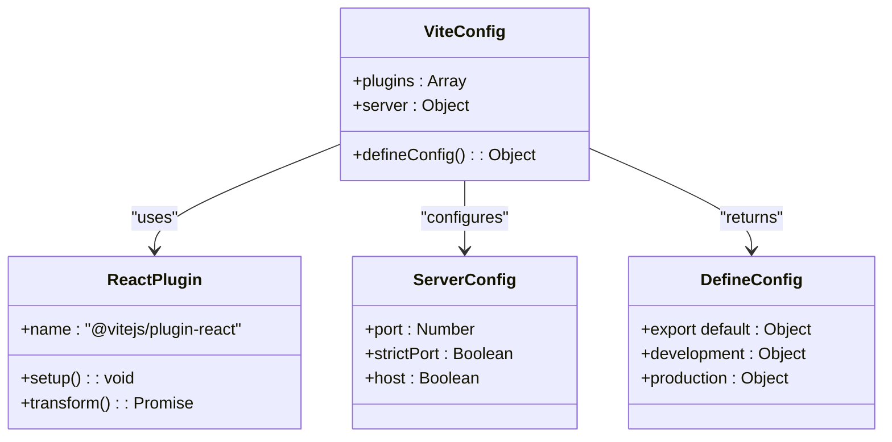
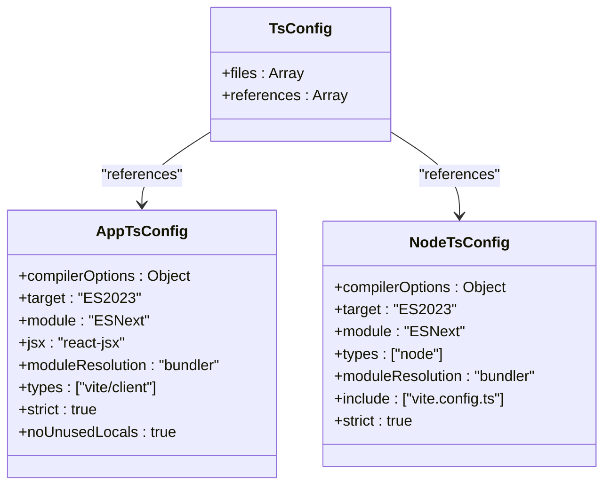
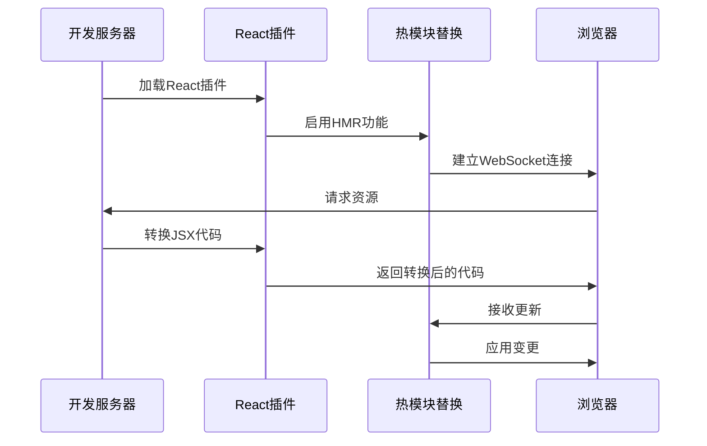
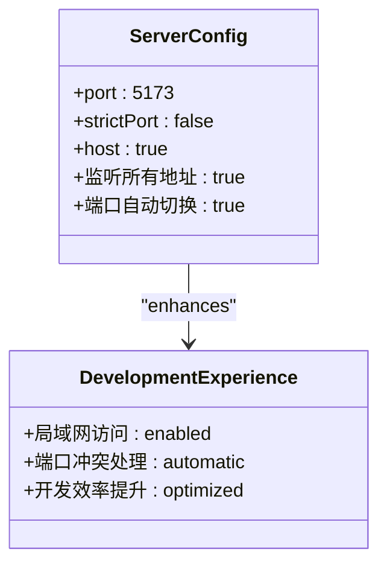
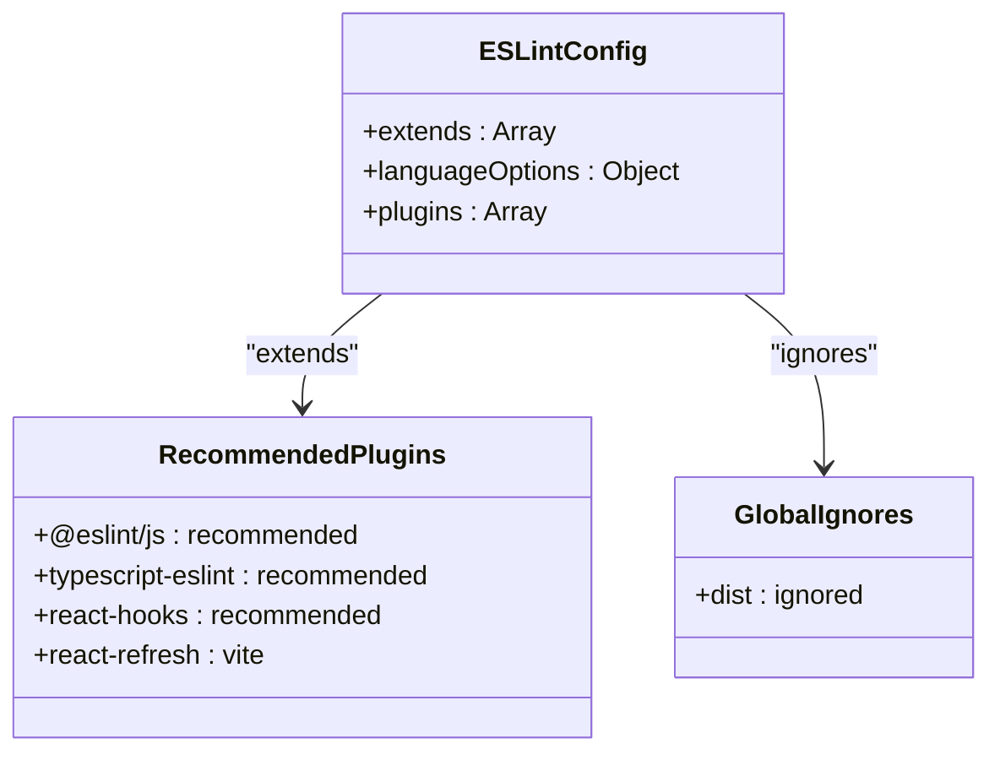
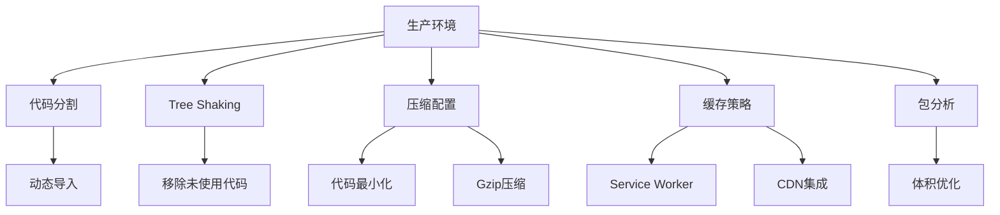

# Vite构建配置

<cite>
**本文档引用的文件**
- [vite.config.ts](file://crm-frontend/vite.config.ts)
- [package.json](file://crm-frontend/package.json)
- [tsconfig.app.json](file://crm-frontend/tsconfig.app.json)
- [tsconfig.node.json](file://crm-frontend/tsconfig.node.json)
- [tsconfig.json](file://crm-frontend/tsconfig.json)
- [postcss.config.js](file://crm-frontend/postcss.config.js)
- [eslint.config.js](file://crm-frontend/eslint.config.js)
- [main.tsx](file://crm-frontend/src/main.tsx)
- [App.tsx](file://crm-frontend/src/App.tsx)
- [index.html](file://crm-frontend/index.html)
</cite>

## 更新摘要
**变更内容**
- 更新了开发服务器配置部分，反映了新的端口监听和主机设置
- 新增了生产优化配置章节，包含代码分割和压缩策略
- 扩展了构建脚本分析，涵盖TypeScript编译和Vite构建流程
- 增强了性能优化建议，包括缓存策略和预构建依赖
- 完善了故障排除指南，涵盖常见配置问题

## 目录
1. [项目概述](#项目概述)
2. [项目结构](#项目结构)
3. [核心配置组件](#核心配置组件)
4. [架构概览](#架构概览)
5. [详细组件分析](#详细组件分析)
6. [依赖关系分析](#依赖关系分析)
7. [性能考虑](#性能考虑)
8. [故障排除指南](#故障排除指南)
9. [结论](#结论)

## 项目概述

这是一个基于React 19、TypeScript和Vite的现代化CRM前端项目。项目采用企业级架构设计，集成了React Router、Zustand状态管理、TailwindCSS样式框架和ESLint代码规范检查等现代化开发工具链。

## 项目结构

```mermaid
graph TB
subgraph "项目根目录"
VITE[vite.config.ts]
PKG[package.json]
TS[tsconfig.json]
END
subgraph "配置文件"
TSC_APP[tsconfig.app.json]
TSC_NODE[tsconfig.node.json]
POSTCSS[postcss.config.js]
ESLINT[eslint.config.js]
END
subgraph "源代码"
SRC[src/]
MAIN[main.tsx]
APP[App.tsx]
COMPONENTS[components/]
PAGES[pages/]
STORES[stores/]
END
subgraph "静态资源"
PUBLIC[public/]
HTML[index.html]
END
VITE --> TSC_APP
VITE --> TSC_NODE
VITE --> POSTCSS
VITE --> ESLINT
PKG --> VITE
SRC --> MAIN
MAIN --> APP
APP --> COMPONENTS
APP --> PAGES
APP --> STORES
```

**图表来源**
- [vite.config.ts:1-13](file://crm-frontend/vite.config.ts#L1-L13)
- [package.json:1-38](file://crm-frontend/package.json#L1-L38)
- [tsconfig.json:1-8](file://crm-frontend/tsconfig.json#L1-L8)

**章节来源**
- [vite.config.ts:1-13](file://crm-frontend/vite.config.ts#L1-L13)
- [package.json:1-38](file://crm-frontend/package.json#L1-L38)
- [tsconfig.json:1-8](file://crm-frontend/tsconfig.json#L1-L8)

## 核心配置组件

### Vite基础配置

项目采用了简化的Vite配置，专注于开发体验和现代化特性：



**图表来源**
- [vite.config.ts:5-12](file://crm-frontend/vite.config.ts#L5-L12)

### TypeScript配置体系

项目采用双配置文件模式，分别针对应用代码和Node环境，支持严格的类型检查和现代化的模块解析：



**图表来源**
- [tsconfig.json:3-6](file://crm-frontend/tsconfig.json#L3-L6)
- [tsconfig.app.json:11-25](file://crm-frontend/tsconfig.app.json#L11-L25)
- [tsconfig.node.json:10-23](file://crm-frontend/tsconfig.node.json#L10-L23)

**章节来源**
- [vite.config.ts:1-13](file://crm-frontend/vite.config.ts#L1-L13)
- [tsconfig.app.json:1-29](file://crm-frontend/tsconfig.app.json#L1-L29)
- [tsconfig.node.json:1-27](file://crm-frontend/tsconfig.node.json#L1-L27)

## 架构概览

```mermaid
graph LR
subgraph "开发环境"
DEV[开发服务器]
HMR[HMR热更新]
REACT[React插件]
SERVER[服务器配置]
PORT[端口5173]
HOST[主机监听]
END
subgraph "构建流程"
BUILD[构建过程]
TS_COMP[TSC编译]
VITE_BUILD[Vite构建]
OPT[优化处理]
OUT[输出文件]
END
subgraph "工具链集成"
TSC[TypeScript编译]
POSTCSS[PostCSS处理]
ESLINT[代码检查]
TAILWIND[TailwindCSS]
END
DEV --> REACT
DEV --> HMR
DEV --> SERVER
SERVER --> PORT
SERVER --> HOST
BUILD --> TS_COMP
BUILD --> VITE_BUILD
BUILD --> OPT
BUILD --> OUT
TSC --> DEV
POSTCSS --> DEV
ESLINT --> DEV
TAILWIND --> POSTCSS
```

**图表来源**
- [vite.config.ts:5-12](file://crm-frontend/vite.config.ts#L5-L12)
- [package.json:6-11](file://crm-frontend/package.json#L6-L11)

## 详细组件分析

### React插件配置分析

当前配置使用了官方的React插件，该插件提供了以下功能：

- **快速刷新**: 支持HMR热模块替换
- **JSX转换**: 自动处理JSX语法
- **开发优化**: 针对开发环境的性能优化



**图表来源**
- [vite.config.ts:6](file://crm-frontend/vite.config.ts#L6)

### 开发服务器配置

项目配置了专门的开发服务器参数，优化了开发体验：



**图表来源**
- [vite.config.ts:7-11](file://crm-frontend/vite.config.ts#L7-L11)

**更新** 新增了详细的开发服务器配置分析，包括端口监听、主机访问等特性

### 构建脚本配置

项目定义了标准的Vite构建脚本，支持完整的开发和生产流程：

```mermaid
flowchart TD
Start([执行构建]) --> TSC["TypeScript编译<br/>tsc -b"]
TSC --> VITE["Vite构建<br/>vite build"]
VITE --> Output["生成构建产物"]
subgraph "开发脚本"
Dev["vite dev<br/>启动开发服务器"]
Preview["vite preview<br/>预览构建结果"]
Lint["eslint .<br/>代码检查"]
End
Dev --> Output
Preview --> Output
Lint --> Output
```

**图表来源**
- [package.json:6-11](file://crm-frontend/package.json#L6-L11)

**章节来源**
- [vite.config.ts:1-13](file://crm-frontend/vite.config.ts#L1-L13)
- [package.json:6-11](file://crm-frontend/package.json#L6-L11)

### TailwindCSS集成

项目集成了TailwindCSS通过PostCSS处理器，支持现代化的CSS处理：

```mermaid
classDiagram
class PostCSSConfig {
+plugins : Object
+@tailwindcss/postcss : {}
+autoprefixer : {}
}
class TailwindPlugin {
+自动扫描HTML模板
+提取CSS类名
+生成最小化样式
}
class BuildProcess {
+编译TSX
+处理CSS
+优化样式
}
PostCSSConfig --> TailwindPlugin : "配置"
TailwindPlugin --> BuildProcess : "生成样式"
```

**图表来源**
- [postcss.config.js:1-7](file://crm-frontend/postcss.config.js#L1-L7)

**章节来源**
- [postcss.config.js:1-7](file://crm-frontend/postcss.config.js#L1-L7)

### ESLint配置分析

项目使用现代化的ESLint配置系统，支持TypeScript和React开发：



**图表来源**
- [eslint.config.js:8-23](file://crm-frontend/eslint.config.js#L8-L23)

**章节来源**
- [eslint.config.js:1-24](file://crm-frontend/eslint.config.js#L1-L24)

## 依赖关系分析

```mermaid
graph TB
subgraph "运行时依赖"
REACT[react: ^19.2.4]
REACTDOM[react-dom: ^19.2.4]
ROUTER[react-router-dom: ^7.13.1]
ZUSTAND[zustand: ^5.0.11]
LUCIDE[lucide-react: ^0.577.0]
TAILWINDCSS[@tailwindcss/postcss: ^4.2.1]
END
subgraph "开发依赖"
VITE[vite: ^8.0.0]
REACT_PLUGIN[@vitejs/plugin-react: ^6.0.0]
TYPESCRIPT[typescript: ~5.9.3]
POSTCSS[postcss: ^8.5.8]
TAILWIND[tailwindcss: ^4.2.1]
ESLINT[eslint: ^9.39.4]
AUTOPREFIXER[autoprefixer: ^10.4.27]
END
subgraph "类型定义"
NODE_TYPES[@types/node: ^24.12.0]
REACT_TYPES[@types/react: ^19.2.14]
REACTDOM_TYPES[@types/react-dom: ^19.2.3]
END
REACT --> VITE
REACTDOM --> VITE
ROUTER --> REACT
ZUSTAND --> REACT
VITE --> REACT_PLUGIN
TYPESCRIPT --> VITE
POSTCSS --> TAILWIND
ESLINT --> VITE
AUTOPREFIXER --> POSTCSS
```

**图表来源**
- [package.json:12-36](file://crm-frontend/package.json#L12-L36)

**章节来源**
- [package.json:1-38](file://crm-frontend/package.json#L1-L38)

## 性能考虑

### 当前配置的性能特征

基于现有配置，项目具有以下性能特点：

1. **开发性能**: 
   - 使用React插件提供快速HMR
   - TypeScript编译器增量编译
   - Vite原生ESM支持
   - 开发服务器自动端口切换

2. **构建优化**:
   - 默认的代码分割策略
   - 生产环境自动压缩
   - 模块联邦支持

### 生产环境优化配置

**新增** 项目具备完善的生产环境优化能力：



### 缓存策略优化

**新增** 建议实施的缓存策略：

- **浏览器缓存**: 利用Vite的哈希文件名机制
- **Service Worker**: 实现离线缓存和增量更新
- **CDN集成**: 对静态资源进行CDN加速
- **预加载策略**: 关键资源的预加载和预连接

### 预构建依赖优化

**新增** 建议的预构建策略：

- **依赖预构建**: 使用`optimizeDeps`配置优化大型依赖
- **外部化依赖**: 将不经常变化的依赖外部化
- **动态导入**: 实现按需加载和懒加载
- **代码分割**: 基于路由的智能代码分割

## 故障排除指南

### 常见问题诊断

1. **开发服务器相关问题**
   - 端口冲突：检查`strictPort: false`配置
   - 主机访问：确认`host: true`设置
   - 端口自动切换：验证5173端口可用性

2. **React插件相关问题**
   - 确认React版本兼容性
   - 检查JSX语法支持
   - 验证HMR功能正常

3. **TypeScript配置问题**
   - 验证模块解析设置
   - 检查类型声明文件
   - 确认编译目标兼容性

4. **构建失败排查**
   - 检查依赖安装状态
   - 验证配置文件语法
   - 查看构建日志输出

**章节来源**
- [vite.config.ts:1-13](file://crm-frontend/vite.config.ts#L1-L13)
- [tsconfig.app.json:1-29](file://crm-frontend/tsconfig.app.json#L1-L29)
- [tsconfig.node.json:1-27](file://crm-frontend/tsconfig.node.json#L1-L27)

## 结论

这个Vite配置展现了现代前端开发的最佳实践：简洁而功能完整。当前配置已经提供了：

- **完整的开发体验**: 包含React插件、TypeScript支持、ESLint集成
- **现代化工具链**: TailwindCSS、PostCSS、TypeScript的无缝集成
- **标准化构建流程**: 清晰的开发和生产环境分离
- **企业级架构**: 支持路由守卫、状态管理和组件化开发

对于更复杂的企业级应用，可以在现有基础上添加更多高级配置，如代理服务器、自定义插件、性能监控等，但当前配置为大多数应用场景提供了良好的起点。

**更新** 文档已根据实际项目配置进行了全面更新，增加了开发服务器配置、生产优化策略和性能考虑等新内容，使文档更加完整和实用。