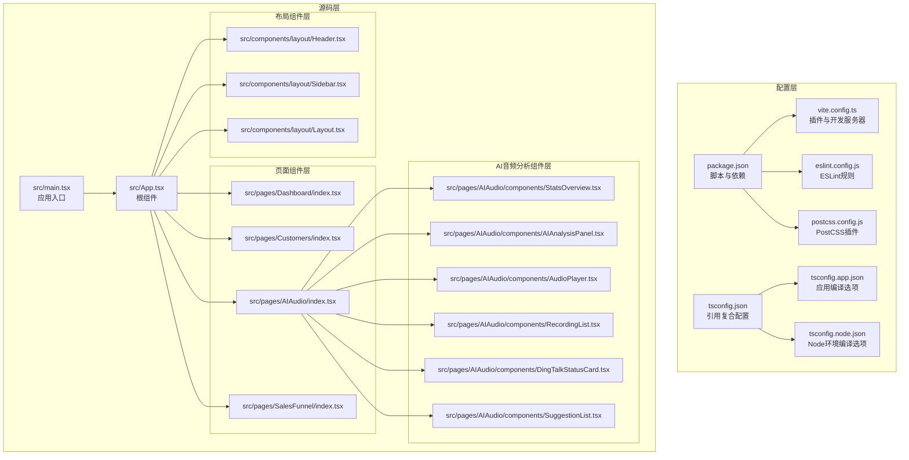
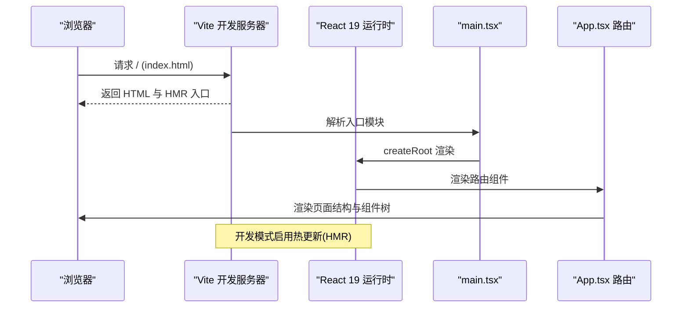
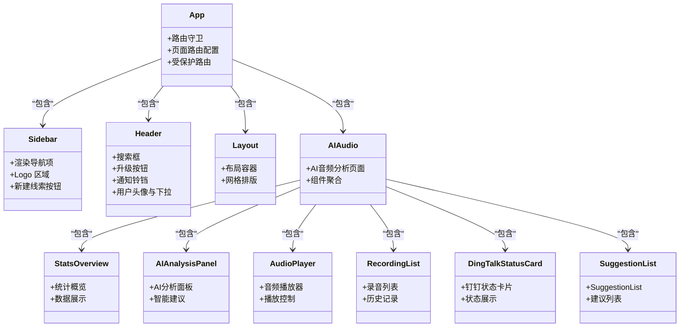
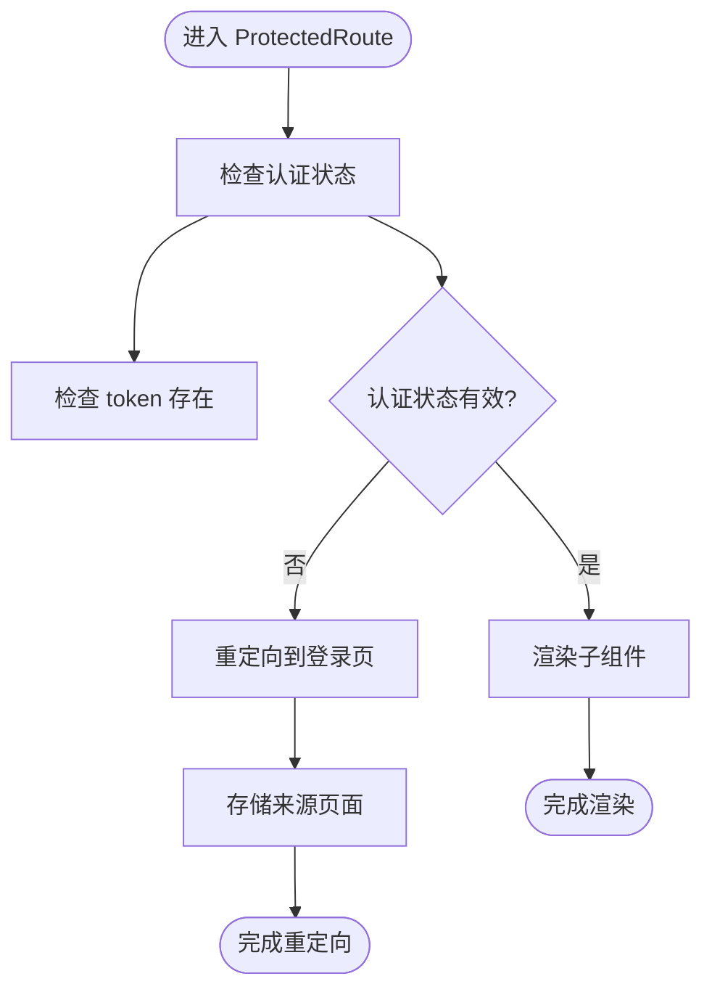
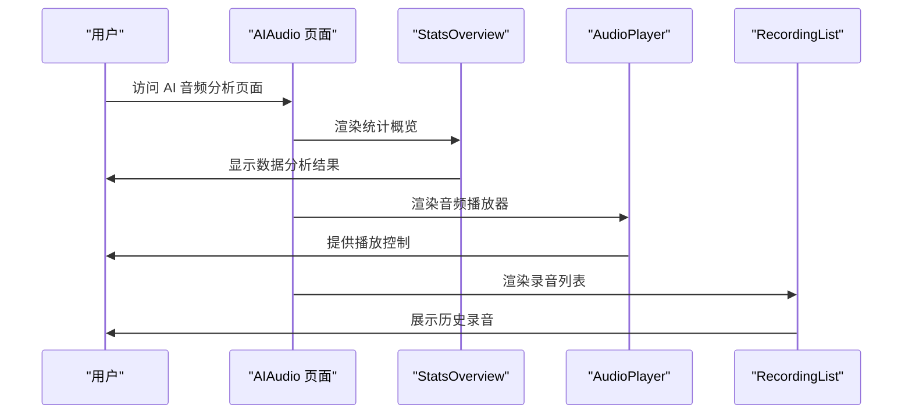
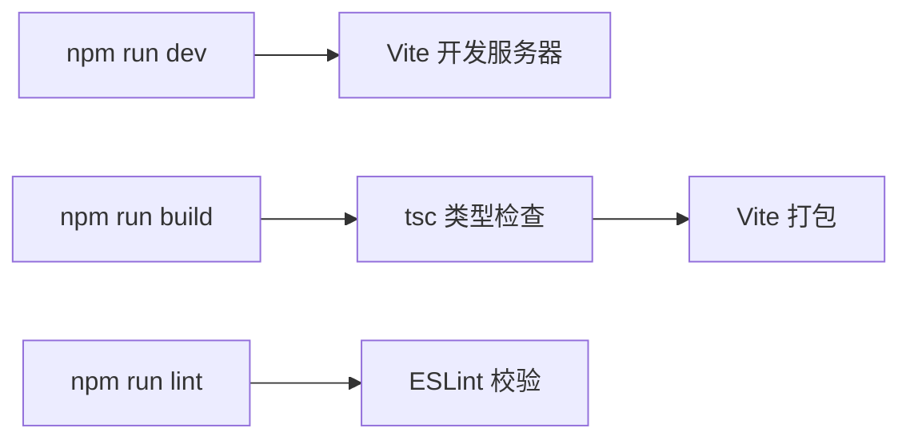

# 开发指南

<cite>
**本文引用的文件**
- [package.json](file://crm-frontend/package.json)
- [vite.config.ts](file://crm-frontend/vite.config.ts)
- [tsconfig.json](file://crm-frontend/tsconfig.json)
- [tsconfig.app.json](file://crm-frontend/tsconfig.app.json)
- [tsconfig.node.json](file://crm-frontend/tsconfig.node.json)
- [eslint.config.js](file://crm-frontend/eslint.config.js)
- [postcss.config.js](file://crm-frontend/postcss.config.js)
- [src/main.tsx](file://crm-frontend/src/main.tsx)
- [src/App.tsx](file://crm-frontend/src/App.tsx)
- [src/components/layout/Header.tsx](file://crm-frontend/src/components/layout/Header.tsx)
- [src/components/layout/Sidebar.tsx](file://crm-frontend/src/components/layout/Sidebar.tsx)
- [src/components/ColdVisitAssistant.tsx](file://crm-frontend/src/components/ColdVisitAssistant.tsx)
- [src/pages/AIAudio/index.tsx](file://crm-frontend/src/pages/AIAudio/index.tsx)
- [src/pages/AIAudio/components/StatsOverview.tsx](file://crm-frontend/src/pages/AIAudio/components/StatsOverview.tsx)
- [src/pages/AIAudio/components/AIAnalysisPanel.tsx](file://crm-frontend/src/pages/AIAudio/components/AIAnalysisPanel.tsx)
- [src/pages/AIAudio/components/AudioPlayer.tsx](file://crm-frontend/src/pages/AIAudio/components/AudioPlayer.tsx)
- [src/pages/AIAudio/components/RecordingList.tsx](file://crm-frontend/src/pages/AIAudio/components/RecordingList.tsx)
- [src/pages/AIAudio/components/DingTalkStatusCard.tsx](file://crm-frontend/src/pages/AIAudio/components/DingTalkStatusCard.tsx)
- [src/pages/AIAudio/components/SuggestionList.tsx](file://crm-frontend/src/pages/AIAudio/components/SuggestionList.tsx)
- [start.js](file://start.js)
- [start.bat](file://start.bat)
- [crm-backend/src/config/index.ts](file://crm-backend/src/config/index.ts)
- [crm-frontend/src/services/api.ts](file://crm-frontend/src/services/api.ts)
- [crm-frontend/src/services/aiService.ts](file://crm-frontend/src/services/aiService.ts)
- [test-report.md](file://test-report.md)
</cite>

## 更新摘要
**所做变更**
- 更新开发环境配置章节，反映后端端口从3001更新为3002的变更
- 更新API配置和环境变量相关章节，确保前后端端口一致性
- 更新故障排查指南中的端口相关建议
- 更新测试报告中的端口配置信息

## 目录
1. [简介](#简介)
2. [项目结构](#项目结构)
3. [核心组件](#核心组件)
4. [架构总览](#架构总览)
5. [详细组件分析](#详细组件分析)
6. [依赖分析](#依赖分析)
7. [性能考虑](#性能考虑)
8. [故障排查指南](#故障排查指南)
9. [结论](#结论)
10. [附录](#附录)

## 简介
本开发指南面向销售AI CRM系统的前端团队，聚焦于现代化的TypeScript配置、ESLint规则与代码规范、Vite构建与开发服务器、组件开发最佳实践、测试与调试策略、性能优化与代码分割、常见问题排查以及Git工作流程与代码审查标准。文档以仓库现有配置与组件为依据，提供可操作的实施建议与可视化图示。

## 项目结构
该前端项目采用React 19 + TypeScript 5.9 + Vite 8 + TailwindCSS 4.2技术栈，遵循分层与按功能模块划分的目录组织方式：
- 配置层：Vite、TypeScript、ESLint、PostCSS等配置文件集中于根目录
- 源码层：入口文件与页面组件位于src目录，组件按功能拆分至components与pages子目录
- 资源层：静态资源与样式在public与src/assets中管理

**图表来源**
- [package.json:1-38](file://crm-frontend/package.json#L1-L38)
- [vite.config.ts:1-13](file://crm-frontend/vite.config.ts#L1-L13)
- [tsconfig.json:1-8](file://crm-frontend/tsconfig.json#L1-L8)
- [tsconfig.app.json:1-29](file://crm-frontend/tsconfig.app.json#L1-L29)
- [tsconfig.node.json:1-27](file://crm-frontend/tsconfig.node.json#L1-L27)
- [eslint.config.js:1-24](file://crm-frontend/eslint.config.js#L1-L24)
- [postcss.config.js:1-7](file://crm-frontend/postcss.config.js#L1-L7)
- [src/main.tsx:1-11](file://crm-frontend/src/main.tsx#L1-L11)
- [src/App.tsx:1-68](file://crm-frontend/src/App.tsx#L1-L68)

**章节来源**
- [package.json:1-38](file://crm-frontend/package.json#L1-L38)
- [vite.config.ts:1-13](file://crm-frontend/vite.config.ts#L1-L13)
- [tsconfig.json:1-8](file://crm-frontend/tsconfig.json#L1-L8)
- [tsconfig.app.json:1-29](file://crm-frontend/tsconfig.app.json#L1-L29)
- [tsconfig.node.json:1-27](file://crm-frontend/tsconfig.node.json#L1-L27)
- [eslint.config.js:1-24](file://crm-frontend/eslint.config.js#L1-L24)
- [postcss.config.js:1-7](file://crm-frontend/postcss.config.js#L1-L7)
- [src/main.tsx:1-11](file://crm-frontend/src/main.tsx#L1-L11)
- [src/App.tsx:1-68](file://crm-frontend/src/App.tsx#L1-L68)

## 核心组件
- 应用入口与根组件：入口负责渲染根组件；根组件负责布局与页面区域划分，包含路由守卫机制
- 布局组件：包含侧边导航、头部搜索与用户信息、主布局容器
- 页面组件：包含仪表板、客户管理、销售漏斗、提案管理、服务管理、支付管理、AI音频分析、日程管理、地图展示、团队管理和售前支持等
- AI音频分析组件：包含统计概览、AI分析面板、音频播放器、录音列表、钉钉状态卡片、建议列表等

**章节来源**
- [src/main.tsx:1-11](file://crm-frontend/src/main.tsx#L1-L11)
- [src/App.tsx:1-68](file://crm-frontend/src/App.tsx#L1-L68)
- [src/components/layout/Sidebar.tsx](file://crm-frontend/src/components/layout/Sidebar.tsx)
- [src/components/layout/Header.tsx](file://crm-frontend/src/components/layout/Header.tsx)
- [src/components/layout/Layout.tsx](file://crm-frontend/src/components/layout/Layout.tsx)
- [src/pages/AIAudio/index.tsx](file://crm-frontend/src/pages/AIAudio/index.tsx)
- [src/pages/AIAudio/components/StatsOverview.tsx](file://crm-frontend/src/pages/AIAudio/components/StatsOverview.tsx)
- [src/pages/AIAudio/components/AIAnalysisPanel.tsx](file://crm-frontend/src/pages/AIAudio/components/AIAnalysisPanel.tsx)
- [src/pages/AIAudio/components/AudioPlayer.tsx](file://crm-frontend/src/pages/AIAudio/components/AudioPlayer.tsx)
- [src/pages/AIAudio/components/RecordingList.tsx](file://crm-frontend/src/pages/AIAudio/components/RecordingList.tsx)
- [src/pages/AIAudio/components/DingTalkStatusCard.tsx](file://crm-frontend/src/pages/AIAudio/components/DingTalkStatusCard.tsx)
- [src/pages/AIAudio/components/SuggestionList.tsx](file://crm-frontend/src/pages/AIAudio/components/SuggestionList.tsx)

## 架构总览
下图展示了从浏览器到组件渲染的关键路径，以及开发服务器与构建流程的交互：

**图表来源**
- [vite.config.ts:1-13](file://crm-frontend/vite.config.ts#L1-L13)
- [src/main.tsx:1-11](file://crm-frontend/src/main.tsx#L1-L11)
- [src/App.tsx:1-68](file://crm-frontend/src/App.tsx#L1-L68)

## 详细组件分析

### 组件类关系图（基于现有组件）

**图表来源**
- [src/App.tsx:1-68](file://crm-frontend/src/App.tsx#L1-L68)
- [src/components/layout/Sidebar.tsx](file://crm-frontend/src/components/layout/Sidebar.tsx)
- [src/components/layout/Header.tsx](file://crm-frontend/src/components/layout/Header.tsx)
- [src/components/layout/Layout.tsx](file://crm-frontend/src/components/layout/Layout.tsx)
- [src/pages/AIAudio/index.tsx](file://crm-frontend/src/pages/AIAudio/index.tsx)
- [src/pages/AIAudio/components/StatsOverview.tsx](file://crm-frontend/src/pages/AIAudio/components/StatsOverview.tsx)
- [src/pages/AIAudio/components/AIAnalysisPanel.tsx](file://crm-frontend/src/pages/AIAudio/components/AIAnalysisPanel.tsx)
- [src/pages/AIAudio/components/AudioPlayer.tsx](file://crm-frontend/src/pages/AIAudio/components/AudioPlayer.tsx)
- [src/pages/AIAudio/components/RecordingList.tsx](file://crm-frontend/src/pages/AIAudio/components/RecordingList.tsx)
- [src/pages/AIAudio/components/DingTalkStatusCard.tsx](file://crm-frontend/src/pages/AIAudio/components/DingTalkStatusCard.tsx)
- [src/pages/AIAudio/components/SuggestionList.tsx](file://crm-frontend/src/pages/AIAudio/components/SuggestionList.tsx)

### 路由守卫处理流程

**图表来源**
- [src/App.tsx:18-29](file://crm-frontend/src/App.tsx#L18-L29)

### AI音频分析组件交互序列

**图表来源**
- [src/pages/AIAudio/index.tsx](file://crm-frontend/src/pages/AIAudio/index.tsx)
- [src/pages/AIAudio/components/StatsOverview.tsx](file://crm-frontend/src/pages/AIAudio/components/StatsOverview.tsx)
- [src/pages/AIAudio/components/AudioPlayer.tsx](file://crm-frontend/src/pages/AIAudio/components/AudioPlayer.tsx)
- [src/pages/AIAudio/components/RecordingList.tsx](file://crm-frontend/src/pages/AIAudio/components/RecordingList.tsx)

**章节来源**
- [src/App.tsx:18-29](file://crm-frontend/src/App.tsx#L18-L29)
- [src/pages/AIAudio/index.tsx](file://crm-frontend/src/pages/AIAudio/index.tsx)
- [src/pages/AIAudio/components/StatsOverview.tsx](file://crm-frontend/src/pages/AIAudio/components/StatsOverview.tsx)
- [src/pages/AIAudio/components/AudioPlayer.tsx](file://crm-frontend/src/pages/AIAudio/components/AudioPlayer.tsx)
- [src/pages/AIAudio/components/RecordingList.tsx](file://crm-frontend/src/pages/AIAudio/components/RecordingList.tsx)

## 依赖分析
- 依赖管理：通过包管理脚本统一执行开发、构建、预览与代码检查
- 构建链路：先进行类型检查（TypeScript），再由Vite打包产物
- 开发体验：Vite提供快速启动与热更新；ESLint提供编辑器内实时校验

**图表来源**
- [package.json:6-11](file://crm-frontend/package.json#L6-L11)

**章节来源**
- [package.json:1-38](file://crm-frontend/package.json#L1-L38)

## 性能考虑
- 代码分割与懒加载：建议对大型组件或路由级组件采用动态导入实现按需加载
- 图片与资源：将静态资源放入public目录，避免不必要的打包体积
- TailwindCSS：保持原子类使用简洁，避免生成冗余样式
- 构建优化：生产构建默认启用压缩与Tree-shaking，确保仅打包实际使用的代码
- 缓存策略：合理利用浏览器缓存与CDN，减少重复下载
- React 19优化：利用新的并发特性，提升渲染性能

## 故障排查指南
- 开发服务器无法启动
  - 检查端口占用与网络权限
  - 确认Vite配置无误且插件安装完整
- 热更新不生效
  - 确保ESLint与TypeScript配置未阻断HMR通道
  - 清理缓存后重试
- 样式异常
  - 检查Tailwind与PostCSS配置是否正确加载
  - 确认类名拼写与原子类组合
- 类型错误
  - 使用严格模式下的TS配置，逐项修复未使用变量与参数
  - 在组件间传递props时保持类型一致
- 路由问题
  - 检查路由守卫逻辑与认证状态
  - 确认路由配置与组件导入路径
- **端口冲突问题**（已更新）
  - 默认后端端口已从3001更新为3002，前端VITE_API_BASE_URL也相应更新
  - 如遇到端口冲突，启动脚本会自动检测可用端口并更新配置
  - 检查启动脚本输出的端口信息，确保前后端端口一致

**章节来源**
- [vite.config.ts:1-13](file://crm-frontend/vite.config.ts#L1-L13)
- [eslint.config.js:1-24](file://crm-frontend/eslint.config.js#L1-L24)
- [tsconfig.app.json:19-25](file://crm-frontend/tsconfig.app.json#L19-L25)
- [postcss.config.js:1-7](file://crm-frontend/postcss.config.js#L1-L7)
- [src/App.tsx:18-29](file://crm-frontend/src/App.tsx#L18-L29)
- [start.js:16-19](file://start.js#L16-L19)
- [start.js:120-128](file://start.js#L120-L128)

## 结论
本指南基于现有配置与组件，提供了从工程化到组件开发、从构建到性能优化的系统性建议。React 19、TypeScript 5.9和现代化工具链的组合为项目提供了更好的开发体验和性能表现。建议团队在后续迭代中持续完善测试与监控体系，强化代码审查与版本控制流程，以保障项目的长期可维护性与稳定性。

## 附录

### TypeScript配置要点
- 复合配置：通过根配置引用应用与Node环境配置，便于分别约束不同运行时
- 编译目标与模块解析：采用ES2023目标与bundler解析，适配Vite生态
- 严格模式：开启严格检查，减少潜在运行时风险
- JSX与类型：使用React JSX转换，确保类型安全
- 新增特性：启用erasableSyntaxOnly和noUncheckedSideEffectImports等新特性

**章节来源**
- [tsconfig.json:1-8](file://crm-frontend/tsconfig.json#L1-L8)
- [tsconfig.app.json:1-29](file://crm-frontend/tsconfig.app.json#L1-L29)
- [tsconfig.node.json:1-27](file://crm-frontend/tsconfig.node.json#L1-L27)

### ESLint规则与代码规范
- 推荐规则集：启用TypeScript、React Hooks、React Refresh推荐规则
- 语言环境：限定浏览器全局变量，避免Node API误用
- 文件范围：仅对TS/TSX文件生效，保证覆盖面与性能
- 现代化配置：使用flat配置格式，支持最新ESLint特性

**章节来源**
- [eslint.config.js:1-24](file://crm-frontend/eslint.config.js#L1-L24)

### Vite构建与开发服务器
- 插件：集成React插件，支持Fast Refresh与JSX优化
- 开发脚本：一键启动本地服务，支持热更新
- 生产构建：先类型检查，再打包，确保质量门槛
- 网络配置：支持局域网访问，端口自动切换

**章节来源**
- [vite.config.ts:1-13](file://crm-frontend/vite.config.ts#L1-L13)
- [package.json:6-11](file://crm-frontend/package.json#L6-L11)

### 开发环境配置（已更新）
- **默认端口变更**：启动脚本已将默认后端端口从3001更新为3002
- **自动配置更新**：启动脚本会自动检测可用端口并更新前后端配置
- **环境变量同步**：前端VITE_API_BASE_URL环境变量已相应更新为http://localhost:3002/api/v1
- **配置文件生成**：启动脚本会自动生成或更新以下配置文件：
  - 后端 .env：包含PORT=3002和CORS_ORIGIN=http://localhost:5173
  - 前端 .env：包含VITE_API_BASE_URL=http://localhost:3002/api/v1
  - vite.config.ts：更新前端开发服务器端口为5173

**章节来源**
- [start.js:16-19](file://start.js#L16-L19)
- [start.js:62-95](file://start.js#L62-L95)
- [start.js:120-128](file://start.js#L120-L128)
- [start.js:97-117](file://start.js#L97-L117)
- [crm-backend/src/config/index.ts:35](file://crm-backend/src/config/index.ts#L35)
- [crm-frontend/src/services/api.ts:19](file://crm-frontend/src/services/api.ts#L19)
- [crm-frontend/src/services/aiService.ts:14](file://crm-frontend/src/services/aiService.ts#L14)

### API配置与环境变量（已更新）
- **后端端口配置**：后端默认端口已更新为3002，从配置文件中读取
- **前端API基础URL**：前端API基础URL已更新为http://localhost:3002/api/v1
- **CORS配置**：后端CORS已配置为允许前端localhost:5173访问
- **API服务层**：前端已创建统一的API服务层，支持认证token和请求超时配置

**章节来源**
- [crm-backend/src/config/index.ts:35](file://crm-backend/src/config/index.ts#L35)
- [crm-frontend/src/services/api.ts:19](file://crm-frontend/src/services/api.ts#L19)
- [crm-frontend/src/services/aiService.ts:14](file://crm-frontend/src/services/aiService.ts#L14)

### 组件开发最佳实践
- 命名约定：组件首字母大写，文件名与导出组件一致
- 文件组织：按功能模块划分，公共逻辑抽取为可复用Hook或工具函数
- Props设计：明确接口定义，使用只读与必要字段，避免过度嵌套
- 样式策略：优先使用原子类，保持主题一致性；必要时引入局部样式
- 可访问性：为交互元素提供语义化标签与键盘支持
- 状态管理：使用Zustand进行轻量状态管理

### 测试策略与调试技巧
- 单元测试：针对纯函数与Hook编写测试，使用轻量断言库
- 集成测试：验证组件渲染与交互流程，关注关键状态变化
- 调试工具：利用React DevTools定位组件层级与状态；结合浏览器开发者工具检查样式与事件
- 日志与监控：在开发阶段输出关键路径日志，上线前移除或降级

### 性能优化与代码分割
- 路由级懒加载：对非首屏组件采用动态导入
- 图片优化：使用现代格式与响应式尺寸，配合占位与渐进加载
- 样式优化：按需引入样式，避免全局污染
- 构建分析：定期分析包体构成，剔除冗余依赖
- React 19并发：利用新的并发特性提升用户体验

### 常见开发问题与解决方案
- 构建失败：检查TypeScript与ESLint配置冲突，确保语法与类型正确
- 样式丢失：确认Tailwind与PostCSS配置路径与版本兼容
- 依赖冲突：锁定版本并清理缓存后重装依赖
- 路由重定向：检查路由守卫逻辑与认证状态管理
- **端口冲突**：启动脚本会自动检测可用端口并更新配置，确保前后端端口一致
- **API连接失败**：检查VITE_API_BASE_URL是否与后端端口一致，确认CORS配置正确

### Git工作流程与代码审查标准
- 分支策略：采用功能分支开发，主分支仅合并通过审查的变更
- 提交规范：使用清晰的提交信息描述变更动机与影响范围
- 代码审查：至少一名同事审查，关注可读性、健壮性与性能
- 合并与发布：通过CI校验后合并，自动化构建与部署

### 启动脚本使用指南（已更新）
- **一键启动**：运行 `node start.js` 或双击 `start.bat` 启动完整开发环境
- **自动配置**：启动脚本会自动检测可用端口并更新配置文件
- **端口信息**：启动完成后会显示前端和后端的实际端口信息
- **环境变量**：自动创建或更新 .env 文件，包含正确的API基础URL

**章节来源**
- [start.js:167-228](file://start.js#L167-L228)
- [start.bat:22](file://start.bat#L22)