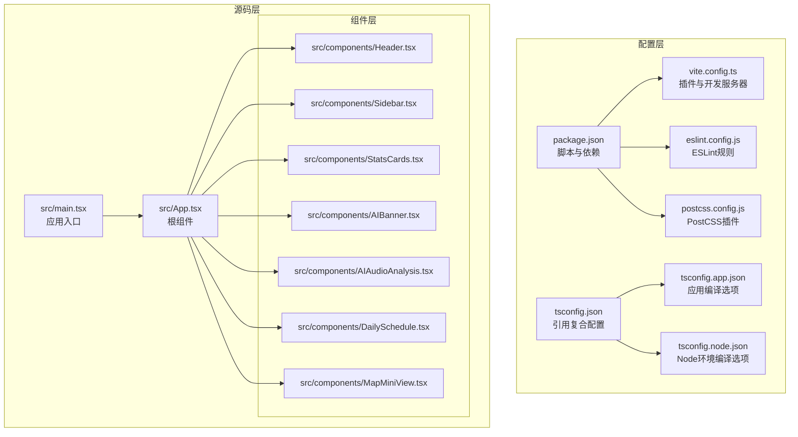
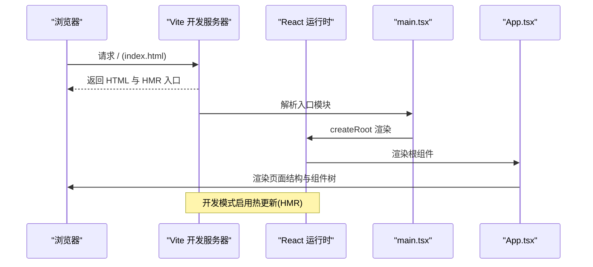
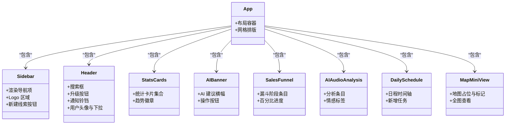
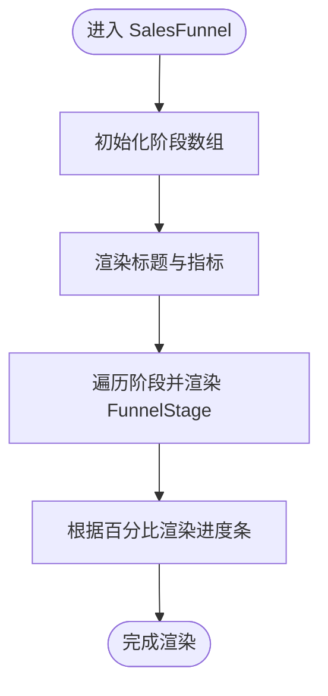
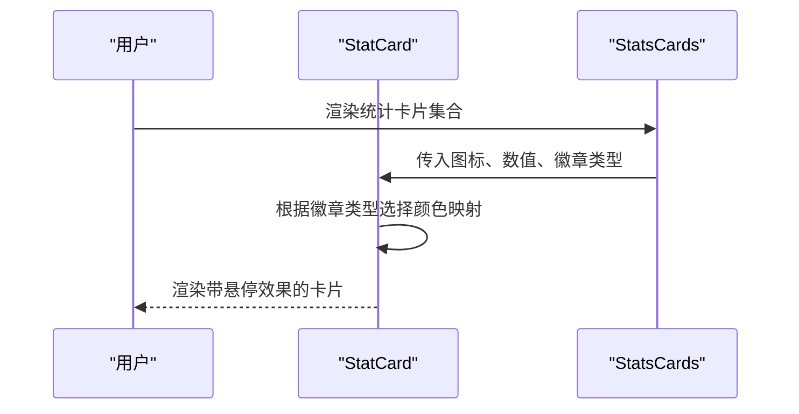
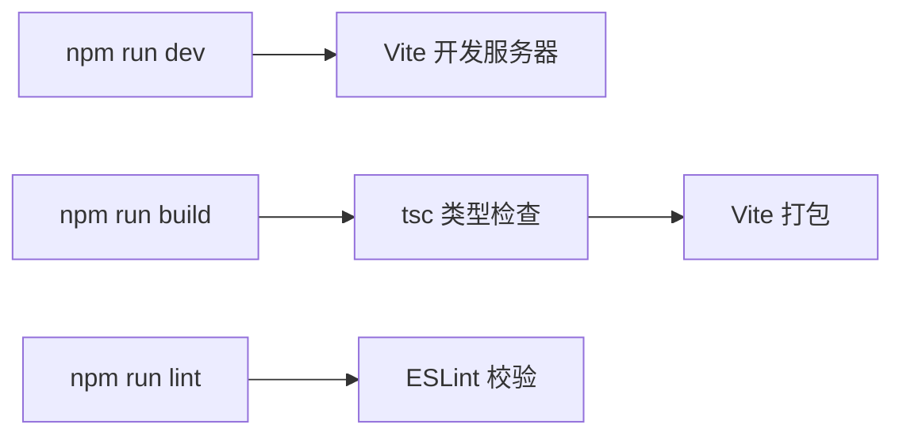

# 开发指南

<cite>
**本文引用的文件**
- [package.json](file://crm-frontend/package.json)
- [vite.config.ts](file://crm-frontend/vite.config.ts)
- [tsconfig.json](file://crm-frontend/tsconfig.json)
- [tsconfig.app.json](file://crm-frontend/tsconfig.app.json)
- [tsconfig.node.json](file://crm-frontend/tsconfig.node.json)
- [eslint.config.js](file://crm-frontend/eslint.config.js)
- [postcss.config.js](file://crm-frontend/postcss.config.js)
- [src/main.tsx](file://crm-frontend/src/main.tsx)
- [src/App.tsx](file://crm-frontend/src/App.tsx)
- [src/components/Header.tsx](file://crm-frontend/src/components/Header.tsx)
- [src/components/Sidebar.tsx](file://crm-frontend/src/components/Sidebar.tsx)
- [src/components/StatsCards.tsx](file://crm-frontend/src/components/StatsCards.tsx)
- [src/components/AIBanner.tsx](file://crm-frontend/src/components/AIBanner.tsx)
- [src/components/AIAudioAnalysis.tsx](file://crm-frontend/src/components/AIAudioAnalysis.tsx)
- [src/components/DailySchedule.tsx](file://crm-frontend/src/components/DailySchedule.tsx)
- [src/components/MapMiniView.tsx](file://crm-frontend/src/components/MapMiniView.tsx)
</cite>

## 目录
1. [简介](#简介)
2. [项目结构](#项目结构)
3. [核心组件](#核心组件)
4. [架构总览](#架构总览)
5. [详细组件分析](#详细组件分析)
6. [依赖分析](#依赖分析)
7. [性能考虑](#性能考虑)
8. [故障排查指南](#故障排查指南)
9. [结论](#结论)
10. [附录](#附录)

## 简介
本开发指南面向销售AI CRM系统的前端团队，聚焦于TypeScript配置、ESLint规则与代码规范、Vite构建与开发服务器、组件开发最佳实践、测试与调试策略、性能优化与代码分割、常见问题排查以及Git工作流程与代码审查标准。文档以仓库现有配置与组件为依据，提供可操作的实施建议与可视化图示。

## 项目结构
该前端项目采用React + TypeScript + Vite + TailwindCSS技术栈，遵循分层与按功能模块划分的目录组织方式：
- 配置层：Vite、TypeScript、ESLint、PostCSS等配置文件集中于根目录
- 源码层：入口文件与页面组件位于src目录，组件按功能拆分至components子目录
- 资源层：静态资源与样式在public与src/assets中管理（当前仓库未包含assets目录内容）

图表来源
- [package.json:1-36](file://crm-frontend/package.json#L1-L36)
- [vite.config.ts:1-8](file://crm-frontend/vite.config.ts#L1-L8)
- [tsconfig.json:1-8](file://crm-frontend/tsconfig.json#L1-L8)
- [tsconfig.app.json:1-29](file://crm-frontend/tsconfig.app.json#L1-L29)
- [tsconfig.node.json:1-27](file://crm-frontend/tsconfig.node.json#L1-L27)
- [eslint.config.js:1-24](file://crm-frontend/eslint.config.js#L1-L24)
- [postcss.config.js:1-6](file://crm-frontend/postcss.config.js#L1-L6)
- [src/main.tsx:1-11](file://crm-frontend/src/main.tsx#L1-L11)
- [src/App.tsx:1-58](file://crm-frontend/src/App.tsx#L1-L58)
- [src/components/Header.tsx:1-53](file://crm-frontend/src/components/Header.tsx#L1-L53)
- [src/components/Sidebar.tsx:1-86](file://crm-frontend/src/components/Sidebar.tsx#L1-L86)
- [src/components/StatsCards.tsx:1-81](file://crm-frontend/src/components/StatsCards.tsx#L1-L81)
- [src/components/AIBanner.tsx:1-47](file://crm-frontend/src/components/AIBanner.tsx#L1-L47)
- [src/components/AIAudioAnalysis.tsx:1-82](file://crm-frontend/src/components/AIAudioAnalysis.tsx#L1-L82)
- [src/components/DailySchedule.tsx:1-70](file://crm-frontend/src/components/DailySchedule.tsx#L1-L70)
- [src/components/MapMiniView.tsx:1-58](file://crm-frontend/src/components/MapMiniView.tsx#L1-L58)

章节来源
- [package.json:1-36](file://crm-frontend/package.json#L1-L36)
- [vite.config.ts:1-8](file://crm-frontend/vite.config.ts#L1-L8)
- [tsconfig.json:1-8](file://crm-frontend/tsconfig.json#L1-L8)
- [tsconfig.app.json:1-29](file://crm-frontend/tsconfig.app.json#L1-L29)
- [tsconfig.node.json:1-27](file://crm-frontend/tsconfig.node.json#L1-L27)
- [eslint.config.js:1-24](file://crm-frontend/eslint.config.js#L1-L24)
- [postcss.config.js:1-6](file://crm-frontend/postcss.config.js#L1-L6)
- [src/main.tsx:1-11](file://crm-frontend/src/main.tsx#L1-L11)
- [src/App.tsx:1-58](file://crm-frontend/src/App.tsx#L1-L58)

## 核心组件
- 应用入口与根组件：入口负责渲染根组件；根组件负责布局与页面区域划分
- 功能组件：包含侧边导航、头部搜索与用户信息、统计卡片、AI横幅、销售漏斗、AI音频分析、日程与地图视图等

章节来源
- [src/main.tsx:1-11](file://crm-frontend/src/main.tsx#L1-L11)
- [src/App.tsx:1-58](file://crm-frontend/src/App.tsx#L1-L58)
- [src/components/Sidebar.tsx:1-86](file://crm-frontend/src/components/Sidebar.tsx#L1-L86)
- [src/components/Header.tsx:1-53](file://crm-frontend/src/components/Header.tsx#L1-L53)
- [src/components/StatsCards.tsx:1-81](file://crm-frontend/src/components/StatsCards.tsx#L1-L81)
- [src/components/AIBanner.tsx:1-47](file://crm-frontend/src/components/AIBanner.tsx#L1-L47)
- [src/components/SalesFunnel.tsx:1-66](file://crm-frontend/src/components/SalesFunnel.tsx#L1-L66)
- [src/components/AIAudioAnalysis.tsx:1-82](file://crm-frontend/src/components/AIAudioAnalysis.tsx#L1-L82)
- [src/components/DailySchedule.tsx:1-70](file://crm-frontend/src/components/DailySchedule.tsx#L1-L70)
- [src/components/MapMiniView.tsx:1-58](file://crm-frontend/src/components/MapMiniView.tsx#L1-L58)

## 架构总览
下图展示了从浏览器到组件渲染的关键路径，以及开发服务器与构建流程的交互：

图表来源
- [vite.config.ts:1-8](file://crm-frontend/vite.config.ts#L1-L8)
- [src/main.tsx:1-11](file://crm-frontend/src/main.tsx#L1-L11)
- [src/App.tsx:1-58](file://crm-frontend/src/App.tsx#L1-L58)

## 详细组件分析

### 组件类关系图（基于现有组件）

图表来源
- [src/App.tsx:1-58](file://crm-frontend/src/App.tsx#L1-L58)
- [src/components/Sidebar.tsx:1-86](file://crm-frontend/src/components/Sidebar.tsx#L1-L86)
- [src/components/Header.tsx:1-53](file://crm-frontend/src/components/Header.tsx#L1-L53)
- [src/components/StatsCards.tsx:1-81](file://crm-frontend/src/components/StatsCards.tsx#L1-L81)
- [src/components/AIBanner.tsx:1-47](file://crm-frontend/src/components/AIBanner.tsx#L1-L47)
- [src/components/SalesFunnel.tsx:1-66](file://crm-frontend/src/components/SalesFunnel.tsx#L1-L66)
- [src/components/AIAudioAnalysis.tsx:1-82](file://crm-frontend/src/components/AIAudioAnalysis.tsx#L1-L82)
- [src/components/DailySchedule.tsx:1-70](file://crm-frontend/src/components/DailySchedule.tsx#L1-L70)
- [src/components/MapMiniView.tsx:1-58](file://crm-frontend/src/components/MapMiniView.tsx#L1-L58)

章节来源
- [src/App.tsx:1-58](file://crm-frontend/src/App.tsx#L1-L58)
- [src/components/Sidebar.tsx:1-86](file://crm-frontend/src/components/Sidebar.tsx#L1-L86)
- [src/components/Header.tsx:1-53](file://crm-frontend/src/components/Header.tsx#L1-L53)
- [src/components/StatsCards.tsx:1-81](file://crm-frontend/src/components/StatsCards.tsx#L1-L81)
- [src/components/AIBanner.tsx:1-47](file://crm-frontend/src/components/AIBanner.tsx#L1-L47)
- [src/components/AIAudioAnalysis.tsx:1-82](file://crm-frontend/src/components/AIAudioAnalysis.tsx#L1-L82)
- [src/components/DailySchedule.tsx:1-70](file://crm-frontend/src/components/DailySchedule.tsx#L1-L70)
- [src/components/MapMiniView.tsx:1-58](file://crm-frontend/src/components/MapMiniView.tsx#L1-L58)

### 销售漏斗组件处理流程

图表来源
- [src/components/SalesFunnel.tsx:1-66](file://crm-frontend/src/components/SalesFunnel.tsx#L1-L66)

章节来源
- [src/components/SalesFunnel.tsx:1-66](file://crm-frontend/src/components/SalesFunnel.tsx#L1-L66)

### 统计卡片组件交互序列

图表来源
- [src/components/StatsCards.tsx:1-81](file://crm-frontend/src/components/StatsCards.tsx#L1-L81)

章节来源
- [src/components/StatsCards.tsx:1-81](file://crm-frontend/src/components/StatsCards.tsx#L1-L81)

## 依赖分析
- 依赖管理：通过包管理脚本统一执行开发、构建、预览与代码检查
- 构建链路：先进行类型检查（TypeScript），再由Vite打包产物
- 开发体验：Vite提供快速启动与热更新；ESLint提供编辑器内实时校验

图表来源
- [package.json:6-11](file://crm-frontend/package.json#L6-L11)

章节来源
- [package.json:1-36](file://crm-frontend/package.json#L1-L36)

## 性能考虑
- 代码分割与懒加载：建议对大型组件或路由级组件采用动态导入实现按需加载
- 图片与资源：将静态资源放入public目录，避免不必要的打包体积
- TailwindCSS：保持原子类使用简洁，避免生成冗余样式
- 构建优化：生产构建默认启用压缩与Tree-shaking，确保仅打包实际使用的代码
- 缓存策略：合理利用浏览器缓存与CDN，减少重复下载

## 故障排查指南
- 开发服务器无法启动
  - 检查端口占用与网络权限
  - 确认Vite配置无误且插件安装完整
- 热更新不生效
  - 确保ESLint与TypeScript配置未阻断HMR通道
  - 清理缓存后重试
- 样式异常
  - 检查Tailwind与PostCSS配置是否正确加载
  - 确认类名拼写与原子类组合
- 类型错误
  - 使用严格模式下的TS配置，逐项修复未使用变量与参数
  - 在组件间传递props时保持类型一致

章节来源
- [vite.config.ts:1-8](file://crm-frontend/vite.config.ts#L1-L8)
- [eslint.config.js:1-24](file://crm-frontend/eslint.config.js#L1-L24)
- [tsconfig.app.json:19-25](file://crm-frontend/tsconfig.app.json#L19-L25)
- [postcss.config.js:1-6](file://crm-frontend/postcss.config.js#L1-L6)

## 结论
本指南基于现有配置与组件，提供了从工程化到组件开发、从构建到性能优化的系统性建议。建议团队在后续迭代中持续完善测试与监控体系，强化代码审查与版本控制流程，以保障项目的长期可维护性与稳定性。

## 附录

### TypeScript配置要点
- 复合配置：通过根配置引用应用与Node环境配置，便于分别约束不同运行时
- 编译目标与模块解析：采用现代目标与bundler解析，适配Vite生态
- 严格模式：开启严格检查，减少潜在运行时风险
- JSX与类型：使用React JSX转换，确保类型安全

章节来源
- [tsconfig.json:1-8](file://crm-frontend/tsconfig.json#L1-L8)
- [tsconfig.app.json:1-29](file://crm-frontend/tsconfig.app.json#L1-L29)
- [tsconfig.node.json:1-27](file://crm-frontend/tsconfig.node.json#L1-L27)

### ESLint规则与代码规范
- 推荐规则集：启用TypeScript、React Hooks、React Refresh推荐规则
- 语言环境：限定浏览器全局变量，避免Node API误用
- 文件范围：仅对TS/TSX文件生效，保证覆盖面与性能

章节来源
- [eslint.config.js:1-24](file://crm-frontend/eslint.config.js#L1-L24)

### Vite构建与开发服务器
- 插件：集成React插件，支持Fast Refresh与JSX优化
- 开发脚本：一键启动本地服务，支持热更新
- 生产构建：先类型检查，再打包，确保质量门槛

章节来源
- [vite.config.ts:1-8](file://crm-frontend/vite.config.ts#L1-L8)
- [package.json:6-11](file://crm-frontend/package.json#L6-L11)

### 组件开发最佳实践
- 命名约定：组件首字母大写，文件名与导出组件一致
- 文件组织：按功能模块划分，公共逻辑抽取为可复用Hook或工具函数
- Props设计：明确接口定义，使用只读与必要字段，避免过度嵌套
- 样式策略：优先使用原子类，保持主题一致性；必要时引入局部样式
- 可访问性：为交互元素提供语义化标签与键盘支持

### 测试策略与调试技巧
- 单元测试：针对纯函数与Hook编写测试，使用轻量断言库
- 集成测试：验证组件渲染与交互流程，关注关键状态变化
- 调试工具：利用React DevTools定位组件层级与状态；结合浏览器开发者工具检查样式与事件
- 日志与监控：在开发阶段输出关键路径日志，上线前移除或降级

### 性能优化与代码分割
- 路由级懒加载：对非首屏组件采用动态导入
- 图片优化：使用现代格式与响应式尺寸，配合占位与渐进加载
- 样式优化：按需引入样式，避免全局污染
- 构建分析：定期分析包体构成，剔除冗余依赖

### 常见开发问题与解决方案
- 构建失败：检查TypeScript与ESLint配置冲突，确保语法与类型正确
- 样式丢失：确认Tailwind与PostCSS配置路径与版本兼容
- 依赖冲突：锁定版本并清理缓存后重装依赖

### Git工作流程与代码审查标准
- 分支策略：采用功能分支开发，主分支仅合并通过审查的变更
- 提交规范：使用清晰的提交信息描述变更动机与影响范围
- 代码审查：至少一名同事审查，关注可读性、健壮性与性能
- 合并与发布：通过CI校验后合并，自动化构建与部署