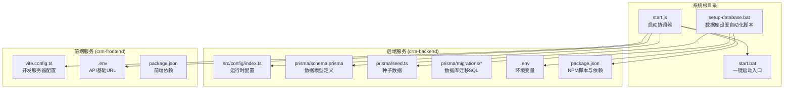
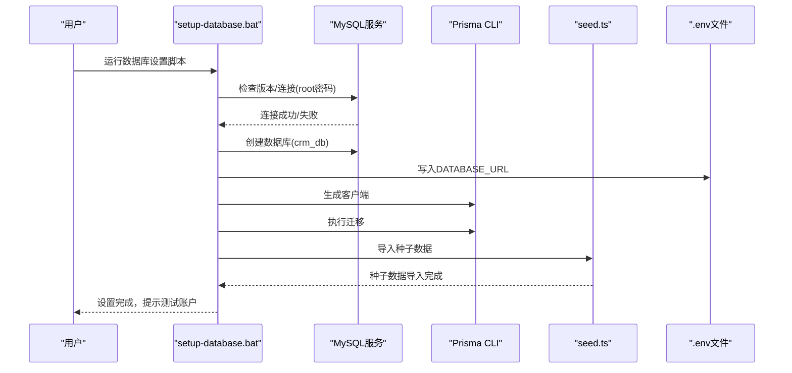
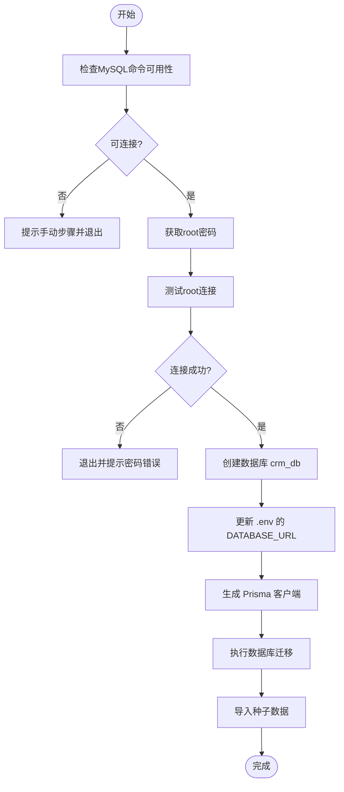
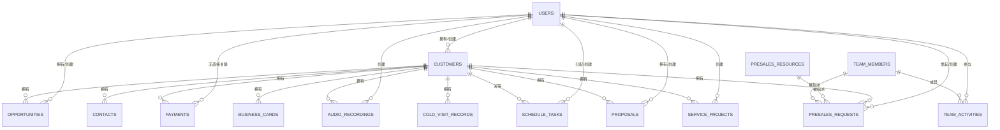
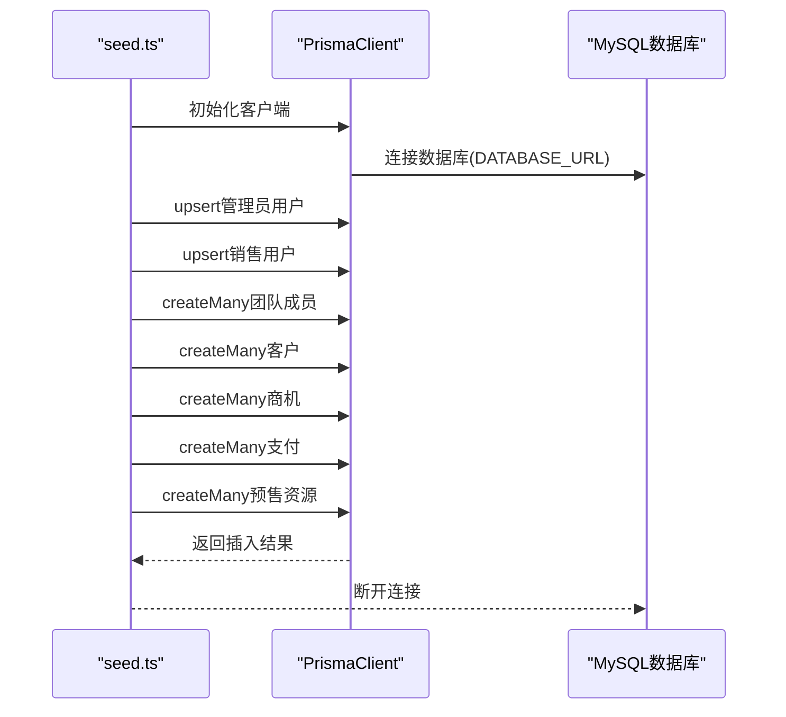
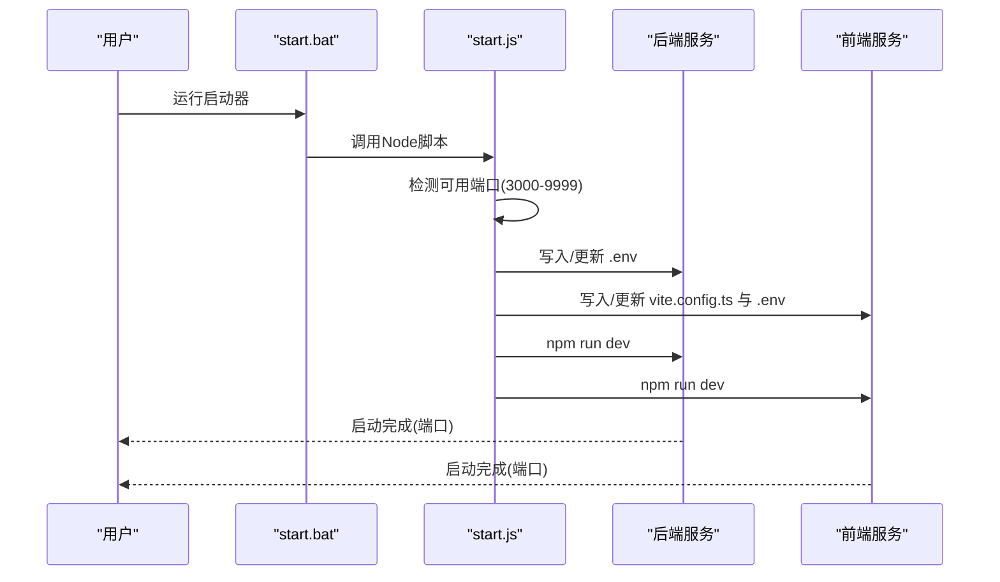
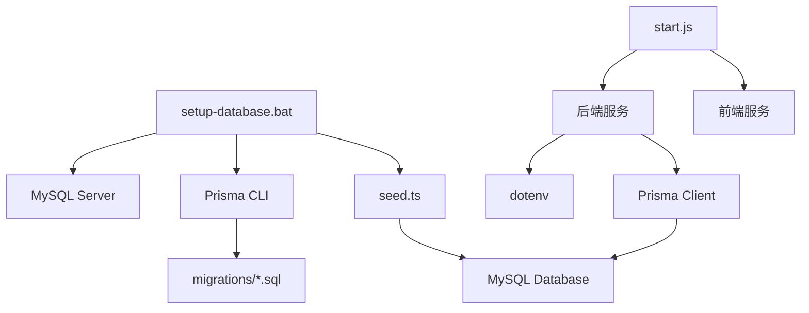

# 数据库设置自动化脚本

<cite>
**本文档引用的文件**
- [setup-database.bat](file://setup-database.bat)
- [schema.prisma](file://crm-backend/prisma/schema.prisma)
- [seed.ts](file://crm-backend/prisma/seed.ts)
- [index.ts](file://crm-backend/src/config/index.ts)
- [package.json](file://crm-backend/package.json)
- [20260315081326_init/migration.sql](file://crm-backend/prisma/migrations/20260315081326_init/migration.sql)
- [20260315135448_add_contacts_and_business_cards/migration.sql](file://crm-backend/prisma/migrations/20260315135448_add_contacts_and_business_cards/migration.sql)
- [20260315155023_add_cold_visit_records/migration.sql](file://crm-backend/prisma/migrations/20260315155023_add_cold_visit_records/migration.sql)
- [start.js](file://start.js)
- [start.bat](file://start.bat)
- [.env](file://crm-backend/.env)
</cite>

## 目录
1. [简介](#简介)
2. [项目结构概览](#项目结构概览)
3. [核心组件分析](#核心组件分析)
4. [架构总览](#架构总览)
5. [详细组件分析](#详细组件分析)
6. [依赖关系分析](#依赖关系分析)
7. [性能考虑](#性能考虑)
8. [故障排除指南](#故障排除指南)
9. [结论](#结论)

## 简介
本文件面向销售AI CRM系统的数据库设置自动化脚本，系统性解析了从数据库初始化、Prisma迁移、种子数据导入到系统启动的完整流程。文档旨在帮助开发者与运维人员快速理解并部署该系统，同时提供可视化图表与实用的排错建议。

## 项目结构概览
系统采用前后端分离架构，数据库层通过Prisma ORM管理，自动化脚本负责数据库初始化与配置注入，启动脚本负责自动端口检测与服务编排。

**图表来源**
- [setup-database.bat:1-103](file://setup-database.bat#L1-L103)
- [start.js:1-230](file://start.js#L1-L230)
- [schema.prisma:1-709](file://crm-backend/prisma/schema.prisma#L1-L709)
- [seed.ts:1-213](file://crm-backend/prisma/seed.ts#L1-L213)
- [index.ts:1-60](file://crm-backend/src/config/index.ts#L1-L60)

**章节来源**
- [setup-database.bat:1-103](file://setup-database.bat#L1-L103)
- [start.js:1-230](file://start.js#L1-L230)

## 核心组件分析
- 数据库设置自动化脚本：负责MySQL可用性检查、root密码验证、数据库创建、.env配置写入、Prisma客户端生成、迁移执行与种子数据导入。
- Prisma数据模型：集中定义用户、客户、商机、支付、录音、日程、提案、团队、预售、联系人、名片、冷访记录等实体及枚举类型。
- 种子数据：预置管理员、销售团队、客户、商机、支付、预售资源等初始数据。
- 运行时配置：从.env加载数据库URL、JWT密钥、CORS、日志级别、上传配置等。
- 启动协调器：自动检测端口、生成/更新前后端配置、并行启动前后端服务。

**章节来源**
- [setup-database.bat:13-103](file://setup-database.bat#L13-L103)
- [schema.prisma:1-709](file://crm-backend/prisma/schema.prisma#L1-L709)
- [seed.ts:6-213](file://crm-backend/prisma/seed.ts#L6-L213)
- [index.ts:33-58](file://crm-backend/src/config/index.ts#L33-L58)
- [start.js:166-228](file://start.js#L166-L228)

## 架构总览
下图展示了数据库设置自动化脚本如何与Prisma、种子数据、运行时配置协同工作，以及启动脚本如何串联前后端服务。

**图表来源**
- [setup-database.bat:14-90](file://setup-database.bat#L14-L90)
- [seed.ts:6-213](file://crm-backend/prisma/seed.ts#L6-L213)

## 详细组件分析

### 数据库设置自动化脚本
该脚本实现了从零到一的数据库初始化流程，包括：
- MySQL可用性与root连接验证
- 数据库创建与字符集设置
- .env文件中的DATABASE_URL动态更新
- Prisma客户端生成与迁移部署
- 种子数据导入

**图表来源**
- [setup-database.bat:14-90](file://setup-database.bat#L14-L90)

**章节来源**
- [setup-database.bat:14-90](file://setup-database.bat#L14-L90)

### Prisma数据模型与迁移
Prisma通过schema.prisma集中定义了业务实体与关系，并配套多阶段迁移SQL文件：
- 初始迁移：用户、客户、商机、支付、录音、日程、提案、团队、活动、服务项目、预售资源与请求等表结构
- 联系人与名片迁移：新增联系人与名片表及其外键约束
- 冷访记录迁移：新增冷访记录表及其外键约束

    **图表来源**
    - [schema.prisma:121-709](file://crm-backend/prisma/schema.prisma#L121-L709)
    - [20260315081326_init/migration.sql:1-381](file://crm-backend/prisma/migrations/20260315081326_init/migration.sql#L1-L381)
    - [20260315135448_add_contacts_and_business_cards/migration.sql:1-55](file://crm-backend/prisma/migrations/20260315135448_add_contacts_and_business_cards/migration.sql#L1-L55)
    - [20260315155023_add_cold_visit_records/migration.sql:1-25](file://crm-backend/prisma/migrations/20260315155023_add_cold_visit_records/migration.sql#L1-L25)

**章节来源**
- [schema.prisma:1-709](file://crm-backend/prisma/schema.prisma#L1-L709)
- [20260315081326_init/migration.sql:1-381](file://crm-backend/prisma/migrations/20260315081326_init/migration.sql#L1-L381)
- [20260315135448_add_contacts_and_business_cards/migration.sql:1-55](file://crm-backend/prisma/migrations/20260315135448_add_contacts_and_business_cards/migration.sql#L1-L55)
- [20260315155023_add_cold_visit_records/migration.sql:1-25](file://crm-backend/prisma/migrations/20260315155023_add_cold_visit_records/migration.sql#L1-L25)

### 种子数据导入
种子脚本负责预置系统初始数据：
- 管理员与销售用户
- 团队成员
- 客户、商机、支付
- 预售资源

**图表来源**
- [seed.ts:6-213](file://crm-backend/prisma/seed.ts#L6-L213)

**章节来源**
- [seed.ts:6-213](file://crm-backend/prisma/seed.ts#L6-L213)

### 运行时配置与环境变量
后端通过dotenv加载环境变量，其中DATABASE_URL由数据库设置脚本注入，用于连接MySQL。

**图表来源**
- [index.ts:4-58](file://crm-backend/src/config/index.ts#L4-L58)
- [.env](file://crm-backend/.env)

**章节来源**
- [index.ts:4-58](file://crm-backend/src/config/index.ts#L4-L58)
- [.env](file://crm-backend/.env)

### 启动协调器与服务编排
启动脚本负责：
- 自动检测前后端可用端口
- 动态生成/更新后端.env与前端.vite配置
- 并行启动前后端开发服务

**图表来源**
- [start.bat:11-23](file://start.bat#L11-L23)
- [start.js:166-228](file://start.js#L166-L228)

**章节来源**
- [start.bat:11-23](file://start.bat#L11-L23)
- [start.js:166-228](file://start.js#L166-L228)

## 依赖关系分析
- setup-database.bat依赖MySQL命令行工具、PowerShell、Node/npm环境
- Prisma迁移与种子数据依赖DATABASE_URL指向的MySQL实例
- 后端服务依赖dotenv加载的环境变量
- 启动脚本依赖Node.js运行时与网络端口可用性

**图表来源**
- [setup-database.bat:14-90](file://setup-database.bat#L14-L90)
- [schema.prisma:1-11](file://crm-backend/prisma/schema.prisma#L1-L11)
- [seed.ts:1-4](file://crm-backend/prisma/seed.ts#L1-L4)
- [index.ts:4-58](file://crm-backend/src/config/index.ts#L4-L58)
- [start.js:166-228](file://start.js#L166-L228)

**章节来源**
- [setup-database.bat:14-90](file://setup-database.bat#L14-L90)
- [schema.prisma:1-11](file://crm-backend/prisma/schema.prisma#L1-L11)
- [seed.ts:1-4](file://crm-backend/prisma/seed.ts#L1-L4)
- [index.ts:4-58](file://crm-backend/src/config/index.ts#L4-L58)
- [start.js:166-228](file://start.js#L166-L228)

## 性能考虑
- 数据库字符集：使用utf8mb4，确保表情符号与多语言支持
- 索引策略：关键查询字段（如用户邮箱、客户阶段、商机状态等）建立索引，提升查询效率
- 迁移幂等：Prisma迁移与种子数据导入具备去重逻辑，避免重复执行导致的数据冗余
- 启动并发：启动脚本并行启动前后端服务，缩短整体启动时间

## 故障排除指南
- MySQL不可用或连接失败
  - 确认MySQL服务已启动且命令行工具在PATH中
  - 检查root密码是否正确
  - 参考脚本提示的手动步骤进行排查
- 数据库创建失败
  - 确认root权限足够
  - 检查目标主机与端口可达性
- Prisma客户端生成或迁移失败
  - 确认Node.js版本满足要求（>=18）
  - 检查DATABASE_URL格式与连通性
  - 清理缓存后重试生成客户端
- 种子数据导入异常
  - 检查数据库连接与权限
  - 确认迁移已成功执行
- 启动脚本端口冲突
  - 使用默认端口范围（3000-9999），脚本会自动寻找可用端口
  - 若端口占用过多，可调整范围或关闭占用进程

**章节来源**
- [setup-database.bat:16-31](file://setup-database.bat#L16-L31)
- [setup-database.bat:42-47](file://setup-database.bat#L42-L47)
- [setup-database.bat:53-58](file://setup-database.bat#L53-L58)
- [setup-database.bat:72-77](file://setup-database.bat#L72-L77)
- [setup-database.bat:80-83](file://setup-database.bat#L80-L83)
- [setup-database.bat:85-89](file://setup-database.bat#L85-L89)
- [start.js:35-59](file://start.js#L35-L59)

## 结论
数据库设置自动化脚本为销售AI CRM系统提供了从数据库初始化到系统启动的一体化解决方案。通过Prisma数据模型与迁移机制，系统实现了清晰的领域建模与可演进的数据库结构；通过种子数据与启动脚本，开发者能够快速获得可运行的本地环境。遵循本文档的流程与排错建议，可显著降低部署门槛并提升开发效率。