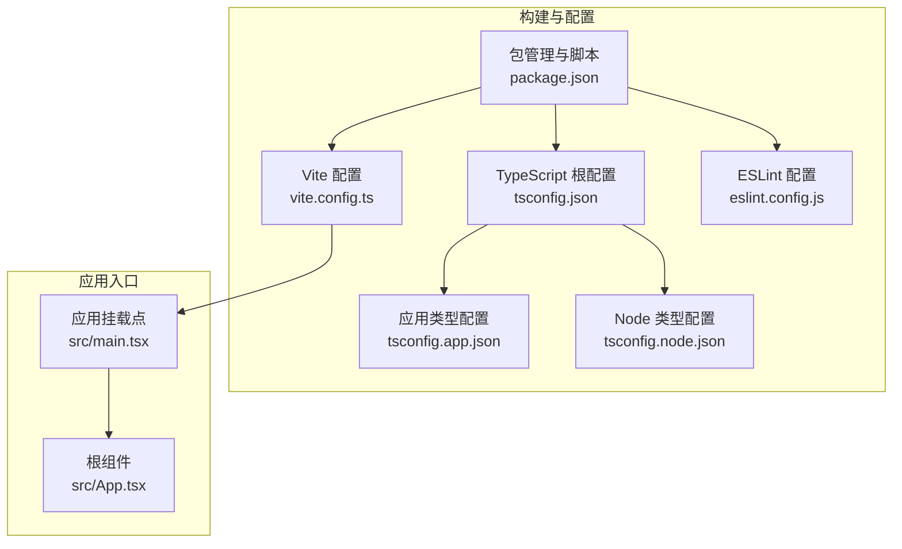
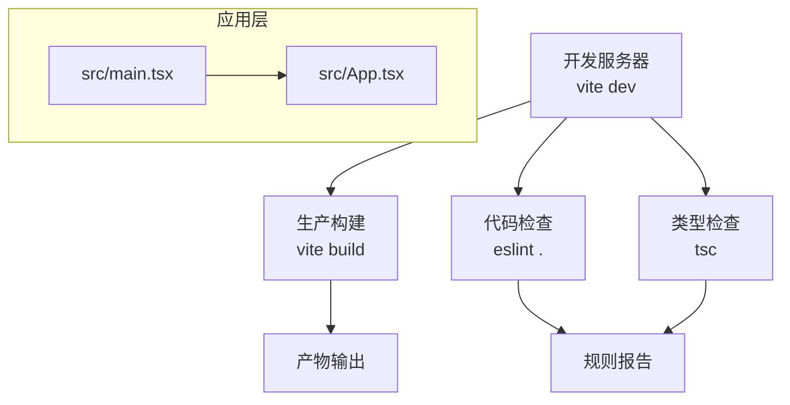
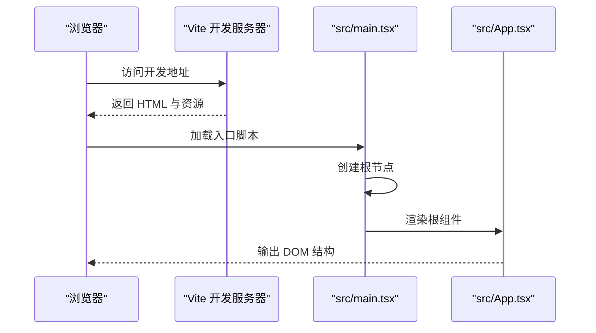
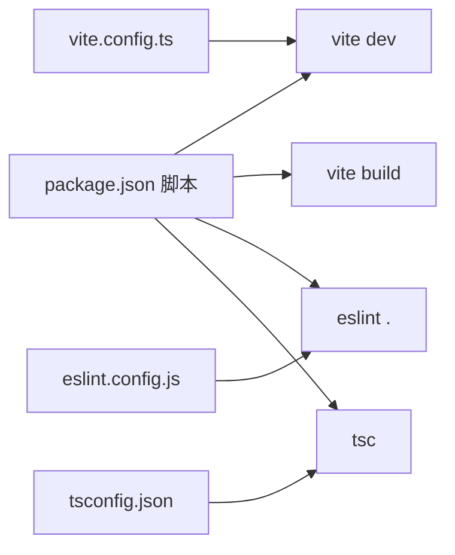

# 测试与调试

<cite>
**本文引用的文件**
- [package.json](file://crm-frontend/package.json)
- [vite.config.ts](file://crm-frontend/vite.config.ts)
- [tsconfig.json](file://crm-frontend/tsconfig.json)
- [tsconfig.app.json](file://crm-frontend/tsconfig.app.json)
- [tsconfig.node.json](file://crm-frontend/tsconfig.node.json)
- [eslint.config.js](file://crm-frontend/eslint.config.js)
- [README.md](file://crm-frontend/README.md)
- [src/main.tsx](file://crm-frontend/src/main.tsx)
- [src/App.tsx](file://crm-frontend/src/App.tsx)
</cite>

## 目录
1. [简介](#简介)
2. [项目结构](#项目结构)
3. [核心组件](#核心组件)
4. [架构总览](#架构总览)
5. [详细组件分析](#详细组件分析)
6. [依赖分析](#依赖分析)
7. [性能考虑](#性能考虑)
8. [故障排查指南](#故障排查指南)
9. [结论](#结论)
10. [附录](#附录)

## 简介
本指南面向 CRM 前端工程（基于 React + TypeScript + Vite）的测试与调试实践，覆盖单元测试、集成测试与端到端测试策略，调试工具使用方法（浏览器开发者工具、React DevTools、TypeScript 调试），常见问题诊断与解决方案，以及性能分析与质量保障流程。由于当前仓库未包含测试框架与测试脚本配置，本指南提供可落地的实施建议与最佳实践，帮助团队在不破坏现有开发体验的前提下逐步完善测试体系。

## 项目结构
该前端工程采用 Vite 作为构建与开发服务器，使用 React 19 与 TypeScript 进行开发，并通过 ESLint 提供代码质量保障。核心入口为应用根组件与渲染逻辑，配置文件集中于根目录的构建与语言配置中。

**图表来源**
- [vite.config.ts:1-8](file://crm-frontend/vite.config.ts#L1-L8)
- [tsconfig.json:1-8](file://crm-frontend/tsconfig.json#L1-L8)
- [tsconfig.app.json](file://crm-frontend/tsconfig.app.json)
- [tsconfig.node.json](file://crm-frontend/tsconfig.node.json)
- [eslint.config.js:1-24](file://crm-frontend/eslint.config.js#L1-L24)
- [package.json:1-36](file://crm-frontend/package.json#L1-L36)
- [src/main.tsx:1-11](file://crm-frontend/src/main.tsx#L1-L11)
- [src/App.tsx:1-122](file://crm-frontend/src/App.tsx#L1-L122)

**章节来源**
- [package.json:1-36](file://crm-frontend/package.json#L1-L36)
- [vite.config.ts:1-8](file://crm-frontend/vite.config.ts#L1-L8)
- [tsconfig.json:1-8](file://crm-frontend/tsconfig.json#L1-L8)
- [eslint.config.js:1-24](file://crm-frontend/eslint.config.js#L1-L24)
- [src/main.tsx:1-11](file://crm-frontend/src/main.tsx#L1-L11)
- [src/App.tsx:1-122](file://crm-frontend/src/App.tsx#L1-L122)

## 核心组件
- 应用入口与渲染：应用通过根组件进行渲染，严格模式包裹以提前暴露潜在问题；根组件负责页面结构与交互入口。
- 构建与开发：Vite 提供快速热更新与生产构建；TypeScript 提供类型安全；ESLint 提供静态规则校验。
- 工具链：React 插件由 Vite 驱动，TypeScript 版本与 ESLint 类型感知配置可按需启用更严格的规则集。

**章节来源**
- [src/main.tsx:1-11](file://crm-frontend/src/main.tsx#L1-L11)
- [src/App.tsx:1-122](file://crm-frontend/src/App.tsx#L1-L122)
- [vite.config.ts:1-8](file://crm-frontend/vite.config.ts#L1-L8)
- [tsconfig.json:1-8](file://crm-frontend/tsconfig.json#L1-L8)
- [eslint.config.js:1-24](file://crm-frontend/eslint.config.js#L1-L24)
- [README.md:1-74](file://crm-frontend/README.md#L1-L74)

## 架构总览
下图展示从开发到构建的关键路径，以及与测试/调试相关的配置与入口关系：

**图表来源**
- [package.json:6-11](file://crm-frontend/package.json#L6-L11)
- [vite.config.ts:1-8](file://crm-frontend/vite.config.ts#L1-L8)
- [eslint.config.js:1-24](file://crm-frontend/eslint.config.js#L1-L24)
- [src/main.tsx:1-11](file://crm-frontend/src/main.tsx#L1-L11)
- [src/App.tsx:1-122](file://crm-frontend/src/App.tsx#L1-L122)

## 详细组件分析

### 组件：应用入口与根组件
- 入口职责：创建根节点并渲染根组件，严格模式有助于捕获副作用与不安全用法。
- 根组件职责：承载页面结构、交互入口与示例逻辑，便于验证 HMR 与交互行为。

**图表来源**
- [src/main.tsx:1-11](file://crm-frontend/src/main.tsx#L1-L11)
- [src/App.tsx:1-122](file://crm-frontend/src/App.tsx#L1-L122)

**章节来源**
- [src/main.tsx:1-11](file://crm-frontend/src/main.tsx#L1-L11)
- [src/App.tsx:1-122](file://crm-frontend/src/App.tsx#L1-L122)

### 测试策略与工具选择
- 单元测试（推荐 Jest + React Testing Library）
  - 适用范围：纯函数、Hook、小型组件片段与业务逻辑模块化单元。
  - 推荐实践：隔离外部依赖，使用渲染器断言 UI 行为，避免渲染细节测试。
  - 集成方式：在 package.json 中添加测试脚本，结合覆盖率与类型检查。
- 集成测试（推荐 Playwright 或 Cypress）
  - 适用范围：跨组件协作、路由导航、异步数据流与第三方服务交互。
  - 推荐实践：以用户任务为中心编写场景，关注端到端目标而非实现细节。
- 端到端测试（推荐 Playwright）
  - 适用范围：真实浏览器行为、网络拦截、多标签页与设备模拟。
  - 推荐实践：稳定的选择器、重试策略与截图/视频录制辅助定位问题。
- 质量门禁（推荐）
  - 在 CI 中执行：类型检查、ESLint、单元测试与覆盖率阈值。
  - 本地开发：通过 pre-commit 钩子或编辑器扩展确保提交前质量。

**章节来源**
- [package.json:6-11](file://crm-frontend/package.json#L6-L11)
- [README.md:14-73](file://crm-frontend/README.md#L14-L73)

### 调试工具使用
- 浏览器开发者工具
  - DOM/样式检查：定位布局与样式异常。
  - 性能面板：记录渲染耗时、内存分配与长任务。
  - 网络面板：核对请求、缓存与响应时间。
- React DevTools
  - 组件树与状态：查看 props/state 变化，识别不必要的重渲染。
  - Profiler：测量组件渲染耗时，定位热点区域。
- TypeScript 调试
  - 启用严格类型检查与类型感知 ESLint 规则，减少运行时错误。
  - 使用 IDE 的“转到定义/查找所有引用”定位类型与实现。

**章节来源**
- [eslint.config.js:1-24](file://crm-frontend/eslint.config.js#L1-L24)
- [README.md:14-73](file://crm-frontend/README.md#L14-L73)

### 常见问题诊断与解决
- HMR 不生效或刷新异常
  - 检查开发服务器是否正常启动与端口占用。
  - 确认入口文件与组件导出无循环依赖。
- 样式未生效或冲突
  - 检查 Tailwind 引入顺序与类名拼写。
  - 使用浏览器检查元素最终计算样式。
- 类型错误频繁
  - 启用类型感知 ESLint 规则，修复基础类型问题。
  - 对不确定值使用显式类型断言与边界处理。
- 性能问题
  - 使用 React Profiler 识别重渲染热点。
  - 利用浏览器性能面板观察主线程阻塞与内存增长。

**章节来源**
- [package.json:6-11](file://crm-frontend/package.json#L6-L11)
- [eslint.config.js:1-24](file://crm-frontend/eslint.config.js#L1-L24)
- [README.md:14-73](file://crm-frontend/README.md#L14-L73)

### 性能分析与优化
- 内存泄漏检测
  - 使用浏览器内存快照对比长时间运行后的堆增长。
  - 关注未清理的事件监听器、定时器与闭包引用。
- 渲染性能优化
  - 将昂贵计算放入 useMemo/useCallback 缓存。
  - 拆分大组件，按需加载非关键路径模块。
  - 减少不必要的重渲染，稳定 props 与引用。
- 网络与构建优化
  - 分析构建产物体积，启用代码分割与懒加载。
  - 使用 CDN 与缓存策略优化静态资源加载。

**章节来源**
- [vite.config.ts:1-8](file://crm-frontend/vite.config.ts#L1-L8)
- [package.json:6-11](file://crm-frontend/package.json#L6-L11)

### 代码审查清单与质量保证流程
- 代码审查清单
  - 是否有明确的测试覆盖（单元/集成）？
  - 是否存在不必要的全局状态或副作用？
  - 是否使用了稳定的 API 与类型安全的实现？
  - 是否遵循 ESLint 与类型检查规则？
  - 是否考虑了可访问性与跨浏览器兼容性？
- 质量保证流程
  - 本地：保存即检查（ESLint）、类型检查、最小化回归测试。
  - CI：全量类型检查、ESLint、单元测试与覆盖率、构建产物校验。
  - 发布：生成物签名与版本标记，记录变更日志。

**章节来源**
- [eslint.config.js:1-24](file://crm-frontend/eslint.config.js#L1-L24)
- [README.md:14-73](file://crm-frontend/README.md#L14-L73)

## 依赖分析
- 构建与开发
  - Vite 提供开发服务器与构建能力；React 插件由 Vite 驱动。
- 类型与规范
  - TypeScript 根配置聚合应用与 Node 类型；ESLint 配置统一规则与扩展。
- 脚本与工作流
  - npm/yarn/pnpm 脚本驱动开发、构建与预览；可扩展测试与质量检查。

**图表来源**
- [package.json:6-11](file://crm-frontend/package.json#L6-L11)
- [vite.config.ts:1-8](file://crm-frontend/vite.config.ts#L1-L8)
- [eslint.config.js:1-24](file://crm-frontend/eslint.config.js#L1-L24)
- [tsconfig.json:1-8](file://crm-frontend/tsconfig.json#L1-L8)

**章节来源**
- [package.json:6-11](file://crm-frontend/package.json#L6-L11)
- [vite.config.ts:1-8](file://crm-frontend/vite.config.ts#L1-L8)
- [eslint.config.js:1-24](file://crm-frontend/eslint.config.js#L1-L24)
- [tsconfig.json:1-8](file://crm-frontend/tsconfig.json#L1-L8)

## 性能考虑
- 开发阶段
  - 启用 HMR 与快速构建，避免过重的插件链。
  - 使用严格类型与 ESLint 规则降低调试成本。
- 生产阶段
  - 评估构建体积与加载时间，启用代码分割与懒加载。
  - 使用缓存与 CDN 优化静态资源分发。

**章节来源**
- [README.md:10-12](file://crm-frontend/README.md#L10-L12)
- [package.json:6-11](file://crm-frontend/package.json#L6-L11)

## 故障排查指南
- 启动失败
  - 检查端口占用与权限；确认 Node.js 与包依赖安装完成。
- 样式异常
  - 检查 Tailwind 引入顺序与类名拼写；确认 PostCSS/Tailwind 配置正确。
- 类型错误
  - 启用类型感知 ESLint；修复缺失类型与未穷尽分支。
- 性能问题
  - 使用 React Profiler 与浏览器性能面板定位瓶颈；优化重渲染与资源加载。

**章节来源**
- [eslint.config.js:1-24](file://crm-frontend/eslint.config.js#L1-L24)
- [README.md:14-73](file://crm-frontend/README.md#L14-L73)

## 结论
本指南提供了针对当前 React + TypeScript + Vite 工程的测试与调试实践建议。建议优先引入单元测试与 ESLint/类型检查，再逐步扩展到集成与端到端测试；在开发与 CI 中建立质量门禁，配合浏览器与 React DevTools 定位问题，持续优化性能与稳定性。

## 附录
- 快速参考
  - 启动开发：执行开发脚本
  - 构建产物：执行构建脚本
  - 代码检查：执行 ESLint 脚本
  - 类型检查：执行类型检查命令
- 参考配置位置
  - Vite 配置：构建与开发插件
  - TypeScript 配置：根配置与应用/Node 类型配置
  - ESLint 配置：规则扩展与语言选项

**章节来源**
- [package.json:6-11](file://crm-frontend/package.json#L6-L11)
- [vite.config.ts:1-8](file://crm-frontend/vite.config.ts#L1-L8)
- [tsconfig.json:1-8](file://crm-frontend/tsconfig.json#L1-L8)
- [eslint.config.js:1-24](file://crm-frontend/eslint.config.js#L1-L24)
- [README.md:14-73](file://crm-frontend/README.md#L14-L73)