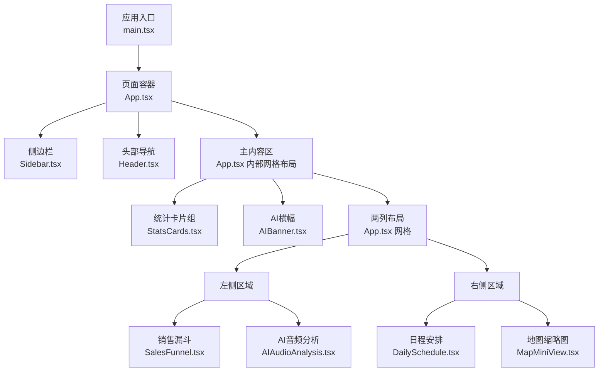
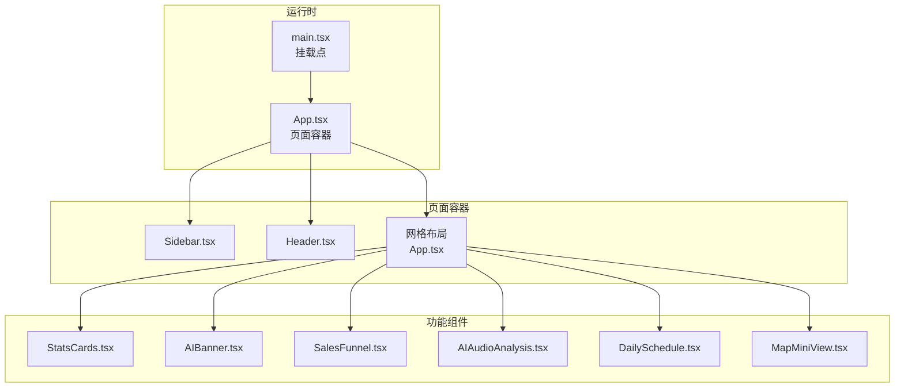
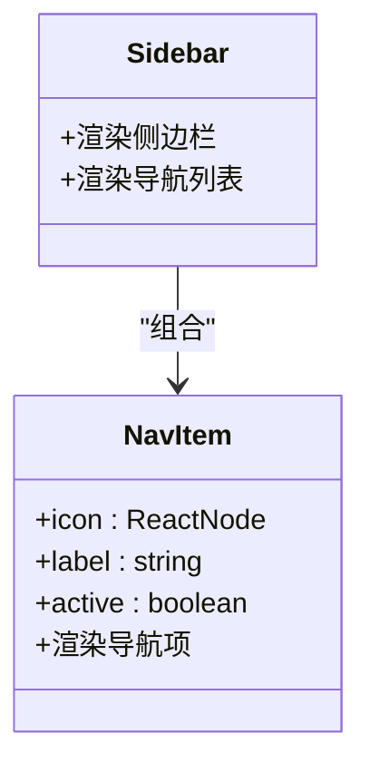
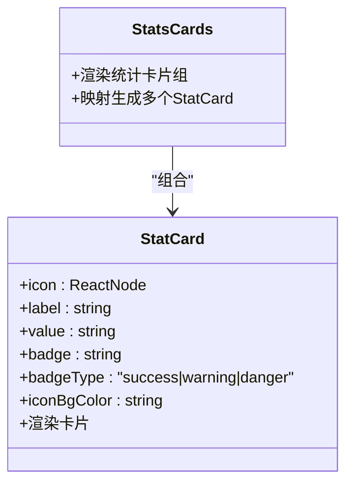
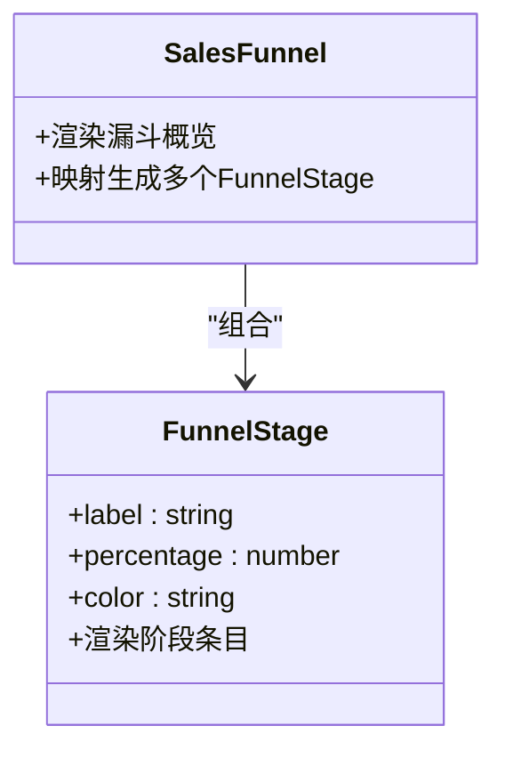
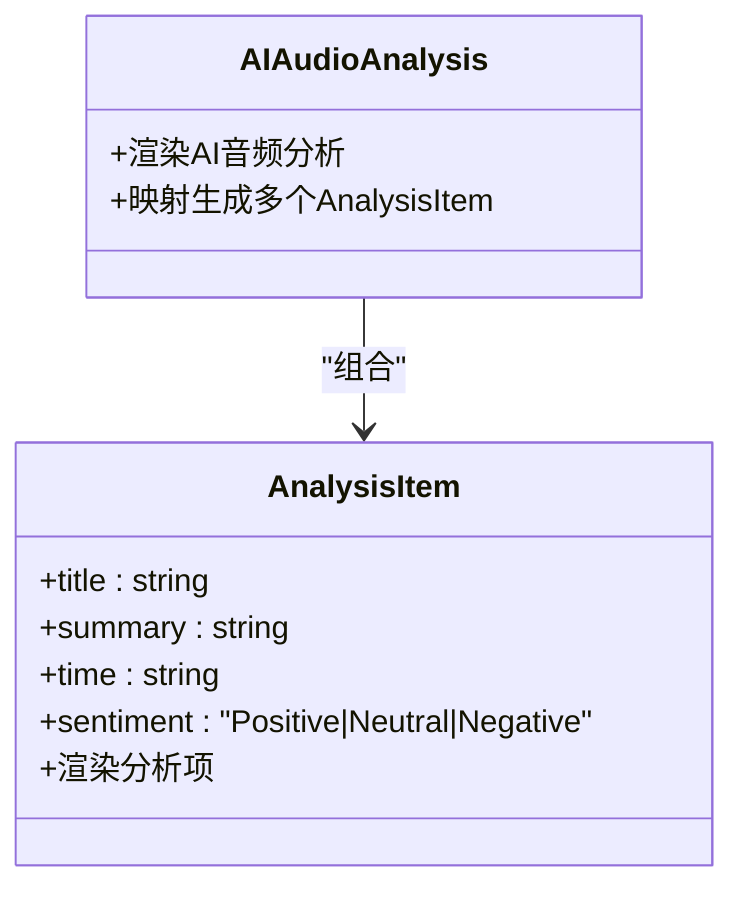
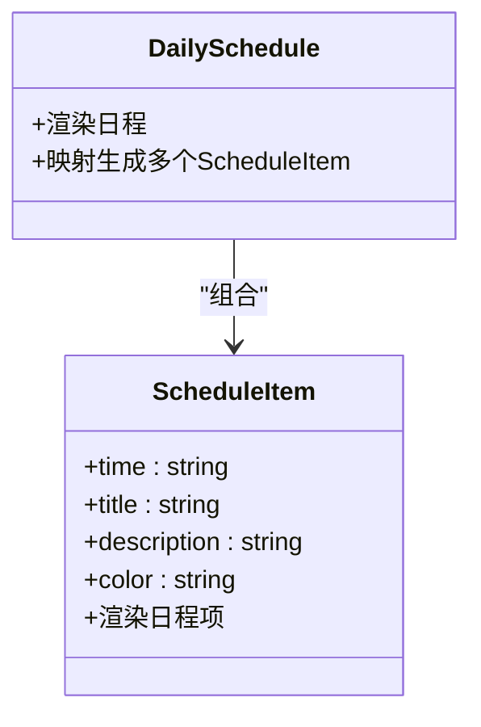
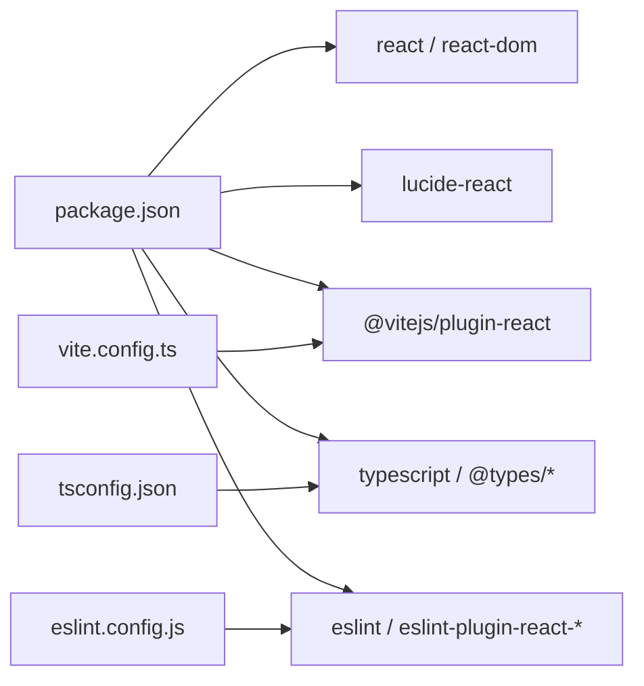

# 组件开发规范

<cite>
**本文引用的文件**
- [App.tsx](file://crm-frontend/src/App.tsx)
- [main.tsx](file://crm-frontend/src/main.tsx)
- [Header.tsx](file://crm-frontend/src/components/Header.tsx)
- [Sidebar.tsx](file://crm-frontend/src/components/Sidebar.tsx)
- [StatsCards.tsx](file://crm-frontend/src/components/StatsCards.tsx)
- [AIBanner.tsx](file://crm-frontend/src/components/AIBanner.tsx)
- [SalesFunnel.tsx](file://crm-frontend/src/components/SalesFunnel.tsx)
- [AIAudioAnalysis.tsx](file://crm-frontend/src/components/AIAudioAnalysis.tsx)
- [DailySchedule.tsx](file://crm-frontend/src/components/DailySchedule.tsx)
- [MapMiniView.tsx](file://crm-frontend/src/components/MapMiniView.tsx)
- [package.json](file://crm-frontend/package.json)
- [eslint.config.js](file://crm-frontend/eslint.config.js)
- [vite.config.ts](file://crm-frontend/vite.config.ts)
- [tsconfig.json](file://crm-frontend/tsconfig.json)
</cite>

## 目录
1. [引言](#引言)
2. [项目结构](#项目结构)
3. [核心组件](#核心组件)
4. [架构总览](#架构总览)
5. [详细组件分析](#详细组件分析)
6. [依赖分析](#依赖分析)
7. [性能考虑](#性能考虑)
8. [测试与调试指南](#测试与调试指南)
9. [结论](#结论)
10. [附录](#附录)

## 引言
本规范面向React组件开发，结合当前项目的实际实现，总结函数组件设计、Props接口定义、Hook使用模式、组件命名与文件组织、导入导出规范、组件复用与组合策略、状态管理原则、测试与调试方法以及性能优化建议。目标是帮助团队在保持一致性的前提下提升可维护性、可扩展性与开发效率。

## 项目结构
项目采用基于功能域的组件组织方式：页面容器组件位于根目录，业务组件集中于components目录，并通过入口文件统一渲染。构建工具为Vite，类型检查由TypeScript负责，代码质量由ESLint保障。

图表来源
- [main.tsx:1-11](file://crm-frontend/src/main.tsx#L1-L11)
- [App.tsx:10-55](file://crm-frontend/src/App.tsx#L10-L55)
- [Sidebar.tsx:37-82](file://crm-frontend/src/components/Sidebar.tsx#L37-L82)
- [Header.tsx:3-50](file://crm-frontend/src/components/Header.tsx#L3-L50)
- [StatsCards.tsx:35-78](file://crm-frontend/src/components/StatsCards.tsx#L35-L78)
- [AIBanner.tsx:3-44](file://crm-frontend/src/components/AIBanner.tsx#L3-L44)
- [SalesFunnel.tsx:29-62](file://crm-frontend/src/components/SalesFunnel.tsx#L29-L62)
- [AIAudioAnalysis.tsx:38-77](file://crm-frontend/src/components/AIAudioAnalysis.tsx#L38-L77)
- [DailySchedule.tsx:26-65](file://crm-frontend/src/components/DailySchedule.tsx#L26-L65)
- [MapMiniView.tsx:3-54](file://crm-frontend/src/components/MapMiniView.tsx#L3-L54)

章节来源
- [main.tsx:1-11](file://crm-frontend/src/main.tsx#L1-L11)
- [App.tsx:10-55](file://crm-frontend/src/App.tsx#L10-L55)

## 核心组件
本节对现有核心组件进行要点梳理，提炼可复用的设计模式与最佳实践。

- 函数组件与无状态组件
  - 大多数组件采用函数式声明，直接返回JSX，简洁直观，适合展示型组件与纯UI组件。
  - 示例路径：[Header.tsx:3-50](file://crm-frontend/src/components/Header.tsx#L3-L50)、[AIBanner.tsx:3-44](file://crm-frontend/src/components/AIBanner.tsx#L3-L44)、[MapMiniView.tsx:3-54](file://crm-frontend/src/components/MapMiniView.tsx#L3-L54)

- Props接口定义
  - 使用明确的接口约束props，增强类型安全与IDE提示。
  - 示例路径：[Sidebar.tsx:16-35](file://crm-frontend/src/components/Sidebar.tsx#L16-L35)、[StatsCards.tsx:3-10](file://crm-frontend/src/components/StatsCards.tsx#L3-L10)、[SalesFunnel.tsx:3-7](file://crm-frontend/src/components/SalesFunnel.tsx#L3-L7)、[AIAudioAnalysis.tsx:3-8](file://crm-frontend/src/components/AIAudioAnalysis.tsx#L3-L8)、[DailySchedule.tsx:3-8](file://crm-frontend/src/components/DailySchedule.tsx#L3-L8)

- 子组件拆分与组合
  - 将复杂区域拆分为子组件（如Sidebar中的NavItem），提升复用性与可维护性。
  - 示例路径：[Sidebar.tsx:22-35](file://crm-frontend/src/components/Sidebar.tsx#L22-L35)

- 布局与样式
  - 统一使用Tailwind类名进行样式控制，组件内部不引入外部CSS文件，保证样式隔离与一致性。
  - 示例路径：[StatsCards.tsx:19-32](file://crm-frontend/src/components/StatsCards.tsx#L19-L32)、[SalesFunnel.tsx:39-61](file://crm-frontend/src/components/SalesFunnel.tsx#L39-L61)

章节来源
- [Header.tsx:3-50](file://crm-frontend/src/components/Header.tsx#L3-L50)
- [Sidebar.tsx:16-35](file://crm-frontend/src/components/Sidebar.tsx#L16-L35)
- [StatsCards.tsx:3-10](file://crm-frontend/src/components/StatsCards.tsx#L3-L10)
- [AIBanner.tsx:3-44](file://crm-frontend/src/components/AIBanner.tsx#L3-L44)
- [SalesFunnel.tsx:3-7](file://crm-frontend/src/components/SalesFunnel.tsx#L3-L7)
- [AIAudioAnalysis.tsx:3-8](file://crm-frontend/src/components/AIAudioAnalysis.tsx#L3-L8)
- [DailySchedule.tsx:3-8](file://crm-frontend/src/components/DailySchedule.tsx#L3-L8)
- [MapMiniView.tsx:3-54](file://crm-frontend/src/components/MapMiniView.tsx#L3-L54)

## 架构总览
整体采用“页面容器 + 功能组件”的分层架构。页面容器负责布局与数据聚合，功能组件负责具体UI与交互。所有组件均以默认导出形式暴露，便于按需导入与Tree Shaking。

图表来源
- [main.tsx:6-10](file://crm-frontend/src/main.tsx#L6-L10)
- [App.tsx:10-55](file://crm-frontend/src/App.tsx#L10-L55)
- [Sidebar.tsx:37-82](file://crm-frontend/src/components/Sidebar.tsx#L37-L82)
- [Header.tsx:3-50](file://crm-frontend/src/components/Header.tsx#L3-L50)
- [StatsCards.tsx:35-78](file://crm-frontend/src/components/StatsCards.tsx#L35-L78)
- [AIBanner.tsx:3-44](file://crm-frontend/src/components/AIBanner.tsx#L3-L44)
- [SalesFunnel.tsx:29-62](file://crm-frontend/src/components/SalesFunnel.tsx#L29-L62)
- [AIAudioAnalysis.tsx:38-77](file://crm-frontend/src/components/AIAudioAnalysis.tsx#L38-L77)
- [DailySchedule.tsx:26-65](file://crm-frontend/src/components/DailySchedule.tsx#L26-L65)
- [MapMiniView.tsx:3-54](file://crm-frontend/src/components/MapMiniView.tsx#L3-L54)

## 详细组件分析

### Sidebar 组件
- 设计要点
  - 使用独立的NavItem子组件承载导航项逻辑，实现高内聚低耦合。
  - 通过接口定义NavItem的props，确保调用方传入正确的图标、标签与激活状态。
  - 导航列表通过映射生成，便于扩展与维护。
- 接口与类型
  - NavItemProps接口定义了icon、label与active属性。
- 复用策略
  - 将NavItem作为通用导航单元，可在不同页面复用；通过active控制高亮态。
- 性能建议
  - 列表渲染时使用稳定的key（当前使用索引）；若数据可能重排，建议改用唯一id。

图表来源
- [Sidebar.tsx:16-35](file://crm-frontend/src/components/Sidebar.tsx#L16-L35)
- [Sidebar.tsx:37-82](file://crm-frontend/src/components/Sidebar.tsx#L37-L82)

章节来源
- [Sidebar.tsx:16-35](file://crm-frontend/src/components/Sidebar.tsx#L16-L35)
- [Sidebar.tsx:37-82](file://crm-frontend/src/components/Sidebar.tsx#L37-L82)

### StatsCards 组件
- 设计要点
  - 使用子组件StatCard封装单个统计卡片，支持图标、标签、数值、徽标与颜色配置。
  - 通过枚举类型限定badgeType，避免无效值。
- Props接口
  - StatCardProps接口包含icon、label、value、badge、badgeType与iconBgColor。
- 复用策略
  - StatCard可被任意统计模块复用；通过传入不同数据快速生成卡片组。

图表来源
- [StatsCards.tsx:3-10](file://crm-frontend/src/components/StatsCards.tsx#L3-L10)
- [StatsCards.tsx:35-78](file://crm-frontend/src/components/StatsCards.tsx#L35-L78)

章节来源
- [StatsCards.tsx:3-10](file://crm-frontend/src/components/StatsCards.tsx#L3-L10)
- [StatsCards.tsx:35-78](file://crm-frontend/src/components/StatsCards.tsx#L35-L78)

### SalesFunnel 组件
- 设计要点
  - 子组件FunnelStage用于渲染漏斗阶段条目，包含标签、百分比与进度条。
  - 主组件负责标题、总计与阶段列表的渲染。
- Props接口
  - FunnelStageProps包含label、percentage与color。

图表来源
- [SalesFunnel.tsx:3-7](file://crm-frontend/src/components/SalesFunnel.tsx#L3-L7)
- [SalesFunnel.tsx:29-62](file://crm-frontend/src/components/SalesFunnel.tsx#L29-L62)

章节来源
- [SalesFunnel.tsx:3-7](file://crm-frontend/src/components/SalesFunnel.tsx#L3-L7)
- [SalesFunnel.tsx:29-62](file://crm-frontend/src/components/SalesFunnel.tsx#L29-L62)

### AIAudioAnalysis 组件
- 设计要点
  - AnalysisItem根据情感类型动态选择样式，体现数据驱动的UI变化。
  - 主组件提供列表数据与“查看全部”按钮。
- Props接口
  - AnalysisItemProps包含title、summary、time与sentiment（联合类型）。

图表来源
- [AIAudioAnalysis.tsx:3-8](file://crm-frontend/src/components/AIAudioAnalysis.tsx#L3-L8)
- [AIAudioAnalysis.tsx:38-77](file://crm-frontend/src/components/AIAudioAnalysis.tsx#L38-L77)

章节来源
- [AIAudioAnalysis.tsx:3-8](file://crm-frontend/src/components/AIAudioAnalysis.tsx#L3-L8)
- [AIAudioAnalysis.tsx:38-77](file://crm-frontend/src/components/AIAudioAnalysis.tsx#L38-L77)

### DailySchedule 组件
- 设计要点
  - ScheduleItem负责时间轴样式的单条日程，主组件提供列表与添加任务入口。
- Props接口
  - ScheduleItemProps包含time、title、description与color。

图表来源
- [DailySchedule.tsx:3-8](file://crm-frontend/src/components/DailySchedule.tsx#L3-L8)
- [DailySchedule.tsx:26-65](file://crm-frontend/src/components/DailySchedule.tsx#L26-L65)

章节来源
- [DailySchedule.tsx:3-8](file://crm-frontend/src/components/DailySchedule.tsx#L3-L8)
- [DailySchedule.tsx:26-65](file://crm-frontend/src/components/DailySchedule.tsx#L26-L65)

### MapMiniView 组件
- 设计要点
  - 使用SVG绘制简易网格背景与定位标记，展示客户分布。
  - 提供“全屏查看”入口，便于扩展更丰富的地图能力。
- 复用策略
  - 可作为仪表盘的轻量视图组件，在不同页面复用。

章节来源
- [MapMiniView.tsx:3-54](file://crm-frontend/src/components/MapMiniView.tsx#L3-L54)

### Header 组件
- 设计要点
  - 包含搜索框、通知、用户信息等常用头部元素，采用响应式布局。
- 复用策略
  - 可作为全局头部组件在多页面复用。

章节来源
- [Header.tsx:3-50](file://crm-frontend/src/components/Header.tsx#L3-L50)

### App 页面容器
- 设计要点
  - 负责整体布局：侧边栏、头部与主内容区；主内容区采用网格布局组织多个功能组件。
- 复用策略
  - 作为页面骨架，其他页面可借鉴其布局思路。

章节来源
- [App.tsx:10-55](file://crm-frontend/src/App.tsx#L10-L55)

## 依赖分析
- 运行时依赖
  - React与React DOM：框架基础。
  - lucide-react：图标库，统一视觉风格。
- 开发依赖
  - @vitejs/plugin-react：构建插件。
  - TypeScript与相关类型包：类型检查。
  - ESLint及其插件：代码质量与Hook规则校验。
- 配置文件
  - vite.config.ts：启用React插件。
  - eslint.config.js：启用React Hooks与React Refresh规则。
  - tsconfig.json：分拆配置文件，分别管理应用与Node环境。

图表来源
- [package.json:12-34](file://crm-frontend/package.json#L12-L34)
- [vite.config.ts:1-8](file://crm-frontend/vite.config.ts#L1-L8)
- [eslint.config.js:1-24](file://crm-frontend/eslint.config.js#L1-L24)
- [tsconfig.json:1-8](file://crm-frontend/tsconfig.json#L1-L8)

章节来源
- [package.json:12-34](file://crm-frontend/package.json#L12-L34)
- [vite.config.ts:1-8](file://crm-frontend/vite.config.ts#L1-L8)
- [eslint.config.js:1-24](file://crm-frontend/eslint.config.js#L1-L24)
- [tsconfig.json:1-8](file://crm-frontend/tsconfig.json#L1-L8)

## 性能考虑
- 渲染优化
  - 列表渲染时优先使用稳定且唯一的key，避免使用索引作为key导致的重排开销。
  - 对于静态或不随props变化的子组件，可考虑使用记忆化手段减少重复渲染（见后续“性能优化建议”）。
- 图标与资源
  - lucide-react为按需打包的图标库，建议仅导入所需图标，避免全量引入。
- 样式与动画
  - 使用Tailwind原子类控制样式与过渡，避免在组件中引入额外CSS文件，降低样式冲突风险。
- 懒加载与分割
  - 对非首屏关键路径的功能组件，可采用动态导入与Suspense进行懒加载，缩短首屏渲染时间。
- 构建与缓存
  - Vite提供快速热更新与预构建能力，建议开启合适的缓存策略与产物压缩。

## 测试与调试指南
- 单元测试
  - 对纯函数与无副作用的组件，优先编写单元测试，验证Props输入与输出行为。
  - 对存在副作用的组件，建议通过Mock与测试工具隔离外部依赖。
- 集成测试
  - 在页面容器层面进行集成测试，覆盖组件间通信与布局渲染。
- 调试技巧
  - 使用React DevTools检查组件树与Props/State变化。
  - 在ESLint中启用React Hooks规则，避免常见Hook误用。
  - 利用Vite的热更新特性进行快速迭代与问题定位。

章节来源
- [eslint.config.js:1-24](file://crm-frontend/eslint.config.js#L1-L24)

## 结论
本规范基于现有项目实践总结了组件开发的关键原则：函数组件优先、明确的Props接口、子组件拆分与组合、统一的命名与文件组织、合理的状态管理策略、完善的测试与调试流程，以及持续的性能优化意识。遵循这些原则有助于在大型前端项目中保持代码一致性与可维护性。

## 附录

### 组件命名约定与文件组织
- 文件命名
  - 使用帕斯卡命名法（如Sidebar.tsx），组件名称与文件名保持一致。
- 目录组织
  - 所有功能组件集中于components目录，页面容器位于src根目录，入口文件位于src根目录。
- 导入导出
  - 组件默认导出，便于按需导入与Tree Shaking；页面容器在App.tsx中集中导入并渲染。

章节来源
- [Sidebar.tsx:37-82](file://crm-frontend/src/components/Sidebar.tsx#L37-L82)
- [StatsCards.tsx:35-78](file://crm-frontend/src/components/StatsCards.tsx#L35-L78)
- [App.tsx:10-55](file://crm-frontend/src/App.tsx#L10-L55)

### Hook使用模式
- 建议
  - 将副作用逻辑封装到自定义Hook中，提升复用性与可测试性。
  - 遵循ESLint的React Hooks规则，避免在条件或循环中调用Hook。
  - 合理拆分状态与派生状态，减少不必要的重渲染。

章节来源
- [eslint.config.js:1-24](file://crm-frontend/eslint.config.js#L1-L24)

### 状态管理原则
- 局部状态
  - 适用于组件内部的临时状态（如展开/收起、表单输入、本地交互反馈）。
- 全局状态
  - 适用于跨组件共享的数据（如用户信息、主题设置、筛选条件）。建议使用上下文或状态库进行集中管理，避免深层传递。

### 性能优化建议
- 记忆化
  - 使用useMemo与useCallback缓存昂贵计算与回调函数，减少子组件重渲染。
- 懒加载
  - 对非关键路径组件采用动态导入与Suspense懒加载。
- 列表优化
  - 使用稳定key、虚拟列表（如需要）与分页，避免一次性渲染大量节点。
- 构建优化
  - 启用Tree Shaking与代码分割，合理配置产物压缩与缓存策略。