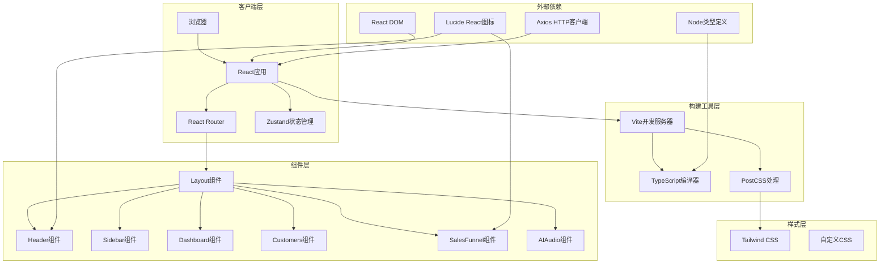
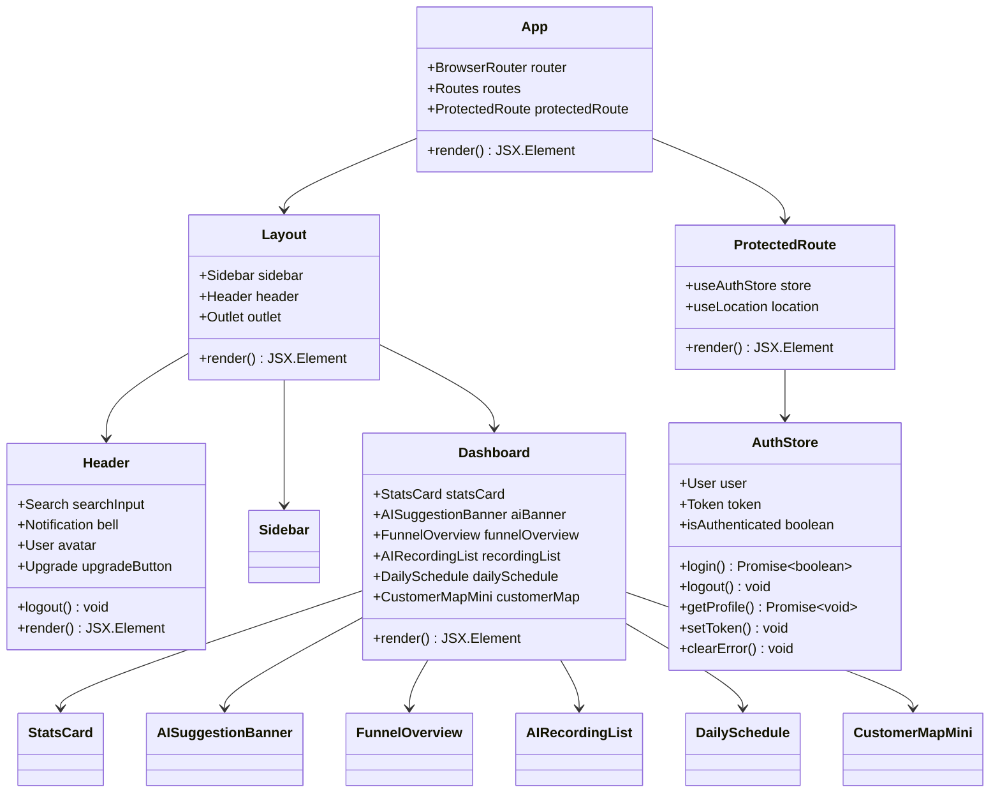

# 快速开始

<cite>
**本文档引用的文件**
- [package.json](file://crm-frontend/package.json)
- [README.md](file://crm-frontend/README.md)
- [vite.config.ts](file://crm-frontend/vite.config.ts)
- [tsconfig.json](file://crm-frontend/tsconfig.json)
- [tsconfig.app.json](file://crm-frontend/tsconfig.app.json)
- [tsconfig.node.json](file://crm-frontend/tsconfig.node.json)
- [eslint.config.js](file://crm-frontend/eslint.config.js)
- [postcss.config.js](file://crm-frontend/postcss.config.js)
- [main.tsx](file://crm-frontend/src/main.tsx)
- [App.tsx](file://crm-frontend/src/App.tsx)
- [Header.tsx](file://crm-frontend/src/components/layout/Header.tsx)
- [Layout.tsx](file://crm-frontend/src/components/layout/Layout.tsx)
- [Dashboard/index.tsx](file://crm-frontend/src/pages/Dashboard/index.tsx)
- [authStore.ts](file://crm-frontend/src/stores/authStore.ts)
- [index.html](file://crm-frontend/index.html)
</cite>

## 更新摘要
**所做更改**
- 更新了项目结构说明，反映实际的多页面应用架构
- 修正了TypeScript配置说明，反映双配置文件结构
- 更新了开发服务器配置，反映Vite 8.0的新特性
- 新增了路由系统和状态管理的说明
- 更新了环境要求，反映最新的依赖版本

## 目录
1. [简介](#简介)
2. [项目结构](#项目结构)
3. [环境要求](#环境要求)
4. [安装步骤](#安装步骤)
5. [开发服务器启动](#开发服务器启动)
6. [npm脚本详解](#npm脚本详解)
7. [常见问题排查](#常见问题排查)
8. [首次运行验证](#首次运行验证)
9. [架构概览](#架构概览)
10. [核心组件分析](#核心组件分析)
11. [性能考虑](#性能考虑)
12. [故障排除指南](#故障排除指南)
13. [结论](#结论)

## 简介

销售AI CRM系统是一个基于React 19、TypeScript和Vite构建的现代化客户关系管理平台。该系统集成了AI智能分析功能，提供销售漏斗可视化、音频分析、日程管理和地图视图等核心功能模块。项目采用Tailwind CSS进行样式设计，使用Lucide React图标库，为销售团队提供直观的数据洞察和智能化的工作流程支持。

**更新** 项目现已采用现代化的多页面应用架构，包含完整的路由系统和状态管理机制。

## 项目结构

该项目采用前端单页应用架构，主要目录结构如下：

```mermaid
graph TB
subgraph "项目根目录"
Root[项目根目录]
end
subgraph "前端应用 (crm-frontend)"
Frontend[crm-frontend]
Public[public/]
Src[src/]
Config[配置文件]
end
subgraph "源代码 (src/)"
Assets[assets/]
Components[components/]
Pages[pages/]
Services[services/]
Stores[stores/]
Types[types/]
Utils[utils/]
AppTSX[App.tsx]
MainTSX[main.tsx]
IndexHTML[index.html]
end
subgraph "组件模块"
Layout[Layout.tsx]
Header[Header.tsx]
Sidebar[Sidebar.tsx]
Dashboard[Dashboard/index.tsx]
Customers[Customers/index.tsx]
SalesFunnel[SalesFunnel/index.tsx]
AIAudio[AIAudio/index.tsx]
end
subgraph "配置文件"
ViteConfig[vite.config.ts]
TsConfig[tsconfig.json]
TsApp[tsconfig.app.json]
TsNode[tsconfig.node.json]
EslintConfig[eslint.config.js]
PostcssConfig[postcss.config.js]
End
Root --> Frontend
Frontend --> Public
Frontend --> Src
Frontend --> Config
Src --> Components
Src --> Pages
Src --> Services
Src --> Stores
Src --> Types
Src --> Utils
Src --> AppTSX
Src --> MainTSX
Src --> IndexHTML
Components --> Layout
Components --> Header
Components --> Sidebar
Pages --> Dashboard
Pages --> Customers
Pages --> SalesFunnel
Pages --> AIAudio
Config --> ViteConfig
Config --> TsConfig
Config --> TsApp
Config --> TsNode
Config --> EslintConfig
Config --> PostcssConfig
```

**图表来源**
- [package.json:1-38](file://crm-frontend/package.json#L1-L38)
- [App.tsx:1-68](file://crm-frontend/src/App.tsx#L1-L68)
- [main.tsx:1-11](file://crm-frontend/src/main.tsx#L1-L11)
- [index.html:1-14](file://crm-frontend/index.html#L1-L14)

**章节来源**
- [package.json:1-38](file://crm-frontend/package.json#L1-L38)
- [tsconfig.json:1-8](file://crm-frontend/tsconfig.json#L1-L8)

## 环境要求

### 系统要求

为了成功运行销售AI CRM系统，需要满足以下最低系统要求：

#### Node.js版本要求
- **Node.js**: 版本 18.0 或更高版本
- **npm**: 版本 8.0 或更高版本
- **yarn**: 版本 1.22 或更高版本（可选）

#### 操作系统兼容性
- **Windows**: Windows 10/11（推荐）
- **macOS**: macOS 10.15 或更高版本
- **Linux**: Ubuntu 18.04 LTS 或更高版本

#### 硬件要求
- **内存**: 至少 8GB RAM（推荐 16GB+）
- **存储空间**: 至少 2GB 可用磁盘空间
- **处理器**: Intel i5 或同等AMD处理器

### 开发工具链

#### 编译器和构建工具
- **TypeScript**: 版本 5.9.x
- **Vite**: 版本 8.0.x
- **React**: 版本 19.2.x
- **Tailwind CSS**: 版本 4.2.x

#### 开发依赖
- **ESLint**: 版本 9.39.x
- **PostCSS**: 版本 8.5.x
- **Autoprefixer**: 版本 10.4.x

**更新** 项目现在使用双TypeScript配置文件结构，分别针对应用代码和Node环境。

**章节来源**
- [package.json:12-36](file://crm-frontend/package.json#L12-L36)
- [tsconfig.app.json:1-29](file://crm-frontend/tsconfig.app.json#L1-L29)
- [tsconfig.node.json:1-27](file://crm-frontend/tsconfig.node.json#L1-L27)

## 安装步骤

### 步骤1：系统准备

在开始安装之前，请确保系统已满足所有要求：

1. **检查Node.js版本**：
   ```bash
   node --version
   npm --version
   ```

2. **更新包管理器**：
   ```bash
   npm install -g npm@latest
   ```

### 步骤2：项目克隆

使用Git克隆项目到本地开发环境：

```bash
# 使用HTTPS克隆
git clone https://github.com/your-repository/xiaoshou-crm.git

# 或使用SSH克隆
git clone git@github.com:your-repository/xiaoshou-crm.git
```

### 步骤3：进入项目目录

```bash
cd xiaoshou-crm/crm-frontend
```

### 步骤4：安装依赖包

根据团队偏好选择合适的包管理器：

#### 使用npm（推荐）
```bash
npm install
```

#### 使用yarn
```bash
yarn install
```

#### 使用pnpm
```bash
pnpm install
```

### 步骤5：验证安装

安装完成后，验证所有依赖是否正确安装：

```bash
npm list react react-dom
npm list typescript vite
```

**章节来源**
- [package.json:12-36](file://crm-frontend/package.json#L12-L36)

## 开发服务器启动

### 启动开发服务器

项目提供了多种启动方式，最常用的是开发模式：

#### 基础开发服务器
```bash
# 使用npm
npm run dev

# 使用yarn
yarn dev

# 使用pnpm
pnpm dev
```

#### 预览生产构建
```bash
# 构建生产版本
npm run build

# 预览生产构建
npm run preview

# 使用yarn
yarn preview

# 使用pnpm
pnpm preview
```

### 开发服务器配置

开发服务器默认配置如下：

- **端口**: 5173
- **主机**: localhost
- **热重载**: 启用
- **代理**: 无（本地开发）
- **严格端口模式**: 关闭（端口被占用时自动尝试下一个可用端口）

### 浏览器访问

启动成功后，在浏览器中访问：
```
http://localhost:5173
```

如果端口被占用，Vite会自动尝试下一个可用端口。

**更新** Vite 8.0现在支持更灵活的端口配置和更好的开发体验。

**章节来源**
- [vite.config.ts:1-13](file://crm-frontend/vite.config.ts#L1-L13)
- [package.json:6-11](file://crm-frontend/package.json#L6-L11)

## npm脚本详解

### 脚本概览

项目定义了四个主要的npm脚本，每个都有特定的用途和使用场景：

| 脚本名称 | 命令 | 描述 | 使用场景 |
|---------|------|------|----------|
| dev | `vite` | 启动开发服务器，启用热重载 | 日常开发调试 |
| build | `tsc -b && vite build` | 编译TypeScript并构建生产版本 | 生产部署 |
| lint | `eslint .` | 运行ESLint代码检查 | 代码质量保证 |
| preview | `vite preview` | 预览生产构建结果 | 构建验证 |

### 详细说明

#### 开发脚本 (`dev`)
- **功能**: 启动Vite开发服务器
- **特性**: 
  - 实时热重载
  - 错误边界显示
  - 源码映射
- **使用时机**: 日常开发、功能测试、调试

#### 构建脚本 (`build`)
- **功能**: 
  1. TypeScript编译 (`tsc -b`)
  2. Vite生产构建
- **输出**: `dist/`目录下的优化资源
- **使用时机**: 生产环境部署前

#### 代码检查 (`lint`)
- **功能**: ESLint静态代码分析
- **规则**: 
  - TypeScript推荐规则
  - React Hooks最佳实践
  - React Refresh支持
- **使用时机**: 提交代码前、CI/CD流水线

#### 预览脚本 (`preview`)
- **功能**: 启动静态服务器预览构建结果
- **用途**: 验证生产构建效果
- **使用时机**: 构建完成后验证

**章节来源**
- [package.json:6-11](file://crm-frontend/package.json#L6-L11)
- [eslint.config.js:1-24](file://crm-frontend/eslint.config.js#L1-L24)

## 常见问题排查

### 问题1：Node.js版本不兼容

**症状**：
```
Error: Your project requires Node.js >= 18.0.0
```

**解决方案**：
1. 升级Node.js到18.0或更高版本
2. 清理npm缓存：
   ```bash
   npm cache clean --force
   ```
3. 删除node_modules重新安装：
   ```bash
   rm -rf node_modules package-lock.json
   npm install
   ```

### 问题2：端口被占用

**症状**：
```
Error: EADDRINUSE: address already in use :::5173
```

**解决方案**：
1. 修改Vite配置中的端口号
2. 关闭占用端口的应用程序
3. 使用随机端口：
   ```bash
   vite --port 0
   ```

### 问题3：依赖安装失败

**症状**：
```
npm ERR! peer dep missing
```

**解决方案**：
1. 清理缓存：
   ```bash
   npm cache clean --force
   ```
2. 删除锁定文件：
   ```bash
   rm package-lock.json yarn.lock pnpm-lock.yaml
   ```
3. 重新安装：
   ```bash
   npm install --legacy-peer-deps
   ```

### 问题4：TypeScript编译错误

**症状**：
```
error TSXXXX: Cannot find module '...'
```

**解决方案**：
1. 检查TypeScript配置：
   ```bash
   npx tsc --noEmit
   ```
2. 更新类型定义：
   ```bash
   npm install @types/node @types/react @types/react-dom
   ```

### 问题5：热重载不工作

**症状**: 修改代码后页面不刷新

**解决方案**：
1. 检查防火墙设置
2. 禁用可能干扰的浏览器扩展
3. 重启开发服务器

**章节来源**
- [package.json:12-36](file://crm-frontend/package.json#L12-L36)
- [tsconfig.app.json:1-29](file://crm-frontend/tsconfig.app.json#L1-L29)

## 首次运行验证

### 验证步骤清单

#### 步骤1：确认开发服务器启动
1. 打开终端，执行 `npm run dev`
2. 查看控制台输出，确认无错误信息
3. 浏览器访问 `http://localhost:5173`

#### 步骤2：界面功能验证
1. **导航栏验证**: 确认顶部导航栏正常显示
2. **侧边栏验证**: 检查左侧菜单项可点击
3. **统计卡片**: 验证数据卡片显示正常
4. **AI横幅**: 确认AI智能建议区域加载

#### 步骤3：交互功能测试
1. **搜索功能**: 在搜索框输入内容，验证实时反馈
2. **通知系统**: 点击通知按钮，确认弹出菜单
3. **用户头像**: 点击用户头像，验证下拉菜单
4. **升级按钮**: 点击升级按钮，确认交互效果

#### 步骤4：组件功能验证
1. **销售漏斗**: 验证各阶段百分比显示
2. **音频分析**: 确认音频分析区域加载
3. **日程安排**: 检查日程列表显示
4. **地图视图**: 验证地图组件渲染

#### 步骤5：开发者工具检查
1. 打开浏览器开发者工具
2. 检查Console标签页无错误
3. 检查Network标签页请求正常
4. 检查Elements标签页DOM结构正确

### 验证结果标准

| 功能模块 | 验证标准 | 通过条件 |
|---------|----------|----------|
| 页面加载 | 3秒内完全渲染 | 无白屏时间 |
| 导航功能 | 所有链接可点击 | 无404错误 |
| 数据展示 | 显示模拟数据 | 无空值显示 |
| 交互响应 | 100ms内响应 | 无延迟卡顿 |
| 样式渲染 | Tailwind类生效 | 无样式缺失 |

**章节来源**
- [main.tsx:1-11](file://crm-frontend/src/main.tsx#L1-L11)
- [App.tsx:1-68](file://crm-frontend/src/App.tsx#L1-L68)

## 架构概览

### 系统架构图



**图表来源**
- [package.json:12-36](file://crm-frontend/package.json#L12-L36)
- [vite.config.ts:1-13](file://crm-frontend/vite.config.ts#L1-L13)
- [App.tsx:1-68](file://crm-frontend/src/App.tsx#L1-L68)
- [authStore.ts:1-123](file://crm-frontend/src/stores/authStore.ts#L1-L123)

### 技术栈说明

#### 前端框架
- **React 19**: 现代JavaScript库，提供组件化开发
- **TypeScript**: 强类型语言，提升代码质量和开发体验
- **Vite**: 快速构建工具，提供极速热重载
- **React Router 7**: 现代路由解决方案
- **Zustand**: 轻量级状态管理

#### 样式系统
- **Tailwind CSS 4.2**: 实用优先的CSS框架
- **PostCSS**: CSS后处理器，支持现代CSS特性
- **Autoprefixer**: 自动添加浏览器前缀

#### 开发工具
- **ESLint**: 代码质量检查工具
- **Lucide React**: 现代SVG图标库
- **React Hooks**: 函数式组件状态管理

**更新** 项目现在集成了完整的路由系统和状态管理，提供更好的用户体验。

**章节来源**
- [package.json:12-36](file://crm-frontend/package.json#L12-L36)
- [App.tsx:1-68](file://crm-frontend/src/App.tsx#L1-L68)
- [authStore.ts:1-123](file://crm-frontend/src/stores/authStore.ts#L1-L123)

## 核心组件分析

### 组件架构图



**图表来源**
- [App.tsx:1-68](file://crm-frontend/src/App.tsx#L1-L68)
- [Layout.tsx:1-24](file://crm-frontend/src/components/layout/Layout.tsx#L1-L24)
- [Header.tsx:1-88](file://crm-frontend/src/components/layout/Header.tsx#L1-L88)
- [Dashboard/index.tsx:1-395](file://crm-frontend/src/pages/Dashboard/index.tsx#L1-L395)
- [authStore.ts:1-123](file://crm-frontend/src/stores/authStore.ts#L1-L123)

### 组件功能详解

#### 应用主容器 (App)
- **职责**: 整体布局管理，协调各子组件
- **路由系统**: 基于React Router 7的完整路由配置
- **认证保护**: 路由守卫确保用户登录状态
- **响应式**: 支持不同屏幕尺寸

#### 布局组件 (Layout)
- **功能**: 主要页面布局容器
- **结构**: 左侧固定侧边栏 + 主内容区
- **响应式**: 移动端适配和折叠功能

#### 头部组件 (Header)
- **功能**: 搜索、通知、用户信息
- **交互**: 下拉菜单、通知徽章、用户登出
- **样式**: 渐变背景，圆角设计

#### 仪表板组件 (Dashboard)
- **数据展示**: 多种统计卡片和图表
- **AI功能**: 智能建议和录音分析
- **日程管理**: 今日日程和客户分布
- **响应式网格**: 适应不同屏幕尺寸

#### 认证状态管理 (AuthStore)
- **功能**: 用户认证状态管理
- **持久化**: 使用localStorage存储认证信息
- **API集成**: 与后端API进行认证交互
- **错误处理**: 完善的错误状态管理

#### 路由保护 (ProtectedRoute)
- **功能**: 路由守卫组件
- **逻辑**: 检查用户认证状态
- **重定向**: 未登录用户自动跳转到登录页

**更新** 项目现在包含完整的路由系统和状态管理，提供更好的用户体验和应用结构。

**章节来源**
- [App.tsx:1-68](file://crm-frontend/src/App.tsx#L1-L68)
- [Layout.tsx:1-24](file://crm-frontend/src/components/layout/Layout.tsx#L1-L24)
- [Header.tsx:1-88](file://crm-frontend/src/components/layout/Header.tsx#L1-L88)
- [Dashboard/index.tsx:1-395](file://crm-frontend/src/pages/Dashboard/index.tsx#L1-L395)
- [authStore.ts:1-123](file://crm-frontend/src/stores/authStore.ts#L1-L123)

## 性能考虑

### 构建优化

#### 代码分割
- **按需加载**: 路由级别的代码分割
- **懒加载组件**: 非关键路径组件延迟加载
- **动态导入**: 第三方库按需引入

#### 资源优化
- **Tree Shaking**: 移除未使用的代码
- **压缩算法**: 生产环境代码压缩
- **图片优化**: SVG图标内联，静态资源压缩

#### 缓存策略
- **浏览器缓存**: 静态资源长期缓存
- **服务端缓存**: API响应缓存
- **CDN加速**: 静态资源CDN分发

### 运行时性能

#### React优化
- **Memoization**: 复杂计算结果缓存
- **虚拟滚动**: 大数据集高效渲染
- **并发渲染**: 优先级调度

#### 内存管理
- **垃圾回收**: 及时清理事件监听器
- **泄漏检测**: 内存使用监控
- **资源释放**: 组件卸载时清理

### 开发体验优化

#### 热重载
- **增量编译**: 只编译变更文件
- **模块热替换**: 保持应用状态
- **错误隔离**: 编译错误不影响其他模块

#### 调试工具
- **Source Maps**: 源码映射调试
- **性能分析**: React DevTools
- **网络监控**: 请求追踪

**更新** Vite 8.0提供了更好的开发体验和性能优化。

## 故障排除指南

### 常见错误及解决方案

#### 编译错误

**错误类型**: TypeScript编译错误
**可能原因**:
- 类型定义不匹配
- 模块解析失败
- 配置文件语法错误

**解决步骤**:
1. 检查TypeScript配置文件
2. 验证类型定义完整性
3. 清理编译缓存
4. 重新安装依赖

#### 运行时错误

**错误类型**: React运行时异常
**可能原因**:
- 组件渲染错误
- 状态更新问题
- 事件处理异常

**解决步骤**:
1. 查看浏览器控制台
2. 检查组件props传递
3. 验证状态初始化
4. 添加错误边界

#### 性能问题

**症状**: 页面加载缓慢
**可能原因**:
- 资源过大
- 重复渲染
- 内存泄漏

**解决步骤**:
1. 分析Bundle大小
2. 检查渲染优化
3. 监控内存使用
4. 实施懒加载

### 调试技巧

#### 开发工具使用
- **React DevTools**: 组件树检查
- **Chrome DevTools**: 性能分析
- **ESLint**: 代码质量检查

#### 日志记录
- **控制台日志**: 关键信息输出
- **错误追踪**: 异常堆栈收集
- **性能标记**: 关键操作耗时

#### 环境诊断
- **Node版本**: 兼容性检查
- **网络连接**: API可达性
- **存储空间**: 磁盘容量监控

**章节来源**
- [eslint.config.js:1-24](file://crm-frontend/eslint.config.js#L1-L24)
- [tsconfig.app.json:1-29](file://crm-frontend/tsconfig.app.json#L1-L29)

## 结论

销售AI CRM系统提供了一个完整、现代化的前端开发环境，具备以下优势：

### 技术优势
- **现代化技术栈**: React 19 + TypeScript + Vite
- **开发体验**: 极速热重载，完善的错误提示
- **代码质量**: ESLint + TypeScript类型检查
- **样式系统**: Tailwind CSS + 自定义主题
- **路由系统**: 完整的React Router 7配置
- **状态管理**: Zustand轻量级状态管理

### 功能特色
- **AI智能分析**: 集成AI建议和数据分析
- **响应式设计**: 适配多设备屏幕
- **组件化架构**: 高内聚低耦合
- **可扩展性**: 模块化设计便于功能扩展
- **认证系统**: 完整的用户认证和授权

### 最佳实践
- **开发流程**: Git工作流 + CI/CD集成
- **代码规范**: ESLint规则 + TypeScript约束
- **性能优化**: 代码分割 + 缓存策略
- **用户体验**: 即时反馈 + 平滑动画
- **状态持久化**: localStorage自动保存

### 后续发展
建议持续关注以下发展方向：
- **AI功能增强**: 更智能的销售预测
- **移动端优化**: PWA支持
- **协作功能**: 团队共享和权限管理
- **数据分析**: 更丰富的可视化图表
- **性能监控**: 实时性能指标跟踪

通过遵循本指南的安装和配置步骤，您将能够快速搭建并运行销售AI CRM系统，为您的销售团队提供强大的数字化支持。