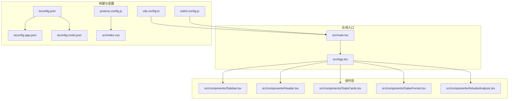
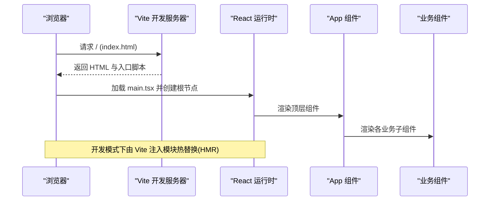
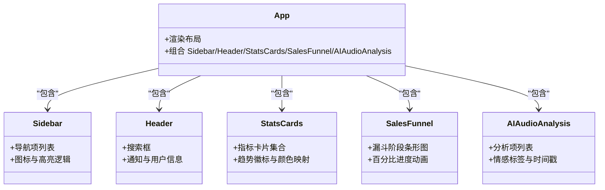

# 故障排除

<cite>
**本文引用的文件**
- [package.json](file://crm-frontend/package.json)
- [vite.config.ts](file://crm-frontend/vite.config.ts)
- [tsconfig.json](file://crm-frontend/tsconfig.json)
- [tsconfig.app.json](file://crm-frontend/tsconfig.app.json)
- [tsconfig.node.json](file://crm-frontend/tsconfig.node.json)
- [eslint.config.js](file://crm-frontend/eslint.config.js)
- [postcss.config.js](file://crm-frontend/postcss.config.js)
- [tailwind.config.js](file://crm-frontend/tailwind.config.js)
- [src/main.tsx](file://crm-frontend/src/main.tsx)
- [src/App.tsx](file://crm-frontend/src/App.tsx)
- [src/index.css](file://crm-frontend/src/index.css)
- [src/components/Sidebar.tsx](file://crm-frontend/src/components/Sidebar.tsx)
- [src/components/Header.tsx](file://crm-frontend/src/components/Header.tsx)
- [src/components/StatsCards.tsx](file://crm-frontend/src/components/StatsCards.tsx)
- [src/components/SalesFunnel.tsx](file://crm-frontend/src/components/SalesFunnel.tsx)
- [src/components/AIAudioAnalysis.tsx](file://crm-frontend/src/components/AIAudioAnalysis.tsx)
</cite>

## 目录
1. [简介](#简介)
2. [项目结构](#项目结构)
3. [核心组件](#核心组件)
4. [架构总览](#架构总览)
5. [详细组件分析](#详细组件分析)
6. [依赖与构建问题排查](#依赖与构建问题排查)
7. [TypeScript 编译问题排查](#typescript-编译问题排查)
8. [Vite 开发服务器问题排查](#vite-开发服务器问题排查)
9. [浏览器兼容性问题排查](#浏览器兼容性问题排查)
10. [网络请求与状态管理问题排查](#网络请求与状态管理问题排查)
11. [组件渲染与样式问题排查](#组件渲染与样式问题排查)
12. [性能问题识别与优化](#性能问题识别与优化)
13. [日志分析与错误追踪](#日志分析与错误追踪)
14. [结论](#结论)

## 简介
本指南面向销售AI CRM前端项目的开发者与运维人员，聚焦于常见开发与运行时问题的系统化排查与解决。内容覆盖依赖安装失败、TypeScript 编译错误、Vite 开发服务器问题、浏览器兼容性问题、网络请求与状态管理异常、组件渲染与样式问题、性能瓶颈识别与优化，以及日志与错误追踪方法。文档提供可操作的诊断流程与调试技巧，并辅以可视化图示帮助快速定位问题。

## 项目结构
该前端项目采用 Vite + React + TypeScript + TailwindCSS 技术栈，核心入口为 React 应用，通过 Vite 提供开发与构建能力；ESLint 负责代码质量检查；TailwindCSS 通过 PostCSS 插件集成。

**图表来源**
- [src/main.tsx:1-11](file://crm-frontend/src/main.tsx#L1-L11)
- [src/App.tsx:1-58](file://crm-frontend/src/App.tsx#L1-L58)
- [vite.config.ts:1-8](file://crm-frontend/vite.config.ts#L1-L8)
- [eslint.config.js:1-24](file://crm-frontend/eslint.config.js#L1-L24)
- [tsconfig.json:1-8](file://crm-frontend/tsconfig.json#L1-L8)
- [tsconfig.app.json](file://crm-frontend/tsconfig.app.json)
- [tsconfig.node.json](file://crm-frontend/tsconfig.node.json)
- [postcss.config.js:1-6](file://crm-frontend/postcss.config.js#L1-L6)
- [src/index.css:1-66](file://crm-frontend/src/index.css#L1-L66)

**章节来源**
- [package.json:1-36](file://crm-frontend/package.json#L1-L36)
- [vite.config.ts:1-8](file://crm-frontend/vite.config.ts#L1-L8)
- [tsconfig.json:1-8](file://crm-frontend/tsconfig.json#L1-L8)
- [eslint.config.js:1-24](file://crm-frontend/eslint.config.js#L1-L24)
- [postcss.config.js:1-6](file://crm-frontend/postcss.config.js#L1-L6)
- [src/main.tsx:1-11](file://crm-frontend/src/main.tsx#L1-L11)
- [src/App.tsx:1-58](file://crm-frontend/src/App.tsx#L1-L58)
- [src/index.css:1-66](file://crm-frontend/src/index.css#L1-L66)

## 核心组件
- 应用根节点：在入口文件中挂载 React 根节点并渲染顶层组件。
- 顶层布局：App 组件组织侧边栏、头部、主内容区与多个业务卡片组件。
- 样式基础：通过 TailwindCSS 与自定义主题变量实现统一视觉风格。

**章节来源**
- [src/main.tsx:1-11](file://crm-frontend/src/main.tsx#L1-L11)
- [src/App.tsx:1-58](file://crm-frontend/src/App.tsx#L1-L58)
- [src/index.css:1-66](file://crm-frontend/src/index.css#L1-L66)

## 架构总览
下图展示从浏览器到组件渲染的关键路径，以及与构建工具链的交互关系。

**图表来源**
- [src/main.tsx:1-11](file://crm-frontend/src/main.tsx#L1-L11)
- [src/App.tsx:1-58](file://crm-frontend/src/App.tsx#L1-L58)
- [vite.config.ts:1-8](file://crm-frontend/vite.config.ts#L1-L8)

## 详细组件分析
本节针对关键业务组件进行结构与数据流分析，便于定位渲染与交互问题。

**图表来源**
- [src/App.tsx:1-58](file://crm-frontend/src/App.tsx#L1-L58)
- [src/components/Sidebar.tsx:1-86](file://crm-frontend/src/components/Sidebar.tsx#L1-L86)
- [src/components/Header.tsx:1-53](file://crm-frontend/src/components/Header.tsx#L1-L53)
- [src/components/StatsCards.tsx:1-81](file://crm-frontend/src/components/StatsCards.tsx#L1-L81)
- [src/components/SalesFunnel.tsx:1-66](file://crm-frontend/src/components/SalesFunnel.tsx#L1-L66)
- [src/components/AIAudioAnalysis.tsx:1-82](file://crm-frontend/src/components/AIAudioAnalysis.tsx#L1-L82)

**章节来源**
- [src/App.tsx:1-58](file://crm-frontend/src/App.tsx#L1-L58)
- [src/components/Sidebar.tsx:1-86](file://crm-frontend/src/components/Sidebar.tsx#L1-L86)
- [src/components/Header.tsx:1-53](file://crm-frontend/src/components/Header.tsx#L1-L53)
- [src/components/StatsCards.tsx:1-81](file://crm-frontend/src/components/StatsCards.tsx#L1-L81)
- [src/components/SalesFunnel.tsx:1-66](file://crm-frontend/src/components/SalesFunnel.tsx#L1-L66)
- [src/components/AIAudioAnalysis.tsx:1-82](file://crm-frontend/src/components/AIAudioAnalysis.tsx#L1-L82)

## 依赖与构建问题排查
常见症状
- 安装依赖时报错（如网络超时、权限不足、版本冲突）
- 构建失败或产物缺失
- 开发服务器无法启动或端口占用

排查步骤
- 检查 Node 版本与包管理器缓存是否匹配当前项目要求
- 清理缓存并重装依赖
- 验证构建脚本与插件配置
- 确认端口未被占用，必要时修改 Vite 端口

建议修复
- 使用稳定镜像源与代理设置
- 升级 Node 版本至推荐范围
- 删除 lock 文件后重新安装
- 检查 Vite 插件与 TypeScript 配置一致性

**章节来源**
- [package.json:1-36](file://crm-frontend/package.json#L1-L36)
- [vite.config.ts:1-8](file://crm-frontend/vite.config.ts#L1-L8)
- [tsconfig.json:1-8](file://crm-frontend/tsconfig.json#L1-L8)

## TypeScript 编译问题排查
常见症状
- 编译报错（类型不匹配、缺少声明、隐式 any）
- 构建阶段中断
- IDE 中出现大量类型警告

排查步骤
- 查看根配置文件对 app 与 node 配置的引用关系
- 按文件逐个定位类型错误并修正
- 确保类型声明文件存在且路径正确
- 关闭严格模式或调整规则以定位问题范围

建议修复
- 明确类型注解，避免隐式 any
- 同步第三方库类型版本
- 在 tsconfig 中启用合适的检查选项

**章节来源**
- [tsconfig.json:1-8](file://crm-frontend/tsconfig.json#L1-L8)
- [tsconfig.app.json](file://crm-frontend/tsconfig.app.json)
- [tsconfig.node.json](file://crm-frontend/tsconfig.node.json)

## Vite 开发服务器问题排查
常见症状
- 启动失败或卡顿
- 页面空白或白屏
- 热更新无效或频繁刷新

排查步骤
- 检查插件配置是否正确加载 React 插件
- 确认入口文件与 HTML 引用路径
- 查看控制台错误与网络面板资源加载
- 尝试禁用插件或降级版本验证问题来源

建议修复
- 固定插件版本并保持与 Vite 兼容
- 清理缓存与临时文件后重启
- 调整开发服务器端口与主机绑定

**章节来源**
- [vite.config.ts:1-8](file://crm-frontend/vite.config.ts#L1-L8)
- [src/main.tsx:1-11](file://crm-frontend/src/main.tsx#L1-L11)

## 浏览器兼容性问题排查
常见症状
- 新特性导致旧版浏览器崩溃
- CSS 动画或过渡效果异常
- 字体加载失败或显示异常

排查步骤
- 使用浏览器开发者工具的设备模拟与兼容性视图
- 检查目标浏览器支持的 ES 特性与 polyfill 需求
- 核对 CSS 前缀与新旧语法差异
- 验证字体与资源跨域策略

建议修复
- 引入必要的 polyfill 或转换为兼容语法
- 使用 Autoprefixer 与 PostCSS 规则自动补全
- 为关键资源提供降级方案与回退样式

**章节来源**
- [postcss.config.js:1-6](file://crm-frontend/postcss.config.js#L1-L6)
- [src/index.css:1-66](file://crm-frontend/src/index.css#L1-L66)

## 网络请求与状态管理问题排查
常见症状
- 接口 404/500 或 CORS 失败
- 数据未更新或显示脏数据
- 异步状态切换闪烁或不一致

排查步骤
- 打开 Network 面板确认请求路径、参数与响应码
- 校验跨域头与鉴权头是否正确
- 检查状态更新时机与副作用清理
- 使用最小可复现示例定位异步流程

建议修复
- 统一使用受控的请求封装与错误处理
- 明确状态边界与不可变更新策略
- 添加加载态与错误态提示提升用户体验

[本节为通用排查建议，无需特定文件引用]

## 组件渲染与样式问题排查
常见症状
- 组件不显示或布局错位
- 图标不渲染或样式丢失
- 响应式断点不生效

排查步骤
- 检查组件导入与导出是否正确
- 核对类名拼写与 Tailwind 配置
- 使用 Elements 面板检查最终计算样式
- 验证 CSS 作用域与层叠顺序

建议修复
- 优先使用语义化类名与主题变量
- 将复杂样式拆分为可复用片段
- 在样式文件中添加注释与分组，便于维护

**章节来源**
- [src/components/Sidebar.tsx:1-86](file://crm-frontend/src/components/Sidebar.tsx#L1-L86)
- [src/components/Header.tsx:1-53](file://crm-frontend/src/components/Header.tsx#L1-L53)
- [src/components/StatsCards.tsx:1-81](file://crm-frontend/src/components/StatsCards.tsx#L1-L81)
- [src/components/SalesFunnel.tsx:1-66](file://crm-frontend/src/components/SalesFunnel.tsx#L1-L66)
- [src/components/AIAudioAnalysis.tsx:1-82](file://crm-frontend/src/components/AIAudioAnalysis.tsx#L1-L82)
- [src/index.css:1-66](file://crm-frontend/src/index.css#L1-L66)

## 性能问题识别与优化
常见症状
- 首屏加载缓慢
- 滚动掉帧或交互延迟
- 内存持续增长

排查步骤
- 使用 Performance 面板记录渲染与脚本执行
- 分析 Largest Contentful Paint(LCP)、First Input Delay(FID) 等指标
- 检查是否存在不必要的重渲染与大对象深拷贝
- 评估资源体积与请求数量

建议修复
- 拆分路由与组件懒加载
- 使用 React.memo、useMemo、useCallback 降低重渲染
- 压缩与按需引入第三方库
- 优化图片与字体加载策略

[本节为通用排查建议，无需特定文件引用]

## 日志分析与错误追踪
常见症状
- 控制台大量报错但无堆栈
- 生产环境错误难以复现
- 用户反馈问题描述不清

排查步骤
- 打开 Console 面板过滤错误与警告
- 结合 Source 面板查看源映射与断点调试
- 使用 Sentry 或自定义上报收集错误上下文
- 通过 Network 面板关联接口错误与前端异常

建议修复
- 在边界条件与异步回调中增加 try/catch
- 记录用户行为序列与关键状态快照
- 对第三方 SDK 错误进行兜底与降级

[本节为通用排查建议，无需特定文件引用]

## 结论
本指南提供了从依赖安装、TypeScript 编译、Vite 开发服务器到浏览器兼容性、网络与状态管理、组件渲染与样式的系统化排查流程，并结合性能与日志分析给出可落地的优化建议。建议在日常开发中建立标准化的本地环境与 CI 检查流程，以减少问题发生概率并加速定位修复。