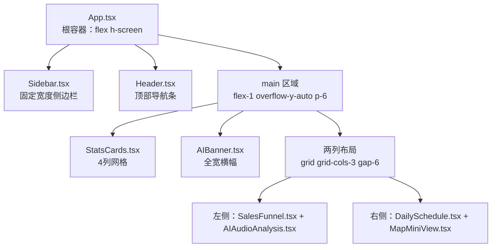
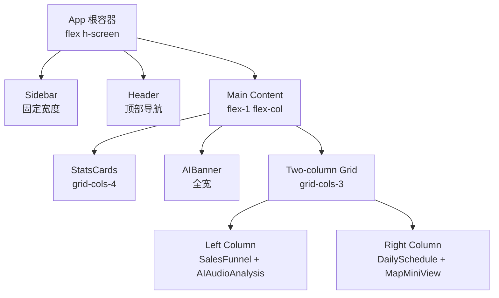
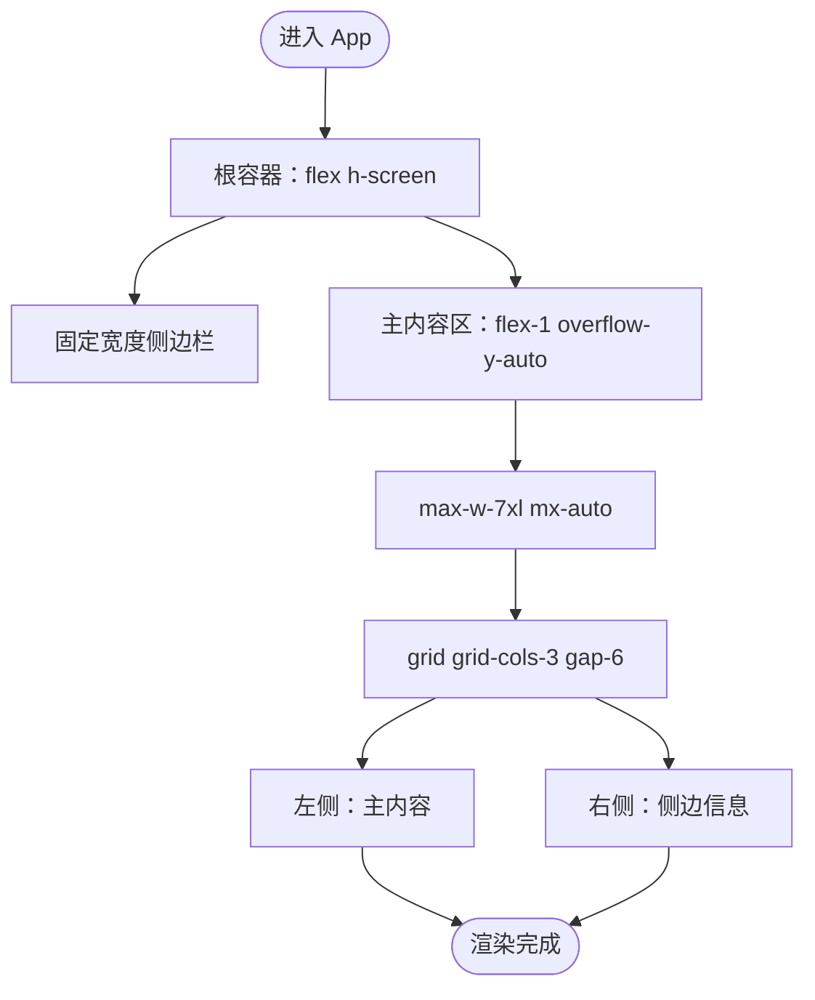
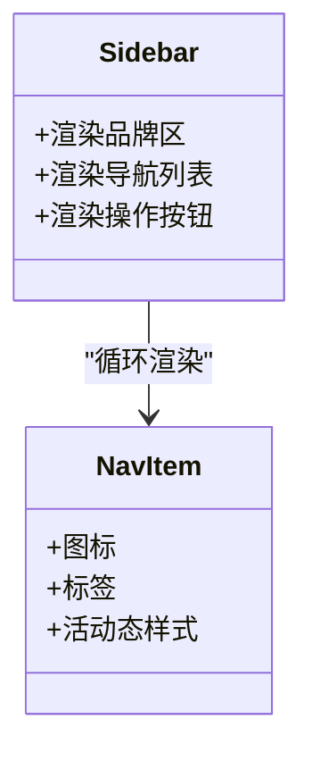
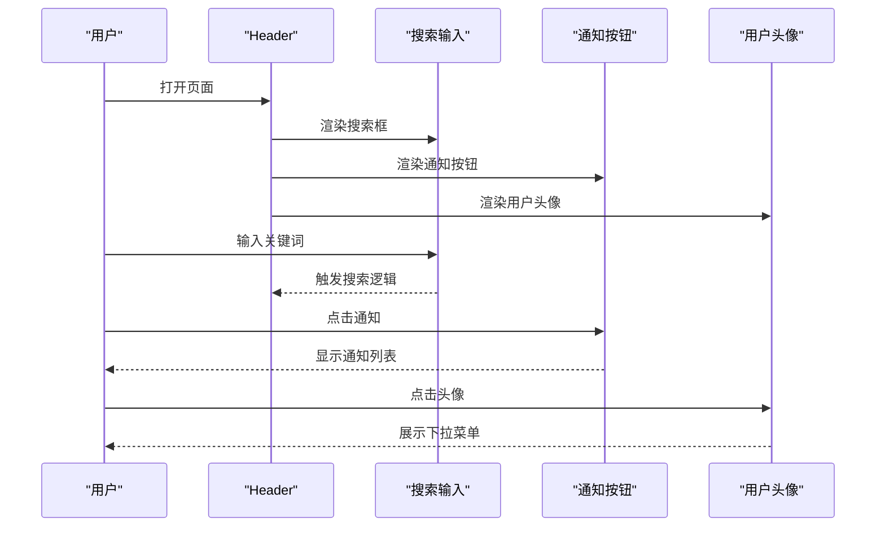
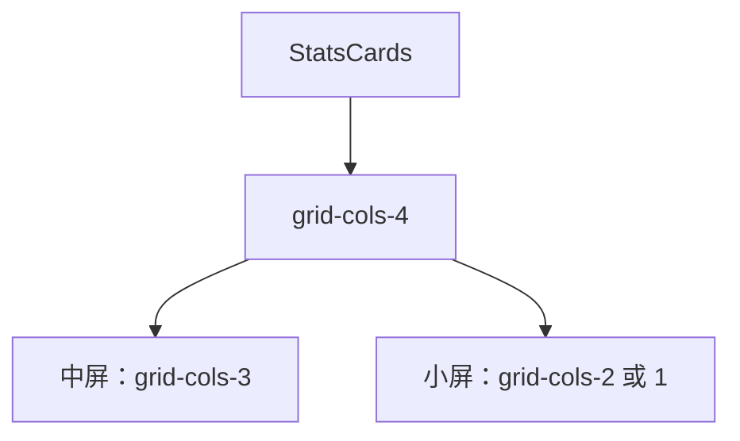
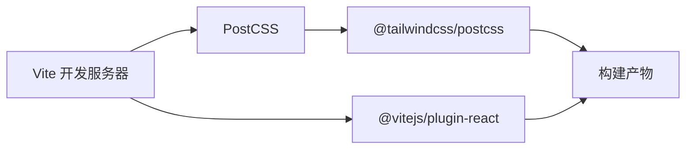

# 响应式布局架构

<cite>
**本文档引用的文件**
- [App.tsx](file://crm-frontend/src/App.tsx)
- [Sidebar.tsx](file://crm-frontend/src/components/Sidebar.tsx)
- [Header.tsx](file://crm-frontend/src/components/Header.tsx)
- [StatsCards.tsx](file://crm-frontend/src/components/StatsCards.tsx)
- [AIBanner.tsx](file://crm-frontend/src/components/AIBanner.tsx)
- [SalesFunnel.tsx](file://crm-frontend/src/components/SalesFunnel.tsx)
- [AIAudioAnalysis.tsx](file://crm-frontend/src/components/AIAudioAnalysis.tsx)
- [DailySchedule.tsx](file://crm-frontend/src/components/DailySchedule.tsx)
- [MapMiniView.tsx](file://crm-frontend/src/components/MapMiniView.tsx)
- [index.css](file://crm-frontend/src/index.css)
- [postcss.config.js](file://crm-frontend/postcss.config.js)
- [package.json](file://crm-frontend/package.json)
- [vite.config.ts](file://crm-frontend/vite.config.ts)
</cite>

## 目录
1. [简介](#简介)
2. [项目结构](#项目结构)
3. [核心组件](#核心组件)
4. [架构总览](#架构总览)
5. [详细组件分析](#详细组件分析)
6. [依赖关系分析](#依赖关系分析)
7. [性能考虑](#性能考虑)
8. [故障排除指南](#故障排除指南)
9. [结论](#结论)

## 简介
本文件面向销售AI CRM系统的前端响应式布局架构，重点解析基于 Tailwind CSS 的实现方式，涵盖网格系统、断点策略与移动端适配思路；同时深入分析 App 组件中的 flex 与 grid 布局组合、主内容区域自适应与侧边栏固定策略，并总结调试技巧与性能优化建议，确保在多设备上提供一致且高效的用户体验。

## 项目结构
该前端采用 React + TypeScript + Vite 构建，样式通过 Tailwind CSS 4.x 配合 PostCSS 插件进行处理。核心布局集中在 App 组件中，由侧边栏、头部导航与主内容区构成，主内容区进一步划分为统计卡片、AI横幅、两列式业务模块（左侧主内容、右侧侧边信息）。

图表来源
- [App.tsx:10-55](file://crm-frontend/src/App.tsx#L10-L55)
- [Sidebar.tsx:52-82](file://crm-frontend/src/components/Sidebar.tsx#L52-L82)
- [Header.tsx:3-49](file://crm-frontend/src/components/Header.tsx#L3-L49)
- [StatsCards.tsx:71-77](file://crm-frontend/src/components/StatsCards.tsx#L71-L77)
- [AIBanner.tsx:3-43](file://crm-frontend/src/components/AIBanner.tsx#L3-L43)
- [SalesFunnel.tsx:29-62](file://crm-frontend/src/components/SalesFunnel.tsx#L29-L62)
- [AIAudioAnalysis.tsx:38-78](file://crm-frontend/src/components/AIAudioAnalysis.tsx#L38-L78)
- [DailySchedule.tsx:26-66](file://crm-frontend/src/components/DailySchedule.tsx#L26-L66)
- [MapMiniView.tsx:3-54](file://crm-frontend/src/components/MapMiniView.tsx#L3-L54)

章节来源
- [App.tsx:10-55](file://crm-frontend/src/App.tsx#L10-L55)
- [index.css:1-66](file://crm-frontend/src/index.css#L1-L66)
- [postcss.config.js:1-6](file://crm-frontend/postcss.config.js#L1-L6)

## 核心组件
- 根容器与全局样式
  - 根容器使用 flex 布局并限定高度为视口高度，保证侧边栏与主内容区在同一垂直空间内自适应。
  - 全局样式重置与字体、滚动条定制，统一基础视觉风格。
- 侧边栏
  - 固定宽度，包含品牌区、导航项列表与操作按钮，支持纵向滚动以容纳更多菜单项。
- 头部导航
  - 左侧搜索框、右侧用户信息与通知入口，整体水平居中对齐，保持信息密度与交互一致性。
- 主内容区
  - 使用最大宽度与外边距实现内容居中，内部采用网格与分组布局组织多个业务模块。

章节来源
- [App.tsx:10-55](file://crm-frontend/src/App.tsx#L10-L55)
- [Sidebar.tsx:37-82](file://crm-frontend/src/components/Sidebar.tsx#L37-L82)
- [Header.tsx:3-49](file://crm-frontend/src/components/Header.tsx#L3-L49)
- [index.css:19-34](file://crm-frontend/src/index.css#L19-L34)

## 架构总览
下图展示从根组件到各业务模块的布局关系与数据流向：

图表来源
- [App.tsx:10-55](file://crm-frontend/src/App.tsx#L10-L55)
- [StatsCards.tsx:71-77](file://crm-frontend/src/components/StatsCards.tsx#L71-L77)
- [AIBanner.tsx:3-43](file://crm-frontend/src/components/AIBanner.tsx#L3-L43)
- [SalesFunnel.tsx:29-62](file://crm-frontend/src/components/SalesFunnel.tsx#L29-L62)
- [AIAudioAnalysis.tsx:38-78](file://crm-frontend/src/components/AIAudioAnalysis.tsx#L38-L78)
- [DailySchedule.tsx:26-66](file://crm-frontend/src/components/DailySchedule.tsx#L26-L66)
- [MapMiniView.tsx:3-54](file://crm-frontend/src/components/MapMiniView.tsx#L3-L54)

## 详细组件分析

### App 根布局与响应式策略
- 容器特性
  - 根容器采用 flex 垂直布局并强制占满视口高度，确保子元素按比例分配空间。
  - 主内容区使用 flex-1 实现自适应扩展，配合 overflow-y-auto 提供滚动体验。
- 内容约束
  - 最大宽度与自动外边距使内容在桌面端居中显示，避免过宽影响阅读。
- 响应式要点
  - 当前实现未显式使用 Tailwind 断点类，但通过容器约束与组件自身尺寸控制，可在小屏设备上自然换行与收缩。
  - 建议在关键布局处引入断点类以增强可控性（例如在网格列数、间距与字体大小上按需调整）。

图表来源
- [App.tsx:10-55](file://crm-frontend/src/App.tsx#L10-L55)

章节来源
- [App.tsx:10-55](file://crm-frontend/src/App.tsx#L10-L55)

### 侧边栏组件（Sidebar）
- 设计原则
  - 固定宽度与独立滚动区域，保证导航项在长列表时仍可稳定访问。
  - 活动状态与悬停态通过颜色与过渡效果提升交互反馈。
- 响应式策略
  - 在小屏设备上，当前固定宽度可能溢出；建议在小屏时隐藏或折叠侧边栏，并提供汉堡菜单入口。
  - 可结合断点类在窄屏时切换为抽屉式布局。

图表来源
- [Sidebar.tsx:37-82](file://crm-frontend/src/components/Sidebar.tsx#L37-L82)
- [Sidebar.tsx:16-35](file://crm-frontend/src/components/Sidebar.tsx#L16-L35)

章节来源
- [Sidebar.tsx:37-82](file://crm-frontend/src/components/Sidebar.tsx#L37-L82)

### 头部组件（Header）
- 设计原则
  - 搜索框与用户信息分治，左右对称布局，便于信息检索与账户操作。
  - 通知徽标与下拉指示器增强状态表达。
- 响应式策略
  - 搜索框在窄屏时可缩小或隐藏，用户信息区域可简化为头像入口。
  - 建议在极窄屏时将搜索框移至专用页面或下拉面板。

图表来源
- [Header.tsx:3-49](file://crm-frontend/src/components/Header.tsx#L3-L49)

章节来源
- [Header.tsx:3-49](file://crm-frontend/src/components/Header.tsx#L3-L49)

### 统计卡片（StatsCards）
- 设计原则
  - 四列网格在桌面端充分利用横向空间，图标、数值与趋势标签清晰传达指标。
- 响应式策略
  - 建议在中等屏时减少为三列，在小屏时降为双列或单列，以避免拥挤。
  - 间距与字号随断点调整，确保可读性。

图表来源
- [StatsCards.tsx:71-77](file://crm-frontend/src/components/StatsCards.tsx#L71-L77)

章节来源
- [StatsCards.tsx:71-77](file://crm-frontend/src/components/StatsCards.tsx#L71-L77)

### 销售漏斗（SalesFunnel）
- 设计原则
  - 阶段进度条与百分比可视化，辅助快速评估销售阶段健康度。
- 响应式策略
  - 进度条容器在窄屏时可缩短宽度并调整字体大小，确保标签与数值清晰可见。

章节来源
- [SalesFunnel.tsx:29-62](file://crm-frontend/src/components/SalesFunnel.tsx#L29-L62)

### AI音频分析（AIAudioAnalysis）
- 设计原则
  - 时间线与情感标签结合，便于快速筛选与定位重要对话摘要。
- 响应式策略
  - 在窄屏时缩短时间戳与摘要长度，必要时启用省略号与点击展开。

章节来源
- [AIAudioAnalysis.tsx:38-78](file://crm-frontend/src/components/AIAudioAnalysis.tsx#L38-L78)

### 日程安排（DailySchedule）
- 设计原则
  - 时间轴样式突出事件顺序，彩色圆点增强可读性。
- 响应式策略
  - 在窄屏时将时间轴改为紧凑列表，减少左右留白。

章节来源
- [DailySchedule.tsx:26-66](file://crm-frontend/src/components/DailySchedule.tsx#L26-L66)

### 地图预览（MapMiniView）
- 设计原则
  - 简化的 SVG 地图背景与定位标记，直观展示客户分布。
- 响应式策略
  - 在窄屏时降低地图高度与标记尺寸，保证整体比例协调。

章节来源
- [MapMiniView.tsx:3-54](file://crm-frontend/src/components/MapMiniView.tsx#L3-L54)

## 依赖关系分析
- 构建与样式链路
  - Vite 负责开发与打包，React 插件提供组件热更新。
  - PostCSS 加载 Tailwind 插件，将原子化样式注入产物。
  - Tailwind CSS 4.x 提供实用工具类与默认主题变量。
- 关键依赖
  - @tailwindcss/postcss、tailwindcss、autoprefixer、postcss。
  - lucide-react 提供图标资源。

图表来源
- [vite.config.ts:1-8](file://crm-frontend/vite.config.ts#L1-L8)
- [postcss.config.js:1-6](file://crm-frontend/postcss.config.js#L1-L6)
- [package.json:12-34](file://crm-frontend/package.json#L12-L34)

章节来源
- [vite.config.ts:1-8](file://crm-frontend/vite.config.ts#L1-L8)
- [postcss.config.js:1-6](file://crm-frontend/postcss.config.js#L1-L6)
- [package.json:12-34](file://crm-frontend/package.json#L12-L34)

## 性能考虑
- 渲染性能
  - 将长列表组件（如导航项、日程项）拆分为独立子组件，减少不必要的重渲染。
  - 对频繁更新的状态使用局部状态管理，避免父级大面积重绘。
- 样式体积
  - 合理使用 Tailwind 实用类，避免重复定义相似样式；利用 @apply 与自定义工具类集中管理。
  - 在生产环境开启 Tree Shaking 与 CSS 压缩，减少包体大小。
- 交互体验
  - 为滚动区域设置合适的滚动行为，避免滚动穿透与卡顿。
  - 图标与图片采用懒加载策略，减少首屏压力。

## 故障排除指南
- 样式未生效
  - 检查 PostCSS 插件是否正确加载 Tailwind 插件。
  - 确认 Tailwind 版本与插件版本兼容。
- 布局错位
  - 检查容器高度与 flex 属性是否正确设置。
  - 确保内容区设置了最大宽度与居中策略。
- 移动端显示异常
  - 为关键布局添加断点类，确保在小屏时自动调整列数与间距。
  - 测试不同方向旋转场景，验证布局稳定性。

章节来源
- [postcss.config.js:1-6](file://crm-frontend/postcss.config.js#L1-L6)
- [index.css:19-34](file://crm-frontend/src/index.css#L19-L34)
- [App.tsx:10-55](file://crm-frontend/src/App.tsx#L10-L55)

## 结论
本项目以简洁的 flex 与 grid 组合实现了清晰的布局骨架，配合 Tailwind CSS 的原子化工具类与全局样式基线，能够在桌面端高效承载丰富的业务模块。为进一步提升移动端体验，建议引入断点类与侧边栏折叠机制，并在关键组件中增加响应式适配策略。通过合理的依赖管理与性能优化，可确保在多设备上提供一致、流畅的用户体验。