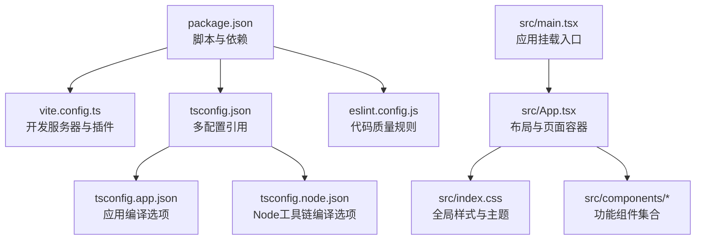
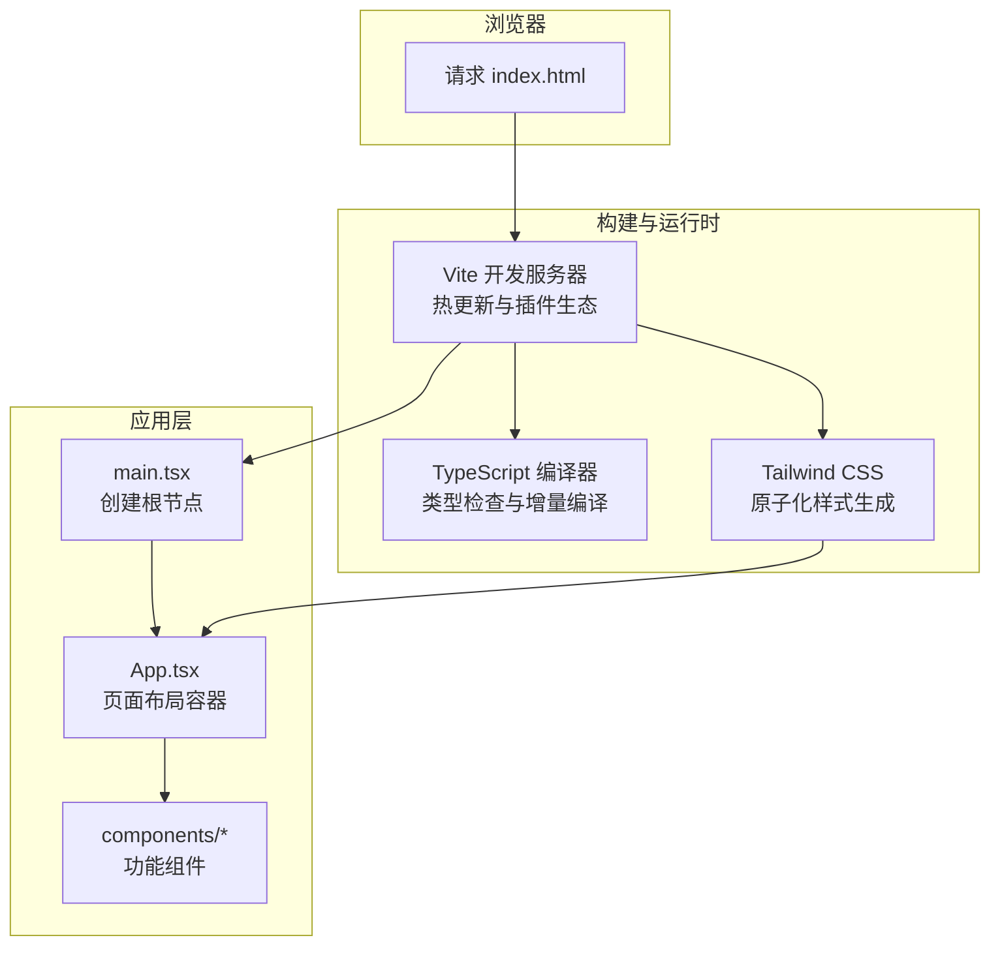
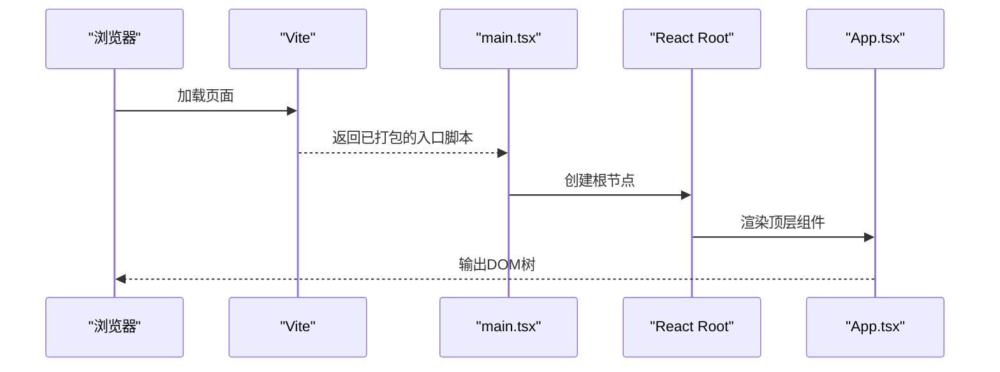
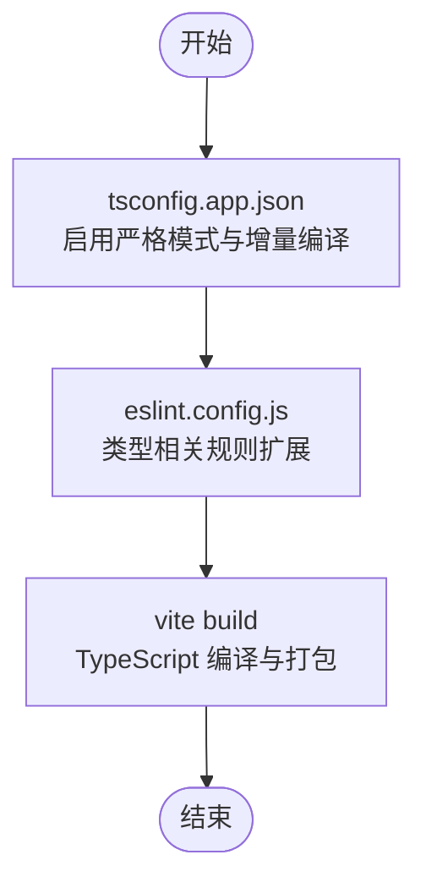
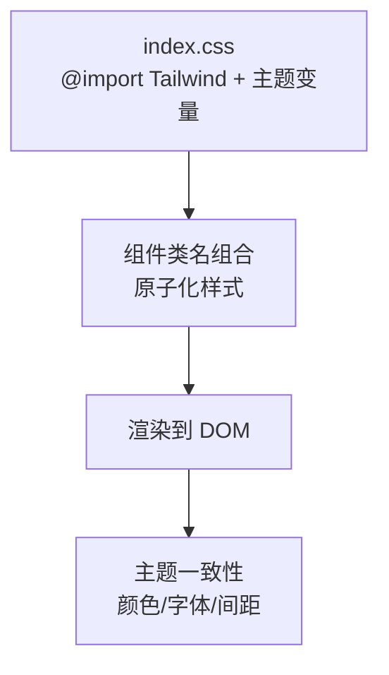
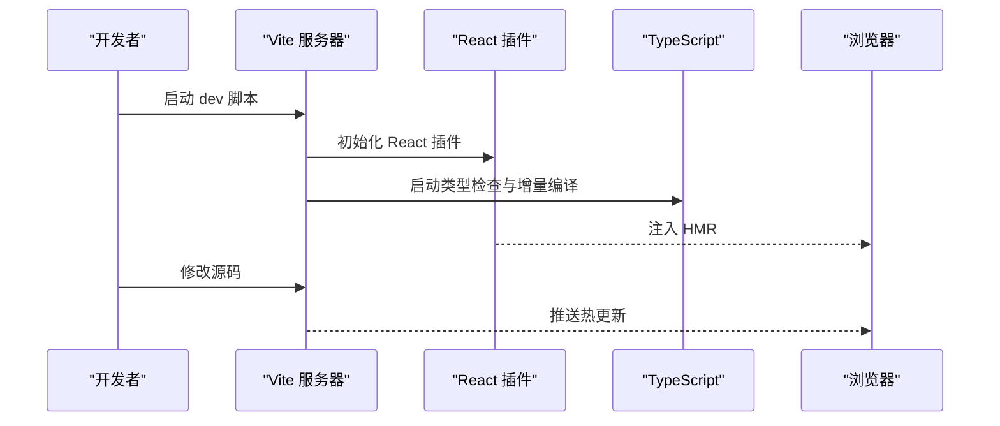
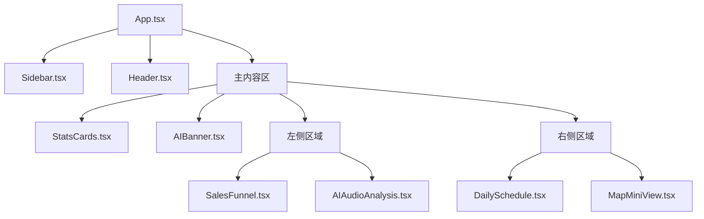
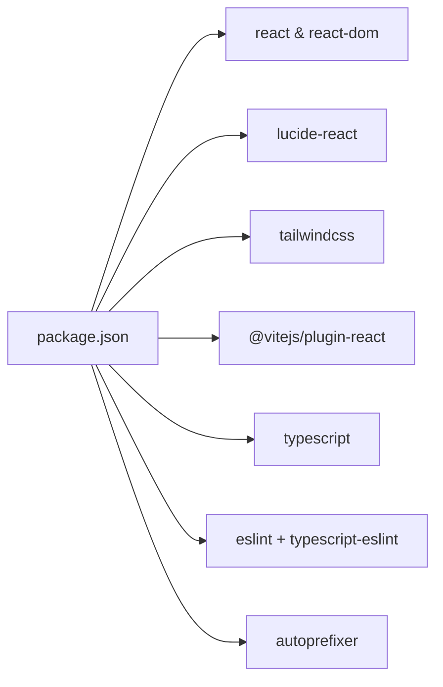

# 技术栈架构

<cite>
**本文引用的文件**
- [package.json](file://crm-frontend/package.json)
- [vite.config.ts](file://crm-frontend/vite.config.ts)
- [tsconfig.json](file://crm-frontend/tsconfig.json)
- [tsconfig.app.json](file://crm-frontend/tsconfig.app.json)
- [tsconfig.node.json](file://crm-frontend/tsconfig.node.json)
- [eslint.config.js](file://crm-frontend/eslint.config.js)
- [src/main.tsx](file://crm-frontend/src/main.tsx)
- [src/App.tsx](file://crm-frontend/src/App.tsx)
- [src/index.css](file://crm-frontend/src/index.css)
- [src/components/Header.tsx](file://crm-frontend/src/components/Header.tsx)
- [src/components/Sidebar.tsx](file://crm-frontend/src/components/Sidebar.tsx)
- [src/components/StatsCards.tsx](file://crm-frontend/src/components/StatsCards.tsx)
- [src/components/AIBanner.tsx](file://crm-frontend/src/components/AIBanner.tsx)
- [src/components/SalesFunnel.tsx](file://crm-frontend/src/components/SalesFunnel.tsx)
</cite>

## 目录
1. [引言](#引言)
2. [项目结构](#项目结构)
3. [核心组件](#核心组件)
4. [架构总览](#架构总览)
5. [详细组件分析](#详细组件分析)
6. [依赖关系分析](#依赖关系分析)
7. [性能考量](#性能考量)
8. [故障排查指南](#故障排查指南)
9. [结论](#结论)
10. [附录](#附录)

## 引言
本技术栈架构文档面向“销售AI CRM系统”前端工程，系统性阐述 React 19 + TypeScript + Tailwind CSS + Vite 的选型理由与协同机制。文档从代码结构、数据流、处理逻辑与集成点出发，结合配置文件与组件实现，解释各技术在项目中的职责与最佳实践，并给出权衡建议与优化方向。

## 项目结构
该前端工程采用模块化组织：入口脚本与构建工具位于根目录配置中；应用主入口与全局样式在 src 下；业务组件按功能拆分至 components 子目录。整体遵循“约定优于配置”的现代前端工程范式，便于开发效率与可维护性的平衡。

图表来源
- [package.json:1-36](file://crm-frontend/package.json#L1-L36)
- [vite.config.ts:1-8](file://crm-frontend/vite.config.ts#L1-L8)
- [tsconfig.json:1-8](file://crm-frontend/tsconfig.json#L1-L8)
- [tsconfig.app.json:1-29](file://crm-frontend/tsconfig.app.json#L1-L29)
- [tsconfig.node.json:1-27](file://crm-frontend/tsconfig.node.json#L1-L27)
- [eslint.config.js:1-24](file://crm-frontend/eslint.config.js#L1-L24)
- [src/main.tsx:1-11](file://crm-frontend/src/main.tsx#L1-L11)
- [src/App.tsx:1-58](file://crm-frontend/src/App.tsx#L1-L58)
- [src/index.css:1-66](file://crm-frontend/src/index.css#L1-L66)

章节来源
- [package.json:1-36](file://crm-frontend/package.json#L1-L36)
- [vite.config.ts:1-8](file://crm-frontend/vite.config.ts#L1-L8)
- [tsconfig.json:1-8](file://crm-frontend/tsconfig.json#L1-L8)
- [tsconfig.app.json:1-29](file://crm-frontend/tsconfig.app.json#L1-L29)
- [tsconfig.node.json:1-27](file://crm-frontend/tsconfig.node.json#L1-L27)
- [eslint.config.js:1-24](file://crm-frontend/eslint.config.js#L1-L24)
- [src/main.tsx:1-11](file://crm-frontend/src/main.tsx#L1-L11)
- [src/App.tsx:1-58](file://crm-frontend/src/App.tsx#L1-L58)
- [src/index.css:1-66](file://crm-frontend/src/index.css#L1-L66)

## 核心组件
- 应用入口与挂载：通过入口文件创建根节点并渲染顶层组件，确保严格模式启用，利于早期发现潜在问题。
- 布局容器：顶层 App 负责页面骨架与网格布局，统一承载侧边栏、头部、统计卡片、AI横幅、销售漏斗、音频分析、日程与地图等子组件。
- 全局样式：引入 Tailwind 并自定义主题变量与通用排版，同时提供滚动条与工具类增强视觉一致性。
- 组件体系：以功能域划分，如导航、头部、统计卡、AI横幅、漏斗图等，均使用 Lucide React 图标库，配合 Tailwind 原子化类名实现一致风格。

章节来源
- [src/main.tsx:1-11](file://crm-frontend/src/main.tsx#L1-L11)
- [src/App.tsx:1-58](file://crm-frontend/src/App.tsx#L1-L58)
- [src/index.css:1-66](file://crm-frontend/src/index.css#L1-L66)
- [src/components/Header.tsx:1-53](file://crm-frontend/src/components/Header.tsx#L1-L53)
- [src/components/Sidebar.tsx:1-86](file://crm-frontend/src/components/Sidebar.tsx#L1-L86)
- [src/components/StatsCards.tsx:1-81](file://crm-frontend/src/components/StatsCards.tsx#L1-L81)
- [src/components/AIBanner.tsx:1-47](file://crm-frontend/src/components/AIBanner.tsx#L1-L47)
- [src/components/SalesFunnel.tsx:1-66](file://crm-frontend/src/components/SalesFunnel.tsx#L1-L66)

## 架构总览
下图展示从浏览器到组件渲染的关键路径，以及样式与构建工具的协同：

图表来源
- [src/main.tsx:1-11](file://crm-frontend/src/main.tsx#L1-L11)
- [src/App.tsx:1-58](file://crm-frontend/src/App.tsx#L1-L58)
- [vite.config.ts:1-8](file://crm-frontend/vite.config.ts#L1-L8)
- [tsconfig.app.json:1-29](file://crm-frontend/tsconfig.app.json#L1-L29)
- [src/index.css:1-66](file://crm-frontend/src/index.css#L1-L66)

## 详细组件分析

### React 19：声明式UI与严格模式
- 角色与职责：负责组件化视图与状态管理，提供严格模式以尽早暴露异常。
- 集成方式：入口文件启用严格模式并挂载顶层 App；App 作为布局容器协调多个功能组件。
- 最佳实践：保持函数组件纯度，避免副作用直接发生在渲染阶段；利用 Suspense 与并发特性（如可用）提升交互体验。

图表来源
- [src/main.tsx:1-11](file://crm-frontend/src/main.tsx#L1-L11)
- [src/App.tsx:1-58](file://crm-frontend/src/App.tsx#L1-L58)

章节来源
- [src/main.tsx:1-11](file://crm-frontend/src/main.tsx#L1-L11)
- [src/App.tsx:1-58](file://crm-frontend/src/App.tsx#L1-L58)

### TypeScript：类型安全与工程化
- 角色与职责：通过严格的编译选项与多配置文件组织，确保应用层与工具层的类型一致性。
- 配置要点：
  - 应用配置启用严格模式、未使用变量/参数检查、不可检查导入等策略，提升代码质量。
  - 工具链配置聚焦 Node 环境，保证 Vite 等工具的类型支持。
- 协同机制：与 ESLint 类型规则联动，形成“编译期+运行期”的双重保障。

图表来源
- [tsconfig.app.json:1-29](file://crm-frontend/tsconfig.app.json#L1-L29)
- [tsconfig.node.json:1-27](file://crm-frontend/tsconfig.node.json#L1-L27)
- [eslint.config.js:1-24](file://crm-frontend/eslint.config.js#L1-L24)
- [package.json:8-8](file://crm-frontend/package.json#L8-L8)

章节来源
- [tsconfig.app.json:1-29](file://crm-frontend/tsconfig.app.json#L1-L29)
- [tsconfig.node.json:1-27](file://crm-frontend/tsconfig.node.json#L1-L27)
- [eslint.config.js:1-24](file://crm-frontend/eslint.config.js#L1-L24)
- [package.json:8-8](file://crm-frontend/package.json#L8-L8)

### Tailwind CSS：原子化样式系统
- 角色与职责：提供可组合的原子类，快速构建一致的UI风格，减少手写CSS的工作量。
- 集成方式：全局样式中引入框架并自定义主题变量，同时提供通用排版、滚动条与工具类。
- 组件实践：各功能组件通过类名组合实现布局、颜色、间距与交互态，降低样式耦合。

图表来源
- [src/index.css:1-66](file://crm-frontend/src/index.css#L1-L66)
- [src/components/Header.tsx:1-53](file://crm-frontend/src/components/Header.tsx#L1-L53)
- [src/components/Sidebar.tsx:1-86](file://crm-frontend/src/components/Sidebar.tsx#L1-L86)
- [src/components/StatsCards.tsx:1-81](file://crm-frontend/src/components/StatsCards.tsx#L1-L81)
- [src/components/AIBanner.tsx:1-47](file://crm-frontend/src/components/AIBanner.tsx#L1-L47)
- [src/components/SalesFunnel.tsx:1-66](file://crm-frontend/src/components/SalesFunnel.tsx#L1-L66)

章节来源
- [src/index.css:1-66](file://crm-frontend/src/index.css#L1-L66)
- [src/components/Header.tsx:1-53](file://crm-frontend/src/components/Header.tsx#L1-L53)
- [src/components/Sidebar.tsx:1-86](file://crm-frontend/src/components/Sidebar.tsx#L1-L86)
- [src/components/StatsCards.tsx:1-81](file://crm-frontend/src/components/StatsCards.tsx#L1-L81)
- [src/components/AIBanner.tsx:1-47](file://crm-frontend/src/components/AIBanner.tsx#L1-L47)
- [src/components/SalesFunnel.tsx:1-66](file://crm-frontend/src/components/SalesFunnel.tsx#L1-L66)

### Vite：快速开发体验与构建
- 角色与职责：提供开发服务器、热更新与现代化打包能力，配合 React 插件提升 DX。
- 配置要点：最小化配置启用 React 插件，满足开发与生产构建需求。
- 协同机制：与 TypeScript 编译器并行工作，确保类型检查与热更新的高效协同。

图表来源
- [package.json:7-7](file://crm-frontend/package.json#L7-L7)
- [vite.config.ts:1-8](file://crm-frontend/vite.config.ts#L1-L8)
- [tsconfig.app.json:1-29](file://crm-frontend/tsconfig.app.json#L1-L29)

章节来源
- [package.json:7-7](file://crm-frontend/package.json#L7-L7)
- [vite.config.ts:1-8](file://crm-frontend/vite.config.ts#L1-L8)
- [tsconfig.app.json:1-29](file://crm-frontend/tsconfig.app.json#L1-L29)

### 组件级架构：以 App 为中心的布局与数据流
- 布局容器：App 负责整体栅格与区域划分，统一承载侧边栏、头部、主内容区与多个功能面板。
- 数据与交互：组件通过 props 传递数据与回调，使用原子类名实现一致的视觉语言；图标库统一风格。
- 可扩展性：新增组件仅需在 App 中注册并按需引入，符合单一职责与低耦合原则。

图表来源
- [src/App.tsx:1-58](file://crm-frontend/src/App.tsx#L1-L58)
- [src/components/Sidebar.tsx:1-86](file://crm-frontend/src/components/Sidebar.tsx#L1-L86)
- [src/components/Header.tsx:1-53](file://crm-frontend/src/components/Header.tsx#L1-L53)
- [src/components/StatsCards.tsx:1-81](file://crm-frontend/src/components/StatsCards.tsx#L1-L81)
- [src/components/AIBanner.tsx:1-47](file://crm-frontend/src/components/AIBanner.tsx#L1-L47)
- [src/components/SalesFunnel.tsx:1-66](file://crm-frontend/src/components/SalesFunnel.tsx#L1-L66)

章节来源
- [src/App.tsx:1-58](file://crm-frontend/src/App.tsx#L1-L58)
- [src/components/Sidebar.tsx:1-86](file://crm-frontend/src/components/Sidebar.tsx#L1-L86)
- [src/components/Header.tsx:1-53](file://crm-frontend/src/components/Header.tsx#L1-L53)
- [src/components/StatsCards.tsx:1-81](file://crm-frontend/src/components/StatsCards.tsx#L1-L81)
- [src/components/AIBanner.tsx:1-47](file://crm-frontend/src/components/AIBanner.tsx#L1-L47)
- [src/components/SalesFunnel.tsx:1-66](file://crm-frontend/src/components/SalesFunnel.tsx#L1-L66)

## 依赖关系分析
- 运行时依赖：React 19 与 React DOM 提供声明式UI；Lucide React 提供图标；Tailwind PostCSS 插件用于样式管线。
- 开发依赖：Vite 与 React 插件提供开发体验；TypeScript 与类型包提供类型安全；ESLint 生态保障代码规范。
- 脚本命令：dev 启动开发服务器；build 执行类型检查与打包；lint 运行代码质量检查；preview 预览生产包。

图表来源
- [package.json:12-34](file://crm-frontend/package.json#L12-L34)

章节来源
- [package.json:12-34](file://crm-frontend/package.json#L12-L34)

## 性能考量
- 开发体验：Vite 的冷启与热更新显著缩短等待时间；React 插件与 HMR 协同提升迭代效率。
- 构建性能：TypeScript 增量编译与 Vite 并行流水线减少构建时间；按需引入与 Tree Shaking 降低产物体积。
- 样式性能：Tailwind 原子类减少重复样式与选择器复杂度，提升渲染效率；主题变量集中管理，避免样式碎片化。
- 代码质量：严格编译选项与 ESLint 规则降低运行时错误概率，间接提升稳定性与可维护性。

## 故障排查指南
- 开发服务器无法启动
  - 检查开发脚本与插件配置是否正确加载。
  - 章节来源
    - [package.json:7-7](file://crm-frontend/package.json#L7-L7)
    - [vite.config.ts:1-8](file://crm-frontend/vite.config.ts#L1-L8)
- 类型检查报错
  - 确认应用与工具链配置的严格模式与类型扩展是否匹配。
  - 章节来源
    - [tsconfig.app.json:20-25](file://crm-frontend/tsconfig.app.json#L20-L25)
    - [tsconfig.node.json:17-23](file://crm-frontend/tsconfig.node.json#L17-L23)
- 样式未生效或冲突
  - 检查全局样式引入顺序与主题变量覆盖是否正确。
  - 章节来源
    - [src/index.css:1-66](file://crm-frontend/src/index.css#L1-L66)
- 代码质量告警
  - 使用 lint 脚本修复规则问题，必要时调整 ESLint 配置。
  - 章节来源
    - [eslint.config.js:1-24](file://crm-frontend/eslint.config.js#L1-L24)
    - [package.json:9-9](file://crm-frontend/package.json#L9-L9)

## 结论
本技术栈以 React 19 的声明式能力为基础，借助 TypeScript 的类型安全与 Vite 的高效开发体验，结合 Tailwind CSS 的原子化样式系统，实现了高可维护性与快速迭代的前端架构。通过合理的配置与组件化设计，系统在性能、开发效率与可维护性之间取得良好平衡，适合持续演进的销售AI CRM场景。

## 附录
- 最佳实践建议
  - 保持组件无副作用，将异步逻辑封装在 hooks 中。
  - 使用原子类名优先于内联样式，统一主题变量与命名空间。
  - 利用 Vite 的按需加载与懒加载策略优化首屏性能。
  - 在 CI 中集成 lint 与类型检查，确保提交质量。
- 权衡考虑
  - 性能：Vite 与 Tailwind 在开发期与生产期均有良好表现，但需注意样式体量控制。
  - 开发效率：React 19 与 Vite 的组合显著提升 DX，适合快速原型与迭代。
  - 维护性：严格的类型与 ESLint 规则有助于长期维护，建议持续完善规则集。