# 技术栈架构

<cite>
**本文引用的文件**
- [package.json](file://crm-frontend/package.json)
- [vite.config.ts](file://crm-frontend/vite.config.ts)
- [tsconfig.json](file://crm-frontend/tsconfig.json)
- [tsconfig.app.json](file://crm-frontend/tsconfig.app.json)
- [tsconfig.node.json](file://crm-frontend/tsconfig.node.json)
- [eslint.config.js](file://crm-frontend/eslint.config.js)
- [src/main.tsx](file://crm-frontend/src/main.tsx)
- [src/App.tsx](file://crm-frontend/src/App.tsx)
- [src/index.css](file://crm-frontend/src/index.css)
- [src/components/Header.tsx](file://crm-frontend/src/components/Header.tsx)
- [src/components/Sidebar.tsx](file://crm-frontend/src/components/Sidebar.tsx)
- [src/components/ColdVisitAssistant.tsx](file://crm-frontend/src/components/ColdVisitAssistant.tsx)
- [src/pages/AIAudio/index.tsx](file://crm-frontend/src/pages/AIAudio/index.tsx)
- [src/types/index.ts](file://crm-frontend/src/types/index.ts)
- [package.json](file://crm-backend/package.json)
- [src/app.ts](file://crm-backend/src/app.ts)
- [src/config/index.ts](file://crm-backend/src/config/index.ts)
- [prisma/schema.prisma](file://crm-backend/prisma/schema.prisma)
- [src/services/ai.service.ts](file://crm-backend/src/services/ai.service.ts)
</cite>

## 更新摘要
**所做更改**
- 新增后端技术栈（Express 4.18.2、Prisma 5.10.0、MySQL 8.0）的完整架构分析
- 新增AI集成技术的详细实现和组件分析
- 更新数据库设计和实体关系模型
- 新增AI助手组件和录音分析功能的技术实现
- 完善前后端技术栈协同工作机制

## 目录
1. [引言](#引言)
2. [项目结构](#项目结构)
3. [前端技术栈](#前端技术栈)
4. [后端技术栈](#后端技术栈)
5. [AI集成架构](#ai集成架构)
6. [数据库设计](#数据库设计)
7. [核心组件分析](#核心组件分析)
8. [架构总览](#架构总览)
9. [性能考量](#性能考量)
10. [故障排查指南](#故障排查指南)
11. [结论](#结论)
12. [附录](#附录)

## 引言
本技术栈架构文档面向"销售AI CRM系统"全栈工程，系统性阐述React 19.2.4 + TypeScript + Tailwind CSS + Vite前端技术栈与Express 4.18.2 + Prisma 5.10.0 + MySQL 8.0后端技术栈的选型理由与协同机制。文档从代码结构、数据流、处理逻辑与集成点出发，结合配置文件与组件实现，解释各技术在项目中的职责与最佳实践，并给出权衡建议与优化方向。

## 项目结构
该全栈工程采用模块化组织：前端工程位于crm-frontend目录，后端工程位于crm-backend目录；应用主入口与全局样式在前端src下；业务组件按功能拆分至components子目录；后端采用MVC架构模式，包含控制器、服务、中间件、路由等模块化组织。

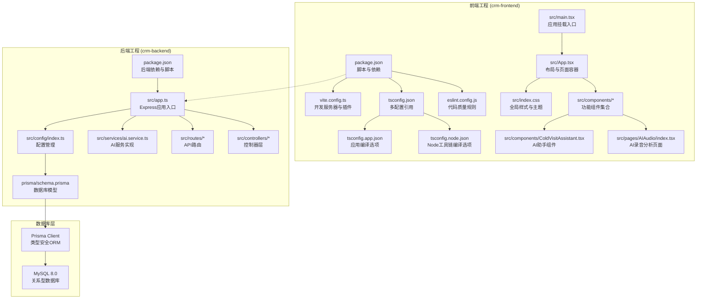

**图表来源**
- [package.json:1-38](file://crm-frontend/package.json#L1-L38)
- [vite.config.ts:1-13](file://crm-frontend/vite.config.ts#L1-L13)
- [src/main.tsx:1-11](file://crm-frontend/src/main.tsx#L1-L11)
- [src/App.tsx:1-58](file://crm-frontend/src/App.tsx#L1-L58)
- [package.json:1-52](file://crm-backend/package.json#L1-L52)
- [src/app.ts:1-88](file://crm-backend/src/app.ts#L1-L88)
- [prisma/schema.prisma:1-584](file://crm-backend/prisma/schema.prisma#L1-L584)

**章节来源**
- [package.json:1-38](file://crm-frontend/package.json#L1-L38)
- [vite.config.ts:1-13](file://crm-frontend/vite.config.ts#L1-L13)
- [src/main.tsx:1-11](file://crm-frontend/src/main.tsx#L1-L11)
- [src/App.tsx:1-58](file://crm-frontend/src/App.tsx#L1-L58)
- [package.json:1-52](file://crm-backend/package.json#L1-L52)
- [src/app.ts:1-88](file://crm-backend/src/app.ts#L1-L88)

## 前端技术栈

### React 19.2.4：声明式UI与严格模式
- **角色与职责**：负责组件化视图与状态管理，提供严格模式以尽早暴露异常。
- **集成方式**：入口文件启用严格模式并挂载顶层App；App作为布局容器协调多个功能组件。
- **最佳实践**：保持函数组件纯度，避免副作用直接发生在渲染阶段；利用Suspense与并发特性提升交互体验。

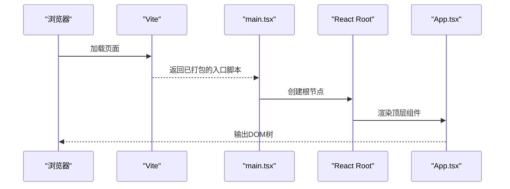

**图表来源**
- [src/main.tsx:1-11](file://crm-frontend/src/main.tsx#L1-L11)
- [src/App.tsx:1-58](file://crm-frontend/src/App.tsx#L1-L58)

**章节来源**
- [src/main.tsx:1-11](file://crm-frontend/src/main.tsx#L1-L11)
- [src/App.tsx:1-58](file://crm-frontend/src/App.tsx#L1-L58)

### TypeScript：类型安全与工程化
- **角色与职责**：通过严格的编译选项与多配置文件组织，确保应用层与工具层的类型一致性。
- **配置要点**：
  - 应用配置启用严格模式、未使用变量/参数检查、不可检查导入等策略，提升代码质量。
  - 工具链配置聚焦Node环境，保证Vite等工具的类型支持。
- **协同机制**：与ESLint类型规则联动，形成"编译期+运行期"的双重保障。

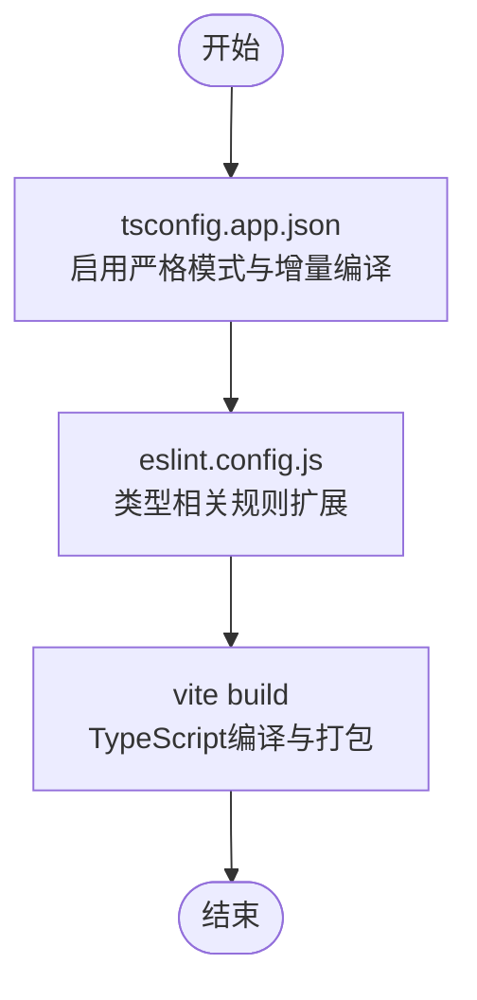

**图表来源**
- [tsconfig.app.json:1-29](file://crm-frontend/tsconfig.app.json#L1-L29)
- [tsconfig.node.json:1-27](file://crm-frontend/tsconfig.node.json#L1-L27)
- [eslint.config.js:1-24](file://crm-frontend/eslint.config.js#L1-L24)

**章节来源**
- [tsconfig.app.json:1-29](file://crm-frontend/tsconfig.app.json#L1-L29)
- [tsconfig.node.json:1-27](file://crm-frontend/tsconfig.node.json#L1-L27)
- [eslint.config.js:1-24](file://crm-frontend/eslint.config.js#L1-L24)

### Tailwind CSS：原子化样式系统
- **角色与职责**：提供可组合的原子类，快速构建一致的UI风格，减少手写CSS的工作量。
- **集成方式**：全局样式中引入框架并自定义主题变量，同时提供通用排版、滚动条与工具类。
- **组件实践**：各功能组件通过类名组合实现布局、颜色、间距与交互态，降低样式耦合。

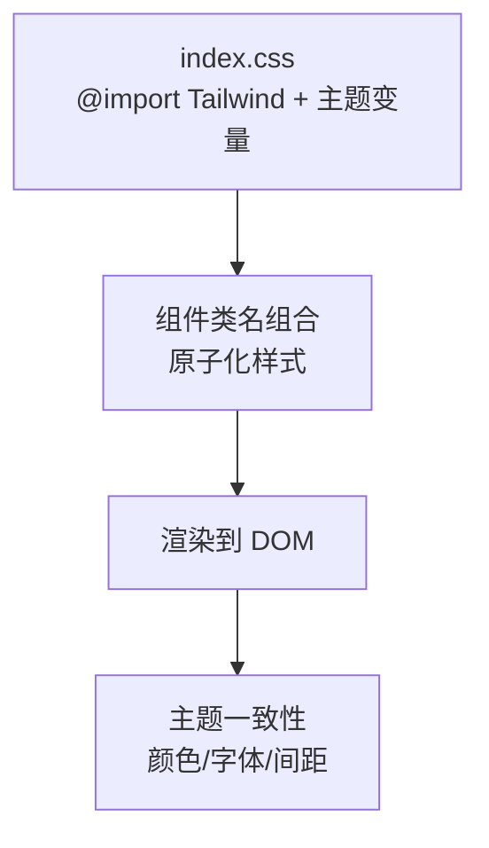

**图表来源**
- [src/index.css:1-66](file://crm-frontend/src/index.css#L1-L66)
- [src/components/Header.tsx:1-53](file://crm-frontend/src/components/Header.tsx#L1-L53)
- [src/components/Sidebar.tsx:1-86](file://crm-frontend/src/components/Sidebar.tsx#L1-L86)

**章节来源**
- [src/index.css:1-66](file://crm-frontend/src/index.css#L1-L66)
- [src/components/Header.tsx:1-53](file://crm-frontend/src/components/Header.tsx#L1-L53)
- [src/components/Sidebar.tsx:1-86](file://crm-frontend/src/components/Sidebar.tsx#L1-L86)

### Vite 8.0.0：快速开发体验与构建
- **角色与职责**：提供开发服务器、热更新与现代化打包能力，配合React插件提升DX。
- **配置要点**：最小化配置启用React插件，满足开发与生产构建需求。
- **协同机制**：与TypeScript编译器并行工作，确保类型检查与热更新的高效协同。

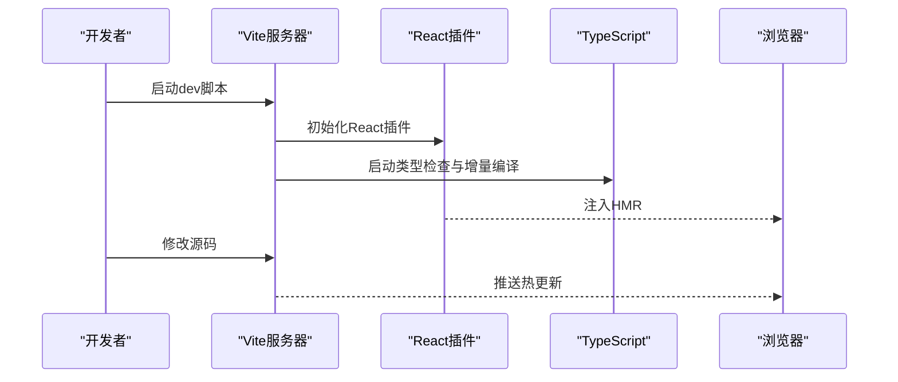

**图表来源**
- [package.json:7-7](file://crm-frontend/package.json#L7-L7)
- [vite.config.ts:1-13](file://crm-frontend/vite.config.ts#L1-L13)
- [tsconfig.app.json:1-29](file://crm-frontend/tsconfig.app.json#L1-L29)

**章节来源**
- [package.json:7-7](file://crm-frontend/package.json#L7-L7)
- [vite.config.ts:1-13](file://crm-frontend/vite.config.ts#L1-L13)
- [tsconfig.app.json:1-29](file://crm-frontend/tsconfig.app.json#L1-L29)

## 后端技术栈

### Express 4.18.2：Web应用框架
- **角色与职责**：提供HTTP服务器、路由处理、中间件管理和API服务。
- **安全特性**：集成Helmet提供安全头配置，CORS处理跨域请求，Morgan记录请求日志。
- **配置管理**：通过dotenv加载环境变量，支持开发、测试、生产多环境配置。

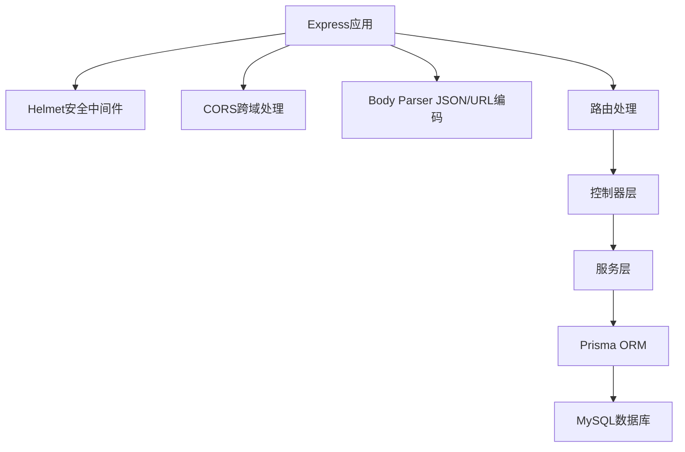

**图表来源**
- [src/app.ts:1-88](file://crm-backend/src/app.ts#L1-L88)
- [src/config/index.ts:1-60](file://crm-backend/src/config/index.ts#L1-L60)

**章节来源**
- [src/app.ts:1-88](file://crm-backend/src/app.ts#L1-L88)
- [src/config/index.ts:1-60](file://crm-backend/src/config/index.ts#L1-L60)

### Prisma 5.10.0：类型安全ORM
- **角色与职责**：提供类型安全的数据库操作、迁移管理和查询构建。
- **数据库支持**：配置MySQL 8.0作为主要数据库，支持复杂的关系查询。
- **模型设计**：通过schema.prisma定义实体关系，自动生成TypeScript客户端。

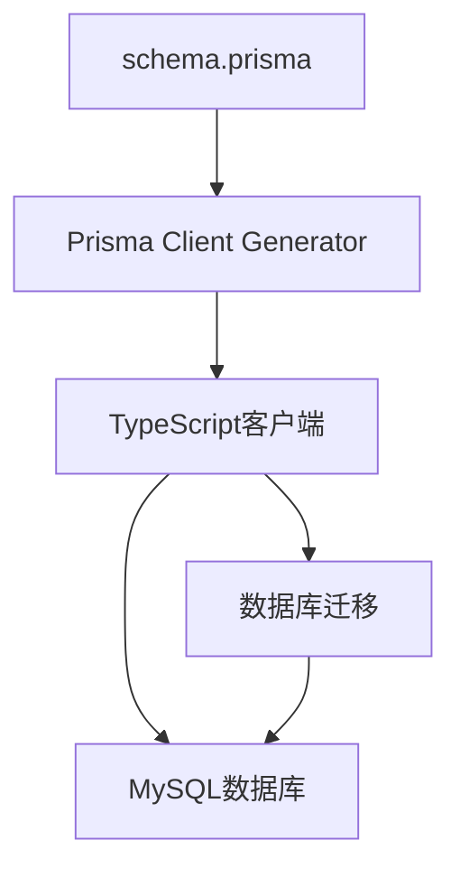

**图表来源**
- [prisma/schema.prisma:1-584](file://crm-backend/prisma/schema.prisma#L1-L584)

**章节来源**
- [prisma/schema.prisma:1-584](file://crm-backend/prisma/schema.prisma#L1-L584)

### MySQL 8.0：关系型数据库
- **角色与职责**：存储CRM系统的核心数据，支持复杂的关联查询和事务处理。
- **数据模型**：涵盖用户管理、客户关系、销售机会、录音分析、团队协作等业务实体。
- **性能优化**：通过索引设计和查询优化确保大数据量下的响应性能。

**章节来源**
- [prisma/schema.prisma:1-584](file://crm-backend/prisma/schema.prisma#L1-L584)

## AI集成架构

### AI服务层设计
系统集成了完整的AI服务能力，包括语音分析、情感识别、关键词提取、企业信息分析等功能。

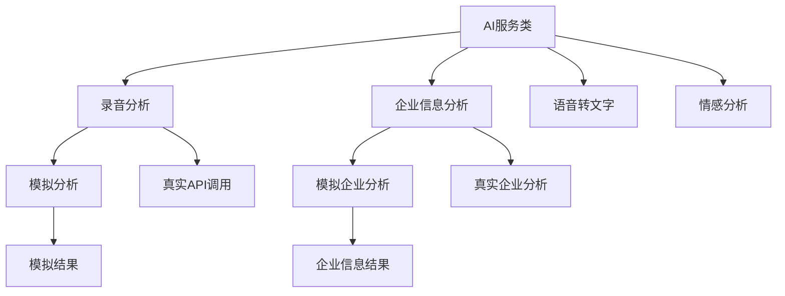

**图表来源**
- [src/services/ai.service.ts:1-564](file://crm-backend/src/services/ai.service.ts#L1-L564)

### AI助手组件实现
前端实现了完整的AI助手组件，支持企业信息智能分析和话术生成。

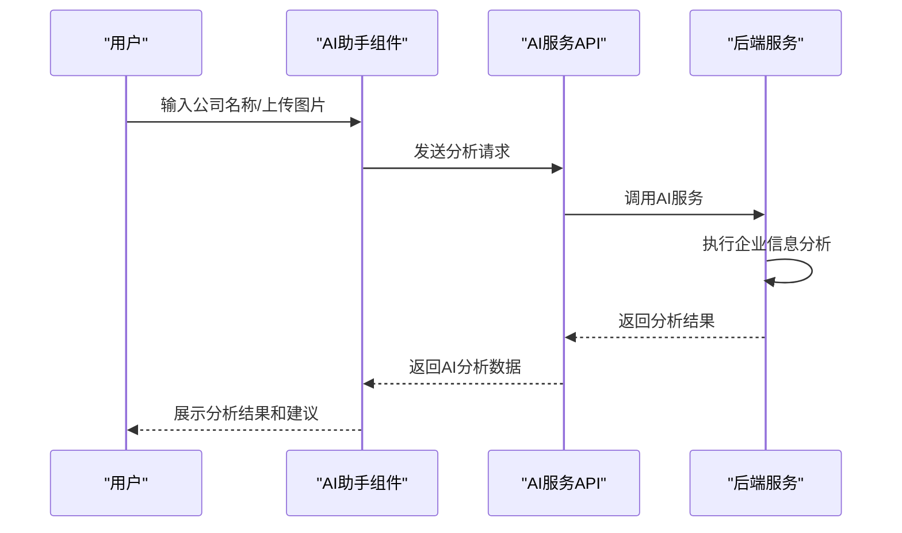

**图表来源**
- [src/components/ColdVisitAssistant.tsx:1-547](file://crm-frontend/src/components/ColdVisitAssistant.tsx#L1-L547)
- [src/services/ai.service.ts:373-381](file://crm-backend/src/services/ai.service.ts#L373-L381)

**章节来源**
- [src/services/ai.service.ts:1-564](file://crm-backend/src/services/ai.service.ts#L1-L564)
- [src/components/ColdVisitAssistant.tsx:1-547](file://crm-frontend/src/components/ColdVisitAssistant.tsx#L1-L547)

## 数据库设计

### 核心实体关系
系统采用关系型数据库设计，包含完整的CRM业务实体和它们之间的关系。

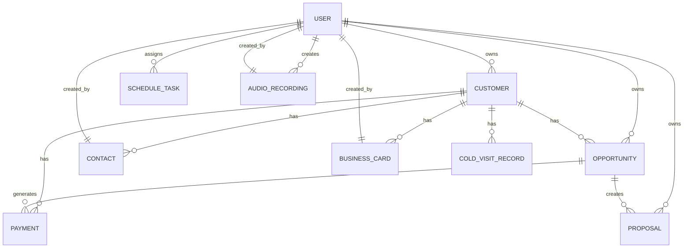

**图表来源**
- [prisma/schema.prisma:121-584](file://crm-backend/prisma/schema.prisma#L121-L584)

### AI相关数据模型
系统专门设计了AI相关的数据模型，支持录音分析和企业信息智能分析。

**章节来源**
- [prisma/schema.prisma:272-301](file://crm-backend/prisma/schema.prisma#L272-L301)
- [prisma/schema.prisma:564-584](file://crm-backend/prisma/schema.prisma#L564-L584)

## 核心组件分析

### AI录音分析页面
实现了完整的AI录音分析功能，包括录音列表、播放器、分析面板和智能建议。

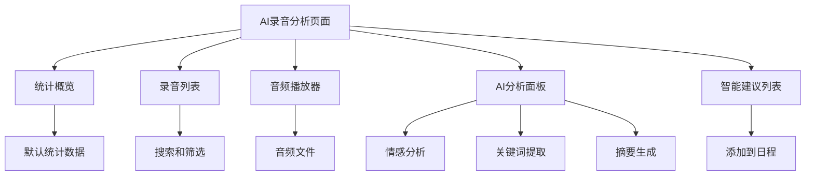

**图表来源**
- [src/pages/AIAudio/index.tsx:1-441](file://crm-frontend/src/pages/AIAudio/index.tsx#L1-L441)

**章节来源**
- [src/pages/AIAudio/index.tsx:1-441](file://crm-frontend/src/pages/AIAudio/index.tsx#L1-L441)

### 陌生拜访AI助手
提供了企业信息智能分析和话术生成功能，支持文本输入和图片上传两种方式。

**章节来源**
- [src/components/ColdVisitAssistant.tsx:1-547](file://crm-frontend/src/components/ColdVisitAssistant.tsx#L1-L547)

## 架构总览

### 系统架构图
展示了从前端到后端再到数据库的完整技术栈架构。

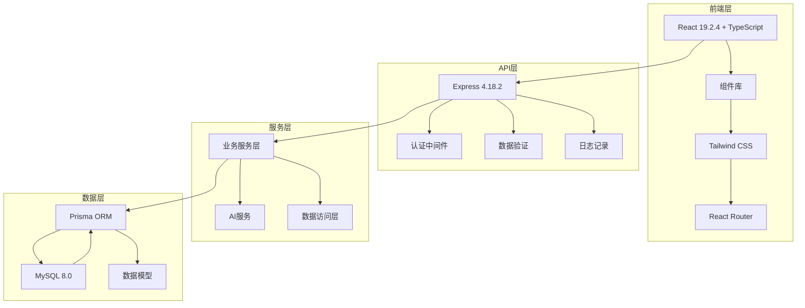

**图表来源**
- [package.json:12-36](file://crm-frontend/package.json#L12-L36)
- [package.json:17-33](file://crm-backend/package.json#L17-L33)
- [src/app.ts:1-88](file://crm-backend/src/app.ts#L1-L88)
- [prisma/schema.prisma:1-584](file://crm-backend/prisma/schema.prisma#L1-L584)

## 性能考量

### 前端性能优化
- **开发体验**：Vite 8.0.0的冷启与热更新显著缩短等待时间；React插件与HMR协同提升迭代效率。
- **构建性能**：TypeScript增量编译与Vite并行流水线减少构建时间；按需引入与Tree Shaking降低产物体积。
- **样式性能**：Tailwind原子类减少重复样式与选择器复杂度，提升渲染效率；主题变量集中管理。

### 后端性能优化
- **数据库性能**：Prisma提供类型安全的查询优化，支持复杂关联查询；MySQL 8.0的性能特性和索引优化。
- **API性能**：Express中间件链路优化，CORS和Helmet中间件的合理配置减少不必要的处理。
- **AI服务性能**：AI分析的异步处理和缓存策略，避免阻塞主线程。

### AI集成性能
- **实时性**：AI分析采用异步处理，避免阻塞用户界面；模拟数据和真实API的降级策略。
- **可扩展性**：模块化的AI服务设计，支持多种AI提供商的接入和切换。

## 故障排查指南

### 前端开发问题
- **开发服务器无法启动**
  - 检查开发脚本与插件配置是否正确加载
  - 章节来源
    - [package.json:7-7](file://crm-frontend/package.json#L7-L7)
    - [vite.config.ts:1-13](file://crm-frontend/vite.config.ts#L1-L13)
- **类型检查报错**
  - 确认应用与工具链配置的严格模式与类型扩展是否匹配
  - 章节来源
    - [tsconfig.app.json:20-25](file://crm-frontend/tsconfig.app.json#L20-L25)
    - [tsconfig.node.json:17-23](file://crm-frontend/tsconfig.node.json#L17-L23)

### 后端开发问题
- **数据库连接失败**
  - 检查DATABASE_URL环境变量配置
  - 章节来源
    - [src/config/index.ts:37-39](file://crm-backend/src/config/index.ts#L37-L39)
- **AI服务调用失败**
  - 检查AI配置环境变量和API密钥设置
  - 章节来源
    - [src/services/ai.service.ts:67-73](file://crm-backend/src/services/ai.service.ts#L67-L73)

### AI集成问题
- **录音分析功能异常**
  - 检查AI服务配置和API调用逻辑
  - 章节来源
    - [src/services/ai.service.ts:86-98](file://crm-backend/src/services/ai.service.ts#L86-L98)
- **企业信息分析失败**
  - 验证企业名称和图片上传功能
  - 章节来源
    - [src/components/ColdVisitAssistant.tsx:32-57](file://crm-frontend/src/components/ColdVisitAssistant.tsx#L32-L57)

## 结论
本技术栈以React 19.2.4的声明式能力为基础，借助TypeScript的类型安全与Vite 8.0.0的高效开发体验，结合Express 4.18.2的Web框架能力和Prisma 5.10.0的类型安全ORM，实现了高可维护性与快速迭代的全栈架构。通过合理的配置与组件化设计，系统在性能、开发效率与可维护性之间取得良好平衡，特别是AI集成技术的深度整合，为销售AI CRM场景提供了强大的智能化支撑。

## 附录

### 最佳实践建议
- **前端开发**：保持组件无副作用，将异步逻辑封装在hooks中；使用原子类名优先于内联样式；利用Vite的按需加载策略优化首屏性能。
- **后端开发**：采用分层架构设计，清晰分离控制器、服务和数据访问层；使用Prisma进行类型安全的数据库操作；合理配置中间件和错误处理。
- **AI集成**：实现AI服务的降级策略，确保在网络异常时的用户体验；优化AI分析的异步处理和缓存机制。

### 权衡考虑
- **性能**：Vite与Tailwind在开发期与生产期均有良好表现，但需注意样式体量控制；数据库查询优化和AI服务的异步处理。
- **开发效率**：React 19.2.4与Vite 8.0.0的组合显著提升DX，适合快速原型与迭代；Express的简洁性和Prisma的类型安全提升后端开发效率。
- **维护性**：严格的类型与ESLint规则有助于长期维护，建议持续完善规则集；模块化的AI服务设计便于功能扩展和替换。