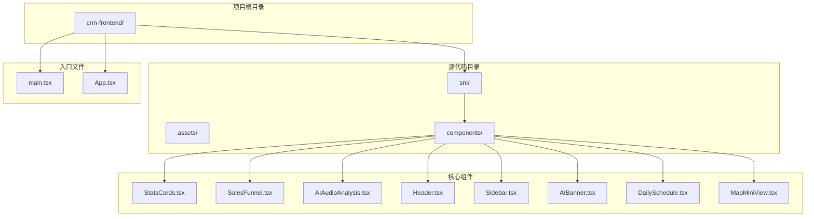
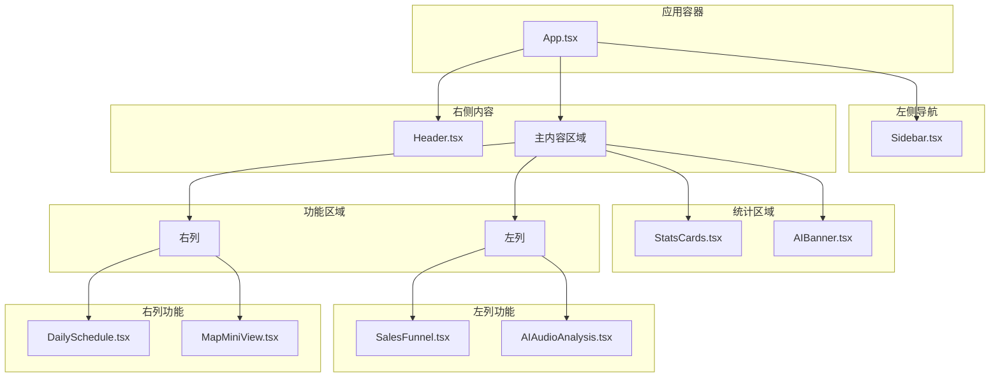
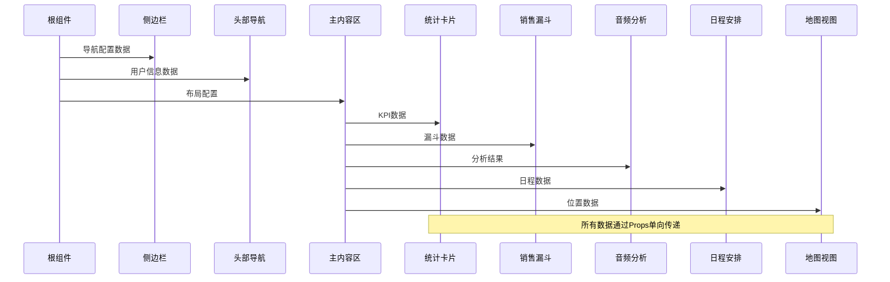
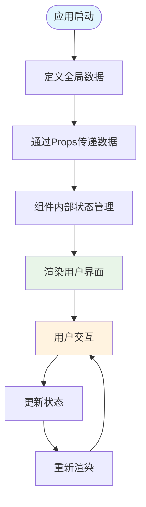
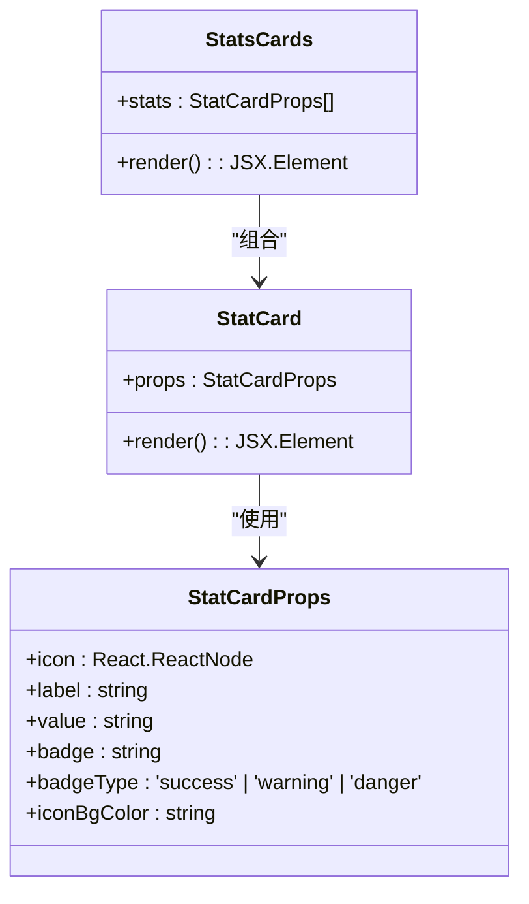
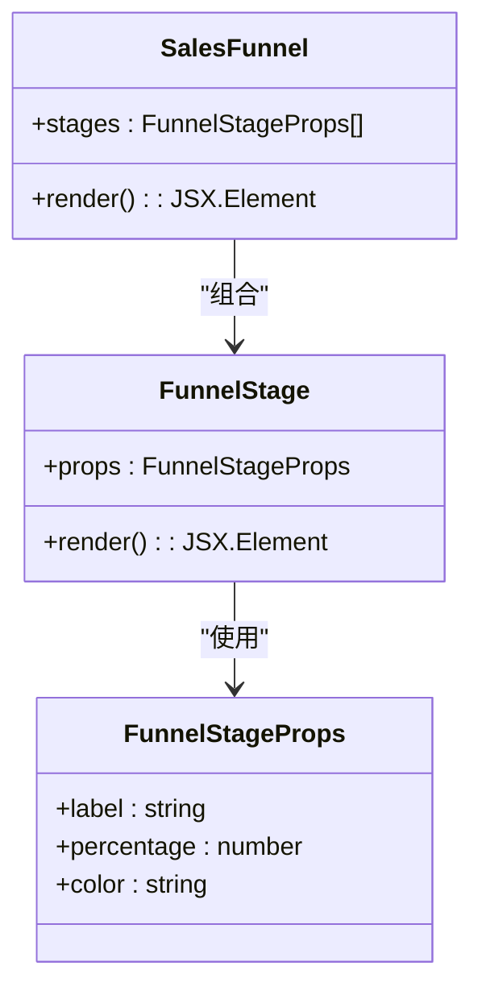
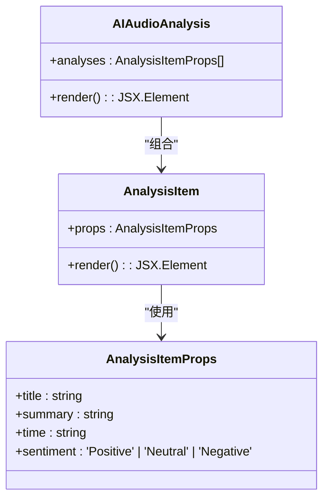
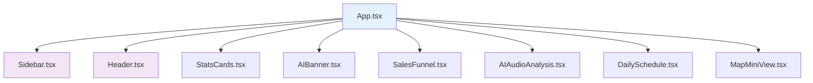

# 数据流设计

<cite>
**本文档引用的文件**
- [App.tsx](file://crm-frontend/src/App.tsx)
- [main.tsx](file://crm-frontend/src/main.tsx)
- [StatsCards.tsx](file://crm-frontend/src/components/StatsCards.tsx)
- [SalesFunnel.tsx](file://crm-frontend/src/components/SalesFunnel.tsx)
- [AIAudioAnalysis.tsx](file://crm-frontend/src/components/AIAudioAnalysis.tsx)
- [Header.tsx](file://crm-frontend/src/components/Header.tsx)
- [Sidebar.tsx](file://crm-frontend/src/components/Sidebar.tsx)
- [AIBanner.tsx](file://crm-frontend/src/components/AIBanner.tsx)
- [DailySchedule.tsx](file://crm-frontend/src/components/DailySchedule.tsx)
- [MapMiniView.tsx](file://crm-frontend/src/components/MapMiniView.tsx)
- [package.json](file://crm-frontend/package.json)
</cite>

## 目录
1. [引言](#引言)
2. [项目结构](#项目结构)
3. [核心组件](#核心组件)
4. [架构概览](#架构概览)
5. [详细组件分析](#详细组件分析)
6. [依赖分析](#依赖分析)
7. [性能考虑](#性能考虑)
8. [故障排除指南](#故障排除指南)
9. [结论](#结论)

## 引言

本文件为销售AI CRM系统的数据流设计文档，专注于基于React的状态管理数据流向。该系统采用组件化架构，通过Props传递实现数据从父组件到子组件的单向数据流，结合局部状态管理实现组件内部状态的更新和渲染。

系统主要包含四大功能模块：
- **StatsCards**：展示关键业务指标（KPI）数据
- **SalesFunnel**：呈现销售漏斗数据和转化率
- **AIAudioAnalysis**：显示AI音频分析结果
- **辅助组件**：包括导航、头部、日程安排和地图等

## 项目结构

CRM前端项目采用标准的React Vite项目结构，核心文件组织如下：



**图表来源**
- [main.tsx:1-11](file://crm-frontend/src/main.tsx#L1-L11)
- [App.tsx:1-58](file://crm-frontend/src/App.tsx#L1-L58)

**章节来源**
- [main.tsx:1-11](file://crm-frontend/src/main.tsx#L1-L11)
- [package.json:1-36](file://crm-frontend/package.json#L1-L36)

## 核心组件

### 应用入口与布局

应用采用双栏布局架构，左侧为固定宽度的侧边栏导航，右侧为主内容区域。主内容区域包含头部导航、统计卡片、AI横幅以及两个主要功能区域。



**图表来源**
- [App.tsx:10-55](file://crm-frontend/src/App.tsx#L10-L55)

**章节来源**
- [App.tsx:10-55](file://crm-frontend/src/App.tsx#L10-L55)

## 架构概览

### 数据流向架构

系统采用自上而下的数据流向设计，所有数据都通过Props从父组件传递到子组件。每个组件负责特定领域的数据展示和状态管理。



**图表来源**
- [App.tsx:10-55](file://crm-frontend/src/App.tsx#L10-L55)

### 状态管理模式

系统采用混合状态管理模式：

1. **全局状态提升**：在App组件中定义所有需要共享的数据
2. **局部状态管理**：各子组件维护自己的UI状态
3. **Props传递**：通过属性向下传递数据



## 详细组件分析

### StatsCards 组件分析

StatsCards组件负责展示关键业务指标，采用静态数据驱动的方式。



**图表来源**
- [StatsCards.tsx:3-33](file://crm-frontend/src/components/StatsCards.tsx#L3-L33)
- [StatsCards.tsx:35-78](file://crm-frontend/src/components/StatsCards.tsx#L35-L78)

#### 数据需求与处理

- **数据类型**：包含图标、标签、数值、徽章和颜色配置
- **数据来源**：组件内部静态定义
- **处理逻辑**：根据badgeType选择对应的颜色方案
- **展示方式**：网格布局，支持悬停效果

**章节来源**
- [StatsCards.tsx:35-78](file://crm-frontend/src/components/StatsCards.tsx#L35-L78)

### SalesFunnel 组件分析

SalesFunnel组件展示销售漏斗的各个阶段及其转化率。



**图表来源**
- [SalesFunnel.tsx:3-27](file://crm-frontend/src/components/SalesFunnel.tsx#L3-L27)
- [SalesFunnel.tsx:29-62](file://crm-frontend/src/components/SalesFunnel.tsx#L29-L62)

#### 数据需求与处理

- **数据类型**：阶段名称、转化百分比、颜色配置
- **数据来源**：组件内部静态数组
- **处理逻辑**：动态计算进度条宽度，支持过渡动画
- **展示方式**：垂直列表，带颜色标识

**章节来源**
- [SalesFunnel.tsx:29-62](file://crm-frontend/src/components/SalesFunnel.tsx#L29-L62)

### AIAudioAnalysis 组件分析

AIAudioAnalysis组件展示AI生成的音频分析结果。



**图表来源**
- [AIAudioAnalysis.tsx:3-36](file://crm-frontend/src/components/AIAudioAnalysis.tsx#L3-L36)
- [AIAudioAnalysis.tsx:38-78](file://crm-frontend/src/components/AIAudioAnalysis.tsx#L38-L78)

#### 数据需求与处理

- **数据类型**：标题、摘要、时间戳、情感倾向
- **数据来源**：组件内部静态数组
- **处理逻辑**：根据情感倾向选择颜色方案
- **展示方式**：卡片列表，支持悬停效果

**章节来源**
- [AIAudioAnalysis.tsx:38-78](file://crm-frontend/src/components/AIAudioAnalysis.tsx#L38-L78)

### 辅助组件分析

#### Header 组件

Header组件包含搜索功能、通知和用户信息，采用静态数据展示。

#### Sidebar 组件

Sidebar组件提供导航菜单，包含多个功能模块的快捷入口。

#### DailySchedule 组件

DailySchedule组件展示当天的日程安排，使用时间轴样式展示任务。

#### MapMiniView 组件

MapMiniView组件展示客户地理位置，使用SVG绘制地图背景和标记点。

**章节来源**
- [Header.tsx:3-50](file://crm-frontend/src/components/Header.tsx#L3-L50)
- [Sidebar.tsx:37-82](file://crm-frontend/src/components/Sidebar.tsx#L37-L82)
- [DailySchedule.tsx:26-66](file://crm-frontend/src/components/DailySchedule.tsx#L26-L66)
- [MapMiniView.tsx:3-54](file://crm-frontend/src/components/MapMiniView.tsx#L3-L54)

## 依赖分析

### 外部依赖关系

系统依赖关系相对简单，主要依赖React生态系统和UI库：

```mermaid
graph TB
subgraph "应用层"
App[应用组件]
Components[业务组件]
end
subgraph "React生态"
React[react@^19.2.4]
ReactDOM[react-dom@^19.2.4]
end
subgraph "UI库"
Lucide[Lucide React @^0.577.0]
end
subgraph "构建工具"
Vite[vite@^8.0.0]
Tailwind[tailwindcss@^4.2.1]
end
App --> React
App --> ReactDOM
Components --> React
Components --> Lucide
App --> Vite
App --> Tailwind
```

**图表来源**
- [package.json:12-34](file://crm-frontend/package.json#L12-L34)

### 内部组件依赖

组件间的依赖关系遵循单向数据流原则：



**图表来源**
- [App.tsx:1-8](file://crm-frontend/src/App.tsx#L1-L8)

**章节来源**
- [package.json:12-34](file://crm-frontend/package.json#L12-L34)

## 性能考虑

### 渲染优化策略

1. **组件拆分**：将功能模块拆分为独立组件，避免不必要的重渲染
2. **Props传递**：通过精确的Props传递减少状态提升的范围
3. **静态数据**：使用静态数据减少异步操作带来的复杂性
4. **CSS类名**：使用Tailwind CSS类名减少内联样式的开销

### 数据一致性保证

1. **单向数据流**：严格遵循自上而下的数据流向
2. **状态提升**：将共享状态提升到最近的共同祖先
3. **不可变性**：使用不可变数据结构避免意外的状态修改
4. **类型安全**：通过TypeScript接口确保数据结构的一致性

## 故障排除指南

### 常见问题诊断

1. **组件不显示数据**
   - 检查Props传递是否正确
   - 验证数据类型和结构
   - 确认组件渲染逻辑

2. **样式显示异常**
   - 检查Tailwind CSS配置
   - 验证CSS类名拼写
   - 确认响应式断点设置

3. **交互功能失效**
   - 检查事件处理器绑定
   - 验证状态更新逻辑
   - 确认组件重新渲染条件

### 调试建议

1. **使用React DevTools**：检查组件树和Props传递
2. **添加控制台日志**：跟踪数据流向和状态变化
3. **简化组件**：逐步移除功能定位问题
4. **验证类型定义**：确保TypeScript类型正确

## 结论

销售AI CRM系统的数据流设计体现了现代React应用的最佳实践。通过清晰的组件层次结构和严格的单向数据流，系统实现了良好的可维护性和扩展性。

### 设计优势

1. **清晰的数据流向**：从App组件到各个功能组件的单向数据传递
2. **模块化的组件设计**：每个组件职责明确，便于测试和维护
3. **类型安全**：完整的TypeScript类型定义确保开发时的类型安全
4. **简洁的依赖关系**：最小化的外部依赖降低维护成本

### 扩展建议

1. **状态管理升级**：对于更复杂的状态管理需求，可考虑引入Redux或Zustand
2. **数据获取集成**：添加Axios或Fetch API集成真实数据源
3. **错误边界**：实现React错误边界处理组件异常
4. **性能监控**：集成性能监控工具跟踪应用性能指标

该数据流设计为后续的功能扩展和维护提供了坚实的基础，确保了系统的稳定性和可扩展性。