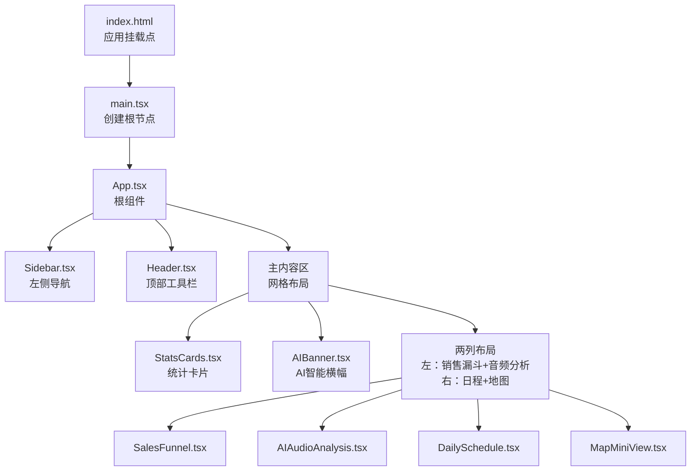
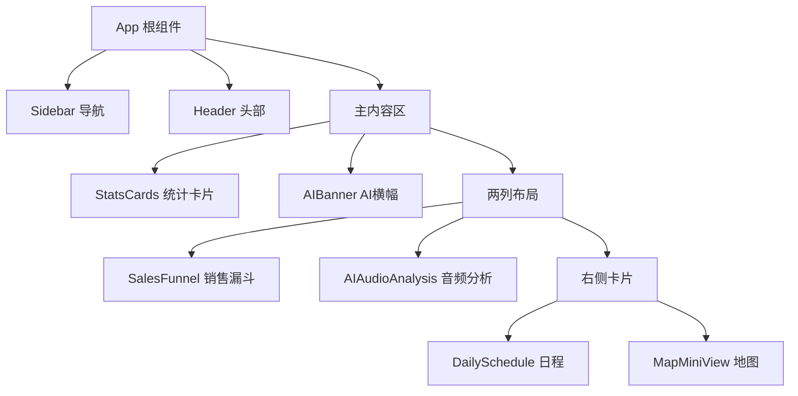
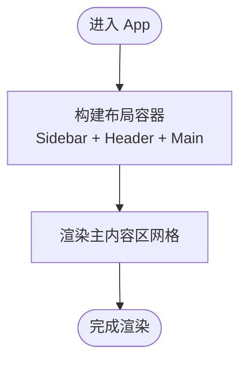
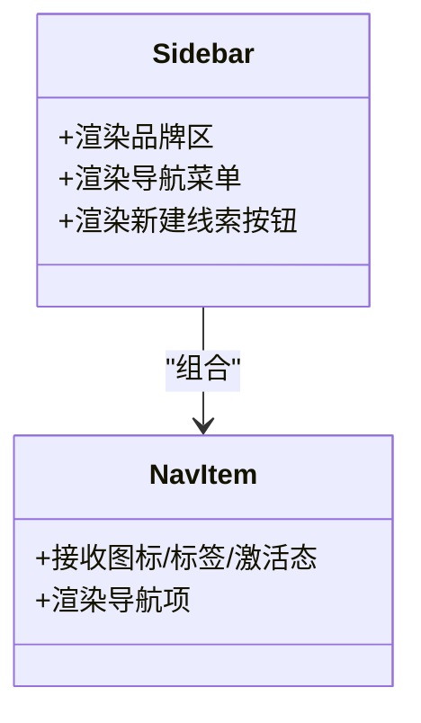
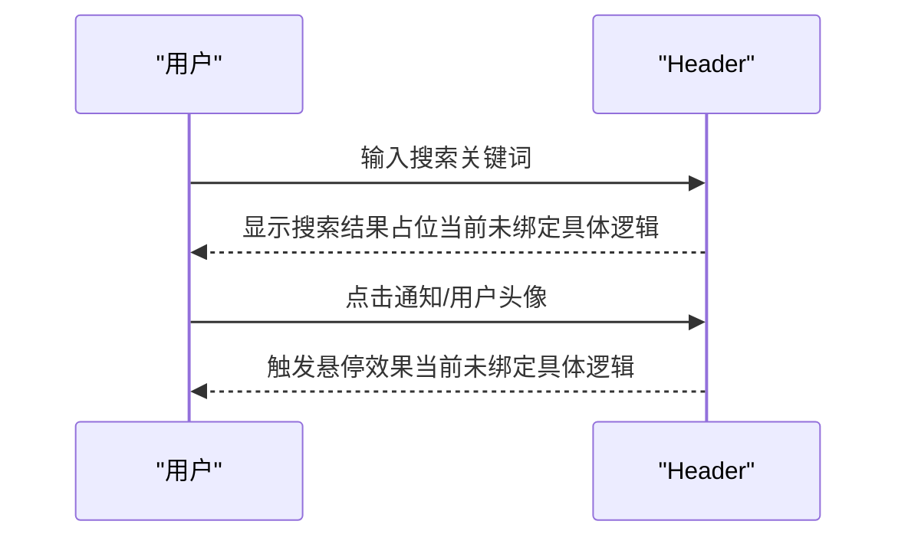
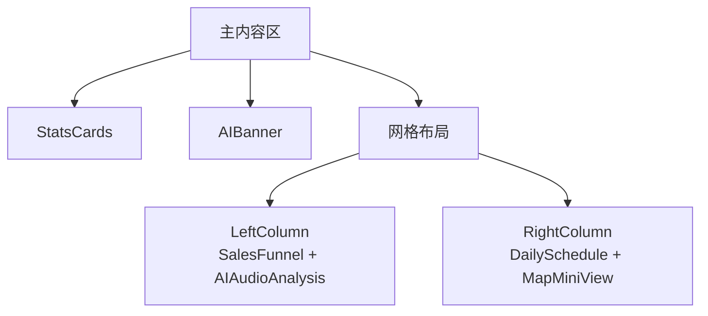
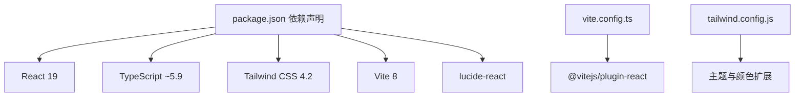

# 架构设计

<cite>
**本文引用的文件**
- [App.tsx](file://crm-frontend/src/App.tsx)
- [main.tsx](file://crm-frontend/src/main.tsx)
- [Header.tsx](file://crm-frontend/src/components/Header.tsx)
- [Sidebar.tsx](file://crm-frontend/src/components/Sidebar.tsx)
- [StatsCards.tsx](file://crm-frontend/src/components/StatsCards.tsx)
- [AIBanner.tsx](file://crm-frontend/src/components/AIBanner.tsx)
- [SalesFunnel.tsx](file://crm-frontend/src/components/SalesFunnel.tsx)
- [AIAudioAnalysis.tsx](file://crm-frontend/src/components/AIAudioAnalysis.tsx)
- [DailySchedule.tsx](file://crm-frontend/src/components/DailySchedule.tsx)
- [MapMiniView.tsx](file://crm-frontend/src/components/MapMiniView.tsx)
- [package.json](file://crm-frontend/package.json)
- [vite.config.ts](file://crm-frontend/vite.config.ts)
- [tailwind.config.js](file://crm-frontend/tailwind.config.js)
- [tsconfig.json](file://crm-frontend/tsconfig.json)
- [index.html](file://crm-frontend/index.html)
</cite>

## 目录
1. [引言](#引言)
2. [项目结构](#项目结构)
3. [核心组件](#核心组件)
4. [架构总览](#架构总览)
5. [详细组件分析](#详细组件分析)
6. [依赖分析](#依赖分析)
7. [性能考量](#性能考量)
8. [故障排查指南](#故障排查指南)
9. [结论](#结论)
10. [附录](#附录)

## 引言
本文件为销售AI CRM系统的前端架构设计文档，聚焦于基于 React 19 + TypeScript + Tailwind CSS + Vite 的技术栈选型与架构决策。系统采用组件化架构，以 App 根组件为核心，通过 Sidebar 导航系统与 Header 头部组件实现清晰的布局与交互边界；主内容区域由多个功能卡片组件构成，形成可组合、可扩展的数据展示与业务视图。

## 项目结构
前端工程位于 crm-frontend 目录，采用按功能模块组织的组件化目录结构，入口文件负责挂载根组件，构建工具使用 Vite，样式框架使用 Tailwind CSS，类型检查使用 TypeScript。

**图表来源**
- [index.html:1-14](file://crm-frontend/index.html#L1-L14)
- [main.tsx:1-11](file://crm-frontend/src/main.tsx#L1-L11)
- [App.tsx:1-58](file://crm-frontend/src/App.tsx#L1-L58)
- [Sidebar.tsx:1-86](file://crm-frontend/src/components/Sidebar.tsx#L1-L86)
- [Header.tsx:1-53](file://crm-frontend/src/components/Header.tsx#L1-L53)
- [StatsCards.tsx:1-81](file://crm-frontend/src/components/StatsCards.tsx#L1-L81)
- [AIBanner.tsx:1-47](file://crm-frontend/src/components/AIBanner.tsx#L1-L47)
- [SalesFunnel.tsx:1-66](file://crm-frontend/src/components/SalesFunnel.tsx#L1-L66)
- [AIAudioAnalysis.tsx:1-82](file://crm-frontend/src/components/AIAudioAnalysis.tsx#L1-L82)
- [DailySchedule.tsx:1-70](file://crm-frontend/src/components/DailySchedule.tsx#L1-L70)
- [MapMiniView.tsx:1-58](file://crm-frontend/src/components/MapMiniView.tsx#L1-L58)

**章节来源**
- [index.html:1-14](file://crm-frontend/index.html#L1-L14)
- [main.tsx:1-11](file://crm-frontend/src/main.tsx#L1-L11)
- [App.tsx:1-58](file://crm-frontend/src/App.tsx#L1-L58)

## 核心组件
- App 根组件：负责整体布局与页面骨架，包含 Sidebar、Header 以及主内容区的网格布局。
- Sidebar 导航系统：提供固定宽度的侧边栏，包含品牌区、导航项列表与新建线索按钮。
- Header 头部组件：提供搜索框、升级按钮、通知与用户信息等右侧控制区。
- 主内容区组件群：统计卡片、AI 智能横幅、销售漏斗、AI 音频分析、日程与地图等模块化卡片。

这些组件通过组合方式在 App 中装配，形成统一的页面结构与视觉风格。

**章节来源**
- [App.tsx:10-55](file://crm-frontend/src/App.tsx#L10-L55)
- [Sidebar.tsx:37-82](file://crm-frontend/src/components/Sidebar.tsx#L37-L82)
- [Header.tsx:3-49](file://crm-frontend/src/components/Header.tsx#L3-L49)

## 架构总览
系统采用“根组件装配 + 功能卡片”的组件化架构，数据流遵循自上而下的单向数据流模式，组件间通过 props 进行通信，无全局状态管理库（如 Redux 或 Zustand）的显式引入，适合中等复杂度的前端应用。

**图表来源**
- [App.tsx:10-55](file://crm-frontend/src/App.tsx#L10-L55)
- [StatsCards.tsx:35-77](file://crm-frontend/src/components/StatsCards.tsx#L35-L77)
- [AIBanner.tsx:3-43](file://crm-frontend/src/components/AIBanner.tsx#L3-L43)
- [SalesFunnel.tsx:29-62](file://crm-frontend/src/components/SalesFunnel.tsx#L29-L62)
- [AIAudioAnalysis.tsx:38-79](file://crm-frontend/src/components/AIAudioAnalysis.tsx#L38-L79)
- [DailySchedule.tsx:26-66](file://crm-frontend/src/components/DailySchedule.tsx#L26-L66)
- [MapMiniView.tsx:3-54](file://crm-frontend/src/components/MapMiniView.tsx#L3-L54)

## 详细组件分析

### App 根组件
- 职责：定义页面整体布局，包含 Sidebar、Header 与主内容区；使用 Flex 布局实现侧边栏固定宽度与主内容自适应填充。
- 数据与状态：当前实现为纯展示组件，未见内部状态管理；数据来源于各子组件自身的 props 或静态数据。
- 通信机制：通过 props 向子组件传递属性（如 Sidebar 的活动项），组件间无跨层级事件回调。
- 性能特征：组件树扁平，渲染路径明确，适合在 Vite 开发服务器下快速热更新。

**图表来源**
- [App.tsx:10-55](file://crm-frontend/src/App.tsx#L10-L55)

**章节来源**
- [App.tsx:10-55](file://crm-frontend/src/App.tsx#L10-L55)

### Sidebar 导航系统
- 职责：提供品牌区、导航菜单与新建线索按钮；导航项支持激活态样式切换。
- 数据与状态：导航项数组在组件内声明，当前激活项通过 props 控制；组件内部无状态变化逻辑。
- 通信机制：作为独立 UI 组件，不向外暴露事件回调；可通过外部传入的 active 属性或点击处理函数进行联动（当前实现未见外部回调绑定）。
- 可扩展性：支持通过 props 注入图标、标签与激活状态，便于复用与主题定制。

**图表来源**
- [Sidebar.tsx:16-35](file://crm-frontend/src/components/Sidebar.tsx#L16-L35)
- [Sidebar.tsx:37-82](file://crm-frontend/src/components/Sidebar.tsx#L37-L82)

**章节来源**
- [Sidebar.tsx:16-82](file://crm-frontend/src/components/Sidebar.tsx#L16-L82)

### Header 头部组件
- 职责：提供搜索输入、升级按钮、通知与用户信息展示。
- 交互：包含悬停高亮、角标提示等基础交互；当前未见与后端通信或全局状态联动。
- 设计：使用 Tailwind CSS 实现响应式布局与主题色系，保持与侧边栏一致的视觉语言。

**图表来源**
- [Header.tsx:3-49](file://crm-frontend/src/components/Header.tsx#L3-L49)

**章节来源**
- [Header.tsx:3-49](file://crm-frontend/src/components/Header.tsx#L3-L49)

### 主内容区组件群
- StatsCards 统计卡片：展示关键指标与趋势，支持不同徽章类型与图标背景色。
- AIBanner AI 智能横幅：展示 AI 推荐建议与操作按钮。
- SalesFunnel 销售漏斗：展示各阶段转化率与总金额。
- AIAudioAnalysis AI 音频分析：展示通话/会议的分析摘要与情感倾向。
- DailySchedule 日程：展示当日任务时间线与新增任务入口。
- MapMiniView 地图：展示客户分布与全量地图入口。

这些组件均采用 props 传参与本地静态数据驱动，便于独立开发与测试。

**图表来源**
- [StatsCards.tsx:35-77](file://crm-frontend/src/components/StatsCards.tsx#L35-L77)
- [AIBanner.tsx:3-43](file://crm-frontend/src/components/AIBanner.tsx#L3-L43)
- [SalesFunnel.tsx:29-62](file://crm-frontend/src/components/SalesFunnel.tsx#L29-L62)
- [AIAudioAnalysis.tsx:38-79](file://crm-frontend/src/components/AIAudioAnalysis.tsx#L38-L79)
- [DailySchedule.tsx:26-66](file://crm-frontend/src/components/DailySchedule.tsx#L26-L66)
- [MapMiniView.tsx:3-54](file://crm-frontend/src/components/MapMiniView.tsx#L3-L54)

**章节来源**
- [StatsCards.tsx:12-77](file://crm-frontend/src/components/StatsCards.tsx#L12-L77)
- [AIBanner.tsx:3-43](file://crm-frontend/src/components/AIBanner.tsx#L3-L43)
- [SalesFunnel.tsx:9-62](file://crm-frontend/src/components/SalesFunnel.tsx#L9-L62)
- [AIAudioAnalysis.tsx:10-79](file://crm-frontend/src/components/AIAudioAnalysis.tsx#L10-L79)
- [DailySchedule.tsx:10-66](file://crm-frontend/src/components/DailySchedule.tsx#L10-L66)
- [MapMiniView.tsx:3-54](file://crm-frontend/src/components/MapMiniView.tsx#L3-L54)

## 依赖分析
- 技术栈与版本
  - React 19 与 React DOM 19：用于组件化 UI 渲染与虚拟 DOM 更新。
  - TypeScript ~5.9：提供类型安全与更好的开发体验。
  - Tailwind CSS 4.2：提供原子化样式与主题变量，配合自定义颜色与阴影扩展。
  - Vite 8：提供快速开发服务器与高效打包能力。
  - lucide-react：提供简洁的 SVG 图标库。
- 构建与开发
  - Vite 配置启用 React 插件，支持 JSX 与 TSX 文件。
  - Tailwind 配置扫描 src 下所有 TS/JS 文件，确保按需生成样式。
  - TypeScript 使用多项目引用配置，分离应用与 Node 工具链配置。

**图表来源**
- [package.json:12-34](file://crm-frontend/package.json#L12-L34)
- [vite.config.ts:1-8](file://crm-frontend/vite.config.ts#L1-L8)
- [tailwind.config.js:1-62](file://crm-frontend/tailwind.config.js#L1-L62)

**章节来源**
- [package.json:12-34](file://crm-frontend/package.json#L12-L34)
- [vite.config.ts:1-8](file://crm-frontend/vite.config.ts#L1-L8)
- [tailwind.config.js:1-62](file://crm-frontend/tailwind.config.js#L1-L62)
- [tsconfig.json:1-8](file://crm-frontend/tsconfig.json#L1-L8)

## 性能考量
- 组件渲染路径：组件树扁平且职责单一，避免深层嵌套导致的重渲染。
- 样式体积：Tailwind 通过内容扫描按需生成样式，减少未使用样式的打包体积。
- 开发体验：Vite 提供快速冷启动与热更新，适合频繁迭代的组件开发。
- 扩展建议：若未来引入全局状态，建议采用 React 19 的并发特性与细粒度状态拆分，避免不必要的重渲染。

## 故障排查指南
- 构建失败
  - 症状：构建报错或无法启动开发服务器。
  - 排查：确认 Node 版本与依赖安装完整；检查 Vite 与 TypeScript 配置是否正确。
- 样式异常
  - 症状：组件样式缺失或主题色不生效。
  - 排查：确认 Tailwind 内容扫描路径包含目标文件；检查颜色与字体家族扩展是否正确。
- 图标显示问题
  - 症状：图标不显示或尺寸异常。
  - 排查：确认 lucide-react 安装与导入路径正确；检查图标大小与颜色是否通过 props 传入。
- 运行时错误
  - 症状：页面空白或组件渲染异常。
  - 排查：检查根组件挂载点与入口文件；确认 StrictMode 下的副作用与生命周期调用。

**章节来源**
- [index.html:9-12](file://crm-frontend/index.html#L9-L12)
- [main.tsx:6-10](file://crm-frontend/src/main.tsx#L6-L10)
- [package.json:12-34](file://crm-frontend/package.json#L12-L34)

## 结论
该 CRM 前端采用清晰的组件化架构，以 App 为核心，结合 Sidebar 与 Header 实现稳定的布局与交互边界；主内容区通过多个功能卡片实现模块化展示。技术栈选择兼顾开发效率与运行性能，Tailwind CSS 提供一致的视觉语言，Vite 提供高效的开发体验。当前实现为纯展示组件，数据流简单明确，具备良好的可维护性与扩展性。

## 附录
- 系统边界
  - 前端边界：仅包含 UI 组件与静态资源，不包含后端 API 调用或全局状态管理。
  - 外部集成：通过 lucide-react 提供图标，通过 Tailwind CSS 提供样式。
- 技术约束
  - 类型约束：使用 TypeScript 确保组件参数与返回值类型安全。
  - 样式约束：通过 Tailwind 原子类与主题变量统一风格。
- 扩展性考虑
  - 状态管理：若业务增长，可在 App 层引入上下文或状态库，按需拆分状态域。
  - 组件复用：将通用 UI 抽象为可复用组件，提升一致性与开发效率。
  - 性能优化：在大型列表场景引入虚拟滚动与懒加载策略。