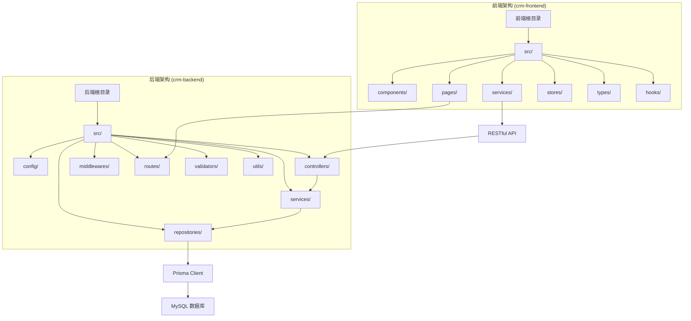
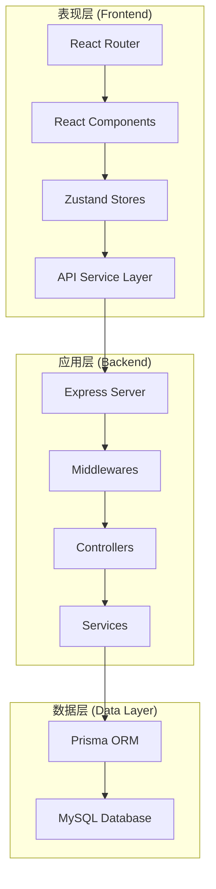
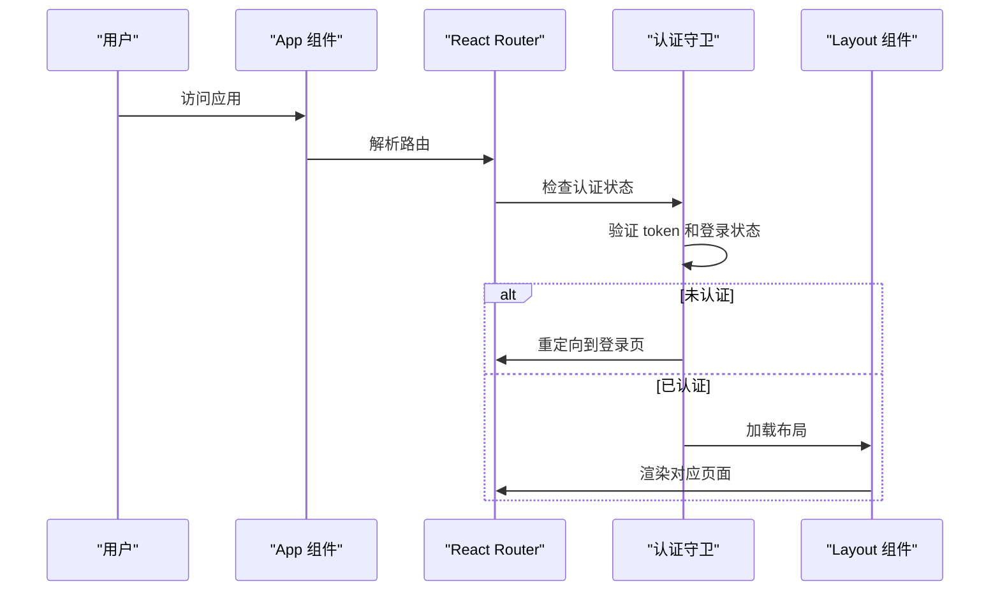
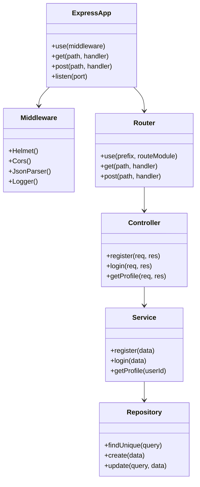
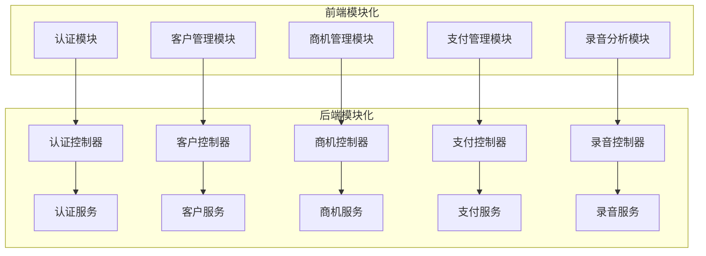
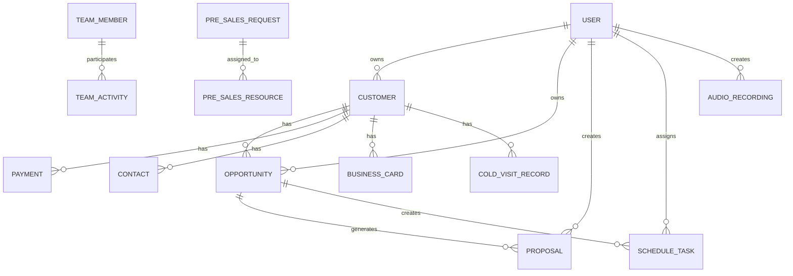
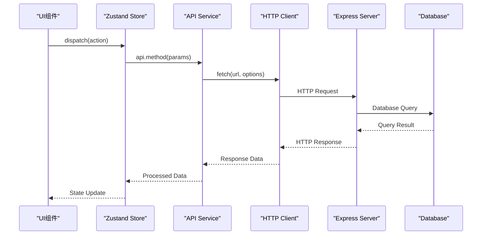
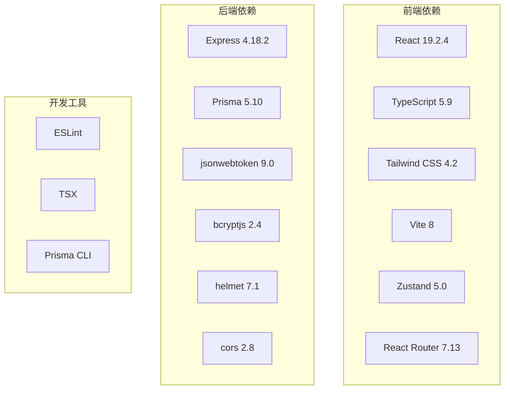

# 架构设计

<cite>
**本文引用的文件**
- [package.json](file://crm-frontend/package.json)
- [vite.config.ts](file://crm-frontend/vite.config.ts)
- [App.tsx](file://crm-frontend/src/App.tsx)
- [main.tsx](file://crm-frontend/src/main.tsx)
- [api.ts](file://crm-frontend/src/services/api.ts)
- [index.ts](file://crm-frontend/src/stores/index.ts)
- [package.json](file://crm-backend/package.json)
- [app.ts](file://crm-backend/src/app.ts)
- [schema.prisma](file://crm-backend/prisma/schema.prisma)
- [index.ts](file://crm-backend/src/config/index.ts)
- [index.ts](file://crm-backend/src/routes/index.ts)
- [auth.service.ts](file://crm-backend/src/services/auth.service.ts)
- [auth.controller.ts](file://crm-backend/src/controllers/auth.controller.ts)
</cite>

## 更新摘要
**所做更改**
- 更新技术栈版本信息（React 19.2.4、Express 4.18.2、Prisma ORM）
- 新增模块化架构模式分析
- 更新前后端分离架构设计
- 新增状态管理与API服务层架构
- 更新数据库设计与ORM映射

## 目录
1. [引言](#引言)
2. [项目结构](#项目结构)
3. [核心组件](#核心组件)
4. [架构总览](#架构总览)
5. [详细组件分析](#详细组件分析)
6. [模块化架构模式](#模块化架构模式)
7. [数据库与ORM设计](#数据库与orm设计)
8. [状态管理与API服务](#状态管理与api服务)
9. [依赖分析](#依赖分析)
10. [性能考量](#性能考量)
11. [故障排查指南](#故障排查指南)
12. [结论](#结论)
13. [附录](#附录)

## 引言
本文件为销售AI CRM系统的架构设计文档，全面反映了最新的技术栈选择和模块化架构模式。系统采用前后端分离架构，前端基于 React 19.2.4 + TypeScript + Tailwind CSS + Vite，后端基于 Express 4.18.2 + Prisma ORM + TypeScript，实现了完整的CRM功能体系。系统采用模块化架构模式，通过清晰的分层设计实现业务逻辑的可维护性和可扩展性。

## 项目结构
系统采用前后端分离的双仓库架构，前端工程位于 crm-frontend 目录，后端工程位于 crm-backend 目录。每个工程都采用了模块化的目录结构，按照功能领域进行组织。

**图表来源**
- [package.json:1-38](file://crm-frontend/package.json#L1-L38)
- [package.json:1-52](file://crm-backend/package.json#L1-L52)
- [schema.prisma:1-584](file://crm-backend/prisma/schema.prisma#L1-L584)

**章节来源**
- [package.json:1-38](file://crm-frontend/package.json#L1-L38)
- [package.json:1-52](file://crm-backend/package.json#L1-L52)

## 核心组件
系统的核心组件分为前端和后端两个层面：

### 前端核心组件
- **App 根组件**：基于 React Router 实现的路由管理，包含认证守卫和页面导航
- **状态管理**：使用 Zustand 实现轻量级状态管理，包含认证状态、客户数据、销售漏斗、支付数据
- **API 服务层**：统一的API封装，提供类型安全的HTTP客户端
- **页面组件**：完整的业务页面，包括仪表板、客户管理、销售漏斗、AI音频分析等

### 后端核心组件
- **应用入口**：Express 应用程序，集成中间件、路由和错误处理
- **控制器层**：处理HTTP请求，调用服务层并返回响应
- **服务层**：实现业务逻辑，调用数据访问层
- **数据访问层**：通过 Prisma ORM 进行数据库操作
- **路由层**：模块化的路由定义，按功能领域组织

**章节来源**
- [App.tsx:1-68](file://crm-frontend/src/App.tsx#L1-L68)
- [api.ts:1-705](file://crm-frontend/src/services/api.ts#L1-L705)
- [index.ts:1-4](file://crm-frontend/src/stores/index.ts#L1-L4)
- [app.ts:1-88](file://crm-backend/src/app.ts#L1-L88)

## 架构总览
系统采用经典的三层架构模式，前后端分离，通过RESTful API进行通信。前端使用现代React技术栈，后端使用Node.js + Express + Prisma ORM，实现了高度模块化和可扩展的系统架构。

**图表来源**
- [App.tsx:31-66](file://crm-frontend/src/App.tsx#L31-L66)
- [app.ts:12-86](file://crm-backend/src/app.ts#L12-L86)
- [auth.service.ts:6-256](file://crm-backend/src/services/auth.service.ts#L6-L256)

## 详细组件分析

### 前端架构组件

#### App 根组件与路由系统
前端使用 React Router 实现单页应用架构，包含完整的路由守卫机制和页面导航。

**图表来源**
- [App.tsx:18-29](file://crm-frontend/src/App.tsx#L18-L29)
- [App.tsx:31-66](file://crm-frontend/src/App.tsx#L31-L66)

#### 状态管理系统
系统采用 Zustand 实现轻量级状态管理，包含多个独立的状态存储模块。

**章节来源**
- [App.tsx:1-68](file://crm-frontend/src/App.tsx#L1-L68)
- [index.ts:1-4](file://crm-frontend/src/stores/index.ts#L1-L4)

### 后端架构组件

#### Express 应用程序架构
后端采用模块化设计，通过中间件、路由、控制器和服务层实现清晰的职责分离。

**图表来源**
- [app.ts:12-86](file://crm-backend/src/app.ts#L12-L86)
- [auth.controller.ts:5-61](file://crm-backend/src/controllers/auth.controller.ts#L5-L61)
- [auth.service.ts:6-256](file://crm-backend/src/services/auth.service.ts#L6-L256)

**章节来源**
- [app.ts:1-88](file://crm-backend/src/app.ts#L1-L88)
- [auth.controller.ts:1-61](file://crm-backend/src/controllers/auth.controller.ts#L1-L61)
- [auth.service.ts:1-256](file://crm-backend/src/services/auth.service.ts#L1-L256)

## 模块化架构模式
系统采用DDD（领域驱动设计）和模块化架构相结合的方式，实现了高度内聚、低耦合的系统设计。

### 前端模块化设计
前端按照功能领域进行模块化组织，每个功能模块包含独立的组件、状态管理和API服务。

### 后端模块化设计
后端采用Clean Architecture模式，通过六边形架构实现业务逻辑与基础设施的分离。

**图表来源**
- [index.ts:1-39](file://crm-backend/src/routes/index.ts#L1-L39)
- [auth.controller.ts:1-61](file://crm-backend/src/controllers/auth.controller.ts#L1-L61)
- [auth.service.ts:1-256](file://crm-backend/src/services/auth.service.ts#L1-L256)

## 数据库与ORM设计
系统使用 Prisma ORM 进行数据库抽象，支持MySQL数据库，实现了完整的数据模型设计和关系映射。

### 数据模型概览
系统包含完整的CRM业务数据模型，涵盖用户管理、客户管理、商机管理、支付管理、团队协作等多个业务领域。

**图表来源**
- [schema.prisma:121-584](file://crm-backend/prisma/schema.prisma#L121-L584)

### 数据库配置
系统使用环境变量进行数据库配置，支持开发、测试、生产环境的不同配置。

**章节来源**
- [schema.prisma:1-584](file://crm-backend/prisma/schema.prisma#L1-L584)
- [index.ts:1-60](file://crm-backend/src/config/index.ts#L1-L60)

## 状态管理与API服务
系统采用现代化的状态管理和API通信架构，实现了前后端的松耦合设计。

### 前端状态管理
使用 Zustand 实现轻量级状态管理，每个业务领域都有独立的状态存储。

### API 服务层
统一的API封装提供了类型安全的HTTP客户端，支持完整的CRUD操作和业务逻辑封装。

**图表来源**
- [api.ts:23-99](file://crm-frontend/src/services/api.ts#L23-L99)
- [App.tsx:18-29](file://crm-frontend/src/App.tsx#L18-L29)

**章节来源**
- [api.ts:1-705](file://crm-frontend/src/services/api.ts#L1-L705)
- [App.tsx:1-68](file://crm-frontend/src/App.tsx#L1-L68)

## 依赖分析
系统采用现代化的技术栈，前后端分别使用独立的依赖管理。

### 前端技术栈
- **React 19.2.4**：用于构建用户界面的现代JavaScript库
- **TypeScript 5.9**：提供类型安全的开发体验
- **Tailwind CSS 4.2**：实用优先的CSS框架
- **Vite 8**：快速的构建工具和开发服务器
- **Zustand 5.0**：轻量级状态管理库
- **React Router 7.13**：客户端路由管理

### 后端技术栈
- **Express 4.18.2**：Web应用框架
- **Prisma 5.10**：类型安全的数据库ORM
- **TypeScript 5.3**：类型安全的后端开发
- **bcryptjs 2.4**：密码加密库
- **jsonwebtoken 9.0**：JWT令牌处理
- **helmet 7.1**：安全头部中间件

**图表来源**
- [package.json:12-36](file://crm-frontend/package.json#L12-L36)
- [package.json:17-47](file://crm-backend/package.json#L17-L47)

**章节来源**
- [package.json:1-38](file://crm-frontend/package.json#L1-L38)
- [package.json:1-52](file://crm-backend/package.json#L1-L52)

## 性能考量
系统在设计时充分考虑了性能优化，采用了多种技术和策略来提升用户体验。

### 前端性能优化
- **组件懒加载**：使用React.lazy实现组件的按需加载
- **状态分片**：Zustand的细粒度状态管理减少不必要的重渲染
- **HTTP缓存**：API服务层实现请求缓存机制
- **代码分割**：Vite的动态导入实现Bundle优化

### 后端性能优化
- **连接池**：Prisma连接池管理数据库连接
- **查询优化**：使用Prisma的预取和联接优化
- **中间件优化**：按需加载和条件执行中间件
- **内存管理**：合理使用垃圾回收和内存监控

## 故障排查指南
系统提供了完善的错误处理和调试机制。

### 前端故障排查
- **路由问题**：检查路由配置和认证守卫逻辑
- **状态同步**：验证Zustand store的状态更新
- **API调用**：检查网络请求和错误处理
- **类型错误**：使用TypeScript进行编译时检查

### 后端故障排查
- **数据库连接**：验证Prisma连接配置和数据库状态
- **中间件顺序**：检查中间件的执行顺序和配置
- **路由映射**：验证路由定义和控制器方法
- **错误处理**：检查全局错误处理器和业务异常

**章节来源**
- [app.ts:76-78](file://crm-backend/src/app.ts#L76-L78)
- [auth.controller.ts:1-61](file://crm-backend/src/controllers/auth.controller.ts#L1-L61)

## 结论
销售AI CRM系统采用了现代化的前后端分离架构，结合React 19.2.4 + Express 4.18.2 + Prisma ORM的技术栈，实现了高度模块化、可扩展的企业级CRM解决方案。系统通过清晰的分层设计、严格的类型安全和完善的错误处理机制，为用户提供稳定可靠的服务体验。模块化架构模式确保了系统的可维护性和可扩展性，为未来的功能扩展和技术演进奠定了坚实的基础。

## 附录

### 系统边界
- **前端边界**：仅包含UI组件、状态管理和API通信，不包含后端业务逻辑
- **后端边界**：包含完整的业务逻辑、数据访问和API接口，不包含前端UI逻辑
- **数据库边界**：通过Prisma ORM抽象，隐藏具体的SQL实现细节

### 技术约束
- **类型约束**：使用TypeScript确保代码的类型安全
- **架构约束**：遵循Clean Architecture和DDD原则
- **性能约束**：前端组件懒加载，后端连接池管理
- **安全约束**：JWT认证、CORS配置、Helmet安全头

### 扩展性考虑
- **前端扩展**：支持新的业务模块和页面组件
- **后端扩展**：支持新的API端点和业务服务
- **数据库扩展**：支持新的数据模型和关系映射
- **部署扩展**：支持微服务架构和容器化部署