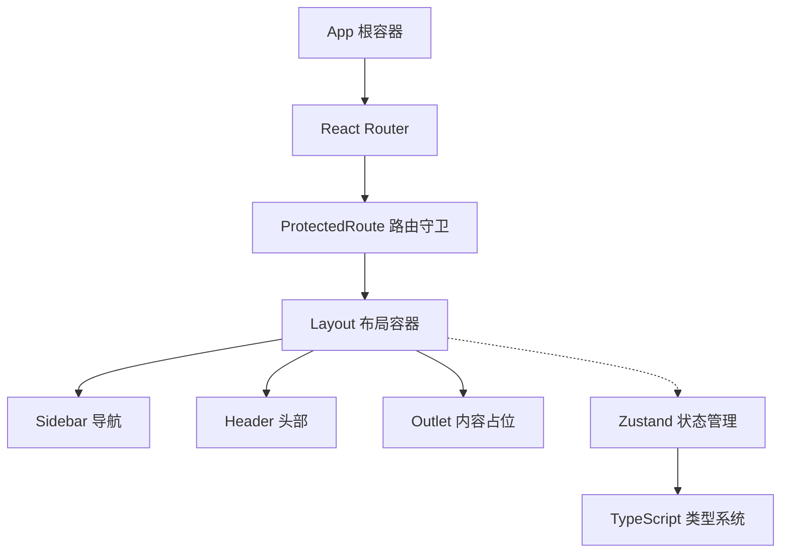
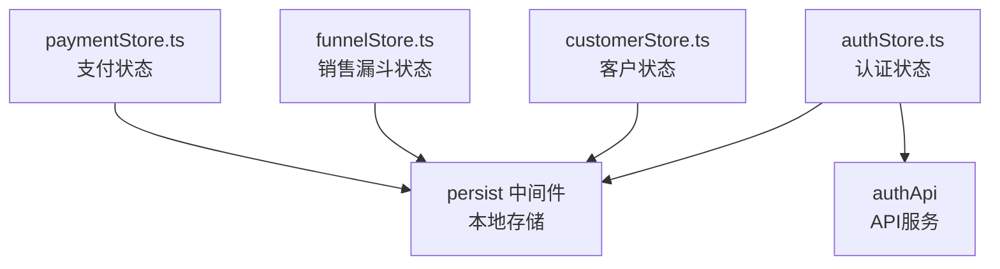
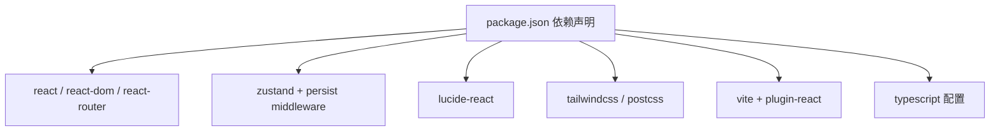

# 组件架构设计

<cite>
**本文档引用的文件**
- [App.tsx](file://crm-frontend/src/App.tsx)
- [Layout.tsx](file://crm-frontend/src/components/layout/Layout.tsx)
- [Sidebar.tsx](file://crm-frontend/src/components/layout/Sidebar.tsx)
- [Header.tsx](file://crm-frontend/src/components/layout/Header.tsx)
- [authStore.ts](file://crm-frontend/src/stores/authStore.ts)
- [customerStore.ts](file://crm-frontend/src/stores/customerStore.ts)
- [funnelStore.ts](file://crm-frontend/src/stores/funnelStore.ts)
- [paymentStore.ts](file://crm-frontend/src/stores/paymentStore.ts)
- [index.ts](file://crm-frontend/src/stores/index.ts)
- [main.tsx](file://crm-frontend/src/main.tsx)
- [package.json](file://crm-frontend/package.json)
- [vite.config.ts](file://crm-frontend/vite.config.ts)
- [tsconfig.json](file://crm-frontend/tsconfig.json)
- [types/index.ts](file://crm-frontend/src/types/index.ts)
</cite>

## 更新摘要
**所做更改**
- 更新了基于Zustand的状态管理系统架构
- 新增了现代化UI组件设计模式
- 重构了路由守卫和认证流程
- 完善了类型安全的组件通信机制
- 增强了响应式布局和暗黑模式支持

## 目录
1. [简介](#简介)
2. [项目结构](#项目结构)
3. [核心组件](#核心组件)
4. [架构总览](#架构总览)
5. [详细组件分析](#详细组件分析)
6. [Zustand状态管理](#zustand状态管理)
7. [现代化UI组件设计](#现代化ui组件设计)
8. [依赖分析](#依赖分析)
9. [性能考虑](#性能考虑)
10. [故障排查指南](#故障排查指南)
11. [结论](#结论)
12. [附录](#附录)

## 简介
本文件面向销售AI CRM系统的前端组件架构，围绕基于React函数组件的现代化架构模式展开，重点说明以下方面：
- App根组件作为整体布局容器的设计理念与职责边界
- 基于Zustand的状态管理系统架构与组件通信
- 现代化UI组件设计模式与响应式布局
- Sidebar导航系统的组件化实现、11个功能模块的组织方式与路由管理
- Header头部组件的功能职责与交互设计
- 类型安全的组件间层级关系与职责划分
- 组件生命周期管理与状态提升策略
- 提供组件关系图与代码示例路径，帮助开发者快速理解设计原则

## 项目结构
该前端采用Vite + React 19 + TypeScript + Zustand + Tailwind CSS技术栈，采用按功能域分层的组件组织方式：根组件负责页面骨架与区域划分，状态管理采用Zustand实现，各业务模块组件独立封装，便于复用与维护。

```mermaid
graph TB
subgraph "入口"
MAIN["main.tsx<br/>应用挂载点"]
end
subgraph "根组件"
APP["App.tsx<br/>路由与认证容器"]
PROTECTED["ProtectedRoute<br/>路由守卫"]
end
subgraph "布局容器"
LAYOUT["Layout.tsx<br/>整体布局容器"]
SIDENAV["Sidebar.tsx<br/>导航项集合"]
HEADER["Header.tsx<br/>头部区域"]
OUTLET["Outlet<br/>页面内容占位"]
end
subgraph "状态管理"
AUTHSTORE["authStore.ts<br/>认证状态管理"]
CUSTOMERSTORE["customerStore.ts<br/>客户状态管理"]
FUNNELSTORE["funnelStore.ts<br/>销售漏斗状态管理"]
PAYMENTSTORE["paymentStore.ts<br/>支付状态管理"]
END
subgraph "页面组件"
DASHBOARD["Dashboard<br/>工作台"]
CUSTOMERS["Customers<br/>客户管理"]
SALESFUNNEL["SalesFunnel<br/>销售漏斗"]
OTHERPAGES["其他业务页面"]
end
MAIN --> APP
APP --> PROTECTED
PROTECTED --> LAYOUT
LAYOUT --> SIDENAV
LAYOUT --> HEADER
LAYOUT --> OUTLET
OUTLET --> DASHBOARD
OUTLET --> CUSTOMERS
OUTLET --> SALESFUNNEL
OUTLET --> OTHERPAGES
LAYOUT -.-> AUTHSTORE
LAYOUT -.-> CUSTOMERSTORE
LAYOUT -.-> FUNNELSTORE
LAYOUT -.-> PAYMENTSTORE
```

**图表来源**
- [main.tsx:1-11](file://crm-frontend/src/main.tsx#L1-L11)
- [App.tsx:31-66](file://crm-frontend/src/App.tsx#L31-L66)
- [Layout.tsx:9-24](file://crm-frontend/src/components/layout/Layout.tsx#L9-L24)
- [Sidebar.tsx:18-78](file://crm-frontend/src/components/layout/Sidebar.tsx#L18-L78)
- [Header.tsx:9-88](file://crm-frontend/src/components/layout/Header.tsx#L9-L88)
- [authStore.ts:37-123](file://crm-frontend/src/stores/authStore.ts#L37-L123)
- [customerStore.ts:15-53](file://crm-frontend/src/stores/customerStore.ts#L15-L53)
- [funnelStore.ts:18-76](file://crm-frontend/src/stores/funnelStore.ts#L18-L76)
- [paymentStore.ts:22-81](file://crm-frontend/src/stores/paymentStore.ts#L22-L81)

**章节来源**
- [main.tsx:1-11](file://crm-frontend/src/main.tsx#L1-L11)
- [App.tsx:31-66](file://crm-frontend/src/App.tsx#L31-L66)
- [package.json:1-36](file://crm-frontend/package.json#L1-L36)
- [vite.config.ts:1-8](file://crm-frontend/vite.config.ts#L1-L8)
- [tsconfig.json:1-8](file://crm-frontend/tsconfig.json#L1-L8)

## 核心组件
- **App根组件**：采用React Router实现路由管理，包含路由守卫ProtectedRoute，确保认证状态下的页面访问控制
- **Layout布局容器**：承担整体布局容器职责，定义侧边栏、头部与主内容区域的组合方式，支持响应式布局和暗黑模式
- **Sidebar导航**：以"Logo区-导航列表-快捷入口-用户信息"四段式结构组织，使用React Router的NavLink实现路由导航
- **Header头部**：包含搜索输入、升级按钮、通知角标、用户信息与下拉指示，统一承载全局操作入口
- **状态管理**：采用Zustand实现轻量级状态管理，支持持久化存储和中间件功能
- **类型系统**：完整的TypeScript类型定义，确保组件间通信的类型安全

**章节来源**
- [App.tsx:31-66](file://crm-frontend/src/App.tsx#L31-L66)
- [Layout.tsx:9-24](file://crm-frontend/src/components/layout/Layout.tsx#L9-L24)
- [Sidebar.tsx:18-78](file://crm-frontend/src/components/layout/Sidebar.tsx#L18-L78)
- [Header.tsx:9-88](file://crm-frontend/src/components/layout/Header.tsx#L9-L88)
- [authStore.ts:37-123](file://crm-frontend/src/stores/authStore.ts#L37-L123)
- [types/index.ts:1-497](file://crm-frontend/src/types/index.ts#L1-L497)

## 架构总览
本系统采用"路由守卫 + 布局容器 + 状态管理"的现代化架构模式，Sidebar与Header分别承担导航与控制职责，主内容区通过React Router的Outlet实现动态页面加载。组件间通过Zustand状态管理实现高效的数据流，通过TypeScript确保类型安全。



**图表来源**
- [App.tsx:18-29](file://crm-frontend/src/App.tsx#L18-L29)
- [Layout.tsx:1-24](file://crm-frontend/src/components/layout/Layout.tsx#L1-L24)
- [Sidebar.tsx:1-16](file://crm-frontend/src/components/layout/Sidebar.tsx#L1-L16)
- [Header.tsx:1-4](file://crm-frontend/src/components/layout/Header.tsx#L1-L4)
- [authStore.ts:1-3](file://crm-frontend/src/stores/authStore.ts#L1-L3)

## 详细组件分析

### App根组件与路由守卫
- **设计理念**：采用React Router实现声明式路由管理，通过ProtectedRoute组件实现认证守卫
- **路由配置**：
  - 登录页面：`/login` - 无需认证
  - 保护页面：`/` 及所有子路由 - 需要认证
  - 404重定向：`*` - 重定向到首页
- **认证逻辑**：使用`useAuthStore`检查认证状态，未登录自动重定向到登录页并保留来源页面

**章节来源**
- [App.tsx:18-29](file://crm-frontend/src/App.tsx#L18-L29)
- [App.tsx:31-66](file://crm-frontend/src/App.tsx#L31-L66)

### Layout布局容器
- **设计特点**：采用Flex布局实现左右分栏，支持响应式设计和暗黑模式
- **区域划分**：
  - 左侧：Sidebar负责导航与快捷入口
  - 右侧：Header承载搜索、通知与用户信息
  - 中央：Outlet作为页面内容占位符
- **响应式支持**：使用Tailwind CSS的响应式类名实现移动端适配

**章节来源**
- [Layout.tsx:9-24](file://crm-frontend/src/components/layout/Layout.tsx#L9-L24)

### Sidebar导航系统
- **组件化实现**：
  - 使用React Router的NavLink实现路由导航
  - 支持活动状态样式切换和悬停效果
  - 包含Logo区、导航列表、快捷入口和用户信息四个区域
- **导航配置**：11个功能模块，使用Material Symbols图标库
- **交互设计**：支持活动状态高亮和暗黑模式适配

**章节来源**
- [Sidebar.tsx:18-78](file://crm-frontend/src/components/layout/Sidebar.tsx#L18-L78)

### Header头部组件
- **功能职责**：
  - 左侧搜索框：提供全局检索入口，支持焦点态样式
  - 升级按钮：突出付费能力或试用引导
  - 通知角标：显示未读数，支持点击进入消息中心
  - 用户信息区：展示姓名、角色与头像，带下拉指示
- **交互设计**：
  - 搜索框支持实时输入反馈
  - 用户头像区域支持悬停高亮与下拉菜单触发
  - 通知按钮支持绝对定位角标

**章节来源**
- [Header.tsx:9-88](file://crm-frontend/src/components/layout/Header.tsx#L9-L88)

### 组件间层级关系与职责划分
- **层级关系**：App为根容器，ProtectedRoute为认证守卫，Layout为布局容器，Sidebar与Header为一级子组件，各业务页面为二级子组件
- **职责划分**：
  - App：路由管理与认证守卫
  - Layout：页面布局与内容占位
  - Sidebar：导航与入口管理
  - Header：全局搜索、通知与用户控制
  - 各业务页面：具体功能实现
- **通信方式**：
  - 路由参数：通过React Router传递页面参数
  - 状态共享：通过Zustand store实现跨组件状态共享
  - 类型安全：通过TypeScript确保组件间通信的类型正确性

**章节来源**
- [App.tsx:31-66](file://crm-frontend/src/App.tsx#L31-L66)
- [Layout.tsx:1-24](file://crm-frontend/src/components/layout/Layout.tsx#L1-L24)
- [Sidebar.tsx:18-78](file://crm-frontend/src/components/layout/Sidebar.tsx#L18-L78)
- [Header.tsx:9-88](file://crm-frontend/src/components/layout/Header.tsx#L9-L88)

## Zustand状态管理

### 状态管理架构
- **设计理念**：采用Zustand实现轻量级状态管理，每个功能域独立管理状态
- **持久化支持**：使用`persist`中间件实现状态持久化存储
- **模块化设计**：按功能域划分store，便于维护和扩展

### 认证状态管理 (authStore)
- **状态结构**：
  - user: 用户信息对象
  - token: 认证令牌
  - isAuthenticated: 认证状态
  - isLoading: 加载状态
  - error: 错误信息
- **核心方法**：
  - login/logout/register: 用户认证操作
  - getProfile: 获取用户资料
  - setToken/clearError: 状态管理辅助方法

### 客户状态管理 (customerStore)
- **状态结构**：customers数组存储客户数据
- **核心方法**：
  - CRUD操作：addCustomer/updateCustomer/deleteCustomer
  - 查询过滤：getCustomerById/filterByStage

### 销售漏斗状态管理 (funnelStore)
- **状态结构**：
  - opportunities: 销售机会数组
  - selectedStage: 当前选择的阶段
- **核心方法**：
  - 机会管理：addOpportunity/updateOpportunity/deleteOpportunity
  - 阶段操作：moveOpportunity/setSelectedStage
  - 统计查询：getOpportunitiesByStage/getStageStats

### 支付状态管理 (paymentStore)
- **状态结构**：payments数组存储支付记录
- **核心方法**：
  - 支付管理：addPayment/updatePayment/deletePayment
  - 状态查询：getPaymentById/getPaymentsByStatus
  - 统计分析：getPaymentStats/getOverduePayments



**图表来源**
- [authStore.ts:37-123](file://crm-frontend/src/stores/authStore.ts#L37-L123)
- [customerStore.ts:15-53](file://crm-frontend/src/stores/customerStore.ts#L15-L53)
- [funnelStore.ts:18-76](file://crm-frontend/src/stores/funnelStore.ts#L18-L76)
- [paymentStore.ts:22-81](file://crm-frontend/src/stores/paymentStore.ts#L22-L81)

**章节来源**
- [authStore.ts:37-123](file://crm-frontend/src/stores/authStore.ts#L37-L123)
- [customerStore.ts:15-53](file://crm-frontend/src/stores/customerStore.ts#L15-L53)
- [funnelStore.ts:18-76](file://crm-frontend/src/stores/funnelStore.ts#L18-L76)
- [paymentStore.ts:22-81](file://crm-frontend/src/stores/paymentStore.ts#L22-L81)

## 现代化UI组件设计

### 设计原则
- **响应式设计**：使用Tailwind CSS实现移动端适配
- **暗黑模式支持**：通过CSS变量和dark:前缀实现主题切换
- **原子化样式**：采用原子化CSS类名提高样式复用性
- **Material Symbols图标**：统一图标风格和尺寸

### 组件设计模式
- **函数组件**：全部采用函数组件实现，支持Hooks
- **Props接口**：严格的Props类型定义
- **状态管理**：结合Zustand实现组件状态管理
- **事件处理**：清晰的事件处理机制

### 样式系统
- **颜色系统**：基于Tailwind CSS的颜色变量
- **间距系统**：使用统一的间距单位
- **字体系统**：合理的字体大小和字重层次
- **阴影系统**：适度的阴影效果增强层次感

**章节来源**
- [Layout.tsx:11-24](file://crm-frontend/src/components/layout/Layout.tsx#L11-L24)
- [Sidebar.tsx:20-78](file://crm-frontend/src/components/layout/Sidebar.tsx#L20-L78)
- [Header.tsx:21-88](file://crm-frontend/src/components/layout/Header.tsx#L21-L88)
- [types/index.ts:240-271](file://crm-frontend/src/types/index.ts#L240-L271)

## 依赖分析
- **运行时依赖**：React 19、React DOM、React Router、Zustand、Lucide React、Tailwind CSS
- **开发依赖**：Vite、TypeScript、ESLint、PostCSS、Tailwind CSS插件
- **构建工具**：Vite + @vitejs/plugin-react，TS配置拆分为应用与Node环境两份



**图表来源**
- [package.json:12-34](file://crm-frontend/package.json#L12-L34)
- [vite.config.ts:1-8](file://crm-frontend/vite.config.ts#L1-L8)
- [tsconfig.json:1-8](file://crm-frontend/tsconfig.json#L1-L8)

**章节来源**
- [package.json:12-34](file://crm-frontend/package.json#L12-L34)
- [vite.config.ts:1-8](file://crm-frontend/vite.config.ts#L1-L8)
- [tsconfig.json:1-8](file://crm-frontend/tsconfig.json#L1-L8)

## 性能考虑
- **状态管理优化**：Zustand相比Redux更轻量，减少不必要的重渲染
- **组件拆分**：将UI与逻辑分离，减少重渲染范围
- **路由懒加载**：通过React.lazy实现页面组件的懒加载
- **图标与样式**：使用轻量图标库与原子化样式，降低打包体积与样式计算成本
- **状态持久化**：使用persist中间件减少重复请求
- **响应式设计**：通过CSS媒体查询优化移动端性能

## 故障排查指南
- **应用无法启动**
  - 检查入口挂载是否正确，确认DOM节点存在
  - 章节来源
    - [main.tsx:6-10](file://crm-frontend/src/main.tsx#L6-L10)
- **路由跳转问题**
  - 确认ProtectedRoute组件正确包裹Layout组件
  - 检查路由配置是否正确
  - 章节来源
    - [App.tsx:38-59](file://crm-frontend/src/App.tsx#L38-L59)
- **状态管理问题**
  - 检查Zustand store是否正确创建和导出
  - 确认persist中间件配置正确
  - 章节来源
    - [authStore.ts:37-123](file://crm-frontend/src/stores/authStore.ts#L37-L123)
- **样式异常**
  - 确认Tailwind CSS已正确安装与配置
  - 检查暗黑模式类名是否正确应用
  - 章节来源
    - [package.json:18-34](file://crm-frontend/package.json#L18-L34)
- **图标不显示**
  - 确认Material Symbols图标库正确引入
  - 检查图标名称是否正确
  - 章节来源
    - [Sidebar.tsx:46](file://crm-frontend/src/components/layout/Sidebar.tsx#L46)
    - [Header.tsx:47](file://crm-frontend/src/components/layout/Header.tsx#L47)

## 结论
本架构以App根组件为核心，通过React Router实现路由管理，通过Zustand实现现代化状态管理，通过Layout组件完成导航与控制，主内容区以动态页面加载实现信息密度与交互节奏的平衡。组件间通过TypeScript确保类型安全，通过Zustand实现高效的状态共享。建议后续继续完善状态管理模块，增强错误处理机制，优化性能监控。

## 附录
- **代码示例路径（仅列出关键文件）**
  - 根组件路由与认证：[App.tsx:31-66](file://crm-frontend/src/App.tsx#L31-L66)
  - 布局容器组件：[Layout.tsx:9-24](file://crm-frontend/src/components/layout/Layout.tsx#L9-L24)
  - 导航组件：[Sidebar.tsx:18-78](file://crm-frontend/src/components/layout/Sidebar.tsx#L18-L78)
  - 头部组件：[Header.tsx:9-88](file://crm-frontend/src/components/layout/Header.tsx#L9-L88)
  - 认证状态管理：[authStore.ts:37-123](file://crm-frontend/src/stores/authStore.ts#L37-L123)
  - 客户状态管理：[customerStore.ts:15-53](file://crm-frontend/src/stores/customerStore.ts#L15-L53)
  - 销售漏斗状态管理：[funnelStore.ts:18-76](file://crm-frontend/src/stores/funnelStore.ts#L18-L76)
  - 支付状态管理：[paymentStore.ts:22-81](file://crm-frontend/src/stores/paymentStore.ts#L22-L81)
  - 类型定义：[types/index.ts:1-497](file://crm-frontend/src/types/index.ts#L1-L497)
  - 应用入口挂载：[main.tsx:6-10](file://crm-frontend/src/main.tsx#L6-L10)
  - 依赖与构建配置：[package.json:12-34](file://crm-frontend/package.json#L12-L34)、[vite.config.ts:1-8](file://crm-frontend/vite.config.ts#L1-L8)、[tsconfig.json:1-8](file://crm-frontend/tsconfig.json#L1-L8)