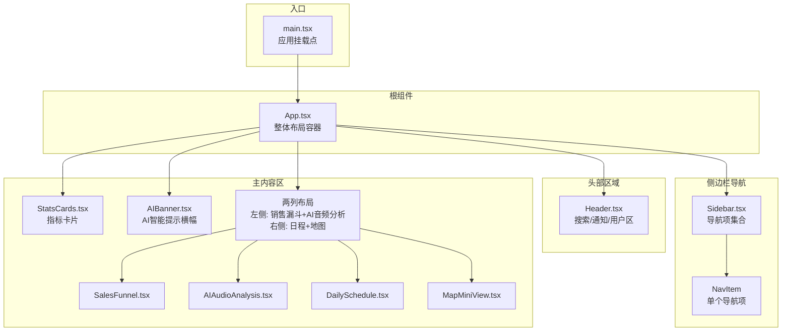
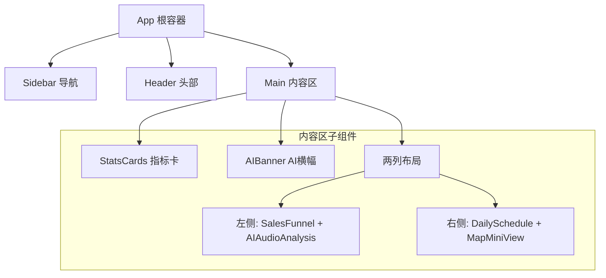
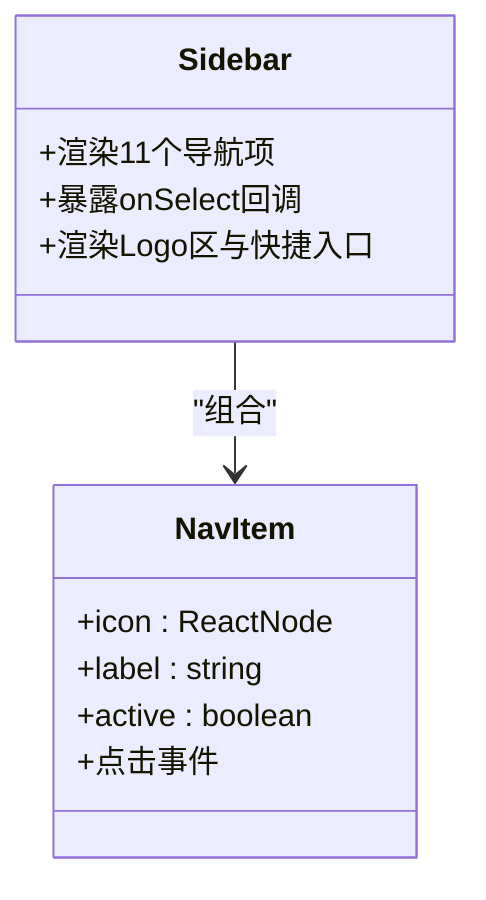
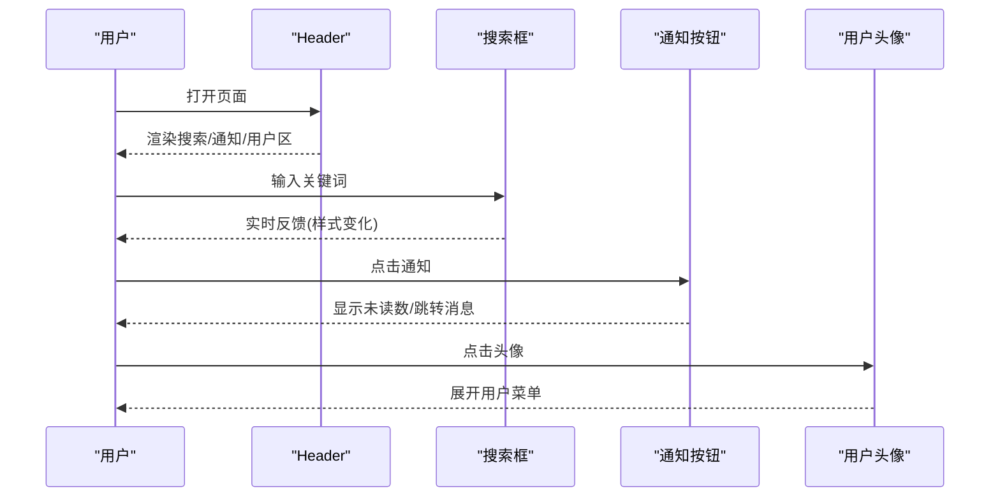
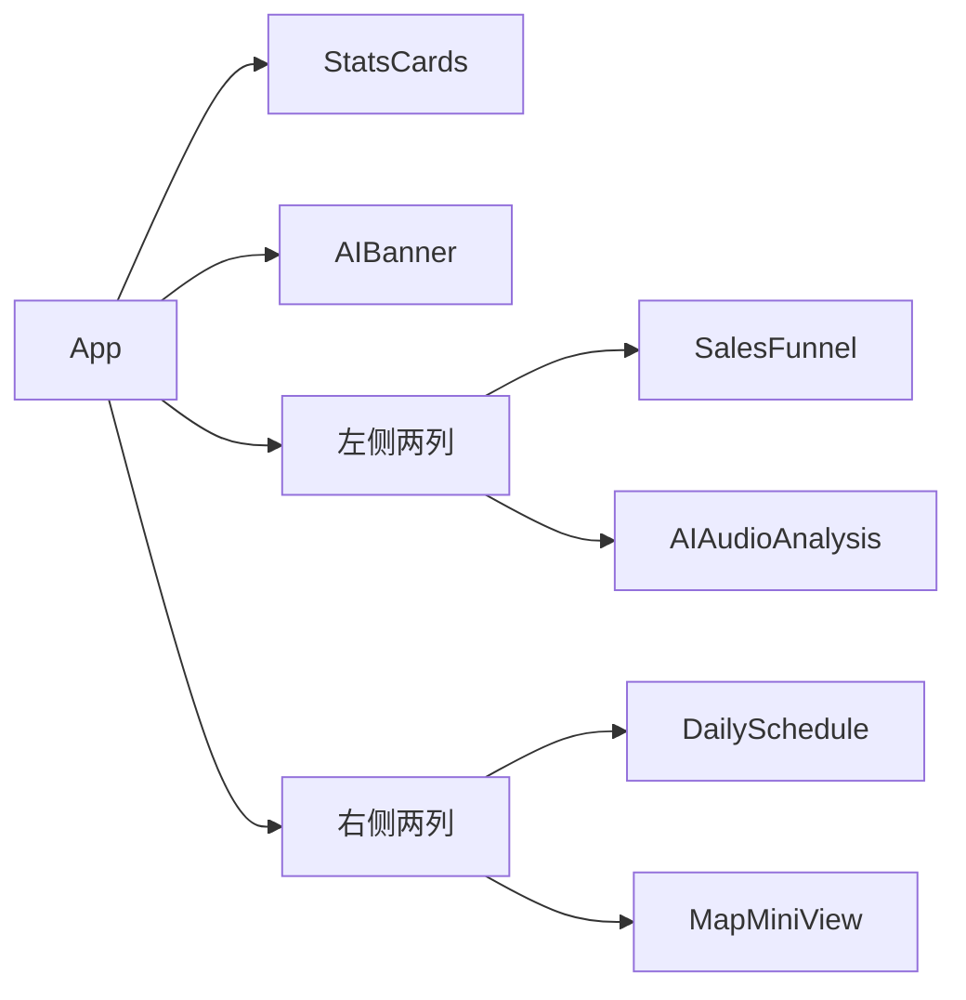
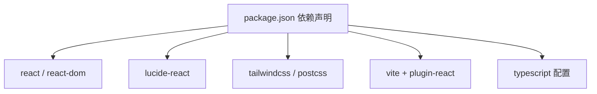

# 组件架构设计

<cite>
**本文引用的文件**
- [App.tsx](file://crm-frontend/src/App.tsx)
- [Sidebar.tsx](file://crm-frontend/src/components/Sidebar.tsx)
- [Header.tsx](file://crm-frontend/src/components/Header.tsx)
- [StatsCards.tsx](file://crm-frontend/src/components/StatsCards.tsx)
- [AIBanner.tsx](file://crm-frontend/src/components/AIBanner.tsx)
- [SalesFunnel.tsx](file://crm-frontend/src/components/SalesFunnel.tsx)
- [AIAudioAnalysis.tsx](file://crm-frontend/src/components/AIAudioAnalysis.tsx)
- [DailySchedule.tsx](file://crm-frontend/src/components/DailySchedule.tsx)
- [MapMiniView.tsx](file://crm-frontend/src/components/MapMiniView.tsx)
- [main.tsx](file://crm-frontend/src/main.tsx)
- [package.json](file://crm-frontend/package.json)
- [vite.config.ts](file://crm-frontend/vite.config.ts)
- [tsconfig.json](file://crm-frontend/tsconfig.json)
</cite>

## 目录
1. [简介](#简介)
2. [项目结构](#项目结构)
3. [核心组件](#核心组件)
4. [架构总览](#架构总览)
5. [详细组件分析](#详细组件分析)
6. [依赖分析](#依赖分析)
7. [性能考虑](#性能考虑)
8. [故障排查指南](#故障排查指南)
9. [结论](#结论)
10. [附录](#附录)

## 简介
本文件面向销售AI CRM系统的前端组件架构，围绕基于React函数组件的布局与模块化设计展开，重点说明以下方面：
- App根组件作为整体布局容器的设计理念与职责边界
- Sidebar导航系统的组件化实现、11个功能模块的组织方式与路由管理建议
- Header头部组件的功能职责与交互设计
- 组件间层级关系与职责划分，以及通过props和事件实现的组件通信
- 组件生命周期管理与状态提升策略
- 提供组件关系图与代码示例路径，帮助开发者快速理解设计原则

## 项目结构
该前端采用Vite + React 19 + TypeScript + Tailwind CSS技术栈，采用按功能域分层的组件组织方式：根组件负责页面骨架与区域划分，各业务模块组件独立封装，便于复用与维护。

图表来源
- [main.tsx:1-11](file://crm-frontend/src/main.tsx#L1-L11)
- [App.tsx:10-55](file://crm-frontend/src/App.tsx#L10-L55)
- [Sidebar.tsx:37-83](file://crm-frontend/src/components/Sidebar.tsx#L37-L83)
- [Header.tsx:3-50](file://crm-frontend/src/components/Header.tsx#L3-L50)
- [StatsCards.tsx:35-78](file://crm-frontend/src/components/StatsCards.tsx#L35-L78)
- [AIBanner.tsx:3-43](file://crm-frontend/src/components/AIBanner.tsx#L3-L43)
- [SalesFunnel.tsx:29-62](file://crm-frontend/src/components/SalesFunnel.tsx#L29-L62)
- [AIAudioAnalysis.tsx:38-77](file://crm-frontend/src/components/AIAudioAnalysis.tsx#L38-L77)
- [DailySchedule.tsx:26-65](file://crm-frontend/src/components/DailySchedule.tsx#L26-L65)
- [MapMiniView.tsx:3-53](file://crm-frontend/src/components/MapMiniView.tsx#L3-L53)

章节来源
- [main.tsx:1-11](file://crm-frontend/src/main.tsx#L1-L11)
- [App.tsx:10-55](file://crm-frontend/src/App.tsx#L10-L55)
- [package.json:1-36](file://crm-frontend/package.json#L1-L36)
- [vite.config.ts:1-8](file://crm-frontend/vite.config.ts#L1-L8)
- [tsconfig.json:1-8](file://crm-frontend/tsconfig.json#L1-L8)

## 核心组件
- App根组件：承担整体布局容器职责，定义侧边栏、头部与主内容区域的组合方式；内部通过网格与弹性布局组织多个业务组件，形成清晰的视觉层次与信息密度分布。
- Sidebar导航：以“Logo区-导航列表-快捷入口”三段式结构组织，使用受控/非受控结合的方式展示当前激活项，并预留路由切换接口。
- Header头部：包含搜索输入、升级按钮、通知角标、用户信息与下拉指示，统一承载全局操作入口。
- 主内容区：由指标卡片、AI横幅、两列布局（左侧销售漏斗+AI音频分析，右侧日程+地图）构成，强调数据可视化与任务提醒的协同。

章节来源
- [App.tsx:10-55](file://crm-frontend/src/App.tsx#L10-L55)
- [Sidebar.tsx:37-83](file://crm-frontend/src/components/Sidebar.tsx#L37-L83)
- [Header.tsx:3-50](file://crm-frontend/src/components/Header.tsx#L3-L50)
- [StatsCards.tsx:35-78](file://crm-frontend/src/components/StatsCards.tsx#L35-L78)
- [AIBanner.tsx:3-43](file://crm-frontend/src/components/AIBanner.tsx#L3-L43)
- [SalesFunnel.tsx:29-62](file://crm-frontend/src/components/SalesFunnel.tsx#L29-L62)
- [AIAudioAnalysis.tsx:38-77](file://crm-frontend/src/components/AIAudioAnalysis.tsx#L38-L77)
- [DailySchedule.tsx:26-65](file://crm-frontend/src/components/DailySchedule.tsx#L26-L65)
- [MapMiniView.tsx:3-53](file://crm-frontend/src/components/MapMiniView.tsx#L3-L53)

## 架构总览
本系统采用“根容器 + 多功能面板”的布局模式，Sidebar与Header分别承担导航与控制职责，主内容区通过网格与弹性布局实现信息密度与交互节奏的平衡。组件间通过props传递静态数据与状态标记，通过事件回调实现交互解耦。

图表来源
- [App.tsx:10-55](file://crm-frontend/src/App.tsx#L10-L55)
- [StatsCards.tsx:35-78](file://crm-frontend/src/components/StatsCards.tsx#L35-L78)
- [AIBanner.tsx:3-43](file://crm-frontend/src/components/AIBanner.tsx#L3-L43)
- [SalesFunnel.tsx:29-62](file://crm-frontend/src/components/SalesFunnel.tsx#L29-L62)
- [AIAudioAnalysis.tsx:38-77](file://crm-frontend/src/components/AIAudioAnalysis.tsx#L38-L77)
- [DailySchedule.tsx:26-65](file://crm-frontend/src/components/DailySchedule.tsx#L26-L65)
- [MapMiniView.tsx:3-53](file://crm-frontend/src/components/MapMiniView.tsx#L3-L53)

## 详细组件分析

### App根组件与布局容器
- 设计理念：以Sidebar为左栏、Header为顶栏、Main为内容区的三段式布局，配合网格系统实现信息密度与交互节奏的平衡。
- 区域划分：
  - 左侧：Sidebar负责导航与快捷入口
  - 上方：Header承载搜索、通知与用户信息
  - 主体：指标卡、AI横幅、两列布局（左侧销售漏斗+AI音频分析，右侧日程+地图）
- 响应式与滚动：外层容器设置高度与溢出控制，主体内容区启用纵向滚动，避免全局滚动冲突。

章节来源
- [App.tsx:10-55](file://crm-frontend/src/App.tsx#L10-L55)

### Sidebar导航系统
- 组件化实现：
  - NavItem为可复用的导航项组件，接收图标、标签与激活状态，支持悬停与选中态样式切换
  - Sidebar聚合11个导航项，包含工作台、客户管理、销售漏斗、商务方案、售后服务、回款统计、AI录音分析、智能日程、客户地图、团队协作、售前中心
- 路由管理建议：
  - 当前实现为静态导航，建议在NavItem或Sidebar上暴露onSelect回调，传入目标模块标识，由上层App或路由层处理跳转
  - 可引入useLocation/useNavigate（如使用React Router）进行路由同步与面包屑联动
- 交互细节：Logo区用于品牌识别，底部新增线索按钮提供入口级操作

图表来源
- [Sidebar.tsx:16-35](file://crm-frontend/src/components/Sidebar.tsx#L16-L35)
- [Sidebar.tsx:37-83](file://crm-frontend/src/components/Sidebar.tsx#L37-L83)

章节来源
- [Sidebar.tsx:16-35](file://crm-frontend/src/components/Sidebar.tsx#L16-L35)
- [Sidebar.tsx:37-83](file://crm-frontend/src/components/Sidebar.tsx#L37-L83)

### Header头部组件
- 功能职责：
  - 左侧搜索框：提供全局检索入口，具备焦点态样式与占位符文案
  - 升级按钮：突出付费能力或试用引导
  - 通知角标：显示未读数，支持点击进入消息中心
  - 用户信息区：展示姓名、角色与头像，带下拉指示
- 交互设计：
  - 输入框聚焦时背景与边框高亮，提升可用性
  - 用户头像区域支持悬停高亮与下拉菜单触发
  - 通知按钮支持绝对定位角标，增强视觉提示

图表来源
- [Header.tsx:3-50](file://crm-frontend/src/components/Header.tsx#L3-L50)

章节来源
- [Header.tsx:3-50](file://crm-frontend/src/components/Header.tsx#L3-L50)

### 主内容区组件族
- StatsCards：四个指标卡片，分别展示月收入、活跃客户、管道价值与当日拜访数量，支持趋势徽章与图标背景色
- AIBanner：AI智能提示横幅，包含渐变背景、装饰圆环与操作按钮
- SalesFunnel：销售漏斗概览，展示各阶段转化率与总金额趋势
- AIAudioAnalysis：AI语音分析摘要，按正向/中性/负面情感分类展示
- DailySchedule：当日日程，以时间轴形式展示任务与颜色编码
- MapMiniView：客户位置小地图，以网格与标记点示意客户分布

图表来源
- [App.tsx:22-51](file://crm-frontend/src/App.tsx#L22-L51)
- [StatsCards.tsx:35-78](file://crm-frontend/src/components/StatsCards.tsx#L35-L78)
- [AIBanner.tsx:3-43](file://crm-frontend/src/components/AIBanner.tsx#L3-L43)
- [SalesFunnel.tsx:29-62](file://crm-frontend/src/components/SalesFunnel.tsx#L29-L62)
- [AIAudioAnalysis.tsx:38-77](file://crm-frontend/src/components/AIAudioAnalysis.tsx#L38-L77)
- [DailySchedule.tsx:26-65](file://crm-frontend/src/components/DailySchedule.tsx#L26-L65)
- [MapMiniView.tsx:3-53](file://crm-frontend/src/components/MapMiniView.tsx#L3-L53)

章节来源
- [StatsCards.tsx:35-78](file://crm-frontend/src/components/StatsCards.tsx#L35-L78)
- [AIBanner.tsx:3-43](file://crm-frontend/src/components/AIBanner.tsx#L3-L43)
- [SalesFunnel.tsx:29-62](file://crm-frontend/src/components/SalesFunnel.tsx#L29-L62)
- [AIAudioAnalysis.tsx:38-77](file://crm-frontend/src/components/AIAudioAnalysis.tsx#L38-L77)
- [DailySchedule.tsx:26-65](file://crm-frontend/src/components/DailySchedule.tsx#L26-L65)
- [MapMiniView.tsx:3-53](file://crm-frontend/src/components/MapMiniView.tsx#L3-L53)

### 组件间层级关系与职责划分
- 层级关系：App为根容器，Sidebar与Header为一级子组件，主内容区为二级子组件；各业务组件彼此独立，通过props向下传递数据，通过事件向上反馈交互
- 职责划分：
  - Sidebar：导航与入口管理
  - Header：全局搜索、通知与用户控制
  - 主内容区：数据展示与任务提醒
- 通信方式：
  - Props：图标、标签、数值、徽章类型等静态数据
  - 事件：点击、提交、展开等交互回调
  - 状态提升：将激活项、搜索词、通知状态等提升至App或更高层，实现跨组件共享

章节来源
- [App.tsx:10-55](file://crm-frontend/src/App.tsx#L10-L55)
- [Sidebar.tsx:37-83](file://crm-frontend/src/components/Sidebar.tsx#L37-L83)
- [Header.tsx:3-50](file://crm-frontend/src/components/Header.tsx#L3-L50)

### 生命周期管理与状态提升策略
- 生命周期：当前组件均为函数组件，无显式生命周期钩子；若需副作用（如请求、定时器），可在对应组件内使用useEffect管理
- 状态提升：
  - 将Sidebar的激活项、Header的搜索词、通知未读数等状态提升至App
  - 通过props向下传递，通过回调事件向上更新
  - 对于复杂状态（如路由、权限、主题），建议引入Context或轻量状态库统一管理

章节来源
- [App.tsx:10-55](file://crm-frontend/src/App.tsx#L10-L55)
- [Sidebar.tsx:37-83](file://crm-frontend/src/components/Sidebar.tsx#L37-L83)
- [Header.tsx:3-50](file://crm-frontend/src/components/Header.tsx#L3-L50)

## 依赖分析
- 运行时依赖：React 19、React DOM、Lucide React（图标）、Tailwind CSS（样式）
- 开发依赖：Vite、TypeScript、ESLint、PostCSS、Tailwind CSS插件
- 构建工具：Vite + @vitejs/plugin-react，TS配置拆分为应用与Node环境两份

图表来源
- [package.json:12-34](file://crm-frontend/package.json#L12-L34)
- [vite.config.ts:1-8](file://crm-frontend/vite.config.ts#L1-L8)
- [tsconfig.json:1-8](file://crm-frontend/tsconfig.json#L1-L8)

章节来源
- [package.json:12-34](file://crm-frontend/package.json#L12-L34)
- [vite.config.ts:1-8](file://crm-frontend/vite.config.ts#L1-L8)
- [tsconfig.json:1-8](file://crm-frontend/tsconfig.json#L1-L8)

## 性能考虑
- 组件拆分：将UI与逻辑分离，减少重渲染范围
- 图标与样式：使用轻量图标库与原子化样式，降低打包体积与样式计算成本
- 列表渲染：对长列表使用稳定key，避免不必要的diff
- 滚动与布局：主体内容启用纵向滚动，避免全局滚动条闪烁
- 构建优化：利用Vite的快速冷启动与按需编译特性，结合Tree-shaking与最小化策略

## 故障排查指南
- 应用无法启动
  - 检查入口挂载是否正确，确认DOM节点存在
  - 章节来源
    - [main.tsx:6-10](file://crm-frontend/src/main.tsx#L6-L10)
- 样式异常
  - 确认Tailwind CSS已正确安装与配置
  - 章节来源
    - [package.json:18-34](file://crm-frontend/package.json#L18-L34)
- 图标不显示
  - 确认lucide-react版本与导入路径正确
  - 章节来源
    - [Sidebar.tsx:1](file://crm-frontend/src/components/Sidebar.tsx#L1)
    - [Header.tsx:1](file://crm-frontend/src/components/Header.tsx#L1)
- 组件渲染错位
  - 检查App中的网格与弹性布局类名是否正确
  - 章节来源
    - [App.tsx:22-51](file://crm-frontend/src/App.tsx#L22-L51)

## 结论
本架构以App根组件为核心，通过Sidebar与Header完成导航与控制，主内容区以多面板组合实现信息密度与交互节奏的平衡。组件间通过props与事件实现低耦合通信，状态提升策略确保跨组件一致性。建议后续引入路由与状态管理，进一步完善导航与数据流。

## 附录
- 代码示例路径（仅列出关键文件）
  - 根组件布局与区域划分：[App.tsx:10-55](file://crm-frontend/src/App.tsx#L10-L55)
  - 导航项与Sidebar组织：[Sidebar.tsx:16-83](file://crm-frontend/src/components/Sidebar.tsx#L16-L83)
  - 头部交互元素：[Header.tsx:3-50](file://crm-frontend/src/components/Header.tsx#L3-L50)
  - 指标卡片组件：[StatsCards.tsx:35-78](file://crm-frontend/src/components/StatsCards.tsx#L35-L78)
  - AI横幅组件：[AIBanner.tsx:3-43](file://crm-frontend/src/components/AIBanner.tsx#L3-L43)
  - 销售漏斗组件：[SalesFunnel.tsx:29-62](file://crm-frontend/src/components/SalesFunnel.tsx#L29-L62)
  - AI音频分析组件：[AIAudioAnalysis.tsx:38-77](file://crm-frontend/src/components/AIAudioAnalysis.tsx#L38-L77)
  - 日程组件：[DailySchedule.tsx:26-65](file://crm-frontend/src/components/DailySchedule.tsx#L26-L65)
  - 地图组件：[MapMiniView.tsx:3-53](file://crm-frontend/src/components/MapMiniView.tsx#L3-L53)
  - 应用入口挂载：[main.tsx:6-10](file://crm-frontend/src/main.tsx#L6-L10)
  - 依赖与构建配置：[package.json:12-34](file://crm-frontend/package.json#L12-L34)、[vite.config.ts:1-8](file://crm-frontend/vite.config.ts#L1-L8)、[tsconfig.json:1-8](file://crm-frontend/tsconfig.json#L1-L8)