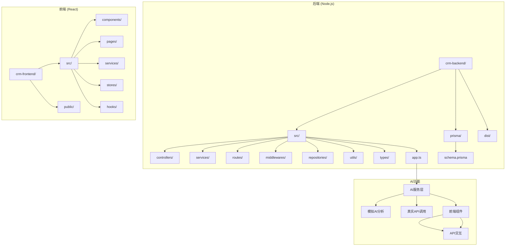
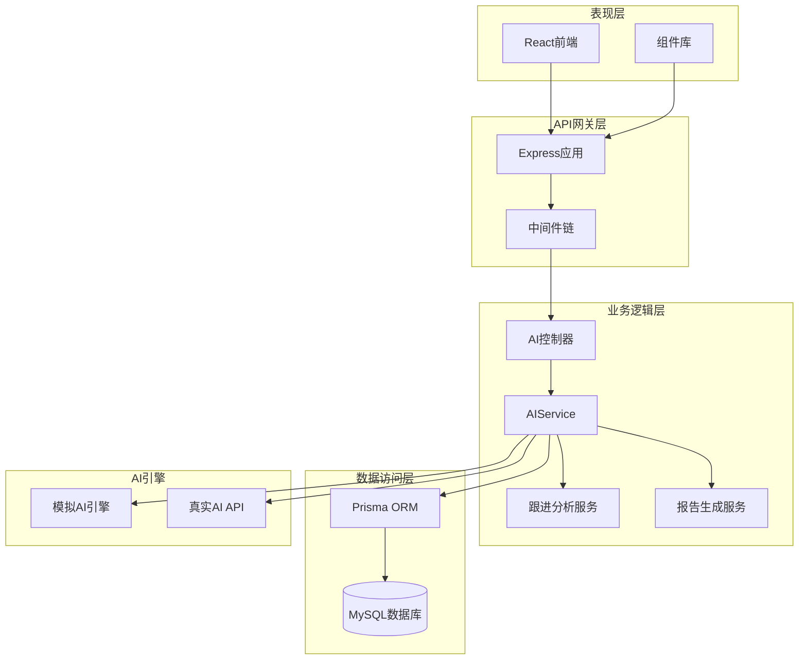
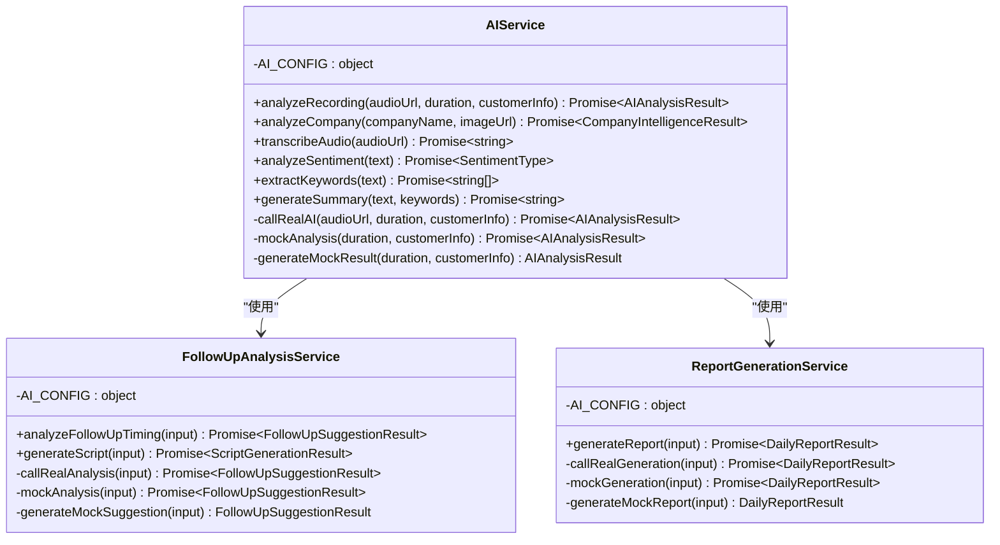
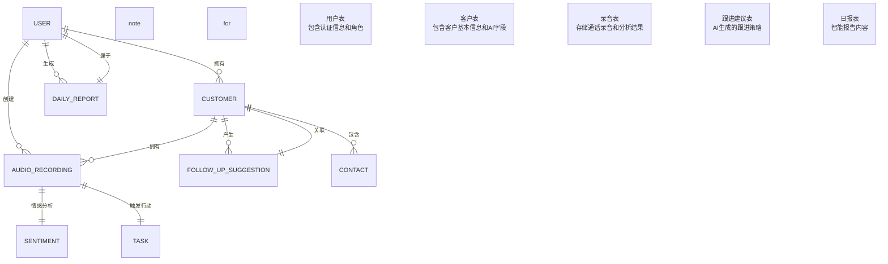
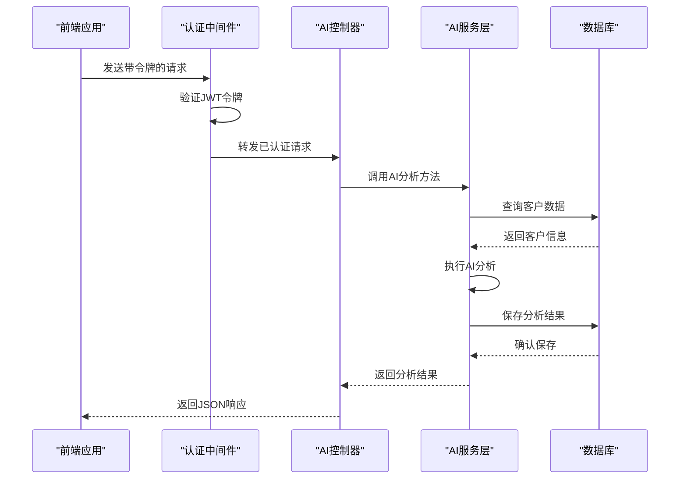
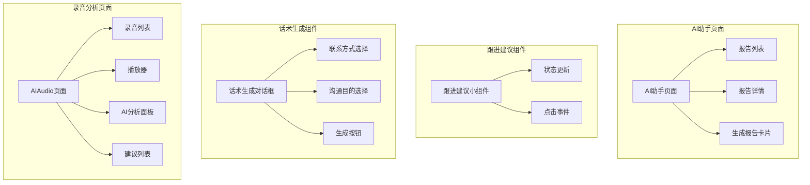

# AI助手

<cite>
**本文档引用的文件**
- [app.ts](file://crm-backend/src/app.ts)
- [ai.controller.ts](file://crm-backend/src/controllers/ai.controller.ts)
- [ai.service.ts](file://crm-backend/src/services/ai.service.ts)
- [ai.routes.ts](file://crm-backend/src/routes/ai.routes.ts)
- [followUpAnalysis.ts](file://crm-backend/src/services/ai/followUpAnalysis.ts)
- [reportGeneration.ts](file://crm-backend/src/services/ai/reportGeneration.ts)
- [types.ts](file://crm-backend/src/services/ai/types.ts)
- [auth.ts](file://crm-backend/src/middlewares/auth.ts)
- [schema.prisma](file://crm-backend/prisma/schema.prisma)
- [package.json](file://crm-backend/package.json)
- [FollowUpWidget.tsx](file://crm-frontend/src/components/AI/FollowUpWidget.tsx)
- [ScriptGenerator.tsx](file://crm-frontend/src/components/AI/ScriptGenerator.tsx)
- [AIAssistant/index.tsx](file://crm-frontend/src/pages/AIAssistant/index.tsx)
- [AIAudio/index.tsx](file://crm-frontend/src/pages/AIAudio/index.tsx)
- [package.json](file://crm-frontend/package.json)
</cite>

## 目录
1. [简介](#简介)
2. [项目结构](#项目结构)
3. [核心组件](#核心组件)
4. [架构总览](#架构总览)
5. [详细组件分析](#详细组件分析)
6. [依赖关系分析](#依赖关系分析)
7. [性能考虑](#性能考虑)
8. [故障排除指南](#故障排除指南)
9. [结论](#结论)

## 简介
本项目是一个基于AI的销售CRM系统，重点实现了智能AI助手功能，包括：
- 跟进建议生成：基于客户互动数据自动分析并生成跟进策略
- 话术生成：根据不同场景自动生成销售沟通话术
- 智能报告：自动生成日报/周报，包含重点事项、风险提示和下一步行动
- 录音AI分析：对通话录音进行情感分析、关键词提取和行动建议生成
- 陌生拜访助手：基于企业信息生成销售话术和建议

系统采用前后端分离架构，后端使用Node.js + Express + Prisma，前端使用React + TypeScript。

## 项目结构
项目采用标准的前后端分离架构，包含以下主要目录：



**图表来源**
- [app.ts:1-88](file://crm-backend/src/app.ts#L1-L88)
- [schema.prisma:1-709](file://crm-backend/prisma/schema.prisma#L1-L709)

**章节来源**
- [app.ts:1-88](file://crm-backend/src/app.ts#L1-L88)
- [package.json:1-52](file://crm-backend/package.json#L1-L52)

## 核心组件
系统的核心AI助手功能由以下关键组件构成：

### 后端核心组件
1. **AI控制器 (ai.controller.ts)**：处理所有AI相关的HTTP请求
2. **AI服务层**：封装AI分析逻辑，支持模拟和真实API调用
3. **路由层 (ai.routes.ts)**：定义AI功能的REST API接口
4. **中间件 (auth.ts)**：提供JWT认证和权限控制

### 前端核心组件
1. **AI助手页面**：提供智能报告生成功能
2. **跟进建议小组件**：显示AI生成的跟进建议
3. **话术生成对话框**：生成销售沟通话术
4. **录音分析页面**：处理通话录音的AI分析

**章节来源**
- [ai.controller.ts:1-616](file://crm-backend/src/controllers/ai.controller.ts#L1-L616)
- [ai.service.ts:1-564](file://crm-backend/src/services/ai.service.ts#L1-L564)
- [ai.routes.ts:1-53](file://crm-backend/src/routes/ai.routes.ts#L1-L53)
- [auth.ts:1-69](file://crm-backend/src/middlewares/auth.ts#L1-L69)

## 架构总览
系统采用分层架构设计，确保AI功能的模块化和可扩展性：



**图表来源**
- [app.ts:10-88](file://crm-backend/src/app.ts#L10-L88)
- [ai.controller.ts:6-8](file://crm-backend/src/controllers/ai.controller.ts#L6-L8)
- [ai.service.ts:79-564](file://crm-backend/src/services/ai.service.ts#L79-L564)

## 详细组件分析

### AI服务架构
AI服务采用策略模式，支持模拟和真实AI分析：



**图表来源**
- [ai.service.ts:79-564](file://crm-backend/src/services/ai.service.ts#L79-L564)
- [followUpAnalysis.ts:21-336](file://crm-backend/src/services/ai/followUpAnalysis.ts#L21-L336)
- [reportGeneration.ts:16-301](file://crm-backend/src/services/ai/reportGeneration.ts#L16-L301)

### 数据模型设计
系统使用Prisma定义了完整的AI功能数据模型：



**图表来源**
- [schema.prisma:121-709](file://crm-backend/prisma/schema.prisma#L121-L709)

### API接口设计
AI功能提供了完整的REST API接口：



**图表来源**
- [ai.routes.ts:20-52](file://crm-backend/src/routes/ai.routes.ts#L20-L52)
- [ai.controller.ts:13-191](file://crm-backend/src/controllers/ai.controller.ts#L13-L191)

**章节来源**
- [ai.controller.ts:1-616](file://crm-backend/src/controllers/ai.controller.ts#L1-L616)
- [ai.routes.ts:1-53](file://crm-backend/src/routes/ai.routes.ts#L1-L53)
- [schema.prisma:572-613](file://crm-backend/prisma/schema.prisma#L572-L613)

### 前端组件架构
前端采用组件化设计，提供直观的AI助手界面：



**图表来源**
- [AIAssistant/index.tsx:50-376](file://crm-frontend/src/pages/AIAssistant/index.tsx#L50-L376)
- [FollowUpWidget.tsx:59-208](file://crm-frontend/src/components/AI/FollowUpWidget.tsx#L59-L208)
- [ScriptGenerator.tsx:35-270](file://crm-frontend/src/components/AI/ScriptGenerator.tsx#L35-L270)
- [AIAudio/index.tsx:27-441](file://crm-frontend/src/pages/AIAudio/index.tsx#L27-L441)

**章节来源**
- [FollowUpWidget.tsx:1-208](file://crm-frontend/src/components/AI/FollowUpWidget.tsx#L1-L208)
- [ScriptGenerator.tsx:1-270](file://crm-frontend/src/components/AI/ScriptGenerator.tsx#L1-L270)
- [AIAssistant/index.tsx:1-376](file://crm-frontend/src/pages/AIAssistant/index.tsx#L1-L376)
- [AIAudio/index.tsx:1-441](file://crm-frontend/src/pages/AIAudio/index.tsx#L1-L441)

## 依赖关系分析
系统依赖关系清晰，采用模块化设计：

```mermaid
graph TB
subgraph "后端依赖"
EX[express] --> APP[应用入口]
PRISMA[@prisma/client] --> ORM[ORM层]
JWT[jsonwebtoken] --> AUTH[认证]
SWAGGER[swagger-ui-express] --> DOC[API文档]
HELMET[helmet] --> SEC[安全]
CORS[cors] --> NET[网络]
end
subgraph "AI依赖"
BCRYPT[bcryptjs] --> PASS[密码加密]
UUID[uuid] --> ID[唯一标识]
WINSTON[winston] --> LOG[日志]
MORGAN[morgan] --> LOG
end
subgraph "前端依赖"
REACT[react] --> UI[用户界面]
ROUTER[react-router-dom] --> NAV[导航]
ZUSTAND[zustand] --> STATE[状态管理]
TAILWIND[tailwindcss] --> STYLE[样式]
end
APP --> EX
APP --> PRISMA
APP --> JWT
APP --> SWAGGER
APP --> HELMET
APP --> CORS
```

**图表来源**
- [package.json:17-32](file://crm-backend/package.json#L17-L32)
- [package.json:12-18](file://crm-frontend/package.json#L12-L18)

**章节来源**
- [package.json:1-52](file://crm-backend/package.json#L1-L52)
- [package.json:1-38](file://crm-frontend/package.json#L1-L38)

## 性能考虑
系统在设计时充分考虑了性能优化：

### 缓存策略
- AI分析结果缓存：避免重复计算相同数据
- 前端组件缓存：减少重复渲染
- 数据库查询优化：使用索引和分页

### 并发处理
- Promise并行执行：同时获取多个数据源
- 异步处理：非阻塞的AI分析
- 连接池管理：数据库连接复用

### 资源优化
- 图片懒加载：减少初始加载时间
- 组件按需加载：提高首屏速度
- 压缩传输：减少网络开销

## 故障排除指南
常见问题及解决方案：

### 认证问题
**症状**：401未授权错误
**原因**：JWT令牌无效或过期
**解决方案**：
1. 检查本地存储中的auth_token
2. 确认令牌格式正确（Bearer）
3. 重新登录获取新令牌

### AI服务异常
**症状**：AI分析失败或返回模拟数据
**原因**：真实API配置缺失
**解决方案**：
1. 设置环境变量：TENCENT_SECRET_ID, TENCENT_SECRET_KEY
2. 配置正确的API区域
3. 检查网络连接

### 数据库连接问题
**症状**：查询超时或连接失败
**原因**：数据库配置错误
**解决方案**：
1. 检查DATABASE_URL配置
2. 确认数据库服务运行正常
3. 验证网络连通性

**章节来源**
- [auth.ts:13-33](file://crm-backend/src/middlewares/auth.ts#L13-L33)
- [ai.service.ts:66-73](file://crm-backend/src/services/ai.service.ts#L66-L73)
- [schema.prisma:8-11](file://crm-backend/prisma/schema.prisma#L8-L11)

## 结论
本AI助手系统通过模块化设计和分层架构，成功实现了销售场景下的智能化功能。系统具备以下特点：

### 技术优势
- **模块化设计**：AI功能独立封装，易于维护和扩展
- **双模式支持**：既支持模拟AI分析，又可接入真实AI服务
- **完整生态**：从前端到后端的全栈AI解决方案
- **数据驱动**：基于客户数据的智能分析和建议

### 应用价值
- **提升效率**：自动化生成跟进策略和销售话术
- **降低门槛**：无需专业知识即可使用AI功能
- **数据洞察**：提供深度的客户行为分析
- **流程优化**：标准化销售流程和工作习惯

### 发展方向
1. **AI能力增强**：集成更多AI模型和算法
2. **个性化定制**：支持企业特定的销售流程
3. **多语言支持**：扩展国际化能力
4. **移动端优化**：提供更好的移动用户体验

该系统为销售团队提供了强大的AI助手，能够显著提升销售效率和客户服务质量。