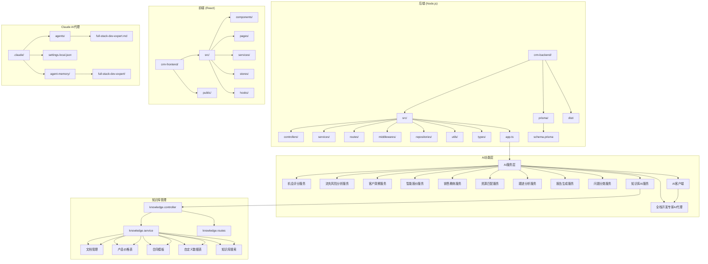
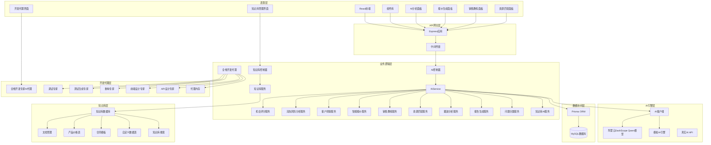
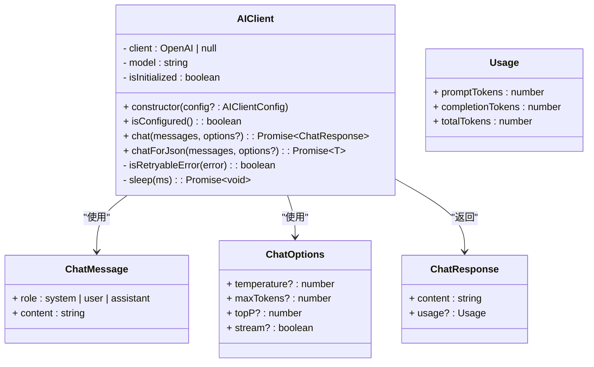
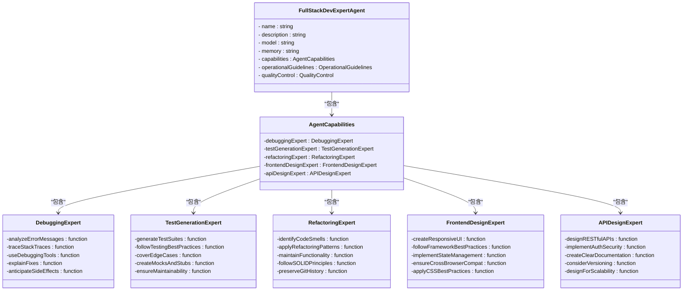
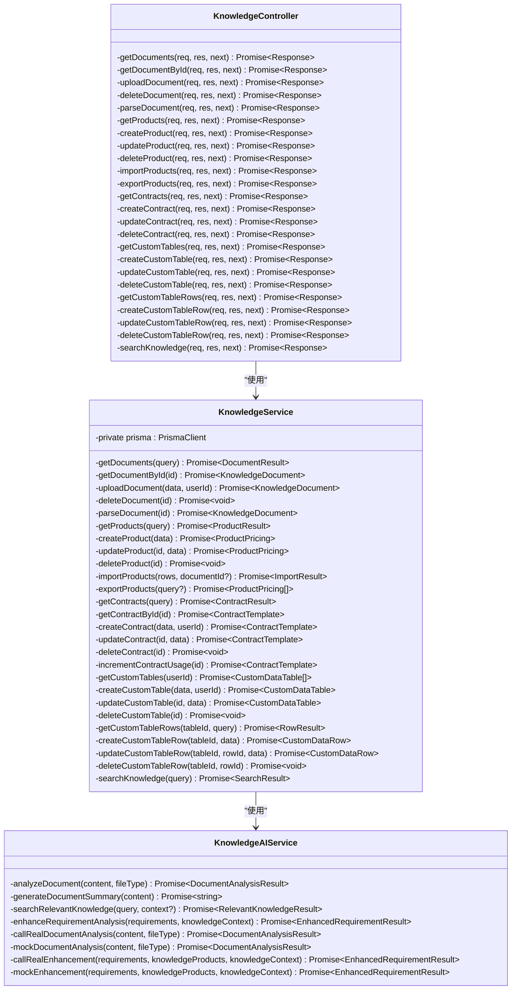
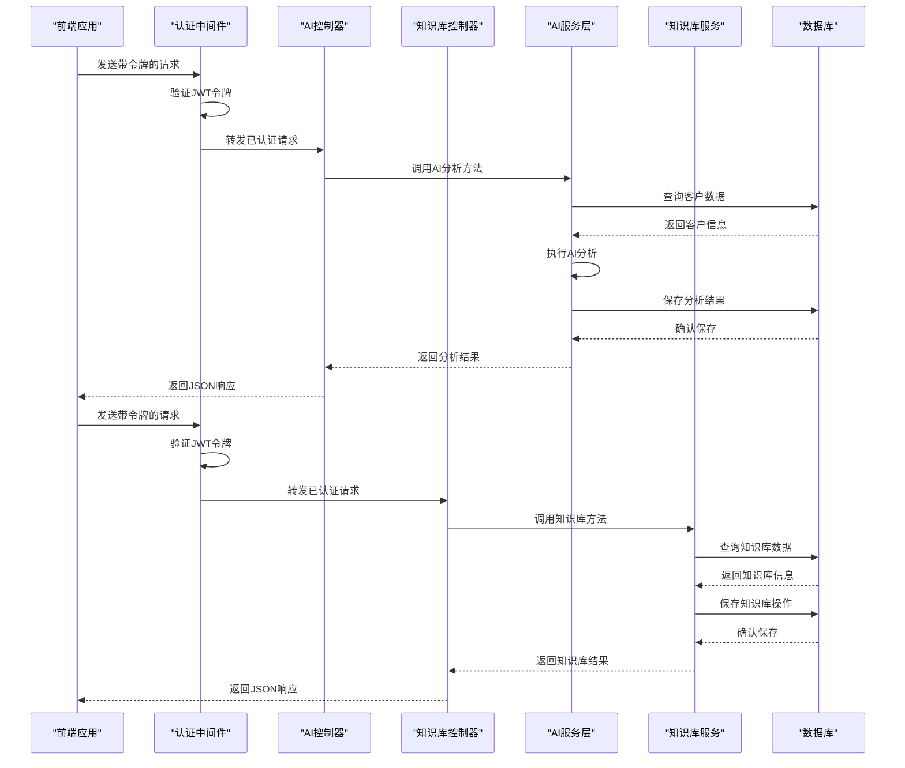
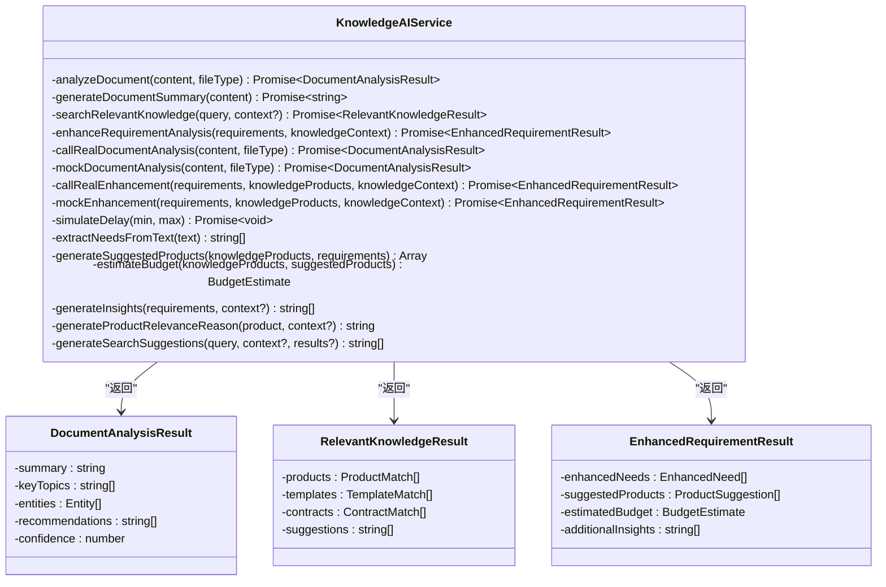

# AI助手

<cite>
**本文档引用的文件**
- [app.ts](file://crm-backend/src/app.ts)
- [ai.controller.ts](file://crm-backend/src/controllers/ai.controller.ts)
- [ai.service.ts](file://crm-backend/src/services/ai.service.ts)
- [ai.routes.ts](file://crm-backend/src/routes/ai.routes.ts)
- [opportunityScoring.ts](file://crm-backend/src/services/ai/opportunityScoring.ts)
- [churnAnalysis.ts](file://crm-backend/src/services/ai/churnAnalysis.ts)
- [proposalAI.ts](file://crm-backend/src/services/ai/proposalAI.ts)
- [salesCoach.ts](file://crm-backend/src/services/ai/salesCoach.ts)
- [resourceMatching.ts](file://crm-backend/src/services/ai/resourceMatching.ts)
- [types.ts](file://crm-backend/src/services/ai/types.ts)
- [index.ts](file://crm-backend/src/services/ai/index.ts)
- [auth.ts](file://crm-backend/src/middlewares/auth.ts)
- [schema.prisma](file://crm-backend/prisma/schema.prisma)
- [migration.sql](file://crm-backend/prisma/migrations/20260317020137_add_ai_features/migration.sql)
- [migration.sql](file://crm-backend/prisma/migrations/20260317051358_add_sales_performance_and_coaching/migration.sql)
- [migration.sql](file://crm-backend/prisma/migrations/20260328042234_add_knowledge_base/migration.sql)
- [package.json](file://crm-backend/package.json)
- [OpportunityScoreCard.tsx](file://crm-frontend/src/components/AI/OpportunityScoreCard.tsx)
- [ChurnAlertCard.tsx](file://crm-frontend/src/components/AI/ChurnAlertCard.tsx)
- [CustomerInsightPanel.tsx](file://crm-frontend/src/components/AI/CustomerInsightPanel.tsx)
- [AIAssistant/index.tsx](file://crm-frontend/src/pages/AIAssistant/index.tsx)
- [AIAudio/index.tsx](file://crm-frontend/src/pages/AIAudio/index.tsx)
- [package.json](file://crm-frontend/package.json)
- [.env](file://crm-backend/.env)
- [.env](file://crm-frontend/.env)
- [aiService.ts](file://crm-frontend/src/services/aiService.ts)
- [api.ts](file://crm-frontend/src/services/api.ts)
- [client.ts](file://crm-backend/src/services/ai/client.ts)
- [followUpAnalysis.ts](file://crm-backend/src/services/ai/followUpAnalysis.ts)
- [reportGeneration.ts](file://crm-backend/src/services/ai/reportGeneration.ts)
- [customerInsight.ts](file://crm-backend/src/services/ai/customerInsight.ts)
- [questionClassification.service.ts](file://crm-backend/src/services/ai/questionClassification.service.ts)
- [knowledgeAI.ts](file://crm-backend/src/services/ai/knowledgeAI.ts)
- [knowledge.controller.ts](file://crm-backend/src/controllers/knowledge.controller.ts)
- [knowledge.routes.ts](file://crm-backend/src/routes/knowledge.routes.ts)
- [knowledge.service.ts](file://crm-backend/src/services/knowledge.service.ts)
- [knowledge.validator.ts](file://crm-backend/src/validators/knowledge.validator.ts)
- [full-stack-dev-expert.md](file://.claude/agents/full-stack-dev-expert.md)
- [settings.local.json](file://.claude/settings.local.json)
</cite>

## 更新摘要
**所做更改**
- 新增知识库AI集成，扩展了AI服务能力，包括文档分析、语义搜索、需求增强等AI功能
- 新增企业知识库管理功能，支持文档上传、解析、搜索和管理
- 新增产品价格表、合同模板、自定义数据表等知识库组件
- 新增知识库AI服务，提供智能文档分析和知识检索能力
- 更新AI功能架构，扩展为包含知识库管理的完整生态系统

## 目录
1. [简介](#简介)
2. [项目结构](#项目结构)
3. [核心组件](#核心组件)
4. [架构总览](#架构总览)
5. [详细组件分析](#详细组件分析)
6. [新增AI功能详解](#新增ai功能详解)
7. [前端组件架构](#前端组件架构)
8. [API基础URL配置](#api基础url配置)
9. [依赖关系分析](#依赖关系分析)
10. [性能考虑](#性能考虑)
11. [故障排除指南](#故障排除指南)
12. [结论](#结论)

## 简介
本项目是一个基于AI的销售CRM系统，现已发展为完整的AI助手生态系统，重点实现了智能AI助手功能，包括：
- **机会评分系统**：基于BANT模型的综合评分和成交概率预测
- **客户流失风险分析系统**：多维度风险评估和挽回建议生成
- **智能客户洞察生成系统**：深度客户画像和需求分析
- **智能报价与提案生成系统**：基于客户信息的智能报价和完整商务方案生成
- **销售绩效AI教练系统**：个性化销售培训和改进建议
- **售前资源智能匹配系统**：多维度资源匹配和最优分配
- **跟进建议生成**：基于客户互动数据自动分析并生成跟进策略
- **话术生成**：根据不同场景自动生成销售沟通话术
- **智能报告**：自动生成日报/周报，包含重点事项、风险提示和下一步行动
- **录音AI分析**：对通话录音进行情感分析、关键词提取和行动建议生成
- **陌生拜访助手**：基于企业信息生成销售话术和建议
- **问题分类系统**：基于AI的客户问题智能分类和趋势分析
- **阿里云DashScope Qwen模型集成**：完整的AI客户端基础设施和统一的AI服务层架构
- **全栈开发专家AI代理**：整合调试、测试生成、代码重构、前端设计和API设计五大专业领域的开发辅助
- **企业知识库AI集成**：新增的知识库AI服务能力，包括文档分析、语义搜索、需求增强等功能

系统采用前后端分离架构，后端使用Node.js + Express + Prisma，前端使用React + TypeScript，现已发展为功能完备的AI销售助手平台，同时集成了专业的软件开发辅助AI代理和企业知识库管理功能。

## 项目结构
项目采用标准的前后端分离架构，现已扩展为多层AI分析架构，并新增了全栈开发专家AI代理和企业知识库管理：



**图表来源**
- [app.ts:1-88](file://crm-backend/src/app.ts#L1-L88)
- [schema.prisma:1-783](file://crm-backend/prisma/schema.prisma#L1-L783)
- [index.ts:1-57](file://crm-backend/src/services/ai/index.ts#L1-L57)
- [client.ts:1-224](file://crm-backend/src/services/ai/client.ts#L1-L224)
- [knowledgeAI.ts:1-554](file://crm-backend/src/services/ai/knowledgeAI.ts#L1-L554)
- [knowledge.controller.ts:1-509](file://crm-backend/src/controllers/knowledge.controller.ts#L1-L509)
- [knowledge.service.ts:1-693](file://crm-backend/src/services/knowledge.service.ts#L1-L693)
- [knowledge.routes.ts:1-512](file://crm-backend/src/routes/knowledge.routes.ts#L1-L512)
- [full-stack-dev-expert.md:1-109](file://.claude/agents/full-stack-dev-expert.md#L1-L109)

**章节来源**
- [app.ts:1-88](file://crm-backend/src/app.ts#L1-L88)
- [package.json:1-52](file://crm-backend/package.json#L1-L52)

## 核心组件
系统的AI助手功能现已扩展为多层次的专业分析组件，并新增了全栈开发专家AI代理和企业知识库管理功能：

### 后端核心组件
1. **AI控制器 (ai.controller.ts)**：处理所有AI相关的HTTP请求
2. **AI服务层**：封装AI分析逻辑，支持模拟和真实API调用
3. **AI客户端 (client.ts)**：基于OpenAI兼容接口封装阿里云DashScope Qwen模型
4. **路由层 (ai.routes.ts)**：定义AI功能的REST API接口
5. **中间件 (auth.ts)**：提供JWT认证和权限控制
6. **AI服务模块 (ai/index.ts)**：统一管理所有AI服务

### 新增AI分析服务
1. **机会评分服务 (opportunityScoring.ts)**：基于BANT模型的综合评分
2. **流失风险分析服务 (churnAnalysis.ts)**：多维度客户流失风险评估
3. **智能报价服务 (proposalAI.ts)**：基于客户信息的智能报价和方案生成
4. **销售教练服务 (salesCoach.ts)**：个性化销售培训和改进建议
5. **资源匹配服务 (resourceMatching.ts)**：多维度资源匹配和最优分配
6. **客户洞察服务 (customerInsight.ts)**：深度客户画像分析
7. **跟进分析服务 (followUpAnalysis.ts)**：基于客户互动数据的跟进建议生成
8. **报告生成服务 (reportGeneration.ts)**：自动生成日报/周报
9. **问题分类服务 (questionClassification.service.ts)**：AI驱动的问题智能分类
10. **知识库AI服务 (knowledgeAI.ts)**：新增的企业知识库AI服务能力

### 新增全栈开发专家AI代理
1. **调试专家**：系统性诊断和修复代码问题
2. **测试生成专家**：生成全面的测试套件
3. **重构专家**：安全地应用重构模式
4. **前端设计专家**：创建响应式和高性能UI组件
5. **API设计专家**：设计符合行业标准的API

### 新增企业知识库管理
1. **知识库控制器 (knowledge.controller.ts)**：处理知识库相关的HTTP请求
2. **知识库服务 (knowledge.service.ts)**：封装知识库业务逻辑
3. **知识库路由 (knowledge.routes.ts)**：定义知识库功能的REST API接口
4. **知识库验证器 (knowledge.validator.ts)**：提供知识库数据验证

### 前端核心组件
1. **AI助手页面**：提供智能报告生成功能
2. **机会评分卡片**：展示综合评分和各维度分析
3. **流失预警卡片**：显示风险评分和预警信息
4. **客户洞察面板**：呈现客户画像和需求分析
5. **智能报价面板**：展示报价建议和方案生成
6. **销售教练面板**：提供个性化改进建议
7. **资源匹配面板**：显示资源匹配结果和分配建议
8. **录音分析页面**：处理通话录音的AI分析
9. **知识库页面**：提供企业知识库管理界面

**章节来源**
- [ai.controller.ts:1-800](file://crm-backend/src/controllers/ai.controller.ts#L1-L800)
- [ai.service.ts:1-699](file://crm-backend/src/services/ai.service.ts#L1-L699)
- [ai.routes.ts:1-98](file://crm-backend/src/routes/ai.routes.ts#L1-L98)
- [opportunityScoring.ts:1-613](file://crm-backend/src/services/ai/opportunityScoring.ts#L1-L613)
- [churnAnalysis.ts:1-517](file://crm-backend/src/services/ai/churnAnalysis.ts#L1-L517)
- [proposalAI.ts:1-599](file://crm-backend/src/services/ai/proposalAI.ts#L1-L599)
- [salesCoach.ts:1-780](file://crm-backend/src/services/ai/salesCoach.ts#L1-L780)
- [resourceMatching.ts:1-692](file://crm-backend/src/services/ai/resourceMatching.ts#L1-L692)
- [types.ts:124-276](file://crm-backend/src/services/ai/types.ts#L124-L276)
- [auth.ts:1-69](file://crm-backend/src/middlewares/auth.ts#L1-L69)
- [client.ts:1-224](file://crm-backend/src/services/ai/client.ts#L1-L224)
- [followUpAnalysis.ts:1-480](file://crm-backend/src/services/ai/followUpAnalysis.ts#L1-L480)
- [reportGeneration.ts:1-379](file://crm-backend/src/services/ai/reportGeneration.ts#L1-L379)
- [customerInsight.ts:1-548](file://crm-backend/src/services/ai/customerInsight.ts#L1-L548)
- [questionClassification.service.ts:1-372](file://crm-backend/src/services/ai/questionClassification.service.ts#L1-L372)
- [knowledgeAI.ts:1-554](file://crm-backend/src/services/ai/knowledgeAI.ts#L1-L554)
- [knowledge.controller.ts:1-509](file://crm-backend/src/controllers/knowledge.controller.ts#L1-L509)
- [knowledge.service.ts:1-693](file://crm-backend/src/services/knowledge.service.ts#L1-L693)
- [knowledge.routes.ts:1-512](file://crm-backend/src/routes/knowledge.routes.ts#L1-L512)

## 架构总览
系统采用分层架构设计，现已扩展为多层AI分析架构，并集成了全栈开发专家AI代理和企业知识库管理功能：



**图表来源**
- [app.ts:10-88](file://crm-backend/src/app.ts#L10-L88)
- [ai.controller.ts:6-8](file://crm-backend/src/controllers/ai.controller.ts#L6-L8)
- [ai.service.ts:79-699](file://crm-backend/src/services/ai.service.ts#L79-L699)
- [index.ts:37-55](file://crm-backend/src/services/ai/index.ts#L37-L55)
- [client.ts:50-224](file://crm-backend/src/services/ai/client.ts#L50-L224)
- [knowledgeAI.ts:18-554](file://crm-backend/src/services/ai/knowledgeAI.ts#L18-L554)
- [knowledge.controller.ts:11-509](file://crm-backend/src/controllers/knowledge.controller.ts#L11-L509)
- [knowledge.service.ts:21-693](file://crm-backend/src/services/knowledge.service.ts#L21-L693)
- [full-stack-dev-expert.md:8-74](file://.claude/agents/full-stack-dev-expert.md#L8-L74)

## 详细组件分析

### AI客户端基础设施
AI客户端采用统一的基础设施设计，现已集成阿里云DashScope Qwen模型：



**图表来源**
- [client.ts:50-224](file://crm-backend/src/services/ai/client.ts#L50-L224)

### AI服务架构
AI服务采用策略模式，现已扩展为多服务架构：

```mermaid
classDiagram
class AIService {
-AI_CONFIG : object
+analyzeRecording(audioUrl, duration, customerInfo) Promise~AIAnalysisResult~
+analyzeCompany(companyName, imageUrl) Promise~CompanyIntelligenceResult~
+transcribeAudio(audioUrl) Promise~string~
+analyzeSentiment(text) Promise~SentimentType~
+extractKeywords(text) Promise~string[]~
+generateSummary(text, keywords) Promise~string~
-callRealAnalysis(duration, customerInfo) Promise~AIAnalysisResult~
-mockAnalysis(duration, customerInfo) Promise~AIAnalysisResult~
-generateMockResult(duration, customerInfo) AIAnalysisResult
}
class OpportunityScoringService {
-SCORING_WEIGHTS : object
+analyzeOpportunity(input) Promise~OpportunityScoringResult~
+predictWinProbability(input) Promise~WinProbabilityResult~
-calculateEngagementScore(input) number
-calculateBudgetScore(input) number
-calculateAuthorityScore(input) number
-calculateNeedScore(input) number
-calculateTimingScore(input) number
-generateFactors(input, scores) Factors[]
-generateRecommendations(input, scores, risks) Recommendations[]
}
class ChurnAnalysisService {
-RISK_WEIGHTS : object
-RISK_THRESHOLDS : object
+analyzeChurnRisk(input) Promise~ChurnAnalysisResult~
-calculateRiskFactors(input) RiskFactors
-calculateLastContactRisk(input) number
-calculateCommunicationTrendRisk(input) number
-calculateSentimentTrendRisk(input) number
-calculateOpportunityStagnationRisk(input) number
-calculateTaskCompletionRisk(input) number
-calculateContactActivityRisk(input) number
-generateReasons(input, factors) Reasons[]
-generateRetentionSuggestions(input, level, factors, reasons) Suggestions[]
}
class ProposalAIService {
-INDUSTRY_PRICING_BENCHMARKS : object
-PRODUCT_RECOMMENDATIONS : object
+generateSmartQuotation(input) Promise~SmartQuotationResult~
+generateProposalContent(input) Promise~ProposalGenerationResult~
-analyzePricingFactors(input, benchmark) PricingFactors[]
-calculateBasePrice(input) number
-calculateDiscountStrategy(input, price, benchmark) DiscountStrategy
-generatePricingRecommendations(input, price, discount) Recommendation[]
}
class SalesCoachService {
-INDUSTRY_BENCHMARKS : object
-SKILL_STANDARDS : object
+analyzePerformance(input) Promise~PerformanceAnalysisResult~
+generateCoachingSuggestions(input) Promise~CoachingSuggestionResult~
+identifySkillGaps(performanceAnalysis, skillAssessment) Promise~SkillGapAnalysisResult~
-predictPerformanceTrend(historicalData) Promise~PredictionResult~
-generateSuggestions(input) Suggestions[]
-generateWeeklyPlan(input) WeeklyPlan[]
-generateMotivationMessage(input) string
}
class ResourceMatchingService {
-MATCH_WEIGHTS : object
-RECOMMENDATION_THRESHOLDS : object
-SKILL_IMPORTANCE_LEVELS : object
+matchResources(input, availableResources) Promise~ResourceMatchingResult~
+generateAssignmentRecommendation(input) Promise~AssignmentRecommendationResult~
-optimizeResourceAllocation(requests, resources) Promise~AssignmentResult[]~
-calculateMatchScore(input, resource) MatchResult
-generateMatchingRecommendations(input, matches) string[]
}
class CustomerInsightService {
-CONFIDENCE_THRESHOLDS : object
+extractCustomerInsights(input) Promise~CustomerInsightResult~
-extractNeeds(input) Needs[]
-extractBudget(input) BudgetInfo
-analyzeDecisionMakers(input) DecisionMakers[]
-analyzePainPoints(input) PainPoints[]
-analyzeCompetitorInfo(input) CompetitorInfo[]
-generateTimeline(input) Timeline
}
class FollowUpAnalysisService {
+analyzeFollowUpTiming(input) Promise~FollowUpSuggestionResult~
+generateScript(input) Promise~ScriptGenerationResult~
-private callRealAnalysis(input) Promise~FollowUpSuggestionResult~
-private callRealScriptGeneration(input) Promise~ScriptGenerationResult~
-private mockAnalysis(input) Promise~FollowUpSuggestionResult~
-private mockScriptGeneration(input) Promise~ScriptGenerationResult~
}
class ReportGenerationService {
+generateReport(input) Promise~DailyReportResult~
-private callRealGeneration(input) Promise~DailyReportResult~
-private mockGeneration(input) Promise~DailyReportResult~
}
class QuestionClassificationService {
+classifyQuestion(question) Promise~QuestionClassification~
+classifyQuestions(questions) Promise~BatchClassificationResult[]~
+summarizeQuestions(questions) Promise~string~
+suggestAnswer(question, category, context?) Promise~string~
+analyzeTrends(questions) Promise~TrendAnalysis~
}
class KnowledgeAIService {
+analyzeDocument(content, fileType) Promise~DocumentAnalysisResult~
+generateDocumentSummary(content) Promise~string~
+searchRelevantKnowledge(query, context?) Promise~RelevantKnowledgeResult~
+enhanceRequirementAnalysis(requirements, knowledgeContext) Promise~EnhancedRequirementResult~
-private callRealDocumentAnalysis(content, fileType) Promise~DocumentAnalysisResult~
-private mockDocumentAnalysis(content, fileType) Promise~DocumentAnalysisResult~
-private callRealEnhancement(requirements, knowledgeProducts, knowledgeContext) Promise~EnhancedRequirementResult~
-private mockEnhancement(requirements, knowledgeProducts, knowledgeContext) Promise~EnhancedRequirementResult~
}
AIService --> OpportunityScoringService : "使用"
AIService --> ChurnAnalysisService : "使用"
AIService --> ProposalAIService : "使用"
AIService --> SalesCoachService : "使用"
AIService --> ResourceMatchingService : "使用"
AIService --> CustomerInsightService : "使用"
AIService --> FollowUpAnalysisService : "使用"
AIService --> ReportGenerationService : "使用"
AIService --> QuestionClassificationService : "使用"
AIService --> KnowledgeAIService : "使用"
```



**图表来源**
- [ai.service.ts:79-699](file://crm-backend/src/services/ai.service.ts#L79-L699)
- [opportunityScoring.ts:42-105](file://crm-backend/src/services/ai/opportunityScoring.ts#L42-L105)
- [churnAnalysis.ts:28-65](file://crm-backend/src/services/ai/churnAnalysis.ts#L28-L65)
- [proposalAI.ts:53-106](file://crm-backend/src/services/ai/proposalAI.ts#L53-L106)
- [salesCoach.ts:51-82](file://crm-backend/src/services/ai/salesCoach.ts#L51-L82)
- [resourceMatching.ts:44-92](file://crm-backend/src/services/ai/resourceMatching.ts#L44-L92)
- [types.ts:219-276](file://crm-backend/src/services/ai/types.ts#L219-L276)
- [followUpAnalysis.ts:22-480](file://crm-backend/src/services/ai/followUpAnalysis.ts#L22-L480)
- [reportGeneration.ts:17-379](file://crm-backend/src/services/ai/reportGeneration.ts#L17-L379)
- [questionClassification.service.ts:25-372](file://crm-backend/src/services/ai/questionClassification.service.ts#L25-L372)
- [knowledgeAI.ts:18-554](file://crm-backend/src/services/ai/knowledgeAI.ts#L18-L554)

### 全栈开发专家AI代理
新增的全栈开发专家AI代理整合了五大专业领域的开发能力：



**图表来源**
- [full-stack-dev-expert.md:8-74](file://.claude/agents/full-stack-dev-expert.md#L8-L74)

### 企业知识库架构
新增的企业知识库管理功能提供了完整的知识资产管理能力：



**图表来源**
- [knowledge.controller.ts:11-509](file://crm-backend/src/controllers/knowledge.controller.ts#L11-L509)
- [knowledge.service.ts:21-693](file://crm-backend/src/services/knowledge.service.ts#L21-L693)
- [knowledgeAI.ts:18-554](file://crm-backend/src/services/ai/knowledgeAI.ts#L18-L554)

### 数据模型设计
系统使用Prisma定义了完整的AI功能数据模型，现已扩展包括企业知识库：

```mermaid
erDiagram
USER ||--o{ CUSTOMER : "拥有"
USER ||--o{ AUDIO_RECORDING : "创建"
USER ||--o{ DAILY_REPORT : "生成"
USER ||--o{ CHURN_ALERT : "创建"
USER ||--o{ OPPORTUNITY_SCORE : "计算"
USER ||--o{ SALES_PERFORMANCE : "记录"
USER ||--o{ COACHING_SUGGESTION : "生成"
USER ||--o{ FOLLOW_UP_SUGGESTION : "生成"
CUSTOMER ||--o{ AUDIO_RECORDING : "拥有"
CUSTOMER ||--o{ FOLLOW_UP_SUGGESTION : "产生"
CUSTOMER ||--o{ CONTACT : "包含"
CUSTOMER ||--o{ CHURN_ALERT : "产生"
CUSTOMER ||--o{ CUSTOMER_INSIGHT : "产生"
CUSTOMER ||--o{ PRE_SALES_REQUEST : "发起"
AUDIO_RECORDING ||--|| SENTIMENT : "情感分析"
AUDIO_RECORDING ||--|| TASK : "触发行动"
FOLLOW_UP_SUGGESTION ||--|| CUSTOMER : "关联"
DAILY_REPORT ||--|| USER : "属于"
CHURN_ALERT ||--|| CUSTOMER : "关联"
OPPORTUNITY_SCORE ||--|| CUSTOMER : "关联"
CUSTOMER_INSIGHT ||--|| CUSTOMER : "关联"
SALES_PERFORMANCE ||--|| USER : "记录"
COACHING_SUGGESTION ||--|| USER : "生成"
PRE_SALES_REQUEST ||--|| CUSTOMER : "关联"
PRE_SALES_RESOURCE ||--o{ RESOURCE_MATCH_RECORD : "被匹配"
RESOURCE_MATCH_RECORD ||--|| PRE_SALES_REQUEST : "记录"
RESOURCE_MATCH_RECORD ||--|| PRE_SALES_RESOURCE : "匹配"
FOLLOW_UP_SUGGESTION ||--|| USER : "生成"
DAILY_REPORT ||--|| USER : "生成"
CHURN_ALERT ||--|| USER : "生成"
OPPORTUNITY_SCORE ||--|| USER : "生成"
CUSTOMER_INSIGHT ||--|| USER : "生成"
PRE_SALES_REQUEST ||--|| USER : "生成"
PRE_SALES_RESOURCE ||--|| USER : "生成"
KNOWLEDGE_DOCUMENT ||--o{ PRODUCT_PRICING : "关联"
KNOWLEDGE_DOCUMENT ||--o{ CUSTOM_DATA_ROW : "关联"
CONTRACT_TEMPLATE ||--|| USER : "创建"
PRODUCT_PRICING ||--|| USER : "创建"
CUSTOM_DATA_TABLE ||--|| USER : "创建"
CUSTOM_DATA_TABLE ||--o{ CUSTOM_DATA_ROW : "包含"
CUSTOM_DATA_ROW ||--|| CUSTOM_DATA_TABLE : "属于"
note for USER "用户表<br/>包含认证信息和角色"
note for CUSTOMER "客户表<br/>包含客户基本信息和AI字段"
note for AUDIO_RECORDING "录音表<br/>存储通话录音和分析结果"
note for FOLLOW_UP_SUGGESTION "跟进建议表<br/>AI生成的跟进策略"
note for DAILY_REPORT "日报表<br/>智能报告内容"
note for CHURN_ALERT "流失预警表<br/>客户流失风险分析"
note for OPPORTUNITY_SCORE "商机评分表<br/>BANT模型评分结果"
note for CUSTOMER_INSIGHT "客户洞察表<br/>深度客户画像分析"
note for SALES_PERFORMANCE "销售绩效表<br/>销售表现记录"
note for COACHING_SUGGESTION "教练建议表<br/>AI生成的改进建议"
note for PRE_SALES_REQUEST "售前需求表<br/>售前资源需求"
note for PRE_SALES_RESOURCE "售前资源表<br/>售前技术支持人员"
note for RESOURCE_MATCH_RECORD "资源匹配记录表<br/>资源匹配结果"
note for KNOWLEDGE_DOCUMENT "知识库文档表<br/>企业知识文档"
note for PRODUCT_PRICING "产品价格表<br/>产品定价信息"
note for CONTRACT_TEMPLATE "合同模板表<br/>合同模板库"
note for CUSTOM_DATA_TABLE "自定义数据表<br/>灵活的数据表格"
note for CUSTOM_DATA_ROW "自定义数据行<br/>表格中的具体数据"
```



**图表来源**
- [schema.prisma:572-613](file://crm-backend/prisma/schema.prisma#L572-L613)

### API接口设计
AI功能和知识库功能提供了完整的REST API接口，现已扩展为多服务架构：



**图表来源**
- [ai.routes.ts:32-98](file://crm-backend/src/routes/ai.routes.ts#L32-L98)
- [ai.controller.ts:13-191](file://crm-backend/src/controllers/ai.controller.ts#L13-L191)
- [knowledge.routes.ts:106-512](file://crm-backend/src/routes/knowledge.routes.ts#L106-L512)
- [knowledge.controller.ts:18-509](file://crm-backend/src/controllers/knowledge.controller.ts#L18-L509)

**章节来源**
- [ai.controller.ts:1-800](file://crm-backend/src/controllers/ai.controller.ts#L1-L800)
- [ai.routes.ts:1-98](file://crm-backend/src/routes/ai.routes.ts#L1-L98)
- [knowledge.controller.ts:1-509](file://crm-backend/src/controllers/knowledge.controller.ts#L1-L509)
- [knowledge.routes.ts:1-512](file://crm-backend/src/routes/knowledge.routes.ts#L1-L512)
- [schema.prisma:572-613](file://crm-backend/prisma/schema.prisma#L572-L613)

## 新增AI功能详解

### 企业知识库AI集成
新增的企业知识库AI集成为系统提供了完整的知识资产管理能力，包括文档分析、语义搜索、需求增强等功能：

#### 知识库AI服务架构
知识库AI服务采用模块化设计，提供多种AI分析能力：



**图表来源**
- [knowledgeAI.ts:18-554](file://crm-backend/src/services/ai/knowledgeAI.ts#L18-L554)
- [types.ts:661-684](file://crm-backend/src/services/ai/types.ts#L661-L684)

#### 文档分析功能
知识库AI服务提供了强大的文档分析能力，支持多种文件类型的智能分析：

**文件类型支持**：
- **Excel/CSV文件**：自动识别数据表格，提取结构化数据
- **PDF文件**：提取文本内容，识别合同文档特征
- **Word文档**：提取格式化文本，识别模板文档
- **通用文件**：提供基础的文档分析能力

**分析能力**：
- **摘要生成**：自动生成200字以内的文档摘要
- **关键主题提取**：识别文档的核心主题和要点
- **实体识别**：提取文档中的关键实体和相关信息
- **建议生成**：基于文档内容提供使用建议
- **置信度评估**：提供分析结果的可信度评分

#### 知识库搜索功能
基于知识库内容的智能搜索功能，提供语义级别的知识检索：

**搜索范围**：
- **文档搜索**：搜索知识库中的各类文档
- **产品搜索**：搜索产品价格表中的产品信息
- **合同模板搜索**：搜索合同模板库中的模板

**搜索算法**：
- **全文检索**：支持标题、描述、内容的全文搜索
- **相关度排序**：基于内容相似度进行相关度排序
- **类型过滤**：支持按文档类型进行过滤
- **分页查询**：支持大数据量的分页检索

#### 需求增强功能
基于知识库数据的智能需求分析和增强：

**增强能力**：
- **需求识别**：从客户描述中提取关键需求
- **优先级评估**：对需求进行优先级排序
- **产品建议**：基于产品库推荐合适的解决方案
- **预算估算**：提供合理的预算范围和估算
- **额外洞察**：提供专业的业务洞察和建议

**知识库集成**：
- **产品数据集成**：实时获取产品价格和规格信息
- **行业背景分析**：结合客户行业背景提供定制化建议
- **历史数据利用**：利用历史销售数据提供参考

#### 知识库管理功能
企业知识库管理提供了完整的知识资产管理能力：

**文档管理**：
- **多格式支持**：支持PDF、Word、Excel、PPT等多种文件格式
- **分类管理**：支持产品文档、销售资料、技术文档等分类
- **标签系统**：支持多标签管理，便于检索和分类
- **版本控制**：支持文档版本管理和历史追踪

**产品价格表**：
- **批量导入**：支持Excel/CSV批量导入产品信息
- **价格管理**：支持产品价格、规格、折扣等信息管理
- **导出功能**：支持Excel格式导出产品数据
- **搜索过滤**：支持按分类、价格区间等条件搜索

**合同模板库**：
- **模板管理**：支持合同模板的创建、编辑、删除
- **变量系统**：支持模板变量定义和填充
- **使用统计**：统计模板使用频率和效果
- **版本管理**：支持模板版本管理和更新

**自定义数据表**：
- **灵活配置**：支持自定义字段类型和约束
- **数据行管理**：支持数据行的增删改查操作
- **搜索功能**：支持JSON字段的搜索和过滤
- **权限控制**：支持按用户权限控制数据访问

**章节来源**
- [knowledgeAI.ts:1-554](file://crm-backend/src/services/ai/knowledgeAI.ts#L1-L554)
- [knowledge.controller.ts:1-509](file://crm-backend/src/controllers/knowledge.controller.ts#L1-L509)
- [knowledge.service.ts:1-693](file://crm-backend/src/services/knowledge.service.ts#L1-L693)
- [knowledge.routes.ts:1-512](file://crm-backend/src/routes/knowledge.routes.ts#L1-L512)
- [knowledge.validator.ts:1-206](file://crm-backend/src/validators/knowledge.validator.ts#L1-L206)
- [types.ts:661-684](file://crm-backend/src/services/ai/types.ts#L661-L684)

### 全栈开发专家AI代理配置
新增的全栈开发专家AI代理整合了调试、测试生成、代码重构、前端设计和API设计五大专业领域的开发能力：

#### 代理配置
- **代理名称**：full-stack-dev-expert
- **描述**：当需要在调试、测试生成、代码重构、前端设计或API设计方面获得全面的软件开发辅助时使用此代理
- **模型**：sonnet
- **内存**：project（项目级持久化记忆）

#### 核心能力模块
1. **调试专家 (Debugging Expert)**
   - 系统性诊断和修复代码问题
   - 分析错误消息、堆栈跟踪和日志以识别根本原因
   - 使用适合技术栈的调试工具和技术
   - 提供清晰的解释说明问题所在以及修复为何有效
   - 预测修复的潜在副作用

2. **测试生成专家 (Test Generation Expert)**
   - 生成全面的测试套件，包括单元测试、集成测试和端到端测试
   - 遵循测试最佳实践：AAA模式、描述性命名、隔离原则
   - 覆盖边界值、错误条件和边缘情况
   - 适当创建模拟和桩程序进行单元测试
   - 确保测试的可维护性和提供清晰的失败信息

3. **重构专家 (Refactoring Expert)**
   - 系统性识别代码异味和技术债务
   - 安全地应用重构模式，风险最小化
   - 在改善代码质量的同时保持功能不变
   - 遵循SOLID原则和设计模式
   - 在建议大规模重构时考虑保留git历史

4. **前端设计专家 (Frontend Design Expert)**
   - 创建响应式、可访问且高性能的UI组件
   - 遵循现代前端框架最佳实践（React、Vue、Angular等）
   - 实现适当的state管理模式
   - 确保跨浏览器兼容性和移动响应性
   - 应用CSS最佳实践和设计系统原则

5. **API设计专家 (API Design Expert)**
   - 设计符合行业标准的RESTful、GraphQL或gRPC API
   - 实现适当的认证、授权和速率限制
   - 创建清晰的文档和模式定义
   - 考虑版本策略和向后兼容性
   - 设计可扩展性和性能

#### 运营指导原则
- 在做出建议之前始终分析现有代码库上下文
- 当需求不明确时寻求澄清
- 适当情况下提供具有权衡的多种解决方案
- 包含遵循项目约定的代码示例
- 解释推荐背后的原因

#### 质量控制
- 在交付解决方案之前验证它们是否满足既定要求
- 检查潜在的安全问题、性能问题和边缘情况
- 确保代码遵循语言/框架的最佳实践
- 考虑可维护性和未来可扩展性

#### 代理记忆管理
- 在代码库中发现代码模式、架构决策、测试约定、API结构和前端组件模式时更新代理记忆
- 记录：项目结构和关键文件位置、命名约定和编码标准、常见模式和反模式、测试框架和配置、API文档标准、UI组件库偏好
- 作为工作的一部分，查阅记忆文件以建立先前的经验

**章节来源**
- [full-stack-dev-expert.md:1-109](file://.claude/agents/full-stack-dev-expert.md#L1-L109)

### Claude AI代理权限控制系统
新增的Claude AI代理权限控制系统确保开发环境的安全访问：

#### 权限配置
- **允许的操作**：包括Docker执行、npm脚本运行、Prisma命令、进程管理、网络状态检查、健康检查等
- **端口访问**：3002端口（AI服务）、5173端口（前端开发服务器）
- **健康检查**：自动检查AI服务和前端服务的可用性

#### 安全控制
- **命令白名单**：仅允许预定义的安全命令
- **端口访问控制**：限制对特定端口的访问
- **进程管理**：允许安全的进程终止和查询
- **网络监控**：实时监控网络连接状态

#### 配置文件
- **位置**：`.claude/settings.local.json`
- **作用**：为Claude AI代理提供开发环境的权限配置
- **内容**：定义允许的bash命令和网络访问权限

**章节来源**
- [settings.local.json:1-16](file://.claude/settings.local.json#L1-L16)

### 代理内存管理系统
全栈开发专家AI代理配备了持久化的代理内存管理机制：

#### 内存配置
- **内存目录**：`.claude/agent-memory/full-stack-dev-expert/`
- **持久化存储**：跨对话保持的项目级记忆
- **内存文件**：`MEMORY.md`（系统提示中始终加载，超过200行将被截断，因此保持简洁）

#### 内存管理规则
- **内容加载**：`MEMORY.md`始终加载到系统提示中
- **主题组织**：按主题而非时间顺序组织记忆
- **详细笔记**：为详细笔记创建单独的主题文件（如`debugging.md`、`patterns.md`）
- **链接管理**：从MEMORY.md链接到详细主题文件

#### 记忆内容
- **稳定模式**：跨多次交互确认的稳定模式和约定
- **架构决策**：关键架构决策、重要文件路径和项目结构
- **用户偏好**：工作流程、工具和沟通风格的用户偏好
- **反复出现的问题解决方案**：调试洞察

#### 不应保存的内容
- **会话特定上下文**：当前任务细节、正在进行的工作、临时状态
- **可能不完整的信息**：在阅读单个文件后可能推测或未经验证的结论
- **与现有CLAUDE.md指令重复或矛盾的内容**
- **未经验证的推测性结论**

**章节来源**
- [full-stack-dev-expert.md:76-109](file://.claude/agents/full-stack-dev-expert.md#L76-L109)

### 阿里云DashScope Qwen模型集成
系统现已完整集成阿里云DashScope Qwen模型，提供统一的AI客户端基础设施：

#### AI客户端配置
- **模型配置**：默认使用 `qwen3.5-plus` 模型，支持自定义模型选择
- **API密钥管理**：通过环境变量 `DASHSCOPE_API_KEY` 配置
- **基础URL设置**：默认指向 `https://dashscope.aliyuncs.com/compatible-mode/v1`
- **兼容性设计**：基于OpenAI兼容接口，确保与现有代码的无缝集成

#### 降级机制
- **自动降级**：当API密钥未配置时，自动切换到模拟模式
- **错误恢复**：真实API调用失败时，自动降级到模拟分析
- **性能监控**：记录AI调用耗时和Token使用情况
- **重试机制**：支持指数退避重试，最大重试3次

#### 错误处理
- **网络错误处理**：自动检测网络连接问题
- **速率限制处理**：优雅处理429状态码
- **超时处理**：支持超时重试机制
- **JSON解析容错**：自动修复常见的JSON格式问题

**章节来源**
- [client.ts:1-224](file://crm-backend/src/services/ai/client.ts#L1-L224)
- [ai.service.ts:84-97](file://crm-backend/src/services/ai.service.ts#L84-L97)

### 问题分类系统
基于AI的客户问题智能分类和趋势分析系统：

#### 分类能力
- **多维度分类**：产品相关、价格相关、技术相关、实施相关、其他
- **优先级评估**：高、中、低三个优先级
- **置信度评分**：提供分类的可信度评估
- **情感分析**：识别客户情绪状态

#### 批量处理
- **批量分类**：支持批量问题分类，每批最多5个问题
- **趋势分析**：分析问题的发展趋势和热点话题
- **摘要生成**：自动生成问题汇总报告
- **智能建议**：提供针对性的解决方案建议

#### 关键词提取
- **智能关键词**：从问题中提取关键信息
- **上下文理解**：结合问题背景进行准确分类
- **多语言支持**：支持中文问题的智能处理

**章节来源**
- [questionClassification.service.ts:1-372](file://crm-backend/src/services/ai/questionClassification.service.ts#L1-L372)

### 智能报价与提案生成系统
基于客户信息的智能报价和完整商务方案生成系统：

#### 核心功能模块
- **智能报价生成**：基于客户信息、历史数据、市场行情生成智能报价建议
- **方案内容生成**：AI生成完整的商务方案内容，包含执行摘要、问题陈述、解决方案等
- **竞品分析**：分析竞品定价和优劣势，提供竞争优势分析
- **折扣策略**：基于客户价值和历史交易计算最优折扣策略
- **ROI预测**：预测投资回报率和收益情况

#### 智能报价算法
- **行业基准分析**：基于11个行业的定价基准数据
- **产品推荐**：根据客户行业推荐合适的产品组合
- **价格范围计算**：提供最低、最高、推荐价格范围
- **置信度评估**：评估报价结果的可信度

#### 方案生成要素
- **执行摘要**：项目价值和预期收益概述
- **问题陈述**：客户面临的核心挑战
- **解决方案**：针对问题的综合解决方案
- **产品推荐**：基于客户需求的产品组合
- **实施计划**：详细的项目实施时间线
- **条款**：合同付款条件和售后服务
- **服务等级**：技术支持和响应时间承诺
- **ROI预测**：投资回报率和效益分析

**章节来源**
- [proposalAI.ts:1-599](file://crm-backend/src/services/ai/proposalAI.ts#L1-L599)
- [types.ts:278-400](file://crm-backend/src/services/ai/types.ts#L278-L400)

### 销售绩效AI教练系统
个性化销售培训和改进建议系统：

#### 绩效分析模块
- **多维度指标**：收入、成交、活动效率、转化率等综合分析
- **趋势分析**：历史数据趋势预测和改进方向
- **优势识别**：自动识别销售优势和成功因素
- **弱点分析**：识别需要改进的薄弱环节
- **总体评分**：基于各项指标的综合评分

#### 个性化建议模块
- **改进建议**：基于弱点分析的针对性建议
- **技能差距分析**：识别沟通、谈判、产品知识等技能差距
- **训练推荐**：推荐相关的培训课程和学习资源
- **行动计划**：4周改进行动计划和预期成果
- **激励消息**：个性化的鼓励和激励信息

#### 技能评估标准
- **沟通能力**：基于录音情感分析和客户反馈
- **谈判技巧**：基于价格谈判成功率和异议处理
- **产品知识**：基于产品演示评分和技术问答
- **时间管理**：基于任务完成率和日程规划

#### 绩效预测
- **趋势预测**：基于历史数据预测未来表现
- **目标设定**：设定合理的改进目标和时间框架
- **风险评估**：识别可能影响绩效的风险因素

**章节来源**
- [salesCoach.ts:1-780](file://crm-backend/src/services/ai/salesCoach.ts#L1-L780)
- [types.ts:402-561](file://crm-backend/src/services/ai/types.ts#L402-L561)

### 售前资源智能匹配系统
多维度资源匹配和最优分配系统：

#### 匹配算法
- **技能匹配度**：40%权重，基于技能关键词匹配
- **经验匹配度**：20%权重，基于项目经验和成功率
- **地理位置**：15%权重，基于同城或同省支持
- **工作负载**：15%权重，基于当前工作量和可用性
- **历史成功率**：10%权重，基于过往项目成功率

#### 资源评估维度
- **技能评估**：关键技能匹配程度和重要性级别
- **经验评估**：项目经验年限和相关性
- **可用性评估**：当前工作负载和可用时间窗口
- **成功率评估**：历史项目成功率和完成度
- **成本评估**：资源成本和性价比分析

#### 分配建议
- **最佳匹配**：综合评分最高的资源推荐
- **备选方案**：提供2-3个备选资源及其权衡
- **风险评估**：识别分配风险和缓解措施
- **时间安排**：估计项目开始时间和持续时间
- **交接说明**：详细的资源交接和注意事项

#### 全局优化
- **多请求优化**：考虑多个项目时的全局最优分配
- **工作负载平衡**：避免资源过度集中或闲置
- **优先级考虑**：根据项目紧急程度调整分配
- **资源池管理**：动态管理可用资源和释放时机

**章节来源**
- [resourceMatching.ts:1-692](file://crm-backend/src/services/ai/resourceMatching.ts#L1-L692)
- [types.ts:563-657](file://crm-backend/src/services/ai/types.ts#L563-L657)

### 跟进分析服务
基于客户互动数据的智能跟进建议生成：

#### 跟进时机分析
- **多维度分析**：基于客户最近联系时间、通话录音情感、商机状态、待办任务
- **智能决策**：自动判断最佳跟进方式（电话/拜访/邮件/微信）
- **优先级评估**：根据紧急程度和重要性设置优先级
- **时效性管理**：设置建议的有效期和过期时间

#### 话术生成
- **场景适配**：根据沟通目的（跟进/演示/谈判/方案介绍）生成合适话术
- **个性化定制**：结合客户行业、联系人信息、历史互动生成个性化话术
- **关键要点**：提供沟通要点和注意事项
- **模板库**：内置多种沟通场景的标准话术模板

#### 模拟与真实模式
- **真实API模式**：使用阿里云DashScope Qwen模型生成高质量分析
- **模拟模式**：在API不可用时提供降级服务，确保系统正常运行
- **无缝切换**：自动检测API状态并在两种模式间切换

**章节来源**
- [followUpAnalysis.ts:1-480](file://crm-backend/src/services/ai/followUpAnalysis.ts#L1-L480)

### 报告生成服务
自动生成日报/周报的智能报告系统：

#### 报告内容生成
- **工作摘要**：基于统计数据生成简洁的工作摘要
- **详细内容**：包含客户跟进、商机进展、任务执行、通话分析、回款情况
- **重点事项**：识别高价值商机、积极客户反馈、新增客户等重点事项
- **风险提示**：识别潜在风险，如长时间无活动的商机、负面录音等
- **下一步行动**：基于当前状态生成具体的行动建议

#### 智能分析
- **数据聚合**：自动收集和聚合销售活动数据
- **趋势分析**：识别工作模式和趋势变化
- **异常检测**：自动识别异常情况和潜在问题
- **建议生成**：基于数据分析提供改进建议

#### 模板化输出
- **结构化格式**：统一的报告格式和结构
- **可编辑内容**：支持人工修改和补充
- **历史对比**：支持与历史数据的对比分析
- **导出功能**：支持多种格式的报告导出

**章节来源**
- [reportGeneration.ts:1-379](file://crm-backend/src/services/ai/reportGeneration.ts#L1-L379)

## 前端组件架构
前端采用组件化设计，提供直观的AI助手界面，现已扩展为多组件架构：

```mermaid
graph TB
subgraph "AI助手页面"
AA[AI助手页面]
RL[报告列表]
RD[报告详情]
GR[生成报告卡片]
end
subgraph "机会分析组件"
OSC[机会评分卡片]
SS[评分概览]
RS[风险因素]
REC[改进建议]
end
subgraph "流失预警组件"
CAC[流失预警卡片]
SIG[预警信号]
REAS[风险原因]
SUG[挽回建议]
end
subgraph "客户洞察组件"
CIP[客户洞察面板]
NEED[需求分析]
DEC[决策人分析]
PAIN[痛点识别]
COMP[竞品分析]
end
subgraph "智能报价组件"
QPC[智能报价卡片]
QUOT[报价建议]
PROPOSAL[方案生成]
COMPETE[竞品分析]
end
subgraph "销售教练组件"
SCP[销售教练面板]
PERF[绩效分析]
SUGG[改进建议]
PLAN[行动计划]
end
subgraph "资源匹配组件"
RMC[资源匹配卡片]
MATCH[匹配结果]
ASSIGN[分配建议]
OPT[优化方案]
end
subgraph "录音分析页面"
AP[AIAudio页面]
RL2[录音列表]
PL[播放器]
AI[AI分析面板]
SL[建议列表]
end
subgraph "问题分类组件"
QC[问题分类面板]
CL[分类结果]
SUM[摘要报告]
TREND[趋势分析]
end
subgraph "开发代理组件"
DA[开发代理界面]
DBG[调试工具]
TST[测试生成器]
REF[重构助手]
FRNT[前端设计器]
API[API设计器]
end
subgraph "知识库管理组件"
KD[知识库页面]
DOC[文档管理]
PROD[产品价格表]
CON[合同模板]
TAB[自定义数据表]
SRCH[知识搜索]
end
AA --> RL
AA --> RD
AA --> GR
AA --> OSC
AA --> CAC
AA --> CIP
AA --> QPC
AA --> SCP
AA --> RMC
AA --> QC
AA --> DA
AA --> KD
KD --> DOC
KD --> PROD
KD --> CON
KD --> TAB
KD --> SRCH
OSC --> SS
OSC --> RS
OSC --> REC
CAC --> SIG
CAC --> REAS
CAC --> SUG
CIP --> NEED
CIP --> DEC
CIP --> PAIN
CIP --> COMP
QPC --> QUOT
QPC --> PROPOSAL
QPC --> COMPETE
SCP --> PERF
SCP --> SUGG
SCP --> PLAN
RMC --> MATCH
RMC --> ASSIGN
RMC --> OPT
AP --> RL2
AP --> PL
AP --> AI
AP --> SL
QC --> CL
QC --> SUM
QC --> TREND
DA --> DBG
DA --> TST
DA --> REF
DA --> FRNT
DA --> API
DOC --> DOC
PROD --> PROD
CON --> CON
TAB --> TAB
SRCH --> SRCH
```



**图表来源**
- [AIAssistant/index.tsx:50-376](file://crm-frontend/src/pages/AIAssistant/index.tsx#L50-L376)
- [OpportunityScoreCard.tsx:54-336](file://crm-frontend/src/components/AI/OpportunityScoreCard.tsx#L54-L336)
- [ChurnAlertCard.tsx:62-326](file://crm-frontend/src/components/AI/ChurnAlertCard.tsx#L62-L326)
- [CustomerInsightPanel.tsx:80-381](file://crm-frontend/src/components/AI/CustomerInsightPanel.tsx#L80-L381)
- [AIAudio/index.tsx:27-441](file://crm-frontend/src/pages/AIAudio/index.tsx#L27-L441)
- [Knowledge/index.tsx:102-261](file://crm-frontend/src/pages/Knowledge/index.tsx#L102-L261)
- [Documents.tsx:498-702](file://crm-frontend/src/pages/Knowledge/Documents.tsx#L498-L702)

### 机会评分卡片组件
提供可视化的商机评分展示和分析：

#### 功能特性
- **综合评分展示**：圆形仪表盘显示整体评分
- **成交概率预测**：30/60/90天概率对比
- **维度评分分析**：五个维度的详细评分
- **风险因素识别**：自动识别的潜在风险
- **改进建议**：针对性的优化建议

#### 用户交互
- **实时刷新**：支持手动刷新数据
- **详细分析**：切换到详细分析视图
- **建议执行**：直接跳转到相关操作

**章节来源**
- [OpportunityScoreCard.tsx:1-336](file://crm-frontend/src/components/AI/OpportunityScoreCard.tsx#L1-L336)

### 流失预警卡片组件
提供客户流失风险的实时监控和预警：

#### 功能特性
- **风险评分展示**：圆形仪表盘显示风险等级
- **预警信号识别**：自动检测的风险信号
- **风险原因分析**：详细的原因分析和证据
- **挽回建议**：针对性的挽留策略
- **状态管理**：预警处理状态跟踪

#### 用户交互
- **风险等级标识**：颜色编码的风险等级
- **处理操作**：标记已处理或忽略
- **详细分析**：查看详细的风险分析
- **快速行动**：一键跳转到相关功能

**章节来源**
- [ChurnAlertCard.tsx:1-326](file://crm-frontend/src/components/AI/ChurnAlertCard.tsx#L1-L326)

### 客户洞察面板组件
提供深度的客户画像分析和需求洞察：

#### 功能特性
- **需求分析**：提取和分类客户需求
- **预算信息**：识别客户预算和时间线
- **决策人分析**：识别关键决策者和支持度
- **痛点识别**：发现客户的核心痛点
- **竞品分析**：了解竞争对手情况
- **时间线预测**：预测关键决策时间

#### 用户交互
- **标签页切换**：在不同分析维度间切换
- **置信度评估**：显示分析结果的可信度
- **详细信息**：查看具体的分析证据
- **快速行动**：基于洞察采取相应行动

**章节来源**
- [CustomerInsightPanel.tsx:1-381](file://crm-frontend/src/components/AI/CustomerInsightPanel.tsx#L1-L381)

### 智能报价卡片组件
提供智能报价建议和方案生成：

#### 功能特性
- **报价建议展示**：推荐价格、价格范围、折扣策略
- **定价因子分析**：详细分析影响定价的各种因素
- **竞品比较**：与竞品的价格对比和优势分析
- **方案生成**：完整商务方案内容生成
- **ROI预测**：投资回报率和效益分析

#### 用户交互
- **报价调整**：根据客户反馈调整报价
- **方案定制**：定制化方案内容
- **建议采纳**：直接采纳AI建议
- **详细分析**：查看详细的定价分析

**章节来源**
- [AIAssistant/index.tsx:1-376](file://crm-frontend/src/pages/AIAssistant/index.tsx#L1-L376)

### 销售教练面板组件
提供个性化销售培训和改进建议：

#### 功能特性
- **绩效分析**：综合销售表现分析
- **改进建议**：针对性的改进建议
- **技能差距分析**：识别技能短板
- **训练推荐**：推荐相关培训资源
- **行动计划**：4周改进行动计划

#### 用户交互
- **进度跟踪**：跟踪改进进度
- **建议采纳**：采纳教练建议
- **资源学习**：访问推荐的学习资源
- **定期评估**：定期重新评估绩效

**章节来源**
- [AIAssistant/index.tsx:1-376](file://crm-frontend/src/pages/AIAssistant/index.tsx#L1-L376)

### 资源匹配卡片组件
提供售前资源匹配和分配建议：

#### 功能特性
- **匹配结果展示**：最佳匹配资源和评分
- **备选方案**：提供多个备选资源
- **权衡分析**：详细分析各方案的权衡
- **风险评估**：识别分配风险和缓解措施
- **时间安排**：估计项目开始时间和持续时间

#### 用户交互
- **方案比较**：比较不同匹配方案
- **资源选择**：选择最适合的资源
- **风险评估**：评估分配风险
- **详细信息**：查看资源详细信息

**章节来源**
- [AIAssistant/index.tsx:1-376](file://crm-frontend/src/pages/AIAssistant/index.tsx#L1-L376)

### 问题分类面板组件
提供智能问题分类和趋势分析：

#### 功能特性
- **问题分类**：自动识别问题类型和优先级
- **置信度评估**：显示分类的可信度
- **情感分析**：识别客户情绪状态
- **批量处理**：支持批量问题分类
- **趋势分析**：识别热点话题和发展趋势

#### 用户交互
- **分类查看**：查看详细分类结果
- **摘要报告**：生成问题摘要报告
- **趋势分析**：查看问题发展趋势
- **建议采纳**：基于分析结果制定应对策略

**章节来源**
- [AIAssistant/index.tsx:1-376](file://crm-frontend/src/pages/AIAssistant/index.tsx#L1-L376)

### 开发代理界面组件
提供全栈开发专家AI代理的交互界面：

#### 功能特性
- **调试工具**：集成调试专家的能力
- **测试生成器**：生成全面的测试套件
- **重构助手**：提供代码重构建议
- **前端设计器**：创建响应式UI组件
- **API设计器**：设计符合标准的API

#### 用户交互
- **多领域支持**：支持调试、测试、重构、前端设计、API设计
- **智能建议**：基于项目上下文提供针对性建议
- **代码示例**：提供符合项目约定的代码示例
- **最佳实践**：遵循语言和框架的最佳实践

**章节来源**
- [AIAssistant/index.tsx:1-376](file://crm-frontend/src/pages/AIAssistant/index.tsx#L1-L376)

### 知识库管理组件
提供企业知识库管理的完整界面：

#### 知识库主页
- **统计概览**：显示文档、产品、合同、数据表的统计信息
- **快速导航**：提供文档管理、产品价格表、合同模板、自定义表的快捷入口
- **最近更新**：显示最近更新的文档列表

#### 文档管理
- **文档列表**：支持分页、搜索、分类筛选的文档列表
- **上传功能**：支持拖拽上传多种格式的文档
- **解析功能**：自动解析文档内容，提取可检索信息
- **标签管理**：支持文档标签的添加和管理

#### 产品价格表
- **产品列表**：支持分页、搜索、分类筛选的产品列表
- **批量导入**：支持Excel/CSV批量导入产品信息
- **导出功能**：支持Excel格式导出产品数据
- **价格管理**：支持产品价格、规格、折扣等信息管理

#### 合同模板
- **模板管理**：支持合同模板的创建、编辑、删除
- **变量系统**：支持模板变量定义和填充
- **使用统计**：统计模板使用频率和效果
- **版本管理**：支持模板版本管理和更新

#### 自定义数据表
- **灵活配置**：支持自定义字段类型和约束
- **数据行管理**：支持数据行的增删改查操作
- **搜索功能**：支持JSON字段的搜索和过滤
- **权限控制**：支持按用户权限控制数据访问

#### 知识搜索
- **跨库搜索**：支持文档、产品、合同的联合搜索
- **相关度排序**：基于内容相似度进行相关度排序
- **搜索建议**：提供搜索关键词的智能建议
- **搜索历史**：记录用户的搜索历史

**章节来源**
- [Knowledge/index.tsx:1-261](file://crm-frontend/src/pages/Knowledge/index.tsx#L1-L261)
- [Documents.tsx:1-702](file://crm-frontend/src/pages/Knowledge/Documents.tsx#L1-L702)

**章节来源**
- [AIAssistant/index.tsx:1-376](file://crm-frontend/src/pages/AIAssistant/index.tsx#L1-L376)
- [AIAudio/index.tsx:1-441](file://crm-frontend/src/pages/AIAudio/index.tsx#L1-L441)
- [Knowledge/index.tsx:1-261](file://crm-frontend/src/pages/Knowledge/index.tsx#L1-L261)
- [Documents.tsx:1-702](file://crm-frontend/src/pages/Knowledge/Documents.tsx#L1-L702)

## API基础URL配置

### 配置概述
系统现已统一配置API基础URL为`http://localhost:3002/api/v1`，确保所有AI相关服务的正常运行。此配置在前后端均得到一致实现：

#### 后端配置
- **端口设置**：`PORT=3002` - AI服务监听在3002端口
- **API前缀**：`API_PREFIX=/api/v1` - 所有API路由前缀为/api/v1
- **完整URL**：`http://localhost:3002/api/v1` - 最终API访问地址

#### 前端配置
- **环境变量**：`VITE_API_BASE_URL=http://localhost:3002/api/v1`
- **默认回退**：代码中硬编码的默认值确保开发环境稳定性
- **Axios配置**：所有API请求统一使用此基础URL

#### 阿里云DashScope配置
- **API密钥**：`DASHSCOPE_API_KEY=sk-243559b283e14055b4495c9ffd1b366f`
- **基础URL**：`DASHSCOPE_BASE_URL=https://dashscope.aliyuncs.com/compatible-mode/v1`
- **默认模型**：`DASHSCOPE_MODEL=qwen3.5-plus`

#### 配置文件位置
- **后端**：`crm-backend/.env` - 环境变量配置
- **前端**：`crm-frontend/.env` - 前端环境变量配置
- **代码回退**：`aiService.ts` 和 `api.ts` 中的硬编码默认值

### 配置影响分析
此API基础URL配置变更对系统的影响：

#### 服务发现
- **统一端口**：所有AI服务集中在3002端口，便于服务发现和负载均衡
- **版本化API**：使用/api/v1前缀，支持API版本管理和向后兼容
- **域名一致性**：localhost域名确保开发环境的一致性和可移植性

#### 开发体验
- **简化配置**：开发者无需额外配置即可访问AI服务
- **环境隔离**：开发、测试、生产环境可通过不同端口区分
- **调试便利**：统一的端口和路径便于调试和问题排查

#### 部署考虑
- **容器化支持**：统一端口便于Docker容器部署
- **反向代理**：支持Nginx等反向代理配置
- **微服务架构**：为未来的微服务拆分奠定基础

**章节来源**
- [.env:4-6](file://crm-backend/.env#L4-L6)
- [.env:1-4](file://crm-frontend/.env#L1-L4)
- [aiService.ts:13-14](file://crm-frontend/src/services/aiService.ts#L13-L14)
- [api.ts:18-19](file://crm-frontend/src/services/api.ts#L18-L19)

## 依赖关系分析
系统依赖关系清晰，现已扩展为多层架构：

```mermaid
graph TB
subgraph "后端依赖"
EX[express] --> APP[应用入口]
PRISMA[@prisma/client] --> ORM[ORM层]
JWT[jsonwebtoken] --> AUTH[认证]
SWAGGER[swagger-ui-express] --> DOC[API文档]
HELMET[helmet] --> SEC[安全]
CORS[cors] --> NET[网络]
ENDPOINT[express-rate-limit] --> THROTTLE[限流]
MORGAN[morgan] --> LOG[日志]
WINSTON[winston] --> LOG
OPENAI[openai] --> AI_CLIENT[AI客户端]
DASHSCOPE[阿里云DashScope] --> AI_CLIENT
ENDPOINT --> AI[AI服务]
AI --> OPENAI
AI --> DASHSCOPE
AI --> PROPOSAL[智能报价服务]
AI --> COACH[销售教练服务]
AI --> MATCH[资源匹配服务]
AI --> FOLLOWUP[跟进分析服务]
AI --> REPORT[报告生成服务]
AI --> QUESTION[问题分类服务]
AI --> KNOWLEDGE_AI[知识库AI服务]
AI --> DEV_AGENT[开发代理]
DEV_AGENT --> DEBUGGING[调试专家]
DEV_AGENT --> TESTING[测试生成专家]
DEV_AGENT --> REFACTORING[重构专家]
DEV_AGENT --> FRONTEND[前端设计专家]
DEV_AGENT --> API_DESIGN[API设计专家]
KNOWLEDGE_AI --> KNOWLEDGE_SERVICE[知识库服务]
KNOWLEDGE_SERVICE --> PRISMA
ENDPOINT --> KNOWLEDGE[知识库控制器]
KNOWLEDGE --> KNOWLEDGE_SERVICE
ENDPOINT --> AI
AI --> PROPOSAL
AI --> COACH
AI --> MATCH
AI --> FOLLOWUP
AI --> REPORT
AI --> QUESTION
AI --> KNOWLEDGE_AI
end
subgraph "AI依赖"
BCRYPT[bcryptjs] --> PASS[密码加密]
UUID[uuid] --> ID[唯一标识]
WINSTON[winston] --> LOG[日志]
MORGAN[morgan] --> LOG
end
subgraph "前端依赖"
REACT[react] --> UI[用户界面]
ROUTER[react-router-dom] --> NAV[导航]
ZUSTAND[zustand] --> STATE[状态管理]
TAILWIND[tailwindcss] --> STYLE[样式]
REACT_QUERY[react-query] --> CACHE[缓存]
REACT_HOOK_FORM[react-hook-form] --> VALIDATION[表单验证]
MATERIAL[mui/material] --> COMPONENTS[UI组件]
MATERIAL_ICONS[material-icons] --> ICONS[图标]
end
APP --> EX
APP --> PRISMA
APP --> JWT
APP --> SWAGGER
APP --> HELMET
APP --> CORS
APP --> ENDPOINT
```

**图表来源**
- [package.json:17-32](file://crm-backend/package.json#L17-L32)
- [package.json:12-18](file://crm-frontend/package.json#L12-L18)

**章节来源**
- [package.json:1-52](file://crm-backend/package.json#L1-L52)
- [package.json:1-38](file://crm-frontend/package.json#L1-L38)

## 性能考虑
系统在设计时充分考虑了性能优化，现已针对多AI服务和知识库功能进行优化：

### 缓存策略
- **AI分析结果缓存**：避免重复计算相同数据
- **前端组件缓存**：减少重复渲染
- **数据库查询优化**：使用索引和分页
- **API响应缓存**：热点数据缓存
- **知识库内容缓存**：文档解析结果缓存

### 并发处理
- **Promise并行执行**：同时获取多个数据源
- **异步处理**：非阻塞的AI分析和知识库操作
- **连接池管理**：数据库连接复用
- **AI服务并发控制**：防止AI服务过载
- **文件上传并发**：支持多文件并发上传

### 资源优化
- **图片懒加载**：减少初始加载时间
- **组件按需加载**：提高首屏速度
- **压缩传输**：减少网络开销
- **AI模型优化**：使用轻量级模型
- **文件分块上传**：支持大文件分块上传

### 性能监控
- **AI服务性能监控**：分析AI分析耗时
- **数据库查询监控**：识别慢查询
- **前端性能监控**：组件渲染性能
- **API响应时间监控**：接口性能跟踪
- **知识库性能监控**：文档解析和搜索性能

### 开发代理性能
- **代理内存管理**：避免重复学习相同模式
- **权限控制优化**：减少不必要的权限检查
- **命令执行优化**：批量执行相似命令
- **资源访问控制**：限制对敏感资源的访问

### 知识库性能优化
- **文档解析缓存**：避免重复解析相同文档
- **搜索结果缓存**：缓存热门搜索结果
- **文件存储优化**：优化文件存储和访问
- **索引优化**：为常用查询字段建立索引
- **分页查询优化**：大数据量的高效分页

## 故障排除指南
常见问题及解决方案：

### 认证问题
**症状**：401未授权错误
**原因**：JWT令牌无效或过期
**解决方案**：
1. 检查本地存储中的auth_token
2. 确认令牌格式正确（Bearer）
3. 重新登录获取新令牌

### AI服务异常
**症状**：AI分析失败或返回模拟数据
**原因**：阿里云DashScope API配置缺失
**解决方案**：
1. 设置环境变量：`DASHSCOPE_API_KEY`
2. 配置正确的API区域和模型
3. 检查网络连接
4. 验证AI服务可用性

### API基础URL配置问题
**症状**：AI功能无法访问或返回404错误
**原因**：API基础URL配置不正确
**解决方案**：
1. 检查后端配置：`PORT=3002` 和 `API_PREFIX=/api/v1`
2. 验证前端配置：`VITE_API_BASE_URL=http://localhost:3002/api/v1`
3. 确认服务正在3002端口运行
4. 检查防火墙和网络连接
5. 验证API路由是否正确映射

### AI客户端初始化失败
**症状**：AI客户端未初始化，抛出"AI客户端未初始化"错误
**原因**：API密钥未正确配置
**解决方案**：
1. 检查 `.env` 文件中的 `DASHSCOPE_API_KEY`
2. 确认API密钥格式正确
3. 验证阿里云账户状态
4. 检查网络连接和代理设置

### 降级机制问题
**症状**：即使API配置正确，仍使用模拟模式
**原因**：AI客户端检测逻辑问题
**解决方案**：
1. 检查 `aiClient.isConfigured()` 方法
2. 验证环境变量读取
3. 查看重试间隔计算
4. 确认网络错误类型识别

### 重试机制失效
**症状**：API调用失败后不进行重试
**原因**：重试配置或错误检测问题
**解决方案**：
1. 检查 `RETRY_CONFIG` 配置
2. 验证错误类型检测逻辑
3. 查看重试间隔计算
4. 确认网络错误类型识别

### 数据库连接问题
**症状**：查询超时或连接失败
**原因**：数据库配置错误
**解决方案**：
1. 检查 `DATABASE_URL` 配置
2. 确认数据库服务运行正常
3. 验证网络连通性

### AI服务性能问题
**症状**：AI分析响应缓慢
**原因**：AI服务过载或配置不当
**解决方案**：
1. 检查AI服务实例数量
2. 配置适当的并发限制
3. 优化AI模型参数
4. 实施AI分析缓存策略

### 新功能集成问题
**症状**：智能报价、销售教练、资源匹配功能无法使用
**原因**：相关API接口未正确配置
**解决方案**：
1. 检查新增的AI路由配置
2. 验证相关服务是否正确导入
3. 确认数据库迁移已完成
4. 检查前端组件的API调用

### 前端组件渲染问题
**症状**：AI分析组件渲染异常
**原因**：数据格式不匹配或组件状态异常
**解决方案**：
1. 检查API响应数据格式
2. 验证组件props传递
3. 查看浏览器控制台错误
4. 确认组件依赖版本兼容

### 开发代理配置问题
**症状**：全栈开发专家AI代理无法使用
**原因**：代理配置文件缺失或权限不足
**解决方案**：
1. 检查 `.claude/agents/full-stack-dev-expert.md` 是否存在
2. 验证代理内存目录权限
3. 检查 `settings.local.json` 的权限配置
4. 确认代理能够访问必要的开发工具

### 代理内存同步问题
**症状**：代理记忆无法持久化或丢失
**原因**：内存目录权限或文件系统问题
**解决方案**：
1. 检查 `.claude/agent-memory/full-stack-dev-expert/` 目录权限
2. 验证磁盘空间是否充足
3. 确认文件系统写入权限
4. 检查代理内存文件格式

### 知识库功能问题
**症状**：知识库功能无法正常使用
**原因**：知识库服务或路由配置问题
**解决方案**：
1. 检查知识库路由配置是否正确
2. 验证知识库服务是否正常启动
3. 确认数据库中知识库表结构
4. 检查文件上传和存储权限
5. 验证搜索功能的索引配置

### 知识库搜索问题
**症状**：知识库搜索结果不准确或无结果
**原因**：搜索索引或查询逻辑问题
**解决方案**：
1. 检查搜索关键词的分词和索引
2. 验证搜索查询的SQL语句
3. 确认搜索结果的相关度计算
4. 检查数据库中的搜索索引
5. 验证搜索缓存的配置

**章节来源**
- [auth.ts:13-33](file://crm-backend/src/middlewares/auth.ts#L13-L33)
- [ai.service.ts:66-73](file://crm-backend/src/services/ai.service.ts#L66-L73)
- [client.ts:75-77](file://crm-backend/src/services/ai/client.ts#L75-L77)
- [schema.prisma:8-11](file://crm-backend/prisma/schema.prisma#L8-L11)
- [full-stack-dev-expert.md:1-109](file://.claude/agents/full-stack-dev-expert.md#L1-L109)
- [knowledge.controller.ts:1-509](file://crm-backend/src/controllers/knowledge.controller.ts#L1-L509)
- [knowledge.service.ts:1-693](file://crm-backend/src/services/knowledge.service.ts#L1-L693)
- [knowledge.routes.ts:1-512](file://crm-backend/src/routes/knowledge.routes.ts#L1-L512)

## 结论
本AI助手系统现已发展为功能完备的智能销售分析平台，通过模块化设计和分层架构，成功实现了销售场景下的全方位智能化功能。系统具备以下特点：

### 技术优势
- **模块化设计**：AI功能独立封装，易于维护和扩展
- **多层架构**：从基础分析到高级洞察的完整AI生态系统
- **阿里云集成**：完整的DashScope Qwen模型集成，提供稳定可靠的AI能力
- **双模式支持**：既支持模拟AI分析，又可接入真实AI服务
- **完整生态**：从前端到后端的全栈AI解决方案
- **数据驱动**：基于客户数据的智能分析和建议
- **实时监控**：多维度的客户状态实时跟踪
- **智能决策**：从报价到资源分配的业务智能决策支持
- **问题分类**：基于AI的问题智能分类和趋势分析能力
- **全栈开发辅助**：新增的全栈开发专家AI代理，整合调试、测试生成、代码重构、前端设计和API设计五大专业领域
- **企业知识库**：新增的企业知识库管理功能，提供完整的知识资产管理能力

### 应用价值
- **提升效率**：自动化生成跟进策略和销售话术
- **降低门槛**：无需专业知识即可使用AI功能
- **数据洞察**：提供深度的客户行为分析
- **流程优化**：标准化销售流程和工作习惯
- **风险控制**：提前识别和预防客户流失
- **决策支持**：提供数据驱动的业务决策依据
- **成本优化**：智能报价和资源匹配降低成本
- **能力提升**：个性化销售培训和技能改进
- **智能客服**：基于AI的问题分类和趋势分析
- **开发加速**：全栈开发专家AI代理提供专业的软件开发辅助
- **知识管理**：企业知识库提供完整的知识资产管理能力
- **智能搜索**：基于语义的知识检索和需求增强

### 功能特色
- **机会评分**：基于BANT模型的综合评估
- **流失预警**：多维度风险监控和预警
- **客户洞察**：深度客户画像和需求分析
- **智能报价**：基于客户信息的智能定价
- **方案生成**：完整商务方案内容生成
- **销售教练**：个性化培训和改进建议
- **资源匹配**：多维度资源最优分配
- **智能建议**：针对性的改进建议和行动方案
- **可视化展示**：直观的数据展示和分析界面
- **问题分类**：AI驱动的问题智能分类和趋势分析
- **阿里云集成**：稳定的DashScope Qwen模型支持
- **全栈开发**：专业的软件开发辅助AI代理
- **知识库管理**：完整的知识资产管理功能
- **文档分析**：智能文档解析和内容提取
- **语义搜索**：基于知识库的智能检索
- **需求增强**：结合知识库的智能需求分析

### 发展方向
1. **AI能力增强**：集成更多阿里云AI模型和算法
2. **个性化定制**：支持企业特定的销售流程
3. **多语言支持**：扩展国际化能力
4. **移动端优化**：提供更好的移动用户体验
5. **实时协作**：支持团队协作和知识共享
6. **预测分析**：提供更精准的业务预测能力
7. **自动化决策**：实现更高级别的业务自动化
8. **智能客服**：基于AI的问题分类和自动回复
9. **开发智能化**：全栈开发专家AI代理的持续优化和扩展
10. **代理生态**：构建更丰富的AI代理生态系统
11. **知识图谱**：构建企业知识图谱，提供更智能的知识推理
12. **智能推荐**：基于用户行为的个性化内容推荐
13. **自然语言处理**：增强的自然语言理解和生成能力
14. **多模态AI**：支持文本、图像、语音等多种模态的AI分析

该系统为销售团队提供了强大的AI助手，能够显著提升销售效率和客户服务质量，同时新增的全栈开发专家AI代理和企业知识库管理功能为软件开发团队和企业知识管理提供了专业的辅助工具，是现代CRM系统和企业知识管理的重要发展方向。