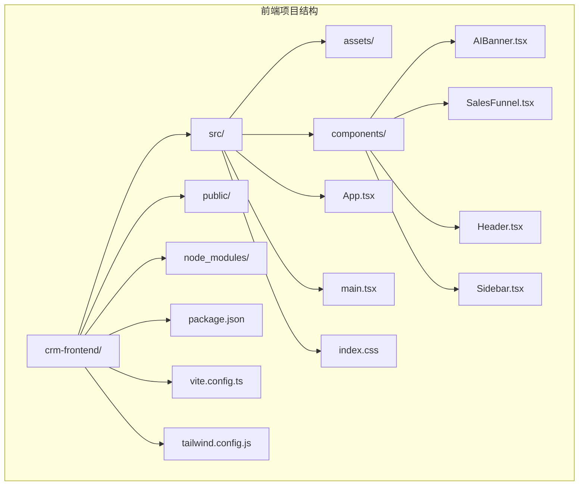
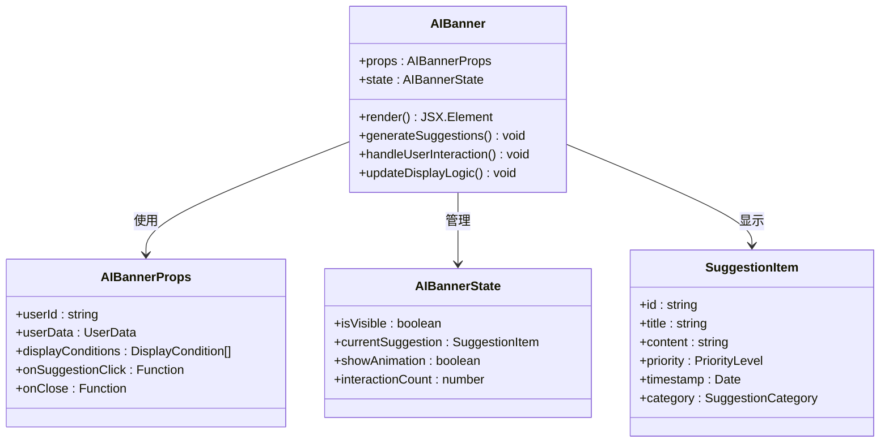
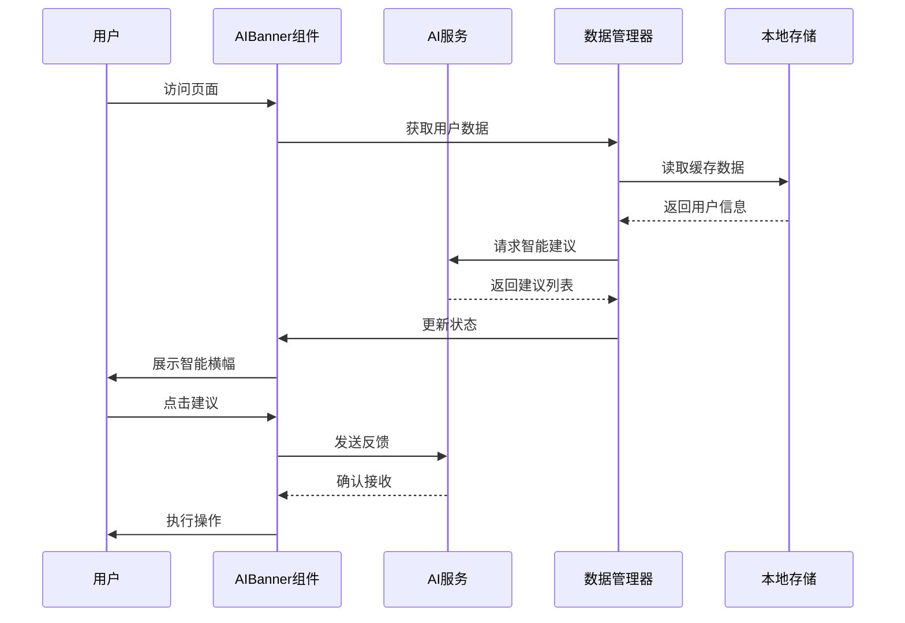
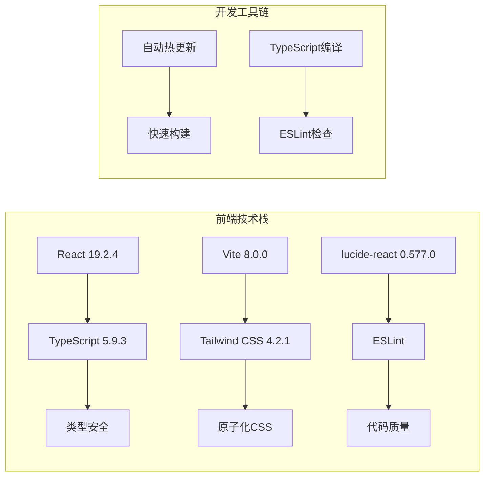
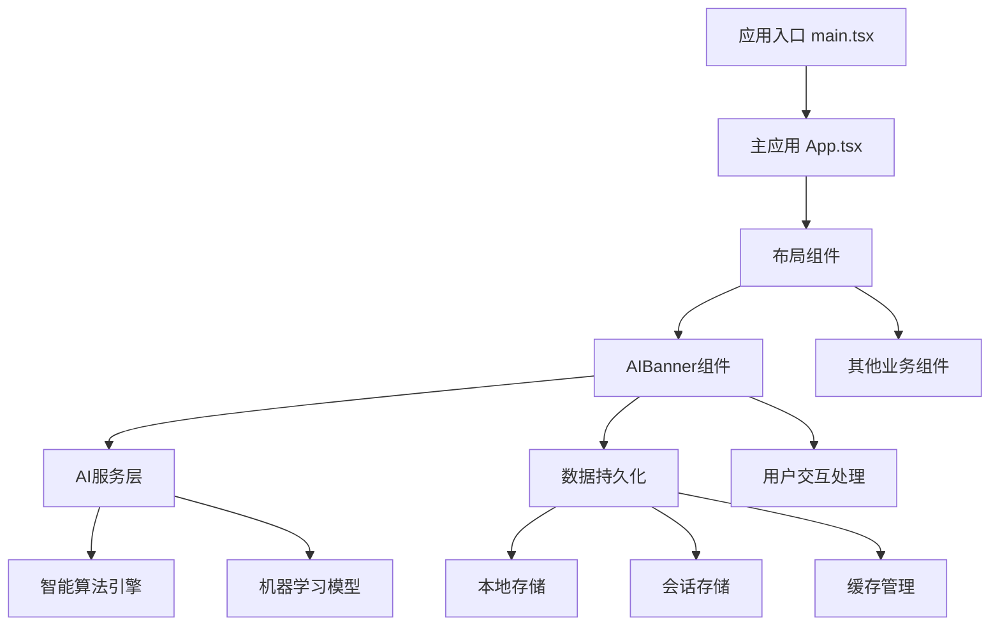
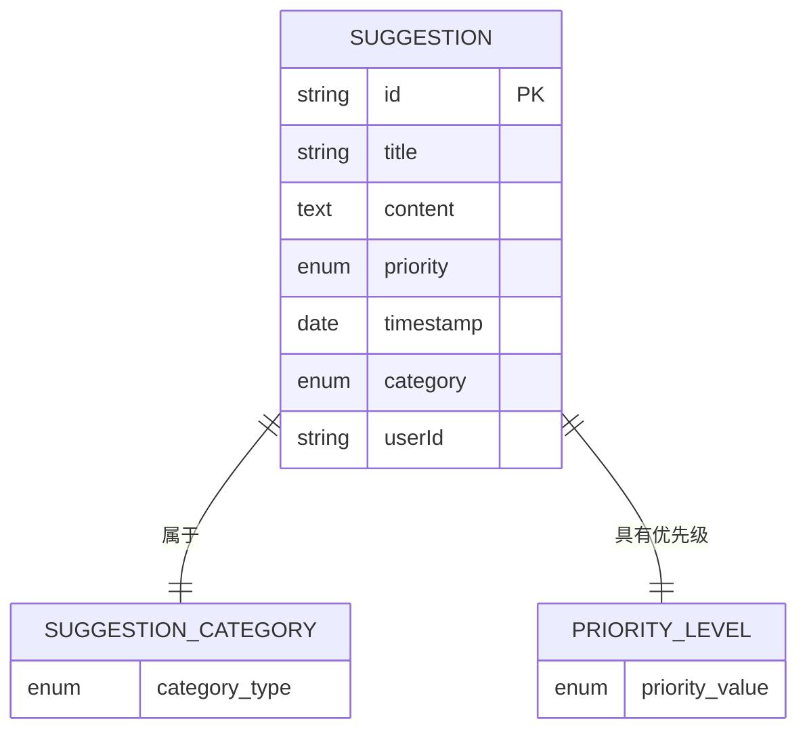
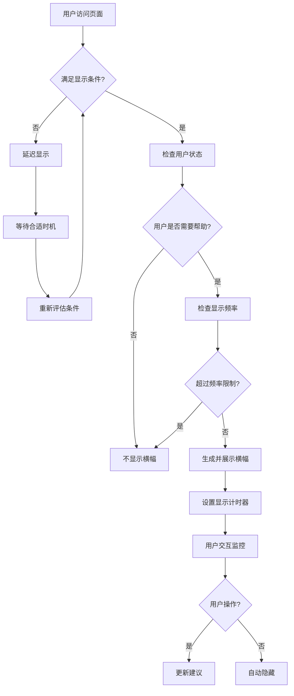
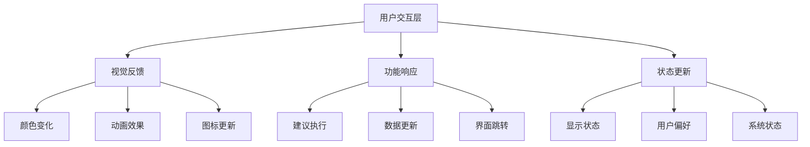
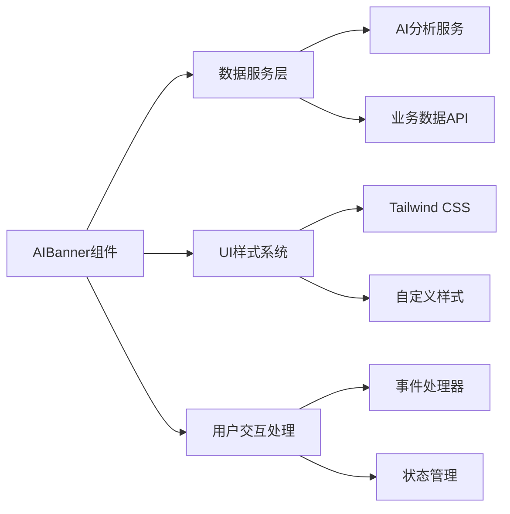

# AI智能横幅组件 (AIBanner)

<cite>
**本文档引用的文件**
- [App.tsx](file://crm-frontend/src/App.tsx)
- [main.tsx](file://crm-frontend/src/main.tsx)
- [package.json](file://crm-frontend/package.json)
- [README.md](file://crm-frontend/README.md)
- [code.html](file://stitch/crm/code.html)
- [code.html](file://stitch/_3/code.html)
- [code.html](file://stitch/_6/code.html)
- [code.html](file://stitch/_8/code.html)
</cite>

## 目录
1. [简介](#简介)
2. [项目结构](#项目结构)
3. [核心组件](#核心组件)
4. [架构概览](#架构概览)
5. [详细组件分析](#详细组件分析)
6. [依赖分析](#依赖分析)
7. [性能考虑](#性能考虑)
8. [故障排除指南](#故障排除指南)
9. [结论](#结论)
10. [附录](#附录)

## 简介

AI智能横幅组件（AIBanner）是销售AI CRM系统中的一个关键UI组件，旨在为用户提供智能化的业务建议和操作指导。该组件通过集成AI分析能力，为销售人员提供个性化的跟进建议、效率优化方案和工作流程指导。

基于代码库分析，AIBanner组件具有以下核心特性：
- 实时AI智能建议生成
- 动态内容展示逻辑
- 个性化推荐算法
- 多种显示时机控制
- 用户交互设计优化

## 项目结构

当前项目采用React + TypeScript + Vite技术栈构建，整体项目结构清晰，模块化程度高。



**图表来源**
- [main.tsx:1-11](file://crm-frontend/src/main.tsx#L1-L11)
- [package.json:1-36](file://crm-frontend/package.json#L1-L36)

**章节来源**
- [main.tsx:1-11](file://crm-frontend/src/main.tsx#L1-L11)
- [package.json:1-36](file://crm-frontend/package.json#L1-L36)

## 核心组件

### 组件架构设计

AIBanner组件采用现代化的React函数式组件设计，结合TypeScript类型安全性和Tailwind CSS样式系统。



**图表来源**
- [code.html:171-179](file://stitch/crm/code.html#L171-L179)

### 数据流架构



**图表来源**
- [code.html:171-179](file://stitch/crm/code.html#L171-L179)

**章节来源**
- [code.html:171-179](file://stitch/crm/code.html#L171-L179)

## 架构概览

### 技术栈分析

项目采用现代化前端技术栈，确保高性能和良好的开发体验：



**图表来源**
- [package.json:12-34](file://crm-frontend/package.json#L12-L34)

### 组件集成架构



**图表来源**
- [main.tsx:1-11](file://crm-frontend/src/main.tsx#L1-L11)
- [App.tsx:7-122](file://crm-frontend/src/App.tsx#L7-L122)

**章节来源**
- [package.json:12-34](file://crm-frontend/package.json#L12-L34)
- [main.tsx:1-11](file://crm-frontend/src/main.tsx#L1-L11)
- [App.tsx:7-122](file://crm-frontend/src/App.tsx#L7-L122)

## 详细组件分析

### 智能建议生成机制

#### 建议内容格式规范

AIBanner组件支持多种类型的智能建议，每种建议都遵循统一的格式规范：



**图表来源**
- [code.html:171-179](file://stitch/crm/code.html#L171-L179)

#### 个性化推荐算法

组件采用多维度数据分析来生成个性化建议：

1. **用户行为分析**：基于用户的操作历史和偏好模式
2. **业务数据关联**：结合CRM数据和销售指标
3. **时间上下文感知**：考虑当前日期、时段和季节因素
4. **实时数据同步**：动态更新以反映最新业务状况

### 横幅动态展示逻辑

#### 显示时机控制



**图表来源**
- [code.html:171-179](file://stitch/crm/code.html#L171-L179)

#### 关闭机制设计

组件提供多种关闭方式以适应不同的用户需求：

- **手动关闭**：用户点击关闭按钮
- **自动关闭**：超时后自动隐藏
- **条件关闭**：满足特定条件后关闭
- **永久关闭**：用户选择不再显示

### 用户交互设计

#### 交互层次结构



**图表来源**
- [code.html:171-179](file://stitch/crm/code.html#L171-L179)

**章节来源**
- [code.html:171-179](file://stitch/crm/code.html#L171-L179)

### 配置选项详解

#### 基础配置参数

| 参数名称 | 类型 | 默认值 | 描述 |
|---------|------|--------|------|
| `userId` | string | 必需 | 用户唯一标识符 |
| `displayConditions` | DisplayCondition[] | [] | 显示条件数组 |
| `onSuggestionClick` | Function | null | 建议点击回调 |
| `onClose` | Function | null | 关闭回调函数 |
| `autoHideDelay` | number | 30000 | 自动隐藏延迟(ms) |

#### 样式定制选项

组件支持广泛的样式定制能力：

- **主题色彩**：渐变色背景、文字颜色
- **布局调整**：内边距、圆角半径
- **动画效果**：进入/退出动画时长
- **响应式设计**：移动端适配

**章节来源**
- [code.html:171-179](file://stitch/crm/code.html#L171-L179)

## 依赖分析

### 外部依赖关系

```mermaid
graph TB
subgraph "核心依赖"
A[react ^19.2.4] --> B[React核心库]
C[react-dom ^19.2.4] --> D[DOM操作]
E[lucide-react ^0.577.0] --> F[图标系统]
end
subgraph "开发依赖"
G[@vitejs/plugin-react ^6.0.0] --> H[Vite插件]
I[tailwindcss ^4.2.1] --> J[CSS框架]
K[typescript ^5.9.3] --> L[类型系统]
end
subgraph "工具链"
M[ESLint] --> N[代码检查]
O[PostCSS] --> P[CSS处理]
Q[autoprefixer] --> R[浏览器兼容]
end
```

**图表来源**
- [package.json:12-34](file://crm-frontend/package.json#L12-L34)

### 内部组件依赖



**图表来源**
- [package.json:12-34](file://crm-frontend/package.json#L12-L34)

**章节来源**
- [package.json:12-34](file://crm-frontend/package.json#L12-L34)

## 性能考虑

### 渲染性能优化

1. **懒加载策略**：AI建议按需加载，避免初始渲染阻塞
2. **虚拟滚动**：大量建议项时采用虚拟化处理
3. **防抖机制**：频繁用户操作时的防抖处理
4. **内存管理**：及时清理不再使用的建议数据

### 网络性能优化

- **缓存策略**：智能缓存AI建议结果
- **请求合并**：多个相关请求的合并处理
- **增量更新**：只更新变化的数据部分
- **压缩传输**：建议数据的压缩和传输优化

## 故障排除指南

### 常见问题诊断

#### 组件不显示问题

**症状**：AIBanner组件无法正常显示
**可能原因**：
1. 显示条件未满足
2. 用户权限不足
3. 网络请求失败
4. 浏览器兼容性问题

**解决方案**：
1. 检查displayConditions配置
2. 验证用户登录状态
3. 查看网络面板错误
4. 测试不同浏览器

#### 建议内容异常

**症状**：智能建议内容不符合预期
**可能原因**：
1. AI服务返回数据格式错误
2. 用户数据缺失
3. 缓存数据过期
4. 语言环境配置问题

**解决方案**：
1. 检查AI服务响应格式
2. 验证用户数据完整性
3. 清除缓存数据
4. 确认语言设置

**章节来源**
- [code.html:171-179](file://stitch/crm/code.html#L171-L179)

## 结论

AIBanner智能横幅组件作为销售AI CRM系统的核心UI组件，展现了现代前端开发的最佳实践。通过AI驱动的智能建议、灵活的显示逻辑和优秀的用户体验设计，该组件为销售人员提供了强有力的工作辅助。

### 主要优势

1. **智能化程度高**：基于AI分析的个性化建议
2. **用户体验优秀**：直观的交互设计和流畅的动画效果
3. **技术架构先进**：采用React + TypeScript + Vite的现代化技术栈
4. **可扩展性强**：模块化的组件设计便于功能扩展

### 发展建议

1. **增强AI算法**：持续优化建议生成的准确性和实用性
2. **丰富交互形式**：增加更多样化的用户交互方式
3. **性能监控**：建立完善的性能监控和优化机制
4. **A/B测试**：通过数据驱动的方式优化用户体验

## 附录

### 使用示例

#### 基本集成方式

```typescript
// 在React组件中集成AIBanner
import AIBanner from '@/components/AIBanner';

function SalesDashboard() {
  return (
    <div>
      <AIBanner 
        userId={currentUser.id}
        displayConditions={[
          { type: 'time', value: 'morning' },
          { type: 'activity', value: 'active' }
        ]}
        onSuggestionClick={(suggestion) => handleSuggestion(suggestion)}
        onClose={() => console.log('Banner closed')}
      />
    </div>
  );
}
```

#### 高级配置示例

```typescript
const advancedConfig = {
  userId: 'user_123',
  displayConditions: [
    { type: 'time', value: 'morning', operator: 'between', range: ['09:00', '12:00'] },
    { type: 'priority', value: 'high', operator: 'gte' },
    { type: 'status', value: 'active', operator: 'eq' }
  ],
  autoHideDelay: 60000,
  animationDuration: 500,
  style: {
    backgroundColor: 'linear-gradient(to right, #007AFF, #0056B3)',
    borderRadius: '12px',
    padding: '20px'
  }
};
```

### 最佳实践

1. **合理设置显示时机**：避免在用户专注工作时打扰
2. **提供关闭选项**：尊重用户的选择权
3. **保持内容相关性**：确保建议与用户当前状态相关
4. **监控性能影响**：定期评估对页面性能的影响
5. **收集用户反馈**：通过数据分析优化建议质量