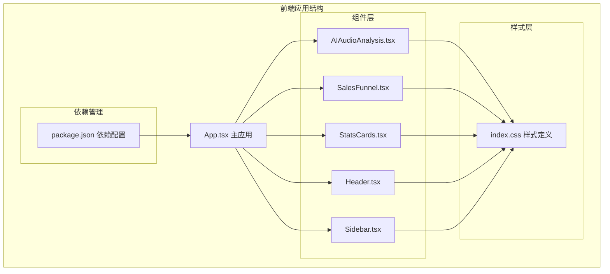
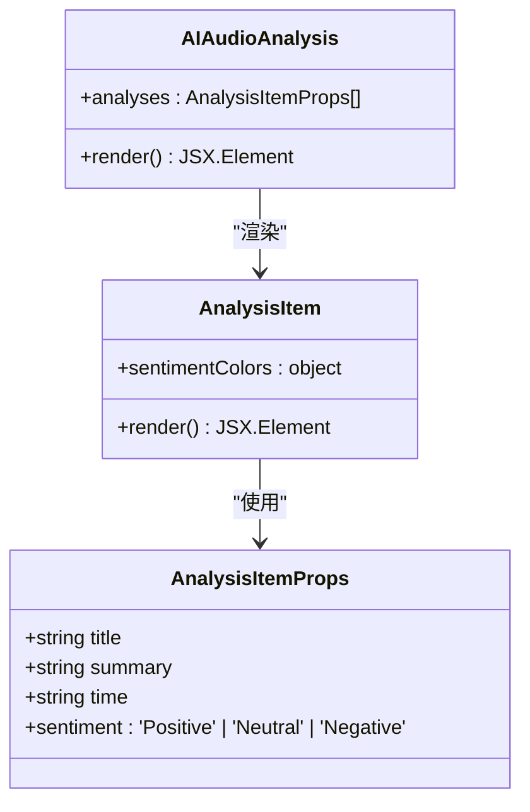
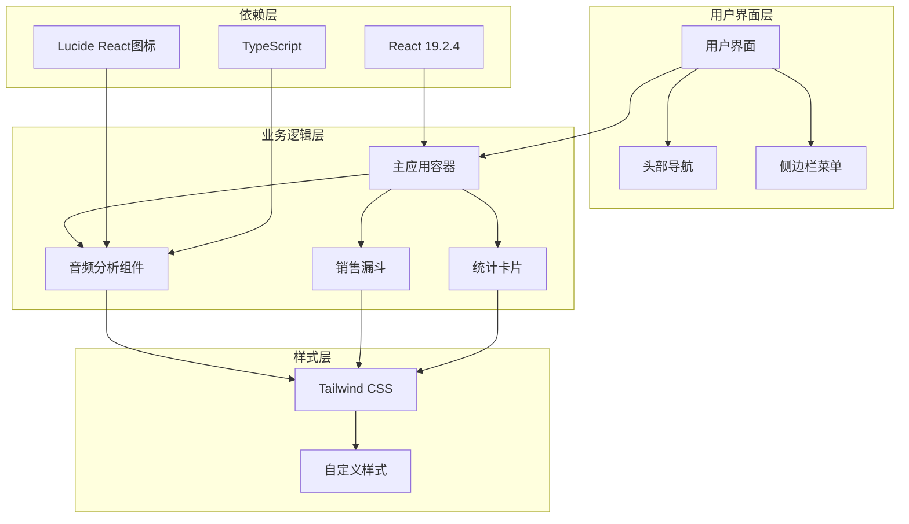
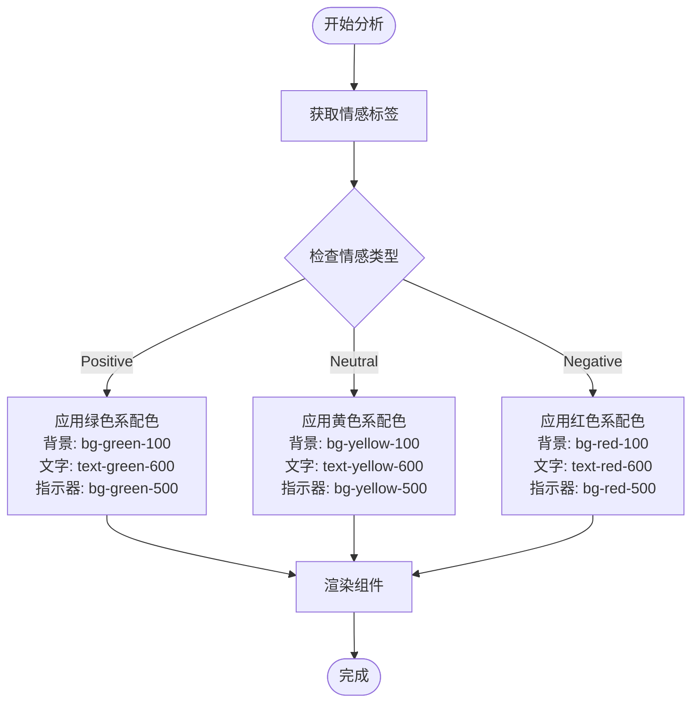
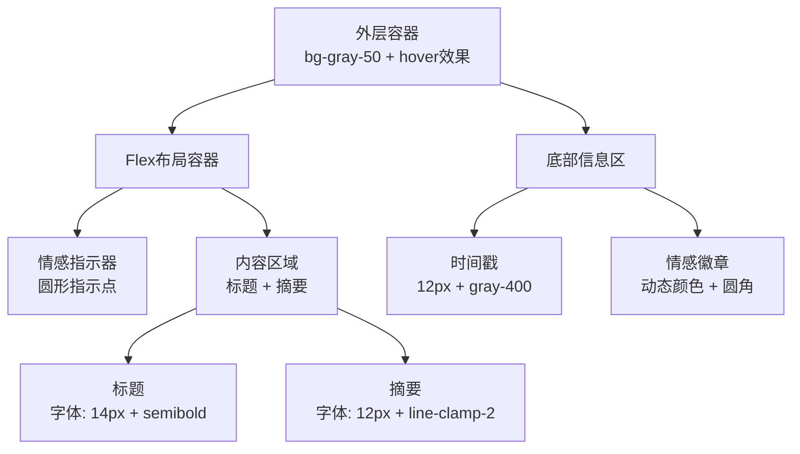
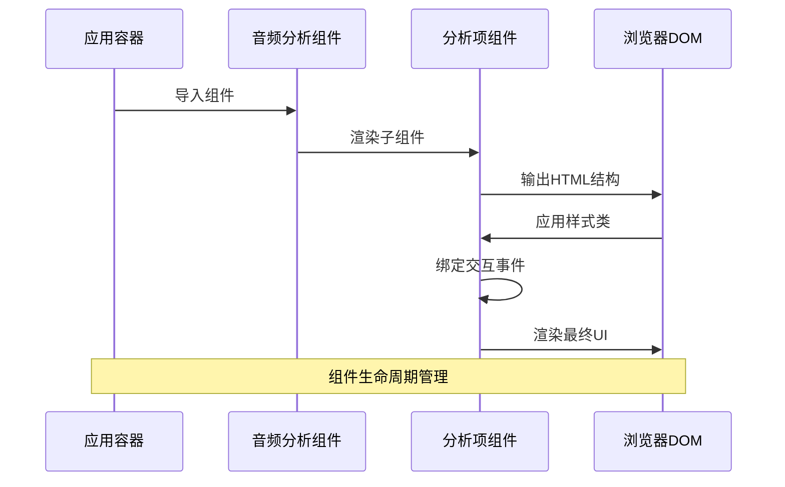
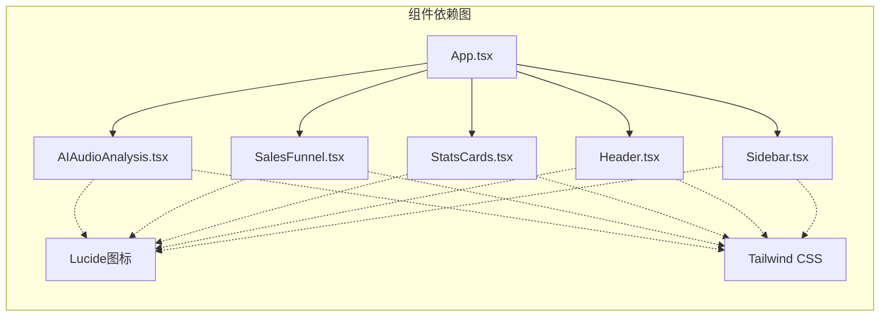

# AI音频分析组件 (AIAudioAnalysis)

<cite>
**本文档引用的文件**
- [AIAudioAnalysis.tsx](file://crm-frontend/src/components/AIAudioAnalysis.tsx)
- [App.tsx](file://crm-frontend/src/App.tsx)
- [package.json](file://crm-frontend/package.json)
- [index.css](file://crm-frontend/src/index.css)
- [SalesFunnel.tsx](file://crm-frontend/src/components/SalesFunnel.tsx)
- [StatsCards.tsx](file://crm-frontend/src/components/StatsCards.tsx)
- [Header.tsx](file://crm-frontend/src/components/Header.tsx)
- [Sidebar.tsx](file://crm-frontend/src/components/Sidebar.tsx)
</cite>

## 目录
1. [简介](#简介)
2. [项目结构](#项目结构)
3. [核心组件](#核心组件)
4. [架构概览](#架构概览)
5. [详细组件分析](#详细组件分析)
6. [依赖分析](#依赖分析)
7. [性能考虑](#性能考虑)
8. [故障排除指南](#故障排除指南)
9. [结论](#结论)

## 简介

AIAudioAnalysis 是销售AI CRM系统中的音频分析组件，专门用于处理和分析销售通话录音，提供情感识别、内容摘要和关键洞察。该组件采用现代化的React + TypeScript架构，结合Tailwind CSS进行响应式设计，为销售团队提供智能化的音频内容分析功能。

组件的核心功能包括：
- 音频内容的情感分析和分类
- 自动化的内容摘要生成
- 时间线标注和关键节点识别
- 可视化的时间轴展示
- 与CRM系统的无缝集成

## 项目结构

该项目采用模块化的前端架构，主要由以下部分组成：

**图表来源**
- [App.tsx:10-58](file://crm-frontend/src/App.tsx#L10-L58)
- [AIAudioAnalysis.tsx:38-79](file://crm-frontend/src/components/AIAudioAnalysis.tsx#L38-L79)

**章节来源**
- [App.tsx:1-58](file://crm-frontend/src/App.tsx#L1-L58)
- [package.json:1-36](file://crm-frontend/package.json#L1-L36)

## 核心组件

AIAudioAnalysis 组件采用函数式组件设计，通过props传递分析数据，实现了高度可复用的UI组件模式。

### 组件架构设计

**图表来源**
- [AIAudioAnalysis.tsx:3-8](file://crm-frontend/src/components/AIAudioAnalysis.tsx#L3-L8)
- [AIAudioAnalysis.tsx:10-36](file://crm-frontend/src/components/AIAudioAnalysis.tsx#L10-L36)
- [AIAudioAnalysis.tsx:38-79](file://crm-frontend/src/components/AIAudioAnalysis.tsx#L38-L79)

### 数据流设计

组件采用单向数据流架构，从父组件接收分析数据，内部不维护状态，确保了组件的纯度和可预测性。

**章节来源**
- [AIAudioAnalysis.tsx:1-82](file://crm-frontend/src/components/AIAudioAnalysis.tsx#L1-L82)

## 架构概览

整个CRM系统的架构采用分层设计，AIAudioAnalysis作为业务组件嵌入在主应用中。

**图表来源**
- [App.tsx:10-58](file://crm-frontend/src/App.tsx#L10-L58)
- [AIAudioAnalysis.tsx:38-79](file://crm-frontend/src/components/AIAudioAnalysis.tsx#L38-L79)
- [package.json:12-34](file://crm-frontend/package.json#L12-L34)

## 详细组件分析

### AnalysisItem 子组件

AnalysisItem 是一个独立的展示组件，负责渲染单个音频分析结果。

#### 组件特性
- **情感色彩映射**：根据情感类型自动选择对应的颜色方案
- **响应式布局**：支持不同屏幕尺寸的自适应显示
- **悬停效果**：提供平滑的交互反馈
- **截断文本**：智能处理长文本内容

#### 情感识别机制

**图表来源**
- [AIAudioAnalysis.tsx:11-15](file://crm-frontend/src/components/AIAudioAnalysis.tsx#L11-L15)
- [AIAudioAnalysis.tsx:17](file://crm-frontend/src/components/AIAudioAnalysis.tsx#L17)

#### 渲染结构分析

组件采用Flexbox布局，实现了清晰的信息层次结构：

**图表来源**
- [AIAudioAnalysis.tsx:19-35](file://crm-frontend/src/components/AIAudioAnalysis.tsx#L19-L35)

**章节来源**
- [AIAudioAnalysis.tsx:10-36](file://crm-frontend/src/components/AIAudioAnalysis.tsx#L10-L36)

### 主组件 AIAudioAnalysis

主组件负责管理多个分析项目的展示，提供了完整的音频分析结果面板。

#### 数据结构设计

组件预定义了三个示例分析项目，展示了不同类型销售场景的分析结果：

| 项目 | 客户名称 | 情感倾向 | 关键洞察 |
|------|----------|----------|----------|
| Discovery Call | TechNova Corp | Positive | 客户对AI集成能力表现出高度兴趣，预算已预先批准 |
| Follow-up | BlueSky Retail | Neutral | 对实施时间线存在担忧，需要更多迁移过程细节 |
| Closing | GreenEarth Logistics | Positive | 合同条款达成一致，即将发送最终文件进行数字签名 |

#### 视觉设计原则

- **卡片式布局**：每个分析项目独立成卡，便于对比和筛选
- **渐变阴影**：提供深度感和层次感
- **悬停交互**：增强用户体验和可操作性
- **颜色编码**：通过情感色彩直观传达分析结果

**章节来源**
- [AIAudioAnalysis.tsx:38-79](file://crm-frontend/src/components/AIAudioAnalysis.tsx#L38-L79)

### 集成架构

组件通过标准的React导入导出模式集成到主应用中，遵循现代前端开发最佳实践。

**图表来源**
- [App.tsx:6](file://crm-frontend/src/App.tsx#L6)
- [AIAudioAnalysis.tsx:74](file://crm-frontend/src/components/AIAudioAnalysis.tsx#L74)

**章节来源**
- [App.tsx:1-58](file://crm-frontend/src/App.tsx#L1-L58)

## 依赖分析

### 外部依赖关系

项目采用现代化的前端技术栈，主要依赖包括：

| 依赖包 | 版本 | 用途 | 类型 |
|--------|------|------|------|
| react | ^19.2.4 | 核心框架 | 运行时 |
| react-dom | ^19.2.4 | DOM渲染 | 运行时 |
| lucide-react | ^0.577.0 | 图标库 | 运行时 |
| @tailwindcss/postcss | ^4.2.1 | 样式框架 | 开发时 |
| tailwindcss | ^4.2.1 | CSS框架 | 开发时 |
| typescript | ~5.9.3 | 类型系统 | 开发时 |

### 内部组件依赖

**图表来源**
- [App.tsx:1-9](file://crm-frontend/src/App.tsx#L1-L9)
- [package.json:12-34](file://crm-frontend/package.json#L12-L34)

**章节来源**
- [package.json:1-36](file://crm-frontend/package.json#L1-L36)

## 性能考虑

### 渲染优化策略

1. **组件拆分**：将复杂UI拆分为独立的子组件，提高代码复用性和可维护性
2. **条件渲染**：根据情感类型动态选择样式，避免不必要的DOM操作
3. **事件委托**：利用React的事件系统减少事件监听器数量
4. **虚拟滚动**：对于大量分析结果，可考虑实现虚拟滚动优化

### 样式性能优化

- **原子化CSS**：使用Tailwind的原子化类名，减少CSS规则数量
- **按需加载**：只加载实际使用的样式类
- **缓存策略**：浏览器自动缓存静态资源

### 内存管理

- **无状态设计**：组件不维护内部状态，减少内存占用
- **及时清理**：组件卸载时自动清理事件监听器

## 故障排除指南

### 常见问题及解决方案

#### 样式显示异常
**问题描述**：组件样式错乱或颜色不正确
**可能原因**：
- Tailwind CSS未正确配置
- 样式类名拼写错误
- CSS优先级冲突

**解决步骤**：
1. 检查Tailwind配置文件是否存在
2. 验证样式类名是否符合Tailwind规范
3. 使用浏览器开发者工具检查CSS优先级

#### 图标显示问题
**问题描述**：Lucide图标无法正常显示
**可能原因**：
- 图标库未正确安装
- 图标导入路径错误
- React版本兼容性问题

**解决步骤**：
1. 确认package.json中包含lucide-react依赖
2. 检查图标导入语句的正确性
3. 验证React版本与图标库的兼容性

#### 组件渲染问题
**问题描述**：组件无法正常渲染或显示空白
**可能原因**：
- props数据格式不正确
- 组件导入路径错误
- React运行时环境问题

**解决步骤**：
1. 验证传入组件的props数据结构
2. 检查组件导入语句的正确性
3. 在浏览器控制台查看错误信息

**章节来源**
- [AIAudioAnalysis.tsx:1-82](file://crm-frontend/src/components/AIAudioAnalysis.tsx#L1-L82)

## 结论

AIAudioAnalysis 组件展现了现代前端开发的最佳实践，通过清晰的组件分离、合理的数据流设计和优雅的视觉呈现，为销售CRM系统提供了强大的音频分析功能。

### 技术优势

1. **模块化设计**：组件职责单一，易于测试和维护
2. **类型安全**：完整的TypeScript类型定义，提升开发体验
3. **响应式设计**：基于Tailwind CSS的灵活布局系统
4. **可扩展性**：清晰的架构为后续功能扩展奠定基础

### 改进建议

1. **状态管理**：考虑引入状态管理模式处理复杂的分析数据
2. **国际化**：添加多语言支持以适应国际化需求
3. **无障碍访问**：增强组件的无障碍访问能力
4. **性能监控**：集成性能监控工具跟踪组件表现

该组件为销售AI CRM系统的核心功能模块，通过智能化的音频分析为销售团队提供宝贵的洞察和决策支持，是提升销售效率的重要工具。