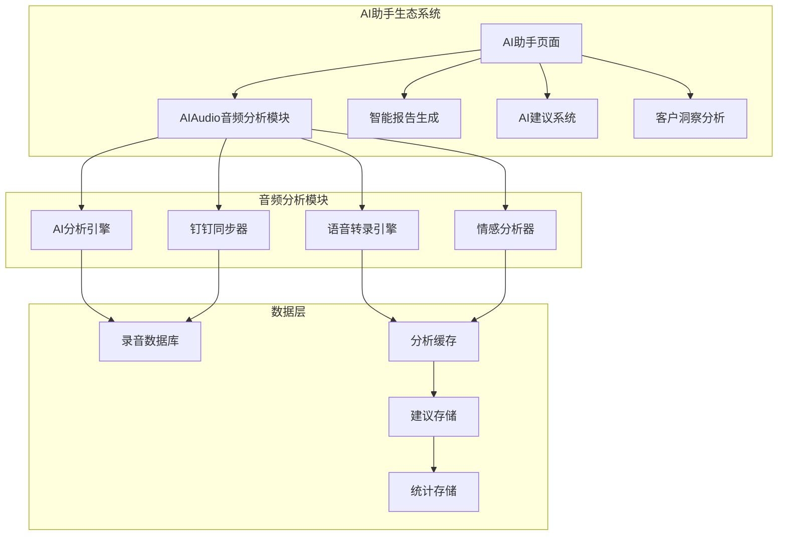
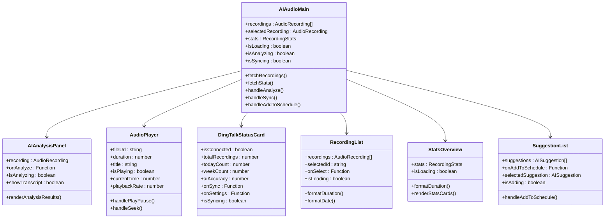
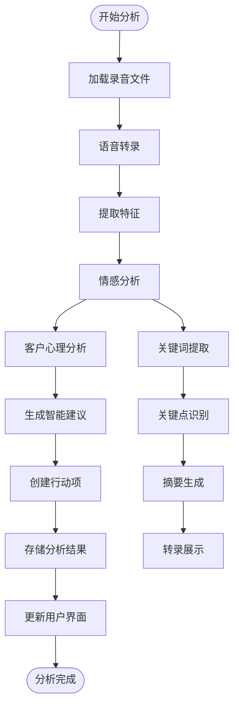
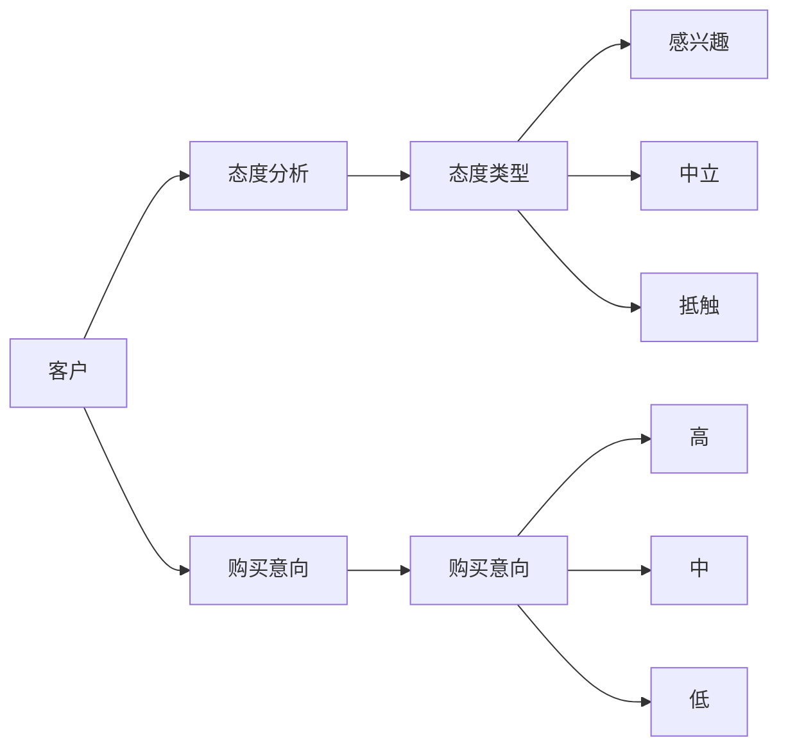
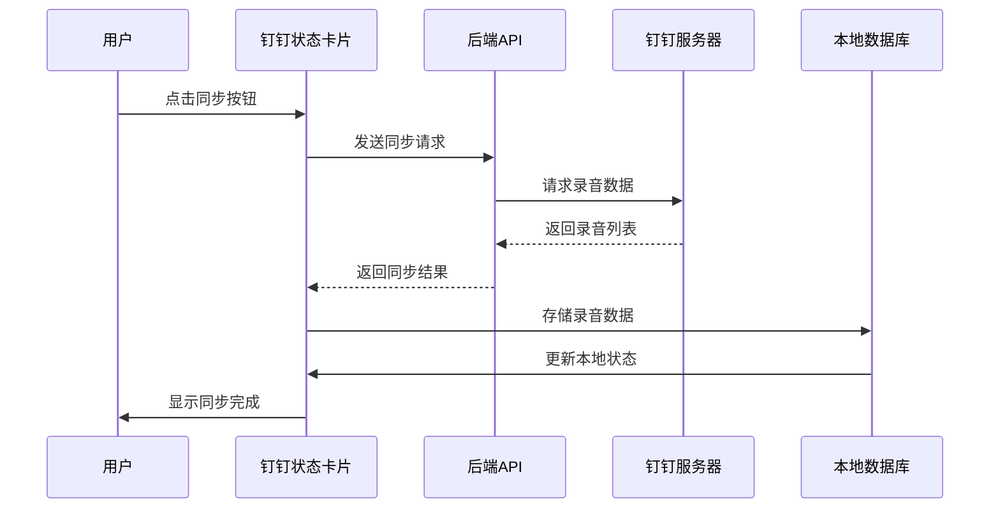
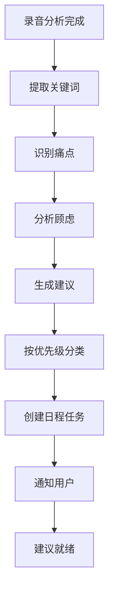
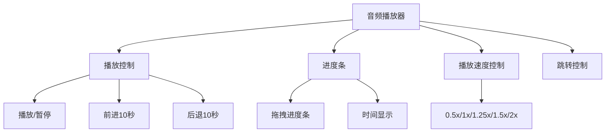
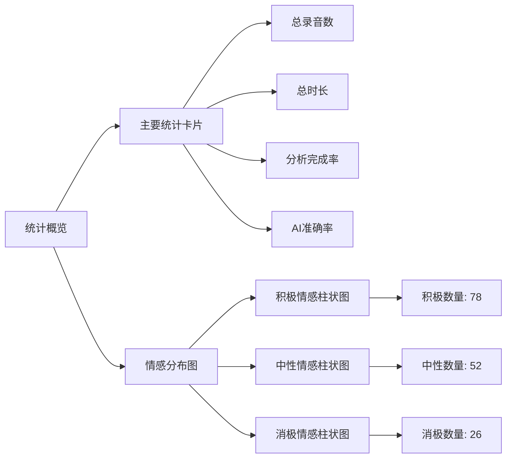
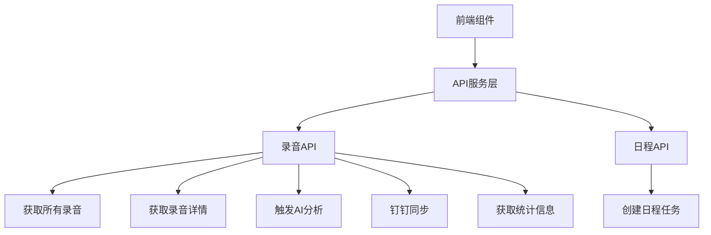

# AI音频分析组件 (AIAudioAnalysis)

<cite>
**本文档引用的文件**
- [index.tsx](file://crm-frontend/src/pages/AIAudio/index.tsx)
- [AIAnalysisPanel.tsx](file://crm-frontend/src/pages/AIAudio/components/AIAnalysisPanel.tsx)
- [AudioPlayer.tsx](file://crm-frontend/src/pages/AIAudio/components/AudioPlayer.tsx)
- [DingTalkStatusCard.tsx](file://crm-frontend/src/pages/AIAudio/components/DingTalkStatusCard.tsx)
- [RecordingList.tsx](file://crm-frontend/src/pages/AIAudio/components/RecordingList.tsx)
- [StatsOverview.tsx](file://crm-frontend/src/pages/AIAudio/components/StatsOverview.tsx)
- [SuggestionList.tsx](file://crm-frontend/src/pages/AIAudio/components/SuggestionList.tsx)
- [index.tsx](file://crm-frontend/src/pages/AIAssistant/index.tsx)
- [api.ts](file://crm-frontend/src/services/api.ts)
- [index.ts](file://crm-frontend/src/types/index.ts)
</cite>

## 更新摘要
**变更内容**
- AI音频分析组件已升级为完整的AI助手生态系统模块
- 新增与钉钉录音同步功能集成
- 增强的AI分析面板和智能建议系统
- 完整的录音管理和播放功能
- 实时统计和情感分析可视化

## 目录
1. [简介](#简介)
2. [AI助手生态系统架构](#ai助手生态系统架构)
3. [核心组件架构](#核心组件架构)
4. [AI音频分析功能详解](#ai音频分析功能详解)
5. [钉钉集成与同步](#钉钉集成与同步)
6. [智能建议系统](#智能建议系统)
7. [音频播放器功能](#音频播放器功能)
8. [统计分析面板](#统计分析面板)
9. [数据模型与API](#数据模型与api)
10. [性能优化策略](#性能优化策略)
11. [集成与部署](#集成与部署)
12. [故障排除指南](#故障排除指南)
13. [结论](#结论)

## 简介

AI音频分析组件现已升级为销售AI CRM系统中AI助手生态系统的核心模块。该组件不仅提供音频分析功能，还集成了完整的AI助手功能，包括智能报告生成、销售建议、录音管理等。组件采用现代化的React + TypeScript架构，结合Tailwind CSS进行响应式设计，为销售团队提供全方位的智能化音频内容分析和管理功能。

**核心功能升级**：
- AI音频分析与情感识别
- 钉钉录音自动同步
- 智能建议生成与日程集成
- 完整的录音播放器
- 实时统计分析面板
- 多维度客户洞察

## AI助手生态系统架构

AI助手生态系统采用模块化设计，AI音频分析组件作为其中的核心模块，与其他AI功能协同工作。



**图表来源**
- [index.tsx:27-345](file://crm-frontend/src/pages/AIAudio/index.tsx#L27-L345)
- [index.tsx:108-125](file://crm-frontend/src/pages/AIAudio/index.tsx#L108-L125)

## 核心组件架构

AI音频分析模块采用分层架构设计，包含主页面组件和多个专业子组件。



**图表来源**
- [index.tsx:27-345](file://crm-frontend/src/pages/AIAudio/index.tsx#L27-L345)
- [AIAnalysisPanel.tsx:46-224](file://crm-frontend/src/pages/AIAudio/components/AIAnalysisPanel.tsx#L46-L224)
- [AudioPlayer.tsx:9-165](file://crm-frontend/src/pages/AIAudio/components/AudioPlayer.tsx#L9-L165)

## AI音频分析功能详解

### 分析引擎架构

AI音频分析引擎提供多层次的分析能力，从基础情感识别到深度客户洞察。



**图表来源**
- [AIAnalysisPanel.tsx:109-221](file://crm-frontend/src/pages/AIAudio/components/AIAnalysisPanel.tsx#L109-L221)

### 情感分析算法

组件支持三种情感类型的识别和可视化：

| 情感类型 | 颜色方案 | 图标 | 标签 | 配置对象 |
|---------|---------|------|------|----------|
| Positive | emerald-50/500 | sentiment_satisfied | 积极 | `{ icon: 'sentiment_satisfied', color: 'text-emerald-500', bg: 'bg-emerald-50 dark:bg-emerald-900/30', label: '积极' }` |
| Neutral | slate-50/400 | sentiment_neutral | 中性 | `{ icon: 'sentiment_neutral', color: 'text-slate-400', bg: 'bg-slate-50 dark:bg-slate-800', label: '中性' }` |
| Negative | red-50/500 | sentiment_dissatisfied | 消极 | `{ icon: 'sentiment_dissatisfied', color: 'text-red-500', bg: 'bg-red-50 dark:bg-red-900/30', label: '消极' }` |

### 客户心理分析

深度分析客户态度和购买意向：



**图表来源**
- [AIAnalysisPanel.tsx:32-44](file://crm-frontend/src/pages/AIAudio/components/AIAnalysisPanel.tsx#L32-L44)

**章节来源**
- [AIAnalysisPanel.tsx:10-44](file://crm-frontend/src/pages/AIAudio/components/AIAnalysisPanel.tsx#L10-L44)

## 钉钉集成与同步

### 钉钉连接状态管理

组件提供完整的钉钉集成功能，包括连接状态监控和自动同步。



**图表来源**
- [index.tsx:108-125](file://crm-frontend/src/pages/AIAudio/index.tsx#L108-L125)
- [DingTalkStatusCard.tsx:72-88](file://crm-frontend/src/pages/AIAudio/components/DingTalkStatusCard.tsx#L72-L88)

### 同步配置选项

| 配置项 | 默认值 | 描述 |
|-------|--------|------|
| 同步频率 | 每小时 | 自动同步间隔设置 |
| 最近同步时间 | 当前时间 | 上次同步的具体时间 |
| 连接状态 | 已连接 | 当前钉钉连接状态 |
| 录音总数 | 0 | 系统中录音文件总数 |
| 今日新增 | 0 | 今日新增录音数量 |
| 本周分析 | 0 | 本周已完成分析的录音数 |
| AI准确率 | 95% | AI分析的准确率百分比 |

**章节来源**
- [DingTalkStatusCard.tsx:14-23](file://crm-frontend/src/pages/AIAudio/components/DingTalkStatusCard.tsx#L14-L23)

## 智能建议系统

### 建议类型分类

AI系统根据分析结果生成多种类型的智能建议：

| 建议类型 | 图标 | 颜色 | 优先级 | 描述 |
|---------|------|------|--------|------|
| Email | mail | blue-500 | 高/中/低 | 邮件跟进建议 |
| Demo | play_circle | purple-500 | 高/中/低 | 产品演示建议 |
| Proposal | description | emerald-500 | 高/中/低 | 方案提案建议 |
| Follow-up | phone_in_talk | amber-500 | 高/中/低 | 跟进通话建议 |
| Price | payments | rose-500 | 高/中/低 | 报价调整建议 |

### 建议生成流程



**图表来源**
- [SuggestionList.tsx:27-36](file://crm-frontend/src/pages/AIAudio/components/SuggestionList.tsx#L27-L36)

**章节来源**
- [SuggestionList.tsx:9-21](file://crm-frontend/src/pages/AIAudio/components/SuggestionList.tsx#L9-L21)

## 音频播放器功能

### 播放器核心功能

音频播放器提供完整的音频播放体验，支持多种播放控制功能。



**图表来源**
- [AudioPlayer.tsx:21-66](file://crm-frontend/src/pages/AIAudio/components/AudioPlayer.tsx#L21-L66)

### 播放控制功能

| 控制功能 | 快捷键 | 描述 | 实现方式 |
|---------|--------|------|----------|
| 播放/暂停 | 空格键 | 切换播放状态 | handlePlayPause() |
| 前进10秒 | →键 | 快速跳转到10秒后 | skipForward() |
| 后退10秒 | ←键 | 快速跳转到10秒前 | skipBackward() |
| 播放速度 | 点击速度按钮 | 切换播放速度 | handlePlaybackRate() |
| 拖拽进度 | 鼠标拖拽 | 精确跳转到指定位置 | handleSeek() |

**章节来源**
- [AudioPlayer.tsx:9-165](file://crm-frontend/src/pages/AIAudio/components/AudioPlayer.tsx#L9-L165)

## 统计分析面板

### 统计卡片设计

统计面板提供多维度的数据可视化，帮助用户全面了解录音分析情况。



**图表来源**
- [StatsOverview.tsx:44-101](file://crm-frontend/src/pages/AIAudio/components/StatsOverview.tsx#L44-L101)
- [StatsOverview.tsx:107-164](file://crm-frontend/src/pages/AIAudio/components/StatsOverview.tsx#L107-L164)

### 统计指标说明

| 指标名称 | 计算公式 | 显示格式 | 用途 |
|---------|----------|----------|------|
| 总录音数 | COUNT(recordings) | 数字 | 总体规模统计 |
| 总时长 | SUM(duration) | 时:分:秒 | 时间投入统计 |
| 平均时长 | AVG(duration) | 时:分:秒 | 效率分析指标 |
| 分析完成率 | (analyzedCount/totalCount)*100 | 百分比 | 分析进度衡量 |
| AI准确率 | 模拟计算 | 百分比 | AI性能评估 |
| 积极情感比例 | (positiveCount/total)*100 | 百分比 | 客户满意度分析 |
| 中性情感比例 | (neutralCount/total)*100 | 百分比 | 客户态度分析 |
| 消极情感比例 | (negativeCount/total)*100 | 百分比 | 风险预警指标 |

**章节来源**
- [StatsOverview.tsx:17-167](file://crm-frontend/src/pages/AIAudio/components/StatsOverview.tsx#L17-L167)

## 数据模型与API

### 核心数据接口

AI音频分析模块使用统一的数据模型来管理所有相关数据。

```mermaid
classDiagram
class AudioRecording {
+id : string
+customerId : string
+customerName : string
+customerShortName : string
+contactPerson : string
+duration : number
+recordedAt : string
+title : string
+sentiment : Sentiment
+summary : string
+keywords : string[]
+keyPoints : string[]
+actionItems : string[]
+transcript : string
+status : 'analyzed' | 'pending' | 'processing'
+fileSize : number
+fileUrl : string
+notes : string
+createdAt : string
+updatedAt : string
+psychology : CustomerPsychology
+suggestions : AISuggestion[]
}
class CustomerPsychology {
+attitude : 'interested' | 'neutral' | 'resistant'
+purchaseIntent : 'high' | 'medium' | 'low'
+painPoints : string[]
+concerns : string[]
}
class AISuggestion {
+type : 'email' | 'demo' | 'proposal' | 'follow_up' | 'price'
+title : string
+description : string
+priority : 'high' | 'medium' | 'low'
}
class RecordingStats {
+total : number
+averageDuration : number
+totalDuration : number
+sentimentDistribution : {
+positive : number
+neutral : number
+negative : number
+}
+statusDistribution : {
+pending : number
+processing : number
+analyzed : number
+}
+todayCount : number
+weekCount : number
+analyzedRate : number
+aiAccuracy : number
}
```

**图表来源**
- [index.ts:72-133](file://crm-frontend/src/types/index.ts#L72-L133)

### API接口设计

组件通过统一的API服务层与后端进行通信。



**图表来源**
- [api.ts:242-290](file://crm-frontend/src/services/api.ts#L242-L290)

**章节来源**
- [index.ts:72-133](file://crm-frontend/src/types/index.ts#L72-L133)
- [api.ts:242-290](file://crm-frontend/src/services/api.ts#L242-L290)

## 性能优化策略

### 渲染优化

1. **虚拟滚动**：对于大量录音列表，可考虑实现虚拟滚动优化
2. **懒加载**：音频文件采用懒加载策略，减少初始加载时间
3. **状态缓存**：分析结果和统计数据进行本地缓存
4. **条件渲染**：根据状态动态渲染不同的UI组件

### 数据优化

1. **分页加载**：录音列表支持分页加载，避免一次性加载过多数据
2. **增量更新**：只更新发生变化的数据，减少不必要的重新渲染
3. **防抖处理**：搜索和筛选操作使用防抖优化
4. **内存管理**：及时清理音频播放器的事件监听器

### 网络优化

1. **请求合并**：将多个API请求合并为批量请求
2. **缓存策略**：合理设置API响应缓存时间
3. **错误重试**：网络请求失败时自动重试
4. **超时控制**：设置合理的请求超时时间

## 集成与部署

### 环境配置

组件支持多种部署环境，通过环境变量进行配置。

| 环境变量 | 默认值 | 用途 |
|---------|--------|------|
| VITE_API_BASE_URL | http://localhost:3001/api/v1 | API基础URL |
| VITE_API_TIMEOUT | 10000 | API请求超时时间(ms) |
| NODE_ENV | development | 环境模式 |

### 依赖管理

组件依赖的主要第三方库：

| 依赖包 | 版本 | 用途 |
|-------|------|------|
| react | ^19.2.4 | 核心框架 |
| react-dom | ^19.2.4 | DOM渲染 |
| tailwindcss | ^4.2.1 | CSS框架 |
| lucide-react | ^0.577.0 | 图标库 |
| @headlessui/react | ^2.1.2 | UI组件库 |
| @heroicons/react | ^2.1.5 | 图标库 |

### 部署要求

1. **Node.js版本**：18.x或更高版本
2. **前端构建工具**：Vite 5.x
3. **后端API服务**：提供录音分析和同步功能
4. **数据库**：支持录音数据存储
5. **钉钉集成**：需要配置钉钉应用权限

## 故障排除指南

### 常见问题及解决方案

#### 音频播放问题
**问题描述**：音频无法播放或播放异常
**可能原因**：
- 音频文件URL无效
- 浏览器不支持音频格式
- 网络连接问题

**解决步骤**：
1. 检查fileUrl字段是否有效
2. 验证音频文件格式兼容性
3. 确认网络连接正常
4. 查看浏览器控制台错误信息

#### AI分析失败
**问题描述**：AI分析功能无法正常工作
**可能原因**：
- 后端API服务不可用
- 认证令牌过期
- 录音文件格式不支持

**解决步骤**：
1. 检查后端API服务状态
2. 验证用户认证状态
3. 确认录音文件格式支持
4. 查看API响应错误信息

#### 钉钉同步问题
**问题描述**：钉钉录音同步失败
**可能原因**：
- 钉钉应用权限不足
- 网络连接不稳定
- 钉钉服务器异常

**解决步骤**：
1. 检查钉钉应用权限配置
2. 验证网络连接稳定性
3. 确认钉钉服务器状态
4. 查看同步错误日志

#### 组件渲染问题
**问题描述**：组件显示异常或空白
**可能原因**：
- Props数据格式不正确
- 组件导入路径错误
- React版本兼容性问题

**解决步骤**：
1. 验证传入组件的props数据结构
2. 检查组件导入语句的正确性
3. 确认React版本兼容性
4. 查看浏览器控制台错误信息

**章节来源**
- [AudioPlayer.tsx:147-163](file://crm-frontend/src/pages/AIAudio/components/AudioPlayer.tsx#L147-L163)
- [index.tsx:82-106](file://crm-frontend/src/pages/AIAudio/index.tsx#L82-L106)

## 结论

AI音频分析组件已成功升级为完整的AI助手生态系统模块，为销售CRM系统提供了强大的智能化音频分析和管理功能。通过与钉钉的深度集成、智能建议系统、完整的录音播放器和实时统计分析，该组件显著提升了销售团队的工作效率和决策质量。

### 技术优势

1. **模块化架构**：清晰的组件分离和职责划分
2. **实时同步**：与钉钉的无缝集成和自动同步
3. **智能分析**：多层次的AI分析和建议生成
4. **用户体验**：完整的音频播放和交互功能
5. **数据可视化**：直观的统计图表和情感分析
6. **性能优化**：多项性能优化策略确保流畅体验

### 未来发展方向

1. **AI能力增强**：持续改进AI分析算法和准确性
2. **多平台支持**：扩展到更多录音平台和格式
3. **个性化定制**：提供更多个性化的分析和建议
4. **移动端优化**：优化移动端用户体验
5. **集成扩展**：与其他CRM功能的深度集成

该组件为销售AI CRM系统的核心功能模块，通过智能化的音频分析为销售团队提供宝贵的洞察和决策支持，是提升销售效率的重要工具。