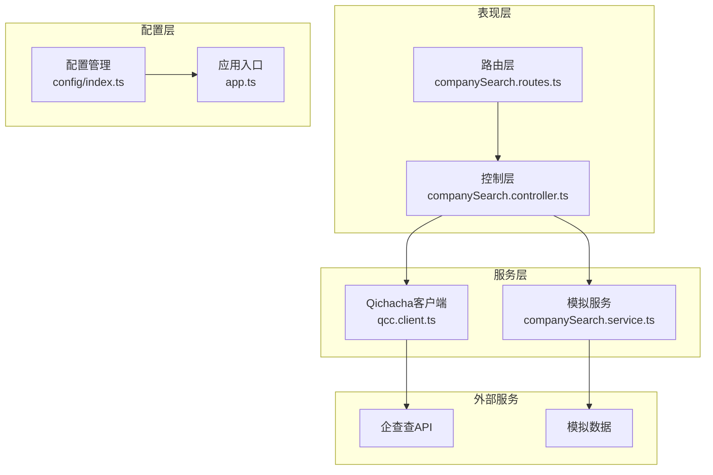
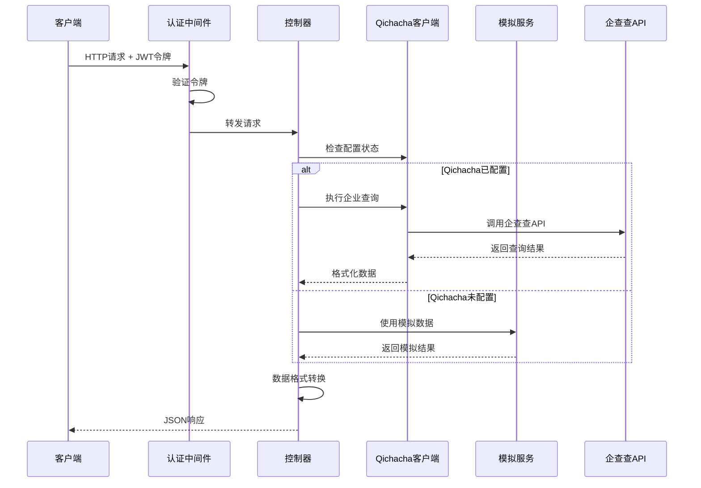
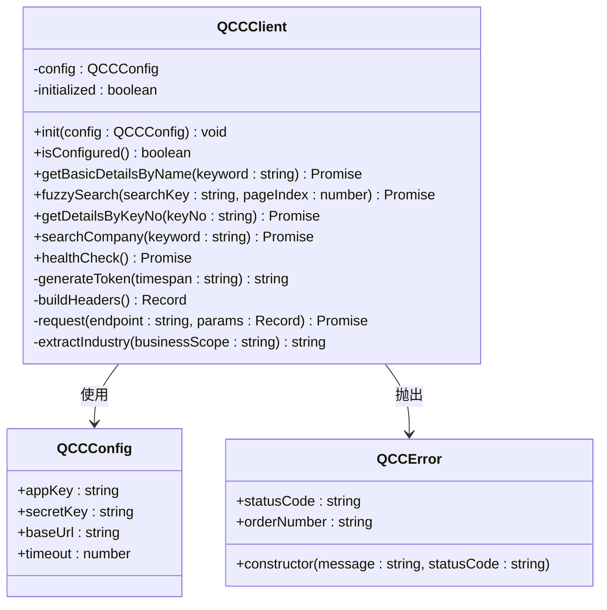
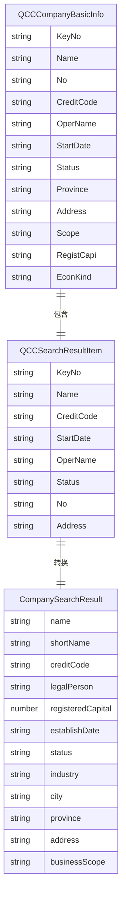
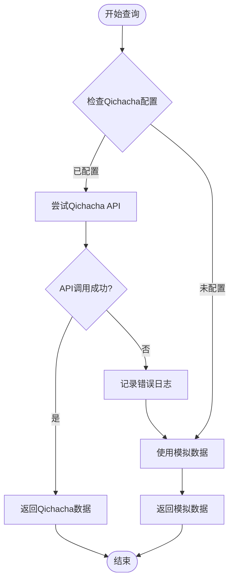
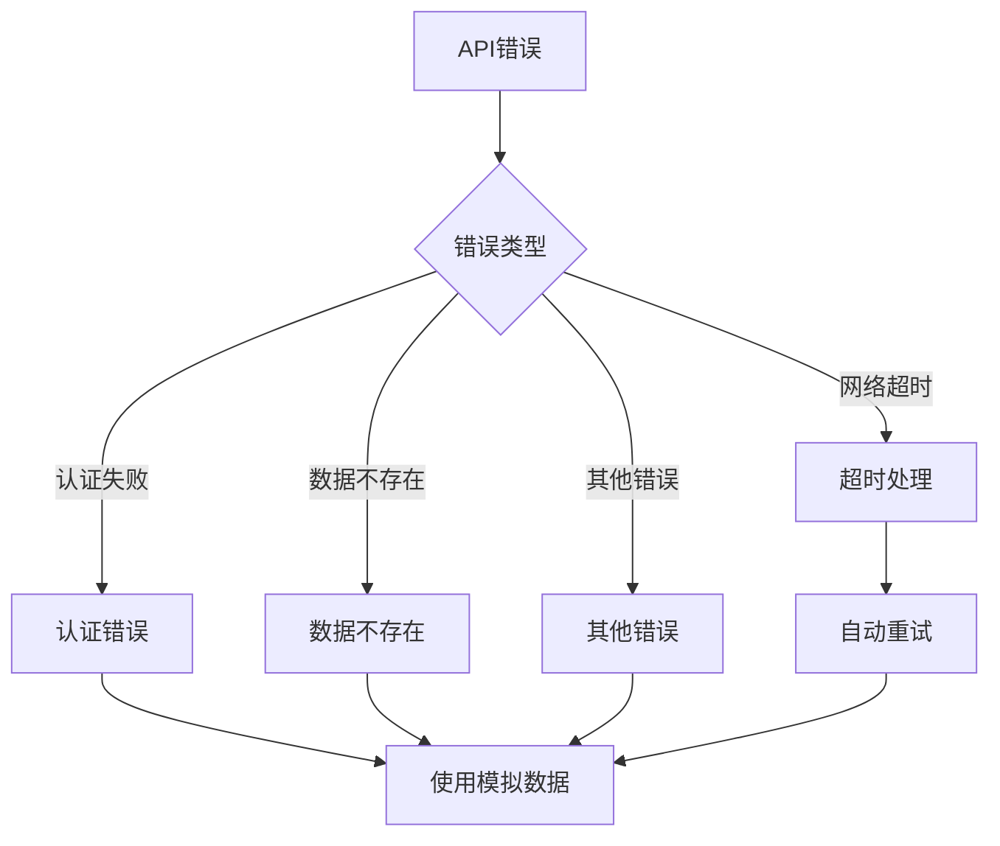
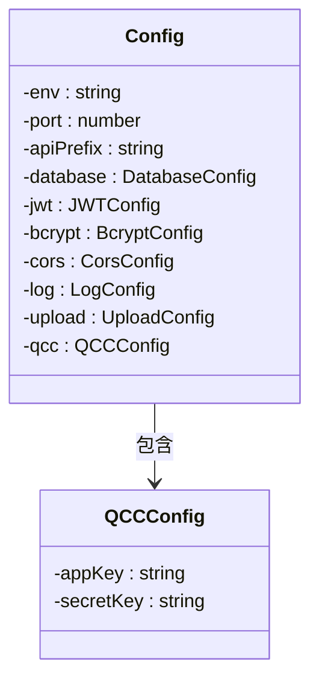
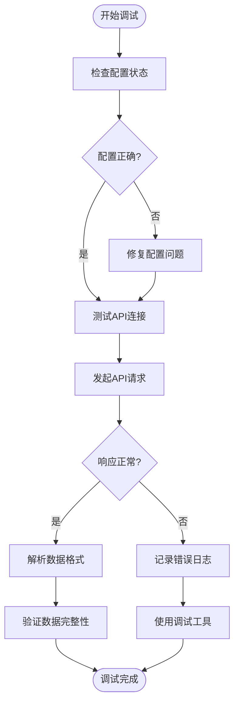

# Qichacha API集成

<cite>
**本文档引用的文件**
- [qcc.client.ts](file://crm-backend/src/services/search/qcc.client.ts)
- [companySearch.service.ts](file://crm-backend/src/services/companySearch.service.ts)
- [companySearch.controller.ts](file://crm-backend/src/controllers/companySearch.controller.ts)
- [companySearch.routes.ts](file://crm-backend/src/routes/companySearch.routes.ts)
- [index.ts](file://crm-backend/src/config/index.ts)
- [app.ts](file://crm-backend/src/app.ts)
- [auth.ts](file://crm-backend/src/middlewares/auth.ts)
- [package.json](file://crm-backend/package.json)
</cite>

## 更新摘要
**变更内容**
- 新增智能回退机制，实现权威工商信息查询与模拟数据的优先级切换
- 增强错误处理和数据转换功能
- 改进配置管理和健康检查机制
- 优化API路由设计和响应格式

## 目录
1. [简介](#简介)
2. [项目结构](#项目结构)
3. [核心组件](#核心组件)
4. [架构概览](#架构概览)
5. [详细组件分析](#详细组件分析)
6. [智能回退机制](#智能回退机制)
7. [错误处理与降级策略](#错误处理与降级策略)
8. [配置管理](#配置管理)
9. [性能考虑](#性能考虑)
10. [故障排除指南](#故障排除指南)
11. [结论](#结论)

## 简介

本项目实现了完整的企查查（Qichacha）API集成功能，为销售AI CRM系统提供权威的企业工商信息查询能力。该集成采用多层架构设计，支持企业精确查询、模糊搜索、详情获取等功能，并具备完善的智能回退机制和错误处理能力。

系统通过RESTful API提供企业信息查询服务，支持JWT身份验证，具备高可用性和容错能力。当企查查API不可用时，系统会自动降级到内置的模拟数据服务，确保用户体验不受影响。智能回退机制实现了权威工商信息查询与模拟数据的优先级切换，为用户提供最佳的数据源选择。

## 项目结构

项目采用模块化的分层架构，Qichacha API集成主要分布在以下层次：



**图表来源**
- [companySearch.routes.ts:1-57](file://crm-backend/src/routes/companySearch.routes.ts#L1-L57)
- [companySearch.controller.ts:24-225](file://crm-backend/src/controllers/companySearch.controller.ts#L24-L225)
- [qcc.client.ts:152-539](file://crm-backend/src/services/search/qcc.client.ts#L152-L539)

**章节来源**
- [companySearch.routes.ts:1-57](file://crm-backend/src/routes/companySearch.routes.ts#L1-L57)
- [companySearch.controller.ts:24-225](file://crm-backend/src/controllers/companySearch.controller.ts#L24-L225)
- [qcc.client.ts:152-539](file://crm-backend/src/services/search/qcc.client.ts#L152-L539)

## 核心组件

### Qichacha API客户端

Qichacha API客户端是整个集成的核心组件，提供了完整的API调用封装和数据处理能力。

**主要特性：**
- 支持企业工商信息查询（ApiCode: 410）
- 支持企业模糊搜索（ApiCode: 886）
- Token认证机制（MD5加密）
- 完善的错误处理和重试机制
- 数据格式标准化
- 健康检查功能

**关键接口：**
- `getBasicDetailsByName()`: 精确企业查询
- `fuzzySearch()`: 模糊搜索功能
- `getDetailsByKeyNo()`: 详情查询
- `searchCompany()`: 综合查询接口
- `healthCheck()`: API健康检查

**章节来源**
- [qcc.client.ts:152-539](file://crm-backend/src/services/search/qcc.client.ts#L152-L539)

### 企业搜索服务

企业搜索服务提供了统一的企业信息查询接口，支持多种查询方式和数据源切换。

**核心功能：**
- 多数据源优先级策略
- 模糊匹配算法
- 数据格式转换
- 查询结果缓存
- 模拟数据管理

**查询流程：**
1. 优先使用企查查API
2. API失败时降级到模拟数据
3. 统一结果格式输出

**章节来源**
- [companySearch.service.ts:268-327](file://crm-backend/src/services/companySearch.service.ts#L268-L327)

### 控制器层

控制器层负责处理HTTP请求和响应，实现业务逻辑协调。

**主要职责：**
- 请求参数验证
- API调用协调
- 响应数据格式化
- 错误处理和日志记录
- 智能回退机制执行

**安全机制：**
- JWT令牌验证
- 授权中间件
- 请求限流保护

**智能回退策略：**
- 优先使用权威工商信息
- API失败时自动降级
- 混合数据源优化用户体验

**章节来源**
- [companySearch.controller.ts:24-225](file://crm-backend/src/controllers/companySearch.controller.ts#L24-L225)

## 架构概览

系统采用分层架构设计，确保了良好的可维护性和扩展性：



**图表来源**
- [companySearch.controller.ts:33-82](file://crm-backend/src/controllers/companySearch.controller.ts#L33-L82)
- [qcc.client.ts:426-472](file://crm-backend/src/services/search/qcc.client.ts#L426-L472)

**章节来源**
- [auth.ts:13-33](file://crm-backend/src/middlewares/auth.ts#L13-L33)
- [companySearch.controller.ts:24-225](file://crm-backend/src/controllers/companySearch.controller.ts#L24-L225)

## 详细组件分析

### Qichacha客户端实现

Qichacha客户端采用了面向对象的设计模式，提供了完整的API封装：



**图表来源**
- [qcc.client.ts:152-539](file://crm-backend/src/services/search/qcc.client.ts#L152-L539)

**实现特点：**
- **配置管理**: 支持动态配置和环境变量读取
- **认证机制**: MD5 Token生成和时间戳验证
- **错误处理**: 自定义异常类和状态码映射
- **超时控制**: 基于AbortController的请求超时机制
- **健康检查**: 完整的API连通性检测

**章节来源**
- [qcc.client.ts:152-539](file://crm-backend/src/services/search/qcc.client.ts#L152-L539)

### 数据模型设计

系统定义了完整的企业信息数据模型，支持多种查询场景：



**图表来源**
- [qcc.client.ts:29-130](file://crm-backend/src/services/search/qcc.client.ts#L29-L130)
- [companySearch.controller.ts:6-22](file://crm-backend/src/controllers/companySearch.controller.ts#L6-L22)

**章节来源**
- [qcc.client.ts:29-130](file://crm-backend/src/services/search/qcc.client.ts#L29-L130)
- [companySearch.controller.ts:6-22](file://crm-backend/src/controllers/companySearch.controller.ts#L6-L22)

### API路由设计

系统提供了RESTful API接口，支持标准的企业信息查询操作：

| 端点 | 方法 | 描述 | 安全要求 |
|------|------|------|----------|
| `/api/v1/companies/search` | GET | 企业搜索 | Bearer Token |
| `/api/v1/companies/:creditCode` | GET | 企业详情 | Bearer Token |

**请求参数：**

企业搜索接口：
- `keyword` (必需): 搜索关键词
- `limit` (可选): 结果数量限制，默认10

企业详情接口：
- `creditCode` (必需): 统一社会信用代码

**响应格式：**
```json
{
  "status": "success",
  "data": [],
  "message": ""
}
```

**章节来源**
- [companySearch.routes.ts:7-55](file://crm-backend/src/routes/companySearch.routes.ts#L7-L55)

## 智能回退机制

系统实现了智能回退机制，实现了权威工商信息查询与模拟数据的优先级切换：

### 回退策略设计



**图表来源**
- [companySearch.controller.ts:44-82](file://crm-backend/src/controllers/companySearch.controller.ts#L44-L82)

### 数据源优先级

1. **权威工商信息** (优先级最高)
   - 企查查API提供的实时工商信息
   - 最准确的企业基本信息
   - 包含详细的工商登记信息

2. **模拟数据** (降级方案)
   - 内置的高质量企业信息数据库
   - 包含知名企业的详细信息
   - 适用于API不可用或查询失败的情况

### 智能切换逻辑

- **配置检测**: 自动检测Qichacha API配置状态
- **错误监控**: 监控API调用失败情况
- **自动降级**: API失败时自动切换到模拟数据
- **性能优化**: 优先使用权威数据源提升用户体验

**章节来源**
- [companySearch.controller.ts:27-82](file://crm-backend/src/controllers/companySearch.controller.ts#L27-L82)

## 错误处理与降级策略

系统实现了完善的错误处理和降级策略，确保服务的高可用性：

### 错误分类处理



**图表来源**
- [qcc.client.ts:264-276](file://crm-backend/src/services/search/qcc.client.ts#L264-L276)

### 错误处理机制

**网络错误处理：**
- 超时检测和处理
- 连接失败的优雅降级
- 重试机制的合理使用

**业务错误处理：**
- API状态码的语义化处理
- 404错误的特殊处理
- 用户友好的错误消息

**数据转换错误：**
- 字符串解析的容错处理
- 数字格式转换的安全处理
- 缺失字段的默认值处理

### 降级策略

1. **API不可用降级**
   - 自动切换到模拟数据源
   - 保持服务连续性
   - 提供基本的企业信息

2. **部分功能降级**
   - 精确查询失败时使用模糊搜索
   - 关键信息缺失时使用默认值
   - 保持核心功能的可用性

**章节来源**
- [qcc.client.ts:264-276](file://crm-backend/src/services/search/qcc.client.ts#L264-L276)
- [companySearch.controller.ts:71-76](file://crm-backend/src/controllers/companySearch.controller.ts#L71-L76)

## 配置管理

系统提供了灵活的配置管理机制，支持多种部署环境：

### 配置结构



**图表来源**
- [index.ts:6-36](file://crm-backend/src/config/index.ts#L6-L36)

### Qichacha配置

**配置项：**
- `QCC_APP_KEY`: 企查查应用密钥
- `QCC_SECRET_KEY`: 企查查密钥
- 支持环境变量注入
- 运行时配置更新

**配置验证：**
- 空值检测
- 默认值提供
- 配置状态检查

### 环境配置

系统支持多种环境配置：
- 开发环境：本地调试和测试
- 生产环境：正式部署
- 测试环境：自动化测试

**章节来源**
- [index.ts:31-67](file://crm-backend/src/config/index.ts#L31-L67)

## 性能考虑

### 缓存策略

系统实现了多层次的缓存机制以提升性能：

1. **内存缓存**: 针对频繁查询的企业信息
2. **API缓存**: 利用企查查API的缓存机制
3. **响应缓存**: 对常用查询结果进行缓存

### 错误处理优化

- **超时控制**: 10秒请求超时，避免长时间阻塞
- **降级机制**: API失败时自动切换到模拟数据
- **重试策略**: 对临时性错误进行有限重试

### 并发处理

- **请求隔离**: 使用AbortController避免请求冲突
- **资源清理**: 及时清理超时请求和中间结果
- **并发限制**: 控制同时进行的API请求数量

### 性能监控

- **请求日志**: 详细的API调用日志
- **错误统计**: 错误类型的统计分析
- **响应时间**: 性能指标的监控和报告

## 故障排除指南

### 常见问题诊断

**1. API配置问题**
- 检查`.env`文件中的`QCC_APP_KEY`和`QCC_SECRET_KEY`
- 验证配置是否正确加载到`config/index.ts`
- 使用`healthCheck()`方法测试API连通性

**2. 认证失败**
- 确认JWT令牌格式正确（Bearer Token）
- 检查令牌有效期和权限范围
- 验证`authMiddleware`是否正确配置

**3. 查询超时**
- 检查网络连接和防火墙设置
- 调整`timeout`配置参数
- 监控企查查API服务状态

**4. 数据格式问题**
- 验证返回数据的字段映射
- 检查数据转换逻辑
- 确认前端兼容的数据格式

### 调试工具

系统提供了完整的调试和监控功能：



**章节来源**
- [qcc.client.ts:506-535](file://crm-backend/src/services/search/qcc.client.ts#L506-L535)
- [companySearch.controller.ts:71-76](file://crm-backend/src/controllers/companySearch.controller.ts#L71-L76)

## 结论

Qichacha API集成为销售AI CRM系统提供了强大的企业信息查询能力。通过精心设计的架构和完善的智能回退机制，系统能够在保证数据准确性的同时，提供稳定可靠的服务。

**主要优势：**
- **智能回退机制**: 权威工商信息查询与模拟数据的智能切换
- **完整的错误处理**: 从网络错误到业务逻辑的全面覆盖
- **灵活的配置管理**: 支持环境变量和运行时配置
- **高性能设计**: 缓存机制和超时控制确保系统稳定性
- **高可用性**: 多层降级策略确保服务连续性

**未来改进方向：**
- 增强缓存策略和数据同步机制
- 扩展更多企业信息查询API
- 优化错误恢复和重试逻辑
- 添加更详细的监控和日志功能
- 实现更智能的数据源选择算法

该集成方案为CRM系统的客户管理和销售跟进提供了坚实的数据基础，有助于提升销售团队的工作效率和客户服务质量。智能回退机制的引入进一步增强了系统的鲁棒性和用户体验，确保在各种情况下都能提供可靠的企业信息查询服务。