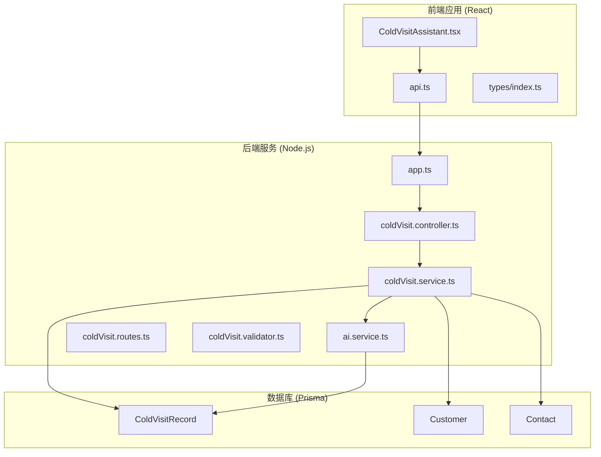
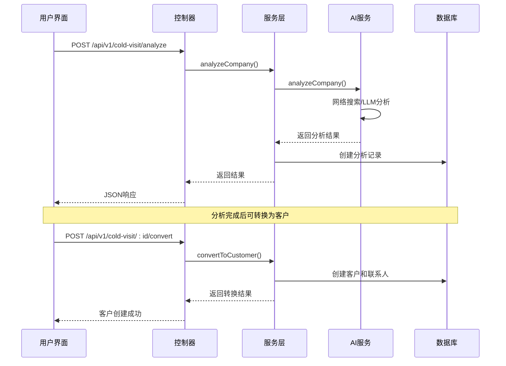
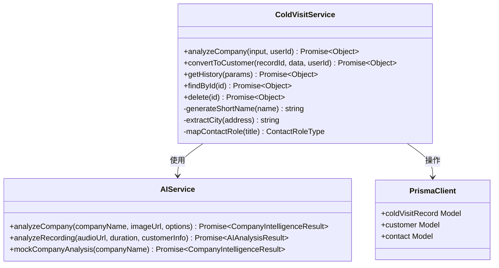
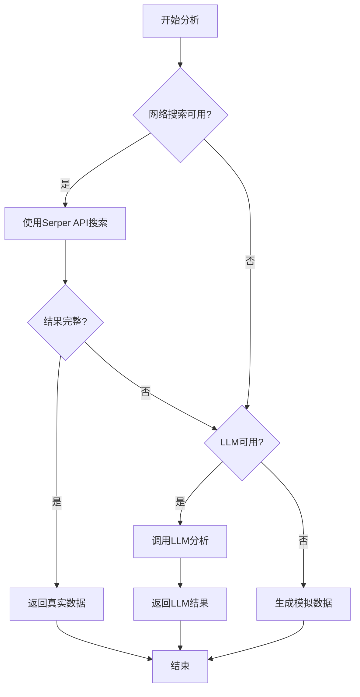
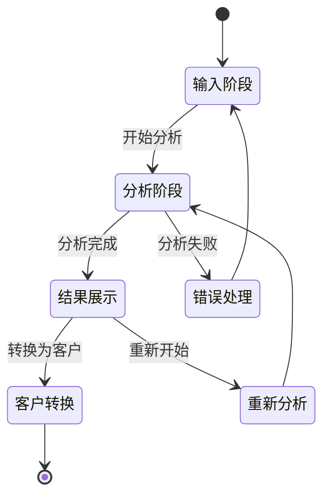
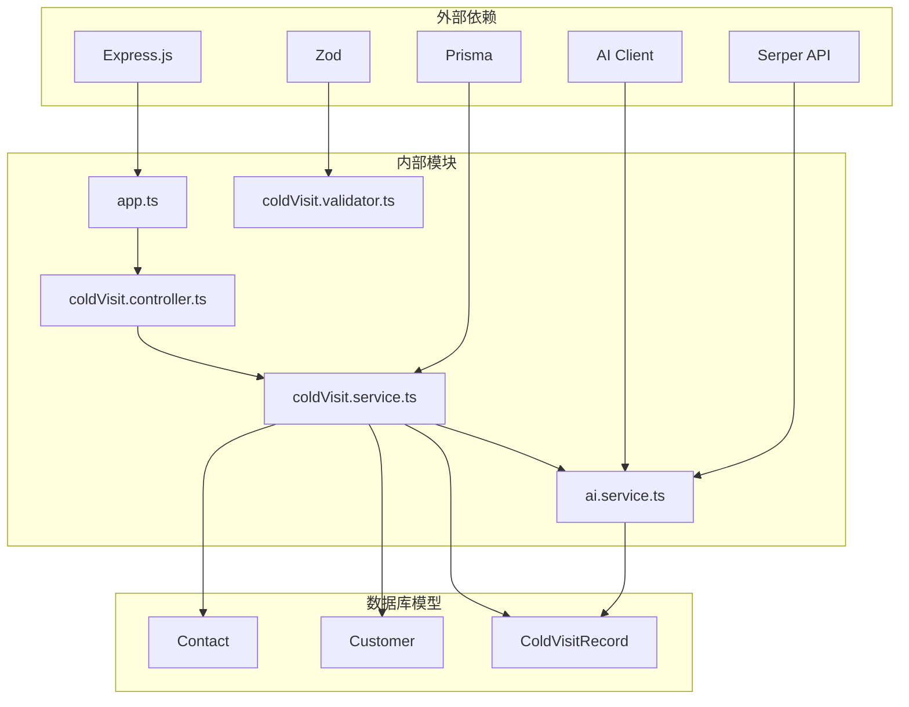
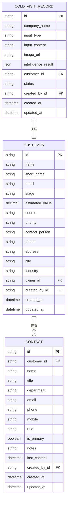

# 冷访问AI助手

<cite>
**本文档引用的文件**
- [app.ts](file://crm-backend/src/app.ts)
- [coldVisit.controller.ts](file://crm-backend/src/controllers/coldVisit.controller.ts)
- [coldVisit.service.ts](file://crm-backend/src/services/coldVisit.service.ts)
- [coldVisit.routes.ts](file://crm-backend/src/routes/coldVisit.routes.ts)
- [coldVisit.validator.ts](file://crm-backend/src/validators/coldVisit.validator.ts)
- [ai.service.ts](file://crm-backend/src/services/ai.service.ts)
- [schema.prisma](file://crm-backend/prisma/schema.prisma)
- [ColdVisitAssistant.tsx](file://crm-frontend/src/components/ColdVisitAssistant.tsx)
- [api.ts](file://crm-frontend/src/services/api.ts)
- [index.ts](file://crm-frontend/src/types/index.ts)
</cite>

## 目录
1. [项目概述](#项目概述)
2. [项目结构](#项目结构)
3. [核心组件](#核心组件)
4. [架构概览](#架构概览)
5. [详细组件分析](#详细组件分析)
6. [依赖关系分析](#依赖关系分析)
7. [性能考虑](#性能考虑)
8. [故障排除指南](#故障排除指南)
9. [结论](#结论)

## 项目概述

冷访问AI助手是销售AI CRM系统中的核心功能模块，旨在为销售人员提供智能化的企业信息分析和客户开发辅助工具。该系统通过集成AI技术，能够自动分析企业信息、生成个性化销售话术，并协助将潜在客户转化为正式客户。

### 主要功能特性

- **智能企业分析**：支持通过公司名称或图片进行企业信息智能分析
- **销售话术生成**：基于AI分析结果生成个性化的销售开场白和谈判要点
- **客户转换**：将分析结果自动转换为客户档案，包含关键联系人信息
- **多模态输入**：支持文本输入和图片上传两种分析方式
- **智能降级机制**：在网络搜索和AI服务不可用时提供模拟分析功能

## 项目结构

**图表来源**
- [app.ts:1-88](file://crm-backend/src/app.ts#L1-L88)
- [coldVisit.controller.ts:1-96](file://crm-backend/src/controllers/coldVisit.controller.ts#L1-L96)
- [coldVisit.service.ts:1-334](file://crm-backend/src/services/coldVisit.service.ts#L1-L334)
- [schema.prisma:742-764](file://crm-backend/prisma/schema.prisma#L742-L764)

**章节来源**
- [app.ts:1-88](file://crm-backend/src/app.ts#L1-L88)
- [coldVisit.controller.ts:1-96](file://crm-backend/src/controllers/coldVisit.controller.ts#L1-L96)
- [coldVisit.service.ts:1-334](file://crm-backend/src/services/coldVisit.service.ts#L1-L334)
- [coldVisit.routes.ts:1-55](file://crm-backend/src/routes/coldVisit.routes.ts#L1-L55)

## 核心组件

### 后端架构组件

#### 1. 控制器层 (Controller Layer)
负责HTTP请求处理和响应格式化，提供RESTful API接口。

#### 2. 服务层 (Service Layer)
实现核心业务逻辑，包括企业分析、客户转换、数据验证等功能。

#### 3. 数据访问层 (Repository Layer)
通过Prisma ORM与数据库交互，管理数据持久化。

#### 4. AI服务层
集成多种AI能力，包括企业信息分析、情感分析、关键词提取等。

### 前端架构组件

#### 1. 组件层
提供用户界面交互，包括分析输入、结果展示、客户转换等功能。

#### 2. 服务层
封装API调用，处理认证、错误处理和数据转换。

#### 3. 类型定义
提供完整的TypeScript类型定义，确保类型安全。

**章节来源**
- [coldVisit.controller.ts:1-96](file://crm-backend/src/controllers/coldVisit.controller.ts#L1-L96)
- [coldVisit.service.ts:1-334](file://crm-backend/src/services/coldVisit.service.ts#L1-L334)
- [ColdVisitAssistant.tsx:1-547](file://crm-frontend/src/components/ColdVisitAssistant.tsx#L1-L547)

## 架构概览

**图表来源**
- [coldVisit.controller.ts:14-43](file://crm-backend/src/controllers/coldVisit.controller.ts#L14-L43)
- [coldVisit.service.ts:45-102](file://crm-backend/src/services/coldVisit.service.ts#L45-L102)
- [ai.service.ts:464-504](file://crm-backend/src/services/ai.service.ts#L464-L504)

**章节来源**
- [coldVisit.routes.ts:1-55](file://crm-backend/src/routes/coldVisit.routes.ts#L1-L55)
- [coldVisit.controller.ts:1-96](file://crm-backend/src/controllers/coldVisit.controller.ts#L1-L96)

## 详细组件分析

### 冷访问服务 (ColdVisitService)

冷访问服务是整个系统的核心，负责处理所有与冷访问相关的业务逻辑。

#### 核心功能

1. **企业信息分析**
   - 支持文本和图片两种输入方式
   - 调用AI服务进行智能分析
   - 存储分析结果到数据库

2. **客户转换**
   - 将分析记录转换为客户档案
   - 自动创建关键联系人
   - 管理转换状态

3. **数据管理**
   - 历史记录查询
   - 单条记录获取
   - 记录删除

**图表来源**
- [coldVisit.service.ts:39-334](file://crm-backend/src/services/coldVisit.service.ts#L39-L334)
- [ai.service.ts:75-734](file://crm-backend/src/services/ai.service.ts#L75-L734)

**章节来源**
- [coldVisit.service.ts:1-334](file://crm-backend/src/services/coldVisit.service.ts#L1-L334)

### AI智能分析服务

AI服务提供了强大的智能分析能力，支持多种分析场景。

#### 分析能力

1. **企业信息分析**
   - 网络搜索获取真实企业信息
   - LLM生成推测性信息
   - 模拟数据降级方案

2. **销售话术生成**
   - 基于行业和业务范围生成个性化话术
   - 识别客户痛点和谈判要点
   - 提供异议处理方案

3. **情感分析**
   - 通话录音情感分析
   - 关键词提取
   - 摘要生成

**图表来源**
- [ai.service.ts:464-504](file://crm-backend/src/services/ai.service.ts#L464-L504)

**章节来源**
- [ai.service.ts:1-734](file://crm-backend/src/services/ai.service.ts#L1-L734)

### 前端用户界面组件

前端提供了直观易用的用户界面，支持完整的冷访问工作流程。

#### 功能特性

1. **多模态输入**
   - 文本输入框支持公司名称
   - 图片上传支持门牌、宣传资料等
   - 实时预览功能

2. **智能结果显示**
   - 企业基本信息卡片
   - 关键联系人展示
   - 销售话术面板

3. **工作流管理**
   - 分析历史记录
   - 客户转换流程
   - 数据导出功能

**图表来源**
- [ColdVisitAssistant.tsx:19-547](file://crm-frontend/src/components/ColdVisitAssistant.tsx#L19-L547)

**章节来源**
- [ColdVisitAssistant.tsx:1-547](file://crm-frontend/src/components/ColdVisitAssistant.tsx#L1-L547)

## 依赖关系分析

**图表来源**
- [app.ts:1-11](file://crm-backend/src/app.ts#L1-L11)
- [coldVisit.service.ts:6-8](file://crm-backend/src/services/coldVisit.service.ts#L6-L8)
- [ai.service.ts:7-9](file://crm-backend/src/services/ai.service.ts#L7-L9)

**章节来源**
- [schema.prisma:742-764](file://crm-backend/prisma/schema.prisma#L742-L764)

### 数据模型关系

**图表来源**
- [schema.prisma:744-764](file://crm-backend/prisma/schema.prisma#L744-L764)
- [schema.prisma:194-265](file://crm-backend/prisma/schema.prisma#L194-L265)
- [schema.prisma:576-602](file://crm-backend/prisma/schema.prisma#L576-L602)

**章节来源**
- [schema.prisma:1-1216](file://crm-backend/prisma/schema.prisma#L1-L1216)

## 性能考虑

### 1. 缓存策略
- AI分析结果缓存
- 网络搜索结果缓存
- 数据库查询结果缓存

### 2. 异步处理
- 异步AI分析调用
- 批量数据处理
- 异常情况降级处理

### 3. 资源优化
- 图片压缩和优化
- 分页查询优化
- 数据传输压缩

### 4. 并发控制
- 请求限流
- 并发连接数控制
- 数据库连接池管理

## 故障排除指南

### 常见问题及解决方案

#### 1. AI服务不可用
**症状**：分析功能无法正常使用
**解决方案**：
- 检查AI服务配置
- 验证API密钥设置
- 查看网络连接状态

#### 2. 数据库连接失败
**症状**：系统启动时报数据库连接错误
**解决方案**：
- 检查数据库URL配置
- 验证数据库服务状态
- 确认用户权限设置

#### 3. 文件上传失败
**症状**：图片上传功能异常
**解决方案**：
- 检查文件大小限制
- 验证文件类型支持
- 确认存储路径权限

#### 4. 前端组件加载失败
**症状**：冷访问助手组件无法显示
**解决方案**：
- 检查API端点配置
- 验证认证状态
- 查看浏览器控制台错误

**章节来源**
- [coldVisit.service.ts:89-101](file://crm-backend/src/services/coldVisit.service.ts#L89-L101)
- [ai.service.ts:492-504](file://crm-backend/src/services/ai.service.ts#L492-L504)

## 结论

冷访问AI助手是一个功能完整、架构清晰的销售辅助系统。通过集成AI技术和现代化的前后端架构，该系统能够显著提升销售团队的工作效率和客户开发成功率。

### 系统优势

1. **智能化程度高**：AI驱动的企业分析和销售话术生成
2. **用户体验优秀**：直观的界面设计和流畅的操作流程
3. **扩展性强**：模块化架构便于功能扩展和维护
4. **可靠性高**：完善的错误处理和降级机制

### 发展方向

1. **AI能力增强**：集成更多AI模型和算法
2. **移动端支持**：开发移动应用版本
3. **多语言支持**：国际化语言适配
4. **集成生态**：与其他业务系统的深度集成

该系统为现代销售团队提供了强有力的技术支撑，有助于提升销售效率和客户满意度。