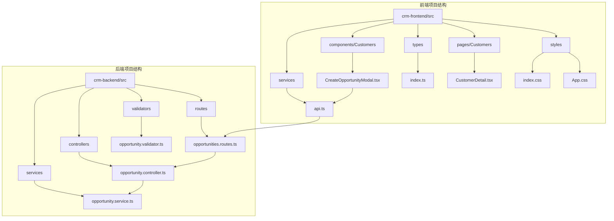
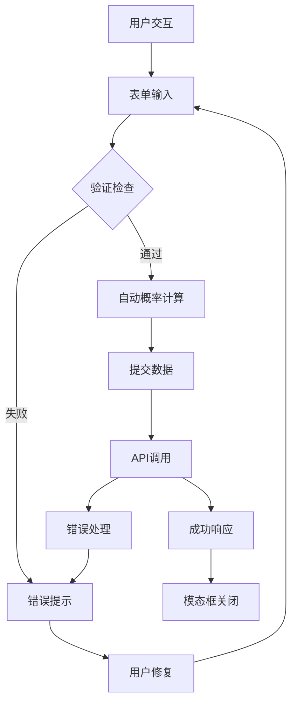
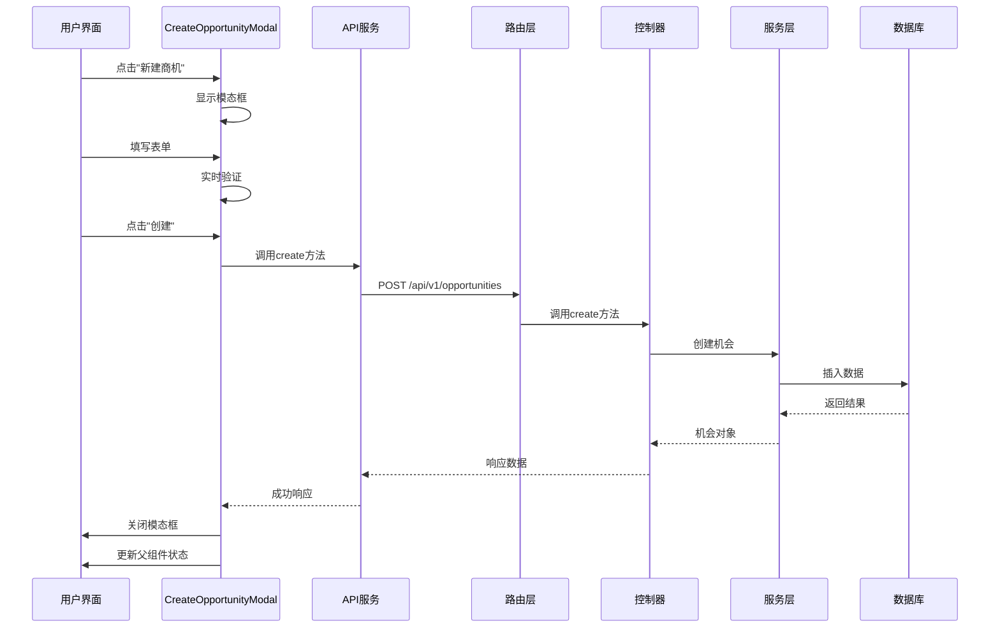
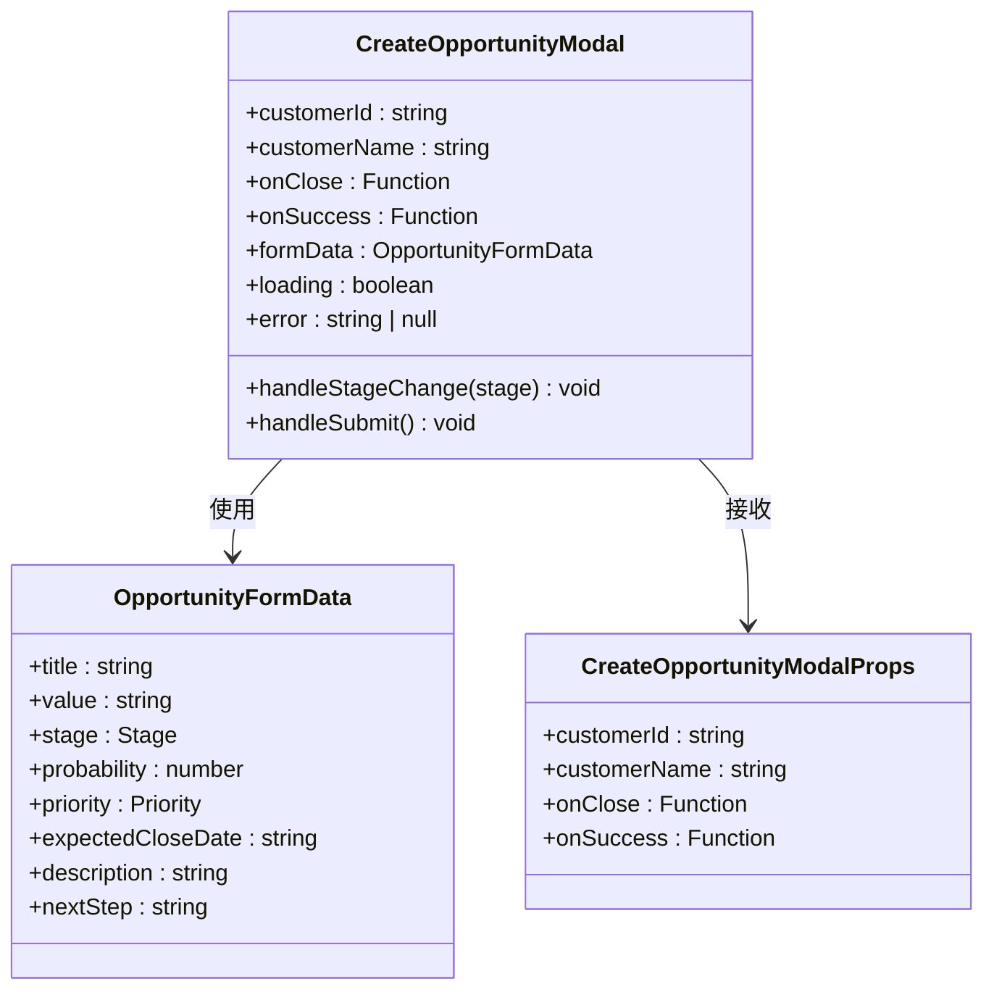
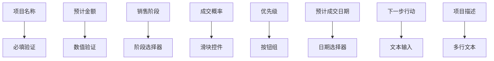
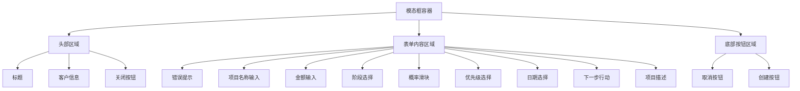
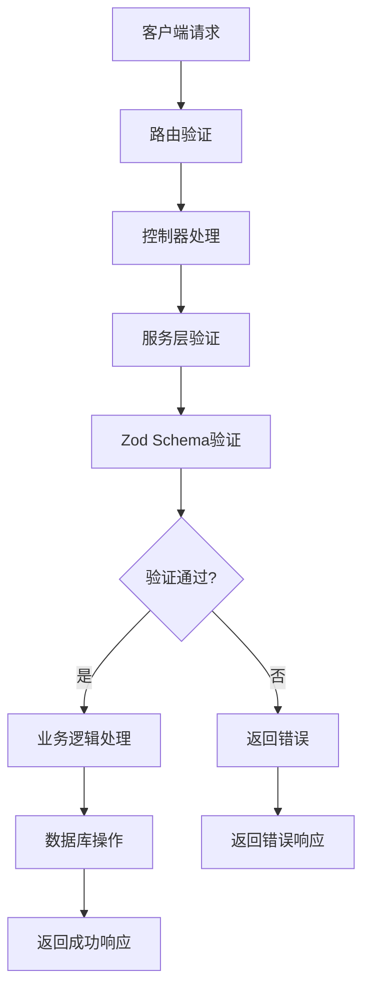
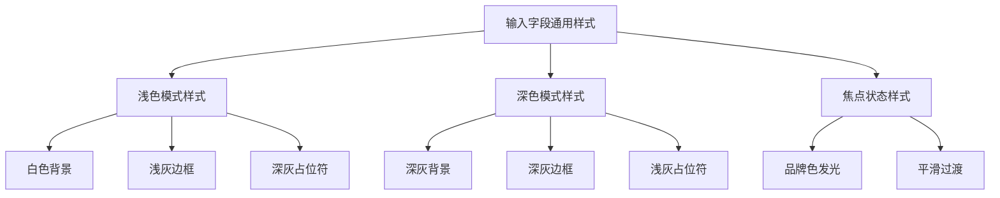
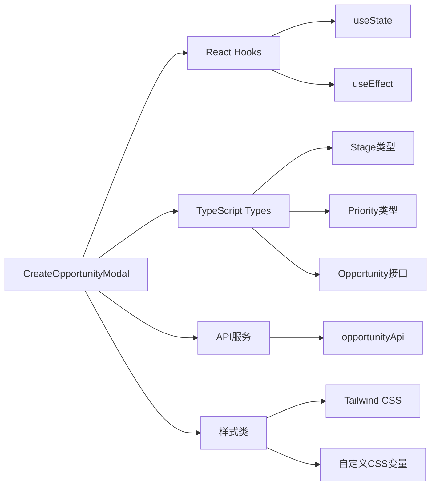
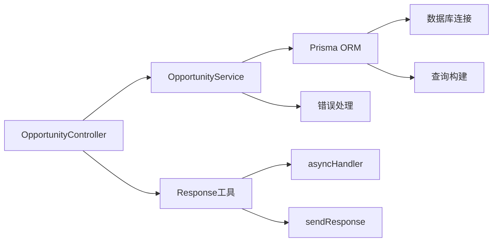

# 创建机会模态框组件

<cite>
**本文档引用的文件**
- [CreateOpportunityModal.tsx](file://crm-frontend/src/components/Customers/CreateOpportunityModal.tsx)
- [opportunity.controller.ts](file://crm-backend/src/controllers/opportunity.controller.ts)
- [opportunity.service.ts](file://crm-backend/src/services/opportunity.service.ts)
- [opportunities.routes.ts](file://crm-backend/src/routes/opportunities.routes.ts)
- [opportunity.validator.ts](file://crm-backend/src/validators/opportunity.validator.ts)
- [api.ts](file://crm-frontend/src/services/api.ts)
- [CustomerDetail.tsx](file://crm-frontend/src/pages/Customers/CustomerDetail.tsx)
- [index.ts](file://crm-frontend/src/types/index.ts)
- [opportunities.ts](file://crm-frontend/src/data/opportunities.ts)
- [App.css](file://crm-frontend/src/App.css)
- [index.css](file://crm-frontend/src/index.css)
</cite>

## 更新摘要
**变更内容**
- 更新了表单样式部分，反映了输入字段背景色、边框色和占位符文本对比度的视觉一致性改进
- 新增了样式改进的技术细节分析
- 更新了UI组件层次图以体现最新的样式设计

## 目录
1. [简介](#简介)
2. [项目结构](#项目结构)
3. [核心组件](#核心组件)
4. [架构概览](#架构概览)
5. [详细组件分析](#详细组件分析)
6. [样式改进分析](#样式改进分析)
7. [依赖关系分析](#依赖关系分析)
8. [性能考虑](#性能考虑)
9. [故障排除指南](#故障排除指南)
10. [结论](#结论)

## 简介

创建机会模态框组件是销售AI CRM系统中的一个关键UI组件，用于从客户详情页面快速创建新的销售机会。该组件提供了直观的表单界面，支持多种销售阶段、优先级设置、金额管理和预测功能，是整个销售管理流程的重要入口点。

该组件采用现代化的React Hooks模式，结合TypeScript类型安全，确保了良好的开发体验和运行时稳定性。组件设计遵循响应式布局原则，支持深色模式切换，为用户提供优质的视觉体验。

**更新** 组件在视觉设计上实现了统一的样式改进，包括输入字段背景色从浅灰改为白色、边框色优化以及占位符文本对比度提升，确保了更好的视觉一致性和用户体验。

## 项目结构

销售AI CRM系统采用前后端分离架构，机会模态框组件位于前端项目中，具体位置如下：



**图表来源**
- [CreateOpportunityModal.tsx:1-316](file://crm-frontend/src/components/Customers/CreateOpportunityModal.tsx#L1-L316)
- [api.ts:233-252](file://crm-frontend/src/services/api.ts#L233-L252)
- [opportunities.routes.ts:1-17](file://crm-backend/src/routes/opportunities.routes.ts#L1-L17)

**章节来源**
- [CreateOpportunityModal.tsx:1-316](file://crm-frontend/src/components/Customers/CreateOpportunityModal.tsx#L1-L316)
- [CustomerDetail.tsx:1-337](file://crm-frontend/src/pages/Customers/CustomerDetail.tsx#L1-L337)

## 核心组件

### 组件概述

创建机会模态框组件是一个功能完整的React函数组件，提供以下核心功能：

- **表单验证**：实时验证必填字段和数据格式
- **阶段管理**：支持8种标准销售阶段
- **概率计算**：根据销售阶段自动计算成交概率
- **优先级设置**：高、中、低三个优先级选项
- **金额格式化**：支持大额数字的友好显示
- **错误处理**：完善的错误状态管理和用户反馈

### 主要特性



**图表来源**
- [CreateOpportunityModal.tsx:80-109](file://crm-frontend/src/components/Customers/CreateOpportunityModal.tsx#L80-L109)

**章节来源**
- [CreateOpportunityModal.tsx:50-316](file://crm-frontend/src/components/Customers/CreateOpportunityModal.tsx#L50-L316)

## 架构概览

### 前后端交互架构

机会模态框组件采用标准的前后端分离架构，通过RESTful API进行数据交换：



**图表来源**
- [api.ts:233-252](file://crm-frontend/src/services/api.ts#L233-L252)
- [opportunities.routes.ts:12](file://crm-backend/src/routes/opportunities.routes.ts#L12)
- [opportunity.controller.ts:28-32](file://crm-backend/src/controllers/opportunity.controller.ts#L28-L32)

### 数据流架构

```mermaid
graph LR
subgraph "前端数据流"
A[CreateOpportunityModal] --> B[表单状态]
B --> C[验证逻辑]
C --> D[API调用]
D --> E[响应处理]
E --> F[状态更新]
end
subgraph "后端数据流"
G[路由] --> H[控制器]
H --> I[服务层]
I --> J[数据库操作]
J --> I
I --> H
H --> G
end
D < --> G
F < --> A
```

**图表来源**
- [CreateOpportunityModal.tsx:56-109](file://crm-frontend/src/components/Customers/CreateOpportunityModal.tsx#L56-L109)
- [opportunity.service.ts:70-85](file://crm-backend/src/services/opportunity.service.ts#L70-L85)

**章节来源**
- [api.ts:1-1363](file://crm-frontend/src/services/api.ts#L1-L1363)
- [opportunity.controller.ts:1-59](file://crm-backend/src/controllers/opportunity.controller.ts#L1-L59)

## 详细组件分析

### 组件结构分析

#### 状态管理

组件使用React Hooks进行状态管理，包括：

- **表单状态**：管理所有输入字段的状态
- **加载状态**：控制提交过程中的UI反馈
- **错误状态**：处理各种异常情况



**图表来源**
- [CreateOpportunityModal.tsx:11-28](file://crm-frontend/src/components/Customers/CreateOpportunityModal.tsx#L11-L28)
- [CreateOpportunityModal.tsx:50-55](file://crm-frontend/src/components/Customers/CreateOpportunityModal.tsx#L50-L55)

#### 销售阶段映射

组件内置了完整的销售阶段映射系统：

| 阶段标识 | 中文标签 | 默认概率 |
|---------|---------|---------|
| new_lead | 新线索 | 20% |
| contacted | 已联系 | 30% |
| solution | 方案建议 | 45% |
| quoted | 已报价 | 55% |
| negotiation | 商务谈判 | 65% |
| procurement_process | 采购流程中 | 75% |
| contract_stage | 合同阶段中 | 85% |
| won | 已成交 | 100% |

**章节来源**
- [CreateOpportunityModal.tsx:31-40](file://crm-frontend/src/components/Customers/CreateOpportunityModal.tsx#L31-L40)

### 表单设计分析

#### 输入字段设计

组件提供了丰富的输入字段，每个字段都有明确的用途和验证规则：



**图表来源**
- [CreateOpportunityModal.tsx:140-283](file://crm-frontend/src/components/Customers/CreateOpportunityModal.tsx#L140-L283)

#### UI组件层次



**图表来源**
- [CreateOpportunityModal.tsx:111-316](file://crm-frontend/src/components/Customers/CreateOpportunityModal.tsx#L111-L316)

**章节来源**
- [CreateOpportunityModal.tsx:111-316](file://crm-frontend/src/components/Customers/CreateOpportunityModal.tsx#L111-L316)

### 后端集成分析

#### API接口设计

后端提供了完整的RESTful API接口：

| 方法 | 端点 | 功能 | 请求体 | 响应 |
|------|------|------|--------|------|
| GET | /opportunities | 获取机会列表 | 查询参数 | 机会数组 |
| GET | /opportunities/:id | 获取单个机会 | - | 机会对象 |
| POST | /opportunities | 创建机会 | CreateOpportunityInput | 新机会 |
| PUT | /opportunities/:id | 更新机会 | UpdateOpportunityInput | 更新后的机会 |
| DELETE | /opportunities/:id | 删除机会 | - | 删除结果 |
| PATCH | /opportunities/:id/stage | 移动阶段 | MoveStageInput | 更新后的机会 |

**章节来源**
- [opportunities.routes.ts:1-17](file://crm-backend/src/routes/opportunities.routes.ts#L1-L17)
- [opportunity.controller.ts:1-59](file://crm-backend/src/controllers/opportunity.controller.ts#L1-L59)

#### 数据验证

后端使用Zod进行严格的数据验证：



**图表来源**
- [opportunity.validator.ts:15-25](file://crm-backend/src/validators/opportunity.validator.ts#L15-L25)

**章节来源**
- [opportunity.validator.ts:1-43](file://crm-backend/src/validators/opportunity.validator.ts#L1-L43)

## 样式改进分析

### 视觉一致性改进

**更新** 组件在视觉设计上实现了全面的样式改进，确保了更好的用户体验和视觉一致性：

#### 输入字段样式优化

所有输入字段都采用了统一的设计规范：

- **背景色**：从浅灰色背景改为纯白色背景（`bg-white`），在深色模式下使用深灰色背景（`dark:bg-slate-900`）
- **边框设计**：使用统一的边框样式（`border border-slate-300 dark:border-slate-600`），确保在不同主题下的视觉一致性
- **占位符对比度**：显著提升了占位符文本的对比度（`placeholder:text-slate-400 dark:placeholder:text-slate-500`）

#### 深色模式适配

组件完全支持深色模式，所有颜色都经过精心调优：

- **文本颜色**：使用深色模式专用的颜色（`text-slate-900 dark:text-white`）
- **边框颜色**：深色模式下使用更深的灰色边框（`dark:border-slate-600`）
- **占位符颜色**：深色模式下使用更浅的灰色占位符（`dark:placeholder:text-slate-500`）

#### 焦点状态设计

输入字段在获得焦点时具有统一的视觉反馈：

- **边框发光效果**：使用品牌色的发光效果（`focus:ring-2 focus:ring-primary/50`）
- **过渡动画**：平滑的颜色和状态变化过渡

#### 组件样式层次



**图表来源**
- [CreateOpportunityModal.tsx:144-149](file://crm-frontend/src/components/Customers/CreateOpportunityModal.tsx#L144-L149)
- [CreateOpportunityModal.tsx:159-164](file://crm-frontend/src/components/Customers/CreateOpportunityModal.tsx#L159-L164)
- [CreateOpportunityModal.tsx:249-254](file://crm-frontend/src/components/Customers/CreateOpportunityModal.tsx#L249-L254)
- [CreateOpportunityModal.tsx:262-267](file://crm-frontend/src/components/Customers/CreateOpportunityModal.tsx#L262-L267)
- [CreateOpportunityModal.tsx:276-282](file://crm-frontend/src/components/Customers/CreateOpportunityModal.tsx#L276-L282)

**章节来源**
- [CreateOpportunityModal.tsx:144-149](file://crm-frontend/src/components/Customers/CreateOpportunityModal.tsx#L144-L149)
- [CreateOpportunityModal.tsx:159-164](file://crm-frontend/src/components/Customers/CreateOpportunityModal.tsx#L159-L164)
- [CreateOpportunityModal.tsx:249-254](file://crm-frontend/src/components/Customers/CreateOpportunityModal.tsx#L249-L254)
- [CreateOpportunityModal.tsx:262-267](file://crm-frontend/src/components/Customers/CreateOpportunityModal.tsx#L262-L267)
- [CreateOpportunityModal.tsx:276-282](file://crm-frontend/src/components/Customers/CreateOpportunityModal.tsx#L276-L282)

## 依赖关系分析

### 前端依赖关系



**图表来源**
- [CreateOpportunityModal.tsx:6-8](file://crm-frontend/src/components/Customers/CreateOpportunityModal.tsx#L6-L8)
- [index.ts:1-6](file://crm-frontend/src/types/index.ts#L1-L6)

### 后端依赖关系



**图表来源**
- [opportunity.controller.ts:1-3](file://crm-backend/src/controllers/opportunity.controller.ts#L1-L3)
- [opportunity.service.ts:1-3](file://crm-backend/src/services/opportunity.service.ts#L1-L3)

**章节来源**
- [CreateOpportunityModal.tsx:1-316](file://crm-frontend/src/components/Customers/CreateOpportunityModal.tsx#L1-L316)
- [opportunity.controller.ts:1-59](file://crm-backend/src/controllers/opportunity.controller.ts#L1-L59)

## 性能考虑

### 前端性能优化

1. **状态管理优化**：使用局部状态管理，避免不必要的重渲染
2. **事件处理优化**：使用防抖和节流机制处理高频输入
3. **条件渲染**：仅在需要时渲染复杂的UI元素
4. **懒加载**：对大型组件采用懒加载策略

### 后端性能优化

1. **数据库索引**：为常用查询字段建立索引
2. **分页查询**：实现高效的分页机制
3. **缓存策略**：对静态数据使用缓存
4. **批量操作**：支持批量数据处理

## 故障排除指南

### 常见问题及解决方案

#### 表单验证错误

**问题**：表单提交时出现验证错误
**解决方案**：
1. 检查必填字段是否填写完整
2. 验证数据格式是否正确
3. 确认金额输入为有效数字

#### API调用失败

**问题**：创建机会时API调用失败
**解决方案**：
1. 检查网络连接状态
2. 验证认证令牌有效性
3. 查看服务器响应状态码

#### 数据同步问题

**问题**：新创建的机会未显示在列表中
**解决方案**：
1. 刷新页面重新加载数据
2. 检查onSuccess回调函数
3. 验证父组件状态更新逻辑

#### 样式显示问题

**问题**：输入字段样式显示异常
**解决方案**：
1. 检查深色模式切换是否正常
2. 验证CSS类名拼写是否正确
3. 确认Tailwind CSS配置是否正确

**章节来源**
- [CreateOpportunityModal.tsx:80-109](file://crm-frontend/src/components/Customers/CreateOpportunityModal.tsx#L80-L109)
- [CustomerDetail.tsx:315-332](file://crm-frontend/src/pages/Customers/CustomerDetail.tsx#L315-L332)

## 结论

创建机会模态框组件是销售AI CRM系统中的重要组成部分，它提供了完整的销售机会创建功能。组件设计充分考虑了用户体验、数据安全性和系统性能，采用了现代化的开发技术和最佳实践。

**更新** 组件在视觉设计上的统一改进体现了对用户体验的重视，包括输入字段背景色的优化、边框色的一致性以及占位符文本对比度的提升，这些改进确保了在不同主题和设备上的良好显示效果。

该组件的成功实现展示了前后端分离架构的优势，通过清晰的接口设计和严格的验证机制，确保了系统的稳定性和可靠性。同时，组件的可扩展性为未来的功能增强奠定了良好基础。

通过深入分析组件的架构设计、数据流处理、错误处理机制以及最新的样式改进，我们可以更好地理解整个CRM系统的运作原理，为后续的开发和维护工作提供有价值的参考。