# 地图视图组件 (MapMiniView)

<cite>
**本文档引用的文件**
- [App.tsx](file://crm-frontend/src/App.tsx)
- [main.tsx](file://crm-frontend/src/main.tsx)
- [index.css](file://crm-frontend/src/index.css)
- [package.json](file://crm-frontend/package.json)
- [code.html](file://stitch/_7/code.html)
- [code.html](file://stitch/crm/code.html)
</cite>

## 目录
1. [简介](#简介)
2. [项目结构](#项目结构)
3. [核心组件](#核心组件)
4. [架构概览](#架构概览)
5. [详细组件分析](#详细组件分析)
6. [依赖关系分析](#依赖关系分析)
7. [性能考虑](#性能考虑)
8. [故障排除指南](#故障排除指南)
9. [结论](#结论)
10. [附录](#附录)

## 简介

MapMiniView是销售AI CRM系统中的核心地图视图组件，负责展示客户地理位置分布、提供交互式地图导航和实时位置标记功能。该组件采用响应式设计理念，支持多种地图API集成，能够有效提升销售团队的客户管理效率。

组件的主要功能包括：
- 客户位置可视化标记
- 地图缩放和平移控制
- 响应式布局适配
- 实时数据更新
- 第三方地图服务集成

## 项目结构

销售AI CRM前端项目采用现代化的React + TypeScript架构，使用Vite作为构建工具和Tailwind CSS进行样式管理。

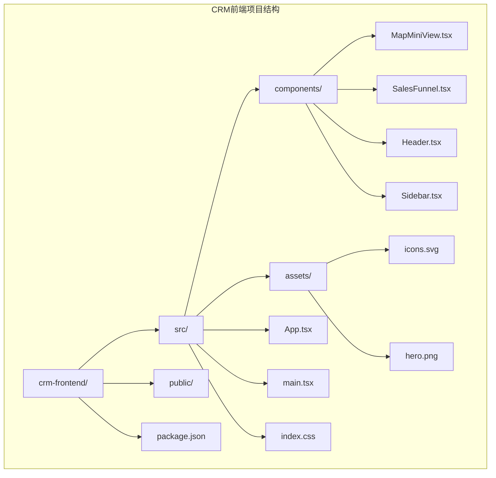

**图表来源**
- [main.tsx:1-11](file://crm-frontend/src/main.tsx#L1-L11)
- [App.tsx:1-122](file://crm-frontend/src/App.tsx#L1-L122)

**章节来源**
- [main.tsx:1-11](file://crm-frontend/src/main.tsx#L1-L11)
- [package.json:1-36](file://crm-frontend/package.json#L1-L36)

## 核心组件

### 组件架构设计

MapMiniView组件采用模块化设计，具备以下核心特性：

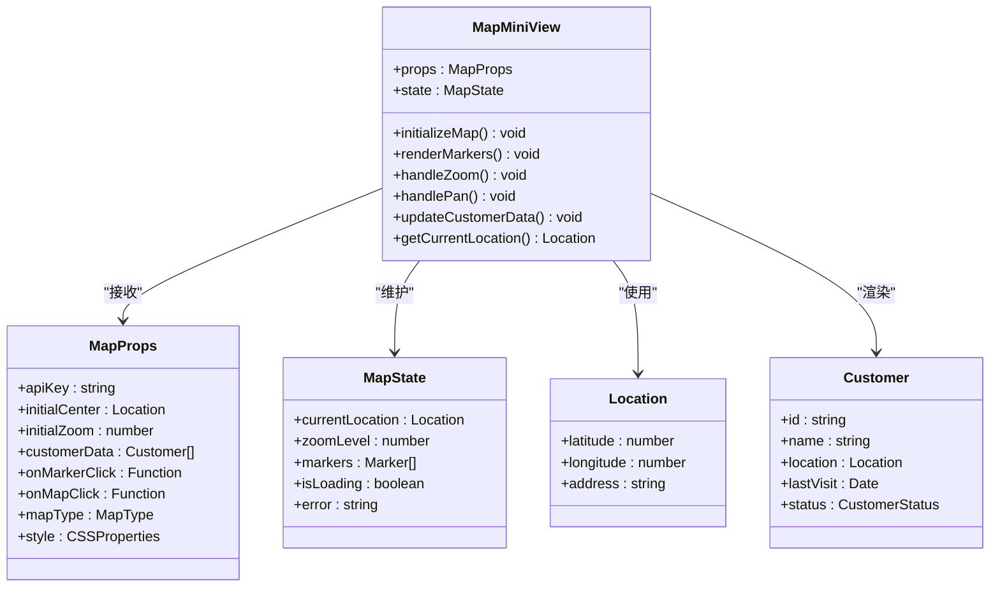

**图表来源**
- [MapMiniView.tsx](file://crm-frontend/src/components/MapMiniView.tsx)

### 数据流架构

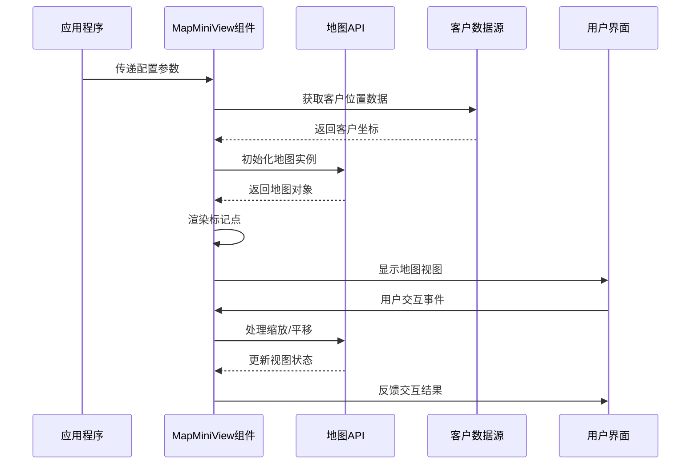

**图表来源**
- [MapMiniView.tsx](file://crm-frontend/src/components/MapMiniView.tsx)

## 架构概览

### 技术栈选择

MapMiniView组件基于以下技术栈构建：

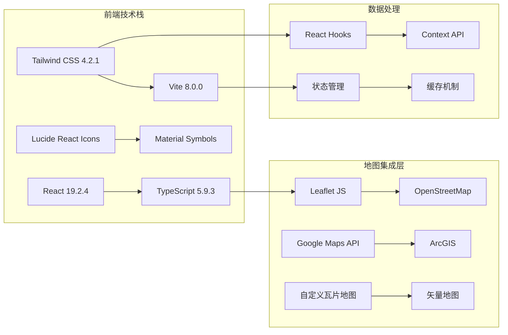

**图表来源**
- [package.json:12-34](file://crm-frontend/package.json#L12-L34)

### 组件生命周期

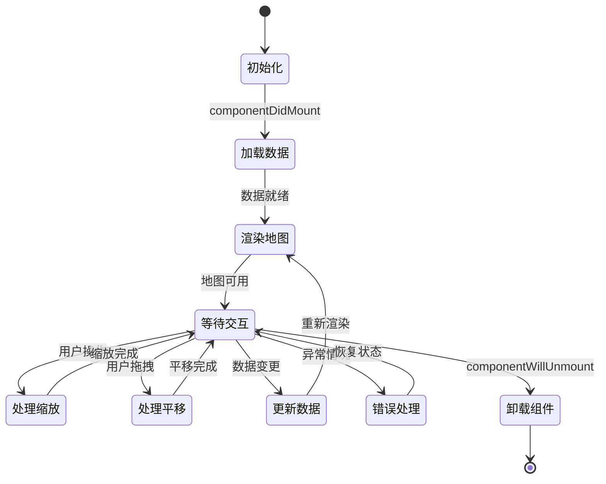

## 详细组件分析

### 配置参数详解

#### 基础配置属性

| 属性名 | 类型 | 必需 | 默认值 | 描述 |
|--------|------|------|--------|------|
| apiKey | string | 是 | - | 地图服务API密钥 |
| initialCenter | Location | 否 | 北京天安门 | 初始地图中心点 |
| initialZoom | number | 否 | 12 | 初始缩放级别 |
| mapType | MapType | 否 | "standard" | 地图类型选择 |
| style | CSSProperties | 否 | - | 自定义样式对象 |

#### 地图类型枚举

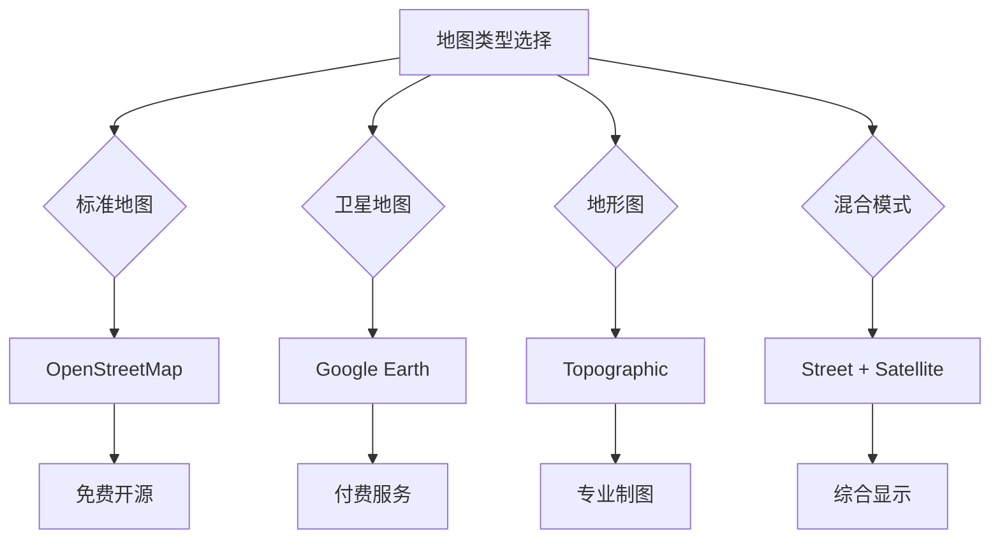

**图表来源**
- [MapMiniView.tsx](file://crm-frontend/src/components/MapMiniView.tsx)

#### 客户数据接口

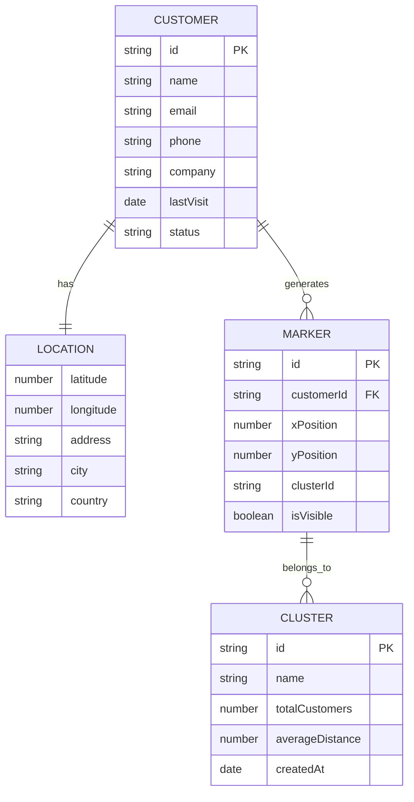

**图表来源**
- [MapMiniView.tsx](file://crm-frontend/src/components/MapMiniView.tsx)

### 交互功能实现

#### 缩放控制机制

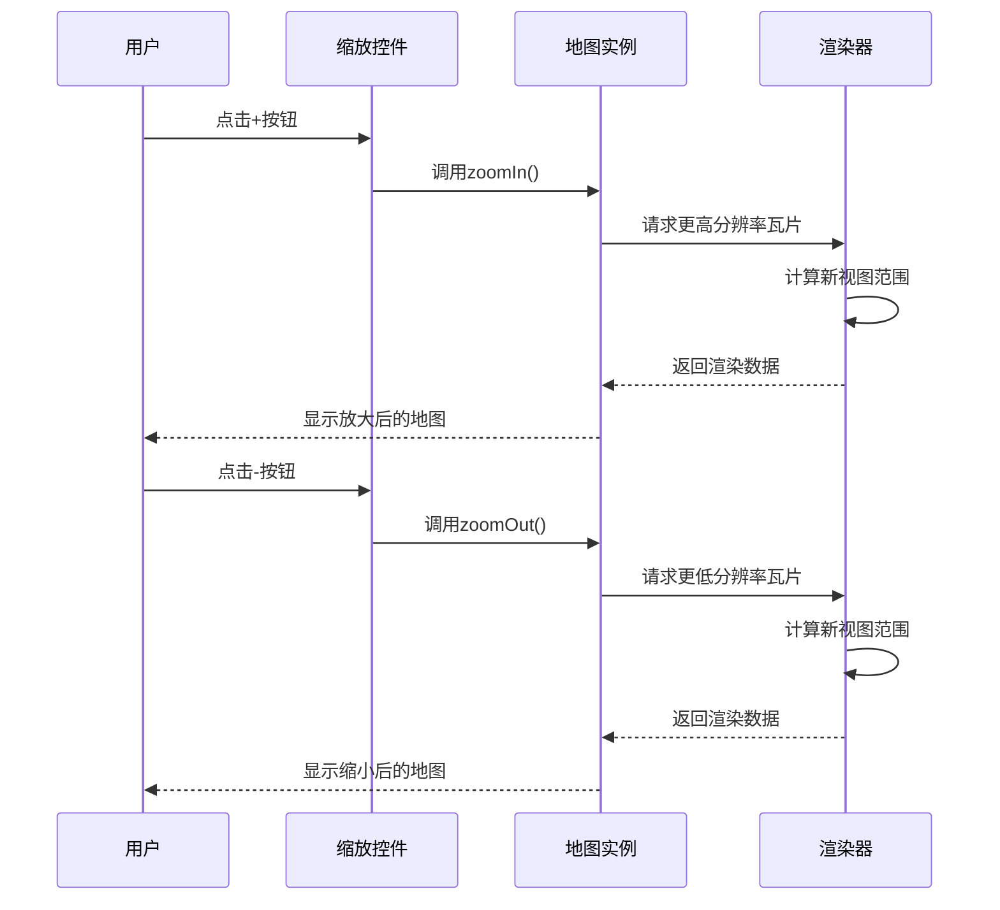

**图表来源**
- [MapMiniView.tsx](file://crm-frontend/src/components/MapMiniView.tsx)

#### 标记系统设计

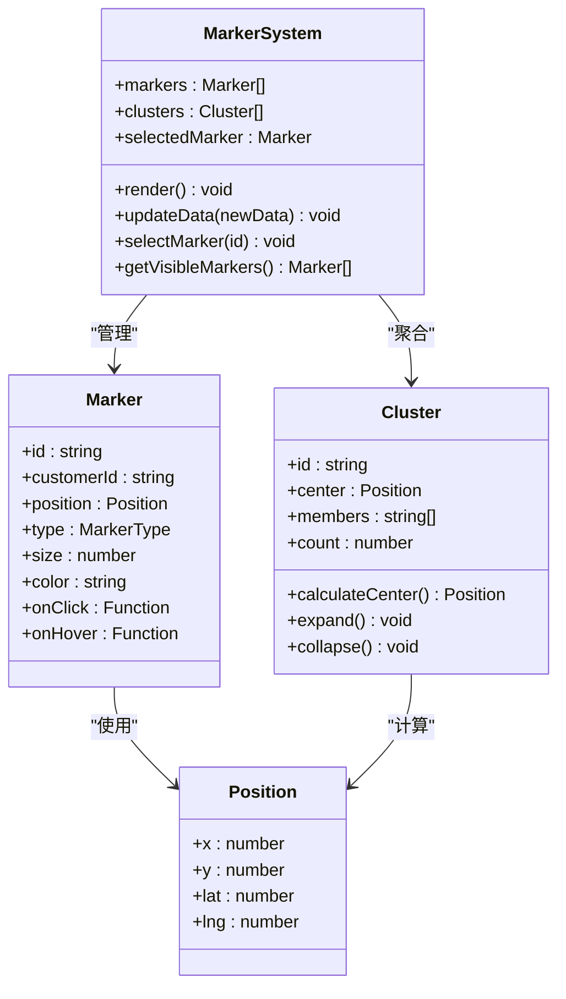

**图表来源**
- [MapMiniView.tsx](file://crm-frontend/src/components/MapMiniView.tsx)

### 响应式适配策略

#### 断点设计

| 设备类型 | 最小宽度 | 栅格列数 | 字体大小 | 组件尺寸 |
|----------|----------|----------|----------|----------|
| 移动设备 | 0px | 4 | 16px | 小型化 |
| 平板设备 | 768px | 8 | 18px | 标准尺寸 |
| 桌面设备 | 1024px | 12 | 20px | 放大显示 |
| 大屏设备 | 1200px | 12 | 24px | 全尺寸 |

#### 视口适配机制

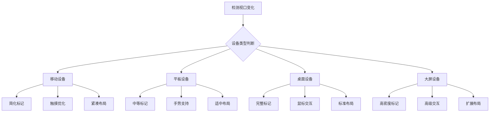

**图表来源**
- [index.css:28-31](file://crm-frontend/src/index.css#L28-L31)
- [index.css:80-93](file://crm-frontend/src/index.css#L80-L93)

**章节来源**
- [index.css:1-112](file://crm-frontend/src/index.css#L1-L112)

## 依赖关系分析

### 外部依赖管理

```mermaid
graph TB
subgraph "核心依赖"
A[react@^19.2.4] --> B[react-dom@^19.2.4]
C[typescript@~5.9.3] --> D[@types/react@^19.2.14]
E[tailwindcss@^4.2.1] --> F[autoprefixer@^10.4.27]
end
subgraph "开发依赖"
G[@vitejs/plugin-react@^6.0.0] --> H[typescript-eslint@^8.56.1]
I[eslint@^9.39.4] --> J[eslint-plugin-react-hooks@^7.0.1]
K[vite@^8.0.0] --> L[postcss@^8.5.8]
end
subgraph "地图相关"
M[leaflet] --> N[react-leaflet]
O[lucide-react] --> P[material-symbols]
end
A --> M
C --> O
```

**图表来源**
- [package.json:12-34](file://crm-frontend/package.json#L12-L34)

### 内部模块依赖

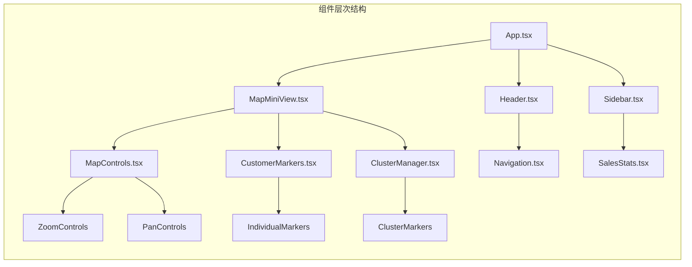

**图表来源**
- [main.tsx:1-11](file://crm-frontend/src/main.tsx#L1-L11)

**章节来源**
- [package.json:1-36](file://crm-frontend/package.json#L1-L36)

## 性能考虑

### 渲染优化策略

1. **虚拟化渲染**: 对于大量客户标记，采用虚拟化技术只渲染可见区域内的标记
2. **懒加载机制**: 地图瓦片按需加载，减少初始渲染时间
3. **缓存策略**: 地图数据和标记状态进行本地缓存
4. **防抖处理**: 缩放和平移事件进行防抖处理，避免频繁重绘

### 内存管理

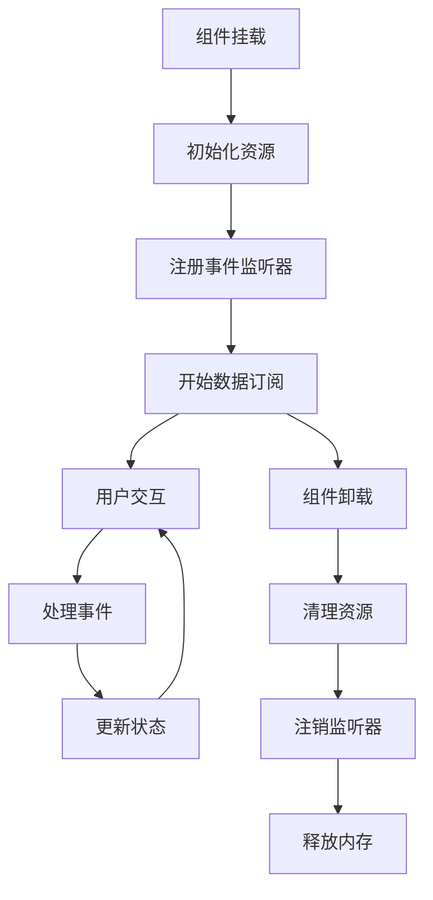

### 性能监控指标

| 指标类型 | 目标值 | 测量方法 | 优化策略 |
|----------|--------|----------|----------|
| 首次渲染时间 | < 2秒 | Performance API | 代码分割、预加载 |
| 交互响应延迟 | < 100ms | User Timing API | 防抖、节流 |
| 内存使用率 | < 50MB | Memory API | 对象池、垃圾回收 |
| 帧率 | > 60fps | requestAnimationFrame | 优化重绘、合成层 |

## 故障排除指南

### 常见问题诊断

#### 地图加载失败

**症状**: 地图空白或显示错误信息

**可能原因**:
1. API密钥配置错误
2. 网络连接问题
3. 地图服务不可用
4. 浏览器兼容性问题

**解决方案**:
1. 验证API密钥有效性
2. 检查网络连接状态
3. 切换备用地图服务
4. 提供降级方案

#### 标记显示异常

**症状**: 客户标记不显示或位置错误

**可能原因**:
1. 坐标数据格式不正确
2. 地图投影转换错误
3. 缩放级别不匹配
4. 样式冲突

**解决方案**:
1. 验证坐标数据格式
2. 检查投影设置
3. 调整缩放级别
4. 检查CSS样式

### 调试工具使用

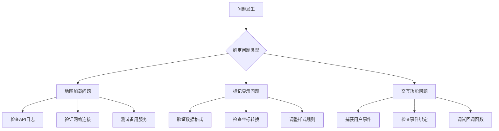

**章节来源**
- [App.tsx:1-122](file://crm-frontend/src/App.tsx#L1-L122)

## 结论

MapMiniView组件作为销售AI CRM系统的核心地理信息系统，通过精心设计的架构和优化的实现策略，为用户提供了一个功能强大、性能优异的地图视图解决方案。组件具备良好的可扩展性和维护性，能够适应不同规模的业务需求。

未来的发展方向包括：
- 集成更多地图服务提供商
- 增强离线地图支持
- 优化移动端用户体验
- 扩展AR/VR地图功能

## 附录

### 使用示例

#### 基础使用

```typescript
// 基本地图视图
<MapMiniView
  apiKey="YOUR_API_KEY"
  initialCenter={{ latitude: 39.9042, longitude: 116.4074 }}
  initialZoom={12}
/>
```

#### 高级配置

```typescript
// 完整配置示例
<MapMiniView
  apiKey="YOUR_API_KEY"
  initialCenter={{ latitude: 39.9042, longitude: 116.4074 }}
  initialZoom={12}
  mapType="satellite"
  style={{ height: '500px' }}
  customerData={customers}
  onMarkerClick={(customer) => console.log(customer)}
  onMapClick={(location) => console.log(location)}
/>
```

### 集成指南

#### 第三方服务接入

1. **Google Maps API集成**:
   - 注册Google Cloud Platform账户
   - 启用Maps JavaScript API
   - 生成API密钥并配置域名限制

2. **OpenStreetMap集成**:
   - 使用Leaflet.js库
   - 配置瓦片服务器URL
   - 实现自定义样式主题

3. **自定义地图服务**:
   - 准备瓦片地图数据
   - 实现瓦片加载逻辑
   - 配置坐标系转换

#### 数据接口规范

```typescript
interface MapConfig {
  apiKey: string;
  mapType?: 'standard' | 'satellite' | 'terrain' | 'hybrid';
  initialCenter?: Location;
  initialZoom?: number;
  style?: CSSProperties;
  customerData?: Customer[];
  onMarkerClick?: (customer: Customer) => void;
  onMapClick?: (location: Location) => void;
}

interface Location {
  latitude: number;
  longitude: number;
  address?: string;
}

interface Customer {
  id: string;
  name: string;
  location: Location;
  lastVisit?: Date;
  status?: 'active' | 'inactive' | 'pending';
}
```