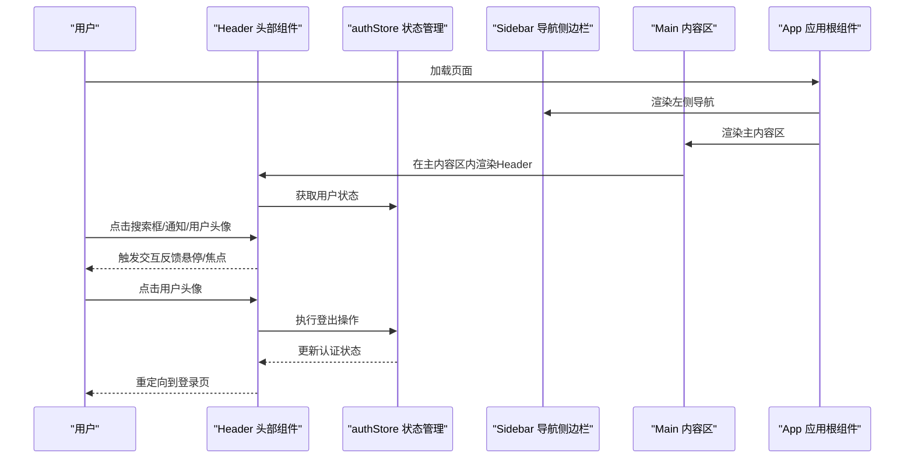
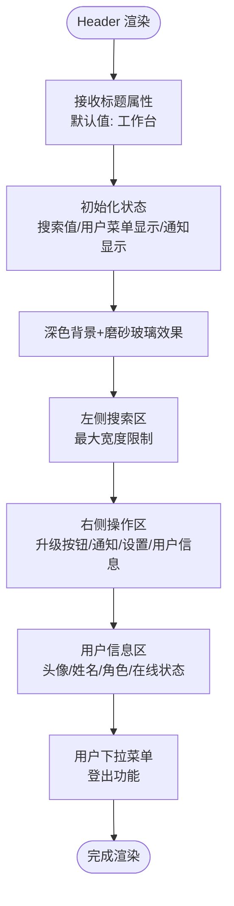
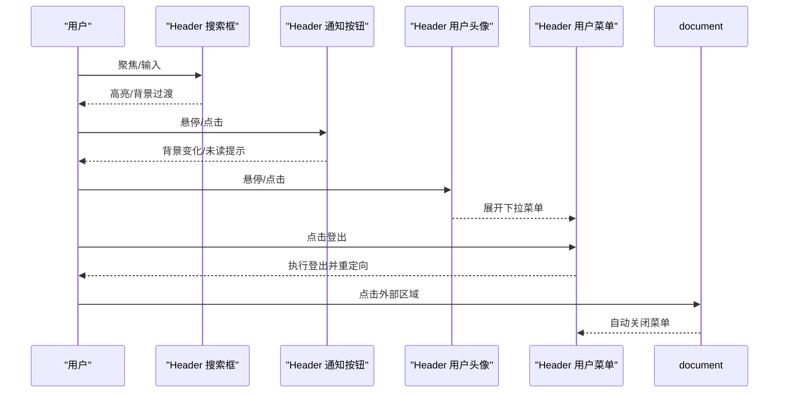
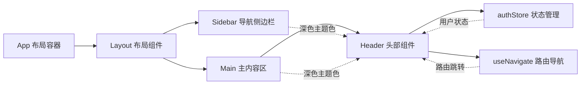
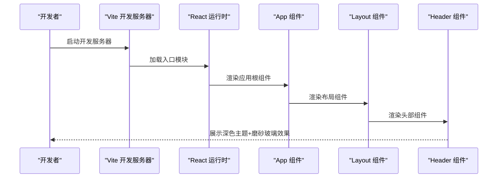
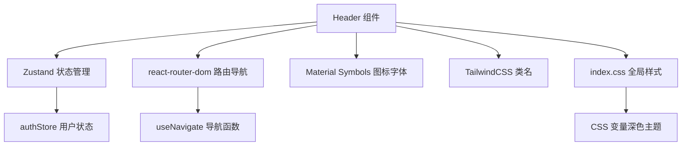

# 头部组件 (Header)

<cite>
**本文引用的文件**
- [Header.tsx](file://crm-frontend/src/components/layout/Header.tsx)
- [Layout.tsx](file://crm-frontend/src/components/layout/Layout.tsx)
- [authStore.ts](file://crm-frontend/src/stores/authStore.ts)
- [App.tsx](file://crm-frontend/src/App.tsx)
- [index.css](file://crm-frontend/src/index.css)
- [api.ts](file://crm-frontend/src/services/api.ts)
- [Sidebar.tsx](file://crm-frontend/src/components/layout/Sidebar.tsx)
- [Dashboard/index.tsx](file://crm-frontend/src/pages/Dashboard/index.tsx)
</cite>

## 更新摘要
**变更内容**
- Header组件从简单的白色头部升级为深色主题+磨砂玻璃效果设计
- 新增完整的通知系统，包含未读红点提示和下拉菜单
- 集成用户状态管理，支持用户头像、角色显示和下拉菜单
- 增强交互体验，包括点击外部关闭菜单、键盘快捷键支持
- 优化视觉设计，使用Material Symbols图标和渐变色彩系统
- 新增升级按钮、设置按钮和分隔线等现代化功能元素

## 目录
1. [简介](#简介)
2. [项目结构](#项目结构)
3. [核心组件](#核心组件)
4. [架构总览](#架构总览)
5. [详细组件分析](#详细组件分析)
6. [依赖关系分析](#依赖关系分析)
7. [性能考虑](#性能考虑)
8. [故障排查指南](#故障排查指南)
9. [结论](#结论)
10. [附录](#附录)

## 简介
本文件为销售AI CRM系统的头部组件（Header）提供完整的技术文档。该组件位于应用顶部，采用深色主题设计和磨砂玻璃效果，承担搜索、通知、用户信息展示和权限管理等关键功能。组件经过重大重新设计，从简单的白色头部升级为现代化的深色界面，集成了完整的用户状态管理和通知系统，是导航系统与主内容区域之间的桥梁。文档将从整体设计思路、布局结构、功能特性入手，深入解析其与导航系统（Sidebar）的协作方式、用户交互处理机制以及响应式设计实现；同时给出配置选项、样式定制方法与扩展建议，并提供可直接参考的集成指南与代码片段路径。

## 项目结构
Header组件属于前端React单页应用的一部分，采用Vite构建工具与TailwindCSS进行样式管理。应用采用左右分栏布局：左侧为固定宽度的导航侧边栏（Sidebar），右侧为主内容区（Main）。Header位于主内容区顶部，作为全局控制入口，集成了用户认证、状态管理和路由导航功能。整个应用采用深色主题设计，使用磨砂玻璃效果营造现代感。

```mermaid
graph TB
subgraph "应用根节点"
APP["App 组件<br/>负责整体布局与路由占位"]
END
subgraph "左侧导航"
SIDEBAR["Sidebar 导航侧边栏<br/>固定宽度，包含多级菜单项"]
END
subgraph "右侧内容"
HEADER["Header 头部组件<br/>深色主题+磨砂玻璃效果"]
LAYOUT["Layout 布局容器<br/>整合Header与Sidebar"]
MAIN["Main 内容区<br/>网格布局承载多个业务卡片"]
STATS["Dashboard 仪表板<br/>统计卡片与业务组件"]
END
APP --> LAYOUT
LAYOUT --> SIDEBAR
LAYOUT --> HEADER
LAYOUT --> MAIN
MAIN --> STATS
```

**图表来源**
- [App.tsx:51-96](file://crm-frontend/src/App.tsx#L51-L96)
- [Layout.tsx:9-24](file://crm-frontend/src/components/layout/Layout.tsx#L9-L24)
- [Header.tsx:44-178](file://crm-frontend/src/components/layout/Header.tsx#L44-L178)

**章节来源**
- [App.tsx:51-96](file://crm-frontend/src/App.tsx#L51-L96)
- [Layout.tsx:9-24](file://crm-frontend/src/components/layout/Layout.tsx#L9-L24)
- [Header.tsx:44-178](file://crm-frontend/src/components/layout/Header.tsx#L44-L178)

## 核心组件
Header组件采用现代化的深色主题设计，由五个主要区域构成：
- **深色背景与磨砂玻璃效果**：使用半透明背景和backdrop-blur实现磨砂玻璃效果，提供现代视觉体验
- **左侧搜索区**：提供全局搜索输入框，支持⌘K快捷键，具备焦点态高亮与背景过渡效果
- **右侧操作区**：包含升级按钮、通知铃铛（含未读红点）、设置按钮、分隔线、用户头像与下拉指示
- **用户信息区**：显示用户名、角色信息和在线状态，支持下拉菜单展开
- **响应式与主题**：使用TailwindCSS类名实现自适应布局，结合深色主题色变量保证视觉一致性

**交互要点**：
- 搜索框具备焦点态样式变化，提升可用性
- 通知按钮支持悬停态背景色变化与未读红点提示
- 用户头像区域支持悬停态与下拉箭头指示，便于触发用户菜单
- 集成用户认证状态管理，支持登出功能
- 支持点击外部区域自动关闭下拉菜单

**章节来源**
- [Header.tsx:44-178](file://crm-frontend/src/components/layout/Header.tsx#L44-L178)

## 架构总览
Header在应用中的位置与职责如下：
- **位置**：作为Layout组件的子组件被渲染在主内容区顶部
- **协作**：与Sidebar共同构成左右分栏的整体布局；与主内容区内的业务卡片（如Dashboard）形成上下层级关系
- **状态管理**：通过Zustand状态管理器（authStore）管理用户认证状态
- **主题**：通过全局CSS变量定义深色主题色，确保Header与侧边栏、业务卡片风格统一



**图表来源**
- [App.tsx:51-96](file://crm-frontend/src/App.tsx#L51-L96)
- [Header.tsx:9-178](file://crm-frontend/src/components/layout/Header.tsx#L9-L178)
- [authStore.ts:41-175](file://crm-frontend/src/stores/authStore.ts#L41-L175)

## 详细组件分析

### 组件结构与布局
Header采用Flex布局，左侧搜索区占据弹性空间，右侧操作区固定宽度。搜索区使用相对定位容器包裹Material Symbols图标与输入框，实现内嵌图标与输入框的对齐；右侧操作区包含升级按钮、通知按钮、设置按钮、分隔线与用户信息块。组件支持深色主题，使用CSS变量实现主题切换。



**图表来源**
- [Header.tsx:9-178](file://crm-frontend/src/components/layout/Header.tsx#L9-L178)

**章节来源**
- [Header.tsx:9-178](file://crm-frontend/src/components/layout/Header.tsx#L9-L178)

### 用户交互处理机制
- **搜索框**：具备焦点态样式变化，用于引导用户输入，支持⌘K快捷键，实时状态更新
- **通知按钮**：悬停态改变背景色，未读红点用于提醒，支持点击展开通知列表
- **用户头像**：悬停态改变背景色，下拉箭头指示可展开菜单，支持点击外部区域自动关闭
- **用户菜单**：支持用户信息展示、个人资料、外观设置和登出功能，执行后重定向到登录页
- **点击外部关闭**：通过useEffect监听鼠标事件，自动关闭展开的菜单



**图表来源**
- [Header.tsx:18-35](file://crm-frontend/src/components/layout/Header.tsx#L18-L35)
- [Header.tsx:52-70](file://crm-frontend/src/components/layout/Header.tsx#L52-L70)
- [Header.tsx:80-116](file://crm-frontend/src/components/layout/Header.tsx#L80-L116)
- [Header.tsx:126-173](file://crm-frontend/src/components/layout/Header.tsx#L126-L173)

**章节来源**
- [Header.tsx:18-35](file://crm-frontend/src/components/layout/Header.tsx#L18-L35)
- [Header.tsx:52-70](file://crm-frontend/src/components/layout/Header.tsx#L52-L70)
- [Header.tsx:80-116](file://crm-frontend/src/components/layout/Header.tsx#L80-L116)
- [Header.tsx:126-173](file://crm-frontend/src/components/layout/Header.tsx#L126-L173)

### 与导航系统（Sidebar）的协作
Header与Sidebar共同构成左右分栏布局。Sidebar负责左侧导航菜单与Logo区域，Header位于主内容区顶部，二者通过Layout组件的布局容器组合呈现。Header通过authStore管理用户状态，通过useNavigate进行路由跳转，通过统一的深色主题色与字体体系保持视觉一致。



**图表来源**
- [App.tsx:51-96](file://crm-frontend/src/App.tsx#L51-L96)
- [Layout.tsx:9-24](file://crm-frontend/src/components/layout/Layout.tsx#L9-L24)
- [Header.tsx:9-178](file://crm-frontend/src/components/layout/Header.tsx#L9-L178)
- [authStore.ts:41-175](file://crm-frontend/src/stores/authStore.ts#L41-L175)

**章节来源**
- [App.tsx:51-96](file://crm-frontend/src/App.tsx#L51-L96)
- [Layout.tsx:9-24](file://crm-frontend/src/components/layout/Layout.tsx#L9-L24)
- [Header.tsx:9-178](file://crm-frontend/src/components/layout/Header.tsx#L9-L178)
- [authStore.ts:41-175](file://crm-frontend/src/stores/authStore.ts#L41-L175)

### 响应式设计实现
- **容器高度固定**：Header高度为固定值（h-20），确保在不同屏幕尺寸下保持稳定
- **搜索区最大宽度**：通过最大宽度限制（max-w-xl）避免在大屏下搜索框过宽
- **Flex布局**：右侧操作区使用固定间距，保证在小屏下元素紧凑排列
- **字体与颜色**：通过Tailwind类名与全局CSS变量实现跨设备一致的视觉体验
- **深色主题支持**：完全支持深色主题，使用dark前缀类名实现主题切换
- **磨砂玻璃效果**：使用backdrop-blur实现现代视觉效果

**章节来源**
- [Header.tsx:44-47](file://crm-frontend/src/components/layout/Header.tsx#L44-L47)
- [Header.tsx:52-70](file://crm-frontend/src/components/layout/Header.tsx#L52-L70)
- [Header.tsx:118-121](file://crm-frontend/src/components/layout/Header.tsx#L118-L121)
- [index.css:10-47](file://crm-frontend/src/index.css#L10-L47)

### 配置选项与扩展建议
- **主题色定制**：通过全局CSS变量（--color-bg-primary, --color-primary等）调整深色主题配色
- **搜索框占位符**：可在组件中修改占位文本以适配不同语言或业务场景
- **通知系统扩展**：当前为静态通知列表，建议扩展为动态数据绑定与状态管理
- **用户信息扩展**：建议扩展用户头像URL、角色徽章等动态信息展示
- **交互行为**：可为各按钮添加onClick回调，接入路由跳转或下拉菜单弹窗
- **状态管理集成**：建议扩展用户信息获取和状态同步功能

**章节来源**
- [index.css:10-47](file://crm-frontend/src/index.css#L10-L47)
- [Header.tsx:52-70](file://crm-frontend/src/components/layout/Header.tsx#L52-L70)
- [Header.tsx:80-116](file://crm-frontend/src/components/layout/Header.tsx#L80-L116)
- [Header.tsx:126-173](file://crm-frontend/src/components/layout/Header.tsx#L126-L173)

### 样式定制方法
- **深色主题变量**：通过修改CSS变量（--color-bg-primary, --color-text-primary等）实现品牌化定制
- **磨砂玻璃效果**：通过调整backdrop-blur和背景透明度实现不同的视觉效果
- **Material Symbols图标**：通过CSS类名控制图标样式和大小
- **渐变色彩系统**：通过修改渐变色变量实现主题色彩变化
- **自定义动画**：全局样式中已提供多种动画效果，可按需调整

**章节来源**
- [index.css:10-47](file://crm-frontend/src/index.css#L10-L47)
- [index.css:94-104](file://crm-frontend/src/index.css#L94-L104)
- [index.css:250-256](file://crm-frontend/src/index.css#L250-L256)

### 实际代码示例与集成指南
- **引入与渲染**：在Layout组件中引入Header并渲染到主内容区顶部
- **状态管理**：通过authStore管理用户认证状态，支持登录、注册、登出等功能
- **路由集成**：使用react-router-dom进行页面导航和路由守卫
- **依赖安装**：项目已包含React、TailwindCSS、Zustand和Material Symbols图标库
- **构建与运行**：使用Vite进行开发与构建



**图表来源**
- [App.tsx:51-96](file://crm-frontend/src/App.tsx#L51-L96)
- [Layout.tsx:9-24](file://crm-frontend/src/components/layout/Layout.tsx#L9-L24)
- [Header.tsx:9-178](file://crm-frontend/src/components/layout/Header.tsx#L9-L178)

**章节来源**
- [App.tsx:51-96](file://crm-frontend/src/App.tsx#L51-L96)
- [Layout.tsx:9-24](file://crm-frontend/src/components/layout/Layout.tsx#L9-L24)
- [Header.tsx:9-178](file://crm-frontend/src/components/layout/Header.tsx#L9-L178)

## 依赖关系分析
Header组件的依赖关系清晰且集中：
- **状态管理**：使用Zustand进行用户认证状态管理
- **路由导航**：使用react-router-dom进行页面导航和路由守卫
- **图标库**：使用Material Symbols图标字体提供丰富的图标资源
- **样式框架**：使用TailwindCSS类名实现布局与主题
- **主题变量**：通过全局CSS变量定义深色主题色，确保Header与Sidebar风格一致



**图表来源**
- [Header.tsx:1-3](file://crm-frontend/src/components/layout/Header.tsx#L1-L3)
- [authStore.ts:41-175](file://crm-frontend/src/stores/authStore.ts#L41-L175)
- [index.css:10-47](file://crm-frontend/src/index.css#L10-L47)

**章节来源**
- [Header.tsx:1-3](file://crm-frontend/src/components/layout/Header.tsx#L1-L3)
- [authStore.ts:41-175](file://crm-frontend/src/stores/authStore.ts#L41-L175)
- [index.css:10-47](file://crm-frontend/src/index.css#L10-L47)

## 性能考虑
- **组件体积**：Header为纯展示型组件，无复杂计算，渲染开销极低
- **状态管理**：使用Zustand轻量级状态管理，避免不必要的重新渲染
- **样式优化**：使用Tailwind原子类名减少CSS体积，避免重复定义
- **交互平滑**：焦点态与悬停态使用过渡动画，保证交互流畅性
- **深色主题复用**：通过CSS变量统一主题色，减少重复样式声明
- **图标优化**：使用Material Symbols字体图标，减少图片资源加载
- **磨砂玻璃效果**：backdrop-blur在现代浏览器中性能良好，但需注意移动端性能

## 故障排查指南
- **深色主题显示异常**：确认CSS变量正确加载，检查dark类名是否正确应用
- **磨砂玻璃效果不显示**：检查浏览器兼容性，确保backdrop-filter支持
- **图标显示异常**：确认Material Symbols字体加载正确，检查网络连接
- **状态管理问题**：检查Zustand store配置，确认用户状态正确初始化
- **路由跳转异常**：检查react-router-dom配置，确认路由守卫逻辑正确
- **样式不生效**：检查Tailwind是否正确编译，CSS变量是否在全局范围内定义
- **响应式问题**：检查容器宽度与Flex布局设置，确保在小屏下元素紧凑排列
- **交互无反馈**：检查事件绑定与类名拼接逻辑，确保悬停与焦点态正常触发

**章节来源**
- [index.css:10-47](file://crm-frontend/src/index.css#L10-L47)
- [Header.tsx:52-70](file://crm-frontend/src/components/layout/Header.tsx#L52-L70)
- [Header.tsx:80-116](file://crm-frontend/src/components/layout/Header.tsx#L80-L116)
- [Header.tsx:126-173](file://crm-frontend/src/components/layout/Header.tsx#L126-L173)
- [authStore.ts:41-175](file://crm-frontend/src/stores/authStore.ts#L41-L175)

## 结论
Header组件经过重大重新设计，从简单的白色头部升级为现代化的深色主题界面，集成了磨砂玻璃效果、通知系统、用户状态管理等功能。组件以深色主题为核心，配合Sidebar与主内容区形成完整的左右分栏界面。通过统一的深色主题色与Tailwind原子类名，Header实现了良好的可维护性与可扩展性。最新版本的Header组件集成了完整的用户认证、状态管理和路由导航功能，支持深色主题和Material Symbols图标系统，为用户提供完整的CRM管理体验。建议后续在通知系统与用户信息上增加动态数据绑定，并为各按钮添加交互回调，进一步完善用户体验。

## 附录
- **代码片段路径参考**
  - [Header 组件主体:9-178](file://crm-frontend/src/components/layout/Header.tsx#L9-L178)
  - [Layout 中的 Header 渲染:17](file://crm-frontend/src/components/layout/Layout.tsx#L17)
  - [authStore 状态管理:41-175](file://crm-frontend/src/stores/authStore.ts#L41-L175)
  - [全局深色主题定义:10-47](file://crm-frontend/src/index.css#L10-L47)
  - [Material Symbols 配置:6-7](file://crm-frontend/src/index.css#L6-L7)
  - [路由配置:51-96](file://crm-frontend/src/App.tsx#L51-L96)
  - [Sidebar 导航组件:20-161](file://crm-frontend/src/components/layout/Sidebar.tsx#L20-L161)
  - [Dashboard 页面:618-699](file://crm-frontend/src/pages/Dashboard/index.tsx#L618-L699)