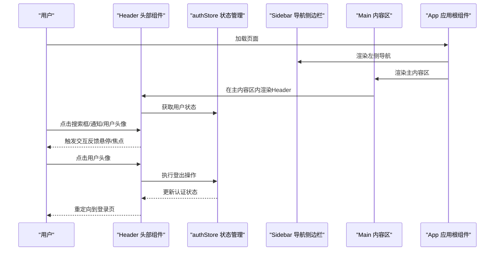
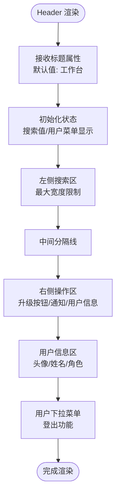
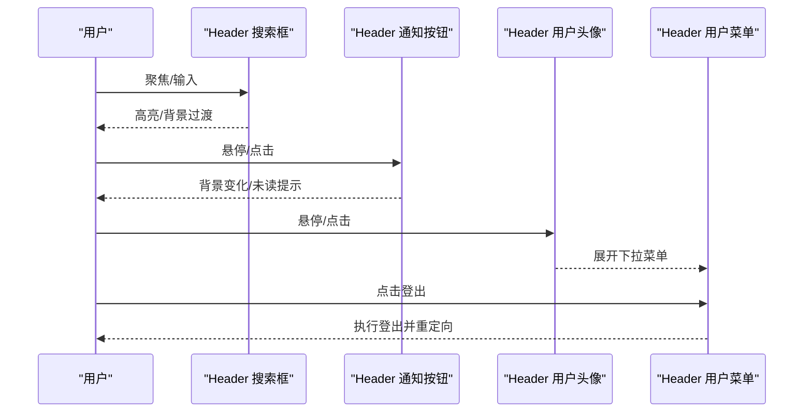
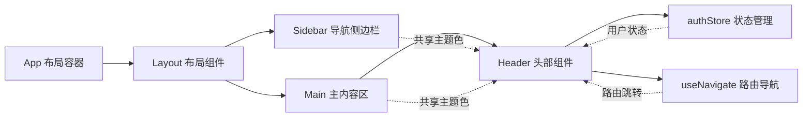
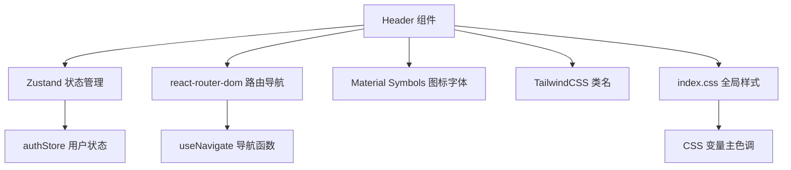

# 头部组件 (Header)

<cite>
**本文引用的文件**
- [Header.tsx](file://crm-frontend/src/components/layout/Header.tsx)
- [Layout.tsx](file://crm-frontend/src/components/layout/Layout.tsx)
- [Sidebar.tsx](file://crm-frontend/src/components/layout/Sidebar.tsx)
- [authStore.ts](file://crm-frontend/src/stores/authStore.ts)
- [App.tsx](file://crm-frontend/src/App.tsx)
- [Dashboard/index.tsx](file://crm-frontend/src/pages/Dashboard/index.tsx)
- [main.tsx](file://crm-frontend/src/main.tsx)
- [index.css](file://crm-frontend/src/index.css)
- [package.json](file://crm-frontend/package.json)
- [vite.config.ts](file://crm-frontend/vite.config.ts)
</cite>

## 更新摘要
**变更内容**
- 更新Header组件为完整的功能实现，包含搜索、通知、用户管理等核心功能
- 新增状态管理集成（Zustand）和用户认证功能
- 完善暗黑模式支持和Material Symbols图标系统
- 增强用户交互体验，包括下拉菜单和登出功能
- 优化组件结构和代码组织

## 目录
1. [简介](#简介)
2. [项目结构](#项目结构)
3. [核心组件](#核心组件)
4. [架构总览](#架构总览)
5. [详细组件分析](#详细组件分析)
6. [依赖关系分析](#依赖关系分析)
7. [性能考虑](#性能考虑)
8. [故障排查指南](#故障排查指南)
9. [结论](#结论)
10. [附录](#附录)

## 简介
本文件为销售AI CRM系统的头部组件（Header）提供完整的技术文档。该组件位于应用顶部，承担搜索、通知、用户信息展示和权限管理等关键功能，是导航系统与主内容区域之间的桥梁。文档将从整体设计思路、布局结构、功能特性入手，深入解析其与导航系统（Sidebar）的协作方式、用户交互处理机制以及响应式设计实现；同时给出配置选项、样式定制方法与扩展建议，并提供可直接参考的集成指南与代码片段路径。

## 项目结构
Header组件属于前端React单页应用的一部分，采用Vite构建工具与TailwindCSS进行样式管理。应用采用左右分栏布局：左侧为固定宽度的导航侧边栏（Sidebar），右侧为主内容区（Main）。Header位于主内容区顶部，作为全局控制入口，集成了用户认证、状态管理和路由导航功能。

```mermaid
graph TB
subgraph "应用根节点"
APP["App 组件<br/>负责整体布局与路由占位"]
END
subgraph "左侧导航"
SIDEBAR["Sidebar 导航侧边栏<br/>固定宽度，包含多级菜单项"]
END
subgraph "右侧内容"
HEADER["Header 头部组件<br/>顶部搜索/通知/用户信息"]
LAYOUT["Layout 布局容器<br/>整合Header与Sidebar"]
MAIN["Main 内容区<br/>网格布局承载多个业务卡片"]
STATS["Dashboard 仪表板<br/>统计卡片与业务组件"]
END
APP --> LAYOUT
LAYOUT --> SIDEBAR
LAYOUT --> HEADER
LAYOUT --> MAIN
MAIN --> STATS
```

**图表来源**
- [App.tsx:31-68](file://crm-frontend/src/App.tsx#L31-L68)
- [Layout.tsx:9-24](file://crm-frontend/src/components/layout/Layout.tsx#L9-L24)
- [Sidebar.tsx:18-78](file://crm-frontend/src/components/layout/Sidebar.tsx#L18-L78)
- [Header.tsx:9-88](file://crm-frontend/src/components/layout/Header.tsx#L9-L88)

**章节来源**
- [App.tsx:31-68](file://crm-frontend/src/App.tsx#L31-L68)
- [Layout.tsx:9-24](file://crm-frontend/src/components/layout/Layout.tsx#L9-L24)
- [Sidebar.tsx:18-78](file://crm-frontend/src/components/layout/Sidebar.tsx#L18-L78)
- [Header.tsx:9-88](file://crm-frontend/src/components/layout/Header.tsx#L9-L88)

## 核心组件
Header组件由四个主要区域构成：
- **左侧搜索区**：提供全局搜索输入框，支持聚焦态高亮与背景过渡效果，使用Material Symbols图标。
- **右侧操作区**：包含升级按钮、通知铃铛（含未读红点）、垂直分隔线、用户头像与下拉指示。
- **用户信息区**：显示用户名、角色信息和头像，支持下拉菜单展开。
- **响应式与主题**：使用TailwindCSS类名实现自适应布局，结合自定义主题色变量保证视觉一致性。

**交互要点**：
- 搜索框具备焦点态样式变化，提升可用性。
- 通知按钮支持悬停态背景色变化与未读红点提示。
- 用户头像区域支持悬停态与下拉箭头指示，便于触发用户菜单。
- 集成用户认证状态管理，支持登出功能。

**章节来源**
- [Header.tsx:9-88](file://crm-frontend/src/components/layout/Header.tsx#L9-L88)

## 架构总览
Header在应用中的位置与职责如下：
- **位置**：作为Layout组件的子组件被渲染在主内容区顶部。
- **协作**：与Sidebar共同构成左右分栏的整体布局；与主内容区内的业务卡片（如Dashboard）形成上下层级关系。
- **状态管理**：通过Zustand状态管理器（authStore）管理用户认证状态。
- **主题**：通过全局CSS变量定义主色调，确保Header与侧边栏、业务卡片风格统一。



**图表来源**
- [App.tsx:31-68](file://crm-frontend/src/App.tsx#L31-L68)
- [Header.tsx:9-88](file://crm-frontend/src/components/layout/Header.tsx#L9-L88)
- [authStore.ts:37-123](file://crm-frontend/src/stores/authStore.ts#L37-L123)
- [Sidebar.tsx:18-78](file://crm-frontend/src/components/layout/Sidebar.tsx#L18-L78)

## 详细组件分析

### 组件结构与布局
Header采用Flex布局，左侧搜索区占据弹性空间，右侧操作区固定宽度。搜索区使用相对定位容器包裹Material Symbols图标与输入框，实现内嵌图标与输入框的对齐；右侧操作区包含升级按钮、通知按钮、分隔线与用户信息块。组件支持暗黑模式，使用CSS变量实现主题切换。



**图表来源**
- [Header.tsx:9-88](file://crm-frontend/src/components/layout/Header.tsx#L9-L88)

**章节来源**
- [Header.tsx:9-88](file://crm-frontend/src/components/layout/Header.tsx#L9-L88)

### 用户交互处理机制
- **搜索框**：具备焦点态样式变化，用于引导用户输入，支持实时状态更新。
- **通知按钮**：悬停态改变背景色，未读红点用于提醒。
- **用户头像**：悬停态改变背景色，下拉箭头指示可展开菜单。
- **用户菜单**：支持用户信息展示和登出功能，执行后重定向到登录页。



**图表来源**
- [Header.tsx:15-18](file://crm-frontend/src/components/layout/Header.tsx#L15-L18)
- [Header.tsx:28-34](file://crm-frontend/src/components/layout/Header.tsx#L28-L34)
- [Header.tsx:47-50](file://crm-frontend/src/components/layout/Header.tsx#L47-L50)
- [Header.tsx:61-66](file://crm-frontend/src/components/layout/Header.tsx#L61-L66)
- [Header.tsx:69-83](file://crm-frontend/src/components/layout/Header.tsx#L69-L83)

**章节来源**
- [Header.tsx:15-18](file://crm-frontend/src/components/layout/Header.tsx#L15-L18)
- [Header.tsx:28-34](file://crm-frontend/src/components/layout/Header.tsx#L28-L34)
- [Header.tsx:47-50](file://crm-frontend/src/components/layout/Header.tsx#L47-L50)
- [Header.tsx:61-66](file://crm-frontend/src/components/layout/Header.tsx#L61-L66)
- [Header.tsx:69-83](file://crm-frontend/src/components/layout/Header.tsx#L69-L83)

### 与导航系统（Sidebar）的协作
Header与Sidebar共同构成左右分栏布局。Sidebar负责左侧导航菜单与Logo区域，Header位于主内容区顶部，二者通过Layout组件的布局容器组合呈现。Header通过authStore管理用户状态，通过useNavigate进行路由跳转，通过统一的主题色与字体体系保持视觉一致。



**图表来源**
- [App.tsx:31-68](file://crm-frontend/src/App.tsx#L31-L68)
- [Layout.tsx:9-24](file://crm-frontend/src/components/layout/Layout.tsx#L9-L24)
- [Sidebar.tsx:18-78](file://crm-frontend/src/components/layout/Sidebar.tsx#L18-L78)
- [Header.tsx:9-88](file://crm-frontend/src/components/layout/Header.tsx#L9-L88)
- [authStore.ts:37-123](file://crm-frontend/src/stores/authStore.ts#L37-L123)

**章节来源**
- [App.tsx:31-68](file://crm-frontend/src/App.tsx#L31-L68)
- [Layout.tsx:9-24](file://crm-frontend/src/components/layout/Layout.tsx#L9-L24)
- [Sidebar.tsx:18-78](file://crm-frontend/src/components/layout/Sidebar.tsx#L18-L78)
- [Header.tsx:9-88](file://crm-frontend/src/components/layout/Header.tsx#L9-L88)
- [authStore.ts:37-123](file://crm-frontend/src/stores/authStore.ts#L37-L123)

### 响应式设计实现
- **容器高度固定**：Header高度为固定值（h-16），确保在不同屏幕尺寸下保持稳定。
- **搜索区最大宽度**：通过最大宽度限制（max-w-xl）避免在大屏下搜索框过宽。
- **Flex布局**：右侧操作区使用固定间距，保证在小屏下元素紧凑排列。
- **字体与颜色**：通过Tailwind类名与全局CSS变量实现跨设备一致的视觉体验。
- **暗黑模式支持**：完全支持暗黑模式，使用dark前缀类名实现主题切换。

**章节来源**
- [Header.tsx:21](file://crm-frontend/src/components/layout/Header.tsx#L21)
- [Header.tsx:23-36](file://crm-frontend/src/components/layout/Header.tsx#L23-L36)
- [Header.tsx:39-85](file://crm-frontend/src/components/layout/Header.tsx#L39-L85)
- [index.css:29-32](file://crm-frontend/src/index.css#L29-L32)

### 配置选项与扩展建议
- **主题色定制**：通过全局CSS变量（--color-primary）调整主色调，影响Header与Sidebar的配色一致性。
- **搜索框占位符**：可在组件中修改占位文本以适配不同语言或业务场景。
- **通知与用户信息**：当前为静态展示，建议扩展为动态数据绑定与状态管理（如未读数、用户头像URL）。
- **交互行为**：可为各按钮添加onClick回调，接入路由跳转或下拉菜单弹窗。
- **状态管理集成**：建议扩展用户信息获取和状态同步功能。

**章节来源**
- [index.css:10-18](file://crm-frontend/src/index.css#L10-L18)
- [Header.tsx:28-34](file://crm-frontend/src/components/layout/Header.tsx#L28-L34)
- [Header.tsx:41-44](file://crm-frontend/src/components/layout/Header.tsx#L41-L44)
- [Header.tsx:47-50](file://crm-frontend/src/components/layout/Header.tsx#L47-L50)
- [Header.tsx:61-66](file://crm-frontend/src/components/layout/Header.tsx#L61-L66)

### 样式定制方法
- **Tailwind类名**：通过修改类名实现尺寸、颜色、间距等样式调整。
- **全局CSS变量**：通过修改主题色变量实现品牌化定制。
- **Material Symbols图标**：通过CSS类名控制图标样式和大小。
- **暗黑模式**：通过dark前缀类名实现主题切换。
- **自定义滚动条**：全局样式中已提供滚动条美化，可按需调整。

**章节来源**
- [index.css:10-18](file://crm-frontend/src/index.css#L10-L18)
- [index.css:34-39](file://crm-frontend/src/index.css#L34-L39)
- [index.css:41-66](file://crm-frontend/src/index.css#L41-L66)
- [index.css:82-86](file://crm-frontend/src/index.css#L82-L86)

### 实际代码示例与集成指南
- **引入与渲染**：在Layout组件中引入Header并渲染到主内容区顶部。
- **状态管理**：通过authStore管理用户认证状态，支持登录、注册、登出等功能。
- **路由集成**：使用react-router-dom进行页面导航和路由守卫。
- **依赖安装**：项目已包含React、TailwindCSS、Zustand和lucide-react图标库。
- **构建与运行**：使用Vite进行开发与构建。


**图表来源**
- [main.tsx:6-10](file://crm-frontend/src/main.tsx#L6-L10)
- [App.tsx:31-68](file://crm-frontend/src/App.tsx#L31-L68)
- [Layout.tsx:9-24](file://crm-frontend/src/components/layout/Layout.tsx#L9-L24)
- [Header.tsx:9-88](file://crm-frontend/src/components/layout/Header.tsx#L9-L88)

**章节来源**
- [main.tsx:6-10](file://crm-frontend/src/main.tsx#L6-L10)
- [App.tsx:31-68](file://crm-frontend/src/App.tsx#L31-L68)
- [Layout.tsx:9-24](file://crm-frontend/src/components/layout/Layout.tsx#L9-L24)
- [Header.tsx:9-88](file://crm-frontend/src/components/layout/Header.tsx#L9-L88)
- [package.json:12-19](file://crm-frontend/package.json#L12-L19)
- [vite.config.ts:5-12](file://crm-frontend/vite.config.ts#L5-L12)

## 依赖关系分析
Header组件的依赖关系清晰且集中：
- **状态管理**：使用Zustand进行用户认证状态管理。
- **路由导航**：使用react-router-dom进行页面导航和路由守卫。
- **图标库**：使用Material Symbols图标字体提供丰富的图标资源。
- **样式框架**：使用TailwindCSS类名实现布局与主题。
- **主题变量**：通过全局CSS变量定义主色调，确保Header与Sidebar风格一致。



**图表来源**
- [Header.tsx:1-3](file://crm-frontend/src/components/layout/Header.tsx#L1-L3)
- [authStore.ts:37-123](file://crm-frontend/src/stores/authStore.ts#L37-L123)
- [index.css:10-18](file://crm-frontend/src/index.css#L10-L18)
- [package.json:12-19](file://crm-frontend/package.json#L12-L19)

**章节来源**
- [Header.tsx:1-3](file://crm-frontend/src/components/layout/Header.tsx#L1-L3)
- [authStore.ts:37-123](file://crm-frontend/src/stores/authStore.ts#L37-L123)
- [index.css:10-18](file://crm-frontend/src/index.css#L10-L18)
- [package.json:12-19](file://crm-frontend/package.json#L12-L19)

## 性能考虑
- **组件体积**：Header为纯展示型组件，无复杂计算，渲染开销极低。
- **状态管理**：使用Zustand轻量级状态管理，避免不必要的重新渲染。
- **样式优化**：使用Tailwind原子类名减少CSS体积，避免重复定义。
- **交互平滑**：焦点态与悬停态使用过渡动画，保证交互流畅性。
- **主题复用**：通过CSS变量统一主题色，减少重复样式声明。
- **图标优化**：使用Material Symbols字体图标，减少图片资源加载。

## 故障排查指南
- **图标显示异常**：确认Material Symbols字体加载正确，检查网络连接。
- **状态管理问题**：检查Zustand store配置，确认用户状态正确初始化。
- **路由跳转异常**：检查react-router-dom配置，确认路由守卫逻辑正确。
- **样式不生效**：检查Tailwind是否正确编译，CSS变量是否在全局范围内定义。
- **响应式问题**：检查容器宽度与Flex布局设置，确保在小屏下元素紧凑排列。
- **交互无反馈**：检查事件绑定与类名拼接逻辑，确保悬停与焦点态正常触发。

**章节来源**
- [package.json:12-19](file://crm-frontend/package.json#L12-L19)
- [index.css:10-18](file://crm-frontend/src/index.css#L10-L18)
- [Header.tsx:28-34](file://crm-frontend/src/components/layout/Header.tsx#L28-L34)
- [Header.tsx:47-50](file://crm-frontend/src/components/layout/Header.tsx#L47-L50)
- [Header.tsx:61-66](file://crm-frontend/src/components/layout/Header.tsx#L61-L66)
- [authStore.ts:37-123](file://crm-frontend/src/stores/authStore.ts#L37-L123)

## 结论
Header组件以简洁明确的布局与交互为核心，配合Sidebar与主内容区形成完整的左右分栏界面。通过统一的主题色与Tailwind原子类名，Header实现了良好的可维护性与可扩展性。最新版本的Header组件集成了完整的用户认证、状态管理和路由导航功能，支持暗黑模式和Material Symbols图标系统，为用户提供完整的CRM管理体验。建议后续在用户信息与通知状态上增加动态数据绑定，并为各按钮添加交互回调，进一步完善用户体验。

## 附录
- **代码片段路径参考**
  - [Header 组件主体:9-88](file://crm-frontend/src/components/layout/Header.tsx#L9-L88)
  - [Layout 中的 Header 渲染:17](file://crm-frontend/src/components/layout/Layout.tsx#L17)
  - [authStore 状态管理:37-123](file://crm-frontend/src/stores/authStore.ts#L37-L123)
  - [全局主题色定义:10-18](file://crm-frontend/src/index.css#L10-L18)
  - [Material Symbols 配置:6-7](file://crm-frontend/src/index.css#L6-L7)
  - [路由配置:31-68](file://crm-frontend/src/App.tsx#L31-L68)
  - [Vite 构建配置:5-12](file://crm-frontend/vite.config.ts#L5-L12)