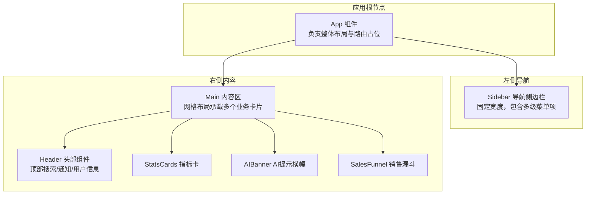
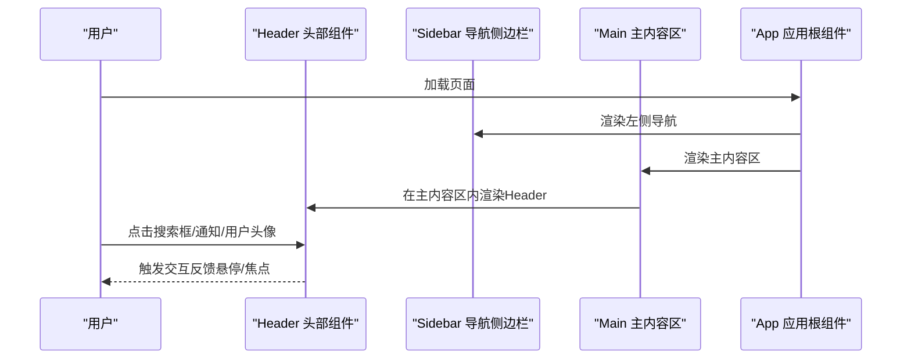
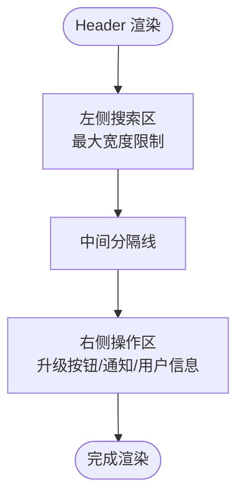
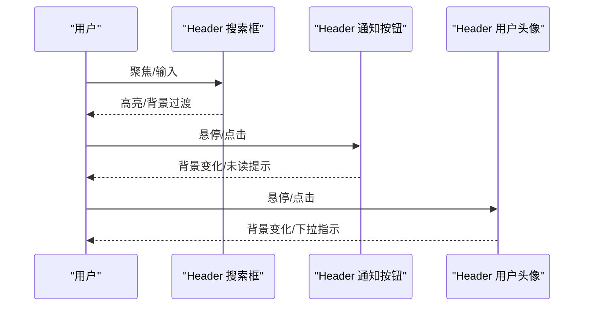
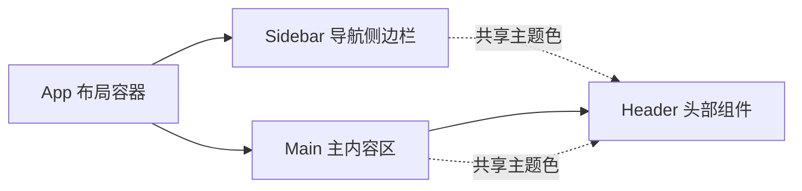
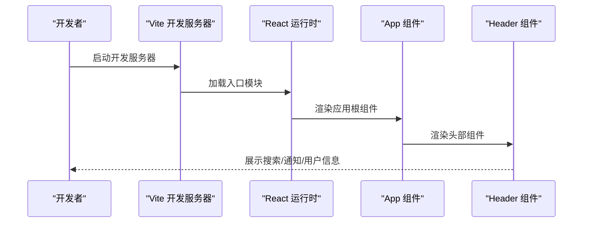
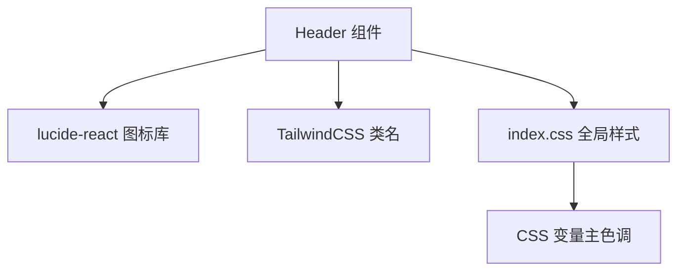

# 头部组件 (Header)

<cite>
**本文引用的文件**
- [Header.tsx](file://crm-frontend/src/components/Header.tsx)
- [App.tsx](file://crm-frontend/src/App.tsx)
- [Sidebar.tsx](file://crm-frontend/src/components/Sidebar.tsx)
- [StatsCards.tsx](file://crm-frontend/src/components/StatsCards.tsx)
- [AIBanner.tsx](file://crm-frontend/src/components/AIBanner.tsx)
- [SalesFunnel.tsx](file://crm-frontend/src/components/SalesFunnel.tsx)
- [main.tsx](file://crm-frontend/src/main.tsx)
- [index.css](file://crm-frontend/src/index.css)
- [package.json](file://crm-frontend/package.json)
- [vite.config.ts](file://crm-frontend/vite.config.ts)
</cite>

## 目录
1. [简介](#简介)
2. [项目结构](#项目结构)
3. [核心组件](#核心组件)
4. [架构总览](#架构总览)
5. [详细组件分析](#详细组件分析)
6. [依赖关系分析](#依赖关系分析)
7. [性能考虑](#性能考虑)
8. [故障排查指南](#故障排查指南)
9. [结论](#结论)
10. [附录](#附录)

## 简介
本文件为销售AI CRM系统的头部组件（Header）提供完整的技术文档。该组件位于应用顶部，承担搜索、通知、用户信息展示等关键功能，是导航系统与主内容区域之间的桥梁。文档将从整体设计思路、布局结构、功能特性入手，深入解析其与导航系统（Sidebar）的协作方式、用户交互处理机制以及响应式设计实现；同时给出配置选项、样式定制方法与扩展建议，并提供可直接参考的集成指南与代码片段路径。

## 项目结构
Header组件属于前端React单页应用的一部分，采用Vite构建工具与TailwindCSS进行样式管理。应用采用左右分栏布局：左侧为固定宽度的导航侧边栏（Sidebar），右侧为主内容区（Main）。Header位于主内容区顶部，作为全局控制入口。

图表来源
- [App.tsx:10-55](file://crm-frontend/src/App.tsx#L10-L55)
- [Sidebar.tsx:37-82](file://crm-frontend/src/components/Sidebar.tsx#L37-L82)
- [Header.tsx:3-50](file://crm-frontend/src/components/Header.tsx#L3-L50)

章节来源
- [App.tsx:10-55](file://crm-frontend/src/App.tsx#L10-L55)
- [Sidebar.tsx:37-82](file://crm-frontend/src/components/Sidebar.tsx#L37-L82)
- [Header.tsx:3-50](file://crm-frontend/src/components/Header.tsx#L3-L50)

## 核心组件
Header组件由三个主要区域构成：
- 左侧搜索区：提供全局搜索输入框，支持聚焦态高亮与背景过渡效果。
- 右侧操作区：包含升级按钮、通知铃铛（含未读红点）、垂直分隔线、用户头像与下拉指示。
- 响应式与主题：使用Tailwind类名实现自适应布局，结合自定义主题色变量保证视觉一致性。

交互要点：
- 搜索框具备焦点态样式变化，提升可用性。
- 通知按钮支持悬停态背景色变化与未读红点提示。
- 用户头像区域支持悬停态与下拉箭头指示，便于触发用户菜单。

章节来源
- [Header.tsx:3-50](file://crm-frontend/src/components/Header.tsx#L3-L50)

## 架构总览
Header在应用中的位置与职责如下：
- 位置：作为App的子组件被渲染在主内容区顶部。
- 协作：与Sidebar共同构成左右分栏的整体布局；与主内容区内的业务卡片（如StatsCards、AIBanner、SalesFunnel）形成上下层级关系。
- 主题：通过全局CSS变量定义主色调，确保Header与侧边栏、业务卡片风格统一。

图表来源
- [App.tsx:10-55](file://crm-frontend/src/App.tsx#L10-L55)
- [Header.tsx:3-50](file://crm-frontend/src/components/Header.tsx#L3-L50)
- [Sidebar.tsx:37-82](file://crm-frontend/src/components/Sidebar.tsx#L37-L82)

## 详细组件分析

### 组件结构与布局
Header采用Flex布局，左侧搜索区占据弹性空间，右侧操作区固定宽度。搜索区使用相对定位容器包裹图标与输入框，实现内嵌图标与输入框的对齐；右侧操作区包含升级按钮、通知按钮、分隔线与用户信息块。

图表来源
- [Header.tsx:5-48](file://crm-frontend/src/components/Header.tsx#L5-L48)

章节来源
- [Header.tsx:5-48](file://crm-frontend/src/components/Header.tsx#L5-L48)

### 用户交互处理机制
- 搜索框：具备焦点态样式变化，用于引导用户输入。
- 通知按钮：悬停态改变背景色，未读红点用于提醒。
- 用户头像：悬停态改变背景色，下拉箭头指示可展开菜单。

图表来源
- [Header.tsx:10-14](file://crm-frontend/src/components/Header.tsx#L10-L14)
- [Header.tsx:26-29](file://crm-frontend/src/components/Header.tsx#L26-L29)
- [Header.tsx:35-46](file://crm-frontend/src/components/Header.tsx#L35-L46)

章节来源
- [Header.tsx:10-14](file://crm-frontend/src/components/Header.tsx#L10-L14)
- [Header.tsx:26-29](file://crm-frontend/src/components/Header.tsx#L26-L29)
- [Header.tsx:35-46](file://crm-frontend/src/components/Header.tsx#L35-L46)

### 与导航系统（Sidebar）的协作
Header与Sidebar共同构成左右分栏布局。Sidebar负责左侧导航菜单与Logo区域，Header位于主内容区顶部，二者通过App组件的布局容器组合呈现。Header不直接参与导航切换逻辑，但通过统一的主题色与字体体系保持视觉一致。

图表来源
- [App.tsx:10-55](file://crm-frontend/src/App.tsx#L10-L55)
- [Sidebar.tsx:37-82](file://crm-frontend/src/components/Sidebar.tsx#L37-L82)
- [Header.tsx:3-50](file://crm-frontend/src/components/Header.tsx#L3-L50)

章节来源
- [App.tsx:10-55](file://crm-frontend/src/App.tsx#L10-L55)
- [Sidebar.tsx:37-82](file://crm-frontend/src/components/Sidebar.tsx#L37-L82)
- [Header.tsx:3-50](file://crm-frontend/src/components/Header.tsx#L3-L50)

### 响应式设计实现
- 容器高度固定：Header高度为固定值，确保在不同屏幕尺寸下保持稳定。
- 搜索区最大宽度：通过最大宽度限制避免在大屏下搜索框过宽。
- Flex布局：右侧操作区使用固定间距，保证在小屏下元素紧凑排列。
- 字体与颜色：通过Tailwind类名与全局CSS变量实现跨设备一致的视觉体验。

章节来源
- [Header.tsx:5](file://crm-frontend/src/components/Header.tsx#L5)
- [Header.tsx:7](file://crm-frontend/src/components/Header.tsx#L7)
- [Header.tsx:19](file://crm-frontend/src/components/Header.tsx#L19)
- [index.css:3-15](file://crm-frontend/src/index.css#L3-L15)

### 配置选项与扩展建议
- 主题色定制：通过全局CSS变量调整主色调，影响Header与Sidebar的配色一致性。
- 搜索框占位符：可在组件中修改占位文本以适配不同语言或业务场景。
- 通知与用户信息：当前为静态展示，建议扩展为动态数据绑定与状态管理（如未读数、用户头像URL）。
- 交互行为：可为各按钮添加onClick回调，接入路由跳转或下拉菜单弹窗。

章节来源
- [index.css:3-15](file://crm-frontend/src/index.css#L3-L15)
- [Header.tsx:10-14](file://crm-frontend/src/components/Header.tsx#L10-L14)
- [Header.tsx:21-23](file://crm-frontend/src/components/Header.tsx#L21-L23)
- [Header.tsx:26-29](file://crm-frontend/src/components/Header.tsx#L26-L29)
- [Header.tsx:35-46](file://crm-frontend/src/components/Header.tsx#L35-L46)

### 样式定制方法
- Tailwind类名：通过修改类名实现尺寸、颜色、间距等样式调整。
- 全局CSS变量：通过修改主题色变量实现品牌化定制。
- 自定义滚动条：全局样式中已提供滚动条美化，可按需调整。

章节来源
- [index.css:3-15](file://crm-frontend/src/index.css#L3-L15)
- [index.css:36-66](file://crm-frontend/src/index.css#L36-L66)

### 实际代码示例与集成指南
- 引入与渲染：在App组件中引入Header并渲染到主内容区顶部。
- 依赖安装：项目已包含React、TailwindCSS与lucide-react图标库。
- 构建与运行：使用Vite进行开发与构建。

图表来源
- [main.tsx:6-10](file://crm-frontend/src/main.tsx#L6-L10)
- [App.tsx:10-19](file://crm-frontend/src/App.tsx#L10-L19)
- [Header.tsx:3-50](file://crm-frontend/src/components/Header.tsx#L3-L50)

章节来源
- [main.tsx:6-10](file://crm-frontend/src/main.tsx#L6-L10)
- [App.tsx:10-19](file://crm-frontend/src/App.tsx#L10-L19)
- [Header.tsx:3-50](file://crm-frontend/src/components/Header.tsx#L3-L50)
- [package.json:12-17](file://crm-frontend/package.json#L12-L17)
- [vite.config.ts:5-7](file://crm-frontend/vite.config.ts#L5-L7)

## 依赖关系分析
Header组件的依赖关系清晰且集中：
- 图标库：使用lucide-react提供Search、Bell、ChevronDown等图标。
- 样式框架：使用TailwindCSS类名实现布局与主题。
- 主题变量：通过全局CSS变量定义主色调，确保Header与Sidebar风格一致。

图表来源
- [Header.tsx:1](file://crm-frontend/src/components/Header.tsx#L1)
- [index.css:3-15](file://crm-frontend/src/index.css#L3-L15)
- [package.json:14](file://crm-frontend/package.json#L14)

章节来源
- [Header.tsx:1](file://crm-frontend/src/components/Header.tsx#L1)
- [index.css:3-15](file://crm-frontend/src/index.css#L3-L15)
- [package.json:14](file://crm-frontend/package.json#L14)

## 性能考虑
- 组件体积：Header为纯展示型组件，无复杂计算，渲染开销极低。
- 样式优化：使用Tailwind原子类名减少CSS体积，避免重复定义。
- 交互平滑：焦点态与悬停态使用过渡动画，保证交互流畅性。
- 主题复用：通过CSS变量统一主题色，减少重复样式声明。

## 故障排查指南
- 图标显示异常：确认lucide-react版本与导入路径正确。
- 样式不生效：检查Tailwind是否正确编译，CSS变量是否在全局范围内定义。
- 响应式问题：检查容器宽度与Flex布局设置，确保在小屏下元素紧凑排列。
- 交互无反馈：检查事件绑定与类名拼接逻辑，确保悬停与焦点态正常触发。

章节来源
- [package.json:14](file://crm-frontend/package.json#L14)
- [index.css:3-15](file://crm-frontend/src/index.css#L3-L15)
- [Header.tsx:10-14](file://crm-frontend/src/components/Header.tsx#L10-L14)
- [Header.tsx:26-29](file://crm-frontend/src/components/Header.tsx#L26-L29)
- [Header.tsx:35-46](file://crm-frontend/src/components/Header.tsx#L35-L46)

## 结论
Header组件以简洁明确的布局与交互为核心，配合Sidebar与主内容区形成完整的左右分栏界面。通过统一的主题色与Tailwind原子类名，Header实现了良好的可维护性与可扩展性。建议后续在用户信息与通知状态上增加动态数据绑定，并为各按钮添加交互回调，进一步完善用户体验。

## 附录
- 代码片段路径参考
  - [Header 组件主体:3-50](file://crm-frontend/src/components/Header.tsx#L3-L50)
  - [App 中的 Header 渲染:18-19](file://crm-frontend/src/App.tsx#L18-L19)
  - [全局主题色定义:3-15](file://crm-frontend/src/index.css#L3-L15)
  - [图标库依赖](file://crm-frontend/package.json#L14)
  - [Vite 构建配置:5-7](file://crm-frontend/vite.config.ts#L5-L7)