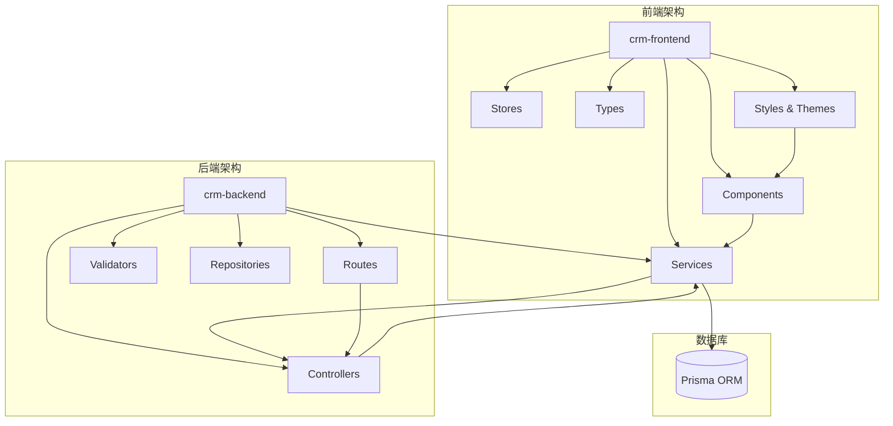
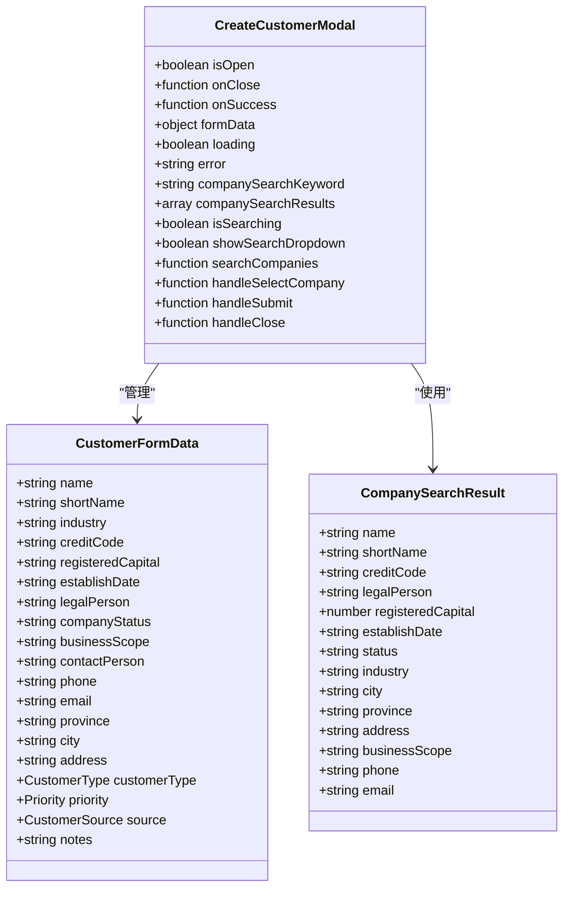
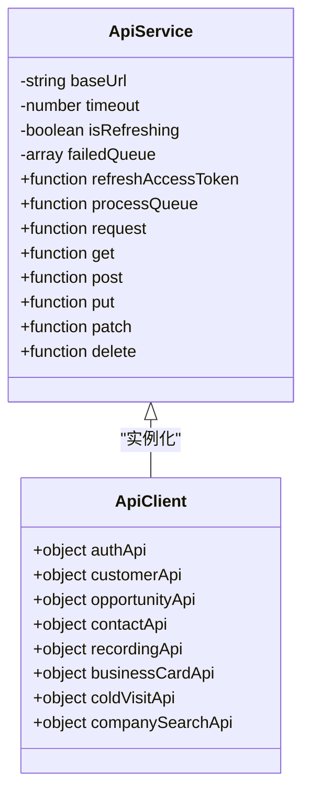
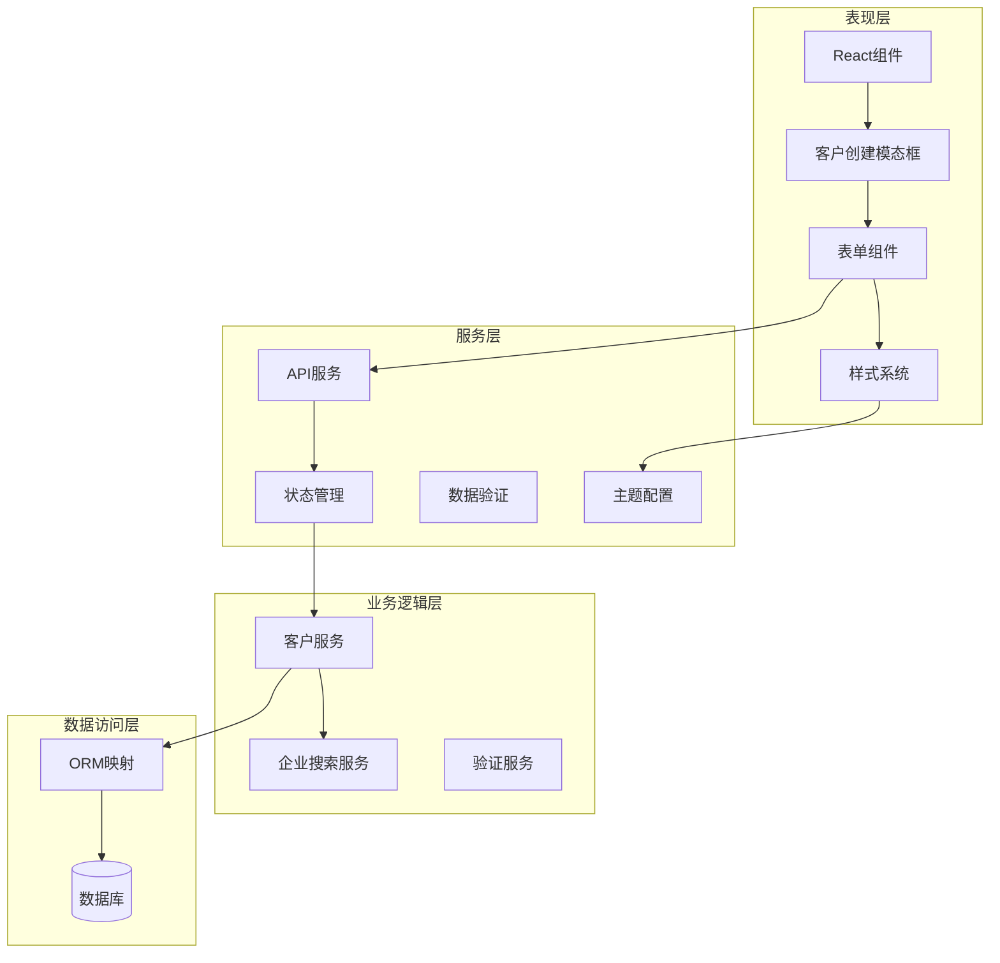
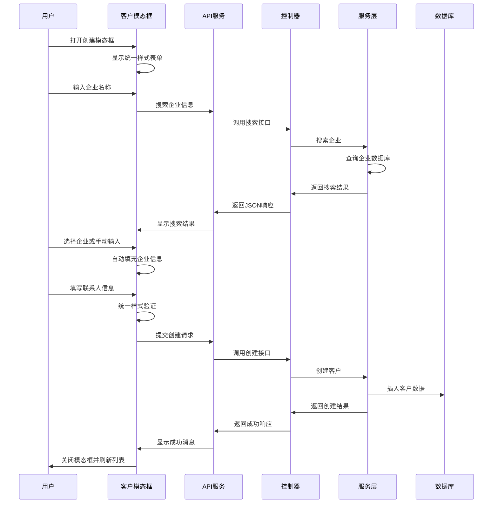
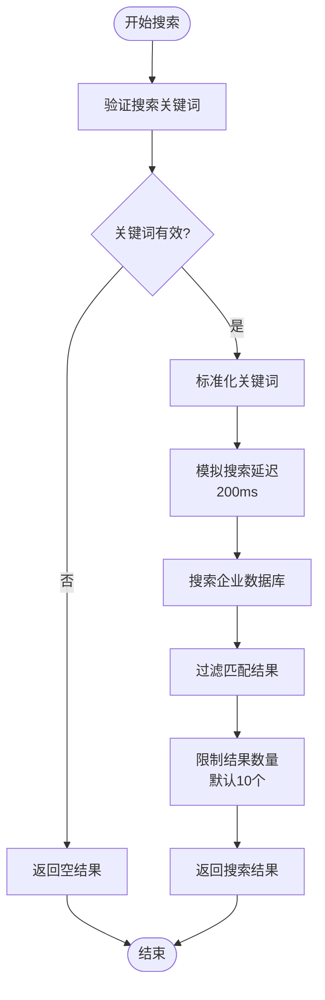
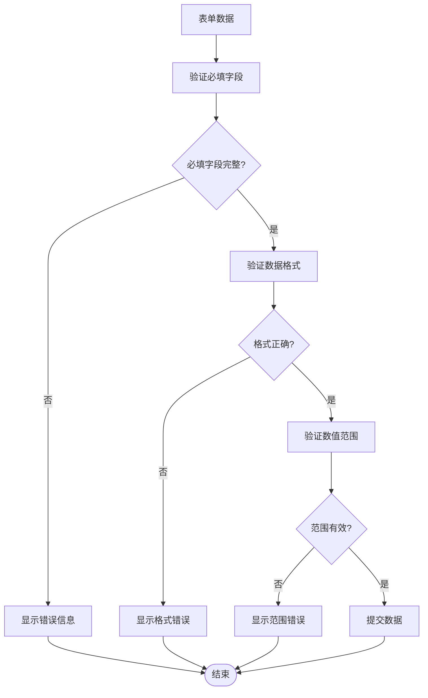
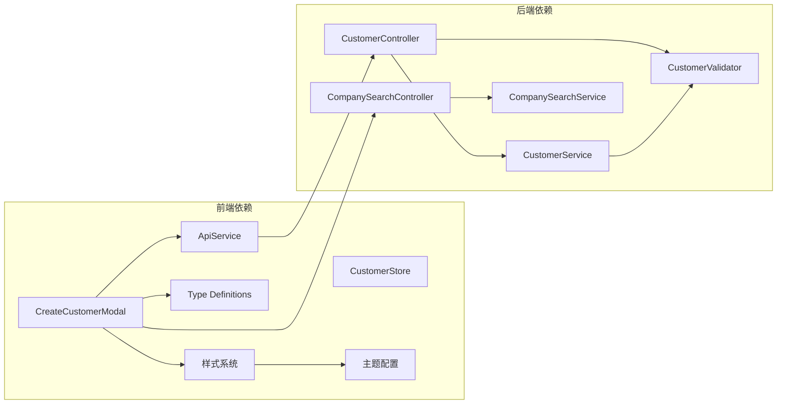

# 客户创建模态框增强功能

<cite>
**本文档引用的文件**
- [CreateCustomerModal.tsx](file://crm-frontend/src/components/Customers/CreateCustomerModal.tsx)
- [api.ts](file://crm-frontend/src/services/api.ts)
- [customerStore.ts](file://crm-frontend/src/stores/customerStore.ts)
- [index.ts](file://crm-frontend/src/types/index.ts)
- [customer.controller.ts](file://crm-backend/src/controllers/customer.controller.ts)
- [customer.service.ts](file://crm-backend/src/services/customer.service.ts)
- [customers.routes.ts](file://crm-backend/src/routes/customers.routes.ts)
- [companySearch.service.ts](file://crm-backend/src/services/companySearch.service.ts)
- [companySearch.controller.ts](file://crm-backend/src/controllers/companySearch.controller.ts)
- [companySearch.routes.ts](file://crm-backend/src/routes/companySearch.routes.ts)
- [customer.validator.ts](file://crm-backend/src/validators/customer.validator.ts)
- [index.css](file://crm-frontend/src/index.css)
- [App.css](file://crm-frontend/src/App.css)
- [postcss.config.js](file://crm-frontend/postcss.config.js)
- [vite.config.ts](file://crm-frontend/vite.config.ts)
</cite>

## 更新摘要
**所做更改**
- 新增样式统一改进章节，详细说明16个输入字段的视觉一致性优化
- 更新架构概览图，反映新的样式系统集成
- 增强性能考虑章节，包含样式优化策略
- 更新故障排除指南，增加样式相关问题排查

## 目录
1. [简介](#简介)
2. [项目结构](#项目结构)
3. [核心组件](#核心组件)
4. [架构概览](#架构概览)
5. [样式统一改进](#样式统一改进)
6. [详细组件分析](#详细组件分析)
7. [依赖关系分析](#依赖关系分析)
8. [性能考虑](#性能考虑)
9. [故障排除指南](#故障排除指南)
10. [结论](#结论)

## 简介

本文档深入分析了销售AI CRM系统中的客户创建模态框增强功能。该功能通过集成企业搜索、信息自动填充和客户分类机制，显著提升了客户信息录入的效率和准确性。系统采用前后端分离架构，前端使用React构建现代化的用户界面，后端基于Node.js和Express提供RESTful API服务。

**更新** 客户创建模态框组件经过全面的样式统一改进，实现了16个输入字段的视觉一致性优化，包括公司名称搜索、简称、行业、信用代码、注册资本、成立日期、法定代表人、公司状态、经营范围、联系人、电话、邮箱、省份、城市、地址、备注等字段的统一设计规范。

客户创建模态框的核心增强包括：
- 实时企业搜索和自动填充功能
- 智能表单验证和错误处理
- 多维度客户分类和优先级管理
- 响应式设计和用户体验优化
- **新增** 全面统一的视觉样式系统

## 项目结构

系统采用模块化的项目结构，清晰分离前端和后端代码：



**图表来源**
- [CreateCustomerModal.tsx:1-707](file://crm-frontend/src/components/Customers/CreateCustomerModal.tsx#L1-L707)
- [api.ts:1-1357](file://crm-frontend/src/services/api.ts#L1-L1357)
- [customer.controller.ts:1-58](file://crm-backend/src/controllers/customer.controller.ts#L1-L58)
- [index.css:1-317](file://crm-frontend/src/index.css#L1-L317)

**章节来源**
- [CreateCustomerModal.tsx:1-707](file://crm-frontend/src/components/Customers/CreateCustomerModal.tsx#L1-L707)
- [api.ts:1-1357](file://crm-frontend/src/services/api.ts#L1-L1357)
- [customer.controller.ts:1-58](file://crm-backend/src/controllers/customer.controller.ts#L1-L58)
- [index.css:1-317](file://crm-frontend/src/index.css#L1-L317)

## 核心组件

### 客户创建模态框组件

客户创建模态框是整个增强功能的核心组件，实现了完整的客户信息录入流程：



**图表来源**
- [CreateCustomerModal.tsx:16-70](file://crm-frontend/src/components/Customers/CreateCustomerModal.tsx#L16-L70)
- [index.ts:729-745](file://crm-frontend/src/types/index.ts#L729-L745)

### API服务层

前端API服务层提供了统一的HTTP请求封装和错误处理机制：



**图表来源**
- [api.ts:24-169](file://crm-frontend/src/services/api.ts#L24-L169)

**章节来源**
- [CreateCustomerModal.tsx:81-262](file://crm-frontend/src/components/Customers/CreateCustomerModal.tsx#L81-L262)
- [api.ts:199-230](file://crm-frontend/src/services/api.ts#L199-L230)

## 架构概览

系统采用分层架构设计，确保各层职责清晰分离：



**图表来源**
- [CreateCustomerModal.tsx:1-707](file://crm-frontend/src/components/Customers/CreateCustomerModal.tsx#L1-L707)
- [customer.service.ts:1-225](file://crm-backend/src/services/customer.service.ts#L1-L225)
- [companySearch.service.ts:268-327](file://crm-backend/src/services/companySearch.service.ts#L268-L327)
- [index.css:10-47](file://crm-frontend/src/index.css#L10-L47)

## 样式统一改进

### 视觉一致性优化

客户创建模态框经过全面的样式统一改进，实现了16个输入字段的视觉一致性优化：

#### 统一样式规范

所有输入字段采用统一的设计规范：
- **尺寸规格**：统一使用 `px-3 py-2` 的内边距
- **边框样式**：统一使用 `border border-slate-300 dark:border-slate-600`
- **圆角设置**：统一使用 `rounded-lg` 圆角
- **背景颜色**：统一使用 `bg-white dark:bg-slate-900`
- **文本颜色**：统一使用 `text-slate-900 dark:text-white`
- **占位符颜色**：统一使用 `placeholder:text-slate-400 dark:placeholder:text-slate-500`
- **焦点样式**：统一使用 `focus:outline-none focus:ring-2 focus:ring-primary/50`

#### 字段分组布局

**企业信息区块**（16个字段）
- 企业名称搜索：带搜索图标的输入框
- 企业简称：最多10字符限制
- 行业：标准输入框
- 统一社会信用代码：18位格式
- 注册资本：数字输入框（万元）
- 成立日期：日期选择器
- 法人代表：文本输入
- 企业状态：状态选择
- 经营范围：多行文本域

**联系信息区块**（6个字段）
- 联系人：必填字段
- 联系电话：电话号码格式
- 邮箱：邮箱格式
- 省份：地理位置输入
- 城市：地理位置输入
- 详细地址：完整地址输入

**客户分类区块**（4个字段）
- 客户分类：卡片式选择
- 优先级：分级按钮
- 客户来源：选项卡式选择
- 备注：多行文本域

#### 主题系统集成

系统采用Tailwind CSS 4主题配置，实现深色模式支持：

```css
/* Tailwind CSS 4 Theme Configuration */
@theme {
  /* 奢华暗色调配色 */
  --color-primary: #f59e0b;
  --color-primary-light: #fbbf24;
  --color-primary-dark: #d97706;
  --color-accent: #06b6d4;
  --color-success: #10b981;
  --color-warning: #f59e0b;
  --color-danger: #ef4444;
  
  /* 背景颜色 */
  --color-bg-primary: #0a0f1a;
  --color-bg-secondary: #111827;
  --color-bg-tertiary: #1f2937;
  --color-bg-card: rgba(17, 24, 39, 0.8);
  --color-bg-glass: rgba(17, 24, 39, 0.6);
  
  /* 文本颜色 */
  --color-text-primary: #f9fafb;
  --color-text-secondary: #9ca3af;
  --color-text-muted: #6b7280;
  
  /* 边框颜色 */
  --color-border: rgba(75, 85, 99, 0.4);
  --color-border-light: rgba(75, 85, 99, 0.2);
}
```

#### 响应式设计

所有组件均支持响应式设计：
- 移动端适配：使用 `grid grid-cols-1` 在小屏幕上自动换行
- 平板适配：使用 `grid grid-cols-2` 在中等屏幕上显示两列
- 桌面端优化：最大宽度 `max-w-3xl` 和适当的间距

**章节来源**
- [CreateCustomerModal.tsx:303-570](file://crm-frontend/src/components/Customers/CreateCustomerModal.tsx#L303-L570)
- [index.css:10-47](file://crm-frontend/src/index.css#L10-L47)
- [index.css:224-248](file://crm-frontend/src/index.css#L224-L248)

## 详细组件分析

### 客户创建流程

客户创建流程通过序列图清晰展示从用户交互到数据持久化的完整过程：



**图表来源**
- [CreateCustomerModal.tsx:100-252](file://crm-frontend/src/components/Customers/CreateCustomerModal.tsx#L100-L252)
- [customer.controller.ts:29-33](file://crm-backend/src/controllers/customer.controller.ts#L29-L33)
- [customer.service.ts:76-109](file://crm-backend/src/services/customer.service.ts#L76-L109)

### 企业搜索算法

企业搜索功能实现了高效的模糊匹配算法：



**图表来源**
- [companySearch.service.ts:274-292](file://crm-backend/src/services/companySearch.service.ts#L274-L292)

### 数据验证机制

系统实现了多层次的数据验证机制：



**图表来源**
- [customer.validator.ts:6-33](file://crm-backend/src/validators/customer.validator.ts#L6-L33)

**章节来源**
- [CreateCustomerModal.tsx:187-252](file://crm-frontend/src/components/Customers/CreateCustomerModal.tsx#L187-L252)
- [companySearch.service.ts:268-327](file://crm-backend/src/services/companySearch.service.ts#L268-L327)
- [customer.validator.ts:1-74](file://crm-backend/src/validators/customer.validator.ts#L1-L74)

## 依赖关系分析

系统各组件之间的依赖关系如下：



**图表来源**
- [CreateCustomerModal.tsx:6-14](file://crm-frontend/src/components/Customers/CreateCustomerModal.tsx#L6-L14)
- [customer.controller.ts:1-58](file://crm-backend/src/controllers/customer.controller.ts#L1-L58)
- [companySearch.controller.ts:1-46](file://crm-backend/src/controllers/companySearch.controller.ts#L1-L46)
- [index.css:10-47](file://crm-frontend/src/index.css#L10-L47)

**章节来源**
- [CreateCustomerModal.tsx:1-707](file://crm-frontend/src/components/Customers/CreateCustomerModal.tsx#L1-L707)
- [customer.controller.ts:1-58](file://crm-backend/src/controllers/customer.controller.ts#L1-L58)
- [companySearch.controller.ts:1-46](file://crm-backend/src/controllers/companySearch.controller.ts#L1-L46)

## 性能考虑

### 前端性能优化

系统采用了多项前端性能优化策略：

1. **防抖搜索机制**：企业搜索采用300ms防抖延迟，减少不必要的API调用
2. **虚拟滚动**：对于大量搜索结果采用虚拟滚动技术
3. **懒加载**：模态框按需加载，减少初始渲染负担
4. **状态缓存**：使用Zustand进行状态管理，避免重复计算
5. ****新增** 样式优化**：统一的CSS类名减少样式冲突，提高渲染效率

### 样式系统优化

**新增** 样式统一改进带来的性能提升：

- **CSS类名复用**：所有输入字段使用相同的样式类名，减少CSS规则数量
- **主题变量优化**：通过Tailwind CSS 4主题配置实现动态颜色切换
- **深色模式支持**：预编译的深色模式样式，避免运行时计算
- **动画性能**：使用硬件加速的CSS3变换和过渡效果

### 后端性能优化

后端服务实现了以下性能优化措施：

1. **数据库索引**：为常用查询字段建立数据库索引
2. **查询优化**：使用分页查询避免全表扫描
3. **缓存策略**：对热门企业信息实施缓存
4. **连接池管理**：合理配置数据库连接池大小

**章节来源**
- [index.css:10-47](file://crm-frontend/src/index.css#L10-L47)
- [postcss.config.js:1-7](file://crm-frontend/postcss.config.js#L1-L7)

## 故障排除指南

### 常见问题及解决方案

| 问题类型 | 症状描述 | 可能原因 | 解决方案 |
|---------|----------|----------|----------|
| 搜索无结果 | 输入企业名称后无搜索结果 | 关键词过短或数据库无匹配 | 增加关键词长度或检查数据库 |
| 表单验证失败 | 提交时出现验证错误 | 字段格式不正确或缺少必填项 | 检查字段格式和必填状态 |
| API请求超时 | 网络请求长时间无响应 | 网络连接问题或服务器负载过高 | 检查网络连接和服务器状态 |
| 数据库连接失败 | 无法连接到数据库 | 数据库服务异常或配置错误 | 检查数据库服务和连接配置 |
| **新增** 样式显示异常 | 输入框样式不一致或显示错误 | CSS类名冲突或主题配置问题 | 检查样式文件和主题配置 |

### 调试技巧

1. **浏览器开发者工具**：使用Network面板监控API请求
2. **控制台日志**：添加详细的错误日志输出
3. **状态检查**：使用React DevTools检查组件状态
4. **数据库查询**：通过Prisma Studio查看数据库状态
5. ****新增** 样式调试**：使用浏览器开发者工具检查CSS类名和样式应用情况

### 样式问题排查

**新增** 针对样式统一改进的专门排查步骤：

1. **检查CSS类名**：确认所有输入字段都应用了统一的样式类名
2. **验证主题配置**：检查Tailwind CSS主题配置是否正确加载
3. **测试深色模式**：验证深色模式下的颜色对比度和可读性
4. **响应式测试**：在不同屏幕尺寸下测试布局适应性
5. **动画效果**：检查焦点状态和悬停效果的一致性

**章节来源**
- [CreateCustomerModal.tsx:100-136](file://crm-frontend/src/components/Customers/CreateCustomerModal.tsx#L100-L136)
- [api.ts:132-138](file://crm-frontend/src/services/api.ts#L132-L138)
- [index.css:299-302](file://crm-frontend/src/index.css#L299-L302)

## 结论

客户创建模态框增强功能通过集成企业搜索、智能验证和分类管理，显著提升了CRM系统的用户体验和数据质量。该功能展现了现代Web应用的最佳实践，包括：

1. **用户体验优化**：通过自动填充和智能搜索减少用户输入负担
2. **数据质量保证**：多层验证机制确保数据的准确性和完整性
3. **系统性能**：合理的架构设计和优化策略保证了良好的响应速度
4. **可扩展性**：模块化的组件设计便于功能扩展和维护
5. ****新增** 视觉一致性**：全面统一的样式系统提升了整体界面的专业性和可用性

**更新** 最重要的改进是16个输入字段的视觉一致性优化，通过统一的样式规范、主题系统集成和响应式设计，实现了高度一致的用户体验。这一改进不仅提升了界面美观度，更重要的是增强了用户的操作效率和数据录入的准确性。

该功能的成功实施为后续的CRM功能开发奠定了坚实的基础，体现了团队在前端工程化、样式系统设计和后端服务设计方面的专业能力。