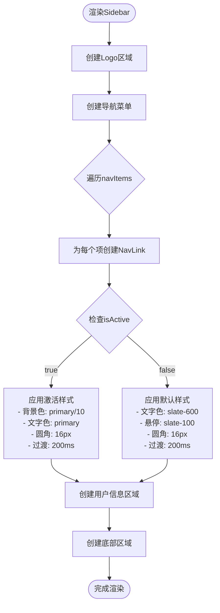
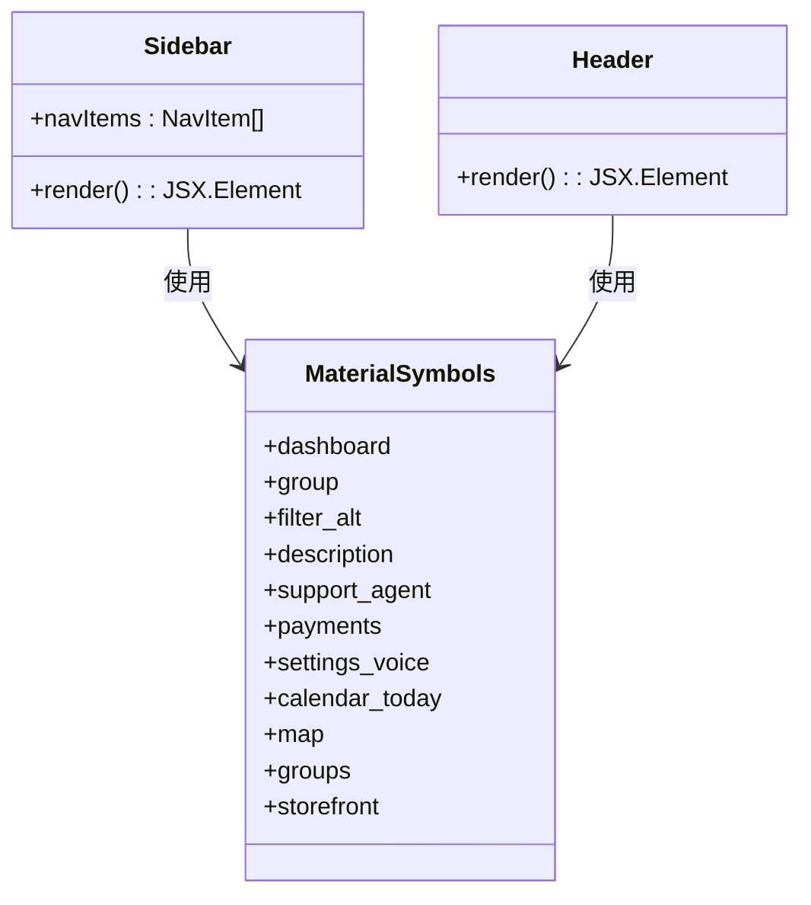
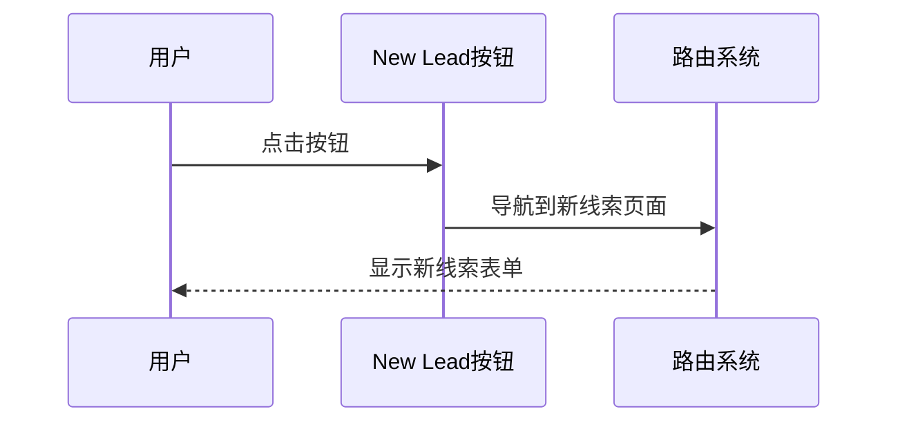
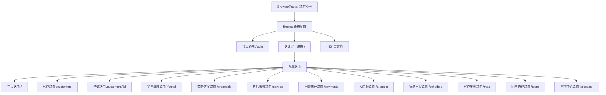
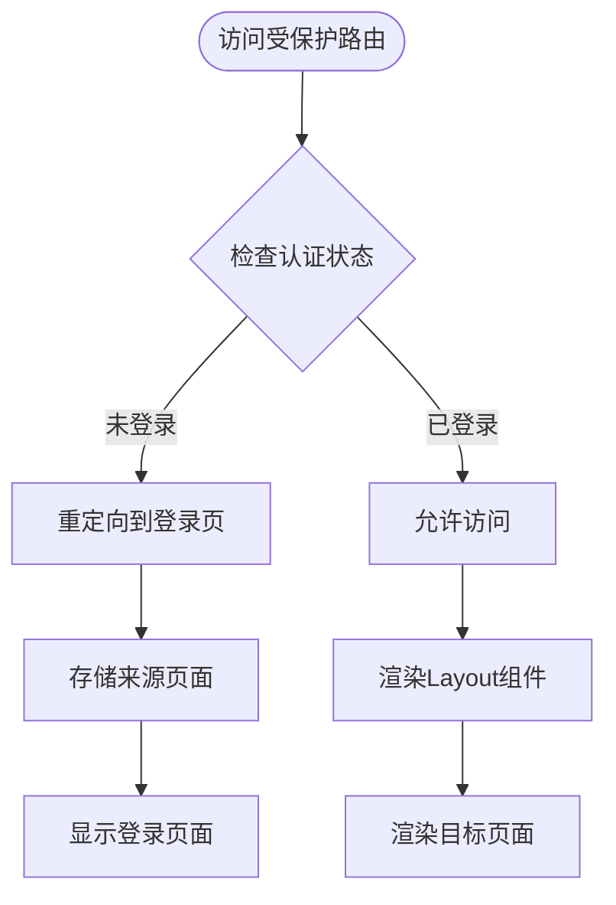
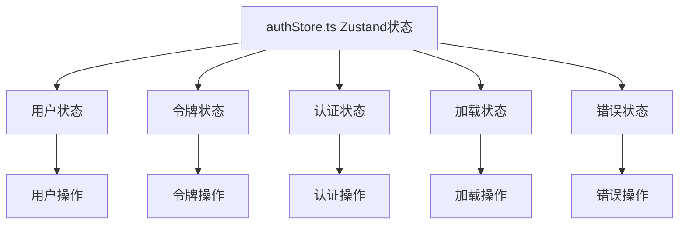

# 导航组件（Sidebar）

<cite>
**本文档引用的文件**
- [Sidebar.tsx](file://crm-frontend/src/components/layout/Sidebar.tsx)
- [App.tsx](file://crm-frontend/src/App.tsx)
- [Header.tsx](file://crm-frontend/src/components/layout/Header.tsx)
- [Layout.tsx](file://crm-frontend/src/components/layout/Layout.tsx)
- [authStore.ts](file://crm-frontend/src/stores/authStore.ts)
- [package.json](file://crm-frontend/package.json)
- [vite.config.ts](file://crm-frontend/vite.config.ts)
</cite>

## 更新摘要
**变更内容**
- 更新了Sidebar组件实现，采用react-router-dom的NavLink组件
- 替换了图标库从lucide-react到Material Symbols
- 新增了完整的路由系统和认证守卫
- 引入了Zustand状态管理替代Redux
- 更新了Layout组件架构

## 目录
1. [简介](#简介)
2. [项目结构](#项目结构)
3. [核心组件](#核心组件)
4. [架构概览](#架构概览)
5. [详细组件分析](#详细组件分析)
6. [路由系统集成](#路由系统集成)
7. [状态管理](#状态管理)
8. [依赖关系分析](#依赖关系分析)
9. [性能考虑](#性能考虑)
10. [故障排除指南](#故障排除指南)
11. [结论](#结论)
12. [附录](#附录)

## 简介

本文件为销售AI CRM系统的Sidebar导航组件提供详细的技术文档。该组件采用现代化的React + TypeScript架构，集成了Material Symbols图标库，实现了响应式的侧边导航栏功能。组件包含11个导航项，支持激活状态管理和交互反馈，并提供了一个专门的"New Lead"按钮用于创建新线索。该组件现已完全集成到基于react-router-dom的路由系统中，提供了完整的页面导航和认证保护功能。

## 项目结构

CRM前端项目采用模块化架构设计，Sidebar组件位于components/layout目录下，与Header、Layout等其他UI组件协同工作，形成了完整的页面布局架构。

```mermaid
graph TB
subgraph "CRM前端应用"
App[App.tsx 主应用]
Layout[Layout.tsx 布局容器]
subgraph "布局组件层"
Sidebar[Sidebar.tsx 导航组件]
Header[Header.tsx 头部组件]
</subgraph>
subgraph "页面组件层"
Dashboard[Dashboard 页面]
Customers[Customers 页面]
SalesFunnel[SalesFunnel 页面]
Proposals[Proposals 页面]
Service[Service 页面]
Payments[Payments 页面]
AIAudio[AIAudio 页面]
Schedule[Schedule 页面]
Map[Map 页面]
Team[Team 页面]
PreSales[PreSales 页面]
Login[Login 页面]
</subgraph>
subgraph "状态管理层"
AuthStore[authStore.ts 认证状态]
</subgraph>
subgraph "样式层"
TailwindCSS[Tailwind CSS 框架]
MaterialSymbols[Material Symbols 图标库]
</subgraph>
subgraph "依赖管理"
PackageJSON[package.json 依赖配置]
ViteConfig[vite.config.ts 构建配置]
</subgraph>
end
App --> Layout
Layout --> Sidebar
Layout --> Header
App --> Dashboard
App --> Customers
App --> SalesFunnel
App --> Proposals
App --> Service
App --> Payments
App --> AIAudio
App --> Schedule
App --> Map
App --> Team
App --> PreSales
App --> Login
Sidebar --> MaterialSymbols
Header --> MaterialSymbols
AuthStore --> Zustand[Zustand 状态管理]
App --> AuthStore
```

**图表来源**
- [App.tsx:1-68](file://crm-frontend/src/App.tsx#L1-L68)
- [Layout.tsx:1-24](file://crm-frontend/src/components/layout/Layout.tsx#L1-L24)
- [Sidebar.tsx:1-78](file://crm-frontend/src/components/layout/Sidebar.tsx#L1-L78)

**章节来源**
- [App.tsx:1-68](file://crm-frontend/src/App.tsx#L1-L68)
- [Layout.tsx:1-24](file://crm-frontend/src/components/layout/Layout.tsx#L1-L24)
- [Sidebar.tsx:1-78](file://crm-frontend/src/components/layout/Sidebar.tsx#L1-L78)

## 核心组件

### Sidebar组件架构

Sidebar组件采用函数式组件设计，包含以下核心部分：

1. **路由集成**：使用react-router-dom的NavLink组件实现导航
2. **图标系统**：从Material Symbols库导入11个专业图标
3. **导航配置**：11个预定义的导航项数组，包含路径、图标和标签
4. **用户信息区域**：显示当前登录用户的信息
5. **新线索按钮**：专用的CTA按钮

### 导航配置系统

Sidebar组件定义了完整的导航项配置数组，包含11个专业的业务功能：

| 序号 | 路径 | 图标 | 标签 | 功能描述 |
|------|------|------|------|----------|
| 1 | `/` | `dashboard` | 工作台 | 主控制面板 |
| 2 | `/customers` | `group` | 客户管理 | 客户信息维护 |
| 3 | `/funnel` | `filter_alt` | 销售漏斗 | 销售流程跟踪 |
| 4 | `/proposals` | `description` | 商务方案 | 合同和方案管理 |
| 5 | `/service` | `support_agent` | 售后服务 | 客户支持服务 |
| 6 | `/payments` | `payments` | 回款统计 | 财务回款跟踪 |
| 7 | `/ai-audio` | `settings_voice` | AI 录音分析 | 音频内容分析 |
| 8 | `/schedule` | `calendar_today` | 智能日程 | 日程安排管理 |
| 9 | `/map` | `map` | 客户地图 | 地理位置可视化 |
| 10 | `/team` | `groups` | 团队协作 | 团队成员管理 |
| 11 | `/presales` | `storefront` | 售前中心 | 售前咨询支持 |

每个导航项都配置了统一的图标样式和标签文本。

**章节来源**
- [Sidebar.tsx:4-16](file://crm-frontend/src/components/layout/Sidebar.tsx#L4-L16)

### 用户信息区域

Sidebar组件包含一个用户信息区域，显示当前登录用户的基本信息：

- **头像**：使用用户头像图片
- **姓名**：显示用户名
- **角色**：显示用户角色（销售经理）
- **样式**：采用深色主题适配

**章节来源**
- [Sidebar.tsx:60-75](file://crm-frontend/src/components/layout/Sidebar.tsx#L60-L75)

## 架构概览

整个导航系统的架构体现了清晰的关注点分离和组件化设计原则，现已完全集成到现代的React路由生态系统中。

```mermaid
graph LR
subgraph "应用层"
App[App.tsx 应用容器]
ProtectedRoute[ProtectedRoute 认证守卫]
Layout[Layout.tsx 布局容器]
end
subgraph "导航层"
Sidebar[Sidebar.tsx 主导航]
NavLink[NavLink 路由链接]
</subgraph
subgraph "头部层"
Header[Header.tsx 头部组件]
</subgraph
subgraph "状态管理层"
AuthStore[authStore.ts Zustand状态]
</subgraph
subgraph "样式层"
TailwindCSS[Tailwind CSS]
MaterialSymbols[Material Symbols]
</subgraph
subgraph "路由层"
BrowserRouter[BrowserRouter 路由容器]
Routes[Routes 路由配置]
Route[Route 页面路由]
</subgraph
subgraph "交互层"
ActiveState[激活状态管理]
HoverEffects[悬停效果]
ClickHandlers[点击处理]
</subgraph
App --> ProtectedRoute
ProtectedRoute --> Layout
Layout --> Sidebar
Layout --> Header
Sidebar --> NavLink
Sidebar --> MaterialSymbols
Header --> AuthStore
AuthStore --> Zustand
App --> BrowserRouter
BrowserRouter --> Routes
Routes --> Route
```

**图表来源**
- [App.tsx:18-29](file://crm-frontend/src/App.tsx#L18-L29)
- [Layout.tsx:9-23](file://crm-frontend/src/components/layout/Layout.tsx#L9-L23)
- [Sidebar.tsx:18-78](file://crm-frontend/src/components/layout/Sidebar.tsx#L18-L78)

## 详细组件分析

### Sidebar组件实现

Sidebar组件是导航系统的核心，实现了以下关键功能：

#### Props接口设计

Sidebar组件目前没有接受任何Props，但其内部结构支持通过props进行扩展：

```typescript
interface SidebarProps {
  title?: string;
  onNavigation?: (path: string) => void;
}
```

#### 导航项渲染系统

Sidebar组件使用map方法遍历导航配置数组，为每个导航项生成对应的NavLink组件：



**图表来源**
- [Sidebar.tsx:34-49](file://crm-frontend/src/components/layout/Sidebar.tsx#L34-L49)

#### Material Symbols图标系统

组件集成了Material Symbols图标库，提供了丰富的专业图标资源：



**图表来源**
- [Sidebar.tsx:23-24](file://crm-frontend/src/components/layout/Sidebar.tsx#L23-L24)
- [Header.tsx:25-26](file://crm-frontend/src/components/layout/Header.tsx#L25-L26)

**章节来源**
- [Sidebar.tsx:1-78](file://crm-frontend/src/components/layout/Sidebar.tsx#L1-L78)

### 新线索按钮实现

新线索按钮是导航系统的重要组成部分，提供了快速创建新客户的入口：



**图表来源**
- [Sidebar.tsx:54-57](file://crm-frontend/src/components/layout/Sidebar.tsx#L54-L57)

**章节来源**
- [Sidebar.tsx:54-57](file://crm-frontend/src/components/layout/Sidebar.tsx#L54-L57)

## 路由系统集成

### 路由配置架构

应用采用了完整的路由系统，支持嵌套路由和认证保护：



**图表来源**
- [App.tsx:31-66](file://crm-frontend/src/App.tsx#L31-L66)

### 认证守卫系统

应用实现了完整的认证守卫系统，确保只有登录用户才能访问受保护的页面：



**图表来源**
- [App.tsx:19-29](file://crm-frontend/src/App.tsx#L19-L29)

**章节来源**
- [App.tsx:1-68](file://crm-frontend/src/App.tsx#L1-L68)

## 状态管理

### Zustand状态管理

应用采用了Zustand作为状态管理解决方案，提供了轻量级的状态管理能力：



**图表来源**
- [authStore.ts:37-123](file://crm-frontend/src/stores/authStore.ts#L37-L123)

### 认证状态管理

AuthStore提供了完整的认证状态管理功能：

| 状态 | 类型 | 描述 |
|------|------|------|
| user | User \| null | 当前登录用户信息 |
| token | string \| null | JWT访问令牌 |
| isAuthenticated | boolean | 认证状态 |
| isLoading | boolean | 加载状态 |
| error | string \| null | 错误信息 |

**章节来源**
- [authStore.ts:1-123](file://crm-frontend/src/stores/authStore.ts#L1-L123)

## 依赖关系分析

### 外部依赖

系统的主要外部依赖包括：

| 依赖包 | 版本 | 用途 |
|--------|------|------|
| react-router-dom | ^7.13.1 | 路由系统 |
| zustand | ^5.0.11 | 状态管理 |
| lucide-react | ^0.577.0 | 图标库（备用） |
| react | ^19.2.4 | 核心框架 |
| react-dom | ^19.2.4 | DOM渲染 |
| tailwindcss | ^4.2.1 | CSS框架 |

### 内部依赖关系

```mermaid
graph TD
Sidebar[Sidebar.tsx] --> ReactRouter[react-router-dom]
Sidebar --> MaterialSymbols[Material Symbols]
Sidebar --> TailwindCSS[Tailwind CSS]
Layout[Layout.tsx] --> Sidebar
Layout --> Header
App[App.tsx] --> Layout
App --> AuthStore[authStore.ts]
AuthStore --> Zustand
App --> ReactRouter
subgraph "构建工具"
Vite[Vite]
ReactPlugin[React Plugin]
</subgraph
Vite --> ReactPlugin
App --> Vite
```

**图表来源**
- [package.json:12-18](file://crm-frontend/package.json#L12-L18)
- [vite.config.ts:1-13](file://crm-frontend/vite.config.ts#L1-L13)

**章节来源**
- [package.json:1-38](file://crm-frontend/package.json#L1-L38)
- [vite.config.ts:1-13](file://crm-frontend/vite.config.ts#L1-L13)

## 性能考虑

### 渲染优化

1. **组件拆分**：将Sidebar独立为可复用组件，减少重复代码
2. **条件渲染**：仅在需要时应用激活样式
3. **图标优化**：使用Material Symbols矢量图标，支持任意缩放
4. **状态管理优化**：使用Zustand减少不必要的状态更新

### 路由性能

1. **懒加载**：页面组件按需加载
2. **缓存策略**：使用localStorage缓存认证状态
3. **内存管理**：组件卸载时清理状态

### 样式优化

1. **原子化CSS**：利用Tailwind CSS实现高效的样式管理
2. **深色模式**：支持暗色主题适配
3. **响应式设计**：支持移动端和桌面端适配

## 故障排除指南

### 常见问题及解决方案

| 问题 | 可能原因 | 解决方案 |
|------|----------|----------|
| 导航不工作 | react-router-dom未正确安装 | 运行npm install react-router-dom |
| 图标不显示 | Material Symbols未正确加载 | 检查@material-icons/font CDN连接 |
| 认证失败 | Zustand状态管理错误 | 检查authStore配置和持久化设置 |
| 路由跳转异常 | 路由配置错误 | 确保所有路由路径正确配置 |
| 响应式布局失效 | Tailwind CSS配置错误 | 检查tailwind.config.js配置 |

### 调试建议

1. **开发者工具**：使用浏览器开发者工具检查元素样式
2. **React DevTools**：监控组件渲染和状态变化
3. **网络面板**：确认图标资源和API请求加载成功
4. **状态检查**：使用React DevTools的Zustand插件检查状态

**章节来源**
- [package.json:17](file://crm-frontend/package.json#L17)

## 结论

Sidebar导航组件展现了现代React应用的最佳实践，通过清晰的组件分离、类型安全的接口设计、优雅的样式系统和完整的路由集成，实现了功能完整且易于维护的导航解决方案。组件的模块化设计为未来的功能扩展奠定了良好的基础，同时引入的认证守卫和状态管理系统确保了应用的安全性和可靠性。

## 附录

### 使用示例

#### 基础使用
```typescript
import { Layout } from './components/layout/Layout';

function App() {
  return (
    <div className="flex h-screen">
      <Layout />
      {/* 其他内容 */}
    </div>
  );
}
```

#### 自定义导航项
```typescript
const customNavItems = [
  { path: '/custom', icon: 'custom_icon', label: '自定义功能' },
  // ... 更多导航项
];
```

### 最佳实践

1. **保持组件单一职责**：Sidebar专注于导航，状态管理交由AuthStore
2. **类型安全**：始终使用TypeScript接口定义Props和状态
3. **路由安全**：为所有受保护路由添加认证守卫
4. **状态管理**：使用Zustand进行轻量级状态管理
5. **性能优化**：避免不必要的重新渲染，合理使用React.memo
6. **用户体验**：提供清晰的导航反馈和加载状态

### 扩展指南

#### 添加新的导航项
1. 在navItems数组中添加新的导航项对象
2. 确保路由路径在App.tsx中正确配置
3. 确保图标在Material Symbols库中有对应图标
4. 测试新导航项的样式和交互

#### 自定义样式
1. 修改Sidebar组件中的Tailwind CSS类名
2. 更新Tailwind CSS配置文件
3. 测试深色模式适配效果
4. 确保响应式布局正常工作

#### 集成新页面
1. 创建新页面组件
2. 在App.tsx中添加路由配置
3. 在Sidebar中添加导航项
4. 实现必要的认证和权限检查