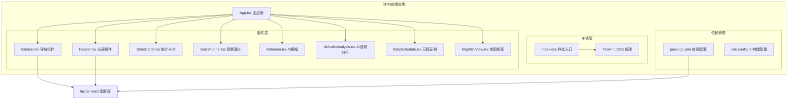
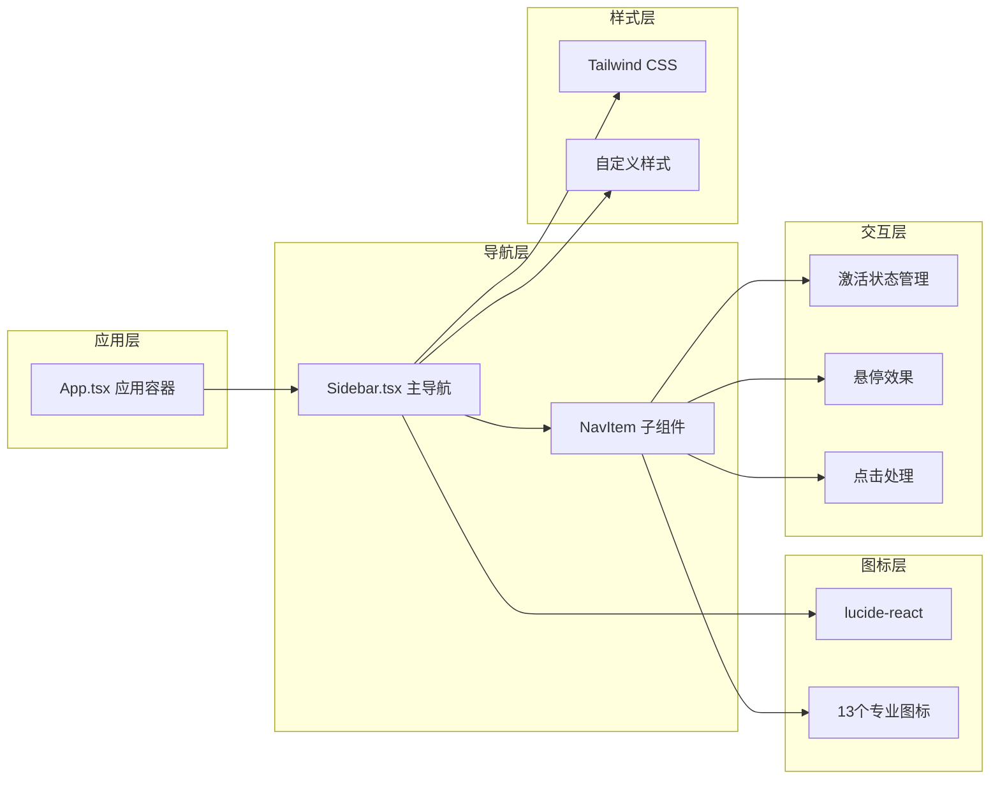
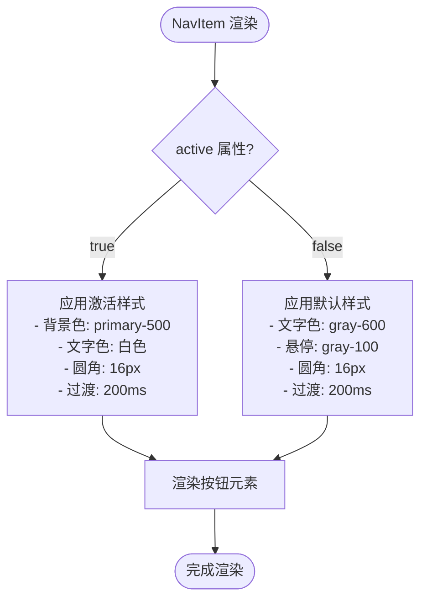
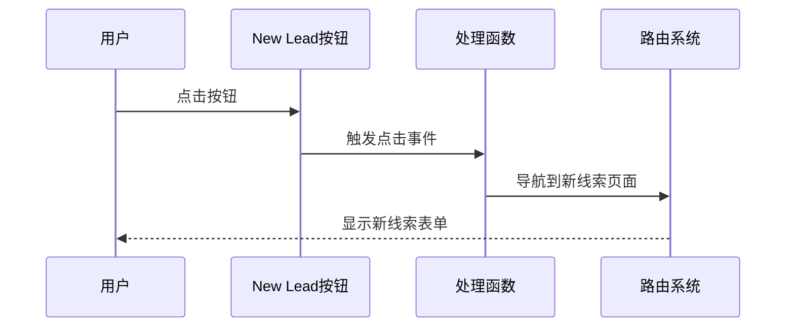
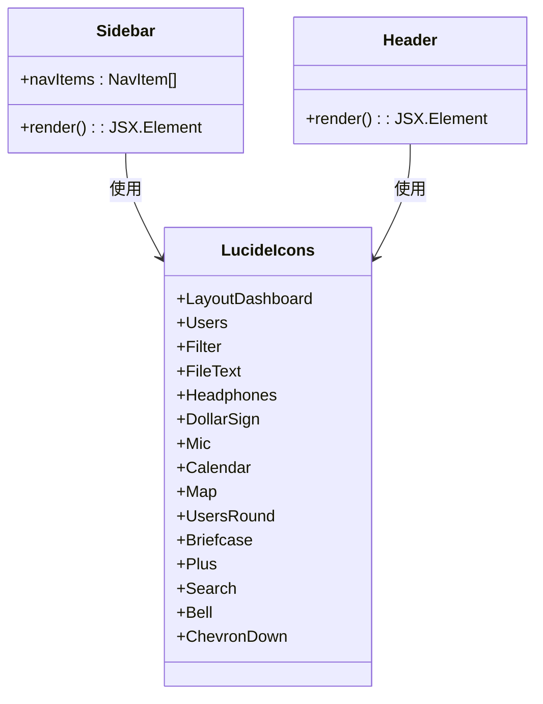
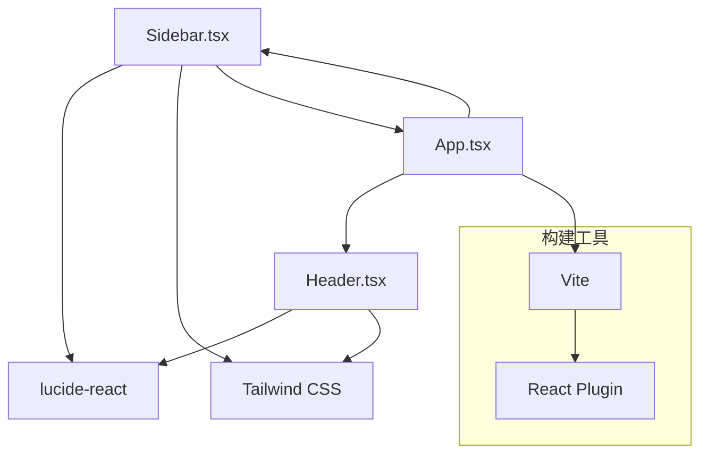

# 导航组件（Sidebar）

<cite>
**本文档引用的文件**
- [Sidebar.tsx](file://crm-frontend/src/components/Sidebar.tsx)
- [App.tsx](file://crm-frontend/src/App.tsx)
- [Header.tsx](file://crm-frontend/src/components/Header.tsx)
- [index.css](file://crm-frontend/src/index.css)
- [package.json](file://crm-frontend/package.json)
- [vite.config.ts](file://crm-frontend/vite.config.ts)
</cite>

## 目录
1. [简介](#简介)
2. [项目结构](#项目结构)
3. [核心组件](#核心组件)
4. [架构概览](#架构概览)
5. [详细组件分析](#详细组件分析)
6. [依赖关系分析](#依赖关系分析)
7. [性能考虑](#性能考虑)
8. [故障排除指南](#故障排除指南)
9. [结论](#结论)
10. [附录](#附录)

## 简介

本文件为销售AI CRM系统的Sidebar导航组件提供详细的技术文档。该组件采用现代化的React + TypeScript架构，集成了Lucide React图标库，实现了响应式的侧边导航栏功能。组件包含11个导航项，支持激活状态管理和交互反馈，并提供了一个专门的"New Lead"按钮用于创建新线索。

## 项目结构

CRM前端项目采用模块化架构设计，Sidebar组件位于components目录下，与Header、StatsCards等其他UI组件协同工作。



**图表来源**
- [App.tsx:10-55](file://crm-frontend/src/App.tsx#L10-L55)
- [Sidebar.tsx:1-86](file://crm-frontend/src/components/Sidebar.tsx#L1-L86)

**章节来源**
- [App.tsx:1-58](file://crm-frontend/src/App.tsx#L1-L58)
- [Sidebar.tsx:1-86](file://crm-frontend/src/components/Sidebar.tsx#L1-L86)

## 核心组件

### Sidebar组件架构

Sidebar组件采用函数式组件设计，包含以下核心部分：

1. **图标导入系统**：从lucide-react库导入13个专业图标
2. **NavItem子组件**：可复用的导航项渲染器
3. **导航项配置**：11个预定义的导航项数组
4. **新线索按钮**：专用的CTA按钮

### NavItem子组件设计

NavItem是一个高度可复用的子组件，支持以下特性：

- **类型安全的Props接口**：确保运行时类型正确性
- **条件样式应用**：根据激活状态动态切换样式
- **响应式布局**：适配不同屏幕尺寸
- **过渡动画**：提供流畅的交互体验

**章节来源**
- [Sidebar.tsx:16-35](file://crm-frontend/src/components/Sidebar.tsx#L16-L35)
- [Sidebar.tsx:22-35](file://crm-frontend/src/components/Sidebar.tsx#L22-L35)

## 架构概览

整个导航系统的架构体现了清晰的关注点分离和组件化设计原则。



**图表来源**
- [Sidebar.tsx:37-83](file://crm-frontend/src/components/Sidebar.tsx#L37-L83)
- [Sidebar.tsx:16-35](file://crm-frontend/src/components/Sidebar.tsx#L16-L35)

## 详细组件分析

### NavItem组件实现

NavItem组件是导航系统的核心，实现了以下关键功能：

#### Props接口设计

| 属性名 | 类型 | 必需 | 默认值 | 描述 |
|--------|------|------|--------|------|
| icon | React.ReactNode | 是 | - | 要显示的图标元素 |
| label | string | 是 | - | 导航项的显示文本 |
| active | boolean | 否 | false | 是否处于激活状态 |

#### 样式系统

组件采用条件样式绑定，根据激活状态应用不同的样式类：



**图表来源**
- [Sidebar.tsx:22-35](file://crm-frontend/src/components/Sidebar.tsx#L22-L35)

#### 交互状态管理

NavItem组件通过简单的属性传递实现状态管理，无需内部状态管理逻辑，体现了函数式组件的最佳实践。

**章节来源**
- [Sidebar.tsx:16-35](file://crm-frontend/src/components/Sidebar.tsx#L16-L35)

### 导航项配置系统

Sidebar组件定义了完整的导航项配置数组，包含11个专业的业务功能：

| 序号 | 图标 | 标签 | 功能描述 |
|------|------|------|----------|
| 1 | LayoutDashboard | 工作台 | 主控制面板 |
| 2 | Users | 客户管理 | 客户信息维护 |
| 3 | Filter | 销售漏斗 | 销售流程跟踪 |
| 4 | FileText | 商务方案 | 合同和方案管理 |
| 5 | Headphones | 售后服务 | 客户支持服务 |
| 6 | DollarSign | 回款统计 | 财务回款跟踪 |
| 7 | Mic | AI 录音分析 | 音频内容分析 |
| 8 | Calendar | 智能日程 | 日程安排管理 |
| 9 | Map | 客户地图 | 地理位置可视化 |
| 10 | UsersRound | 团队协作 | 团队成员管理 |
| 11 | Briefcase | 售前中心 | 售前咨询支持 |

每个导航项都配置了统一的图标尺寸（20px）和标签文本。

**章节来源**
- [Sidebar.tsx:38-50](file://crm-frontend/src/components/Sidebar.tsx#L38-L50)

### 新线索按钮实现

新线索按钮是导航系统的重要组成部分，提供了快速创建新客户的入口：



**图表来源**
- [Sidebar.tsx:74-80](file://crm-frontend/src/components/Sidebar.tsx#L74-L80)

**章节来源**
- [Sidebar.tsx:74-80](file://crm-frontend/src/components/Sidebar.tsx#L74-L80)

### 图标库集成

系统集成了lucide-react图标库，提供了丰富的专业图标资源：



**图表来源**
- [Sidebar.tsx:1-14](file://crm-frontend/src/components/Sidebar.tsx#L1-L14)
- [Header.tsx:1](file://crm-frontend/src/components/Header.tsx#L1)

**章节来源**
- [Sidebar.tsx:1-14](file://crm-frontend/src/components/Sidebar.tsx#L1-L14)
- [package.json:14](file://crm-frontend/package.json#L14)

## 依赖关系分析

### 外部依赖

系统的主要外部依赖包括：

| 依赖包 | 版本 | 用途 |
|--------|------|------|
| lucide-react | ^0.577.0 | 图标库 |
| react | ^19.2.4 | 核心框架 |
| react-dom | ^19.2.4 | DOM渲染 |
| tailwindcss | ^4.2.1 | CSS框架 |

### 内部依赖关系



**图表来源**
- [package.json:12-17](file://crm-frontend/package.json#L12-L17)
- [vite.config.ts:1-8](file://crm-frontend/vite.config.ts#L1-L8)

**章节来源**
- [package.json:1-36](file://crm-frontend/package.json#L1-L36)
- [vite.config.ts:1-8](file://crm-frontend/vite.config.ts#L1-L8)

## 性能考虑

### 渲染优化

1. **组件拆分**：将NavItem独立为可复用组件，减少重复代码
2. **条件渲染**：仅在需要时应用激活样式
3. **图标优化**：使用矢量图标，支持任意缩放

### 样式优化

1. **原子化CSS**：利用Tailwind CSS实现高效的样式管理
2. **自定义主题**：通过CSS变量实现主题定制
3. **响应式设计**：支持移动端和桌面端适配

## 故障排除指南

### 常见问题及解决方案

| 问题 | 可能原因 | 解决方案 |
|------|----------|----------|
| 图标不显示 | lucide-react未正确安装 | 运行npm install lucide-react |
| 样式异常 | Tailwind CSS配置错误 | 检查tailwind.config.js配置 |
| 导航项不响应 | 事件处理函数缺失 | 确保NavItem接收并使用active属性 |
| 响应式布局失效 | 移动端断点设置不当 | 检查CSS媒体查询 |

### 调试建议

1. **开发者工具**：使用浏览器开发者工具检查元素样式
2. **React DevTools**：监控组件渲染和状态变化
3. **网络面板**：确认图标资源加载成功

**章节来源**
- [package.json:14](file://crm-frontend/package.json#L14)

## 结论

Sidebar导航组件展现了现代React应用的最佳实践，通过清晰的组件分离、类型安全的接口设计和优雅的样式系统，实现了功能完整且易于维护的导航解决方案。组件的模块化设计为未来的功能扩展奠定了良好的基础。

## 附录

### 使用示例

#### 基础使用
```typescript
import Sidebar from './components/Sidebar';

function App() {
  return (
    <div className="flex h-screen">
      <Sidebar />
      {/* 其他内容 */}
    </div>
  );
}
```

#### 自定义导航项
```typescript
const customNavItems = [
  { icon: <CustomIcon />, label: '自定义功能', active: false },
  // ... 更多导航项
];
```

### 最佳实践

1. **保持组件单一职责**：NavItem专注于渲染，状态管理交由父组件
2. **类型安全**：始终使用TypeScript接口定义Props
3. **样式一致性**：遵循Tailwind CSS的原子化设计原则
4. **可访问性**：为所有交互元素提供适当的ARIA属性
5. **性能优化**：避免不必要的重新渲染，合理使用React.memo

### 扩展指南

#### 添加新的导航项
1. 从lucide-react导入所需图标
2. 在navItems数组中添加新的导航项对象
3. 确保图标尺寸一致（推荐20px）
4. 测试新导航项的样式和交互

#### 自定义样式
1. 修改index.css中的CSS变量
2. 更新Tailwind CSS配置文件
3. 测试响应式布局效果