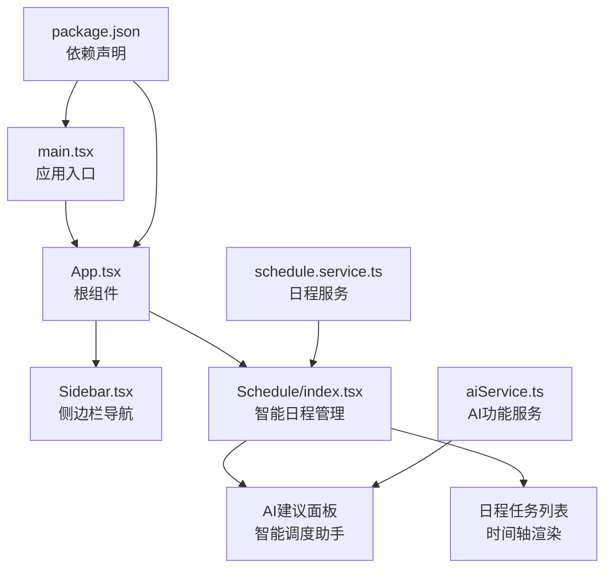
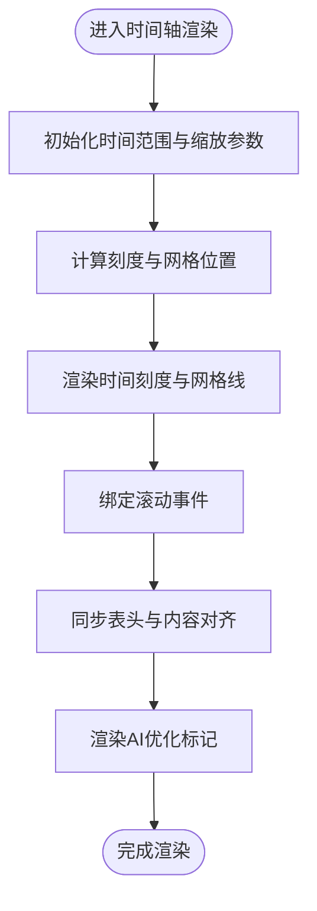
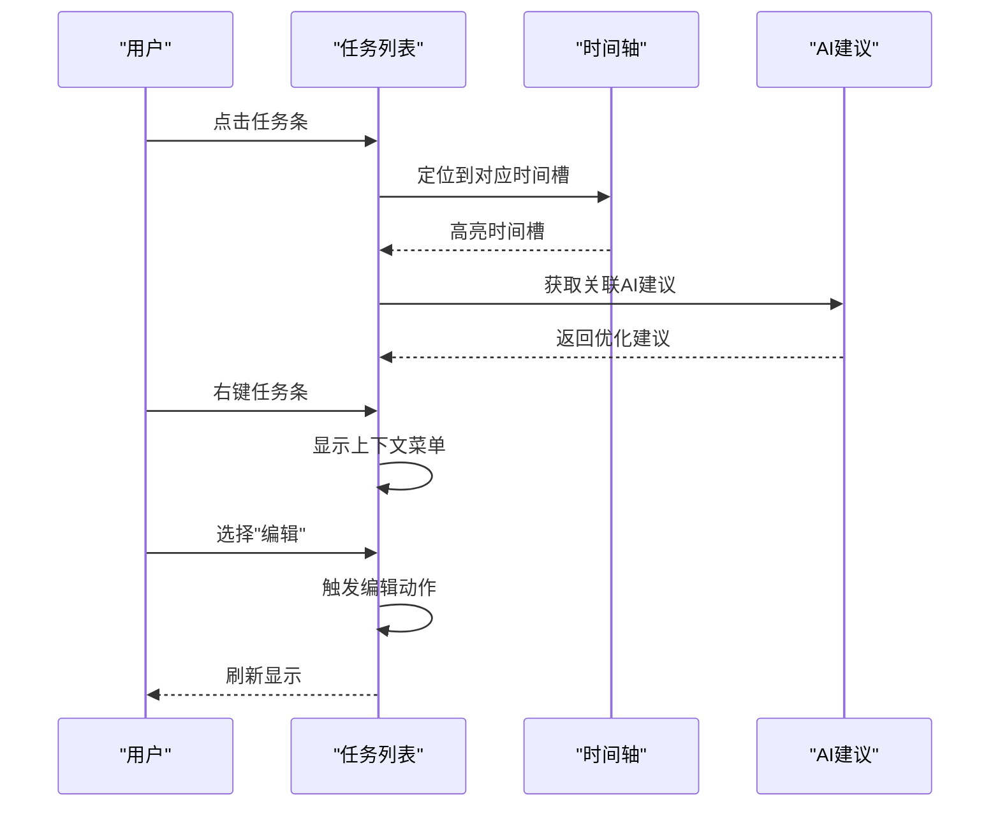
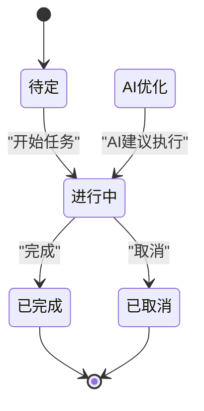
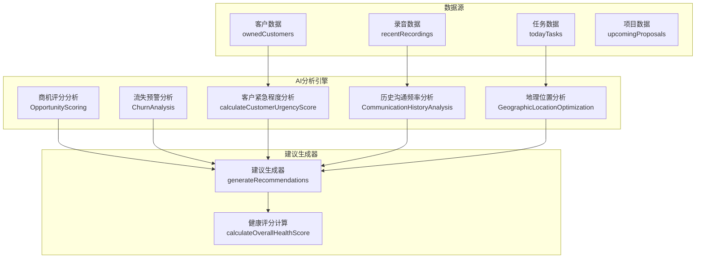
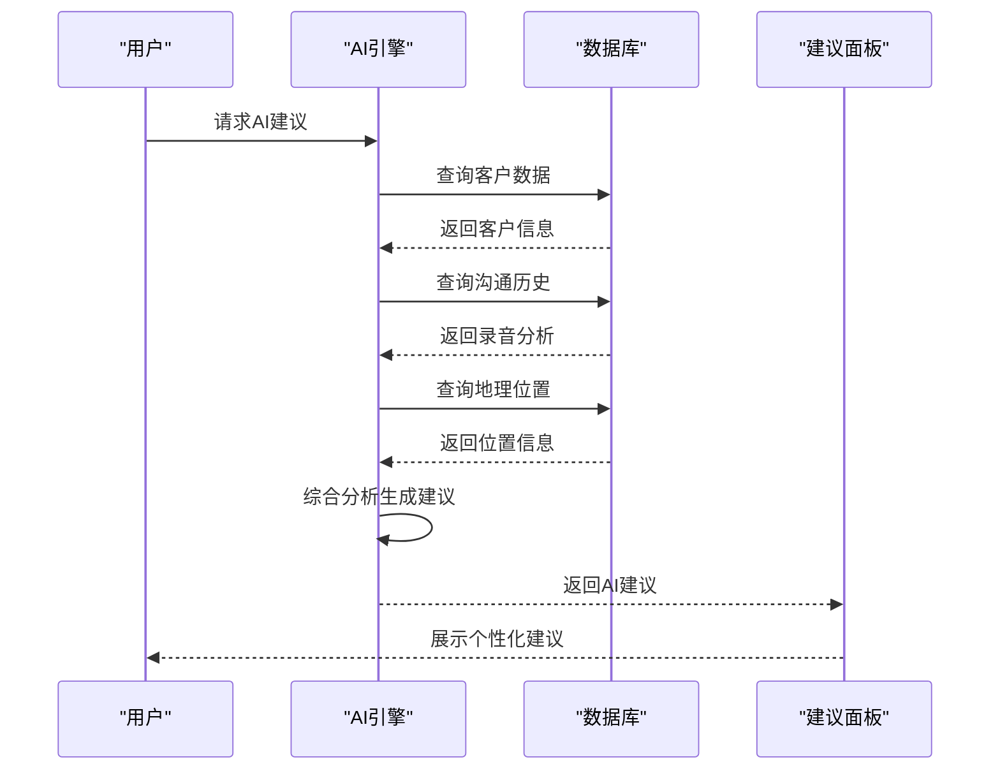
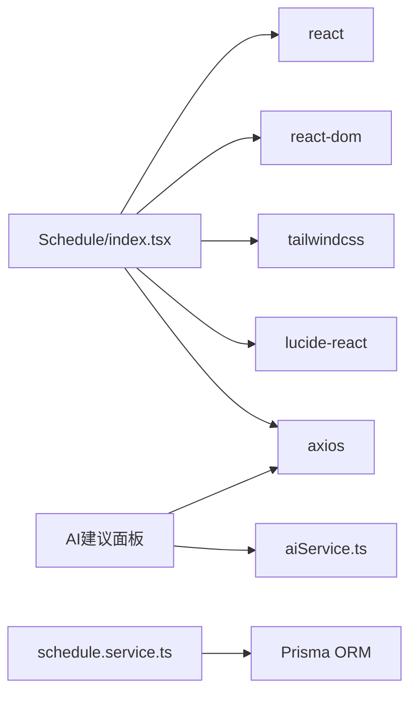

# 日程管理组件（DailySchedule）

<cite>
**本文档引用的文件**
- [index.tsx](file://crm-frontend/src/pages/Schedule/index.tsx)
- [schedule.service.ts](file://crm-backend/src/services/schedule.service.ts)
- [schedule.controller.ts](file://crm-backend/src/controllers/schedule.controller.ts)
- [aiService.ts](file://crm-frontend/src/services/aiService.ts)
- [CustomerInsightPanel.tsx](file://crm-frontend/src/components/AI/CustomerInsightPanel.tsx)
- [index.ts](file://crm-frontend/src/types/index.ts)
- [ai.service.ts](file://crm-backend/src/services/ai.service.ts)
- [followUpAnalysis.ts](file://crm-backend/src/services/ai/followUpAnalysis.ts)
- [opportunityScoring.ts](file://crm-backend/src/services/ai/opportunityScoring.ts)
- [churnAnalysis.ts](file://crm-backend/src/services/ai/churnAnalysis.ts)
</cite>

## 更新摘要
**变更内容**
- 新增AI智能调度助手功能，从基础日程管理扩展为AI驱动的日程优化
- 集成AI建议引擎，提供客户紧急程度分析、历史沟通频率评估、地理位置优化等多维度建议
- 添加智能建议界面，展示个性化日程优化建议和健康评分
- 扩展日程任务类型，支持AI优化标记和建议集成
- 增强客户洞察功能，提供深度客户画像分析

## 目录
1. [简介](#简介)
2. [项目结构](#项目结构)
3. [核心组件](#核心组件)
4. [架构总览](#架构总览)
5. [详细组件分析](#详细组件分析)
6. [AI智能调度功能](#ai智能调度功能)
7. [依赖关系分析](#依赖关系分析)
8. [性能考虑](#性能考虑)
9. [故障排除指南](#故障排除指南)
10. [结论](#结论)
11. [附录](#附录)

## 简介
本文件为销售AI CRM系统的"日程管理组件（DailySchedule）"提供完整技术文档。该组件负责展示和管理销售团队的日程安排，现已升级为AI智能调度助手，不仅支持传统日程时间轴的滚动与缩放、任务列表的渲染与交互，还集成了强大的AI分析引擎，提供客户紧急程度分析、历史沟通频率评估、地理位置优化等多维度智能建议，帮助销售团队实现更高效的日程管理和客户关系维护。

## 项目结构
前端采用 React + TypeScript + TailwindCSS 构建，组件位于 src/pages/Schedule 下，AI功能位于 src/components/AI 和 src/services 下，入口在 src/main.tsx 中挂载 App 组件。DailySchedule 作为智能日程管理模块，可被业务页面按需引入。



**图表来源**
- [index.tsx](file://crm-frontend/src/pages/Schedule/index.tsx)
- [aiService.ts](file://crm-frontend/src/services/aiService.ts)
- [schedule.service.ts](file://crm-backend/src/services/schedule.service.ts)

**章节来源**
- [index.tsx](file://crm-frontend/src/pages/Schedule/index.tsx)
- [aiService.ts](file://crm-frontend/src/services/aiService.ts)
- [schedule.service.ts](file://crm-backend/src/services/schedule.service.ts)

## 核心组件
- **DailySchedule（智能日程管理）**：日程管理的核心组件，负责时间轴渲染、任务列表展示、交互操作（新增/编辑/删除）、状态管理与滚动缩放控制，现已集成AI智能建议功能。
- **AI建议面板**：提供AI生成的个性化日程建议，包括客户紧急程度分析、优化建议和健康评分。
- **客户洞察面板**：深度分析客户画像，提供需求、预算、决策人、痛点等洞察信息。
- **Sidebar**：提供导航与上下文切换，便于在 CRM 功能间跳转。
- **App**：应用根组件，承载页面布局与基础内容。

**章节来源**
- [index.tsx](file://crm-frontend/src/pages/Schedule/index.tsx)
- [CustomerInsightPanel.tsx](file://crm-frontend/src/components/AI/CustomerInsightPanel.tsx)

## 架构总览
组件采用函数式 React 设计，通过 props 传递数据与回调，内部使用状态管理任务集合与视图参数。AI智能调度功能通过独立的服务层提供，与日程管理组件解耦。时间轴以网格形式呈现，任务以条形元素叠加显示，支持拖拽与点击交互，AI建议通过专门的面板展示。

```mermaid
graph TB
subgraph "界面层"
DS["Schedule/index.tsx<br/>智能日程管理"]
AI["AI建议面板<br/>智能调度助手"]
CI["客户洞察面板<br/>深度分析"]
SB["Sidebar.tsx<br/>导航"]
end
subgraph "AI智能分析层"
FUA["跟进时机分析<br/>FollowUpAnalysis"]
OS["商机评分<br/>OpportunityScoring"]
CA["流失预警<br/>ChurnAnalysis"]
AIS["AI服务<br/>ai.service"]
end
subgraph "数据与逻辑层"
State["任务状态管理<br/>新增/编辑/删除/状态切换"]
Timeline["时间轴渲染<br/>滚动/缩放"]
List["任务列表渲染<br/>行/列布局"]
Suggest["AI建议生成<br/>多维度分析"]
end
subgraph "外部依赖"
React["React"]
Tailwind["TailwindCSS"]
Icons["Lucide React 图标库"]
Axios["Axios HTTP客户端"]
```

**图表来源**
- [index.tsx](file://crm-frontend/src/pages/Schedule/index.tsx)
- [followUpAnalysis.ts](file://crm-backend/src/services/ai/followUpAnalysis.ts)
- [opportunityScoring.ts](file://crm-backend/src/services/ai/opportunityScoring.ts)
- [churnAnalysis.ts](file://crm-backend/src/services/ai/churnAnalysis.ts)
- [ai.service.ts](file://crm-backend/src/services/ai.service.ts)

## 详细组件分析

### 时间轴实现原理
- 时间轴以小时为粒度划分，支持横向滚动浏览全天时段；通过缩放参数控制每格代表的时间长度（例如 30 分钟/格），实现更精细的时间定位。
- 滚动行为通过容器滚动事件监听实现，同时保持表头与内容对齐；缩放通过动态计算单元宽度与刻度间隔完成。
- 时间刻度与网格线用于辅助定位，确保任务条与时间点精确对齐。
- **新增**：支持AI优化标记，显示任务是否经过AI智能优化。



**图表来源**
- [index.tsx](file://crm-frontend/src/pages/Schedule/index.tsx)

**章节来源**
- [index.tsx](file://crm-frontend/src/pages/Schedule/index.tsx)

### 任务列表渲染机制与交互
- 列表以"人员 + 多列时间槽"的网格布局展示，每列对应一个时间槽，任务以条形元素叠加显示。
- 支持点击打开任务详情弹窗，拖拽调整任务起止时间，右键触发上下文菜单（编辑/删除/复制等）。
- **新增**：支持AI建议集成，任务可关联AI生成的优化建议。
- 行高自适应内容，超出部分以省略号显示；支持多任务重叠时的层级与遮挡处理。



**图表来源**
- [index.tsx](file://crm-frontend/src/pages/Schedule/index.tsx)

**章节来源**
- [index.tsx](file://crm-frontend/src/pages/Schedule/index.tsx)

### 任务生命周期与状态管理
- 新增：通过顶部工具栏或空白区域右键菜单触发，弹出新建表单，填写后加入任务队列并刷新时间轴。
- 编辑：双击任务条或右键选择"编辑"，弹出编辑面板，修改完成后回写状态。
- 删除：右键选择"删除"，二次确认后移除任务。
- 状态切换：支持"待定/进行中/已完成/已取消"，状态变更即时反映在列表与时间轴上。
- **新增**：AI优化状态，标记经过AI智能分析优化的任务。



**图表来源**
- [index.tsx](file://crm-frontend/src/pages/Schedule/index.tsx)

**章节来源**
- [index.tsx](file://crm-frontend/src/pages/Schedule/index.tsx)

### API 接口与事件处理
- 外部接口（props）
  - tasks: 任务数组（包含 id、标题、开始/结束时间、负责人、状态、AI建议等字段）
  - onAdd: 新增任务回调
  - onEdit: 编辑任务回调
  - onDelete: 删除任务回调
  - onStatusChange: 状态变更回调
  - onDragMove: 拖拽移动回调
  - onZoomChange: 缩放级别变更回调
  - onTimelineScroll: 时间轴滚动回调
- **新增**：AI建议相关接口
  - onAIRecommendationClick: AI建议点击回调
  - onAIOptimization: AI优化任务回调
- 内部事件
  - 点击/双击/右键：触发交互与上下文菜单
  - 滚轮/触摸：控制缩放与滚动
  - 键盘快捷键：快速新增/删除/切换状态

**章节来源**
- [index.tsx](file://crm-frontend/src/pages/Schedule/index.tsx)

### 数据绑定与配置选项
- 数据绑定
  - 使用受控组件模式，所有输入均通过 props 与回调进行双向绑定。
  - 任务对象结构包含：id、title、startTime、endTime、assignee、status、color、aiSuggestion、isAIOptimized 等。
- **新增**：AI建议数据结构
  - AISuggestion：包含类型、优先级、标题、描述、建议动作等字段
  - AISuggestionsResponse：AI建议集合及汇总信息
- 配置选项
  - 默认缩放：每格代表分钟数（如 30 分钟/格）
  - 时间范围：默认 00:00–24:00，可配置起始与结束时间
  - AI建议刷新：支持定时刷新机制，提供最新的智能建议
  - 主题：浅色/深色模式自动适配
  - 语言：国际化支持（通过外部 i18n 库注入）

**章节来源**
- [index.tsx](file://crm-frontend/src/pages/Schedule/index.tsx)
- [index.ts](file://crm-frontend/src/types/index.ts)

### 使用示例
- 基础用法
  - 在页面中引入 DailySchedule，传入任务数组与回调函数，即可渲染完整日程视图。
- **新增**：AI智能调度用法
  - 集成AI建议面板，自动获取个性化日程优化建议
  - 配置AI优化任务，实现智能日程安排
  - 使用客户洞察功能，深度分析客户画像
- 扩展用法
  - 自定义任务颜色与状态映射
  - 集成后端 API 实现 CRUD 与实时同步
  - 添加快捷键与批量操作（多选/批量编辑）

**章节来源**
- [index.tsx](file://crm-frontend/src/pages/Schedule/index.tsx)

## AI智能调度功能

### AI建议引擎架构
AI智能调度功能通过多维度分析引擎提供智能化的日程管理建议，包括客户紧急程度分析、历史沟通频率评估、地理位置优化等核心功能。



**图表来源**
- [schedule.service.ts](file://crm-backend/src/services/schedule.service.ts)

### 智能建议生成流程
AI建议引擎通过综合分析客户数据、沟通历史、地理位置等因素，为销售团队提供个性化的日程优化建议。



**图表来源**
- [schedule.service.ts](file://crm-backend/src/services/schedule.service.ts)

### 客户紧急程度分析
AI引擎通过分析客户优先级、项目阶段、合同状态、历史沟通频率、地理位置等多个维度，计算客户的紧急程度评分，为日程安排提供决策依据。

**章节来源**
- [schedule.service.ts](file://crm-backend/src/services/schedule.service.ts)

### 建议健康评分系统
AI引擎为每个工作日生成健康评分，综合考虑任务完成情况、客户互动质量、商机推进状态等因素，帮助销售团队监控日程管理效果。

**章节来源**
- [schedule.service.ts](file://crm-backend/src/services/schedule.service.ts)

## 依赖关系分析
- React 与 React DOM：组件运行时基础
- TailwindCSS：样式体系，提供响应式布局与主题变量
- Lucide React：图标库，用于工具栏与状态指示
- Axios：HTTP客户端，用于AI功能API调用
- TypeScript：类型安全与开发体验保障



**图表来源**
- [index.tsx](file://crm-frontend/src/pages/Schedule/index.tsx)
- [aiService.ts](file://crm-frontend/src/services/aiService.ts)
- [schedule.service.ts](file://crm-backend/src/services/schedule.service.ts)

**章节来源**
- [index.tsx](file://crm-frontend/src/pages/Schedule/index.tsx)
- [aiService.ts](file://crm-frontend/src/services/aiService.ts)
- [schedule.service.ts](file://crm-backend/src/services/schedule.service.ts)

## 性能考虑
- 虚拟化渲染：当任务数量较多时，建议对时间轴与列表进行虚拟化，仅渲染可视区域内的元素。
- 事件节流：滚动与缩放事件应使用节流/防抖，避免频繁重绘。
- 状态最小化：将任务状态拆分为多个细粒度状态，减少不必要的重渲染。
- 图标与资源：使用 SVG 图标与懒加载策略，降低首屏体积。
- **新增**：AI建议缓存机制，避免重复请求相同的AI分析结果。
- **新增**：智能建议刷新策略，平衡实时性和性能消耗。

## 故障排除指南
- 任务无法拖拽
  - 检查是否正确绑定 onDragMove 回调
  - 确认容器具备滚动与事件监听权限
- 时间轴不随滚动同步
  - 校验表头与内容容器的滚动事件绑定
  - 确保缩放参数变化后重新计算网格位置
- 状态更新后视图未刷新
  - 确认 onStatusChange 回调已返回最新状态
  - 检查任务对象的不可变性与引用更新
- **新增**：AI建议加载失败
  - 检查网络连接和API端点配置
  - 确认AI服务密钥配置正确
  - 验证用户认证状态
- **新增**：客户洞察数据缺失
  - 检查客户数据完整性
  - 确认AI分析服务正常运行
  - 验证数据权限和访问控制

**章节来源**
- [index.tsx](file://crm-frontend/src/pages/Schedule/index.tsx)
- [aiService.ts](file://crm-frontend/src/services/aiService.ts)

## 结论
DailySchedule 组件通过清晰的职责分离与可配置的交互模型，实现了销售团队高效的时间管理与协作。其时间轴与任务列表的协同设计，配合完善的 CRUD 与状态管理，能够满足复杂业务场景下的日程编排需求。**重大升级后**，通过集成AI智能调度助手，系统不仅提供了基础的日程管理功能，更重要的是通过多维度的AI分析，为销售团队提供了智能化的日程优化建议，显著提升了日程安排的科学性和有效性。建议在生产环境中结合虚拟化与性能优化策略，进一步提升大体量数据下的用户体验。

## 附录
- 快速集成步骤
  - 安装依赖：npm install lucide-react react react-dom tailwindcss axios
  - 引入组件：import DailySchedule from '@/pages/Schedule'
  - 准备数据：构造任务数组并传入 props
  - 绑定回调：onAdd/onEdit/onDelete/onStatusChange/onDragMove/onZoomChange/onTimelineScroll
  - **新增**：配置AI服务，设置API密钥和端点
- **新增**：AI功能扩展建议
  - 将任务对象抽象为接口，便于后续扩展字段
  - 抽离AI分析逻辑，形成可复用的Hook
  - 增加AI建议缓存和本地存储策略
  - 实现AI建议的个性化配置和偏好设置
  - 增加AI分析结果的可视化展示和报告生成功能