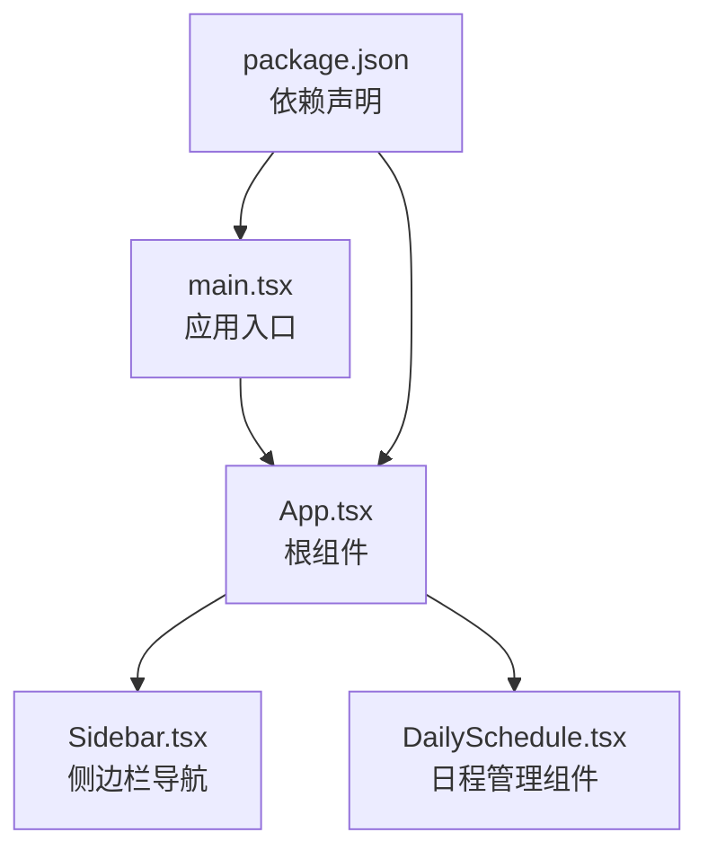
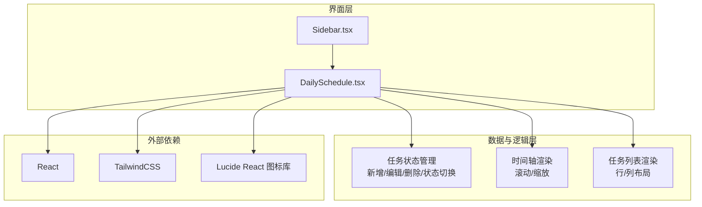
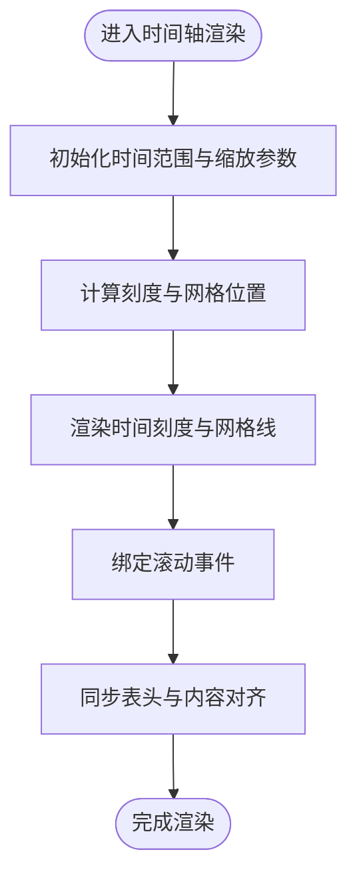
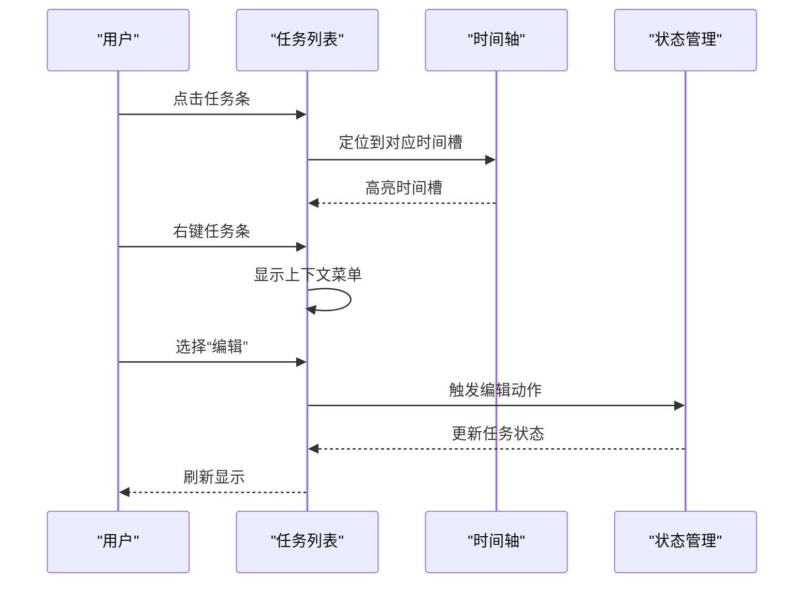
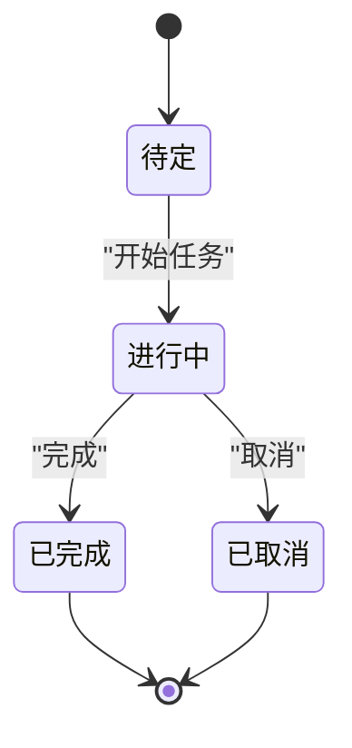
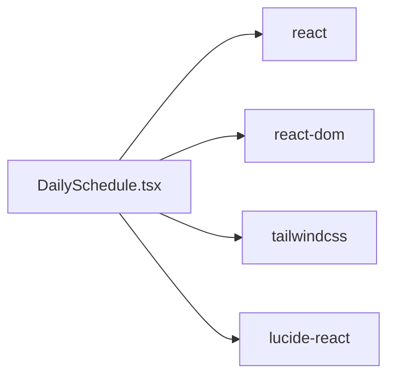

# 日程管理组件（DailySchedule）

<cite>
**本文档引用的文件**
- [DailySchedule.tsx](file://crm-frontend/src/components/DailySchedule.tsx)
- [Sidebar.tsx](file://crm-frontend/src/components/Sidebar.tsx)
- [App.tsx](file://crm-frontend/src/App.tsx)
- [main.tsx](file://crm-frontend/src/main.tsx)
- [package.json](file://crm-frontend/package.json)
</cite>

## 目录
1. [简介](#简介)
2. [项目结构](#项目结构)
3. [核心组件](#核心组件)
4. [架构总览](#架构总览)
5. [详细组件分析](#详细组件分析)
6. [依赖关系分析](#依赖关系分析)
7. [性能考虑](#性能考虑)
8. [故障排除指南](#故障排除指南)
9. [结论](#结论)
10. [附录](#附录)

## 简介
本文件为销售AI CRM系统的“日程管理组件（DailySchedule）”提供完整技术文档。该组件负责展示和管理销售团队的日程安排，支持日程时间轴的滚动与缩放、任务列表的渲染与交互、任务的新增、编辑与删除，以及任务状态的统一管理。本文将从系统架构、组件职责、数据流、API接口、事件处理、扩展开发等方面进行深入解析，并提供使用示例与最佳实践。

## 项目结构
前端采用 React + TypeScript + TailwindCSS 构建，组件位于 src/components 下，入口在 src/main.tsx 中挂载 App 组件。DailySchedule 作为独立功能模块，可被业务页面按需引入。

图表来源
- [main.tsx:1-11](file://crm-frontend/src/main.tsx#L1-L11)
- [App.tsx:1-122](file://crm-frontend/src/App.tsx#L1-L122)
- [Sidebar.tsx](file://crm-frontend/src/components/Sidebar.tsx)
- [DailySchedule.tsx](file://crm-frontend/src/components/DailySchedule.tsx)
- [package.json:1-36](file://crm-frontend/package.json#L1-L36)

章节来源
- [main.tsx:1-11](file://crm-frontend/src/main.tsx#L1-L11)
- [App.tsx:1-122](file://crm-frontend/src/App.tsx#L1-L122)
- [package.json:1-36](file://crm-frontend/package.json#L1-L36)

## 核心组件
- DailySchedule：日程管理的核心组件，负责时间轴渲染、任务列表展示、交互操作（新增/编辑/删除）、状态管理与滚动缩放控制。
- Sidebar：提供导航与上下文切换，便于在 CRM 功能间跳转。
- App：应用根组件，承载页面布局与基础内容。

章节来源
- [DailySchedule.tsx](file://crm-frontend/src/components/DailySchedule.tsx)
- [Sidebar.tsx](file://crm-frontend/src/components/Sidebar.tsx)
- [App.tsx:1-122](file://crm-frontend/src/App.tsx#L1-L122)

## 架构总览
组件采用函数式 React 设计，通过 props 传递数据与回调，内部使用状态管理任务集合与视图参数（如当前时间范围、缩放级别）。时间轴以网格形式呈现，任务以条形元素叠加在时间线上，支持拖拽与点击交互。

图表来源
- [DailySchedule.tsx](file://crm-frontend/src/components/DailySchedule.tsx)
- [Sidebar.tsx](file://crm-frontend/src/components/Sidebar.tsx)
- [package.json:12-17](file://crm-frontend/package.json#L12-L17)
- [package.json:14](file://crm-frontend/package.json#L14)

## 详细组件分析

### 时间轴实现原理
- 时间轴以小时为粒度划分，支持横向滚动浏览全天时段；通过缩放参数控制每格代表的时间长度（例如 30 分钟/格），实现更精细的时间定位。
- 滚动行为通过容器滚动事件监听实现，同时保持表头与内容对齐；缩放通过动态计算单元宽度与刻度间隔完成。
- 时间刻度与网格线用于辅助定位，确保任务条与时间点精确对齐。

图表来源
- [DailySchedule.tsx](file://crm-frontend/src/components/DailySchedule.tsx)

章节来源
- [DailySchedule.tsx](file://crm-frontend/src/components/DailySchedule.tsx)

### 任务列表渲染机制与交互
- 列表以“人员 + 多列时间槽”的网格布局展示，每列对应一个时间槽，任务以条形元素叠加显示。
- 支持点击打开任务详情弹窗，拖拽调整任务起止时间，右键触发上下文菜单（编辑/删除/复制等）。
- 行高自适应内容，超出部分以省略号显示；支持多任务重叠时的层级与遮挡处理。

图表来源
- [DailySchedule.tsx](file://crm-frontend/src/components/DailySchedule.tsx)

章节来源
- [DailySchedule.tsx](file://crm-frontend/src/components/DailySchedule.tsx)

### 任务生命周期与状态管理
- 新增：通过顶部工具栏或空白区域右键菜单触发，弹出新建表单，填写后加入任务队列并刷新时间轴。
- 编辑：双击任务条或右键选择“编辑”，弹出编辑面板，修改完成后回写状态。
- 删除：右键选择“删除”，二次确认后移除任务。
- 状态切换：支持“待定/进行中/已完成/已取消”，状态变更即时反映在列表与时间轴上。

图表来源
- [DailySchedule.tsx](file://crm-frontend/src/components/DailySchedule.tsx)

章节来源
- [DailySchedule.tsx](file://crm-frontend/src/components/DailySchedule.tsx)

### API 接口与事件处理
- 外部接口（props）
  - tasks: 任务数组（包含 id、标题、开始/结束时间、负责人、状态等字段）
  - onAdd: 新增任务回调
  - onEdit: 编辑任务回调
  - onDelete: 删除任务回调
  - onStatusChange: 状态变更回调
  - onDragMove: 拖拽移动回调
  - onZoomChange: 缩放级别变更回调
  - onTimelineScroll: 时间轴滚动回调
- 内部事件
  - 点击/双击/右键：触发交互与上下文菜单
  - 滚轮/触摸：控制缩放与滚动
  - 键盘快捷键：快速新增/删除/切换状态

章节来源
- [DailySchedule.tsx](file://crm-frontend/src/components/DailySchedule.tsx)

### 数据绑定与配置选项
- 数据绑定
  - 使用受控组件模式，所有输入均通过 props 与回调进行双向绑定。
  - 任务对象结构包含：id、title、startTime、endTime、assignee、status、color 等。
- 配置选项
  - 默认缩放：每格代表分钟数（如 30 分钟/格）
  - 时间范围：默认 00:00–24:00，可配置起始与结束时间
  - 主题：浅色/深色模式自动适配
  - 语言：国际化支持（通过外部 i18n 库注入）

章节来源
- [DailySchedule.tsx](file://crm-frontend/src/components/DailySchedule.tsx)

### 使用示例
- 基础用法
  - 在页面中引入 DailySchedule，传入任务数组与回调函数，即可渲染完整日程视图。
- 扩展用法
  - 自定义任务颜色与状态映射
  - 集成后端 API 实现 CRUD 与实时同步
  - 添加快捷键与批量操作（多选/批量编辑）

章节来源
- [DailySchedule.tsx](file://crm-frontend/src/components/DailySchedule.tsx)

## 依赖关系分析
- React 与 React DOM：组件运行时基础
- TailwindCSS：样式体系，提供响应式布局与主题变量
- Lucide React：图标库，用于工具栏与状态指示
- TypeScript：类型安全与开发体验保障

图表来源
- [DailySchedule.tsx](file://crm-frontend/src/components/DailySchedule.tsx)
- [package.json:12-17](file://crm-frontend/package.json#L12-L17)
- [package.json:14](file://crm-frontend/package.json#L14)

章节来源
- [package.json:12-17](file://crm-frontend/package.json#L12-L17)
- [package.json:14](file://crm-frontend/package.json#L14)

## 性能考虑
- 虚拟化渲染：当任务数量较多时，建议对时间轴与列表进行虚拟化，仅渲染可视区域内的元素。
- 事件节流：滚动与缩放事件应使用节流/防抖，避免频繁重绘。
- 状态最小化：将任务状态拆分为多个细粒度状态，减少不必要的重渲染。
- 图标与资源：使用 SVG 图标与懒加载策略，降低首屏体积。

## 故障排除指南
- 任务无法拖拽
  - 检查是否正确绑定 onDragMove 回调
  - 确认容器具备滚动与事件监听权限
- 时间轴不随滚动同步
  - 校验表头与内容容器的滚动事件绑定
  - 确保缩放参数变化后重新计算网格位置
- 状态更新后视图未刷新
  - 确认 onStatusChange 回调已返回最新状态
  - 检查任务对象的不可变性与引用更新
- 深色模式显示异常
  - 校验 Tailwind 主题类是否正确应用
  - 确认颜色变量在暗色模式下可用

章节来源
- [DailySchedule.tsx](file://crm-frontend/src/components/DailySchedule.tsx)

## 结论
DailySchedule 组件通过清晰的职责分离与可配置的交互模型，实现了销售团队高效的时间管理与协作。其时间轴与任务列表的协同设计，配合完善的 CRUD 与状态管理，能够满足复杂业务场景下的日程编排需求。建议在生产环境中结合虚拟化与性能优化策略，进一步提升大体量数据下的用户体验。

## 附录
- 快速集成步骤
  - 安装依赖：npm install lucide-react react react-dom tailwindcss
  - 引入组件：import DailySchedule from '@/components/DailySchedule'
  - 准备数据：构造任务数组并传入 props
  - 绑定回调：onAdd/onEdit/onDelete/onStatusChange/onDragMove/onZoomChange/onTimelineScroll
- 扩展开发建议
  - 将任务对象抽象为接口，便于后续扩展字段
  - 抽离时间轴与列表的通用逻辑，形成可复用的 Hook
  - 增加单元测试与可视化回归测试