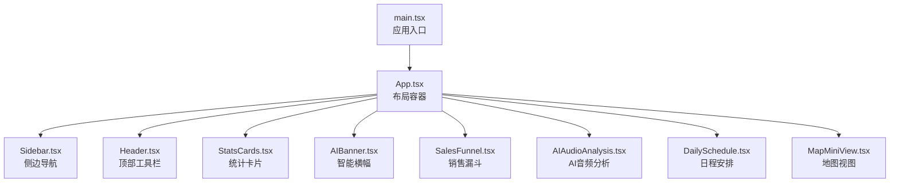
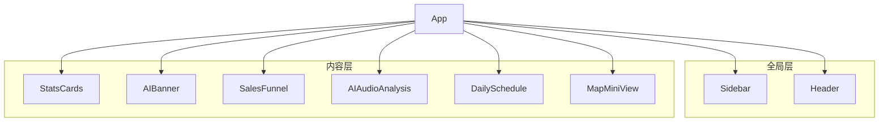
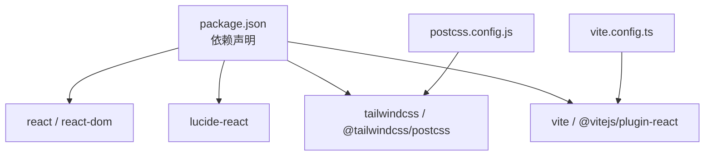

# 核心组件

<cite>
**本文引用的文件**
- [Sidebar.tsx](file://crm-frontend/src/components/Sidebar.tsx)
- [Header.tsx](file://crm-frontend/src/components/Header.tsx)
- [StatsCards.tsx](file://crm-frontend/src/components/StatsCards.tsx)
- [SalesFunnel.tsx](file://crm-frontend/src/components/SalesFunnel.tsx)
- [AIAudioAnalysis.tsx](file://crm-frontend/src/components/AIAudioAnalysis.tsx)
- [DailySchedule.tsx](file://crm-frontend/src/components/DailySchedule.tsx)
- [MapMiniView.tsx](file://crm-frontend/src/components/MapMiniView.tsx)
- [AIBanner.tsx](file://crm-frontend/src/components/AIBanner.tsx)
- [App.tsx](file://crm-frontend/src/App.tsx)
- [main.tsx](file://crm-frontend/src/main.tsx)
- [package.json](file://crm-frontend/package.json)
- [postcss.config.js](file://crm-frontend/postcss.config.js)
- [vite.config.ts](file://crm-frontend/vite.config.ts)
</cite>

## 目录
1. [简介](#简介)
2. [项目结构](#项目结构)
3. [核心组件](#核心组件)
4. [架构总览](#架构总览)
5. [详细组件分析](#详细组件分析)
6. [依赖分析](#依赖分析)
7. [性能考虑](#性能考虑)
8. [故障排除指南](#故障排除指南)
9. [结论](#结论)
10. [附录](#附录)

## 简介
本文件面向销售AI CRM系统的前端核心组件，围绕Sidebar导航、Header头部、StatsCards统计面板、SalesFunnel销售漏斗、AIAudioAnalysis音频分析、DailySchedule日程管理、MapMiniView地图视图与AIBanner智能横幅等组件进行系统化说明。内容涵盖组件职责、实现原理、数据流与交互设计，并提供使用示例与配置建议，帮助开发者快速理解与扩展系统。

## 项目结构
该前端采用React + Vite + TailwindCSS构建，组件位于src/components目录下，入口在src/main.tsx中挂载App根组件。整体布局由App.tsx组织，左侧为Sidebar，右侧为主内容区，包含Header、统计卡片、AI横幅、两列布局（左侧为漏斗与音频分析，右侧为日程与地图）。

图表来源
- [main.tsx:1-11](file://crm-frontend/src/main.tsx#L1-L11)
- [App.tsx:10-55](file://crm-frontend/src/App.tsx#L10-L55)
- [Sidebar.tsx:37-83](file://crm-frontend/src/components/Sidebar.tsx#L37-L83)
- [Header.tsx:3-50](file://crm-frontend/src/components/Header.tsx#L3-L50)
- [StatsCards.tsx:35-78](file://crm-frontend/src/components/StatsCards.tsx#L35-L78)
- [AIBanner.tsx:3-43](file://crm-frontend/src/components/AIBanner.tsx#L3-L43)
- [SalesFunnel.tsx:29-62](file://crm-frontend/src/components/SalesFunnel.tsx#L29-L62)
- [AIAudioAnalysis.tsx:38-78](file://crm-frontend/src/components/AIAudioAnalysis.tsx#L38-L78)
- [DailySchedule.tsx:26-66](file://crm-frontend/src/components/DailySchedule.tsx#L26-L66)
- [MapMiniView.tsx:3-54](file://crm-frontend/src/components/MapMiniView.tsx#L3-L54)

章节来源
- [main.tsx:1-11](file://crm-frontend/src/main.tsx#L1-L11)
- [App.tsx:10-55](file://crm-frontend/src/App.tsx#L10-L55)

## 核心组件
- Sidebar：提供导航菜单与快捷入口，支持图标与文案配置，当前工作台项默认激活。
- Header：包含搜索框、升级按钮、通知铃铛与用户信息区域，提供统一的顶部交互。
- StatsCards：展示关键指标卡片，支持趋势徽章与图标背景色配置。
- SalesFunnel：以进度条形式展示销售漏斗各阶段转化率与总量。
- AIAudioAnalysis：展示AI对通话录音的分析摘要与情感倾向。
- DailySchedule：按时间轴展示当日任务与会议。
- MapMiniView：展示客户分布的简易地图占位与“全量地图”跳转。
- AIBanner：智能建议横幅，提供行动按钮与关闭控制。

章节来源
- [Sidebar.tsx:37-83](file://crm-frontend/src/components/Sidebar.tsx#L37-L83)
- [Header.tsx:3-50](file://crm-frontend/src/components/Header.tsx#L3-L50)
- [StatsCards.tsx:35-78](file://crm-frontend/src/components/StatsCards.tsx#L35-L78)
- [SalesFunnel.tsx:29-62](file://crm-frontend/src/components/SalesFunnel.tsx#L29-L62)
- [AIAudioAnalysis.tsx:38-78](file://crm-frontend/src/components/AIAudioAnalysis.tsx#L38-L78)
- [DailySchedule.tsx:26-66](file://crm-frontend/src/components/DailySchedule.tsx#L26-L66)
- [MapMiniView.tsx:3-54](file://crm-frontend/src/components/MapMiniView.tsx#L3-L54)
- [AIBanner.tsx:3-43](file://crm-frontend/src/components/AIBanner.tsx#L3-L43)

## 架构总览
组件间通过App.tsx进行编排，形成“侧边导航 + 头部工具 + 主体内容”的经典布局。Sidebar与Header作为全局级组件，其余卡片组件按业务模块划分，形成清晰的职责边界。

图表来源
- [App.tsx:10-55](file://crm-frontend/src/App.tsx#L10-L55)
- [Sidebar.tsx:37-83](file://crm-frontend/src/components/Sidebar.tsx#L37-L83)
- [Header.tsx:3-50](file://crm-frontend/src/components/Header.tsx#L3-L50)
- [StatsCards.tsx:35-78](file://crm-frontend/src/components/StatsCards.tsx#L35-L78)
- [AIBanner.tsx:3-43](file://crm-frontend/src/components/AIBanner.tsx#L3-L43)
- [SalesFunnel.tsx:29-62](file://crm-frontend/src/components/SalesFunnel.tsx#L29-L62)
- [AIAudioAnalysis.tsx:38-78](file://crm-frontend/src/components/AIAudioAnalysis.tsx#L38-L78)
- [DailySchedule.tsx:26-66](file://crm-frontend/src/components/DailySchedule.tsx#L26-L66)
- [MapMiniView.tsx:3-54](file://crm-frontend/src/components/MapMiniView.tsx#L3-L54)

## 详细组件分析

### Sidebar 导航组件
- 职责：提供全局导航菜单与“新建线索”入口；当前工作台项默认高亮。
- 实现要点：
  - 使用图标库提供菜单图标与文案。
  - NavItem子组件根据active状态切换样式。
  - 通过数组配置navItems，便于集中维护与扩展。
- 交互设计：按钮具备悬停与选中态过渡动画，视觉反馈明确。
- 配置选项：
  - 可在navItems中新增或调整菜单项（图标、标签、是否默认激活）。
  - 新建线索按钮可绑定点击事件以打开新建流程。
- 使用示例路径：
  - [菜单项配置与渲染:37-72](file://crm-frontend/src/components/Sidebar.tsx#L37-L72)
  - [Logo与按钮区域:52-81](file://crm-frontend/src/components/Sidebar.tsx#L52-L81)

章节来源
- [Sidebar.tsx:16-35](file://crm-frontend/src/components/Sidebar.tsx#L16-L35)
- [Sidebar.tsx:37-83](file://crm-frontend/src/components/Sidebar.tsx#L37-L83)

### Header 头部组件
- 职责：提供搜索、通知、升级入口与用户信息区域。
- 实现要点：
  - 搜索框支持焦点态样式与占位提示。
  - 通知按钮带角标提醒。
  - 用户头像区域含下拉指示器，便于扩展下拉菜单。
- 交互设计：各区域悬停高亮，过渡自然。
- 配置选项：
  - 升级按钮与通知按钮可绑定事件处理。
  - 用户信息可注入动态数据（姓名、角色、头像）。
- 使用示例路径：
  - [搜索与通知区域:7-29](file://crm-frontend/src/components/Header.tsx#L7-L29)
  - [用户信息与下拉指示器:34-46](file://crm-frontend/src/components/Header.tsx#L34-L46)

章节来源
- [Header.tsx:3-50](file://crm-frontend/src/components/Header.tsx#L3-L50)

### StatsCards 统计面板
- 职责：展示关键指标卡片，包含图标、数值、标签与趋势徽章。
- 实现要点：
  - StatCard子组件支持三种徽章类型（成功/警告/危险）与图标背景色。
  - 通过数组配置多张卡片，统一网格布局。
- 数据流：卡片数据在组件内静态定义，便于快速替换为外部数据源。
- 使用示例路径：
  - [卡片数据与渲染:35-78](file://crm-frontend/src/components/StatsCards.tsx#L35-L78)

章节来源
- [StatsCards.tsx:3-33](file://crm-frontend/src/components/StatsCards.tsx#L3-L33)
- [StatsCards.tsx:35-78](file://crm-frontend/src/components/StatsCards.tsx#L35-L78)

### SalesFunnel 销售漏斗
- 职责：可视化展示销售漏斗各阶段的转化百分比与总体价值。
- 实现要点：
  - FunnelStage子组件绘制阶段名称、百分比与进度条。
  - 进度条宽度通过内联样式动态设置，具备过渡动画。
- 数据流：阶段数据在组件内静态定义，便于接入真实API。
- 使用示例路径：
  - [阶段数据与进度条渲染:29-62](file://crm-frontend/src/components/SalesFunnel.tsx#L29-L62)

章节来源
- [SalesFunnel.tsx:3-27](file://crm-frontend/src/components/SalesFunnel.tsx#L3-L27)
- [SalesFunnel.tsx:29-62](file://crm-frontend/src/components/SalesFunnel.tsx#L29-L62)

### AIAudioAnalysis 音频分析
- 职责：展示AI对通话录音的分析摘要与情感倾向。
- 实现要点：
  - AnalysisItem子组件根据情感类型（正面/中性/负面）切换颜色与指示点。
  - 支持标题截断与摘要行数限制，提升可读性。
- 数据流：分析列表在组件内静态定义，便于替换为实时分析结果。
- 使用示例路径：
  - [分析项渲染与情感映射:38-78](file://crm-frontend/src/components/AIAudioAnalysis.tsx#L38-L78)

章节来源
- [AIAudioAnalysis.tsx:3-36](file://crm-frontend/src/components/AIAudioAnalysis.tsx#L3-L36)
- [AIAudioAnalysis.tsx:38-78](file://crm-frontend/src/components/AIAudioAnalysis.tsx#L38-L78)

### DailySchedule 日程管理
- 职责：以时间轴形式展示当日任务与会议，支持添加新任务。
- 实现要点：
  - ScheduleItem子组件绘制时间线、节点与内容。
  - 时间线通过伪元素与背景色实现，节点使用彩色圆点与描边。
- 数据流：日程数据在组件内静态定义，便于接入日历服务。
- 使用示例路径：
  - [日程项渲染与添加按钮:26-66](file://crm-frontend/src/components/DailySchedule.tsx#L26-L66)

章节来源
- [DailySchedule.tsx:3-24](file://crm-frontend/src/components/DailySchedule.tsx#L3-L24)
- [DailySchedule.tsx:26-66](file://crm-frontend/src/components/DailySchedule.tsx#L26-L66)

### MapMiniView 地图视图
- 职责：展示客户位置的简易地图占位与“全量地图”跳转。
- 实现要点：
  - 使用SVG网格作为地图背景，定位三个客户标记点。
  - 提供“附近客户数量”与“全量地图”按钮。
- 数据流：标记点坐标在组件内硬编码，便于替换为真实地理数据。
- 使用示例路径：
  - [地图占位与标记点:3-54](file://crm-frontend/src/components/MapMiniView.tsx#L3-L54)

章节来源
- [MapMiniView.tsx:3-54](file://crm-frontend/src/components/MapMiniView.tsx#L3-L54)

### AIBanner 智能横幅
- 职责：展示AI智能建议，提供操作按钮与关闭控制。
- 实现要点：
  - 渐变背景与装饰圆形增强视觉层次。
  - 包含标题、描述、两个操作按钮与关闭按钮。
- 交互设计：按钮悬停效果与阴影提升触达感。
- 使用示例路径：
  - [横幅内容与按钮:3-43](file://crm-frontend/src/components/AIBanner.tsx#L3-L43)

章节来源
- [AIBanner.tsx:3-43](file://crm-frontend/src/components/AIBanner.tsx#L3-L43)

## 依赖分析
- 技术栈：React 19、TailwindCSS 4、Lucide React 图标库、Vite 打包工具。
- 运行时依赖：react、react-dom、lucide-react。
- 开发依赖：@vitejs/plugin-react、tailwindcss、typescript、eslint等。
- PostCSS配置启用TailwindCSS插件，确保样式按需生成。

图表来源
- [package.json:12-34](file://crm-frontend/package.json#L12-L34)
- [postcss.config.js:1-6](file://crm-frontend/postcss.config.js#L1-L6)
- [vite.config.ts:1-8](file://crm-frontend/vite.config.ts#L1-L8)

章节来源
- [package.json:12-34](file://crm-frontend/package.json#L12-L34)
- [postcss.config.js:1-6](file://crm-frontend/postcss.config.js#L1-L6)
- [vite.config.ts:1-8](file://crm-frontend/vite.config.ts#L1-L8)

## 性能考虑
- 组件渲染：各卡片组件均为纯展示型，无复杂计算，渲染开销低。
- 动画与过渡：部分组件使用过渡类与内联样式动画，建议避免频繁重排，保持数据稳定更新。
- 图标与资源：Lucide React按需引入，减少打包体积；地图占位为SVG，加载轻量。
- 布局优化：使用TailwindCSS原子类，避免自定义样式导致的重复计算。

## 故障排除指南
- 图标不显示：确认lucide-react已安装且版本兼容。
- 样式未生效：检查TailwindCSS是否正确配置，PostCSS插件是否启用。
- 组件样式冲突：检查组件内样式类名与全局样式覆盖关系，必要时使用作用域或更具体的选择器。
- 交互无响应：检查按钮事件绑定与路由集成（如需要）。

## 结论
本CRM前端以清晰的组件化架构实现了销售场景的关键能力：导航与头部提供统一入口，统计面板与漏斗可视化关键指标，AI分析与横幅提供智能化洞察，日程与地图辅助日常执行。组件职责明确、耦合度低，便于扩展与维护。建议后续将静态数据替换为真实API，并完善事件与路由集成。

## 附录
- 快速启动：使用Vite开发服务器启动项目，自动热更新。
- 构建与预览：通过npm脚本进行构建与本地预览。
- 代码规范：遵循ESLint与TypeScript配置，保证代码质量。

章节来源
- [package.json:6-11](file://crm-frontend/package.json#L6-L11)
- [vite.config.ts:5-7](file://crm-frontend/vite.config.ts#L5-L7)