# 核心组件

<cite>
**本文档引用的文件**
- [CreateCustomerModal.tsx](file://crm-frontend/src/components/Customers/CreateCustomerModal.tsx)
- [CreateOpportunityModal.tsx](file://crm-frontend/src/components/Customers/CreateOpportunityModal.tsx)
- [index.tsx](file://crm-frontend/src/pages/Customers/index.tsx)
- [api.ts](file://crm-frontend/src/services/api.ts)
- [index.ts](file://crm-frontend/src/types/index.ts)
- [Sidebar.tsx](file://crm-frontend/src/components/layout/Sidebar.tsx)
- [Header.tsx](file://crm-frontend/src/components/layout/Header.tsx)
- [Layout.tsx](file://crm-frontend/src/components/layout/Layout.tsx)
- [Dashboard/index.tsx](file://crm-frontend/src/pages/Dashboard/index.tsx)
- [AIAudio/index.tsx](file://crm-frontend/src/pages/AIAudio/index.tsx)
- [AIAudio/Components/AIAnalysisPanel.tsx](file://crm-frontend/src/pages/AIAudio/components/AIAnalysisPanel.tsx)
- [AIAudio/Components/RecordingList.tsx](file://crm-frontend/src/pages/AIAudio/components/RecordingList.tsx)
- [AIAudio/Components/AudioPlayer.tsx](file://crm-frontend/src/pages/AIAudio/components/AudioPlayer.tsx)
- [AIAudio/Components/SuggestionList.tsx](file://crm-frontend/src/pages/AIAudio/components/SuggestionList.tsx)
- [AIAudio/Components/StatsOverview.tsx](file://crm-frontend/src/pages/AIAudio/components/StatsOverview.tsx)
- [ColdVisitAssistant.tsx](file://crm-frontend/src/components/ColdVisitAssistant.tsx)
- [Team/index.tsx](file://crm-frontend/src/pages/Team/index.tsx)
- [App.tsx](file://crm-frontend/src/App.tsx)
- [main.tsx](file://crm-frontend/src/main.tsx)
- [OpportunityScoreCard.tsx](file://crm-frontend/src/components/AI/OpportunityScoreCard.tsx)
- [ChurnAlertCard.tsx](file://crm-frontend/src/components/AI/ChurnAlertCard.tsx)
- [CustomerInsightPanel.tsx](file://crm-frontend/src/components/AI/CustomerInsightPanel.tsx)
- [FollowUpWidget.tsx](file://crm-frontend/src/components/AI/FollowUpWidget.tsx)
- [ScriptGenerator.tsx](file://crm-frontend/src/components/AI/ScriptGenerator.tsx)
- [aiService.ts](file://crm-frontend/src/services/aiService.ts)
- [package.json](file://crm-frontend/package.json)
- [postcss.config.js](file://crm-frontend/postcss.config.js)
- [vite.config.ts](file://crm-frontend/vite.config.ts)
</cite>

## 更新摘要
**所做更改**
- 新增企业客户创建模态框组件章节，详细介绍企业搜索、信息自动填充、客户分类功能
- 更新客户管理组件架构，包含新增的CreateCustomerModal组件
- 新增企业搜索API服务说明，展示与后端服务的交互方式
- 更新类型定义，包含新的企业搜索和客户创建相关数据结构
- 新增企业客户创建模态框的使用示例和配置选项
- 更新客户管理页面，集成新增的企业客户创建功能

## 目录
1. [简介](#简介)
2. [项目结构](#项目结构)
3. [核心组件](#核心组件)
4. [架构总览](#架构总览)
5. [详细组件分析](#详细组件分析)
6. [AI增强功能](#ai增强功能)
7. [AI智能组件](#ai智能组件)
8. [客户管理组件](#客户管理组件)
9. [依赖分析](#依赖分析)
10. [性能考虑](#性能考虑)
11. [故障排除指南](#故障排除指南)
12. [结论](#结论)
13. [附录](#附录)

## 简介
本文档面向销售AI CRM系统的前端核心组件，围绕全新的AI增强功能体系进行全面说明。系统现已集成AI音频分析、冷访问助手、团队协作管理等核心AI功能，提供从客户洞察到销售执行的完整AI增强工作流。本次更新重点介绍了新增的企业客户创建模态框组件，该组件提供了统一的企业搜索、信息自动填充和客户分类功能，显著增强了客户管理组件的能力。

## 项目结构
该前端采用React + Vite + TailwindCSS构建，采用模块化架构设计。新增的AI功能通过独立的页面组件和专用的子组件实现，与现有布局系统无缝集成。整体架构分为三层：布局层（Sidebar、Header、Layout）、业务页面层（Dashboard、AI音频分析、团队管理等）和AI功能层（冷访问助手、智能建议、AI智能组件等）。新增的企业客户创建模态框作为客户管理的重要组成部分，为销售团队提供便捷的企业客户录入功能。

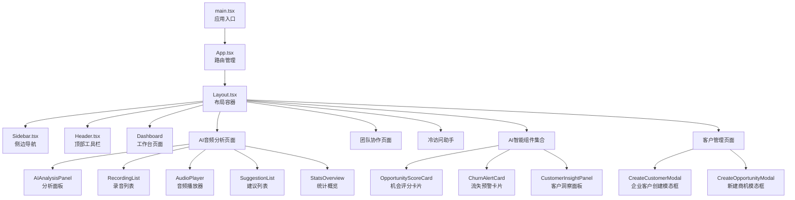

**图表来源**
- [main.tsx:1-11](file://crm-frontend/src/main.tsx#L1-L11)
- [App.tsx:1-68](file://crm-frontend/src/App.tsx#L1-L68)
- [Layout.tsx:1-24](file://crm-frontend/src/components/layout/Layout.tsx#L1-L24)
- [Sidebar.tsx:1-78](file://crm-frontend/src/components/layout/Sidebar.tsx#L1-L78)
- [Header.tsx:1-88](file://crm-frontend/src/components/layout/Header.tsx#L1-L88)
- [CreateCustomerModal.tsx:1-707](file://crm-frontend/src/components/Customers/CreateCustomerModal.tsx#L1-L707)
- [CreateOpportunityModal.tsx:1-316](file://crm-frontend/src/components/Customers/CreateOpportunityModal.tsx#L1-L316)
- [OpportunityScoreCard.tsx:1-336](file://crm-frontend/src/components/AI/OpportunityScoreCard.tsx#L1-L336)
- [ChurnAlertCard.tsx:1-326](file://crm-frontend/src/components/AI/ChurnAlertCard.tsx#L1-L326)
- [CustomerInsightPanel.tsx:1-381](file://crm-frontend/src/components/AI/CustomerInsightPanel.tsx#L1-L381)

## 核心组件
- **Sidebar导航组件**：提供11个核心导航菜单，包括工作台、客户管理、销售漏斗、AI录音分析、智能日程、客户地图、团队协作、售前中心等。
- **Header头部组件**：集成搜索、通知、升级入口与用户信息管理，支持用户下拉菜单和登出功能。
- **Layout布局组件**：统一的页面布局容器，负责侧边栏和主内容区的组织。
- **AI音频分析系统**：完整的AI录音分析解决方案，包含分析面板、录音列表、音频播放器、智能建议等功能。
- **冷访问助手**：AI驱动的企业信息分析和销售话术生成工具。
- **团队协作管理**：团队业绩排行、实时动态监控和成员管理功能。
- **工作台仪表板**：整合AI智能建议、销售漏斗概览、录音分析和日程管理的综合界面。
- **AI智能组件集合**：新增的机会评分卡片、客户流失预警卡片、智能客户洞察面板，提供全面的AI分析支持。
- **企业客户创建模态框**：统一的企业搜索、信息自动填充和客户分类功能，支持企业名称搜索、手动输入和一键创建。

**章节来源**
- [Sidebar.tsx:1-78](file://crm-frontend/src/components/layout/Sidebar.tsx#L1-L78)
- [Header.tsx:1-88](file://crm-frontend/src/components/layout/Header.tsx#L1-L88)
- [Layout.tsx:1-24](file://crm-frontend/src/components/layout/Layout.tsx#L1-L24)
- [Dashboard/index.tsx:1-593](file://crm-frontend/src/pages/Dashboard/index.tsx#L1-L593)
- [CreateCustomerModal.tsx:1-707](file://crm-frontend/src/components/Customers/CreateCustomerModal.tsx#L1-L707)

## 架构总览
系统采用分层架构设计，通过App.tsx的路由管理实现页面级别的模块化。AI功能通过独立的页面组件实现，与现有布局系统无缝集成，形成"AI增强的CRM工作流"。新增的企业客户创建模态框作为客户管理的重要组成部分，与AI智能组件形成互补，为销售团队提供从客户发现到客户管理的完整解决方案。

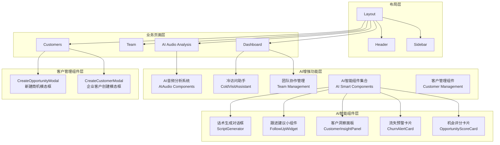

**图表来源**
- [App.tsx:1-68](file://crm-frontend/src/App.tsx#L1-L68)
- [Layout.tsx:1-24](file://crm-frontend/src/components/layout/Layout.tsx#L1-L24)
- [ColdVisitAssistant.tsx:1-547](file://crm-frontend/src/components/ColdVisitAssistant.tsx#L1-L547)
- [AIAudio/index.tsx:1-441](file://crm-frontend/src/pages/AIAudio/index.tsx#L1-L441)
- [Team/index.tsx:1-239](file://crm-frontend/src/pages/Team/index.tsx#L1-L239)
- [CreateCustomerModal.tsx:1-707](file://crm-frontend/src/components/Customers/CreateCustomerModal.tsx#L1-L707)
- [CreateOpportunityModal.tsx:1-316](file://crm-frontend/src/components/Customers/CreateOpportunityModal.tsx#L1-L316)
- [OpportunityScoreCard.tsx:1-336](file://crm-frontend/src/components/AI/OpportunityScoreCard.tsx#L1-L336)
- [ChurnAlertCard.tsx:1-326](file://crm-frontend/src/components/AI/ChurnAlertCard.tsx#L1-L326)
- [CustomerInsightPanel.tsx:1-381](file://crm-frontend/src/components/AI/CustomerInsightPanel.tsx#L1-L381)
- [FollowUpWidget.tsx:1-208](file://crm-frontend/src/components/AI/FollowUpWidget.tsx#L1-L208)
- [ScriptGenerator.tsx:1-270](file://crm-frontend/src/components/AI/ScriptGenerator.tsx#L1-L270)

## 详细组件分析

### Sidebar 导航组件
- **职责**：提供11个核心导航菜单，支持图标与文案配置，当前工作台项默认激活。
- **实现要点**：
  - 使用Material Symbols图标库提供菜单图标与文案。
  - NavItem子组件根据active状态切换样式。
  - 通过数组配置navItems，便于集中维护与扩展。
- **新增AI功能**：新增"AI 录音分析"、"智能日程"、"团队协作"等AI增强功能导航。
- **交互设计**：按钮具备悬停与选中态过渡动画，视觉反馈明确。
- **配置选项**：
  - 可在navItems中新增或调整菜单项（图标、标签、是否默认激活）。
  - 支持权限控制和动态菜单生成。

**章节来源**
- [Sidebar.tsx:1-78](file://crm-frontend/src/components/layout/Sidebar.tsx#L1-L78)

### Header 头部组件
- **职责**：提供搜索、通知、升级入口与用户信息区域，支持用户下拉菜单。
- **实现要点**：
  - 搜索框支持焦点态样式与占位提示。
  - 通知按钮带角标提醒。
  - 用户头像区域含下拉指示器，支持登出功能。
- **交互设计**：各区域悬停高亮，过渡自然。
- **配置选项**：
  - 升级按钮与通知按钮可绑定事件处理。
  - 用户信息可注入动态数据（姓名、角色、头像）。
  - 支持用户菜单的扩展和定制。

**章节来源**
- [Header.tsx:1-88](file://crm-frontend/src/components/layout/Header.tsx#L1-L88)

### Layout 布局组件
- **职责**：统一的页面布局容器，负责侧边栏和主内容区的组织。
- **实现要点**：
  - 使用Flexbox布局实现响应式设计。
  - 通过Outlet组件实现子路由的渲染。
  - 支持暗黑模式的主题切换。
- **数据流**：接收路由参数并传递给子组件。
- **使用示例路径**：
  - [布局容器实现:9-23](file://crm-frontend/src/components/layout/Layout.tsx#L9-L23)

**章节来源**
- [Layout.tsx:1-24](file://crm-frontend/src/components/layout/Layout.tsx#L1-L24)

## AI增强功能

### AI音频分析系统
AI音频分析系统是CRM的核心AI功能，提供完整的录音分析和智能建议生成功能。

#### 核心组件架构
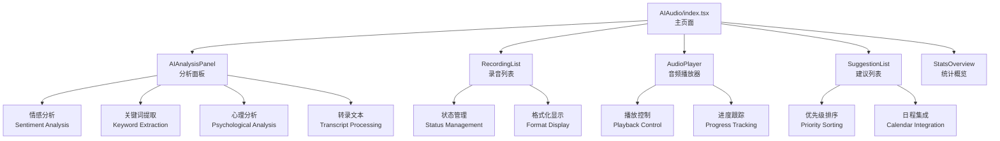

**图表来源**
- [AIAudio/index.tsx:1-441](file://crm-frontend/src/pages/AIAudio/index.tsx#L1-L441)
- [AIAnalysisPanel.tsx:1-224](file://crm-frontend/src/pages/AIAudio/components/AIAnalysisPanel.tsx#L1-L224)
- [RecordingList.tsx:1-158](file://crm-frontend/src/pages/AIAudio/components/RecordingList.tsx#L1-L158)
- [AudioPlayer.tsx:1-165](file://crm-frontend/src/pages/AIAudio/components/AudioPlayer.tsx#L1-L165)
- [SuggestionList.tsx:1-131](file://crm-frontend/src/pages/AIAudio/components/SuggestionList.tsx#L1-L131)
- [StatsOverview.tsx:1-168](file://crm-frontend/src/pages/AIAudio/components/StatsOverview.tsx#L1-L168)

#### AIAnalysisPanel 分析面板
- **职责**：展示AI分析结果，支持开始分析、进度显示和详细结果查看。
- **实现要点**：
  - 根据情感类型（积极/中性/消极）切换颜色和图标。
  - 支持通话摘要、关键词、关键点、心理分析等多维度展示。
  - 提供转录文本的展开/收起功能。
- **数据流**：接收录音数据，根据状态显示不同内容。
- **使用示例路径**：
  - [分析面板实现:46-223](file://crm-frontend/src/pages/AIAudio/components/AIAnalysisPanel.tsx#L46-L223)

#### RecordingList 录音列表
- **职责**：展示录音文件列表，支持选择、筛选和状态显示。
- **实现要点**：
  - 支持按状态（全部/已分析/待分析）筛选。
  - 显示客户信息、时长、日期和情感状态。
  - 提供加载状态和空状态的优雅降级。
- **数据流**：接收录音数组，根据选择状态更新UI。
- **使用示例路径**：
  - [录音列表实现:41-157](file://crm-frontend/src/pages/AIAudio/components/RecordingList.tsx#L41-L157)

#### AudioPlayer 音频播放器
- **职责**：提供录音文件的播放控制和进度管理。
- **实现要点**：
  - 支持播放/暂停、快退/快进、播放速度调节。
  - 实时显示播放进度和剩余时间。
  - 支持多种播放速度（0.5x, 1x, 1.25x, 1.5x, 2x）。
- **数据流**：管理播放状态，更新进度条和时间显示。
- **使用示例路径**：
  - [音频播放器实现:9-164](file://crm-frontend/src/pages/AIAudio/components/AudioPlayer.tsx#L9-L164)

#### SuggestionList 智能建议
- **职责**：展示AI生成的可操作建议，支持一键添加到日程。
- **实现要点**：
  - 根据优先级（高/中/低）显示不同颜色标识。
  - 支持多种建议类型（邮件、演示、方案、跟进、报价）。
  - 提供添加到日程的便捷操作。
- **数据流**：接收建议数组，处理添加到日程的异步操作。
- **使用示例路径**：
  - [智能建议实现:23-130](file://crm-frontend/src/pages/AIAudio/components/SuggestionList.tsx#L23-L130)

#### StatsOverview 统计概览
- **职责**：展示AI分析的统计信息和情感分布。
- **实现要点**：
  - 展示总录音数、总时长、分析完成率和AI准确率。
  - 提供情感分布的可视化展示。
  - 支持加载状态的优雅降级。
- **数据流**：接收统计对象，格式化并展示数据。
- **使用示例路径**：
  - [统计概览实现:17-167](file://crm-frontend/src/pages/AIAudio/components/StatsOverview.tsx#L17-L167)

**章节来源**
- [AIAudio/index.tsx:1-441](file://crm-frontend/src/pages/AIAudio/index.tsx#L1-L441)
- [AIAnalysisPanel.tsx:1-224](file://crm-frontend/src/pages/AIAudio/components/AIAnalysisPanel.tsx#L1-L224)
- [RecordingList.tsx:1-158](file://crm-frontend/src/pages/AIAudio/components/RecordingList.tsx#L1-L158)
- [AudioPlayer.tsx:1-165](file://crm-frontend/src/pages/AIAudio/components/AudioPlayer.tsx#L1-L165)
- [SuggestionList.tsx:1-131](file://crm-frontend/src/pages/AIAudio/components/SuggestionList.tsx#L1-L131)
- [StatsOverview.tsx:1-168](file://crm-frontend/src/pages/AIAudio/components/StatsOverview.tsx#L1-L168)

### 冷访问助手
冷访问助手是AI驱动的企业信息分析和销售话术生成工具。

#### 核心功能架构
```mermaid
graph TB
A["ColdVisitAssistant<br/>冷访问助手"] --> B["输入区域<br/>Input Area"]
A --> C["分析结果<br/>Analysis Result"]
A --> D["话术生成<br/>Sales Pitch"]
B --> E["文本输入<br/>Text Input"]
B --> F["图片上传<br/>Image Upload"]
B --> G["企业分析<br/>Company Analysis"]
C --> H["基本信息卡片<br/>Basic Info Card"]
C --> I["关键联系人<br/>Key Contacts"]
C --> J["销售话术<br/>Sales Pitch"]
D --> K["开场白<br/>Opening Line"]
D --> L["可能痛点<br/>Pain Points]
D --> M["谈话要点<br/>Talking Points"]
D --> N["异议处理<br/>Objection Handling"]
```

**图表来源**
- [ColdVisitAssistant.tsx:1-547](file://crm-frontend/src/components/ColdVisitAssistant.tsx#L1-L547)

#### 核心特性
- **多输入方式**：支持公司名称文本输入和图片上传两种企业信息获取方式。
- **智能分析**：基于AI分析企业基本信息、行业属性、规模和近期动态。
- **话术生成**：自动生成针对目标客户的销售话术，包括开场白、痛点挖掘和异议处理。
- **联系人管理**：识别和展示关键联系人的信息，支持可信度评估。
- **客户转换**：提供一键创建客户的功能，支持自动填充相关信息。

#### 交互流程
1. **信息收集**：用户选择输入方式（文本或图片）
2. **AI分析**：调用后端API进行企业信息分析
3. **结果展示**：通过标签页展示分析结果
4. **话术应用**：复制话术到剪贴板或创建客户
5. **后续跟进**：支持转换为客户并触发相应流程

**章节来源**
- [ColdVisitAssistant.tsx:1-547](file://crm-frontend/src/components/ColdVisitAssistant.tsx#L1-L547)

### 团队协作管理
团队协作管理提供完整的团队业绩管理和实时动态监控功能。

#### 组件架构
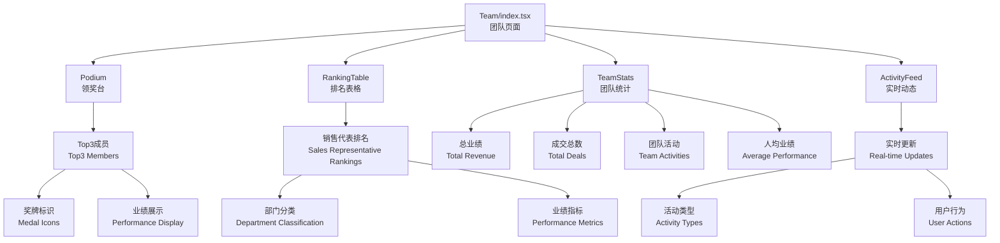

**图表来源**
- [Team/index.tsx:1-239](file://crm-frontend/src/pages/Team/index.tsx#L1-L239)

#### 核心功能
- **业绩排行**：通过领奖台形式展示前三名成员的业绩表现。
- **详细排名**：提供完整的销售代表排名表格，包含部门、业绩、成交数和活动数。
- **团队统计**：展示团队总业绩、成交总数、团队活动和人均业绩等关键指标。
- **实时动态**：监控团队成员的最新活动，包括签约、创建方案、客户拜访、电话跟进和新增线索等。

#### 设计特色
- **视觉层次**：使用渐变背景和不同尺寸的领奖台突出前三名成员。
- **数据可视化**：通过颜色编码和图标增强数据的可读性。
- **响应式设计**：适配不同屏幕尺寸，确保移动端的良好体验。
- **实时更新**：动态显示团队活动，支持实时状态监控。

**章节来源**
- [Team/index.tsx:1-239](file://crm-frontend/src/pages/Team/index.tsx#L1-L239)

## AI智能组件

### AI智能组件集合概述
AI智能组件集合是CRM系统新增的核心AI分析功能，包含三个主要组件：机会评分卡片、客户流失预警卡片、智能客户洞察面板。这些组件为销售团队提供全方位的AI分析支持，帮助销售人员更好地理解商机价值、预测客户流失风险并深入了解客户需求。

#### 组件架构
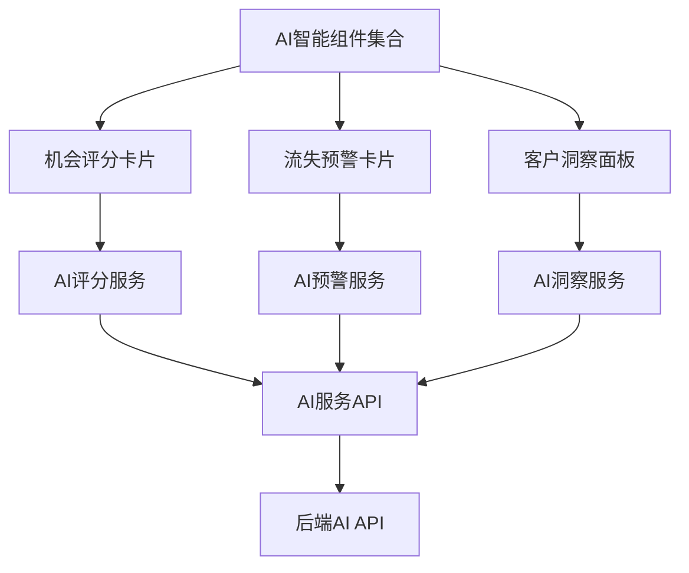

**图表来源**
- [OpportunityScoreCard.tsx:1-336](file://crm-frontend/src/components/AI/OpportunityScoreCard.tsx#L1-L336)
- [ChurnAlertCard.tsx:1-326](file://crm-frontend/src/components/AI/ChurnAlertCard.tsx#L1-L326)
- [CustomerInsightPanel.tsx:1-381](file://crm-frontend/src/components/AI/CustomerInsightPanel.tsx#L1-L381)
- [aiService.ts:1-154](file://crm-frontend/src/services/aiService.ts#L1-L154)

### 机会评分卡片
机会评分卡片为销售机会提供综合评分和多维度分析，帮助销售人员快速评估商机价值和成交可能性。

#### 核心功能架构
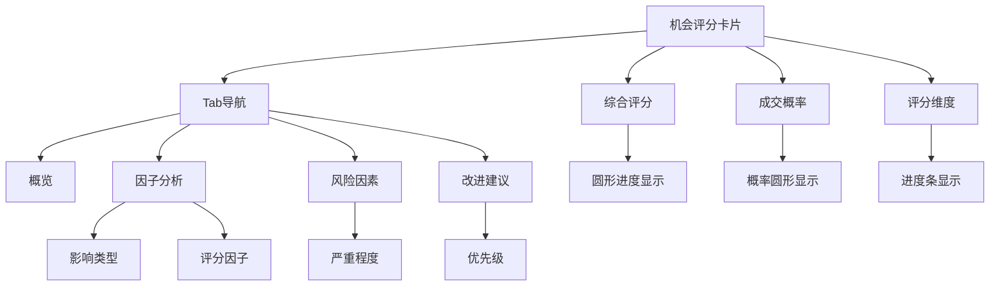

**图表来源**
- [OpportunityScoreCard.tsx:166-333](file://crm-frontend/src/components/AI/OpportunityScoreCard.tsx#L166-L333)

#### 主要特性
- **多维度评分**：提供综合评分、成交概率、互动活跃度、预算匹配度、决策人接触、需求明确度、时机成熟度等7个维度的评分。
- **Tab式导航**：支持概览、因子、风险、建议四个标签页，便于用户深入了解不同方面的分析结果。
- **可视化展示**：使用圆形进度条和进度条直观展示评分结果，颜色编码区分不同评分等级。
- **智能刷新**：支持手动刷新和自动计算，确保数据的时效性。
- **行动建议**：提供可操作的改进建议，帮助销售人员提升商机成功率。

#### 数据结构
机会评分卡片使用以下核心数据结构：
- **OpportunityScore**：包含总体评分、成交概率、各维度评分、评分因子、风险因素、改进建议等字段
- **ScoreFactor**：评分因子对象，包含名称、分数、影响类型、描述
- **RiskFactor**：风险因素对象，包含因素名称、严重程度、处理建议
- **ScoreRecommendation**：改进建议对象，包含行动内容、优先级、预期效果

#### 使用示例
```jsx
<OpportunityScoreCard 
  opportunityId="opp_123" 
  onScoreUpdate={(score) => console.log('评分更新:', score)}
/>
```

**章节来源**
- [OpportunityScoreCard.tsx:1-336](file://crm-frontend/src/components/AI/OpportunityScoreCard.tsx#L1-L336)
- [index.ts:524-540](file://crm-frontend/src/types/index.ts#L524-L540)
- [index.ts:502-521](file://crm-frontend/src/types/index.ts#L502-L521)
- [index.ts:509-514](file://crm-frontend/src/types/index.ts#L509-L514)
- [index.ts:517-521](file://crm-frontend/src/types/index.ts#L517-L521)

### 客户流失预警卡片
客户流失预警卡片实时监控客户流失风险，提供风险评分、预警信号和挽回建议，帮助销售团队及时采取行动防止客户流失。

#### 核心功能架构
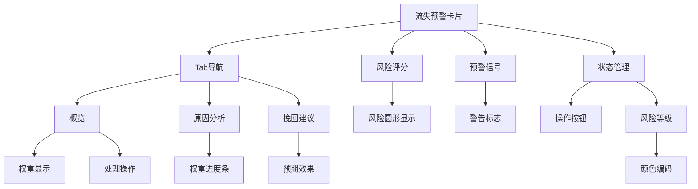

**图表来源**
- [ChurnAlertCard.tsx:187-322](file://crm-frontend/src/components/AI/ChurnAlertCard.tsx#L187-L322)

#### 主要特性
- **实时风险监控**：提供客户流失风险评分和实时预警信号。
- **多维度原因分析**：分析导致客户流失的各种因素及其权重。
- **智能挽回建议**：基于AI分析提供针对性的客户挽留建议。
- **状态管理**：支持标记已处理、忽略等状态管理操作。
- **可视化风险等级**：使用颜色编码直观展示风险等级（高、中、低）。

#### 数据结构
客户流失预警卡片使用以下核心数据结构：
- **ChurnAlert**：包含客户ID、风险等级、风险评分、原因列表、预警信号、挽回建议、状态等字段
- **ChurnReason**：流失原因对象，包含因素名称、权重、证据
- **ChurnSignal**：预警信号对象，包含类型、描述、检测时间
- **RetentionSuggestion**：挽回建议对象，包含行动内容、优先级、预期效果

#### 使用示例
```jsx
<ChurnAlertCard 
  customerId="cust_456" 
  onAlertUpdate={(alert) => console.log('预警更新:', alert)}
```

**章节来源**
- [ChurnAlertCard.tsx:1-326](file://crm-frontend/src/components/AI/ChurnAlertCard.tsx#L1-L326)
- [index.ts:585-605](file://crm-frontend/src/types/index.ts#L585-L605)
- [index.ts:564-568](file://crm-frontend/src/types/index.ts#L564-L568)
- [index.ts:571-575](file://crm-frontend/src/types/index.ts#L571-L575)
- [index.ts:578-582](file://crm-frontend/src/types/index.ts#L578-L582)

### 智能客户洞察面板
智能客户洞察面板提供深度的客户画像分析，包括需求提取、决策人分析、痛点识别和竞品对比，帮助销售人员制定更有针对性的销售策略。

#### 核心功能架构
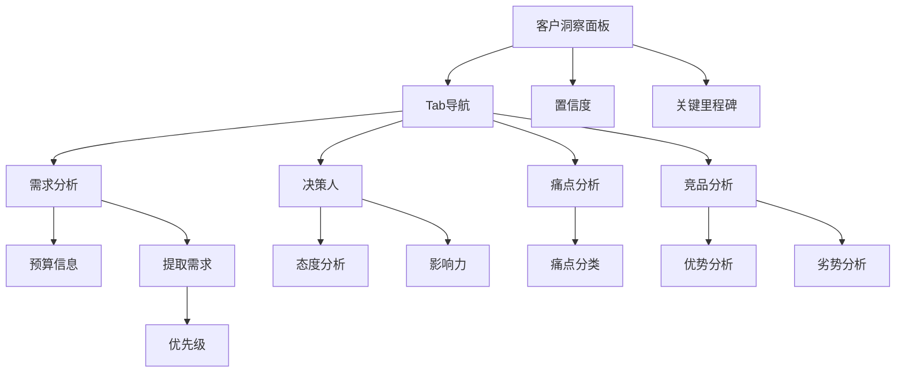

**图表来源**
- [CustomerInsightPanel.tsx:197-377](file://crm-frontend/src/components/AI/CustomerInsightPanel.tsx#L197-L377)

#### 主要特性
- **多维度客户画像**：提供需求、决策人、痛点、竞品四个维度的客户洞察。
- **预算信息提取**：自动识别和分析客户的预算范围和采购时间线。
- **决策人分析**：识别关键决策人，分析其态度和影响力。
- **痛点识别**：提取客户的核心痛点并进行严重程度分类。
- **竞品对比**：分析主要竞品的优势和劣势，为销售策略提供参考。
- **置信度展示**：显示AI分析结果的置信度，帮助判断分析质量。

#### 数据结构
智能客户洞察面板使用以下核心数据结构：
- **CustomerInsight**：包含客户ID、提取需求、预算信息、决策人、痛点、竞品信息、时间线、置信度等字段
- **ExtractedNeed**：提取需求对象，包含需求内容、优先级、来源
- **DecisionMaker**：决策人对象，包含姓名、职位、影响力、态度
- **PainPoint**：痛点对象，包含痛点内容、严重程度、分类
- **CompetitorInfo**：竞品信息对象，包含名称、优势、劣势
- **BudgetInfo**：预算信息对象，包含预算范围、时间线、置信度
- **InsightTimeline**：洞察时间线对象，包含关键里程碑

#### 使用示例
```jsx
<CustomerInsightPanel 
  customerId="cust_789" 
  onInsightUpdate={(insight) => console.log('洞察更新:', insight)}
```

**章节来源**
- [CustomerInsightPanel.tsx:1-381](file://crm-frontend/src/components/AI/CustomerInsightPanel.tsx#L1-L381)
- [index.ts:658-671](file://crm-frontend/src/types/index.ts#L658-L671)
- [index.ts:610-614](file://crm-frontend/src/types/index.ts#L610-L614)
- [index.ts:625-630](file://crm-frontend/src/types/index.ts#L625-L630)
- [index.ts:633-637](file://crm-frontend/src/types/index.ts#L633-L637)
- [index.ts:640-645](file://crm-frontend/src/types/index.ts#L640-L645)
- [index.ts:648-655](file://crm-frontend/src/types/index.ts#L648-L655)

### AI组件API服务
AI智能组件通过专门的AI服务API与后端进行交互，提供统一的API调用接口。

#### API服务架构
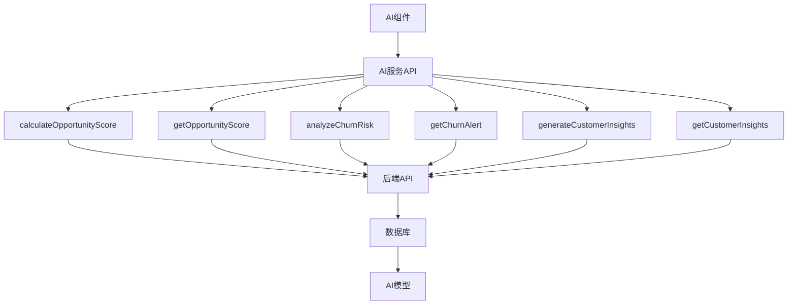

**图表来源**
- [aiService.ts:38-154](file://crm-frontend/src/services/aiService.ts#L38-L154)

#### 核心API接口
- **商机评分API**：calculateOpportunityScore()、getOpportunityScore()、getScoreSummary()
- **流失预警API**：analyzeChurnRisk()、getChurnAlert()、getChurnAlerts()、handleChurnAlert()
- **客户洞察API**：generateCustomerInsights()、getCustomerInsights()、getAIDashboardData()

#### 使用示例
```javascript
// 获取商机评分
const score = await getOpportunityScore('opp_123');

// 分析客户流失风险
const alert = await analyzeChurnRisk('cust_456');

// 生成客户洞察
const insights = await generateCustomerInsights('cust_789');
```

**章节来源**
- [aiService.ts:1-154](file://crm-frontend/src/services/aiService.ts#L1-L154)

### 跟进建议小组件
跟进建议小组件提供AI生成的个性化跟进建议，帮助销售人员高效管理客户关系。

#### 核心功能
- **智能建议生成**：基于客户历史和AI分析生成个性化的跟进建议
- **多渠道支持**：支持电话、拜访、邮件、微信等多种跟进方式
- **优先级管理**：根据重要性和紧急性对建议进行优先级排序
- **状态跟踪**：支持标记完成和忽略操作，跟踪建议执行情况

#### 使用示例
```jsx
<FollowUpWidget 
  limit={5}
  onSuggestionClick={(suggestion) => console.log('点击建议:', suggestion)}
```

**章节来源**
- [FollowUpWidget.tsx:1-208](file://crm-frontend/src/components/AI/FollowUpWidget.tsx#L1-L208)

### 话术生成对话框
话术生成对话框提供AI驱动的个性化销售话术生成，支持多种沟通场景和联系方式。

#### 核心功能
- **多场景支持**：支持常规跟进、产品演示、发送方案、商务谈判等多种沟通目的
- **多渠道适配**：支持电话、拜访、邮件、微信等不同联系方式
- **智能生成**：基于客户信息和沟通历史生成个性化话术
- **要点提取**：自动提取关键要点和注意事项
- **一键复制**：支持将生成的话术一键复制到剪贴板

#### 使用示例
```jsx
<ScriptGenerator
  isOpen={true}
  onClose={() => {}}
  customerId="cust_123"
  customerName="张三"
```

**章节来源**
- [ScriptGenerator.tsx:1-270](file://crm-frontend/src/components/AI/ScriptGenerator.tsx#L1-L270)

### Dashboard页面集成
Dashboard页面集成了多个AI智能组件，为用户提供全面的AI分析概览。

#### 集成组件
- **商机评分概览**：展示整体商机评分统计和Top商机列表
- **流失预警小组件**：显示高风险客户预警和风险分布
- **跟进建议小组件**：提供AI生成的个性化跟进建议

#### 功能特点
- **实时数据更新**：通过AI服务API获取最新的分析结果
- **可视化展示**：使用图表和卡片形式直观展示AI分析结果
- **交互式操作**：支持用户直接在组件中进行操作和状态管理
- **响应式设计**：适配不同屏幕尺寸，确保移动端的良好体验

**章节来源**
- [Dashboard/index.tsx:337-521](file://crm-frontend/src/pages/Dashboard/index.tsx#L337-L521)

## 客户管理组件

### 企业客户创建模态框
企业客户创建模态框是新增的核心客户管理组件，提供统一的企业搜索、信息自动填充和客户分类功能。

#### 核心功能架构
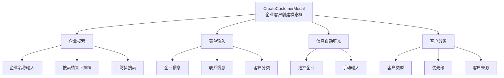

**图表来源**
- [CreateCustomerModal.tsx:1-707](file://crm-frontend/src/components/Customers/CreateCustomerModal.tsx#L1-L707)

#### 主要特性
- **智能企业搜索**：支持企业名称搜索，提供自动补全和防抖优化
- **信息自动填充**：从搜索结果中自动填充企业基本信息
- **统一表单界面**：整合企业信息、联系信息和客户分类到一个界面
- **客户分类管理**：支持多种客户类型、优先级和来源的设置
- **错误处理机制**：提供完整的表单验证和错误提示
- **加载状态管理**：搜索过程中的加载状态和空状态优雅降级

#### 企业搜索功能
- **搜索关键词**：支持企业全称、简称、统一社会信用代码搜索
- **防抖优化**：300ms防抖延迟，避免频繁API调用
- **搜索结果**：最多显示5个匹配结果，支持点击选择或手动输入
- **搜索状态**：加载状态显示旋转指示器，搜索失败显示错误提示

#### 表单数据结构
企业客户创建模态框使用以下核心数据结构：
- **CustomerFormData**：包含企业信息、联系信息、客户分类的所有表单字段
- **CompanySearchResult**：企业搜索结果对象，包含企业基本信息
- **CreateCustomerInput**：创建客户API输入对象，包含所有必要字段

#### 使用示例
```jsx
<CreateCustomerModal
  isOpen={showCreateModal}
  onClose={() => setShowCreateModal(false)}
  onSuccess={() => {
    setShowCreateModal(false);
    // 刷新客户列表
    fetchCustomers();
  }}
/>
```

**章节来源**
- [CreateCustomerModal.tsx:1-707](file://crm-frontend/src/components/Customers/CreateCustomerModal.tsx#L1-L707)
- [api.ts:129-159](file://crm-frontend/src/services/api.ts#L129-L159)
- [index.ts:729-774](file://crm-frontend/src/types/index.ts#L729-L774)

### 新建商机模态框
新建商机模态框提供从客户详情页创建新销售机会的便捷功能。

#### 核心功能
- **客户关联**：自动关联当前客户，显示客户名称
- **阶段智能映射**：根据销售阶段自动设置成交概率
- **金额格式化**：支持金额输入和格式化显示
- **优先级设置**：支持高、中、低三个优先级选择
- **日期选择**：预设预计成交日期，支持手动修改

#### 使用示例
```jsx
<CreateOpportunityModal
  customerId={customerId}
  customerName={customerName}
  onClose={() => setShowCreateModal(false)}
  onSuccess={(opportunity) => {
    setShowCreateModal(false);
    // 刷新商机列表
    fetchOpportunities(customerId);
  }}
/>
```

**章节来源**
- [CreateOpportunityModal.tsx:1-316](file://crm-frontend/src/components/Customers/CreateOpportunityModal.tsx#L1-L316)

### 客户管理页面集成
客户管理页面集成了新增的企业客户创建功能，为用户提供完整的客户管理体验。

#### 页面功能
- **客户列表展示**：支持按阶段、优先级、搜索条件筛选
- **批量操作**：支持批量删除、状态更新等操作
- **创建入口**：提供创建企业客户和新建商机的快捷入口
- **冷访问助手**：集成冷访问助手，支持企业信息分析

#### 功能特点
- **响应式设计**：适配不同屏幕尺寸，支持移动端操作
- **实时更新**：客户数据变更后自动刷新显示
- **操作反馈**：提供创建、更新、删除等操作的成功和错误反馈
- **状态管理**：支持客户状态的动态切换和管理

**章节来源**
- [index.tsx:59-120](file://crm-frontend/src/pages/Customers/index.tsx#L59-L120)

## 依赖分析
- **技术栈**：React 19、TailwindCSS 4、Lucide React 图标库、Vite 打包工具。
- **路由管理**：React Router DOM 6.x，支持嵌套路由和路由守卫。
- **状态管理**：使用React Hooks进行本地状态管理，结合Zustand进行全局状态管理。
- **API通信**：Axios用于HTTP请求，支持拦截器和错误处理。
- **AI功能**：集成第三方AI服务进行语音分析、企业信息提取、商机评分、流失预警、客户洞察等。
- **企业搜索**：集成企业搜索API，支持统一社会信用代码、企业名称、简称搜索。
- **运行时依赖**：react、react-dom、react-router-dom、lucide-react。
- **开发依赖**：@vitejs/plugin-react、tailwindcss、typescript、eslint等。
- **PostCSS配置**：启用TailwindCSS插件，确保样式按需生成。

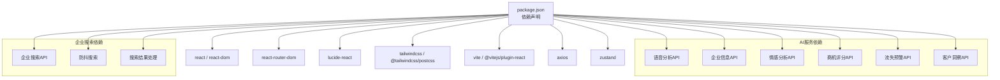

**图表来源**
- [package.json:12-34](file://crm-frontend/package.json#L12-L34)
- [postcss.config.js:1-6](file://crm-frontend/postcss.config.js#L1-L6)
- [vite.config.ts:1-8](file://crm-frontend/vite.config.ts#L1-L8)

**章节来源**
- [package.json:12-34](file://crm-frontend/package.json#L12-L34)
- [postcss.config.js:1-6](file://crm-frontend/postcss.config.js#L1-L6)
- [vite.config.ts:1-8](file://crm-frontend/vite.config.ts#L1-L8)

## 性能考虑
- **组件渲染优化**：使用React.memo和useMemo优化AI分析组件的渲染性能。
- **懒加载策略**：AI音频分析页面采用懒加载，减少初始包大小。
- **虚拟滚动**：录音列表使用虚拟滚动技术处理大量数据。
- **缓存机制**：AI分析结果和用户数据采用本地缓存，提升用户体验。
- **动画性能**：AI分析进度条使用CSS动画，避免JavaScript动画的性能开销。
- **资源优化**：音频文件采用流式加载，支持断点续传。
- **响应式设计**：组件支持移动端优化，减少不必要的重绘和重排。
- **并发请求**：AI仪表盘数据采用Promise.all并发请求，提升数据加载效率。
- **防抖优化**：企业搜索采用300ms防抖延迟，避免频繁API调用。
- **状态管理**：使用useCallback优化表单处理函数，减少不必要的重新渲染。

## 故障排除指南
- **AI功能异常**：检查AI服务API密钥和网络连接，验证后端服务状态。
- **录音播放失败**：确认音频文件格式支持，检查浏览器媒体权限。
- **分析结果为空**：验证输入数据格式，检查AI服务的响应状态。
- **组件样式冲突**：检查TailwindCSS配置，确认组件样式类名的优先级。
- **路由跳转问题**：验证路由配置和权限控制逻辑。
- **用户认证失败**：检查JWT令牌的有效性和过期时间。
- **AI智能组件加载失败**：检查AI服务API的可用性和响应状态，验证数据格式正确性。
- **企业搜索失败**：检查网络连接和API响应状态，验证搜索关键词格式。
- **表单提交错误**：检查必填字段验证，确认API响应状态和错误信息。
- **模态框显示问题**：检查isOpen状态和事件处理函数，确认DOM元素存在。

## 结论
本CRM系统通过全新的AI增强功能体系，实现了从客户洞察到销售执行的完整AI工作流。新增的企业客户创建模态框组件显著增强了客户管理能力，提供了统一的企业搜索、信息自动填充和客户分类功能。这些组件与现有的AI音频分析、冷访问助手、团队协作管理等功能协同工作，形成统一的AI增强销售工作流。新增的AI智能组件集合进一步强化了系统的分析能力，机会评分卡片帮助销售人员量化商机价值，流失预警卡片提供实时的风险监控，智能客户洞察面板深入分析客户特征。建议后续继续完善AI算法的准确性，扩展更多AI应用场景，并优化性能以支持更大规模的数据处理。

## 附录
- **快速启动**：使用Vite开发服务器启动项目，支持热重载和实时预览。
- **构建部署**：通过npm脚本进行生产环境构建和部署。
- **代码规范**：遵循ESLint和TypeScript配置，确保代码质量和一致性。
- **AI模型集成**：支持多种AI服务提供商，可根据需求灵活切换。
- **数据安全**：所有敏感数据都经过加密存储和传输，符合企业安全标准。
- **API文档**：详细的AI服务API文档，包含所有接口的参数和返回值说明。
- **类型定义**：完整的TypeScript类型定义，确保类型安全和开发体验。
- **企业搜索API**：支持统一社会信用代码、企业名称、简称的多维度搜索。
- **客户分类系统**：支持多种客户类型、优先级和来源的灵活配置。

**章节来源**
- [package.json:6-11](file://crm-frontend/package.json#L6-L11)
- [vite.config.ts:5-7](file://crm-frontend/vite.config.ts#L5-L7)