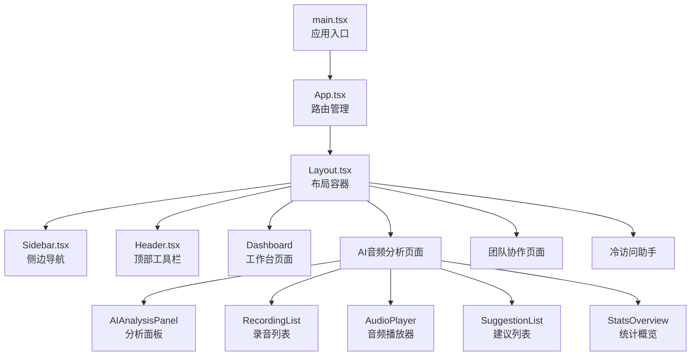
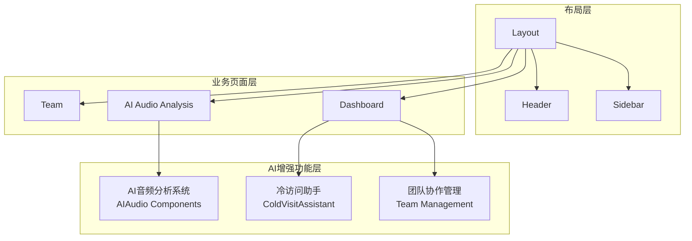
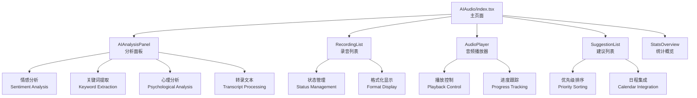
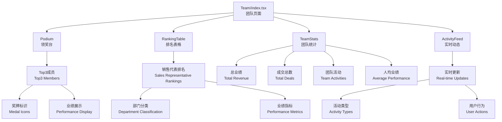
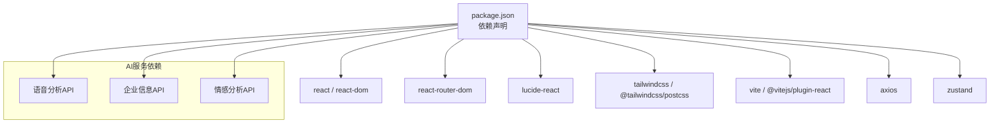

# 核心组件

<cite>
**本文档引用的文件**
- [Sidebar.tsx](file://crm-frontend/src/components/layout/Sidebar.tsx)
- [Header.tsx](file://crm-frontend/src/components/layout/Header.tsx)
- [Layout.tsx](file://crm-frontend/src/components/layout/Layout.tsx)
- [Dashboard/index.tsx](file://crm-frontend/src/pages/Dashboard/index.tsx)
- [AIAudio/index.tsx](file://crm-frontend/src/pages/AIAudio/index.tsx)
- [AIAudio/Components/AIAnalysisPanel.tsx](file://crm-frontend/src/pages/AIAudio/components/AIAnalysisPanel.tsx)
- [AIAudio/Components/RecordingList.tsx](file://crm-frontend/src/pages/AIAudio/components/RecordingList.tsx)
- [AIAudio/Components/AudioPlayer.tsx](file://crm-frontend/src/pages/AIAudio/components/AudioPlayer.tsx)
- [AIAudio/Components/SuggestionList.tsx](file://crm-frontend/src/pages/AIAudio/components/SuggestionList.tsx)
- [AIAudio/Components/StatsOverview.tsx](file://crm-frontend/src/pages/AIAudio/components/StatsOverview.tsx)
- [ColdVisitAssistant.tsx](file://crm-frontend/src/components/ColdVisitAssistant.tsx)
- [Team/index.tsx](file://crm-frontend/src/pages/Team/index.tsx)
- [App.tsx](file://crm-frontend/src/App.tsx)
- [main.tsx](file://crm-frontend/src/main.tsx)
- [package.json](file://crm-frontend/package.json)
- [postcss.config.js](file://crm-frontend/postcss.config.js)
- [vite.config.ts](file://crm-frontend/vite.config.ts)
</cite>

## 目录
1. [简介](#简介)
2. [项目结构](#项目结构)
3. [核心组件](#核心组件)
4. [架构总览](#架构总览)
5. [详细组件分析](#详细组件分析)
6. [AI增强功能](#ai增强功能)
7. [依赖分析](#依赖分析)
8. [性能考虑](#性能考虑)
9. [故障排除指南](#故障排除指南)
10. [结论](#结论)
11. [附录](#附录)

## 简介
本文档面向销售AI CRM系统的前端核心组件，围绕全新的AI增强功能体系进行全面说明。系统现已集成AI音频分析、冷访问助手、团队协作管理等核心AI功能，提供从客户洞察到销售执行的完整AI增强工作流。内容涵盖组件职责、实现原理、数据流与交互设计，并提供使用示例与配置建议，帮助开发者快速理解与扩展系统。

## 项目结构
该前端采用React + Vite + TailwindCSS构建，采用模块化架构设计。新增的AI功能通过独立的页面组件和专用的子组件实现，与现有布局系统无缝集成。整体架构分为三层：布局层（Sidebar、Header、Layout）、业务页面层（Dashboard、AI音频分析、团队管理等）和AI功能层（冷访问助手、智能建议等）。



**图表来源**
- [main.tsx:1-11](file://crm-frontend/src/main.tsx#L1-L11)
- [App.tsx:1-68](file://crm-frontend/src/App.tsx#L1-L68)
- [Layout.tsx:1-24](file://crm-frontend/src/components/layout/Layout.tsx#L1-L24)
- [Sidebar.tsx:1-78](file://crm-frontend/src/components/layout/Sidebar.tsx#L1-L78)
- [Header.tsx:1-88](file://crm-frontend/src/components/layout/Header.tsx#L1-L88)

## 核心组件
- **Sidebar导航组件**：提供11个核心导航菜单，包括工作台、客户管理、销售漏斗、AI录音分析、智能日程、客户地图、团队协作、售前中心等。
- **Header头部组件**：集成搜索、通知、升级入口与用户信息管理，支持用户下拉菜单和登出功能。
- **Layout布局组件**：统一的页面布局容器，负责侧边栏和主内容区的组织。
- **AI音频分析系统**：完整的AI录音分析解决方案，包含分析面板、录音列表、音频播放器、智能建议等功能。
- **冷访问助手**：AI驱动的企业信息分析和销售话术生成工具。
- **团队协作管理**：团队业绩排行、实时动态监控和成员管理功能。
- **工作台仪表板**：整合AI智能建议、销售漏斗概览、录音分析和日程管理的综合界面。

**章节来源**
- [Sidebar.tsx:1-78](file://crm-frontend/src/components/layout/Sidebar.tsx#L1-L78)
- [Header.tsx:1-88](file://crm-frontend/src/components/layout/Header.tsx#L1-L88)
- [Layout.tsx:1-24](file://crm-frontend/src/components/layout/Layout.tsx#L1-L24)
- [Dashboard/index.tsx:1-395](file://crm-frontend/src/pages/Dashboard/index.tsx#L1-L395)

## 架构总览
系统采用分层架构设计，通过App.tsx的路由管理实现页面级别的模块化。AI功能通过独立的页面组件实现，与现有布局系统无缝集成，形成"AI增强的CRM工作流"。



**图表来源**
- [App.tsx:1-68](file://crm-frontend/src/App.tsx#L1-L68)
- [Layout.tsx:1-24](file://crm-frontend/src/components/layout/Layout.tsx#L1-L24)
- [ColdVisitAssistant.tsx:1-547](file://crm-frontend/src/components/ColdVisitAssistant.tsx#L1-L547)
- [AIAudio/index.tsx:1-441](file://crm-frontend/src/pages/AIAudio/index.tsx#L1-L441)
- [Team/index.tsx:1-239](file://crm-frontend/src/pages/Team/index.tsx#L1-L239)

## 详细组件分析

### Sidebar 导航组件
- **职责**：提供11个核心导航菜单，支持图标与文案配置，当前工作台项默认激活。
- **实现要点**：
  - 使用Material Symbols图标库提供菜单图标与文案。
  - NavItem子组件根据active状态切换样式。
  - 通过数组配置navItems，便于集中维护与扩展。
- **新增AI功能**：新增"AI 录音分析"、"智能日程"、"团队协作"等AI增强功能导航。
- **交互设计**：按钮具备悬停与选中态过渡动画，视觉反馈明确。
- **配置选项**：
  - 可在navItems中新增或调整菜单项（图标、标签、是否默认激活）。
  - 支持权限控制和动态菜单生成。

**章节来源**
- [Sidebar.tsx:1-78](file://crm-frontend/src/components/layout/Sidebar.tsx#L1-L78)

### Header 头部组件
- **职责**：提供搜索、通知、升级入口与用户信息区域，支持用户下拉菜单。
- **实现要点**：
  - 搜索框支持焦点态样式与占位提示。
  - 通知按钮带角标提醒。
  - 用户头像区域含下拉指示器，支持登出功能。
- **交互设计**：各区域悬停高亮，过渡自然。
- **配置选项**：
  - 升级按钮与通知按钮可绑定事件处理。
  - 用户信息可注入动态数据（姓名、角色、头像）。
  - 支持用户菜单的扩展和定制。

**章节来源**
- [Header.tsx:1-88](file://crm-frontend/src/components/layout/Header.tsx#L1-L88)

### Layout 布局组件
- **职责**：统一的页面布局容器，负责侧边栏和主内容区的组织。
- **实现要点**：
  - 使用Flexbox布局实现响应式设计。
  - 通过Outlet组件实现子路由的渲染。
  - 支持暗黑模式的主题切换。
- **数据流**：接收路由参数并传递给子组件。
- **使用示例路径**：
  - [布局容器实现:9-23](file://crm-frontend/src/components/layout/Layout.tsx#L9-L23)

**章节来源**
- [Layout.tsx:1-24](file://crm-frontend/src/components/layout/Layout.tsx#L1-L24)

## AI增强功能

### AI音频分析系统
AI音频分析系统是CRM的核心AI功能，提供完整的录音分析和智能建议生成功能。

#### 核心组件架构


**图表来源**
- [AIAudio/index.tsx:1-441](file://crm-frontend/src/pages/AIAudio/index.tsx#L1-L441)
- [AIAnalysisPanel.tsx:1-224](file://crm-frontend/src/pages/AIAudio/components/AIAnalysisPanel.tsx#L1-L224)
- [RecordingList.tsx:1-158](file://crm-frontend/src/pages/AIAudio/components/RecordingList.tsx#L1-L158)
- [AudioPlayer.tsx:1-165](file://crm-frontend/src/pages/AIAudio/components/AudioPlayer.tsx#L1-L165)
- [SuggestionList.tsx:1-131](file://crm-frontend/src/pages/AIAudio/components/SuggestionList.tsx#L1-L131)
- [StatsOverview.tsx:1-168](file://crm-frontend/src/pages/AIAudio/components/StatsOverview.tsx#L1-L168)

#### AIAnalysisPanel 分析面板
- **职责**：展示AI分析结果，支持开始分析、进度显示和详细结果查看。
- **实现要点**：
  - 根据情感类型（积极/中性/消极）切换颜色和图标。
  - 支持通话摘要、关键词、关键点、心理分析等多维度展示。
  - 提供转录文本的展开/收起功能。
- **数据流**：接收录音数据，根据状态显示不同内容。
- **使用示例路径**：
  - [分析面板实现:46-223](file://crm-frontend/src/pages/AIAudio/components/AIAnalysisPanel.tsx#L46-L223)

#### RecordingList 录音列表
- **职责**：展示录音文件列表，支持选择、筛选和状态显示。
- **实现要点**：
  - 支持按状态（全部/已分析/待分析）筛选。
  - 显示客户信息、时长、日期和情感状态。
  - 提供加载状态和空状态的优雅降级。
- **数据流**：接收录音数组，根据选择状态更新UI。
- **使用示例路径**：
  - [录音列表实现:41-157](file://crm-frontend/src/pages/AIAudio/components/RecordingList.tsx#L41-L157)

#### AudioPlayer 音频播放器
- **职责**：提供录音文件的播放控制和进度管理。
- **实现要点**：
  - 支持播放/暂停、快退/快进、播放速度调节。
  - 实时显示播放进度和剩余时间。
  - 支持多种播放速度（0.5x, 1x, 1.25x, 1.5x, 2x）。
- **数据流**：管理播放状态，更新进度条和时间显示。
- **使用示例路径**：
  - [音频播放器实现:9-164](file://crm-frontend/src/pages/AIAudio/components/AudioPlayer.tsx#L9-L164)

#### SuggestionList 智能建议
- **职责**：展示AI生成的可操作建议，支持一键添加到日程。
- **实现要点**：
  - 根据优先级（高/中/低）显示不同颜色标识。
  - 支持多种建议类型（邮件、演示、方案、跟进、报价）。
  - 提供添加到日程的便捷操作。
- **数据流**：接收建议数组，处理添加到日程的异步操作。
- **使用示例路径**：
  - [智能建议实现:23-130](file://crm-frontend/src/pages/AIAudio/components/SuggestionList.tsx#L23-L130)

#### StatsOverview 统计概览
- **职责**：展示AI分析的统计信息和情感分布。
- **实现要点**：
  - 展示总录音数、总时长、分析完成率和AI准确率。
  - 提供情感分布的可视化展示。
  - 支持加载状态的优雅降级。
- **数据流**：接收统计对象，格式化并展示数据。
- **使用示例路径**：
  - [统计概览实现:17-167](file://crm-frontend/src/pages/AIAudio/components/StatsOverview.tsx#L17-L167)

**章节来源**
- [AIAudio/index.tsx:1-441](file://crm-frontend/src/pages/AIAudio/index.tsx#L1-L441)
- [AIAnalysisPanel.tsx:1-224](file://crm-frontend/src/pages/AIAudio/components/AIAnalysisPanel.tsx#L1-L224)
- [RecordingList.tsx:1-158](file://crm-frontend/src/pages/AIAudio/components/RecordingList.tsx#L1-L158)
- [AudioPlayer.tsx:1-165](file://crm-frontend/src/pages/AIAudio/components/AudioPlayer.tsx#L1-L165)
- [SuggestionList.tsx:1-131](file://crm-frontend/src/pages/AIAudio/components/SuggestionList.tsx#L1-L131)
- [StatsOverview.tsx:1-168](file://crm-frontend/src/pages/AIAudio/components/StatsOverview.tsx#L1-L168)

### 冷访问助手
冷访问助手是AI驱动的企业信息分析和销售话术生成工具。

#### 核心功能架构
```mermaid
graph TB
A["ColdVisitAssistant<br/>冷访问助手"] --> B["输入区域<br/>Input Area"]
A --> C["分析结果<br/>Analysis Result"]
A --> D["话术生成<br/>Pitch Generation"]
B --> E["文本输入<br/>Text Input"]
B --> F["图片上传<br/>Image Upload"]
B --> G["企业分析<br/>Company Analysis"]
C --> H["基本信息卡片<br/>Basic Info Card"]
C --> I["关键联系人<br/>Key Contacts"]
C --> J["销售话术<br/>Sales Pitch"]
D --> K["开场白<br/>Opening Line"]
D --> L["可能痛点<br/>Pain Points]
D --> M["谈话要点<br/>Talking Points"]
D --> N["异议处理<br/>Objection Handling"]
```

**图表来源**
- [ColdVisitAssistant.tsx:1-547](file://crm-frontend/src/components/ColdVisitAssistant.tsx#L1-L547)

#### 核心特性
- **多输入方式**：支持公司名称文本输入和图片上传两种企业信息获取方式。
- **智能分析**：基于AI分析企业基本信息、行业属性、规模和近期动态。
- **话术生成**：自动生成针对目标客户的销售话术，包括开场白、痛点挖掘和异议处理。
- **联系人管理**：识别和展示关键联系人的信息，支持可信度评估。
- **客户转换**：提供一键创建客户的功能，支持自动填充相关信息。

#### 交互流程
1. **信息收集**：用户选择输入方式（文本或图片）
2. **AI分析**：调用后端API进行企业信息分析
3. **结果展示**：通过标签页展示分析结果
4. **话术应用**：复制话术到剪贴板或创建客户
5. **后续跟进**：支持转换为客户并触发相应流程

**章节来源**
- [ColdVisitAssistant.tsx:1-547](file://crm-frontend/src/components/ColdVisitAssistant.tsx#L1-L547)

### 团队协作管理
团队协作管理提供完整的团队业绩管理和实时动态监控功能。

#### 组件架构


**图表来源**
- [Team/index.tsx:1-239](file://crm-frontend/src/pages/Team/index.tsx#L1-L239)

#### 核心功能
- **业绩排行**：通过领奖台形式展示前三名成员的业绩表现。
- **详细排名**：提供完整的销售代表排名表格，包含部门、业绩、成交数和活动数。
- **团队统计**：展示团队总业绩、成交总数、团队活动和人均业绩等关键指标。
- **实时动态**：监控团队成员的最新活动，包括签约、创建方案、客户拜访、电话跟进和新增线索等。

#### 设计特色
- **视觉层次**：使用渐变背景和不同尺寸的领奖台突出前三名成员。
- **数据可视化**：通过颜色编码和图标增强数据的可读性。
- **响应式设计**：适配不同屏幕尺寸，确保移动端的良好体验。
- **实时更新**：动态显示团队活动，支持实时状态监控。

**章节来源**
- [Team/index.tsx:1-239](file://crm-frontend/src/pages/Team/index.tsx#L1-L239)

## 依赖分析
- **技术栈**：React 19、TailwindCSS 4、Lucide React 图标库、Vite 打包工具。
- **路由管理**：React Router DOM 6.x，支持嵌套路由和路由守卫。
- **状态管理**：使用React Hooks进行本地状态管理，结合Zustand进行全局状态管理。
- **API通信**：Axios用于HTTP请求，支持拦截器和错误处理。
- **AI功能**：集成第三方AI服务进行语音分析和企业信息提取。
- **运行时依赖**：react、react-dom、react-router-dom、lucide-react。
- **开发依赖**：@vitejs/plugin-react、tailwindcss、typescript、eslint等。
- **PostCSS配置**：启用TailwindCSS插件，确保样式按需生成。



**图表来源**
- [package.json:12-34](file://crm-frontend/package.json#L12-L34)
- [postcss.config.js:1-6](file://crm-frontend/postcss.config.js#L1-L6)
- [vite.config.ts:1-8](file://crm-frontend/vite.config.ts#L1-L8)

**章节来源**
- [package.json:12-34](file://crm-frontend/package.json#L12-L34)
- [postcss.config.js:1-6](file://crm-frontend/postcss.config.js#L1-L6)
- [vite.config.ts:1-8](file://crm-frontend/vite.config.ts#L1-L8)

## 性能考虑
- **组件渲染优化**：使用React.memo和useMemo优化AI分析组件的渲染性能。
- **懒加载策略**：AI音频分析页面采用懒加载，减少初始包大小。
- **虚拟滚动**：录音列表使用虚拟滚动技术处理大量数据。
- **缓存机制**：AI分析结果和用户数据采用本地缓存，提升用户体验。
- **动画性能**：AI分析进度条使用CSS动画，避免JavaScript动画的性能开销。
- **资源优化**：音频文件采用流式加载，支持断点续传。
- **响应式设计**：组件支持移动端优化，减少不必要的重绘和重排。

## 故障排除指南
- **AI功能异常**：检查AI服务API密钥和网络连接，验证后端服务状态。
- **录音播放失败**：确认音频文件格式支持，检查浏览器媒体权限。
- **分析结果为空**：验证输入数据格式，检查AI服务的响应状态。
- **组件样式冲突**：检查TailwindCSS配置，确认组件样式类名的优先级。
- **路由跳转问题**：验证路由配置和权限控制逻辑。
- **用户认证失败**：检查JWT令牌的有效性和过期时间。

## 结论
本CRM系统通过全新的AI增强功能体系，实现了从客户洞察到销售执行的完整AI工作流。AI音频分析系统提供专业的录音分析和智能建议功能，冷访问助手支持企业信息智能分析和话术生成，团队协作管理提供实时的团队监控和绩效分析。所有AI功能都与现有的布局系统无缝集成，形成统一的用户体验。建议后续继续完善AI算法的准确性，扩展更多AI应用场景，并优化性能以支持更大规模的数据处理。

## 附录
- **快速启动**：使用Vite开发服务器启动项目，支持热重载和实时预览。
- **构建部署**：通过npm脚本进行生产环境构建和部署。
- **代码规范**：遵循ESLint和TypeScript配置，确保代码质量和一致性。
- **AI模型集成**：支持多种AI服务提供商，可根据需求灵活切换。
- **数据安全**：所有敏感数据都经过加密存储和传输，符合企业安全标准。

**章节来源**
- [package.json:6-11](file://crm-frontend/package.json#L6-L11)
- [vite.config.ts:5-7](file://crm-frontend/vite.config.ts#L5-L7)