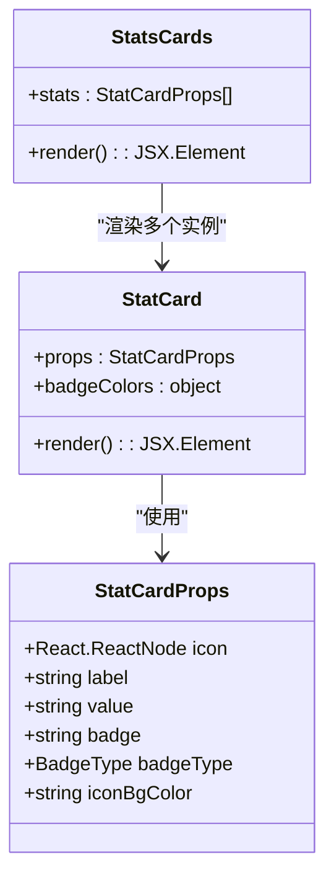
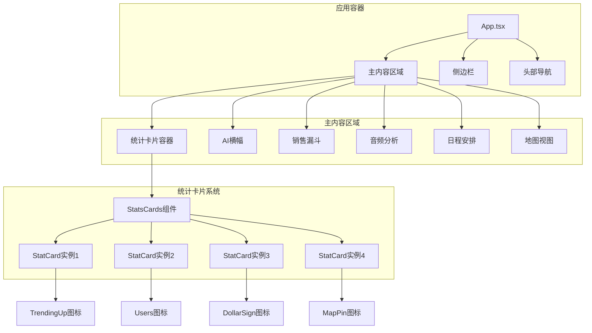
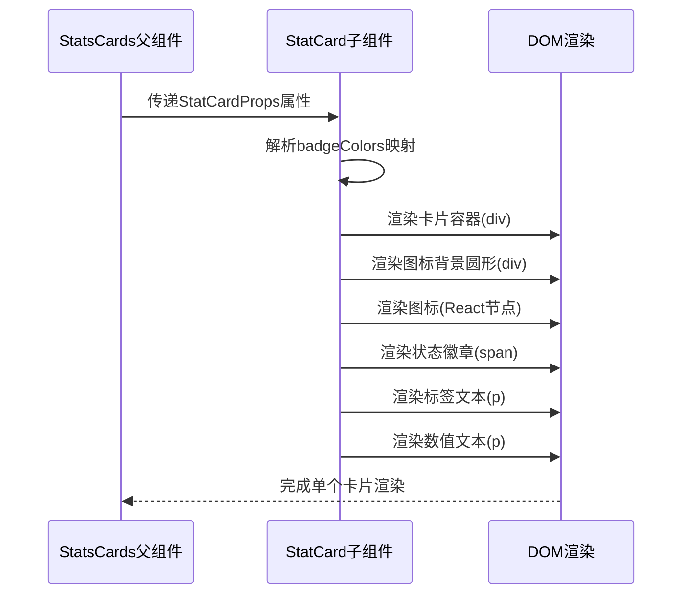
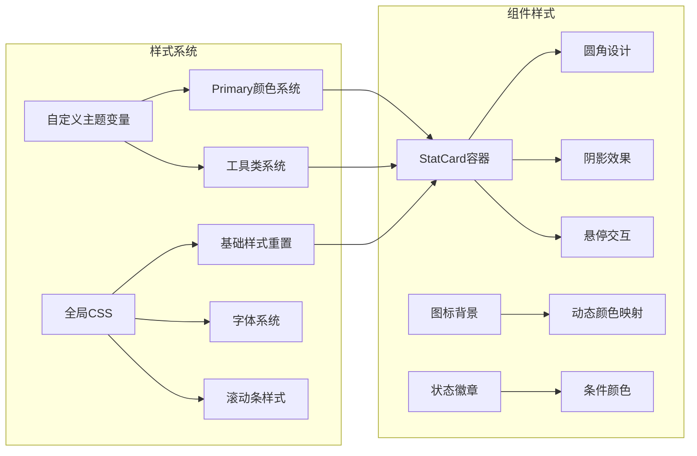
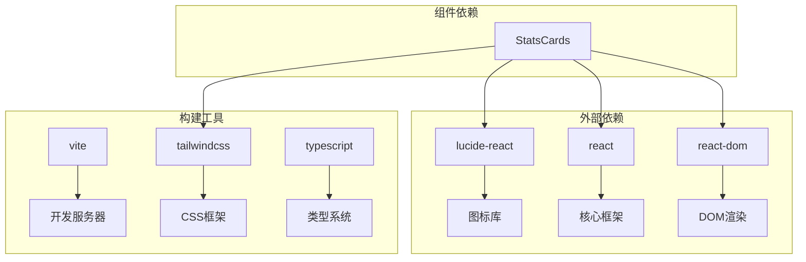
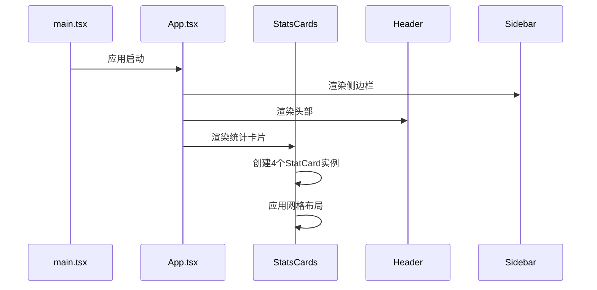

# 统计卡片组件（StatsCards）

<cite>
**本文档引用的文件**
- [StatsCards.tsx](file://crm-frontend/src/components/StatsCards.tsx)
- [App.tsx](file://crm-frontend/src/App.tsx)
- [package.json](file://crm-frontend/package.json)
- [index.css](file://crm-frontend/src/index.css)
- [main.tsx](file://crm-frontend/src/main.tsx)
- [vite.config.ts](file://crm-frontend/vite.config.ts)
- [Header.tsx](file://crm-frontend/src/components/Header.tsx)
- [Sidebar.tsx](file://crm-frontend/src/components/Sidebar.tsx)
</cite>

## 目录
1. [简介](#简介)
2. [项目结构](#项目结构)
3. [核心组件](#核心组件)
4. [架构概览](#架构概览)
5. [详细组件分析](#详细组件分析)
6. [依赖分析](#依赖分析)
7. [性能考虑](#性能考虑)
8. [故障排除指南](#故障排除指南)
9. [结论](#结论)
10. [附录](#附录)

## 简介

StatsCards统计面板组件是销售AI CRM系统中的核心数据可视化组件，负责以卡片形式展示关键业务指标。该组件采用现代化的设计理念，通过直观的视觉层次和交互反馈，帮助用户快速获取重要的业务洞察。

组件设计遵循以下核心原则：
- **简洁性**：最小化的视觉元素，突出数据本身
- **一致性**：统一的布局规范和色彩体系
- **可扩展性**：模块化的组件架构支持灵活配置
- **响应式**：适配不同屏幕尺寸和设备类型

## 项目结构

统计卡片组件位于前端项目的组件目录中，与应用的主要入口文件协同工作：

```mermaid
graph TB
subgraph "CRM前端项目结构"
A[crm-frontend/] --> B[src/]
A --> C[vite.config.ts]
A --> D[package.json]
B --> E[components/]
B --> F[assets/]
B --> G[index.css]
B --> H[main.tsx]
B --> I[App.tsx]
E --> J[StatsCards.tsx]
E --> K[Header.tsx]
E --> L[Sidebar.tsx]
E --> M[其他组件...]
end
```



**图表来源**
- [StatsCards.tsx:1-81](file://crm-frontend/src/components/StatsCards.tsx#L1-L81)
- [App.tsx:1-58](file://crm-frontend/src/App.tsx#L1-L58)

**章节来源**
- [StatsCards.tsx:1-81](file://crm-frontend/src/components/StatsCards.tsx#L1-L81)
- [App.tsx:1-58](file://crm-frontend/src/App.tsx#L1-L58)

## 核心组件

### 组件架构设计

统计卡片组件采用函数式组件设计，通过props传递配置参数，实现高度可复用的UI组件：



**图表来源**
- [StatsCards.tsx:3-10](file://crm-frontend/src/components/StatsCards.tsx#L3-L10)
- [StatsCards.tsx:12-33](file://crm-frontend/src/components/StatsCards.tsx#L12-L33)
- [StatsCards.tsx:35-78](file://crm-frontend/src/components/StatsCards.tsx#L35-L78)

### 数据模型定义

组件采用TypeScript接口定义数据结构，确保类型安全性和开发体验：

| 属性名 | 类型 | 必需 | 描述 | 默认值 |
|--------|------|------|------|--------|
| icon | React.ReactNode | 是 | 图标组件，支持任意React节点 | - |
| label | string | 是 | 卡片标题文本 | - |
| value | string | 是 | 主要显示数值 | - |
| badge | string | 是 | 状态徽章文本 | - |
| badgeType | 'success' \| 'warning' \| 'danger' | 是 | 徽章状态类型 | - |
| iconBgColor | string | 是 | 图标背景色类名 | - |

**章节来源**
- [StatsCards.tsx:3-10](file://crm-frontend/src/components/StatsCards.tsx#L3-L10)

## 架构概览

统计卡片组件在应用中的集成位置体现了清晰的分层架构：



**图表来源**
- [App.tsx:10-55](file://crm-frontend/src/App.tsx#L10-L55)
- [StatsCards.tsx:35-78](file://crm-frontend/src/components/StatsCards.tsx#L35-L78)

**章节来源**
- [App.tsx:1-58](file://crm-frontend/src/App.tsx#L1-L58)
- [StatsCards.tsx:35-78](file://crm-frontend/src/components/StatsCards.tsx#L35-L78)

## 详细组件分析

### StatCard子组件实现

StatCard是单个统计卡片的渲染逻辑，负责具体的UI呈现：



**图表来源**
- [StatsCards.tsx:12-33](file://crm-frontend/src/components/StatsCards.tsx#L12-L33)

#### 视觉设计要素

组件采用精心设计的视觉层次结构：

| 设计元素 | 实现方式 | 颜色规范 | 尺寸规格 |
|----------|----------|----------|----------|
| 卡片容器 | div + Tailwind类 | 白色背景，灰色边框 | 圆角1xl，阴影轻微 |
| 图标容器 | 圆形div + 背景色 | 动态颜色变量 | 40x40像素 |
| 状态徽章 | 圆角span + 颜色映射 | 成功/警告/危险三色 | 10x10像素起始 |
| 标签文本 | 小号文本 | 灰色500 | 14px字体大小 |
| 数值显示 | 大号粗体 | 深灰色900 | 2xl字号 |

**章节来源**
- [StatsCards.tsx:12-33](file://crm-frontend/src/components/StatsCards.tsx#L12-L33)

### StatsCards主组件实现

StatsCards负责管理多个统计卡片的集合展示：

```mermaid
flowchart TD
A[StatsCards组件初始化] --> B[定义统计数据数组]
B --> C[遍历统计数据]
C --> D[为每个数据创建StatCard实例]
D --> E[应用网格布局]
E --> F[渲染完成]
B --> G[{icon: TrendingUp}]
B --> H[{icon: Users}]
B --> I[{icon: DollarSign}]
B --> J[{icon: MapPin}]
G --> K[月度收入统计]
H --> L[活跃客户统计]
I --> M[销售管道价值]
J --> N[今日拜访统计]
```

**图表来源**
- [StatsCards.tsx:35-78](file://crm-frontend/src/components/StatsCards.tsx#L35-L78)

#### 数据配置详解

组件内置了四个预设的统计项，每项都经过精心设计以覆盖关键业务指标：

| 统计项 | 图标 | 标签 | 当前值 | 变化趋势 | 状态类型 |
|--------|------|------|--------|----------|----------|
| 月度收入 | TrendingUp | Monthly Revenue | ¥350.0万 | +23% | success |
| 活跃客户 | Users | Active Customers | 7 | +5 | success |
| 销售管道 | DollarSign | Pipeline Value | ¥995.0万 | +12% | success |
| 今日拜访 | MapPin | Today's Visits | 2 | Urgent | danger |

**章节来源**
- [StatsCards.tsx:36-69](file://crm-frontend/src/components/StatsCards.tsx#L36-L69)

### 样式系统集成

组件充分利用Tailwind CSS和自定义主题变量实现一致的视觉风格：



**图表来源**
- [index.css:3-15](file://crm-frontend/src/index.css#L3-L15)
- [StatsCards.tsx:19-32](file://crm-frontend/src/components/StatsCards.tsx#L19-L32)

**章节来源**
- [index.css:1-66](file://crm-frontend/src/index.css#L1-L66)
- [StatsCards.tsx:19-32](file://crm-frontend/src/components/StatsCards.tsx#L19-L32)

## 依赖分析

### 外部依赖关系

统计卡片组件的依赖关系相对简单，主要依赖于React生态系统：



**图表来源**
- [package.json:12-16](file://crm-frontend/package.json#L12-L16)
- [StatsCards.tsx](file://crm-frontend/src/components/StatsCards.tsx#L1)

**章节来源**
- [package.json:1-36](file://crm-frontend/package.json#L1-L36)

### 内部组件集成

组件在应用中的集成展示了清晰的职责分离：



**图表来源**
- [main.tsx:1-11](file://crm-frontend/src/main.tsx#L1-L11)
- [App.tsx:10-25](file://crm-frontend/src/App.tsx#L10-L25)
- [StatsCards.tsx:35-78](file://crm-frontend/src/components/StatsCards.tsx#L35-L78)

**章节来源**
- [main.tsx:1-11](file://crm-frontend/src/main.tsx#L1-L11)
- [App.tsx:1-58](file://crm-frontend/src/App.tsx#L1-L58)

## 性能考虑

### 渲染优化策略

统计卡片组件在设计时充分考虑了性能优化：

1. **最小化重渲染**：使用稳定的key值确保列表项的正确更新
2. **轻量级样式**：采用CSS类名而非内联样式的计算开销
3. **图标优化**：使用矢量图标库，支持按需加载
4. **内存效率**：简单的数据结构避免不必要的状态存储

### 响应式设计

组件具备良好的响应式特性，能够适应不同的屏幕尺寸：

- **网格布局**：使用CSS Grid实现四列布局
- **弹性容器**：卡片容器支持内容自适应
- **字体缩放**：基于rem单位的字体系统

## 故障排除指南

### 常见问题及解决方案

| 问题类型 | 症状描述 | 可能原因 | 解决方案 |
|----------|----------|----------|----------|
| 图标不显示 | 卡片正常但图标缺失 | lucide-react未正确安装 | 运行npm install lucide-react |
| 颜色异常 | 卡片颜色不符合预期 | Tailwind CSS配置问题 | 检查index.css中的主题变量 |
| 布局错乱 | 卡片排列不整齐 | CSS类名冲突 | 验证网格布局类名 |
| 性能问题 | 页面滚动卡顿 | 过多DOM节点 | 考虑虚拟化或减少卡片数量 |

**章节来源**
- [package.json:12-16](file://crm-frontend/package.json#L12-L16)
- [index.css:1-66](file://crm-frontend/src/index.css#L1-L66)

### 开发调试技巧

1. **浏览器开发者工具**：检查元素层级和样式应用
2. **React DevTools**：监控组件渲染次数和性能
3. **网络面板**：确认图标资源加载状态
4. **控制台日志**：添加必要的调试信息

## 结论

StatsCards统计面板组件展现了现代React应用的最佳实践，通过简洁的架构设计和精心的视觉实现，成功地将复杂的数据信息转化为直观的用户体验。组件的设计理念、数据模型和视觉效果都体现了专业级的开发标准。

该组件的主要优势包括：
- **模块化设计**：清晰的职责分离便于维护和扩展
- **类型安全**：完整的TypeScript支持确保开发质量
- **样式一致性**：统一的设计语言提升用户体验
- **性能优化**：合理的渲染策略保证流畅的交互体验

## 附录

### 使用示例

组件的使用非常简单，只需在需要的位置导入并渲染即可：

```typescript
// 基本用法
import StatsCards from './components/StatsCards';

function Dashboard() {
  return (
    <div>
      <StatsCards />
    </div>
  );
}
```

### 自定义配置

组件支持多种自定义选项：

1. **图标自定义**：传入任何React节点作为图标
2. **颜色主题**：通过iconBgColor参数自定义背景色
3. **数据绑定**：动态生成stats数组实现数据驱动
4. **布局调整**：修改网格列数适应不同需求

### 扩展建议

基于现有架构，可以考虑以下扩展方向：

1. **动画效果**：添加进入动画和状态变化动画
2. **交互功能**：支持点击事件和详情展开
3. **数据刷新**：集成实时数据更新机制
4. **主题切换**：支持深色模式和其他主题变体