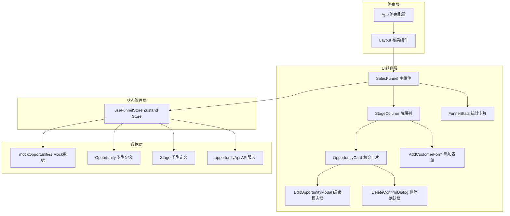
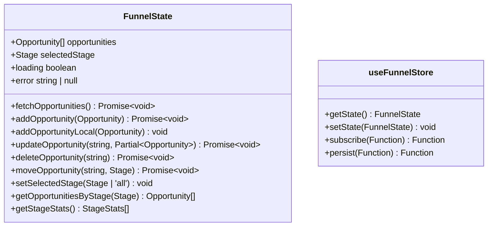
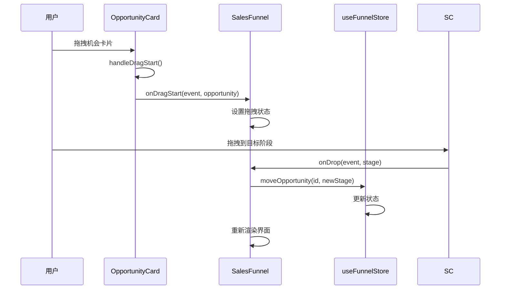
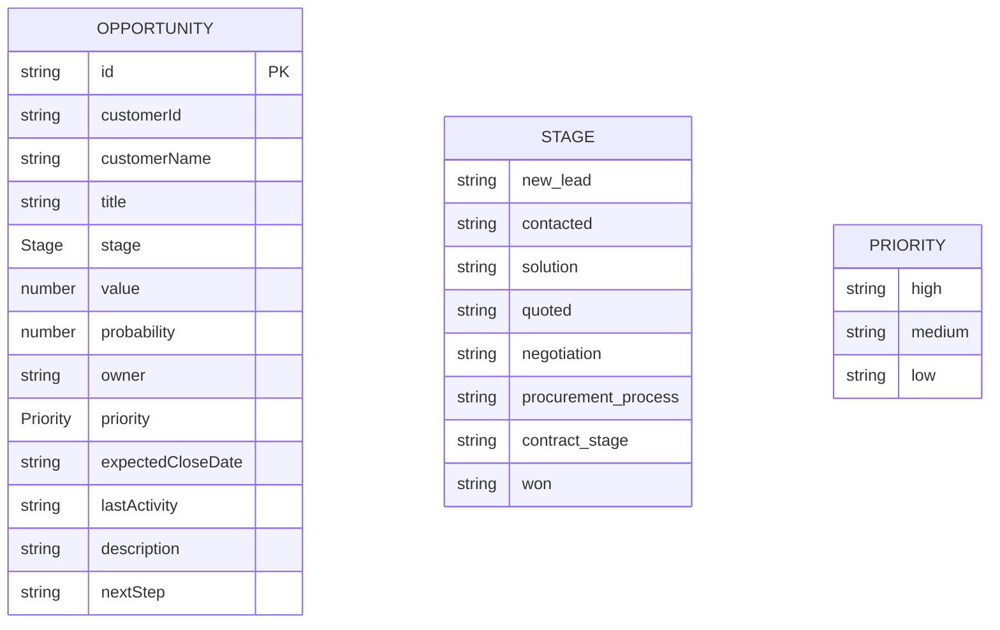
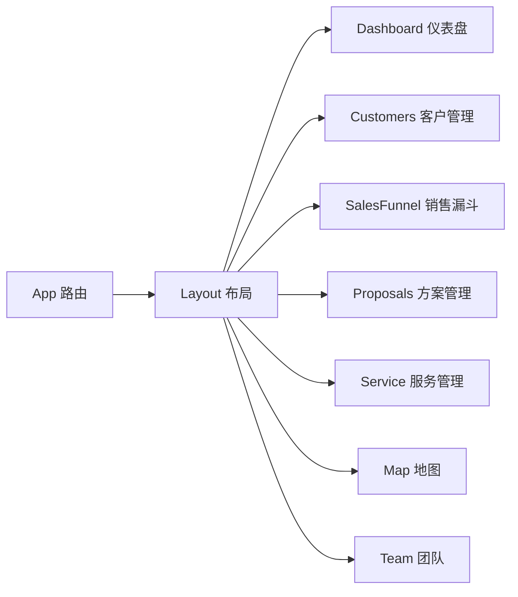

# 销售漏斗组件 (SalesFunnel)

<cite>
**本文引用的文件**
- [index.tsx](file://crm-frontend/src/pages/SalesFunnel/index.tsx)
- [funnelStore.ts](file://crm-frontend/src/stores/funnelStore.ts)
- [index.ts](file://crm-frontend/src/types/index.ts)
- [opportunities.ts](file://crm-frontend/src/data/opportunities.ts)
- [App.tsx](file://crm-frontend/src/App.tsx)
- [Layout.tsx](file://crm-frontend/src/components/layout/Layout.tsx)
- [index.ts](file://crm-frontend/src/stores/index.ts)
</cite>

## 更新摘要
**所做变更**
- 完全重构销售漏斗页面架构，从静态演示界面升级为交互式生产就绪应用
- 新增基于Zustand的状态管理架构，实现完整的CRUD操作
- 集成拖拽功能，支持卡片在不同阶段间移动
- 实现编辑模态框和删除确认对话框
- 新增客户添加表单，支持快速创建新的销售机会
- 采用响应式设计和现代化UI组件
- 新增完整的API集成和实时数据同步功能
- 扩展销售机会生命周期管理功能

## 目录
1. [简介](#简介)
2. [架构总览](#架构总览)
3. [核心组件](#核心组件)
4. [状态管理架构](#状态管理架构)
5. [交互功能详解](#交互功能详解)
6. [数据模型与类型系统](#数据模型与类型系统)
7. [拖拽与移动机制](#拖拽与移动机制)
8. [用户界面组件](#用户界面组件)
9. [统计与分析功能](#统计与分析功能)
10. [路由与导航集成](#路由与导航集成)
11. [API集成与数据同步](#api集成与数据同步)
12. [样式与主题系统](#样式与主题系统)
13. [扩展开发指南](#扩展开发指南)

## 简介
SalesFunnel（销售漏斗）组件现已完全重构为交互式生产就绪应用，基于现代React生态系统构建。该组件提供完整的销售机会管理功能，包括实时拖拽、编辑、删除、添加等CRUD操作，以及丰富的统计分析和可视化展示。

**更新** 从静态演示界面升级为功能完整的交互式应用，集成了完整的状态管理和用户交互功能，支持销售机会的完整生命周期管理。

## 架构总览
SalesFunnel采用分层架构设计，包含UI组件层、状态管理层、数据访问层和路由层：



**图表来源**
- [index.tsx:542-676](file://crm-frontend/src/pages/SalesFunnel/index.tsx#L542-L676)
- [funnelStore.ts:18-76](file://crm-frontend/src/stores/funnelStore.ts#L18-L76)
- [App.tsx:35-78](file://crm-frontend/src/App.tsx#L35-L78)

## 核心组件
SalesFunnel应用包含以下核心组件：

### 主要组件结构
- **SalesFunnel 主组件**：应用入口，管理全局状态和路由
- **StageColumn 阶段列**：渲染单个销售阶段的所有机会卡片
- **OpportunityCard 机会卡片**：显示单个销售机会的详细信息
- **EditOpportunityModal 编辑模态框**：提供机会信息编辑功能
- **DeleteConfirmDialog 删除确认框**：确认删除操作的安全机制
- **AddCustomerForm 添加表单**：快速创建新的销售机会
- **FunnelStats 统计卡片**：展示漏斗总体统计数据

**章节来源**
- [index.tsx:542-676](file://crm-frontend/src/pages/SalesFunnel/index.tsx#L542-L676)
- [index.tsx:244-342](file://crm-frontend/src/pages/SalesFunnel/index.tsx#L244-L342)
- [index.tsx:69-242](file://crm-frontend/src/pages/SalesFunnel/index.tsx#L69-L242)

## 状态管理架构
应用采用Zustand状态管理库实现集中式状态管理：

### Zustand Store 设计


**图表来源**
- [funnelStore.ts:6-16](file://crm-frontend/src/stores/funnelStore.ts#L6-L16)

### Store 方法详解
- **addOpportunity**：添加新的销售机会（支持API同步）
- **updateOpportunity**：更新现有机会信息（支持API同步）
- **deleteOpportunity**：删除指定机会（支持API同步）
- **moveOpportunity**：移动机会到新阶段（支持API同步）
- **getOpportunitiesByStage**：按阶段过滤机会
- **getStageStats**：计算各阶段统计信息
- **fetchOpportunities**：从API获取机会列表

**章节来源**
- [funnelStore.ts:18-76](file://crm-frontend/src/stores/funnelStore.ts#L18-L76)

## 交互功能详解
应用提供了丰富的用户交互功能：

### 拖拽功能实现


**图表来源**
- [index.tsx:561-576](file://crm-frontend/src/pages/SalesFunnel/index.tsx#L561-L576)

### 编辑与删除功能
- **编辑模态框**：提供完整的表单验证和数据持久化
- **删除确认对话框**：防止误操作的安全机制
- **实时状态同步**：所有操作立即反映在UI中

**章节来源**
- [index.tsx:69-242](file://crm-frontend/src/pages/SalesFunnel/index.tsx#L69-L242)
- [index.tsx:25-67](file://crm-frontend/src/pages/SalesFunnel/index.tsx#L25-L67)

## 数据模型与类型系统
应用采用强类型设计，确保数据一致性和开发体验：

### 核心数据类型


**图表来源**
- [index.ts:39-55](file://crm-frontend/src/types/index.ts#L39-L55)
- [index.ts:1-2](file://crm-frontend/src/types/index.ts#L1-L2)
- [index.ts:4-5](file://crm-frontend/src/types/index.ts#L4-L5)

### Mock 数据系统
应用使用mock数据提供初始状态，包含9个预定义的销售机会，覆盖所有销售阶段。

**章节来源**
- [opportunities.ts:3-169](file://crm-frontend/src/data/opportunities.ts#L3-L169)
- [index.ts:1-677](file://crm-frontend/src/types/index.ts#L1-L677)

## 拖拽与移动机制
应用实现了完整的拖拽功能，支持跨阶段移动销售机会：

### 拖拽事件处理
- **handleDragStart**：设置拖拽数据传输
- **handleDragOver**：允许放置操作
- **handleDrop**：执行移动操作并更新状态

### 阶段配置
```javascript
const stages: Stage[] = [
  'new_lead',
  'quoted', 
  'negotiation',
  'procurement_process',
  'contract_stage',
  'won'
];
```

**章节来源**
- [index.tsx:549-559](file://crm-frontend/src/pages/SalesFunnel/index.tsx#L549-L559)
- [index.tsx:561-576](file://crm-frontend/src/pages/SalesFunnel/index.tsx#L561-L576)

## 用户界面组件
应用采用现代化的UI设计，提供良好的用户体验：

### 主要UI组件
- **机会卡片**：显示机会详情，支持悬停操作按钮
- **阶段列**：组织和展示各阶段的机会
- **统计卡片**：提供漏斗总体指标
- **表单组件**：支持数据输入和验证

### 响应式设计
- 支持桌面和移动设备
- 自适应布局和字体大小
- 触摸友好的交互元素

**章节来源**
- [index.tsx:244-342](file://crm-frontend/src/pages/SalesFunnel/index.tsx#L244-L342)
- [index.tsx:424-509](file://crm-frontend/src/pages/SalesFunnel/index.tsx#L424-L509)

## 统计与分析功能
应用内置多种统计分析功能：

### 漏斗统计
- **总机会数**：所有销售机会的总数
- **总价值**：所有机会的金额总和
- **加权价值**：考虑成交概率的价值计算
- **平均成交率**：所有机会的平均成交概率

### 计算公式
- 加权价值 = Σ(机会价值 × 成交概率/100)
- 平均成交率 = Σ(所有机会概率) / 机会总数

**章节来源**
- [index.tsx:511-540](file://crm-frontend/src/pages/SalesFunnel/index.tsx#L511-L540)

## 路由与导航集成
应用通过React Router实现路由管理：

### 路由配置


**图表来源**
- [App.tsx:35-78](file://crm-frontend/src/App.tsx#L35-L78)

### 导航集成
- 通过Layout组件集成侧边栏导航
- 支持面包屑导航和页面标题
- 响应式移动端导航

**章节来源**
- [App.tsx:35-78](file://crm-frontend/src/App.tsx#L35-L78)
- [Layout.tsx:9-24](file://crm-frontend/src/components/layout/Layout.tsx#L9-L24)

## API集成与数据同步
应用集成了完整的API服务，支持实时数据同步：

### API服务集成
- **opportunityApi**：提供销售机会的CRUD操作
- **数据转换**：将API响应转换为本地数据格式
- **错误处理**：统一的错误处理和状态管理
- **加载状态**：支持异步操作的加载指示

### 数据同步机制
- **本地状态**：使用Zustand进行本地状态管理
- **持久化存储**：支持浏览器本地存储
- **实时更新**：API操作后自动更新UI状态

**章节来源**
- [funnelStore.ts:34-87](file://crm-frontend/src/stores/funnelStore.ts#L34-L87)
- [funnelStore.ts:100-137](file://crm-frontend/src/stores/funnelStore.ts#L100-L137)

## 样式与主题系统
应用采用TailwindCSS和深色模式支持：

### 主题配置
- **浅色模式**：白色背景，深色文字
- **深色模式**：深灰背景，浅色文字
- **响应式设计**：自动适配不同屏幕尺寸

### 颜色系统
- **阶段颜色**：每个销售阶段有独特的颜色标识
- **优先级颜色**：高、中、低优先级不同颜色
- **状态颜色**：成功、警告、错误等状态色彩

**章节来源**
- [index.tsx:13-23](file://crm-frontend/src/pages/SalesFunnel/index.tsx#L13-L23)
- [index.ts:252-262](file://crm-frontend/src/types/index.ts#L252-L262)

## 扩展开发指南
应用提供了良好的扩展基础：

### 状态扩展
- 可添加更多业务状态字段
- 支持复杂的数据过滤和排序
- 集成实时数据同步

### 功能扩展
- 添加更多交互操作
- 集成第三方API
- 扩展报告生成功能

### 性能优化
- 实现虚拟滚动处理大量数据
- 添加数据缓存机制
- 优化渲染性能

**章节来源**
- [funnelStore.ts:18-76](file://crm-frontend/src/stores/funnelStore.ts#L18-L76)
- [index.tsx:542-676](file://crm-frontend/src/pages/SalesFunnel/index.tsx#L542-L676)