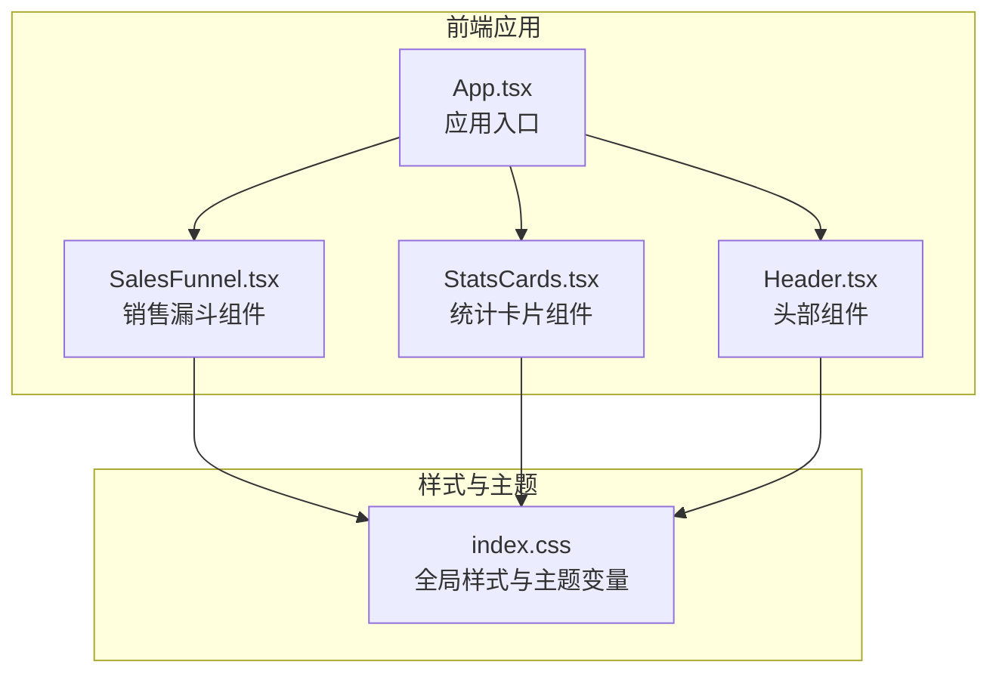
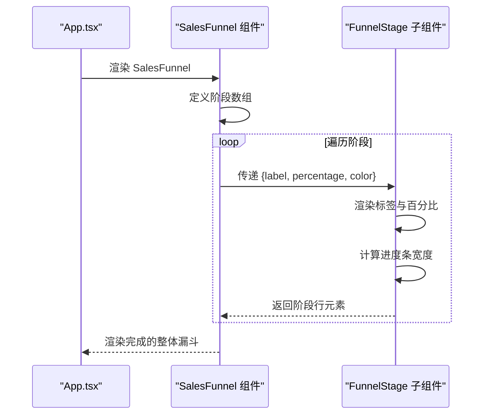
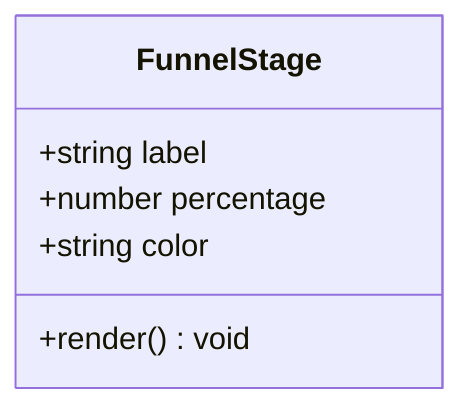
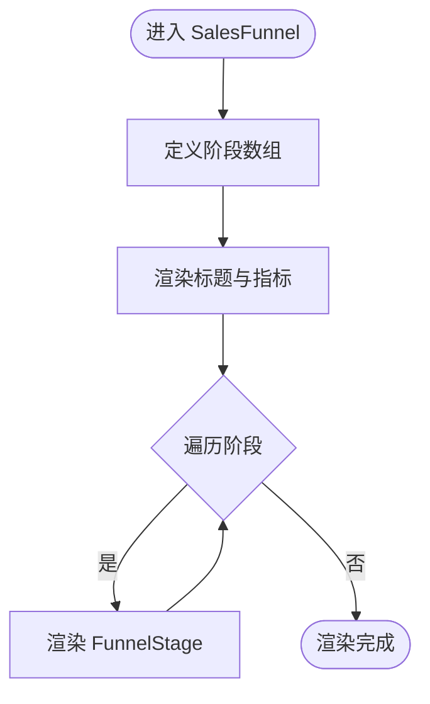
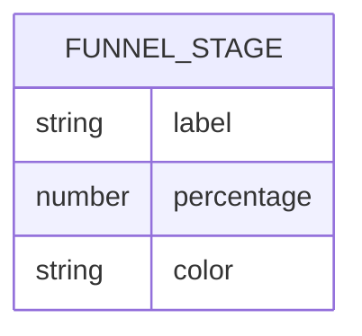
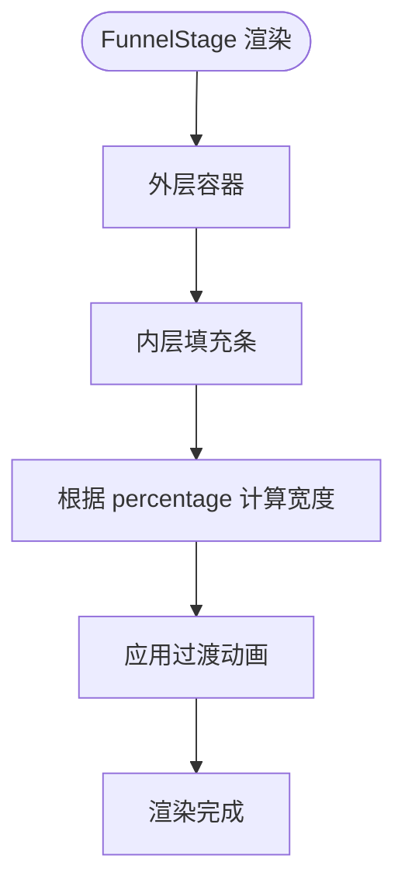
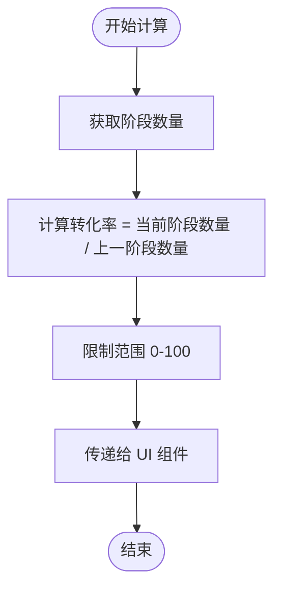
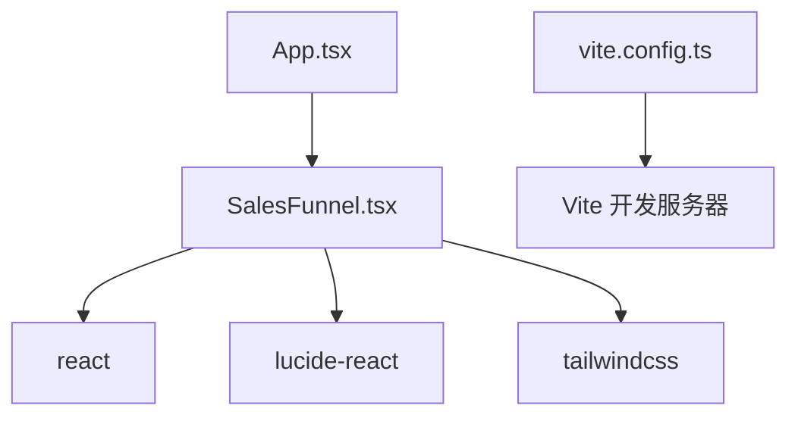

# 销售漏斗组件 (SalesFunnel)

<cite>
**本文引用的文件**
- [SalesFunnel.tsx](file://crm-frontend/src/components/SalesFunnel.tsx)
- [App.tsx](file://crm-frontend/src/App.tsx)
- [StatsCards.tsx](file://crm-frontend/src/components/StatsCards.tsx)
- [Header.tsx](file://crm-frontend/src/components/Header.tsx)
- [index.css](file://crm-frontend/src/index.css)
- [package.json](file://crm-frontend/package.json)
- [vite.config.ts](file://crm-frontend/vite.config.ts)
</cite>

## 目录
1. [简介](#简介)
2. [项目结构](#项目结构)
3. [核心组件](#核心组件)
4. [架构总览](#架构总览)
5. [详细组件分析](#详细组件分析)
6. [依赖关系分析](#依赖关系分析)
7. [性能考虑](#性能考虑)
8. [故障排除指南](#故障排除指南)
9. [结论](#结论)
10. [附录](#附录)

## 简介
本文件为销售AI CRM系统的 SalesFunnel（销售漏斗）组件提供完整的技术文档。该组件用于可视化展示销售流程的各个阶段及其转化情况，包括阶段标签、百分比进度条与颜色编码体系。文档涵盖组件的实现原理、数据流、交互逻辑、API 接口、配置选项、自定义样式方法、使用示例、数据格式要求以及扩展开发指南。

## 项目结构
SalesFunnel 组件位于前端工程的组件目录中，采用函数式组件与 TypeScript 实现，配合 TailwindCSS 进行样式管理。组件在应用主页面中被引入并渲染，作为仪表盘的一部分展示销售概览。

**图表来源**
- [App.tsx:10-55](file://crm-frontend/src/App.tsx#L10-L55)
- [SalesFunnel.tsx:29-63](file://crm-frontend/src/components/SalesFunnel.tsx#L29-L63)
- [StatsCards.tsx:35-78](file://crm-frontend/src/components/StatsCards.tsx#L35-L78)
- [Header.tsx:3-49](file://crm-frontend/src/components/Header.tsx#L3-L49)
- [index.css:1-66](file://crm-frontend/src/index.css#L1-L66)

**章节来源**
- [App.tsx:10-55](file://crm-frontend/src/App.tsx#L10-L55)
- [SalesFunnel.tsx:29-63](file://crm-frontend/src/components/SalesFunnel.tsx#L29-L63)
- [index.css:1-66](file://crm-frontend/src/index.css#L1-L66)

## 核心组件
SalesFunnel 组件由两个主要部分组成：
- FunnelStage 子组件：负责单个漏斗阶段的渲染，包括阶段名称、百分比数值与进度条。
- SalesFunnel 主组件：负责整体布局、标题、指标展示与阶段列表渲染。

组件通过一个阶段数组进行数据驱动渲染，每个阶段对象包含标签、百分比与颜色类名三项属性。

**章节来源**
- [SalesFunnel.tsx:3-27](file://crm-frontend/src/components/SalesFunnel.tsx#L3-L27)
- [SalesFunnel.tsx:29-63](file://crm-frontend/src/components/SalesFunnel.tsx#L29-L63)

## 架构总览
SalesFunnel 的数据流从主组件的阶段数组开始，逐项传递给 FunnelStage 子组件，子组件根据传入的百分比与颜色类名渲染进度条宽度与配色。主组件还负责顶部标题、指标与趋势展示区域的渲染。

**图表来源**
- [App.tsx:34-35](file://crm-frontend/src/App.tsx#L34-L35)
- [SalesFunnel.tsx:29-63](file://crm-frontend/src/components/SalesFunnel.tsx#L29-L63)
- [SalesFunnel.tsx:57-59](file://crm-frontend/src/components/SalesFunnel.tsx#L57-L59)

## 详细组件分析

### FunnelStage 子组件
FunnelStage 负责单个漏斗阶段的 UI 渲染，接收以下属性：
- label：阶段名称（字符串）
- percentage：阶段转化百分比（数字）
- color：颜色类名（字符串）

渲染内容包括：
- 左侧圆点徽标与阶段名称
- 右侧百分比数值
- 进度条容器与填充条，宽度由百分比决定

进度条具备过渡动画效果，以提升视觉体验。

**图表来源**
- [SalesFunnel.tsx:3-27](file://crm-frontend/src/components/SalesFunnel.tsx#L3-L27)

**章节来源**
- [SalesFunnel.tsx:9-27](file://crm-frontend/src/components/SalesFunnel.tsx#L9-L27)

### SalesFunnel 主组件
SalesFunnel 主组件负责整体布局与数据准备：
- 定义阶段数组，包含多个阶段对象
- 渲染标题与指标区域（含趋势图标与数值）
- 遍历阶段数组，将每个阶段渲染为 FunnelStage 子组件

阶段数组当前硬编码了五个典型销售阶段，分别对应不同的颜色类名，便于快速区分各阶段状态。

**图表来源**
- [SalesFunnel.tsx:29-63](file://crm-frontend/src/components/SalesFunnel.tsx#L29-L63)

**章节来源**
- [SalesFunnel.tsx:29-63](file://crm-frontend/src/components/SalesFunnel.tsx#L29-L63)

### 数据模型与类型定义
组件使用 TypeScript 接口定义阶段属性，确保类型安全与可维护性。

**图表来源**
- [SalesFunnel.tsx:3-7](file://crm-frontend/src/components/SalesFunnel.tsx#L3-L7)

**章节来源**
- [SalesFunnel.tsx:3-7](file://crm-frontend/src/components/SalesFunnel.tsx#L3-L7)

### 颜色编码系统
组件通过颜色类名对不同阶段进行视觉编码，当前使用如下颜色类：
- bg-primary-500
- bg-cyan-500
- bg-violet-500
- bg-amber-500
- bg-emerald-500

这些类名依赖 TailwindCSS 的颜色系统，可在主题中进行统一调整。

**章节来源**
- [SalesFunnel.tsx:30-36](file://crm-frontend/src/components/SalesFunnel.tsx#L30-L36)

### 进度条绘制技术
进度条采用 HTML 结构与内联样式的组合：
- 外层容器提供背景与圆角
- 内层填充条根据 percentage 动态设置宽度
- 使用过渡动画使宽度变化更平滑

**图表来源**
- [SalesFunnel.tsx:18-23](file://crm-frontend/src/components/SalesFunnel.tsx#L18-L23)

**章节来源**
- [SalesFunnel.tsx:18-23](file://crm-frontend/src/components/SalesFunnel.tsx#L18-L23)

### 转化率计算算法
当前组件中的百分比值为硬编码数据，未包含动态计算逻辑。若需实现动态转化率计算，建议在父组件或外部数据源中计算每个阶段的转化率，再传递给 SalesFunnel 组件。

[此图为概念性流程图，不直接映射到具体源码文件]

## 依赖关系分析
SalesFunnel 组件的运行依赖于以下外部库与工具：
- React：组件框架
- lucide-react：图标库
- TailwindCSS：原子化样式系统
- Vite：构建与开发服务器

**图表来源**
- [SalesFunnel.tsx:1](file://crm-frontend/src/components/SalesFunnel.tsx#L1)
- [package.json:12-17](file://crm-frontend/package.json#L12-L17)
- [vite.config.ts:1-8](file://crm-frontend/vite.config.ts#L1-L8)

**章节来源**
- [package.json:12-17](file://crm-frontend/package.json#L12-L17)
- [vite.config.ts:1-8](file://crm-frontend/vite.config.ts#L1-L8)

## 性能考虑
- 列表渲染：使用 map 遍历阶段数组，保持键值稳定（索引）即可满足基本需求。
- 进度条动画：过渡动画时长固定，避免过度复杂的动画影响性能。
- 样式复用：通过 Tailwind 类名减少自定义 CSS 数量，提高样式编译效率。

[本节为通用性能建议，不直接分析具体文件]

## 故障排除指南
- 图标显示异常：确认 lucide-react 版本与导入路径正确。
- 颜色类名无效：检查 TailwindCSS 配置是否包含所需颜色类，或在主题中添加自定义颜色。
- 进度条不显示：确认 percentage 值在 0-100 范围内，且容器宽度设置正确。
- 样式冲突：检查全局样式与组件局部样式的优先级，必要时使用更具体的选择器或层叠规则。

**章节来源**
- [SalesFunnel.tsx:18-23](file://crm-frontend/src/components/SalesFunnel.tsx#L18-L23)
- [index.css:1-66](file://crm-frontend/src/index.css#L1-L66)

## 结论
SalesFunnel 组件通过清晰的数据驱动结构与简洁的 UI 设计，实现了销售漏斗的可视化展示。其模块化设计便于扩展与定制，建议在实际业务场景中结合外部数据源实现动态转化率计算，并通过主题系统统一管理颜色与样式。

## 附录

### 组件 API 接口与配置选项
- FunnelStageProps
  - label: string —— 阶段名称
  - percentage: number —— 转化百分比（0-100）
  - color: string —— 颜色类名（如 bg-primary-500）

- SalesFunnel
  - 无外部 props，内部维护阶段数组
  - 支持通过修改阶段数组实现不同业务场景的漏斗配置

**章节来源**
- [SalesFunnel.tsx:3-7](file://crm-frontend/src/components/SalesFunnel.tsx#L3-L7)
- [SalesFunnel.tsx:29-36](file://crm-frontend/src/components/SalesFunnel.tsx#L29-L36)

### 自定义样式方法
- 颜色系统：通过 TailwindCSS 的颜色类名控制阶段颜色；可在主题中添加自定义颜色变量。
- 进度条样式：可通过修改容器与填充条的类名或内联样式调整尺寸与动画。
- 布局样式：通过外层容器类名控制边框、阴影、圆角等外观。

**章节来源**
- [SalesFunnel.tsx:18-23](file://crm-frontend/src/components/SalesFunnel.tsx#L18-L23)
- [index.css:1-15](file://crm-frontend/src/index.css#L1-L15)

### 使用示例
- 在应用中引入 SalesFunnel 并放置在合适的位置（如仪表盘网格布局中）。
- 如需自定义阶段，请修改 SalesFunnel 中的阶段数组，确保每项包含 label、percentage、color 字段。

**章节来源**
- [App.tsx:34-35](file://crm-frontend/src/App.tsx#L34-L35)
- [SalesFunnel.tsx:30-36](file://crm-frontend/src/components/SalesFunnel.tsx#L30-L36)

### 数据格式要求
- 阶段数组应为对象数组，对象包含以下字段：
  - label: string
  - percentage: number（0-100）
  - color: string（TailwindCSS 颜色类名）

**章节来源**
- [SalesFunnel.tsx:30-36](file://crm-frontend/src/components/SalesFunnel.tsx#L30-L36)

### 扩展开发指南
- 动态数据源：在父组件中从后端 API 获取阶段数据，计算转化率后再传递给 SalesFunnel。
- 交互增强：为阶段添加点击事件或悬停提示，展示更详细的统计信息。
- 主题适配：通过主题变量统一管理颜色与字体，确保跨组件一致性。
- 响应式优化：在小屏设备上调整布局与字体大小，保证可读性。

**章节来源**
- [SalesFunnel.tsx:29-63](file://crm-frontend/src/components/SalesFunnel.tsx#L29-L63)
- [index.css:1-66](file://crm-frontend/src/index.css#L1-L66)