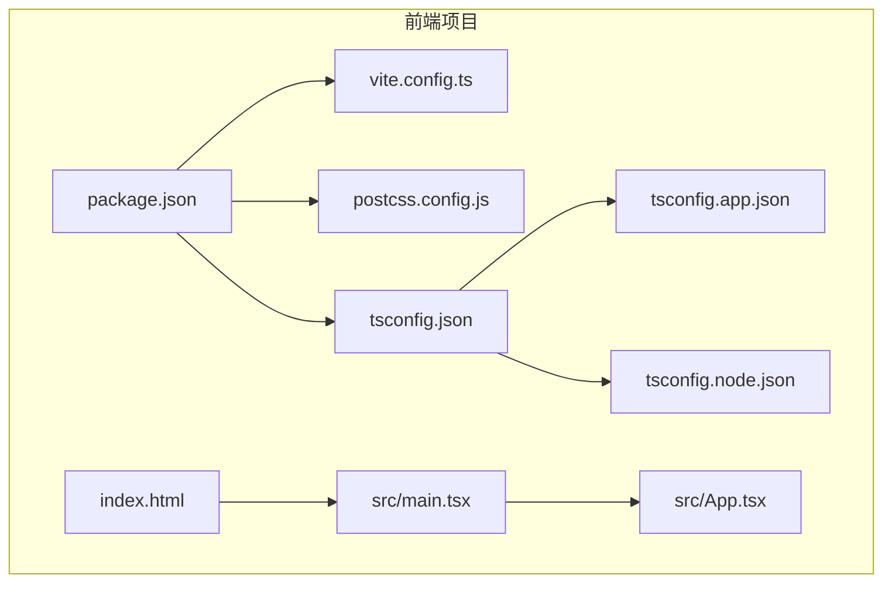
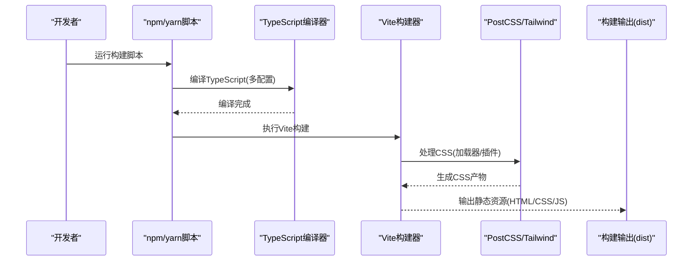
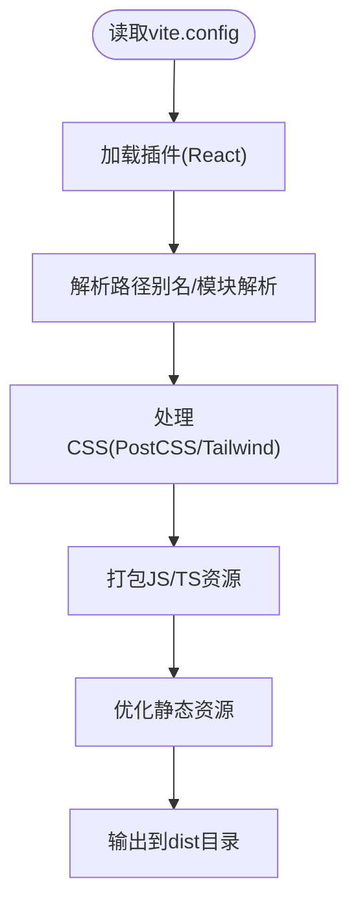
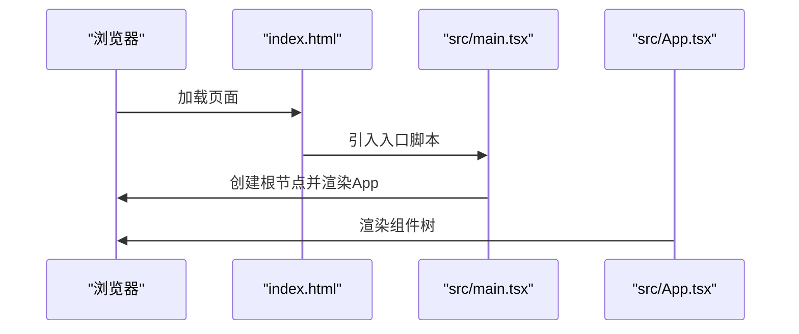
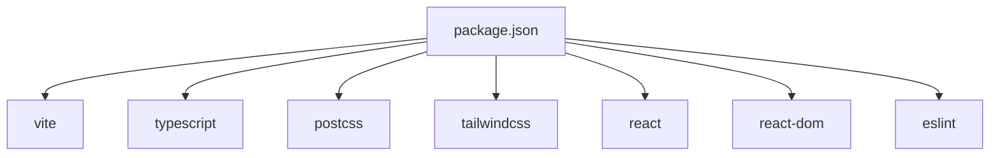

# 部署指南

<cite>
**本文档引用的文件**
- [vite.config.ts](file://crm-frontend/vite.config.ts)
- [package.json](file://crm-frontend/package.json)
- [postcss.config.js](file://crm-frontend/postcss.config.js)
- [tsconfig.json](file://crm-frontend/tsconfig.json)
- [tsconfig.app.json](file://crm-frontend/tsconfig.app.json)
- [tsconfig.node.json](file://crm-frontend/tsconfig.node.json)
- [index.html](file://crm-frontend/index.html)
- [src/main.tsx](file://crm-frontend/src/main.tsx)
- [src/App.tsx](file://crm-frontend/src/App.tsx)
</cite>

## 目录
1. [简介](#简介)
2. [项目结构](#项目结构)
3. [核心组件](#核心组件)
4. [架构概览](#架构概览)
5. [详细组件分析](#详细组件分析)
6. [依赖分析](#依赖分析)
7. [性能考虑](#性能考虑)
8. [故障排除指南](#故障排除指南)
9. [结论](#结论)
10. [附录](#附录)

## 简介
本指南面向销售AI CRM前端应用的生产环境部署，涵盖Vite构建配置优化、静态资源处理、多平台部署方案（静态托管、Docker容器化、CI/CD流水线）、环境变量与敏感信息管理、性能优化策略（代码分割、资源压缩、缓存）以及域名配置、SSL证书与HTTPS重定向等运维要点。文档基于仓库中现有的构建配置文件进行分析，并提供可操作的部署建议。

## 项目结构
前端项目采用Vite + React + TypeScript技术栈，使用Tailwind CSS进行样式处理。核心目录与文件如下：
- 构建配置：vite.config.ts、package.json、postcss.config.js
- 类型配置：tsconfig.json、tsconfig.app.json、tsconfig.node.json
- 入口页面：index.html
- 应用入口：src/main.tsx、src/App.tsx
- 组件模块：src/components/*（如AIAudioAnalysis、AIBanner、DailySchedule、Header、MapMiniView、SalesFunnel、Sidebar、StatsCards）



**图表来源**
- [vite.config.ts:1-8](file://crm-frontend/vite.config.ts#L1-L8)
- [package.json:1-36](file://crm-frontend/package.json#L1-L36)
- [postcss.config.js:1-6](file://crm-frontend/postcss.config.js#L1-L6)
- [tsconfig.json:1-8](file://crm-frontend/tsconfig.json#L1-L8)
- [tsconfig.app.json:1-29](file://crm-frontend/tsconfig.app.json#L1-L29)
- [tsconfig.node.json:1-27](file://crm-frontend/tsconfig.node.json#L1-L27)
- [index.html:1-14](file://crm-frontend/index.html#L1-L14)
- [src/main.tsx:1-11](file://crm-frontend/src/main.tsx#L1-L11)
- [src/App.tsx:1-58](file://crm-frontend/src/App.tsx#L1-L58)

**章节来源**
- [vite.config.ts:1-8](file://crm-frontend/vite.config.ts#L1-L8)
- [package.json:1-36](file://crm-frontend/package.json#L1-L36)
- [postcss.config.js:1-6](file://crm-frontend/postcss.config.js#L1-L6)
- [tsconfig.json:1-8](file://crm-frontend/tsconfig.json#L1-L8)
- [tsconfig.app.json:1-29](file://crm-frontend/tsconfig.app.json#L1-L29)
- [tsconfig.node.json:1-27](file://crm-frontend/tsconfig.node.json#L1-L27)
- [index.html:1-14](file://crm-frontend/index.html#L1-L14)
- [src/main.tsx:1-11](file://crm-frontend/src/main.tsx#L1-L11)
- [src/App.tsx:1-58](file://crm-frontend/src/App.tsx#L1-L58)

## 核心组件
- Vite构建配置：定义React插件，作为生产构建的基础。
- 包管理与脚本：提供开发、构建、预览、代码检查等命令。
- PostCSS配置：集成Tailwind CSS后处理器。
- TypeScript配置：分拆应用与Node工具链的编译选项，启用Bundler模式与严格类型检查。
- 应用入口：React根节点挂载与应用组件渲染。
- 页面模板：HTML模板包含基础meta标签、图标与根容器。

**章节来源**
- [vite.config.ts:1-8](file://crm-frontend/vite.config.ts#L1-L8)
- [package.json:6-11](file://crm-frontend/package.json#L6-L11)
- [postcss.config.js:1-6](file://crm-frontend/postcss.config.js#L1-L6)
- [tsconfig.app.json:11-17](file://crm-frontend/tsconfig.app.json#L11-L17)
- [src/main.tsx:1-11](file://crm-frontend/src/main.tsx#L1-L11)
- [index.html:1-14](file://crm-frontend/index.html#L1-L14)

## 架构概览
下图展示从源码到生产构建产物的关键流程，包括TypeScript编译、Vite打包、PostCSS处理与静态资源生成。



**图表来源**
- [package.json:8](file://crm-frontend/package.json#L8)
- [tsconfig.app.json:11-17](file://crm-frontend/tsconfig.app.json#L11-L17)
- [postcss.config.js:1-6](file://crm-frontend/postcss.config.js#L1-L6)
- [vite.config.ts:5-7](file://crm-frontend/vite.config.ts#L5-L7)

## 详细组件分析

### Vite构建配置分析
- 插件体系：当前仅启用React插件，适合以React为主的单页应用。
- 生产优化：可通过扩展Vite配置实现代码分割、资源压缩、动态导入等优化。
- 静态资源：默认将public目录下的静态资源原样复制到输出目录；可在Vite中配置别名与资源处理规则。



**图表来源**
- [vite.config.ts:1-8](file://crm-frontend/vite.config.ts#L1-L8)
- [postcss.config.js:1-6](file://crm-frontend/postcss.config.js#L1-L6)

**章节来源**
- [vite.config.ts:1-8](file://crm-frontend/vite.config.ts#L1-L8)

### TypeScript配置分析
- 分层配置：通过根tsconfig.json聚合应用与Node工具链配置，提升维护性。
- 应用配置：启用Bundler模式、严格类型检查、JSX转换为react-jsx，适配现代打包器。
- 工具链配置：Node侧配置聚焦于类型与模块解析，避免污染应用构建。

```mermaid
classDiagram
class RootTSConfig {
+files : []
+references : [{path}]
}
class AppTSConfig {
+compilerOptions.target
+compilerOptions.moduleResolution
+compilerOptions.jsx
+compilerOptions.strict
}
class NodeTSConfig {
+compilerOptions.types
+compilerOptions.moduleResolution
+compilerOptions.skipLibCheck
}
RootTSConfig --> AppTSConfig : "包含"
RootTSConfig --> NodeTSConfig : "包含"
```

**图表来源**
- [tsconfig.json:1-8](file://crm-frontend/tsconfig.json#L1-L8)
- [tsconfig.app.json:1-29](file://crm-frontend/tsconfig.app.json#L1-L29)
- [tsconfig.node.json:1-27](file://crm-frontend/tsconfig.node.json#L1-L27)

**章节来源**
- [tsconfig.json:1-8](file://crm-frontend/tsconfig.json#L1-L8)
- [tsconfig.app.json:11-25](file://crm-frontend/tsconfig.app.json#L11-L25)
- [tsconfig.node.json:10-15](file://crm-frontend/tsconfig.node.json#L10-L15)

### 应用入口与页面模板
- 页面模板：包含基础meta、图标与根容器，确保React应用正确挂载。
- 应用入口：创建根节点并渲染App组件，遵循React 18并发特性。
- 组件组织：App组件采用网格布局，整合多个业务组件，便于按需加载与懒加载优化。



**图表来源**
- [index.html:1-14](file://crm-frontend/index.html#L1-L14)
- [src/main.tsx:1-11](file://crm-frontend/src/main.tsx#L1-L11)
- [src/App.tsx:1-58](file://crm-frontend/src/App.tsx#L1-L58)

**章节来源**
- [index.html:1-14](file://crm-frontend/index.html#L1-L14)
- [src/main.tsx:1-11](file://crm-frontend/src/main.tsx#L1-L11)
- [src/App.tsx:1-58](file://crm-frontend/src/App.tsx#L1-L58)

## 依赖分析
- 构建工具链：Vite、TypeScript、PostCSS、Tailwind CSS。
- 运行时依赖：React、React DOM、Lucide React图标库。
- 开发依赖：ESLint、TypeScript ESLint、React Hooks/Refresh插件、Autoprefixer等。



**图表来源**
- [package.json:12-34](file://crm-frontend/package.json#L12-L34)

**章节来源**
- [package.json:12-34](file://crm-frontend/package.json#L12-L34)

## 性能考虑
- 代码分割：在路由或大型组件处使用动态导入，结合Vite的动态导入语法实现按需加载。
- 资源压缩：生产构建默认启用JS/CSS压缩；可进一步配置图片压缩与字体优化。
- 缓存策略：通过Vite的产物命名哈希与HTTP缓存头配合，实现长期缓存与失效控制。
- Tailwind优化：在生产环境移除未使用样式，确保CSS体积最小化。
- 预加载与预连接：对关键资源使用preload/prefetch，缩短首屏时间。

[本节为通用性能指导，不直接分析具体文件，故无“章节来源”]

## 故障排除指南
- 构建失败排查
  - 检查TypeScript配置是否正确引用子配置文件。
  - 确认Vite插件安装与版本兼容性。
  - 验证PostCSS/Tailwind插件是否正确加载。
- 运行时问题
  - 确认index.html中的根容器与入口脚本路径正确。
  - 检查React应用是否在main.tsx中正确挂载。
- 静态资源问题
  - 确保public目录下的静态资源路径正确，避免相对路径错误导致资源404。
- 浏览器兼容性
  - 检查目标环境的ES特性支持，必要时调整tsconfig目标与polyfill。

**章节来源**
- [tsconfig.json:3-6](file://crm-frontend/tsconfig.json#L3-L6)
- [vite.config.ts:5-7](file://crm-frontend/vite.config.ts#L5-L7)
- [postcss.config.js:1-6](file://crm-frontend/postcss.config.js#L1-L6)
- [index.html:10-12](file://crm-frontend/index.html#L10-L12)
- [src/main.tsx:6-10](file://crm-frontend/src/main.tsx#L6-L10)

## 结论
本指南基于现有配置文件梳理了销售AI CRM前端的构建与部署要点。建议在生产环境中完善Vite优化配置、明确静态资源处理策略、制定多平台部署方案与CI/CD流水线，并建立完善的环境变量与安全策略。后续可根据业务增长逐步引入服务端渲染、渐进式Web应用(PWA)等高级特性。

[本节为总结性内容，不直接分析具体文件，故无“章节来源”]

## 附录

### A. 生产环境构建与优化建议
- Vite生产优化
  - 启用代码分割与动态导入，减少首屏包体。
  - 配置资源压缩与产物哈希命名，提升缓存命中率。
  - 使用外部化策略排除不常变更的依赖，降低重复下载。
- CSS优化
  - 在生产环境移除未使用样式，确保Tailwind输出精简。
  - 合理拆分CSS，避免单文件过大影响加载性能。
- JavaScript优化
  - 使用Tree Shaking清理未使用代码。
  - 对第三方库进行按需引入，避免全量打包。

[本节为通用优化建议，不直接分析具体文件，故无“章节来源”]

### B. 部署方案概览
- 静态托管平台
  - 将构建产物上传至平台的静态存储，配置CNAME与HTTPS。
  - 建议开启Gzip/Brotli压缩与CDN加速。
- Docker容器化部署
  - 使用Nginx或Caddy作为反向代理，映射静态文件目录。
  - 容器内仅运行Nginx，减少运行时复杂度。
- CI/CD流水线
  - 触发条件：分支保护、PR合并、标签发布。
  - 步骤：安装依赖、执行测试、构建产物、推送镜像/静态文件、健康检查。

[本节为通用部署方案，不直接分析具体文件，故无“章节来源”]

### C. 环境变量与敏感信息管理
- 环境变量
  - 使用以特定前缀命名的变量区分构建期与运行期配置。
  - 在CI/CD中注入密钥与令牌，避免硬编码在源码中。
- 敏感信息
  - 不将API密钥、数据库密码等提交到版本库。
  - 使用平台提供的密钥管理服务或加密存储。

[本节为通用安全实践，不直接分析具体文件，故无“章节来源”]

### D. 域名配置、SSL证书与HTTPS重定向
- 域名与DNS
  - 配置CNAME指向托管平台或服务器IP。
  - 设置TXT记录用于域名所有权验证。
- SSL证书
  - 使用ACME协议自动签发与续期证书。
  - 或在托管平台启用免费证书服务。
- HTTPS重定向
  - 在反向代理或托管平台配置301/308重定向至HTTPS。
  - 启用HSTS以增强安全性。

[本节为通用运维实践，不直接分析具体文件，故无“章节来源”]

### E. 部署后验证步骤
- 功能验证
  - 核对页面加载、交互响应与组件渲染。
  - 检查关键业务流程（如登录、数据展示）。
- 性能验证
  - 使用浏览器开发者工具查看资源加载与网络面板。
  - 关注首屏时间、TTFB、资源大小与缓存命中率。
- 安全验证
  - 检查HTTPS证书有效性与HSTS头。
  - 确认CSP、X-Frame-Options等安全头已正确设置。

[本节为通用验证流程，不直接分析具体文件，故无“章节来源”]