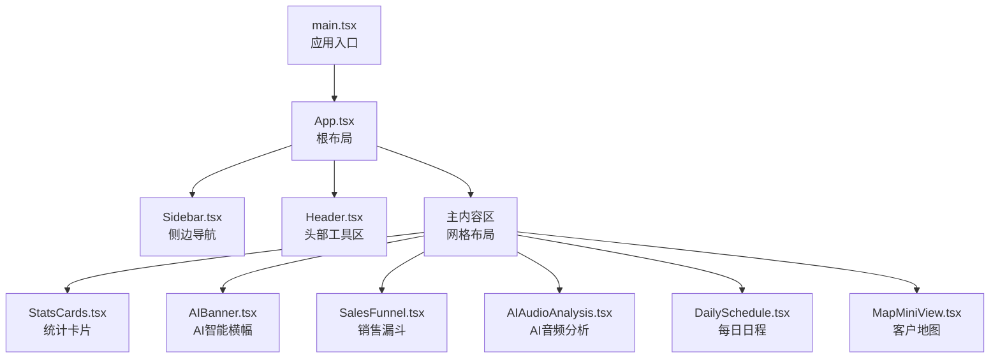
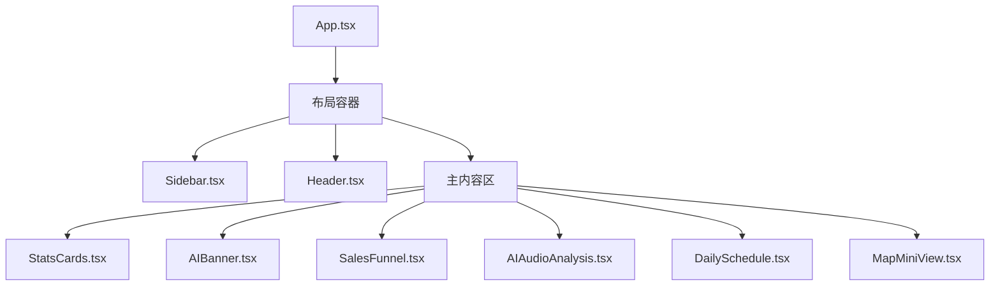
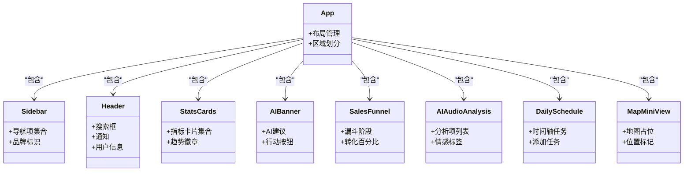
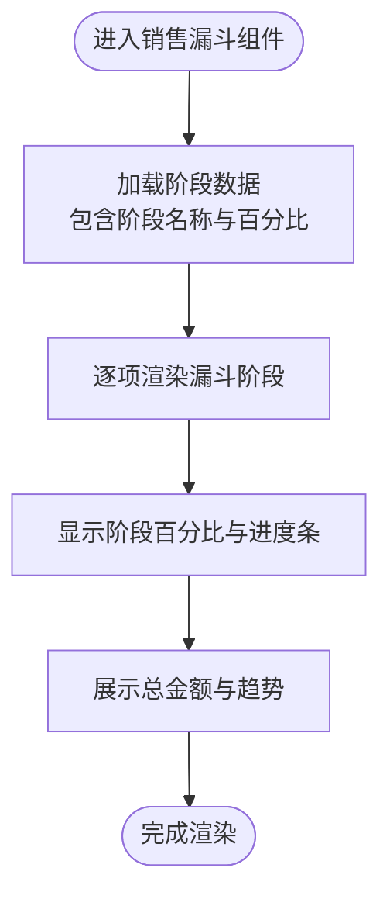
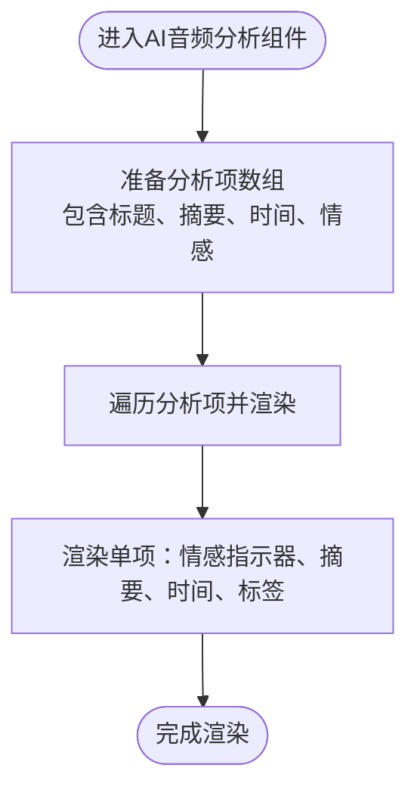
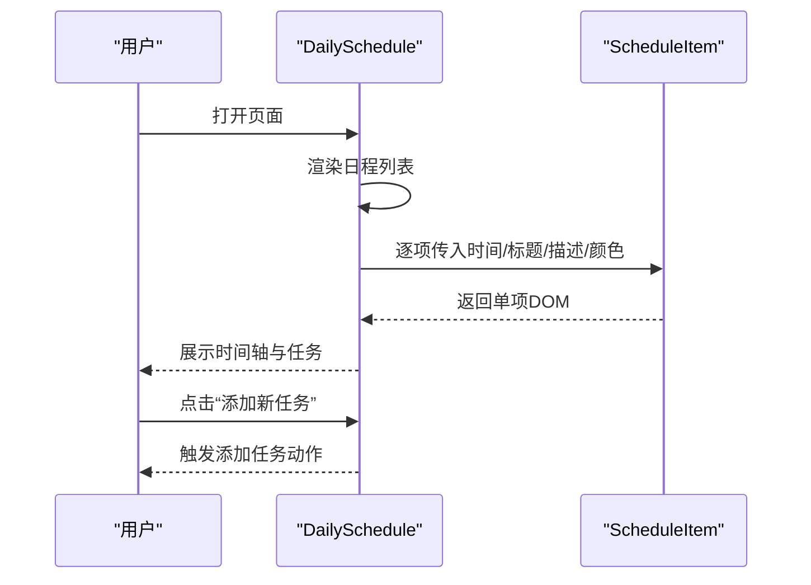
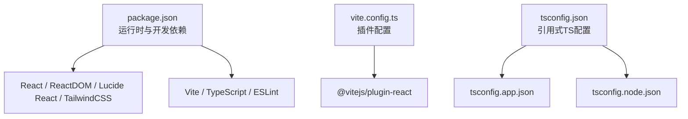

# 项目概述

<cite>
**本文档引用的文件**
- [README.md](file://crm-frontend/README.md)
- [package.json](file://crm-frontend/package.json)
- [tsconfig.json](file://crm-frontend/tsconfig.json)
- [vite.config.ts](file://crm-frontend/vite.config.ts)
- [src/App.tsx](file://crm-frontend/src/App.tsx)
- [src/main.tsx](file://crm-frontend/src/main.tsx)
- [src/components/Header.tsx](file://crm-frontend/src/components/Header.tsx)
- [src/components/Sidebar.tsx](file://crm-frontend/src/components/Sidebar.tsx)
- [src/components/StatsCards.tsx](file://crm-frontend/src/components/StatsCards.tsx)
- [src/components/AIBanner.tsx](file://crm-frontend/src/components/AIBanner.tsx)
- [src/components/SalesFunnel.tsx](file://crm-frontend/src/components/SalesFunnel.tsx)
- [src/components/AIAudioAnalysis.tsx](file://crm-frontend/src/components/AIAudioAnalysis.tsx)
- [src/components/DailySchedule.tsx](file://crm-frontend/src/components/DailySchedule.tsx)
- [src/components/MapMiniView.tsx](file://crm-frontend/src/components/MapMiniView.tsx)
</cite>

## 目录
1. [引言](#引言)
2. [项目结构](#项目结构)
3. [核心组件](#核心组件)
4. [架构总览](#架构总览)
5. [详细组件分析](#详细组件分析)
6. [依赖关系分析](#依赖关系分析)
7. [性能考虑](#性能考虑)
8. [故障排除指南](#故障排除指南)
9. [结论](#结论)
10. [附录](#附录)

## 引言
本项目是一个基于前端技术栈构建的销售AI CRM系统原型，旨在通过AI驱动的能力提升销售效率与洞察力。系统围绕“智能客户沟通分析”、“销售漏斗可视化”和“智能日程管理”三大核心能力展开，帮助销售管理者与一线销售人员实现更高效、数据驱动的客户关系管理。

- 核心目标：以AI增强销售流程，提供实时洞察与行动建议，优化销售转化路径与时间分配。
- 主要特性：
  - 智能客户沟通分析：对通话/会议音频进行情感与要点分析，输出可执行的跟进建议。
  - 销售漏斗可视化：以直观的漏斗图展示各阶段转化率与金额，支持趋势对比。
  - 智能日程管理：以时间轴形式呈现当日任务，支持快速添加与优先级提示。
  - 客户地图与仪表盘：提供关键指标卡片与地理分布视图，辅助销售决策。
- 技术优势：采用React + TypeScript + Vite组合，具备现代化开发体验；TailwindCSS提供一致的UI风格；组件化设计便于扩展与维护。

## 项目结构
前端采用单页应用（SPA）架构，入口为 main.tsx，根组件 App.tsx 负责布局与区域划分。页面由侧边栏导航、头部工具区、主内容区组成，主内容区包含统计卡片、AI智能横幅、销售漏斗、AI音频分析、日程与地图等模块。

图表来源
- [src/main.tsx:1-11](file://crm-frontend/src/main.tsx#L1-L11)
- [src/App.tsx:1-58](file://crm-frontend/src/App.tsx#L1-L58)
- [src/components/Sidebar.tsx:1-86](file://crm-frontend/src/components/Sidebar.tsx#L1-L86)
- [src/components/Header.tsx:1-53](file://crm-frontend/src/components/Header.tsx#L1-L53)
- [src/components/StatsCards.tsx:1-81](file://crm-frontend/src/components/StatsCards.tsx#L1-L81)
- [src/components/AIBanner.tsx:1-47](file://crm-frontend/src/components/AIBanner.tsx#L1-L47)
- [src/components/SalesFunnel.tsx:1-66](file://crm-frontend/src/components/SalesFunnel.tsx#L1-L66)
- [src/components/AIAudioAnalysis.tsx:1-82](file://crm-frontend/src/components/AIAudioAnalysis.tsx#L1-L82)
- [src/components/DailySchedule.tsx:1-70](file://crm-frontend/src/components/DailySchedule.tsx#L1-L70)
- [src/components/MapMiniView.tsx:1-58](file://crm-frontend/src/components/MapMiniView.tsx#L1-L58)

章节来源
- [src/main.tsx:1-11](file://crm-frontend/src/main.tsx#L1-L11)
- [src/App.tsx:1-58](file://crm-frontend/src/App.tsx#L1-L58)

## 核心组件
- 统计卡片（StatsCards）：展示月度收入、活跃客户、管道金额、今日拜访等关键指标，支持趋势徽章与图标背景，便于快速掌握业务状态。
- AI智能横幅（AIBanner）：提供AI生成的跟进建议与行动按钮，强调“基于最近24小时意图模式”的推荐逻辑。
- 销售漏斗（SalesFunnel）：以百分比与进度条展示从“新线索”到“成交”的转化情况，并显示总量与环比趋势。
- AI音频分析（AIAudioAnalysis）：以列表形式呈现近期通话/会议的分析摘要、情感倾向与时间戳，帮助销售快速回顾与跟进。
- 每日日程（DailySchedule）：以时间轴方式列出当日任务，支持添加新任务，便于销售合理安排时间。
- 客户地图（MapMiniView）：以简易网格地图展示客户分布，突出“附近客户”数量，支持跳转全图视图。
- 侧边导航（Sidebar）：提供工作台、客户管理、销售漏斗、AI录音分析、智能日程、客户地图等入口，统一品牌色与交互风格。
- 头部工具区（Header）：包含搜索框、升级按钮、通知与用户信息，形成完整的操作上下文。

章节来源
- [src/components/StatsCards.tsx:1-81](file://crm-frontend/src/components/StatsCards.tsx#L1-L81)
- [src/components/AIBanner.tsx:1-47](file://crm-frontend/src/components/AIBanner.tsx#L1-L47)
- [src/components/SalesFunnel.tsx:1-66](file://crm-frontend/src/components/SalesFunnel.tsx#L1-L66)
- [src/components/AIAudioAnalysis.tsx:1-82](file://crm-frontend/src/components/AIAudioAnalysis.tsx#L1-L82)
- [src/components/DailySchedule.tsx:1-70](file://crm-frontend/src/components/DailySchedule.tsx#L1-L70)
- [src/components/MapMiniView.tsx:1-58](file://crm-frontend/src/components/MapMiniView.tsx#L1-L58)
- [src/components/Sidebar.tsx:1-86](file://crm-frontend/src/components/Sidebar.tsx#L1-L86)
- [src/components/Header.tsx:1-53](file://crm-frontend/src/components/Header.tsx#L1-L53)

## 架构总览
系统采用组件化前端架构，根组件负责页面布局与区域划分，子组件各自承担特定业务域的数据展示与交互。整体数据流自上而下传递，组件内部通过props与状态管理实现局部更新，避免不必要的重渲染。

图表来源
- [src/App.tsx:1-58](file://crm-frontend/src/App.tsx#L1-L58)
- [src/components/Sidebar.tsx:1-86](file://crm-frontend/src/components/Sidebar.tsx#L1-L86)
- [src/components/Header.tsx:1-53](file://crm-frontend/src/components/Header.tsx#L1-L53)
- [src/components/StatsCards.tsx:1-81](file://crm-frontend/src/components/StatsCards.tsx#L1-L81)
- [src/components/AIBanner.tsx:1-47](file://crm-frontend/src/components/AIBanner.tsx#L1-L47)
- [src/components/SalesFunnel.tsx:1-66](file://crm-frontend/src/components/SalesFunnel.tsx#L1-L66)
- [src/components/AIAudioAnalysis.tsx:1-82](file://crm-frontend/src/components/AIAudioAnalysis.tsx#L1-L82)
- [src/components/DailySchedule.tsx:1-70](file://crm-frontend/src/components/DailySchedule.tsx#L1-L70)
- [src/components/MapMiniView.tsx:1-58](file://crm-frontend/src/components/MapMiniView.tsx#L1-L58)

## 详细组件分析

### 组件类图（概览）

图表来源
- [src/App.tsx:1-58](file://crm-frontend/src/App.tsx#L1-L58)
- [src/components/Sidebar.tsx:1-86](file://crm-frontend/src/components/Sidebar.tsx#L1-L86)
- [src/components/Header.tsx:1-53](file://crm-frontend/src/components/Header.tsx#L1-L53)
- [src/components/StatsCards.tsx:1-81](file://crm-frontend/src/components/StatsCards.tsx#L1-L81)
- [src/components/AIBanner.tsx:1-47](file://crm-frontend/src/components/AIBanner.tsx#L1-L47)
- [src/components/SalesFunnel.tsx:1-66](file://crm-frontend/src/components/SalesFunnel.tsx#L1-L66)
- [src/components/AIAudioAnalysis.tsx:1-82](file://crm-frontend/src/components/AIAudioAnalysis.tsx#L1-L82)
- [src/components/DailySchedule.tsx:1-70](file://crm-frontend/src/components/DailySchedule.tsx#L1-L70)
- [src/components/MapMiniView.tsx:1-58](file://crm-frontend/src/components/MapMiniView.tsx#L1-L58)

### 销售漏斗可视化流程

图表来源
- [src/components/SalesFunnel.tsx:29-66](file://crm-frontend/src/components/SalesFunnel.tsx#L29-L66)

### AI音频分析处理流程

图表来源
- [src/components/AIAudioAnalysis.tsx:38-82](file://crm-frontend/src/components/AIAudioAnalysis.tsx#L38-L82)

### 智能日程管理时序

图表来源
- [src/components/DailySchedule.tsx:26-70](file://crm-frontend/src/components/DailySchedule.tsx#L26-L70)

## 依赖关系分析
- 运行时依赖：React 19、React DOM 19、Lucide React 图标库、TailwindCSS 4.2.1。
- 开发依赖：Vite 8、@vitejs/plugin-react、TypeScript ~5.9.3、ESLint 及相关插件。
- 配置文件：vite.config.ts 启用 React 插件；tsconfig.json 使用引用式配置拆分应用与节点环境。

图表来源
- [package.json:1-36](file://crm-frontend/package.json#L1-L36)
- [vite.config.ts:1-8](file://crm-frontend/vite.config.ts#L1-L8)
- [tsconfig.json:1-8](file://crm-frontend/tsconfig.json#L1-L8)

章节来源
- [package.json:1-36](file://crm-frontend/package.json#L1-L36)
- [vite.config.ts:1-8](file://crm-frontend/vite.config.ts#L1-L8)
- [tsconfig.json:1-8](file://crm-frontend/tsconfig.json#L1-L8)

## 性能考虑
- 组件拆分与懒加载：当前为静态布局，建议在路由层引入按需加载，减少首屏体积。
- 图标与样式：Lucide React 作为轻量图标库，建议结合Tree-shaking确保未使用图标不被打包。
- 构建优化：Vite 默认启用HMR与快速打包，建议开启生产环境压缩与资源内联策略。
- 数据渲染：列表渲染采用映射函数，建议为列表项提供稳定key值，避免重复渲染。
- UI框架：TailwindCSS 提供原子化样式，注意避免过度嵌套导致类名膨胀。

## 故障排除指南
- 页面空白或组件未渲染：检查 main.tsx 的根节点挂载是否正确，以及 App.tsx 是否导出默认组件。
- 样式异常：确认 TailwindCSS 已正确安装与引入，检查 PostCSS 与 Tailwind 配置文件是否存在。
- 构建失败：检查 package.json 中脚本命令与依赖版本兼容性，确保 TypeScript 类型检查通过。
- ESLint 报错：根据 README 中的类型感知规则配置，确保 tsconfig 路径指向正确。

章节来源
- [src/main.tsx:1-11](file://crm-frontend/src/main.tsx#L1-L11)
- [src/App.tsx:1-58](file://crm-frontend/src/App.tsx#L1-L58)
- [README.md:1-74](file://crm-frontend/README.md#L1-L74)

## 结论
本销售AI CRM系统通过AI智能横幅、销售漏斗、音频分析、日程与地图等模块，构建了面向销售场景的综合可视化界面。其组件化架构与现代前端技术栈为后续接入真实AI分析服务、后端API与数据库提供了清晰的扩展路径。建议在下一阶段完善路由与状态管理、接入后端接口、补充测试与部署流水线，以实现从原型到可用系统的跨越。

## 附录
- 术语对照
  - AI智能横幅：用于展示AI生成的跟进建议与行动按钮的横幅组件。
  - 销售漏斗：按阶段展示线索转化情况的可视化组件。
  - AI音频分析：对通话/会议内容进行情感与要点分析的列表组件。
  - 智能日程：以时间轴形式展示当日任务的组件。
  - 客户地图：展示客户地理分布的简易地图组件。
- 业务价值
  - 提升销售转化率：通过漏斗可视化与AI建议指导高价值客户跟进。
  - 优化时间分配：智能日程帮助销售聚焦高优先级任务。
  - 增强客户洞察：音频分析与地图视图提供多维度客户画像。
- 应用场景
  - 销售管理者：监控管道健康与团队绩效。
  - 销售代表：获取个性化跟进建议与日程提醒。
  - 客户经理：基于地图与客户分布规划拜访路线。