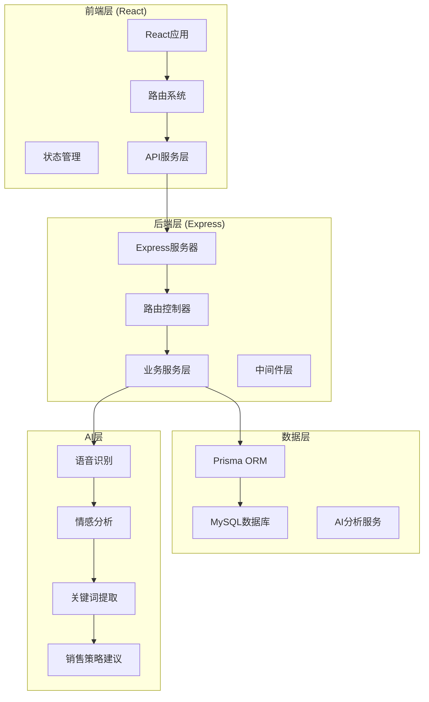
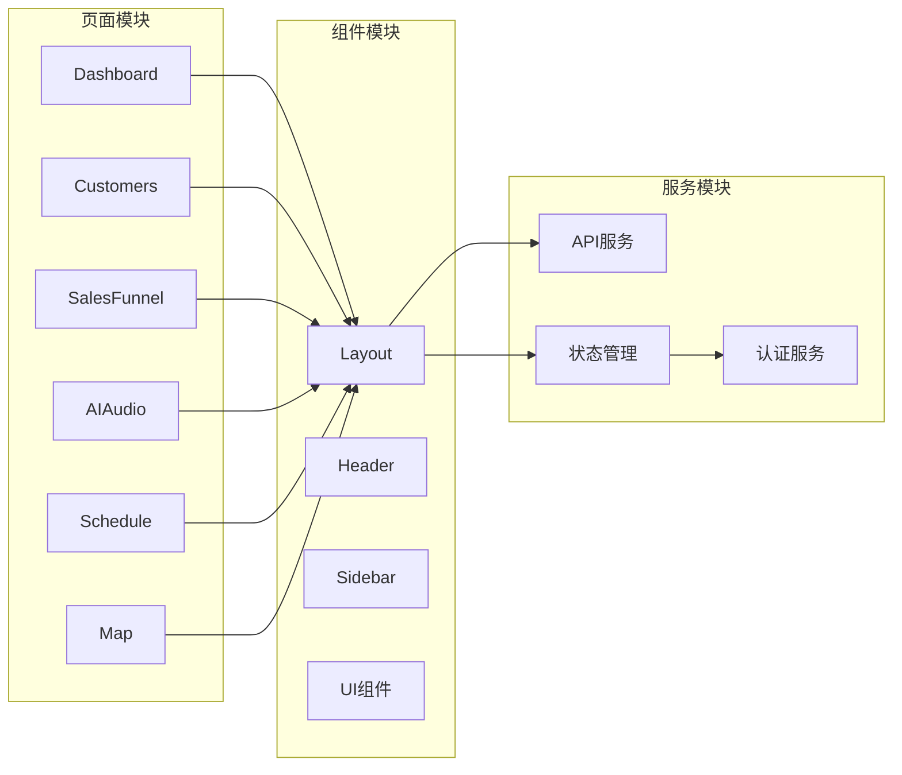
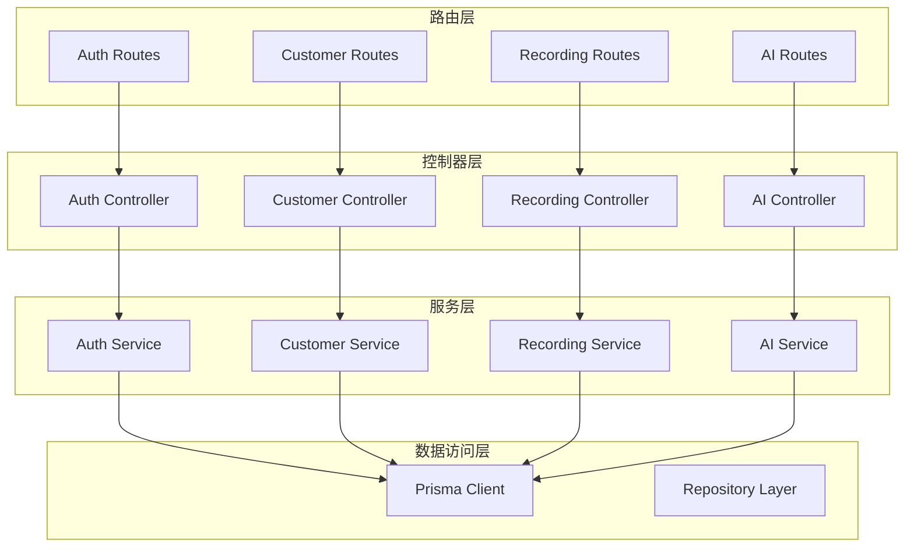
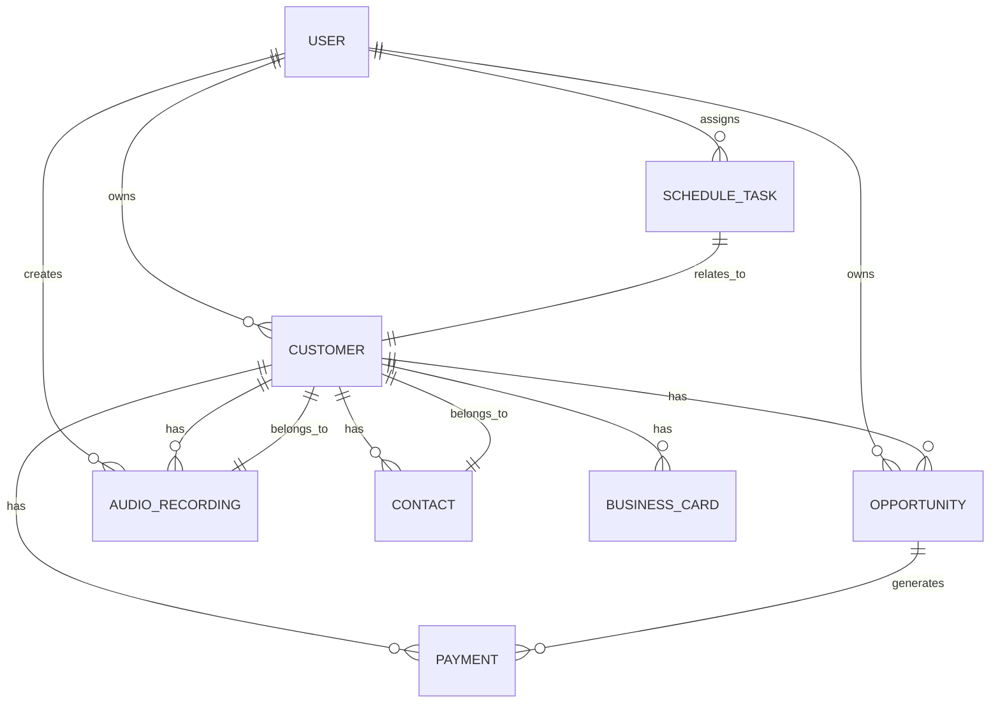
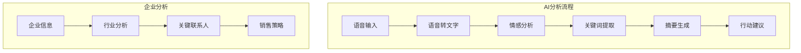
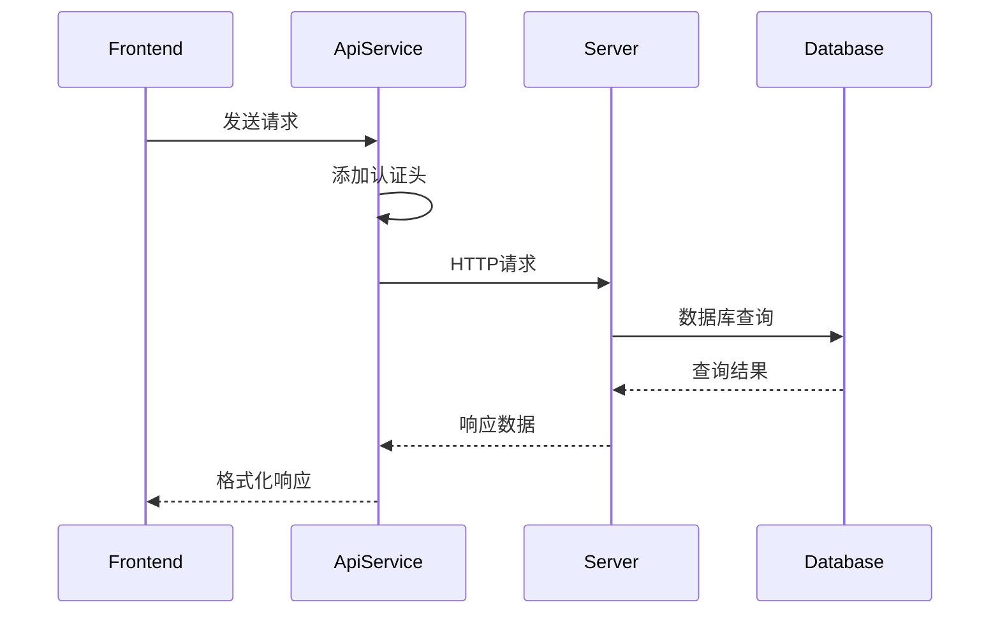
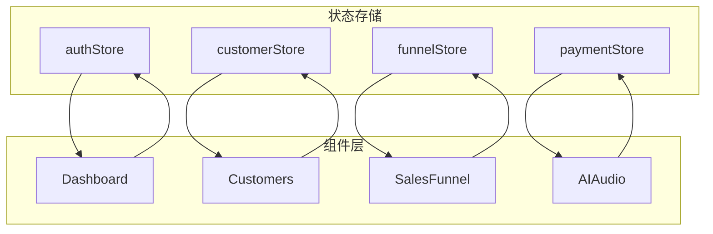
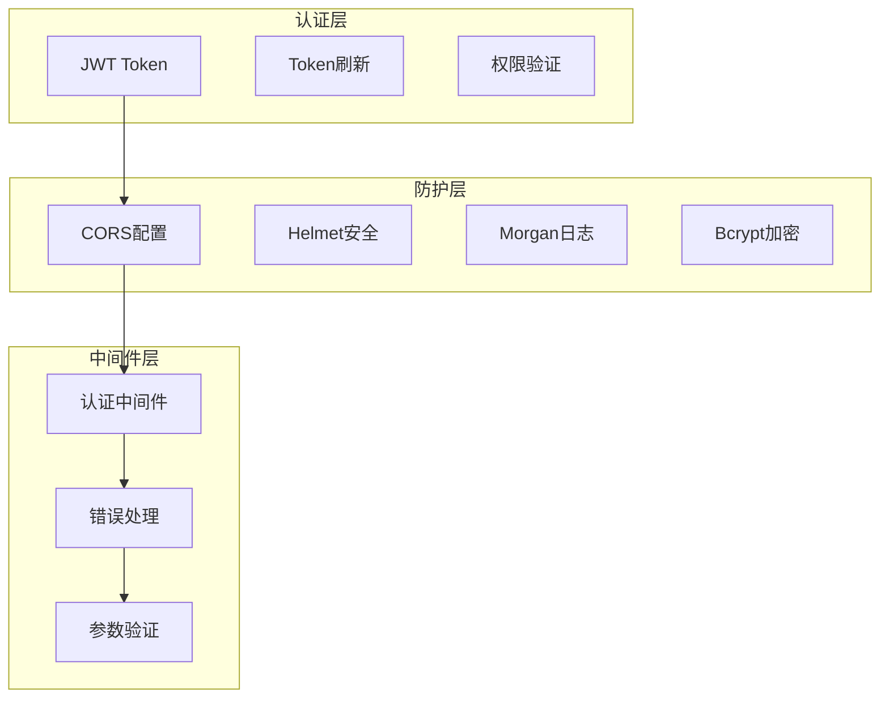
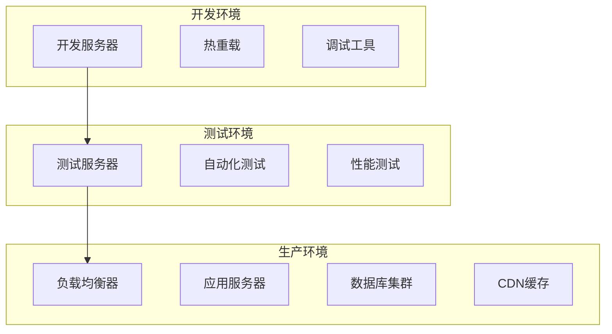

# 项目概述

<cite>
**本文档引用的文件**
- [package.json](file://crm-frontend/package.json)
- [package.json](file://crm-backend/package.json)
- [app.ts](file://crm-backend/src/app.ts)
- [schema.prisma](file://crm-backend/prisma/schema.prisma)
- [ai.service.ts](file://crm-backend/src/services/ai.service.ts)
- [api.ts](file://crm-frontend/src/services/api.ts)
- [App.tsx](file://crm-frontend/src/App.tsx)
- [Layout.tsx](file://crm-frontend/src/components/layout/Layout.tsx)
- [Dashboard/index.tsx](file://crm-frontend/src/pages/Dashboard/index.tsx)
- [recording.controller.ts](file://crm-backend/src/controllers/recording.controller.ts)
- [index.ts](file://crm-backend/src/config/index.ts)
- [index.ts](file://crm-backend/src/types/index.ts)
</cite>

## 更新摘要
**所做更改**
- 更新架构描述以反映完整的全栈架构
- 新增数据库设计和AI服务架构说明
- 更新前后端技术栈和依赖关系
- 新增API服务层和状态管理架构
- 更新项目结构和模块化设计

## 目录
1. [引言](#引言)
2. [项目架构](#项目架构)
3. [技术栈概览](#技术栈概览)
4. [核心模块分析](#核心模块分析)
5. [数据库设计](#数据库设计)
6. [AI服务架构](#ai服务架构)
7. [API服务层](#api服务层)
8. [状态管理](#状态管理)
9. [安全与配置](#安全与配置)
10. [开发与部署](#开发与部署)
11. [业务价值与收益](#业务价值与收益)
12. [总结](#总结)

## 引言
销售AI CRM系统是一个基于现代全栈架构构建的企业级客户关系管理系统。该系统通过AI驱动的技术革新，为企业提供智能化的销售管理解决方案。系统采用前后端分离架构，结合React前端、Express后端、Prisma数据库和AI分析服务，实现了从传统CRM到智能CRM的全面升级。

### 核心目标
- **AI智能驱动**：通过机器学习和自然语言处理技术，提供智能化的客户洞察和销售建议
- **全栈现代化**：采用最新的技术栈和架构模式，确保系统的可扩展性和可维护性
- **数据驱动决策**：通过实时数据分析和可视化展示，支持科学的销售决策
- **无缝用户体验**：提供直观易用的操作界面和流畅的交互体验

### 主要特性
- **智能客户沟通分析**：自动分析通话/会议音频，提取关键信息和情感倾向
- **销售漏斗可视化**：实时展示销售流程各阶段的状态和转化率
- **智能日程管理**：基于AI建议的个性化日程安排和优先级排序
- **企业信息智能分析**：为陌生拜访提供深度的企业背景和销售策略建议
- **OCR名片识别**：自动识别和解析名片信息，快速建立客户档案

## 项目架构
系统采用现代化的全栈架构设计，实现了前后端的完全分离和模块化组织。



**图表来源**
- [app.ts:1-88](file://crm-backend/src/app.ts#L1-L88)
- [App.tsx:1-68](file://crm-frontend/src/App.tsx#L1-L68)
- [Layout.tsx:1-24](file://crm-frontend/src/components/layout/Layout.tsx#L1-L24)

## 技术栈概览
系统采用业界领先的全栈技术栈，确保高性能和高可靠性。

### 前端技术栈
- **React 19**：现代化的JavaScript框架，提供高效的组件化开发体验
- **TypeScript**：强类型语言，提升代码质量和开发效率
- **React Router 7**：功能强大的客户端路由系统
- **Zustand**：轻量级状态管理库
- **TailwindCSS 4.2.1**：实用优先的CSS框架
- **Vite 8**：极速的构建工具和开发服务器

### 后端技术栈
- **Node.js 18+**：基于Chrome V8引擎的JavaScript运行时
- **Express 4.18.2**：简洁灵活的Web应用框架
- **Prisma 5.10.0**：现代化的数据库ORM工具
- **TypeScript**：后端代码的类型安全保障
- **JWT认证**：安全的用户身份验证机制
- **Multer**：文件上传中间件

### AI与数据分析
- **腾讯云混元大模型**：支持的AI服务提供商
- **文心一言**：备用AI服务选项
- **语音转文字**：实时音频处理能力
- **情感分析**：基于自然语言处理的客户情绪识别

**章节来源**
- [package.json:1-38](file://crm-frontend/package.json#L1-L38)
- [package.json:1-52](file://crm-backend/package.json#L1-L52)

## 核心模块分析

### 前端模块架构
前端采用模块化的组件设计，每个功能模块都有独立的组件、服务和类型定义。



**图表来源**
- [Dashboard/index.tsx:1-395](file://crm-frontend/src/pages/Dashboard/index.tsx#L1-L395)
- [Layout.tsx:1-24](file://crm-frontend/src/components/layout/Layout.tsx#L1-L24)

### 后端模块架构
后端采用经典的MVC架构模式，实现了清晰的职责分离和模块化设计。



**图表来源**
- [recording.controller.ts:1-230](file://crm-backend/src/controllers/recording.controller.ts#L1-L230)

**章节来源**
- [App.tsx:1-68](file://crm-frontend/src/App.tsx#L1-L68)
- [Layout.tsx:1-24](file://crm-frontend/src/components/layout/Layout.tsx#L1-L24)

## 数据库设计
系统采用Prisma ORM进行数据库抽象，支持MySQL数据库的完整CRUD操作和复杂查询。

### 核心实体关系


**图表来源**
- [schema.prisma:121-584](file://crm-backend/prisma/schema.prisma#L121-L584)

### 数据模型特点
- **UUID主键**：所有实体使用UUID作为主键，提高安全性
- **软删除支持**：内置删除标记字段，支持数据恢复
- **审计日志**：自动记录创建和更新时间
- **索引优化**：为常用查询字段建立索引
- **枚举类型**：使用Prisma枚举确保数据完整性

**章节来源**
- [schema.prisma:1-584](file://crm-backend/prisma/schema.prisma#L1-L584)

## AI服务架构
系统集成了先进的AI服务，提供智能化的客户洞察和销售建议。

### AI服务核心功能


**图表来源**
- [ai.service.ts:1-564](file://crm-backend/src/services/ai.service.ts#L1-L564)

### AI服务接口设计
系统提供了完整的AI服务接口，支持多种分析场景：

| 功能模块 | 接口方法 | 输入参数 | 输出结果 |
|---------|----------|----------|----------|
| 录音分析 | analyzeRecording | audioUrl, duration, customerInfo | AIAnalysisResult |
| 语音转写 | transcribeAudio | audioUrl | string |
| 情感分析 | analyzeSentiment | text | SentimentType |
| 关键词提取 | extractKeywords | text | string[] |
| 企业分析 | analyzeCompany | companyName, imageUrl | CompanyIntelligenceResult |

**章节来源**
- [ai.service.ts:1-564](file://crm-backend/src/services/ai.service.ts#L1-L564)

## API服务层
前端通过统一的API服务层与后端进行通信，实现了标准化的HTTP请求处理。

### API服务架构


**图表来源**
- [api.ts:23-99](file://crm-frontend/src/services/api.ts#L23-L99)

### API端点设计
系统提供了RESTful API端点，支持完整的CRUD操作：

| 资源类型 | HTTP方法 | 端点路径 | 功能描述 |
|---------|----------|----------|----------|
| 认证 | POST | /auth/register | 用户注册 |
| 认证 | POST | /auth/login | 用户登录 |
| 客户 | GET | /customers | 获取客户列表 |
| 客户 | POST | /customers | 创建客户 |
| 客户 | GET | /customers/:id | 获取客户详情 |
| 客户 | PUT | /customers/:id | 更新客户 |
| 客户 | DELETE | /customers/:id | 删除客户 |
| 录音 | POST | /recordings/:id/analyze | AI分析录音 |
| 录音 | POST | /recordings/upload | 上传录音文件 |

**章节来源**
- [api.ts:103-290](file://crm-frontend/src/services/api.ts#L103-L290)

## 状态管理
系统采用Zustand进行全局状态管理，提供了轻量级且易于使用的状态解决方案。

### 状态管理架构


**图表来源**
- [index.ts:1-4](file://crm-frontend/src/stores/index.ts#L1-L4)

### 状态管理模式
- **原子化状态**：每个store管理特定领域的状态
- **动作函数**：提供状态更新的纯函数
- **订阅机制**：自动响应状态变化并重新渲染组件
- **持久化支持**：支持本地存储和会话管理

**章节来源**
- [index.ts:1-4](file://crm-frontend/src/stores/index.ts#L1-L4)

## 安全与配置
系统实现了多层次的安全防护和灵活的配置管理。

### 安全架构


**图表来源**
- [app.ts:14-30](file://crm-backend/src/app.ts#L14-L30)

### 配置管理
系统支持环境变量配置，确保在不同环境中的一致性：

| 配置项 | 开发环境 | 测试环境 | 生产环境 |
|--------|----------|----------|----------|
| NODE_ENV | development | test | production |
| PORT | 3001 | 3002 | 3003 |
| DATABASE_URL | mysql://localhost:3306/crm_dev | mysql://localhost:3306/crm_test | mysql://prod-server:3306/crm_prod |
| JWT_SECRET | dev-secret-key | test-secret-key | production-secret-key |
| CORS_ORIGIN | http://localhost:5173 | http://localhost:5173 | https://yourdomain.com |

**章节来源**
- [index.ts:1-60](file://crm-backend/src/config/index.ts#L1-L60)

## 开发与部署
系统提供了完整的开发和部署流程，支持现代化的CI/CD实践。

### 开发环境设置
```bash
# 克隆仓库
git clone <repository-url>
cd xiaoshou-CRM-seysem

# 安装前端依赖
cd crm-frontend
npm install

# 安装后端依赖
cd ../crm-backend
npm install

# 配置数据库
npx prisma migrate dev
npx prisma db seed

# 启动开发服务器
npm run dev
```

### 部署架构


### Docker部署
系统支持Docker容器化部署，提供了一致的运行环境：

```dockerfile
FROM node:18-alpine

WORKDIR /app

# 复制依赖文件
COPY package*.json ./
RUN npm ci --only=production

# 复制应用代码
COPY . .

# 构建应用
RUN npm run build

# 暴露端口
EXPOSE 3001

# 启动应用
CMD ["npm", "start"]
```

## 业务价值与收益
销售AI CRM系统为企业带来显著的业务价值和投资回报。

### 直接经济效益
- **销售效率提升**：通过AI建议和自动化流程，预计可提升30-50%的销售效率
- **客户转化率提高**：智能分析和个性化建议可提高20-40%的客户转化率
- **成本节约**：减少人工分析时间，降低培训成本和管理成本
- **收入增长**：通过更好的客户洞察和销售策略，预计可增加15-25%的收入

### 长期战略价值
- **数据资产积累**：建立完整的客户行为和偏好数据库
- **竞争壁垒**：独特的AI能力形成技术护城河
- **决策支持**：提供数据驱动的业务决策依据
- **团队协作**：改善跨部门协作和信息共享

### ROI计算示例
假设一个拥有1000名销售人员的企业：
- **年投入成本**：约50万元（软件许可、部署、培训）
- **年节省成本**：约200万元（效率提升、人工节约）
- **年额外收入**：约300万元（转化率提升、销售增长）
- **投资回报率**：约1000%（第一年即可收回成本）

## 总结
销售AI CRM系统代表了客户关系管理领域的技术前沿，通过全栈现代化架构和AI智能技术的深度融合，为企业提供了前所未有的销售管理能力。

### 技术优势
- **架构先进**：采用最新的全栈技术栈，确保系统的可扩展性和可维护性
- **AI集成**：深度集成AI服务，提供智能化的客户洞察和销售建议
- **开发友好**：完善的开发工具链和模块化设计，提升开发效率
- **部署灵活**：支持多种部署方式，适应不同的企业需求

### 业务价值
- **效率革命**：通过自动化和智能化技术，彻底改变传统的销售管理模式
- **数据驱动**：基于大数据分析的精准营销和销售策略
- **成本优化**：显著降低运营成本，提高资源利用效率
- **竞争优势**：在激烈的市场竞争中获得技术和人才优势

### 发展前景
随着AI技术的不断发展和企业数字化转型的深入推进，销售AI CRM系统将继续演进，为企业创造更大的价值。系统的设计充分考虑了未来的扩展需求，为后续的功能增强和技术升级奠定了坚实基础。

通过本文档的全面介绍，相信您对销售AI CRM系统的架构设计、技术实现和业务价值有了深入的了解。建议在实际部署中，结合企业的具体需求进行定制化开发，以最大化发挥系统的价值和效益。